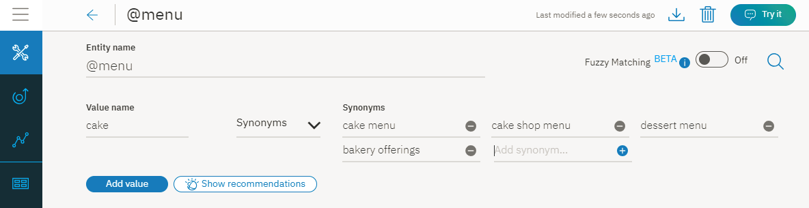
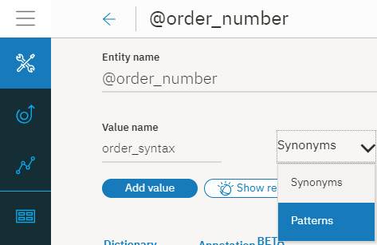
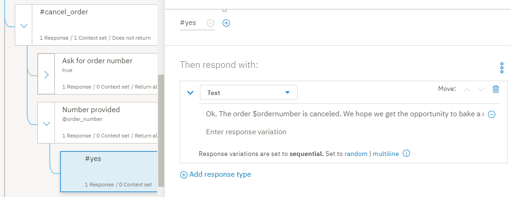
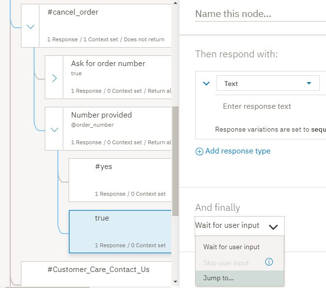

---

copyright:
  years: 2015, 2019
lastupdated: "2019-02-28"

subcollection: assistant

---

{:shortdesc: .shortdesc}
{:new_window: target="_blank"}
{:deprecated: .deprecated}
{:important: .important}
{:note: .note}
{:tip: .tip}
{:pre: .pre}
{:codeblock: .codeblock}
{:screen: .screen}
{:javascript: .ph data-hd-programlang='javascript'}
{:java: .ph data-hd-programlang='java'}
{:python: .ph data-hd-programlang='python'}
{:swift: .ph data-hd-programlang='swift'}
{:gif: data-image-type='gif'}

# Lernprogramm: Komplexes Dialogmodul erstellen
{: #tutorial}

In diesem Lernprogramm erstellen Sie mit dem {{site.data.keyword.conversationshort}}-Service ein Dialogmodul für einen Assistenten, der Benutzer bei Anfragen zu einem fiktiven Restaurant mit dem Namen *Truck Stop Gourmand* unterstützt.
{: shortdesc}

## Lernziele
{: #tutorial-objectives}

Sobald Sie dieses Lernprogramm abgeschlossen haben, wissen Sie, wie Sie Folgendes ausführen:

- Dialogmodul planen
- Angepasste Absichten definieren
- Dialogmodulknoten hinzufügen, die Ihre Absichten verarbeiten können
- Entitäten hinzufügen, um konkretere Antworten zu ermöglichen
- Musterentität hinzufügen und im Dialogmodul verwenden, um Muster in der Benutzereingabe zu finden
- Kontextvariablen festlegen und referenzieren

### Dauer
{: #tutorial-duration}

Für dieses Lernprogramm benötigen Sie ungefähr zwei bis drei Stunden.

### Voraussetzung
{: #tutorial-prereqs}

Arbeiten Sie das [Lernprogramm 'Einführung'](/docs/services/assistant?topic=assistant-getting-started) durch, bevor Sie mit diesem Lernprogramm beginnen.

Sie verwenden den von Ihnen erstellten Dialogskill und fügen Knoten zu dem einfachen Dialogmodul hinzu, das Sie im Rahmen der Einführungsübung erstellt haben.

## Schritt 1: Dialogmodul planen
{: #tutorial-plan}

Sie erstellen einen Assistenten für ein Restaurant mit dem Namen *Truck Stop Gourmand*, das über einen einzigen Standort und eine florierende Kuchenbäckerei verfügt. Sie möchten einen einfachen Assistenten erstellen, der Fragen zum Restaurant, zum Menü des Restaurants und zum Stornieren von Kuchenbestellungen beantwortet. Dafür müssen Sie Absichten erstellen, die Rückfragen zu den folgenden Themen verarbeiten: 

- Informationen zum Restaurant
- Details zum Menü
- Bestellungen stornieren

Zuerst erstellen Sie Absichten für diese Themen und anschließend ein Dialogmodul, das Benutzerfragen zu diesen Themen beantwortet.

## Schritt 2: Fragen zum Restaurant beantworten
{: #tutorial-add-about-intent}

Fügen Sie eine Absicht hinzu, die erkennt, dass Kunden nach Details zu dem Restaurant fragen. Eine Absicht ist der Zweck oder das Ziel, der/das in der Benutzereingabe zum Ausdruck kommt. Die Absicht `#General_About_You`, die im Inhaltskatalog *General* bereitgestellt wird, erfüllt eine ähnliche Funktion, aber die zugehörigen Benutzerbeispiele beziehen sich auf Fragen zu dem Assistenten und nicht zu dem Geschäft, das den Assistenten verwendet, um Kunden zu unterstützen. Aus diesem Grund fügen Sie eine eigene Absicht hinzu. 

### Absicht '#about_restaurant' hinzufügen
{: #tutorial-add-about-restaurant}

1.  Klicken Sie auf der Registerkarte **Absichten** auf **Absicht hinzufügen**.

    
1.  Geben Sie `about_restaurant` in das Feld *Name der Absicht* ein und klicken Sie anschließend auf **Absicht erstellen**.

    
1.  Fügen Sie die folgenden Benutzerbeispiele hinzu:

    ```
    Erzähle mir von dem Restaurant
    ich möchte etwas über sie wissen
    wer sind die restaurantbesitzer und was ist ihre ziel?
    Wie ist die Entstehungsgeschichte?
    Aus welchen Quellen stammen Ihre Produkte?
    Wer ist der Küchenchef und welchen Hintergrund hat er?
    Wie viele Standorte haben Sie?
    bereiten Sie vor Ort zu oder servieren Sie dort auch?
    Haben Sie einen Lieferservice?
    Haben Sie zur Frühstückszeit geöffnet?
    ```
    {: screen}

1.  Klicken Sie auf das Symbol **Schließen** , um das Hinzufügen der Absicht `#about_restaurant` abzuschließen.

Sie haben eine Absicht hinzugefügt und Beispiele für Äußerungen bereitgestellt, die reale Benutzer eingeben könnten, um diese Absicht auszulösen.

### Dialogmodulknoten hinzufügen, der durch die Absicht '#about_restaurant' ausgelöst wird
{: #tutorial-trigger-about-intent}

Fügen Sie einen Dialogmodulknoten hinzu, der erkennt, ob die Benutzereingabe mit der Absicht übereinstimmt, die Sie im vorherigen Schritt erstellt haben. Dies bedeutet, dass die zugehörige Bedingung prüft, ob der Service die Absicht `#about_restaurant` in der Benutzereingabe erkannt hat.

1.  Klicken Sie auf die Registerkarte **Dialogmodule**.
1.  Lokalisieren Sie den Knoten `#General_Greetings` in der Baumstruktur des Dialogmoduls.

    Fügen Sie unterhalb dieses Begrüßungsknotens einen Knoten hinzu, der nach Fragen zu dem Restaurant sucht, um den in einem normalen Dialog zu erwartenden Dialogverlauf abzubilden. Beispiel: `Hallo.` und dann `Erzähl mir von Dir.`

1.  Klicken Sie auf das Symbol **Mehr**  für den Knoten `#General_Greetings` und wählen Sie anschließend **Knoten darunter hinzufügen** aus.

    
1.  Beginnen Sie mit der Eingabe von `#about_restaurant` im Feld **Bedingung eingeben** dieses Knotens. Wählen Sie dann die Option `#about_restaurant` aus.
1.  Fügen Sie den folgenden Text als Antwort hinzu: 

    ```Truck Stop Gourmand ist eine Idee von Gloria und Fred Smith. Was im Jahr 2004 als rollender Imbissstand begann, ist heute ein florierendes Restaurant. Wir führen jetzt ein traditionelles Restaurant in der Innenstadt von Portland. Die größere Küche brauchte natürlich neue Köche, aber sie alle bleiben der Philosophie treu, die schon den Smith-Imbisswagen so populär gemacht hat: frische Lebensmittel aus lokalem Anbau, erfrischend anders und delikat zubereitet. Besuchen Sie uns zum Mittag- oder Abendessen an sieben Tagen in der Woche. Oder bestellen Sie einen Kuchen aus unserer Bäckerei.```    {: codeblock}

1.  Fügen wir noch ein Bild zu der Antwort hinzu. 

    Klicken Sie auf **Antworttyp hinzufügen**. Wählen Sie in der Dropdown-Liste den Eintrag **Bild** aus. Fügen Sie im Feld **Bildquelle** die Angabe `https://www.ibmlearningcenter.com/wp-content/uploads/2018/02/IBM-Learning-Center-Food4.jpg` hinzu.
1.  Verschieben Sie den Antworttyp 'Bild' nach oben, bis er in der Antwort vor dem Text angezeigt wird. Klicken Sie auf den Pfeil **Nach oben**, um die Reihenfolge der beiden Antworttypen zu ändern. 

    

1.  Klicken Sie auf , um die Bearbeitungsansicht zu schließen.

### Dialogmodulknoten '#about_restaurant' testen
{: #tutorial-test-about-intent}

Testen Sie die Absicht. Prüfen Sie dabei, ob ähnliche (nicht identische) Benutzeräußerungen wie die Beispiele, die Sie zu den Trainingsdaten hinzugefügt haben, dazu geführt haben, dass der Service Eingaben mit der Absicht `#about_restaurant` erkennen kann.

1.  Klicken Sie auf das Symbol , um die Anzeige 'Ausprobieren' zu öffnen.

1.  Geben Sie die Nachricht  `Ich möchte mehr über Ihr Restaurant wissen` ein.

    Der Service gibt an, dass die Absicht `#about_restaurant` erkannt wurde, und gibt eine Antwort mit dem Bild und dem Text zurück, das bzw. den Sie für den Dialogmodulknoten angegeben haben.

    

Glückwunsch! Sie haben eine angepasste Absicht hinzugefügt und einen Dialogmodulknoten, der diese Absicht verarbeiten kann.

Die Absicht `#about_restaurant` ist darauf ausgelegt, eine Vielzahl allgemeiner Fragen zu dem Restaurant zu erkennen. Sie haben einen einzelnen Knoten hinzugefügt, um solche Fragen zu erfassen. Die Antwort ist zwar lang, aber sie besteht aus einer einzelnen Anweisung, die potenziell alle Fragen zu den folgenden Themen beantworten kann: 

- Restaurantinhaber
- Geschichte des Restaurants
- Philosophie
- Anzahl der Standorte
- Tage, an denen geöffnet ist
- Angebotene Mahlzeiten
- Bestellmöglichkeit für Kuchen

Für generelle, übergeordnete Fragen kann eine einzelne allgemeine Antwort verwendet werden.

## Schritt 3: Fragen zum Menü beantworten
{: #tutorial-menu}

Eine der wichtigsten Fragen von potenziellen Kunden des Restaurants ist die Frage nach dem Menü. Das Restaurant 'Truck Stop Gourmand' bietet ein täglich wechselndes Menü an. Das Standardmenü wird durch ein vegetarisches Menü und die Kuchenangebote des Backshops ergänzt. Wenn ein Benutzer nach dem Menü fragt, muss das Dialogmenü feststellen, welches Menü gemeint ist, und einen Hyperlink zu dem Menü auf der Webseite des Restaurants bereitstellen, das täglich aktualisiert wird. Informationen, die regelmäßig geändert werden, sollten in einem Dialogmodulknoten nicht fest codiert werden.

### Absicht '#menu' hinzufügen
{: #tutorial-add-menu-intent}

1.  Klicken Sie auf die Registerkarte **Absichten**.
1.  Klicken Sie auf **Absicht hinzufügen**.

    

1.  Geben Sie `menu` in das Feld *Name der Absicht* ein und klicken Sie anschließend auf **Absicht erstellen**.

    

1.  Fügen Sie die folgenden Benutzerbeispiele hinzu:

    ```
    Ich möchte das Menü sehen
    Welche Gerichte bieten Sie an?
    Gibt es heute besondere Angebote?
    wo finde ich infos zu ihrer küche?
    Was wird bei Ihnen serviert?
    Welche Vorspeisen werden angeboten?
    gibt es bei ihnen auch nachtisch?
    In welcher Preisspanne liegen Ihre Gerichte?
    Was kostet ein typisches Gericht?
    sag mir, welche vorspeisen angeboten werden
    Haben Sie ein Festpreismenü?
    ```
    {: screen}

1.  Klicken Sie auf das Symbol **Schließen** , um das Hinzufügen der Absicht `#menu` abzuschließen.

### Dialogmodulknoten hinzufügen, der durch die Absicht '#menu' ausgelöst wird
{: #tutorial-trigger-menu-intent}

Fügen Sie einen Dialogmodulknoten hinzu, der erkennt, ob die Benutzereingabe mit der Absicht übereinstimmt, die Sie im vorherigen Schritt erstellt haben. Dies bedeutet, dass die zugehörige Bedingung prüft, ob der Service die Absicht `#menu` in der Benutzereingabe erkannt hat. 

1.  Klicken Sie auf die Registerkarte **Dialogmodule**.
1.  Lokalisieren Sie den Knoten `#about_restaurant` in der Baumstruktur des Dialogmoduls. 

    Fügen Sie unterhalb dieses Knotens einen Knoten hinzu, der nach Fragen zu Menü sucht. 

1.  Klicken Sie auf das Symbol **Mehr**  im Knoten `#about_restaurant` und wählen Sie anschließend **Knoten darunter hinzufügen** aus.

    

1.  Beginnen Sie mit der Eingabe von `#menu` im Feld **Bedingung eingeben** für diesen Knoten. Wählen Sie dann die Option `#menu` aus.

    

1.  Fügen Sie den folgenden Text als Antwort hinzu: 

    `In unserem Bestreben, nur frische Zutaten aus lokalem Anbau auf den Tisch zu bringen, wird unser Menü täglich an die lokalen Erzeugnisse angepasst, die wir am Morgen frisch hereinbekommen. Das heutige Menü finden Sie auf unserer Website.`

1.  Fügen Sie einen Antworttyp *Option* hinzu, der eine Liste mit Optionen anbietet, die der Benutzer auswählen kann. In diesem Fall enthält die Liste der Optionen verschiedene Versionen des verfügbaren Menüs. 

        Klicken Sie auf **Antworttyp hinzufügen**. Wählen Sie in der Dropdown-Liste den Eintrag **Option** aus. 

    

1.  Fügen Sie in das Feld **Titel** die Frage *Welches Menü möchten Sie ansehen?* ein.

    

1.  Klicken Sie auf **Option hinzufügen**.

1.  Geben Sie in das Feld **Bezeichnung** die Zeichenfolge `Standard` ein. Der Text, den Sie als Bezeichnung hinzufügen, wird in der Antwort an den Benutzer als auswählbare Option angezeigt. 

1.  Geben Sie in das Feld **Wert** die Zeichenfolge `Standardmenü` ein. Der Text, den Sie als Wert angeben, wird als neue Benutzereingabe an den Service gesendet, wenn ein Benutzer diese Option in der Liste auswählt und darauf klickt. 

1.  Wiederholen Sie die beiden vorherigen Schritte, um eine Bezeichnung und einen Wert für jeden weiteren Menütyp hinzuzufügen:

    <table>
    <caption>Details zum Antworttyp 'Option'</caption>
    <tr>
      <th>Bezeichnung</th>
      <th>Wert</th>
    </tr>
    <tr>
      <td>Vegetarisch</td>
      <td>Vegetarisches Menü</td>
    </tr>
    <tr>
      <td>Kuchen</td>
      <td>Kuchenmenü</td>
    </tr>
    </table>

    

1.  Klicken Sie auf , um die Bearbeitungsansicht zu schließen.

### Entität '@menu' hinzufügen
{: #tutorial-add-menu-entity}

Um die verschiedenen Menütypen zu erkennen, die Kunden ansehen möchten, fügen Sie eine Entität `@menu` hinzu. Entitäten stellen eine Objektklasse oder einen Datentyp dar, die bzw. der für den Zweck eines Benutzers relevant ist. Durch das Suchen nach dem Vorhandensein bestimmter Entitäten in der Benutzereingabe können Sie weitere Antworten hinzufügen, die jeweils darauf abgestimmt sind, eine bestimmte Benutzeranfrage zu beantworten. Im vorliegenden Fall fügen Sie eine Entität `@menu` hinzu, um zwischen verschiedenen Menütypen zu unterscheiden. 

1.  Klicken Sie auf die Registerkarte **Entitäten**.

    

1.  Klicken Sie auf **Entität hinzufügen**.

1.  Geben Sie `menu` in das Feld für den Namen der Entität ein. 

    

1.  Klicken Sie auf **Entität erstellen**.

1.  Fügen Sie `Standard` im Feld *Wertname* hinzu, fügen Sie dann `Standardmenü` im Feld **Synonyme** hinzu und drücken Sie die Eingabetaste. 

1.  Fügen Sie die folgenden zusätzlichen Synonyme hinzu: 

    - Speisekarte
    - Küchenzettel
    - Tageskarte

    

1.  Klicken Sie auf **Wert hinzufügen**, um den Wert `@menu:Standard` hinzuzufügen.

1.  Fügen Sie `Vegetarisch` im Feld *Wertname* hinzu, fügen Sie dann `Vegetarisches Menü` im Feld **Synonyme** hinzu und drücken Sie die Eingabetaste.

1.  Klicken Sie auf **Empfehlungen anzeigen** und danach auf die Kontrollkästchen für *fleischlose Kost*, *ohne Fleisch* und *vegane Kost*.

1.  Klicken Sie auf **Ausgewählte hinzufügen**.

1.  Klicken Sie auf das leere Feld *Synonym hinzufügen* und fügen Sie diese zusätzlichen Synonyme hinzu:

    - Vegan
    - Nur Pflanzenkost

    

1.  Klicken Sie auf **Wert hinzufügen**, um den Wert `@menu:Vegetarisch` hinzuzufügen.

1.  Fügen Sie `Kuchen` im Feld *Wertname* hinzu, fügen Sie dann `Kuchenmenü` im Feld **Synonyme** hinzu und drücken Sie die Eingabetaste. 

1.  Fügen Sie die folgenden zusätzlichen Synonyme hinzu:

    - Backshopmenü
    - Dessertmenü
    - Gebäckangebote

    

1.  Klickenf Sie auf **Wert hinzufügen**, um den Wert `@menu:Kuchen` hinzuzufügen.

1.  Klicken Sie auf das Symbol **Schließen** , um das Hinzufügen der Entität `@menu` abzuschließen.

### Untergeordnete Knoten hinzufügen, die durch Typen der Entität '@menu' ausgelöst werden
{: #tutorial-trigger-menu-entity}

In diesem Schritt fügen Sie untergeordnete Knoten zu dem Dialogmodulknoten hinzu, der die Absicht `#menu` erkennen soll. Jeder untergeordnete Knoten gibt eine andere Antwort zurück, die vom jeweiligen Typ der Entität `@menu` abhängt, den der Benutzer in der Liste der Optionen auswählt. 

1.  Klicken Sie auf die Registerkarte **Dialogmodule**.
1.  Lokalisieren Sie den Knoten `#menu` in der Baumstruktur des Dialogmoduls. 

    Sie fügen einen untergeordneten Knoten hinzu, um die einzelnen Optionen für Menütypen zu verarbeiten, die Sie zum Knoten `#menu` hinzugefügt haben.

1.  Klicken Sie auf das Symbol **Mehr**  im Knoten `#menu` und wählen Sie anschließend die Option **Untergeordneten Knoten hinzufügen** aus.

    

1.  Beginnen Sie mit der Eingabe von `@menu:Standard` im Feld **Bedingung eingeben** für diesen Knoten. Wählen Sie dann die Option `@menu:Standard` aus.

1.  Fügen Sie die folgende Nachricht in das Feld für den Antworttext ein: `Unser Menü finden Sie auf der Seite <a href="https://www.example.com/menu.html" target="blank">Menü</a> unserer Website.`

    

1.  Klicken Sie auf , um die Bearbeitungsansicht zu schließen.

1.  Klicken Sie auf das Symbol **Mehr**  im Knoten `@menu:Standard` und wählen Sie anschließend die Option **Knoten darunter hinzufügen** aus.

1.  Beginnen Sie mit der Eingabe von `@menu:Vegetarisch` im Feld **Bedingung eingeben** für diesen Knoten. Wählen Sie dann die Option `@menu:Vegetarisch` aus.

1.  Fügen Sie die folgende Nachricht in das Feld für den Antworttext ein: `Unser vegetarisches Menü finden Sie auf der Seite <a href="https://www.example.com/vegetarian-menu.html" target="blank">Vegetarisches Menü</a> unserer Website.`

    

1.  Klicken Sie auf , um die Bearbeitungsansicht zu schließen.

1.  Klicken Sie auf das Symbol **Mehr**  im Knoten `@menu:Vegetarisch` und wählen Sie anschließend die Option **Knoten darunter hinzufügen** aus.

1.  Beginnen Sie mit der Eingabe von `@menu:Kuchen` im Feld **Bedingung eingeben** für diesen Knoten. Wählen Sie dann die Option `@menu:Kuchen` aus.

1.  Fügen Sie die folgende Nachricht in das Feld für den Antworttext ein: `Unser Backshopmenü finden Sie auf der Seite <a href="https://www.example.com/menu.html" target="blank">Backshopmenü</a> unserer Website.`

    

1.  Klicken Sie auf , um die Bearbeitungsansicht zu schließen.

1.  Da das Standardmenü vermutlich am häufigsten angefordert wird, verschieben Sie es an das Ende der Liste der untergeordneten Knoten. Durch die Positionierung am Ende der Liste wird die Wahrscheinlichkeit geringer, dass versehentlich das Standardmenü aufgerufen wird, wenn ein Benutzer nach einem Spezialmenü fragt.

1.  Klicken Sie auf das Symbol **Mehr**  im Knoten `@menu:Standard` und wählen Sie anschließend **Verschieben** aus.

    

1.  Wählen Sie den Knoten `@menu:Kuchen` aus und wählen Sie anschließend **Unter den Knoten** aus.

    

Sie haben Knoten hinzugefügt, um Benutzeranfragen nach Menüdetails zu erkennen. In Ihrer Antwort wird der Benutzer darüber informiert, dass er von drei verfügbaren Menütypen einen auswählen soll. Wenn der Benutzer einen Menütyp auswählt, wird in einer Antwort ein Hypertext-Link zu einer Webseite mit den angefragten Menüdetails bereitgestellt. 

### Dialogmodulknoten für Menüoptionen testen
{: #tutorial-test-menu-options-intent}

Testen Sie die Dialogmodulknoten, die Sie hinzugefügt haben, um Fragen zum Menü zu erkennen.

1.  Klicken Sie auf das Symbol , um die Anzeige 'Ausprobieren' zu öffnen.

1.  Geben Sie die folgende Frage ein: `Welche Gerichte bieten Sie an?`

    Der Service gibt an, dass die Absicht `#menu` erkannt wurde, und zeigt die Liste der Menüoptionen für den Benutzer zum Auswählen an. 

    
1.  Klicken Sie auf die Option `Backshop`.

    Der Service erkennt die Absicht `#menu` und den Verweis auf die Entität `@menu:Kuchen` und zeigt die folgende Antwort an: `Unser Backshopmenü finden Sie auf der Seite 'Backshop' unserer Website.`

    
1.  Klicken Sie auf den Hyperlink *Backshop* in der Antwort.

    In einer neuen Browserseite wird die Website 'example.com' angezeigt.

1.  Schließen Sie die Browserseite. 

Gut gemacht. Sie haben erfolgreich eine Absicht und eine Entität hinzugefügt, um Benutzeranfragen nach Menüdetails zu erkennen und Benutzer zum gewünschten Menü weiterzuleiten.

Die Absicht `#menu` stellt ein allgemeines und grundlegendes Anliegen von potenziellen Restaurantbesuchern dar. Wegen der Bedeutung und Popularität des Anliegens haben Sie im Dialogmodul einen etwas komplexeren Abschnitt hinzugefügt, um ausführlich darauf einzugehen. 

## Schritt 4: Kuchenbestellungen verwalten
{: #tutorial-manage-orders}

Die Kunden geben Bestellungen persönlich, telefonisch oder über das Bestellformular der Website auf. Nachdem eine Bestellung aufgegeben wurde, kann sie vom Kunden über den virtuellen Assistenten storniert werden. Definieren Sie zunächst eine Entität, die Bestellnummern erkennen kann. Fügen Sie danach eine Absicht hinzu, um zu erkennen, ob ein Benutzer eine Kuchenbestellung stornieren möchte. 

### Entität für Bestellnummernmuster hinzufügen
{: tutorial-add-pattern-entity}

Damit der Assistent Bestellnummern erkennen kann, erstellen Sie eine Musterentität, um das eindeutige Format zu erkennen, das in dem Restaurant als Kennung für Bestellungen verwendet wird. Die  Syntax für Bestellungen an die Bäckerei des Restaurants besteht aus zwei Großbuchstaben, gefolgt von fünf Ziffern. Beispiel: `YR34663`. Fügen Sie eine Entität hinzu, die dieses Zeichenmuster erkennen kann. 

1.  Klicken Sie auf die Registerkarte **Entitäten**.
1.  Klicken Sie auf **Entität hinzufügen**.
1.  Geben Sie `order_number` in das Feld für den Namen der Entität ein.
1.  Klicken Sie auf **Entität erstellen**.

    
1.  Fügen Sie `order_syntax` im Feld *Wertname* hinzu und klicken Sie anschließend auf den Abwärtspfeil neben **Synonyme**, um den Typ in **Muster** zu ändern.

    
1.  Fügen Sie im Feld 'Muster' den folgenden regulären Ausdruck hinzu: `[A-Z]{2}\d{5}`

    

1.  Klicken Sie auf **Wert hinzufügen**.

    

1.  Klicken Sie auf das Symbol **Schließen** , um das Hinzufügen der Entität `@order_number` abzuschließen.

    

### Absicht zum Stornieren einer Bestellung hinzufügen
{: #tutorial-cancel-order-intent}

1.  Klicken Sie auf die Registerkarte **Absichten**.
1.  Klicken Sie auf **Absicht hinzufügen**.
1.  Geben Sie `cancel_order` in das Feld *Name der Absicht* ein und klicken Sie anschließend auf **Absicht erstellen**.
1.  Fügen Sie die folgenden Benutzerbeispiele hinzu:

    ```
    Ich möchte meine Kuchenbestellung stornieren
    Ich muss die eben getätigte Bestellung rückgängig machen
    Kann ich meine Kuchenbestellung stornieren?
    Ich möchte meine Bestellung zurücknehmen
    Es gab eine Änderung. Ich muss meinen Auftrag an die Bäckerei zurücknehmen.
    löschen sie bitte meine bestellung für eine geburtstagstorte, die ich letzte woche aufgegeben habe
    Das Motto der Party wurde geändert; wir brauchen keine Torte mehr
    meine bestellung muss storniert werden.
    ```
    {: screen}

    
1.  Klicken Sie auf das Symbol **Schließen** , um das Hinzufügen der Absicht `#cancel_order` abzuschließen.

### Absicht 'yes' hinzufügen
{: #tutorial-yes-intent}

Bevor Sie im Namen des Benutzers eine Aktion ausführen, müssen Sie die Bestätigung einholen, dass es sich dabei um die gewünschte Aktion handelt. Fügen Sie im Dialogmodul eine Absicht '#yes' hinzu, die erkennt, dass der Benutzer mit der vom Service vorgeschlagenen Aktion einverstanden ist.

1.  Klicken Sie auf die Registerkarte **Absichten**.
1.  Klicken Sie auf **Absicht hinzufügen**.
1.  Geben Sie `yes` in das Feld *Name der Absicht* ein und klicken Sie anschließend auf **Absicht erstellen**.
1.  Fügen Sie die folgenden Benutzerbeispiele hinzu:

    ```
    Ja
    Richtig
    Tun Sie das bitte.
    Das ist richtig.
    Bitte tun Sie das.
    das ist korrekt.
    Das stimmt
    Genau
    Jawohl
    Ja, das möchte ich.
    ```
    {: screen}

    
1.  Klicken Sie auf das Symbol **Schließen** , um das Hinzufügen der Absicht `#yes` abzuschließen.

### Dialogmodulknoten hinzufügen, um Anfragen zum Stornieren einer Bestellung zu verarbeiten
{: #tutorial-cancel-order-dialog}

Fügen Sie jetzt einen Dialogmodulknoten hinzu, der Anfragen zum Stornieren einer Kuchenbestellung verarbeiten kann.

1.  Klicken Sie auf die Registerkarte **Dialogmodul**.
1.  Lokalisieren Sie den Knoten `#menu`. Klicken Sie auf das Symbol **Mehr**  im Knoten `#menu` und wählen Sie anschließend die Option **Knoten darunter hinzufügen** aus.
1.  Beginnen Sie mit der Eingabe von `#cancel_order` im Feld **Bedingung eingeben** für diesen Knoten. Wählen Sie dann die Option `#cancel_order` aus.
1.  Fügen Sie die folgende Nachricht in das Feld für den Antworttext ein: 

    ```
    Wenn die Zeit bis zur Abholung mehr als 48 Stunden beträgt, können Sie Ihre Bestellung noch stornieren.
    ```
    {: codeblock}

    

    Zum Stornieren der Bestellung müssen Sie die Bestellnummer kennen. Der Benutzer hat die Bestellnummer möglicherweise bereits in der Anfrage angegeben. Damit nicht erneut nach der Bestellnummer gefragt wird, suchen Sie in der ursprünglichen Anfrage nach dem Muster für Bestellnummern. Definieren Sie zu diesem Zweck eine Kontextvariable zum Speichern der Bestellnummer, sofern sie angegeben wird.

1.  Öffnen Sie den Kontexteditor. Klicken Sie auf das Symbol **Mehr**  und wählen Sie die Option **Kontexteditor öffnen aus**.

    
1.  Geben Sie das folgende Name/Wert-Paar für die Kontextvariable ein: 

    <table>
    <caption>Details der Kontextvariablen für die Bestellnummer</caption>

    <tr>
      <th>Variable</th>
      <th>Wert</th>
    </tr>
    <tr>
      <td>$ordernumber</td>
      <td><? @order_number.literal ?></td>
    </tr>
    </table>

    Der Wert für die Kontextvariable (`<? @order_number.literal ?>`) ist ein SpEL-Ausdruck, der die vom Benutzer angegebene Zahl erfasst und mit dem von der Musterentität '@order_number' definierten Muster abgleicht. Das Muster wird in der Variablen `$ordernumber` gespeichert.

    
1.  Klicken Sie auf , um die Bearbeitungsansicht zu schließen.

    Fügen Sie jetzt untergeordnete Knoten hinzu, die entweder die Bestellnummer anfordern oder die Bestätigung des Benutzers, dass die Bestellung mit der erkannten Bestellnummer storniert werden soll.
1.  Klicken Sie auf das Symbol **Mehr**  im Knoten `#cancel_order` und wählen Sie anschließend die Option **Untergeordneten Knoten hinzufügen** aus.

    
1.  Fügen Sie eine Bezeichnung hinzu, um den Knoten von weiteren untergeordneten Knoten zu unterscheiden, die Sie später hinzufügen werden. Geben Sie in das Namensfeld die Bezeichnung `Nach Bestellnummer fragen` ein. Geben Sie `true` in das Feld **Bedingung eingeben** für diesen Knoten ein.

1.  Fügen Sie die folgende Nachricht in das Feld für den Antworttext ein: 

    ```
    Wie lautet die Bestellnummer?
    ```
    {: codeblock}

    
1.  Klicken Sie auf , um die Bearbeitungsansicht zu schließen.

    Fügen Sie nun einen weiteren untergeordneten Knoten hinzu, um den Benutzer darüber zu informieren, dass die Bestellung storniert wird.
1.  Klicken Sie auf das Symbol **Mehr**  im Knoten `Nach Bestellnummer fragen` und wählen Sie anschließend die Option **Untergeordneten Knoten hinzufügen** aus.
1.  Geben Sie `@order_number` in das Feld **Bedingung eingeben** für diesen Knoten ein.
1.  Öffnen Sie den Kontexteditor. Klicken Sie auf das Symbol **Mehr**  und wählen Sie die Option **Kontexteditor öffnen aus**.
1.  Geben Sie das folgende Name/Wert-Paar für die Kontextvariable ein: 

    <table>
    <caption>Details der Kontextvariablen für die Bestellnummer</caption>

    <tr>
      <th>Variable</th>
      <th>Wert</th>
    </tr>
    <tr>
      <td>$ordernumber</td>
      <td><? @order_number.literal ?></td>
    </tr>
    </table>

    Der Wert für die Kontextvariable (`<? @order_number.literal ?>`) ist ein SpEL-Ausdruck, der die vom Benutzer angegebene Zahl erfasst und mit dem von der Musterentität '@order_number' definierten Muster abgleicht. Das Muster wird in der Variablen `$ordernumber` gespeichert. 1.  Fügen Sie die folgende Nachricht in das Feld für den Antworttext ein: 

    ```
    OK, Die Bestellung $ordernumber wird storniert. Hoffentlich bekommen wir bald die Gelegenheit, einen Kuchen für Sie zu backen.
    ```
    {: codeblock}

    
1.  Klicken Sie auf , um die Bearbeitungsansicht zu schließen.
1.  Fügen Sie einen weiteren Knoten hinzu, um die Möglichkeit zu erfassen, dass der Benutzer eine ungültige Bestellnummer angibt. Klicken Sie auf das Symbol **Mehr**  im Knoten `@order_number` und wählen Sie anschließend die Option **Knoten darunter hinzufügen** aus.
1.  Geben Sie `true` in das Feld **Bedingung eingeben** für diesen Knoten ein. 
1.  Fügen Sie die folgende Nachricht in das Feld für den Antworttext ein: 

    ```
    Zum Stornieren Ihrer Bestellung benötige ich die Bestellnummer. Wenn Sie die Bestellnummer nicht kennen, rufen Sie uns unter 958-234-3456 an, um die Stornierung durchzuführen.
    ```
    {: codeblock}

    
1.  Klicken Sie auf , um die Bearbeitungsansicht zu schließen.

1.  Fügen Sie unterhalb des ursprünglichen Knotens zum Stornieren der Bestellung einen Antwortknoten hinzu, der dafür sorgt, dass bei Angabe einer Bestellnummer in der ursprünglichen Benutzeranfrage nicht erneut nach der Bestellnummer gefragt wird. Klicken Sie auf das Symbol **Mehr**  im Knoten `#cancel_order` und wählen Sie anschließend die Option **Untergeordneten Knoten hinzufügen** aus.
1.  Fügen Sie eine Bezeichnung hinzu, um den Knoten von anderen untergeordneten Knoten zu unterscheiden. Geben Sie in das Namensfeld die Bezeichnung `Bestellnummer angegeben` ein. Geben Sie `@order_number` in das Feld **Bedingung eingeben** für diesen Knoten ein.
1.  Fügen Sie die folgende Nachricht in das Feld für den Antworttext ein: 

    ```
    Möchten Sie die Bestellung $ordernumber wirklich stornieren?
    ```
    {: codeblock}

    
1.  Klicken Sie auf , um die Bearbeitungsansicht zu schließen.

    Sie müssen untergeordnete Knoten hinzufügen, um die Antwort des Benutzers auf Ihre Bestätigungsanfrage zu prüfen.
1.  Klicken Sie auf das Symbol **Mehr**  im Knoten `Bestellnummer angegeben` und wählen Sie anschließend die Option **Untergeordneten Knoten hinzufügen** aus.
1.  Geben Sie `#yes` in das Feld **Bedingung eingeben** für diesen Knoten ein.

1.  Fügen Sie die folgende Nachricht in das Feld für den Antworttext ein: 

    ```
    OK, die Bestellung $ordernumber wird storniert. Hoffentlich bekommen wir bald die Gelegenheit, einen Kuchen für Sie zu backen.
    ```
    {: codeblock}

    
1.  Klicken Sie auf , um die Bearbeitungsansicht zu schließen.

1.  Klicken Sie auf das Symbol **Mehr**  im Knoten `#yes` und wählen Sie anschließend die Option **Knoten unterhalb hinzufügen** aus.

1.  Geben Sie `true` in das Feld **Bedingung eingeben** für diesen Knoten ein. 

    Fügen Sie keine Antwort hinzu. Stattdessen sollen die Benutzer in die Verzweigung zum Abfragen der Details zur Bestellnummer weitergeleitet werden, die Sie zuvor erstellt haben. 

1.  Wählen Sie im Abschnitt *Abschließend* die Aktion **Springen zu** aus.

    
1.  Wählen Sie die Bedingung für den Knoten *Nach Bestellnummer fragen* aus.

    
1.  Klicken Sie auf , um die Bearbeitungsansicht zu schließen.
1.  Verschieben Sie den Knoten *Bestellnummer angegeben* an eine Position über dem Knoten *Nach Bestellnummer fragen*. Klicken Sie auf das Symbol **Mehr**  im Knoten `Bestellnummer angegeben` und wählen Sie anschließend die Option **Verschieben** aus. Wählen Sie den Knoten *Nach Bestellnummer fragen* aus und klicken Sie dann auf **Über Knoten**.

    
1.  Erzwingen Sie während der Laufzeit des Dialogmoduls die Auswertung der untergeordneten Knoten für den Knoten `#cancel_order`. Klicken Sie auf den Knoten `#cancel_order`, um ihn in der Bearbeitungsansicht zu öffnen, und wählen Sie danach im Abschnitt `Abschließend` die Aktion `Benutzereingabe überspringen` aus.

    

### Stornieren von Bestellungen testen
{: #tutorial-test-cancel-order}

Testen Sie, ob der Service Zeichenmuster in der Benutzereingabe erkennen kann, die mit dem für Bestellnummern verwendeten Muster übereinstimmen.

1.  Klicken Sie auf das Symbol , um die Anzeige 'Ausprobieren' zu öffnen.

1.  Geben Sie die folgende Nachricht ein: `ich möchte meine bestellung mit der nummer TW12345 stornieren.`

    Der Service erkennt sowohl die Absicht `#cancel_order` als auch die Entität `@order_number`. Die folgende Antwort wird ausgegeben: `Wenn die Zeit bis zur Abholung mehr als 48 Stunden beträgt, können Sie Ihre Bestellung noch stornieren. Möchten Sie die Bestellung TW12345 wirklich stornieren?`

1.  Geben Sie `Yes` ein.

    Der Service erkennt die Absicht `#yes` und antwortet mit `Ok. Die Bestellung TW12345 wird storniert. Hoffentlich bekommen wir bald die Gelegenheit, einen Kuchen für Sie zu backen.`

    

    Testen Sie jetzt den Fall, in dem die Bestellnummer nicht bekannt ist.
1.  Klicken Sie in der Anzeige 'Ausprobieren' auf **Inhalt löschen**, um neu zu beginnen. Geben Sie die folgende Nachricht ein: `Ich möchte meine Bestellung stornieren.`

    Der Service erkennt die Absicht `#cancel_order` und antwortet mit: `Wenn die Zeit bis zur Abholung mehr als 48 Stunden beträgt, können Sie Ihre Bestellung noch stornieren. Wie lautet die Bestellnummer?`

1.  Geben Sie `Ich weiß es nicht` ein.

    Der Service antwortet mit `Zum Stornieren Ihrer Bestellung benötige ich die Bestellnummer. Wenn Sie die Bestellnummer nicht kennen, rufen Sie uns unter 958-234-3456 an, um die Stornierung durchzuführen.`

    

Weitere Tests zeigen möglicherweise, dass das Dialogmodul für Szenarios, in denen der Benutzer das Format für Bestellnummern nicht kennt, weniger geeignet ist. Der Benutzer gibt vielleicht die Zahlen allein an oder die Zahlen mit den Buchstaben in Kleinschreibung. Es wäre daher hilfreich, in solchen Fällen entsprechende Hinweise zu geben. Wenn Sie dem Benutzer in diesem Punkt entgegen kommen möchten, fügen Sie in der Baumstruktur des Dialogmoduls einen weiteren Knoten hinzu, um nach Zahlen in der Benutzereingabe zu suchen.

1.  Lokalisieren Sie den Knoten `@order-number`, der ein untergeordneter Knoten des Knotens *Nach Bestellnummer fragen* ist.

1.  Klicken Sie auf das Symbol **Mehr**  im Knoten `@order-number` und wählen Sie anschließend die Option **Knoten darunter hinzufügen** aus.

1.  Fügen Sie im Bedingungsfeld  die Angabe `input.text.find('\d')` hinzu. Dieser SpEL-Ausdruck gibt an, dass diese Antwort ausgelöst werden soll, wenn die Benutzereingabe mindestens eine Zahl enthält. 

1.  Fügen Sie in das Antwortfeld den folgenden Antworttext ein: 

    ```Das korrekte Format für unsere Bestellnummern ist 'AAnnnnn'. Dabei steht jedes 'A' für einen Großbuchstaben und jedes 'n' für eine von insgesamt fünf Zahlen. Haben Sie eine Bestellnummer mit diesem Format?```
    {: codeblock}

1.  Klicken Sie auf , um die Bearbeitungsansicht zu schließen.

1.  Klicken Sie auf das Symbol **Mehr**  im Knoten `input.text.find('\d')` und wählen Sie anschließend die Option **Untergeordneten Knoten hinzufügen** aus.

1.  Geben Sie `true` in das Feld **Bedingung eingeben** für diesen Knoten ein. 

1.  Aktivieren Sie bedingte Antworten, indem Sie auf **Anpassen** klicken und dann das Umschaltsteuerelement *Mehrere Antworten* auf **Ein** setzen.

1.  Klicken Sie auf **Anwenden**.

1.  Geben Sie in das neu hinzugefügte Feld *Bei Erkennung durch Bot* den Wert `@order_number` ein und geben Sie in das Feld *Antworten mit* Folgendes ein:

    ```
    OK, Die Bestellung $ordernumber wird storniert. Hoffentlich bekommen wir bald die Gelegenheit, einen Kuchen für Sie zu backen.
    ```
    {: codeblock}

1.  Klicken Sie auf **Antwort hinzufügen**.

1.  Geben Sie in das Feld *Bei Erkennung durch Bot* den Wert `true` ein und geben Sie in das Feld *Antworten mit* Folgendes ein:

    ```
    Zum Stornieren Ihrer Bestellung benötige ich die Bestellnummer. Wenn Sie die Bestellnummer nicht kennen, rufen Sie uns unter 958-234-3456 an, um die Stornierung durchzuführen.
    ```
    {: codeblock}

    
1.  Klicken Sie auf , um die Bearbeitungsansicht zu schließen.

Beim Testen können Sie nun eine Reihe von Zahlen oder eine Mischung aus Zahlen und Text als Eingabe angeben. Das Dialogmodul weist Sie auf das korrekte Format für Bestellnummern hin. Sie haben Ihr Dialogmodul erfolgreich getestet, sowie eine Schachstelle im Modul gefunden und behoben. 

Eine andere Methode für diese Art von Szenario ist das Hinzufügen eines Knotens mit Slots. Weitere Informationen zum Arbeiten mit Slots enthält das Lernprogramm [Knoten mit Slots zu einem Dialogmodul hinzufügen](/docs/services/assistant?topic=assistant-tutorial-slots).
{:tip}

## Schritt 5: Persönliche Note hinzufügen
{: #tutorial-get-username}

Wenn der Benutzer Interesse an dem Bot zeigt, dann soll der virtuelle Assistent dieses Interesse anerkennen und etwas persönlicher mit dem Benutzer umgehen. Sie erinnern sich vielleicht noch an die Absicht `#General_About_You`, die im Inhaltskatalog *General* bereitgestellt wird und bereits zuvor beim Hinzufügen Ihrer angepassten Absicht `#about_restaurant` in Erwägung gezogen wurde. Sie soll genau solche Fragen der Benutzer erkennen. Fügen Sie einen Knoten hinzu, der sich auf diese Absicht bezieht. In Ihrer Antwort können Sie nach dem Namen des Benutzers fragen und ihn in einer Variablen '$username' speichern, die Sie an anderer Stelle im Dialogmodul verwenden können, falls verfügbar.

Zunächst müssen Sie sicherstellen, dass der Service einen vom Benutzer angegebenen Namen erkennen kann. Zu diesem Zweck können Sie die Entität `@sys-person` aktivieren, die darauf abgestimmt ist, gängige Vor- und Nachnamen (in englischer Sprache) zu erkennen. 

### Systementität für Personen hinzufügen
{: #tutorial-add-person-entity}

Der Service stellt eine Reihe von *Systementitäten* bereit. Hierbei handelt es sich um allgemeine Entitäten, die Sie für jede beliebige Anwendung nutzen können.

1.  Klicken Sie auf die Registerkarte **Entitäten** und anschließend auf **Systementitäten**.

1.  Lokalisieren Sie das Umschaltsteuerelement für die Entität *`@sys-person`* und setzen Sie es auf **Ein**.

    

### Knoten zum Beantworten von Fragen zum Bot hinzufügen
{: #tutorial-add-about-you-node}

Fügen Sie jetzt einen Dialogmodulknoten hinzu, der das Interesse eines Benutzers an dem Bot erkennen und verarbeiten kann.

1.  Klicken Sie auf die Registerkarte **Dialogmodule**.
1.  Lokalisieren Sie den Knoten `Willkommen` in der Baumstruktur des Dialogmoduls.
1.  Klicken Sie auf das Symbol **Mehr**  im Knoten `Willkommen` und wählen Sie anschließend die Option **Knoten darunter hinzufügen** aus.
1.  Beginnen Sie mit der Eingabe von `#General_About_You` im Feld **Bedingung eingeben** für diesen Knoten. Wählen Sie dann die Option `#General_About_You` aus.
1.  Fügen Sie die folgende Nachricht in das Feld für den Antworttext ein: 

    ```
    Ich bin ein virtueller Assistent für die Beantwortung Ihrer Fragen zum Restaurant 'Truck Stop Gourmand'. Wie heißen Sie?
    ```
    {: codeblock}

    
1.  Klicken Sie auf , um die Bearbeitungsansicht zu schließen.
1.  Klicken Sie auf das Symbol **Mehr**  im Knoten `#General_About_You` und wählen Sie anschließend die Option **Untergeordneten Knoten hinzufügen** aus.
1.  Beginnen Sie mit der Eingabe von `@sys-person` im Feld **Bedingung eingeben** für diesen Knoten. Wählen Sie dann die Option `@sys-person` aus.
1.  Fügen Sie die folgende Nachricht in das Feld für den Antworttext ein: 

    ```
    Hallo <? @sys-person.literal ?>! Ich freue mich, Sie kennenzulernen. Wie kann ich Ihnen heute helfen?
    ```
    {: codeblock}

1.  Fügen Sie eine Kontextvariable zu dem Knoten hinzu, um den vom Benutzer angegebenen Namen zu erfassen. Klicken Sie auf das Symbol **Mehr**  und wählen Sie die Option **Kontexteditor öffnen aus**.
1.  Geben Sie das folgende Name/Wert-Paar für die Kontextvariable ein: 

    <table>
    <caption>Details der Kontextvariablen für den Benutzernamen</caption>

    <tr>
      <th>Variable</th>
      <th>Wert</th>
    </tr>
    <tr>
      <td>$username</td>
      <td><? @sys-person.literal ?></td>
    </tr>
    </table>

    Der Wert für die Kontextvariable (`<? @sys-person.literal ?>`) ist ein SpEL-Ausdruck, der den vom Benutzer angegebenen Benutzernamen erfasst und in der Kontextvariablen `$username` speichert.

    
1.  Klicken Sie auf , um die Bearbeitungsansicht zu schließen.
1.  Klicken Sie auf das Symbol **Mehr**  im Knoten `@sys-person` und wählen Sie anschließend die Option **Knoten darunter hinzufügen** aus.

    Sie fügen einen Knoten zum Erfassen von Benutzerantworten hinzu, die keinen Namen enthalten. Wenn der Benutzer keinen Namen angibt, soll der Bot den Dialog trotzdem fortsetzen.
1.  Geben Sie `true` in das Feld **Bedingung eingeben** für diesen Knoten ein.
1.  Fügen Sie die folgende Nachricht in das Feld für den Antworttext ein: 

    ```
    Wie kann ich Ihnen heute helfen?
    ```
    {: codeblock}

    
1.  Klicken Sie auf , um die Bearbeitungsansicht zu schließen.

Wenn der Benutzer diesen Knoten während der Laufzeit auslöst und einen Namen angibt, dann kennen Sie den Namen des Benutzers. In diesem Fall sollten Sie den Namen verwenden. Fügen Sie im Begrüßungsdialogmodul, das Sie zuvor hinzugefügt haben, eine bedingte Antwort hinzu, die den Benutzernamen verwendet, falls er bekannt ist.

### Benutzernamen zur Begrüßung hinzufügen
{: #tutorial-add-username-to-greeting}

Wenn Sie den Namen des Benutzers kennen, sollten Sie ihn in Ihre Begrüßungsnachricht einfügen. Fügen Sie für diesen Zweck bedingte Antworten hinzu, einschließlich einer Begrüßung, die den Namen des Benutzers enthält. 

1.  Lokalisieren Sie den Knoten `#General_Greetings` in der Baumstruktur des Dialogmoduls und klicken Sie auf diesen Knoten, um ihn in der Bearbeitungsansicht zu öffnen.
1.  Klicken Sie auf **Anpassen** und setzen Sie das Umschaltsteuerelement *Mehrere Antworten* auf **Ein**.

    
1.  Klicken Sie auf **Anwenden**.

    
1.  Klicken Sie auf **Antwort hinzufügen**.
1.  Geben Sie in das Feld *Bei Erkennung durch Bot* den Wert `$username` ein und geben Sie in das Feld *Antworten mit* Folgendes ein: 

    ```
    Guten Tag, $username!
    ```
    {: codeblock}

1.  Klicken Sie auf den Aufwärtspfeil für die Antwort 2, um sie an eine Listenposition vor Antwort 1 (`Guten Tag!`) zu verschieben.

    
1.  Klicken Sie auf , um die Bearbeitungsansicht zu schließen.

### Personalisierung testen
{: #tutorial-test-personalize}

Testen Sie, ob der Service einen Benutzernamen erkennen, speichern und anschließend als Anrede für den Benutzer verwenden kann.

1.  Klicken Sie auf das Symbol , um die Anzeige 'Ausprobieren' zu öffnen.

1.  Klicken Sie auf **Inhalt löschen**, um die Dialogmodulsitzung erneut zu starten.

1.  Geben Sie `Wer sind Sie?` ein.

    Der Service erkennt die Absicht `#General_About_You`. Die Antwort des Service endet mit der Frage `Wie heißen Sie?`
1.  Geben Sie Folgendes ein: `Ich heiße Margot Mustermann.`

    Der Service erkennt `Margot Mustermann` als Erwähnung der Entität `@sys-person`. Der Service bestätigt Ihren Namen und fragt dann, was er für Sie tun kann.
1.  Geben Sie `Hallo` ein. 

    Der Service erkennt die Absicht `#General_Greetings` und antwortet mit `Guten Tag, Margot Mustermann!` Dabei wird die Antwort mit der bedingten Antwort verwendet, die den Namen des Benutzers enthält, da die Kontextvariable `$username` zu dem Zeitpunkt, an dem der Knoten für die Begrüßung ausgelöst wird, einen Wert enthält.

    

Sie können eine bedingte Antwort hinzufügen, die den Namen des Benutzers als Bedingung verwendet und diesen Namen in alle weiteren Antworten einfügt, die den Dialog durch die persönliche Anrede aufwerten können.

## Schritt 6: Testen Sie den Assistenten mit Ihrer Webseitenintegration
{: #tutorial-integrate-assistant}

Nachdem Sie eine fortgeschrittene Version des Assistenten erstellt haben, rufen Sie erneut die Webseite auf, die Sie im Rahmen des vorherigen Lernprogramms bereitgestellt haben, und testen Sie die neu hinzugefügten Funktionen.

1.  Öffnen Sie den Assistenten.
1.  Klicken Sie im Bereich *Integrationen* auf **Vorschaulink**.
1.  Klicken Sie auf die URL, die auf der Seite angezeigt wird.

    Sie Seite wird in einer neuen Registerkarte geöffnet.
1.  Wiederholen Sie einige der Testäußerungen, die Sie an das Fenster 'Ausprobieren' übergeben haben, um zu prüfen, wie sich der Assistent in einer realen Integration verhält.

    Im Unterschied zum Senden von Testäußerungen an den Service mithilfe des Fensters 'Ausprobieren', fallen Gebühren für alle API-Aufrufen an, die sich aus Äußerungen ergeben, die an das Chat-Widget übermittelt werden.
    {: note}

## Nächste Schritte
{: #tutorial-deploy}

Nachdem Sie Ihren Dialogskill erstellt und getestet haben, können Sie ihn mit Kunden teilen. Stellen Sie Ihren Skill bereit, indem Sie ihn zunächst mit einem Assistenten verbinden und anschließend den Assistenten bereitstellen. Hierzu stehen Ihnen verschiedene Verfahren zur Verfügung. Weitere Details enthält der Abschnitt [Integrationen hinzufügen](/docs/services/assistant?topic=assistant-deploy-integration-add).
