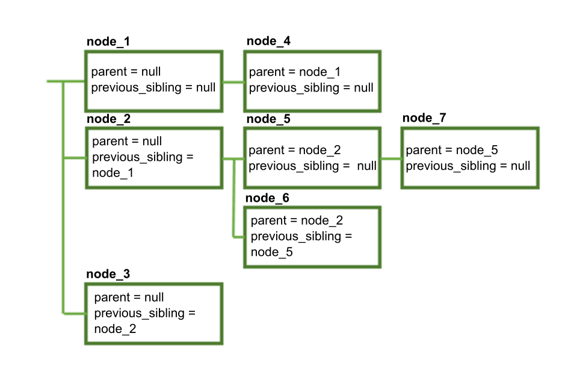
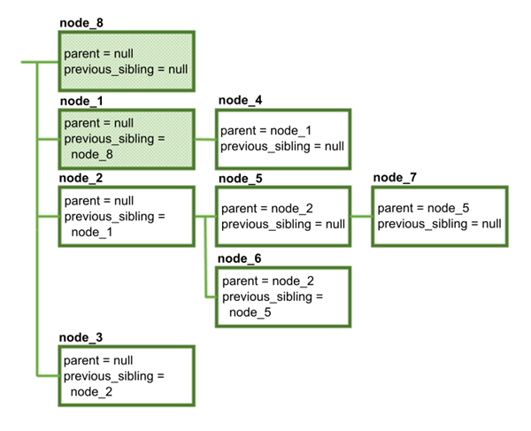
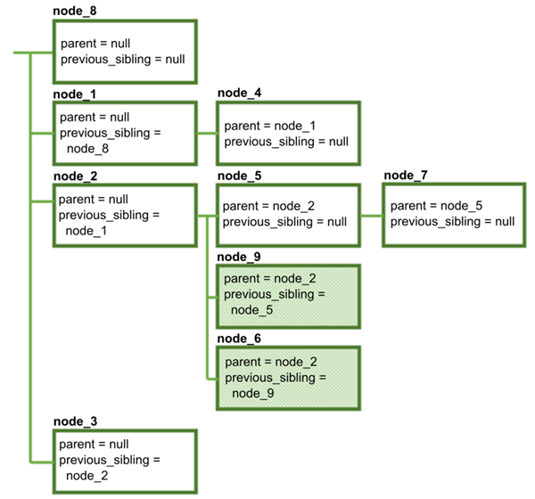
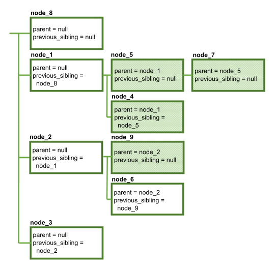
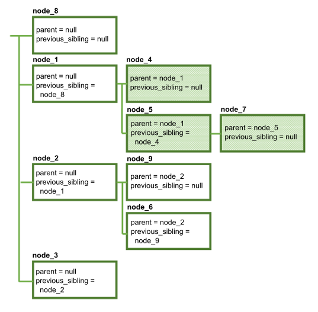
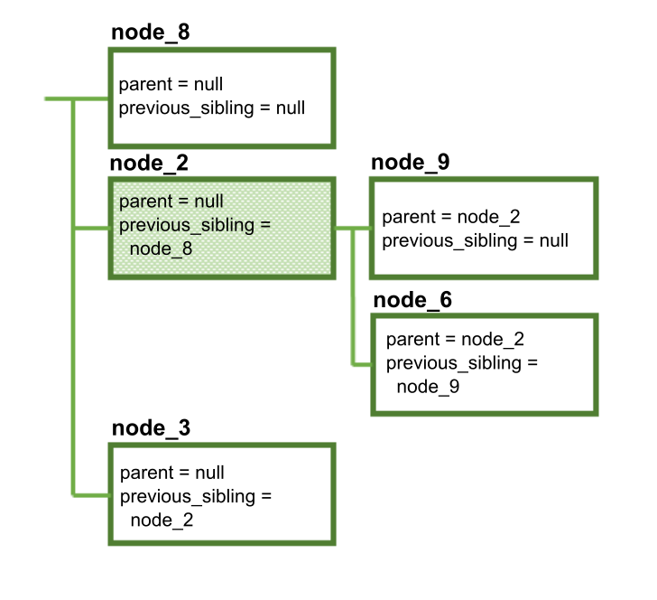
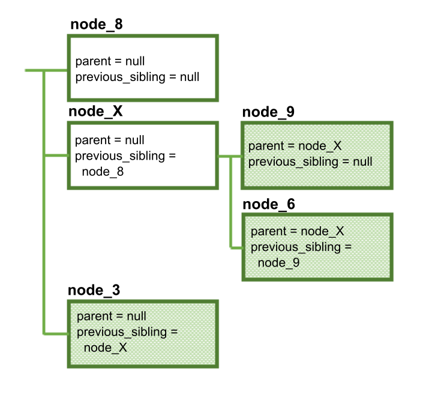

---

copyright:
  years: 2015, 2019
lastupdated: "2019-02-11"

subcollection: assistant


---

{:shortdesc: .shortdesc}
{:new_window: target="_blank"}
{:deprecated: .deprecated}
{:important: .important}
{:note: .note}
{:tip: .tip}
{:pre: .pre}
{:codeblock: .codeblock}
{:screen: .screen}
{:javascript: .ph data-hd-programlang='javascript'}
{:java: .ph data-hd-programlang='java'}
{:python: .ph data-hd-programlang='python'}
{:swift: .ph data-hd-programlang='swift'}

# Modificación de un diálogo mediante la API
{: #api-dialog-modify}

La API REST de {{site.data.keyword.conversationshort}} permite modificar el diálogo mediante programación, sin utilizar la herramienta {{site.data.keyword.conversationshort}}. Puede utilizar la API /dialog_nodes para crear, suprimir o modificar nodos del diálogo.

Recuerde que el diálogo es un árbol de nodos interconectados y para que sea válido debe cumplir ciertas reglas. Esto significa que cualquier cambio que realice en un nodo del diálogo podría tener efectos en cascada en otros nodos o en la estructura del diálogo. Antes de utilizar la API /dialog_nodes para modificar el diálogo, asegúrese de comprender cómo los cambios afectarán al resto del diálogo. Puede hacer una copia de seguridad del diálogo actual exportando el conocimiento en el que reside. Consulte [Descarga de un conocimiento](/docs/services/assistant?topic=assistant-skill-add#download-skill) para obtener más información.

Un diálogo válido siempre satisface los siguientes criterios:

- Cada nodo del diálogo tiene un ID exclusivo (propiedad `dialog_node`).
- Un nodo hijo es consciente de su nodo padre (propiedad `parent`). Sin embargo, un nodo padre no es consciente de sus hijos.
- Un nodo es consciente de su hermano inmediatamente anterior, si lo hay (propiedad `previous_sibling`). Esto significa que todos los hermanos que comparten un mismo padre forman una lista enlazada, en la que cada nodo apunta al nodo anterior.
- Sólo un hijo de un determinado padre puede ser el primer hermano (lo que significa que su `previous_sibling` es nulo).
- Un nodo no puede apuntar a un hermano anterior que sea hijo de otro padre.
- Dos nodos no pueden apuntar al mismo hermano anterior.
- Un nodo puede especificar otro nodo para que sea el siguiente en ejecutarse (propiedad `next_step`).
- Un nodo no puede ser su propio padre ni su propio hermano.
- Un nodo debe tener una propiedad de tipo que contenga uno de los siguientes valores. Si no se especifica el tipo de propiedad, el tipo es `standard`.

  - `event_handler`: Manejador definido para un nodo marco o un nodo de ranura individual.

    En la herramienta, puede definir un manejador de nodo marco pulsando el enlace **Gestionar manejadores** desde un nodo con ranuras. (La interfaz de usuario de la herramienta no expone el manejador de sucesos a nivel de ranura, pero puede definir uno a través de la API.)

  - `frame`: Nodo con uno o varios nodos hijo del tipo `slot`. Todos los nodos hijos necesarios deben ser cumplimentados antes de que el servicio pueda salir del nodo marco.

    En la herramienta, el tipo de nodo marco se representa como un nodo con ranuras. El nodo que contiene las ranuras se representa como un nodo type=`frame`. Es el nodo padre para cada ranura, que se representa como un nodo hijo de tipo `slot`.

  - `response_condition`: Respuesta condicional.

    En la herramienta es posible añadir una o varias respuestas condicionales a un nodo. Cada respuesta condicional que defina está representada en el JSON subyacente como un nodo individual de type=`response_condition`.

  - `slot`: Nodo hijo de un nodo de tipo `frame`.

    Este tipo de nodo está representado en la herramienta como uno de varias ranuras añadidas a un único nodo. Este nodo individual está representado en el JSON como un nodo padre de tipo `frame`.

  - `standard`: Nodo típico del diálogo. Este es el tipo predeterminado.

- Para los nodos de tipo `slot` con el mismo nodo padre, el orden de los nodos hermanos (que especifica la propiedad `previous_sibling`) refleja el orden en el que serán procesados.
- Un nodo del tipo `slot` debe tener un nodo padre del tipo `frame`.
- Un nodo de tipo `frame` debe tener como mínimo un nodo hijo del tipo `slot`.
- Un nodo del tipo `response_condition` debe tener un nodo padre del tipo `standard` o `frame`.
- Nodos del tipo `response_condition` y `event_handler` no pueden tener nodos hijo.
- Un nodo del tipo `event_handler` también debe tener una propiedad `event_name` que contenga uno de los siguientes valores para identificar el tipo del suceso del nodo:

  - `filled`: Define qué hacer si el usuario proporciona un valor que cumple la condición especificada en el campo *Comprobar* de una ranura. Se cumplimenta la ranura. Únicamente hay presente un manejador con este nombre si se ha definido una condición de Encontrado para esta ranura.
  - `focus`: Define la pregunta a mostrar al usuario para proporcionar la información necesaria para la ranura. Únicamente hay presente un manejador con este nombre si la ranura es obligatoria.
  - `generic`: Define una condición para que permita tratar preguntas no relacionadas que el usuario podría realizar al cumplimentar una ranura o un nodo con ranuras.
  - `input`: Actualiza el contexto del mensaje para incluir una variable de contexto con el valor que se recopila de los usuarios para cumplimentar la ranura. Debe existir un manejador con este nombre para cada ranura en el nodo marco.
  - `nomatch`: Define qué hacer si la respuesta del usuario para la solicitud de la ranura no contiene un valor válido. Únicamente hay presente un manejador con este nombre si se ha definido una condición de No encontrado para esta ranura.

  En el diagrama siguiente se muestra dónde en la interfaz de usuario de la herramienta se define el código que se desencadena para cada suceso con nombre.

  

- Un nodo de tipo `event_handler` con un event_name `generic` puede tener un padre del tipo `slot` o `frame`.
- Un nodo de tipo `event_handler` con un event_name de `focus`, `input`, `filled` o `nomatch` debe tener un padre del tipo `slot`.
- Si más de un event_handler con el mismo event_name se asocia al mismo nodo padre, entonces el orden de los hermanos reflejará el orden en que se ejecutarán los manejadores de sucesos.
- Para los nodos de `event_handler` con el mismo nodo de ranura padre, el orden de ejecución es el mismo independientemente de la ubicación de las definiciones de nodo. Los sucesos se desencadenan en este orden por event_name:

  1. focus
  1. input
  1. filled
  1. generic*
  1. nomatch

  *Si se define un `event_handler` con el event_name `generic` para esta ranura o para el marco padre, entonces se ejecuta entre los nodos de event_handler filled y nomatch.

En los ejemplos siguientes se muestra cómo diversas modificaciones pueden provocar cambios en cascada.

## Creación de un nodo
{: #api-dialog-modify-create-node}

Supongamos que tenemos el siguiente árbol de diálogo sencillo:



Podemos crear un nodo nuevo realizando una solicitud POST a /dialog_nodes con el siguiente cuerpo:

```json
{
  "dialog_node": "node_8"
}
```

Ahora el diálogo tiene este aspecto:



Como **node_8** se ha creado sin especificar un valor para `parent` o `previous_sibling`, ahora es el primer nodo del diálogo. Observe que, además de crear **node_8**, el servicio también ha modificado **node_1** de modo que su propiedad `previous_sibling` apunte al nodo nuevo.

Puede crear un nodo en otro lugar del diálogo especificando el padre y el hermano anterior:

```json
{
  "dialog_node": "node_9",
  "parent": "node_2",
  "previous_sibling": "node_5"
}
```

Los valores que especifique para `parent` y `previous_node` deben ser válidos:

- Ambos valores deben hacer referencia a nodos existentes.
- El padre especificado debe ser el mismo que el del hermano anterior (o `null`, si el hermano anterior no tiene padre).
- El padre no puede ser un nodo de tipo `response_condition` ni `event_handler`.

El diálogo resultante tiene este aspecto:



Además de crear **node_9**, el servicio actualiza automáticamente la propiedad `previous_sibling` de *node_6* para que apunte al nuevo nodo.

## Cómo mover un nodo a otro padre
{: #api-dialog-modify-change-parent}

Vamos a mover **node_5** a otro padre con el método POST /dialog_nodes/node_5 con el siguiente cuerpo:

```json
{
  "parent": "node_1"
}
```

El valor que se especifique para `parent` debe ser válido:
- Debe hacer referencia a un nodo existente.
- No debe hacer referencia al nodo que se está modificando (un nodo no puede ser su propio padre).
- No debe hacer referencia a un descendiente del nodo que se está modificando.
- No debe hacer referencia a un nodo de tipo `response_condition` ni `event_handler`.

Esto da lugar a la siguiente estructura modificada:



Aquí han sucedido varias cosas:
- Cuando **node_5** se ha movido a su nuevo padre, **node_7** se ha movido con él (porque el `parent` de **node_7** no ha cambiado). Cuando se mueve un nodo, todos los descendientes de dicho nodo permanecen junto a él.
- Puesto que no se ha especificado un valor `previous_sibling` para **node_5**, ahora es el primer hermano bajo **node_1**.
- La propiedad `previous_sibling` de **node_4** se ha actualizado a `node_5`.
- La propiedad `previous_sibling` de **node_9** se ha actualizado a `null`, porque ahora es el primer hermano bajo **node_2**.

## Reordenación de hermanos
{: #api-dialog-modify-change-sibling}

Ahora convertiremos **node_5** en el segundo hermano en lugar del primero. Lo hacemos con el método POST /dialog_nodes/node_5 con el siguiente cuerpo:

```json
{
  "previous_sibling": "node_4"
}
```

Cuando se modifica `previous_sibling`, el nuevo valor debe ser válido:
- Debe hacer referencia a un nodo existente
- No debe hacer referencia al nodo que se está modificando (un nodo no puede ser su propio hermano)
- Debe hacer referencia a un hijo del mismo padre (todos los hermanos deben tener el mismo padre)

La estructura cambia del siguiente modo:



Observe de nuevo que **node_7** permanece con su padre. Además, **node_4** se ha modificado de modo que su `previous_sibling` es `null`, porque ahora es el primer hermano.

## Supresión de un nodo
{: #api-dialog-modify-delete-node}

Ahora vamos a suprimir **node_1**, utilizando el método DELETE /dialog_nodes/node_1.

El resultado es el siguiente:



Observe que **node_1**, **node_4**, **node_5** y **node_7** se han suprimido. Cuando se suprime un nodo, también se suprimen todos los descendientes de dicho nodo. Por lo tanto, si suprime un nodo raíz, también está suprimiendo una rama entera del árbol del diálogo. Cualquier otra referencia al nodo suprimido (como las referencias `next_step`) se cambian por `null`.

Además, **node_2** se actualiza para que apunte a **node_8** como su nuevo hermano anterior.

## Cambio del nombre de un nodo
{: #api-dialog-modify-rename-node}

Por último, vamos a cambiar el nombre de **node_2** con el método POST /dialog_nodes/node_2 con el siguiente cuerpo:

```json
{
  "dialog_node": "node_X"
}
```



La estructura del diálogo no ha cambiado, pero una vez más varios nodos se han modificado para reflejar el nombre cambiado:

- Las propiedades `parent` de **node_9** y **node_6**
- La propiedad `previous_sibling` de **node_3**

Cualquier otra referencia al nodo suprimido (como las referencias `next_step`) también se han modificado.
