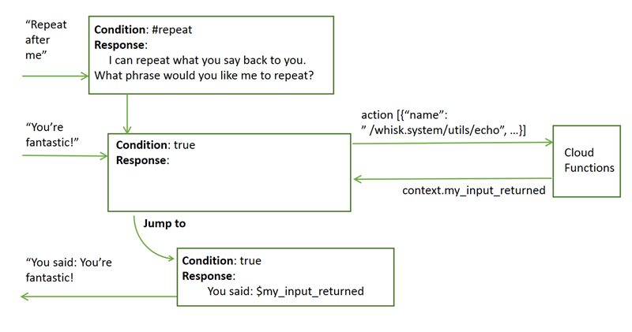

---

copyright:
  years: 2015, 2018
lastupdated: "2018-02-15"

---

{:shortdesc: .shortdesc}
{:new_window: target="_blank"}
{:tip: .tip}
{:pre: .pre}
{:codeblock: .codeblock}
{:screen: .screen}
{:javascript: .ph data-hd-programlang='javascript'}
{:java: .ph data-hd-programlang='java'}
{:python: .ph data-hd-programlang='python'}
{:swift: .ph data-hd-programlang='swift'}

# Cómo realizar llamadas mediante programación desde un nodo de diálogo 
{: #dialog-actions}

Defina las acciones que pueden realizar las llamadas de programación a aplicaciones o servicios externos y obtenga un resultado como parte del proceso que se produce en un diálogo.
{: shortdesc}

Puede utilizar un servicio externo para validar la información que ha recopilado del usuario, o bien realizar cálculos o manipulaciones de series de la entrada que son demasiado complejas para manejarlas mediante expresiones y métodos soportados de SpEL. También puede interactuar con un servicio web externo para obtener información como, por ejemplo, de un servicio de tráfico aéreo para comprobar la hora de llegada esperada del vuelo o a un servicio meteorológico para obtener una previsión. Incluso puede interactuar con una aplicación externa como, por ejemplo, un sitio de reservas de restaurantes, para completar una transacción simple en nombre del usuario. 

<iframe class="embed-responsive-item" id="youtubeplayer" type="text/html" width="640" height="390" src="https://www.youtube.com/embed/y0A6X-KNoB8?rel=0" frameborder="0" webkitallowfullscreen mozallowfullscreen allowfullscreen> </iframe>

Cuando define una llamada mediante programación debe elegir entre uno de los tipos siguientes: 

- **cliente**: Define una llamada mediante programación en un formato estándar que su aplicación de cliente externa puede utilizar para realizar la llamada o la función mediante programación, y devolver el resultado al diálogo. 
- **servidor**: Llama directamente a una acción de {{site.data.keyword.openwhisk_short}} que devuelve el resultado al diálogo. 

    Actualmente, puede llamar a una acción de {{site.data.keyword.openwhisk_short}} desde instancias de {{site.data.keyword.conversationshort}} alojadas en las regiones EE.UU. Sur o Alemania. 

    **Nota**: La instancia de {{site.data.keyword.openwhisk_short}} que se utiliza es una instancia alojada en la misma ubicación (EE.UU. Sur o Alemania). Por lo tanto, no defina una acción en una instancia de {{site.data.keyword.openwhisk_short}} alojada en Alemania si tiene previsto acceder a la misma desde una instancia de servicio de {{site.data.keyword.conversationshort}} alojada en EE.UU. Sur, por ejemplo. 

    **Importante**: Únicamente utilice este método para hacer una llamada a una acción de {{site.data.keyword.openwhisk_short}} que sabe que le responderá **en menos de 5 segundos**. Se excede el tiempo de espera de las solicitudes para {{site.data.keyword.openwhisk_short}} si una llamada de servicio tarda más que eso. Y si el diálogo realiza más de una llamada a un servicio externo, la cantidad total de tiempo permitido para completar las llamadas es de 7 segundos. Si las tres primeras llamadas se completan en 2 segundos cada una de ellas, y la cuarta tarda más de 1 segundo, entonces se detiene la cuarta llamada y se genera un mensaje de error para dicha llamada indicando que esta no se completó. Si tiene que llamar a servicios menos eficientes, gestione la llamada a través de la aplicación de cliente y pase la información al diálogo como un paso separado. 

## Procedimiento
{: #call-action}

Complete los siguientes pasos para realizar una llamada mediante programación desde un nodo de diálogo: 

1.  En el nodo de diálogo desde el que desea realizar la llamada mediante programación, abra el editor JSON.

    - Para realizar una llamada mediante programación que se ejecuta después de evaluar un nodo, abra el editor JSON para la respuesta del nodo. 

      

      Si el valor de **Varias respuestas** se ha **Activado** para el nodo, debe pulsar el icono **Editar respuesta**  para visualizar el menú de **Opciones** . 

      

    Si desea visualizar o continuar con el proceso de la respuesta desde el servicio externo dentro de la misma ronda del diálogo, debe añadir un segundo para este propósito, y saltar al mismo desde este nodo.
    {: tip}

    - Para realizar una llamada que pueda ser utilizada por una ranura individual, pulse el icono **Editar ranura**  y, a continuación: 

      - Para realizar una llamada de programación que se ejecute después de que la condición de la ranura se evalúe como verdadera, abra el editor JSON asociado a la condición de la ranura. 

        

      - Para realizar una llamada mediante programación que se ejecuta después de que la ranura se haya cumplimentado de forma satisfactoria, abra el editor JSON que está asociado con la respuesta Encontrado. Para ello, desde el menú **Opciones**  para la ranura, pulse **Habilitar respuestas condicionales**. Para la respuesta de Encontrado, pulse el icono **Editar respuesta** . Desde el menú **Opciones**  para la respuesta de Encontrado, pulse **Abrir el editor JSON**. 

        

1.  Utilice la sintaxis siguiente para definir la llamada mediante programación. 

    ```json
    {
      "context": {
        "variable_name" : "variable_value"
      },
      "actions": [
        {
          "name":"<actionName>",
          "type":"client | server",
          "parameters": {
            "<parameter_name>":"<parameter_value>",
            "<parameter_name>":"<parameter_value>"
          },
          "result_variable": "<result_variable_name>",
          "credentials": "<reference_to_credentials>"
        }
      ],
      "output": {
        "text": "response text"
      }
    }
    ```
    {: codeblock}

    La matriz `actions` especifica llamadas mediante programación que se realizarán desde el diálogo. Se pueden definir hasta 5 llamadas distintas mediante programación. Especifique los siguientes pares de nombre y valor en la matriz JSON: 

    - `<actionName>`: Necesario. Nombre de la acción o servicio para la llamada. El nombre no puede tener más de 64 caracteres.

       - Para los tipos de acción de cliente, especifique un nombre en la sintaxis que desee. El objetivo es especificar un nombre que su aplicación de cliente pueda reconocer y sepa cómo manejar. 

          Por ejemplo: `calculateRate`

       - Para los tipos de acción (de servidor) de {{site.data.keyword.openwhisk_short}}, utilice esta sintaxis para proporcionar el nombre calificado completo de la acción: `/<namespace>/[<package-name>]/<action name>`

         - Si la acción es parte de un paquete, entonces se necesita la información del `<package-name>`; de lo contrario no es necesario. 
         - Si está llamando a una secuencia de acciones, especifique el `<sequence name>` en lugar del `<action name>`.
         - El espacio de nombres para una acción definida por el usuario habitualmente tiene la sintaxis: `<myIBMCloudOrganizationID>_<myIBMCloudSpace>`. Por ejemplo: `/jdoeorg_prod10/search flights`
         - Las acciones que se proporcionan con {{site.data.keyword.openwhisk_short}} a menudo tienen el espacio de nombres: `whisk.system`, no obstante, siempre debe verificar el espacio de nombres para asegurarse. Por ejemplo: `/whisk.system/weather/forecast`

    - `<type>`: Indica el tipo de llamada a hacer. Elija entre uno de los siguientes tipos: 

      - **client**: Envía un mensaje de respuesta con información sobre la llamada mediante programación en un formato estándar que su aplicación de cliente externa puede utilizar para realizar la llamada o función, y obtener un resultado en nombre del diálogo. El objeto JSON en el cuerpo de la respuesta especifica el servicio o función a la llamada, y los parámetros asociados a pasar con la llamada, y la forma en la que se deben enviar de vuelta los resultados. 

      - **server**: Llama directamente a una o varias acciones de {{site.data.keyword.openwhisk_short}}. Debe definir la propia acción de forma separada con {{site.data.keyword.openwhisk}}. Para obtener más información, consulte a continuación [Creación de una acción de {{site.data.keyword.openwhisk_short}}](dialog-actions.html#create-action). 

      Es opcional especificar el tipo. El valor predeterminado es `client`. 

    - `<action_parameters>`: Parámetros que espera el programa externo, especificado como un objeto JSON. Los parámetros sólo son necesarios si los precisa el programa externo. 

    - `<result_variable_name>`: Nombre que se utiliza para hacer referencia al objeto JSON el servicio o programa externo devuelve. El resultado se añade a la sección de contexto de la respuesta /message. En otras palabras, el resultado se almacena como una variable de contexto de modo que pueda visualizarse en la respuesta del nodo o al que más tarde puedan acceder los nodos del diálogo que se activen. Este valor que devuelve la acción sobrescribe cualquier otro valor existente para la variable de contexto. Puede especificar `result_variable_name` utilizando la siguiente sintaxis: 

      - `my_result`
      - `$my_result`

      El nombre no puede tener más de 64 caracteres. El nombre de variable no puede contener los siguientes caracteres: paréntesis `()`, corchetes (`[]`), comillas simples (`'`), comillas dobles (`"`) o una barra invertida (`\`). 

      Si desea guardar el resultado en la sección de salida o entrada de la respuesta de /message, puede añadir una de las siguientes palabras claves de ubicación al principio de `result_variable_name`: 

       - `output.`: Añade el resultado a la sección de salida de la respuesta /message. Por ejemplo, `output.my_result`.
       - `input.`: Añade el resultado a la sección de entrada de la respuesta /message. Por ejemplo, `input.my_result`.

      También es posible especificar un prefijo de palabra clave de ubicación `context.`. Por ejemplo, `context.my_result`. Sin embargo, no es necesario porque de forma predeterminada el resultado se añade al contexto. 

      Puede incluir puntos en el nombre de variable para crear un objeto JSON anidado. Por ejemplo, puede definir estas variables para capturar los resultados de dos solicitudes independientes para un servicio meteorológico para las previsiones para hoy y mañana: 

      - `context.weather.today`
      - `context.weather.tomorrow`

      Los resultados (los valores del parámetro `temp` y `rain`) se almacenan en el contexto en esta estructura: 
      ```json
      {
        "weather": {
          "today": {
            "temp": "20",
            "rain": "30"
          },
          "tomorrow": {
            "temp": "23",
            "rain": "80"
          }
        }
      }
      ```
      {: codeblock}

      Si varias acciones en una única matriz de acciones JSON añaden el resultado de su llamada mediante programación a la misma variable de contexto, entonces el orden en el que se actualiza el contexto es importante: 

      1. Si tiene una combinación de acciones de servidor y de cliente en la matriz, el servicio procesa en primer lugar las acciones de tipo de servidor. Como consecuencia, el valor que se calcula para la variable de contexto por la última acción de tipo cliente en la matriz sobrescribe el valor calculado para la misma por cualquier otra acción de tipo servidor. 
      1. Por tipo de acción, el orden en el que las acciones se definen en la matriz determina el orden en el que se establece el valor de la variable de contexto. El valor de la variable de contexto devuelto por la última acción en la matriz sobrescribe los valores calculados por cualquier otra acción. 

    - `<reference_to_credentials>`: Nombre del objeto en el que se almacenan las credenciales de {{site.data.keyword.openwhisk_short}}. Únicamente es necesario para las acciones de servidor. Estas credenciales se utilizan para acceder a la instancia de {{site.data.keyword.openwhisk_short}} en la que se ejecuta la acción. No se trata de sus credenciales de {{site.data.keyword.Bluemix_notm}}. 

      Para descubrir las credenciales, siga estos pasos:
      1.  Vaya a la página [Clave de API de {{site.data.keyword.openwhisk_short}} ](https://console.bluemix.net/openwhisk/learn/api-key){: new_window}. 

          - Si todavía no ha creado una cuenta, hágalo. 
          - Si no ha iniciado una sesión, hágalo. 

      1.  Pulse el icono **Mostrar clave de autorización**  para mostrar las credenciales. El segmento anterior a los dos puntos (:) es el ID de usuario. El segmento posterior a los dos puntos es la contraseña.

      **Atención**: Todos los cargos incurridos cuando se ejecuta la acción se cargan a la persona que posee dichas credenciales. 

      Para proteger las credenciales, no las almacene en el espacio de trabajo de {{site.data.keyword.conversationshort}}. En su lugar, páselas desde la aplicación cliente como parte de contexto. Puede evitar que se almacene la información que se almacena en los registros de Watson anidando su variable de contexto dentro de la sección $private del contexto del mensaje. Por ejemplo: `$private.my_credentials`.

      El objeto de credenciales que define debe contener los parámetros `user` y `password`. 

      ```json
      {
        "user":"5tj3b41j-bf3j-5d92-24g9-4a7769ab12af",
        "password":"y65gqSTSRzqE..."
      }
      ```
      {: codeblock}

      Al probar el diálogo, puede establecer de forma temporal la variable de contexto `$private.my_credentials` con los valores reales de nombre de usuario y contraseña de {{site.data.keyword.openwhisk_short}} pulsando **Gestionar contexto** en el panel "Pruébelo" en la herramienta. 

      

## Creación de una acción de {{site.data.keyword.openwhisk_short}}
{: #create-action}

Si elige definir una llamada mediante programación de tipo servidor, antes de poder llamarla desde un diálogo, debe crear la acción en {{site.data.keyword.openwhisk}}. Si está definiendo una llamada de programación de tipo de cliente, omita este procedimiento.

**Nota:** Ejecutar acciones de {{site.data.keyword.openwhisk_short}} podría dar lugar a un coste. Para obtener más información, consulte [Tarifas ](https://console.bluemix.net/openwhisk/learn/pricing){: new_window}. {{site.data.keyword.openwhisk_short}} no distingue entre las llamadas que hacen desde el panel "Pruébelo" durante las pruebas y las llamadas que se hacen desde una aplicación en producción. 

Siga los siguientes pasos para crear una acción de {{site.data.keyword.openwhisk_short}}: 

1.  Vaya al [editor de {{site.data.keyword.openwhisk_short}} en línea ](https://console.ng.bluemix.net/openwhisk/create){: new_window}, donde puede escribir directamente su código en su navegador. 

    También es posible instalar una [interfaz de línea de mandato ](https://console.bluemix.net/openwhisk/learn/cli){: new_window} que permite definir una acción con el código que escribe localmente. 

1.  Cree una acción de {{site.data.keyword.openwhisk_short}} con uno de los lenguajes de programación soportados. Consulte la [Documentación de {{site.data.keyword.openwhisk_short}} ](https://console.ng.bluemix.net/docs/openwhisk/openwhisk_actions.html){: new_window} para obtener más detalles. 

    Tenga en cuenta lo siguiente: 

    - Consulte el [ejemplo de una acción de {{site.data.keyword.openwhisk_short}} ](https://console.ng.bluemix.net/docs/openwhisk/openwhisk_actions.html#openwhisk_apicall_action){: new_window} para ver cómo llamar a un servicio externo. 
    - Para realizar una llamada a un servicio Watson, utilice el [Watson Developer Cloud SDK ](https://github.com/watson-developer-cloud){: new_window} para el lenguaje de programación que desee utilizar. 
    - Asegúrese de que su acción de {{site.data.keyword.openwhisk_short}} acepte los parámetros de entrada como un objeto JSON, y que también devuelva su salida como un objeto JSON. 
    - Si está utilizando Node.js para escribir su acción de {{site.data.keyword.openwhisk_short}}, asegúrese de utilizar `Promise` para el proceso asíncrono. También asegúrese de devolver el resultado final de la función `main`. 

    Como alternativa, puede crear una secuencia de acciones.
    {: tip}

## Manejo de errores

Si la acción de {{site.data.keyword.openwhisk_short}} encuentra un error, el mensaje de error se devuelve al diálogo y se almacena como una propiedad de la variable de respuesta denominada `cloud_functions_call_error`. 
El error podría darse si su acción de {{site.data.keyword.openwhisk_short}} no puede obtener una respuesta para un servicio externo, o si por ejemplo la acción de Cloud Function falla. Si no se proporcionan las credenciales de Cloud Function o si son incorrectas, se devuelve un error. Esta variable de contexto únicamente se utiliza para acciones de servidor; en la aplicación cliente, considere crear un objeto similar que capture información de error y la devuelva al diálogo como una variable de contexto. 

Puede condicionar la respuesta del nodo del diálogo para comprobar en primer lugar si ha habido errores. Por ejemplo, puede asegurarse de que únicamente se muestre una respuesta que haga referencia a una acción de {{site.data.keyword.openwhisk_short}} si no hay errores. Para ello, podría añadir esta expresión a la condición de la respuesta: 

```json
  $forecast_result.cloud_functions_call_error == null
```
{: codeblock}

Para una llamada mediante programación de tipo cliente, podría pasar información sobre el proceso de errores definiendo una variable de contexto como, por ejemplo, `action_error`. Podría pasarla de nuevo al servicio como parte de la variable de resultado. A continuación, únicamente visualizar la respuesta si no se hubiesen encontrado errores definiendo para ello una condición de respuesta como esta: 

```json
  $forecast_result.action_error == null
```
{: codeblock}

## Ejemplo de llamada de cliente
{: #action-client-example}

En el siguiente ejemplo se muestra un ejemplo de una llamada a un servicio meteorológico externo. Se añade al editor JSON que está asociado con la respuesta del nodo. En el momento que se desencadenan la respuesta a nivel de nodo, las ranuras han recopilado y almacenado la información de ubicación y fecha del usuario. En este ejemplo se presupone que se llamará al servicio como un punto final denominado `/weather`, con los parámetros `location` y `date`, y que devolverá un objeto JSON, `{"forecast": "<value>"}`.

 ``` json
{
  "actions": [
    {
      "name": "MyWeatherFunction",
      "type": "client",
      "parameters": {
        "date": "$date",
        "location": "$location"
      },
      "result_variable": "context.my_forecast"
    }
  ]
}
```
{: codeblock}

Normalmente, el servicio solo vuelve al cliente desde una solicitud /message POST cuando se necesita una nueva entrada del usuario, como por ejemplo después de ejecutar un nodo padre y antes de ejecutar uno de sus nodos hijo. Sin embargo, si añade una acción de cliente a un nodo, después de la evaluación, el servicio siempre vuelve al cliente para poder devolver el resultado de la llamada de acción. Para evitar esperar una entrada de usuario cuando no debería ser así, como cuando un nodo está configurado para saltar directamente a un nodo hijo, el servicio añade el siguiente valor al contexto del mensaje:

```json
  {
    "context": {
   "skip_user_input": true
    }
  }
```
{: codeblock}

Si desea que el cliente realice una acción, sin obtener una entrada de usuario, puede seguir la misma convención, y añadir la variable de contexto `skip_user_input` al nodo padre para comunicar este hecho a la aplicación de cliente.

Su aplicación cliente siempre debe comprobar la variable `skip_user_input` en el contexto. Si está presente, sabrá que no debe solicitar una nueva entrada por parte del usuario sino ejecutar la acción, y añadir su resultado al mensaje para pasarlo de vuelta al servicio. La nueva solicitud del mensaje POST debería incluir el mensaje devuelto por la respuesta de mensaje POST anterior (es decir, el contexto, la entrada, las intenciones, las entidades y, de forma opcional, la sección de salida) y, en lugar del objeto JSON que define la llamada mediante programación a realizar, debería incluir el resultado devuelto desde la llamada mediante programación.

En un nodo al que salte después de este nodo, añadiría la respuesta para mostrarla al usuario:

``` json
{
  "output": {
    "text": {
      "values": [
        "It will be $my_forecast $date.literal in $location.literal."
      ]
    }
  }
```
{: codeblock}

En el siguiente diagrama de muestra cómo utilizar una llamada de cliente para obtener la información de previsión meteorológica y cómo devolverla al usuario.


## Ejemplo de llamada de servidor
{: #action-server-example}

En el siguiente ejemplo se muestra el aspecto que tiene una llamada a una acción de {{site.data.keyword.openwhisk_short}}. Este ejemplo muestra cómo utilizar la acción `echo` de {{site.data.keyword.openwhisk_short}} que se definió en el [paquete de programas de utilidad ](https://console.bluemix.net/docs/openwhisk/openwhisk_actions.html#openwhisk_create_action_sequence){: new_window} proporcionado con el servicio. La acción toma una serie de texto y la devuelve.

 ``` json
{
  "actions": [
    {
      "name": "/whisk.system/utils/echo",
      "type":"server",
      "parameters": {
        "message": "<?input.text?>"
      },
      "result_variable": "context.my_input_returned",
      "credentials":"$private.my_credentials"
    }
  ]
}
```
{: codeblock}

Nodos de diálogo posteriores podrán ahora acceder a la salida de la acción de {{site.data.keyword.openwhisk_short}}.

 ``` json
 {
  "output": {
    "text": {
      "values": [
        "Your input was: $my_input_returned."
      ]
    }
  }
}
```
{: codeblock}

En el siguiente diagrama se muestra cómo llamar a una acción de {{site.data.keyword.openwhisk_short}} con un ejemplo simple que llama al servicio incorporado echo de {{site.data.keyword.openwhisk_short}}. Solicita al usuario una entrada que pasa al servicio echo. El servicio echo devuelve el mismo texto, que se visualiza al usuario.



### Ejemplo de acción de echo

Para ver un espacio de trabajo con un diálogo que ya está configurado para llamar a la acción incorporada Echo de {{site.data.keyword.openwhisk_short}}, complete los siguientes pasos:

1.  Descargue el archivo [CloudFunctionsEcho.json ](https://github.com/watson-developer-cloud/community/raw/master/conversation/cloud-functions-echo.json){: new_window}.
1.  Importe el archivo JSON como un nuevo espacio de trabajo.
1.  Revise el diálogo para ver cómo se especifica la llamada a la acción Echo.
1.  Desde el panel "Pruébelo", pulse **Gestionar contexto** y, a continuación establezca de forma temporal las variables de contexto para su nombre de usuario y contraseña de {{site.data.keyword.openwhisk_short}}.

    ```json
    $private.my_credentials
    {
      "user":"<your-CF-instance-username>",
      "password":"<your-CF-instance-password>"
    }
    ```
    {: codeblock}

1.  Pruebe el diálogo especificando alguna entrada.

    El servicio utilizará la acción Echo de {{site.data.keyword.openwhisk_short}} para repetir de nuevo lo que haya especificado.

## Ejemplo de llamada de servidor avanzada
{: #advanced-action-server-example}

Existe la posibilidad de llamar a varias acciones desde un flujo de diálogo individual. De hecho, es posible llamar hasta cinco acciones con un objeto JSON `actions` en un nodo de diálogo individual. Tenga en cuenta que todas las acciones de tipo servidor definidas en la matriz JSON `actions` se procesan en su totalidad en paralelo. Por lo tanto, no puede llamar a una acción de tipo servidor y pasar el resultado desde la misma a una segunda acción de tipo servidor en el mismo bloque `actions`. La mejor manera de llamar a acciones de servidor en una orden específico es utilizar la secuencia de {{site.data.keyword.openwhisk_short}}. En tiempo de ejecución, esta aproximación es más rápida porque el diálogo solo tiene que realizar una llamada externa para completar varias acciones. Para utilizar una secuencia, tan solo haga referencia al nombre de secuencia en lugar de un nombre de acción en la definición del bloque `actions`. Como alternativa, puede llamar a la primera acción de tipo servidor desde un nodo y saltar a un nodo hijo que llame a la siguiente acción de tipo servidor.

Si define una matriz `actions` con una mezcla de acciones de tipo servidor y cliente, cuando se ejecuta el nodo de diálogo, las acciones de cliente no se envían al cliente hasta que no se hayan procesado todas las acciones de tipo servidor.
{: tip}

Los siguientes ejemplos muestran un ejemplo de una llamada a una acción de {{site.data.keyword.openwhisk_short}}.

En este ejemplo, se muestra como utilizar la acción de {{site.data.keyword.openwhisk_short}} para llamar a un servicio externo que toma un nombre de ciudad y devuelve las coordenadas de latitud y longitud de la ubicación proporcionada.

``` json
{
  "actions": [
        {
      "name": "/jdoeorg_prod/get coordinates",
      "type":"server",
      "parameters": {
        "location": "$location"
      },
      "result_variable": "context.my_coordinates",
      "credentials":"$private.my_credentials"
    }
  ]
}
```
{: codeblock}

La variable de contexto `$my_coordinates` guarda los dos valores que el servicio `get coordinates` devuelve de la siguiente manera:

```json
{
 "lat":"42.3611",
 "long":"-71.0571"
}
```
{: codeblock}

En este ejemplo se muestra cómo utilizar la acción `forecast` de {{site.data.keyword.openwhisk_short}} que se define en el [paquete Weather ](https://console.bluemix.net/docs/openwhisk/openwhisk_weather.html#openwhisk_catalog_weather){: new_window} que el servicio de {{site.data.keyword.openwhisk_short}} proporciona. La acción espera coordenadas de latitud y longitud, y un periodo de tiempo. Devuelve un objeto JSON con información de previsión para la ubicación especificada durante el periodo de tiempo especificado. Las coordenadas, devueltas por la acción anterior, se especifican como `$my_coordinates.lat` y `$my_coordinates.long`.

 ``` json
{
  "actions": [
    {
      "name": "/whisk.system/weather/forecast",
      "type":"server",
      "parameters": {
        "latitude": "$my_coordinates.lat",
        "longitude": "$my_coordinates.long",
        "timePeriod": "$period",
        "username": "$private.my_weather_service.username",
        "password": "$private.my_weather_service.password"
      },
      "result_variable": "context.forecasts",
      "credentials":"$private.my_credentials"
    }
  ]
}
```
{: codeblock}

**Nota**: Se lista un nombre de usuario y una contraseña como parámetros. Son los únicos que hay porque esta acción concreta los necesita para definir las credenciales que a su vez necesita el servicio Weather externo al que llama la acción proporcionada en un sistema de fondo. Estas credenciales son diferentes de las credenciales de cuenta de IBM Cloud Function. Tome también las medidas necesarias para proteger estas credenciales.

La salida de la acción de {{site.data.keyword.openwhisk_short}}, que se almacena en la variable `context.forecasts`, puede ser ahora accedida por posteriores nodos del diálogo.

 ``` json
 {
  "output": {
    "text": {
      "values": [
        "For the next $period in $location, you can expect $forecasts."
      ]
    }
  }
}
```
{: codeblock}

En el siguiente diagrama se muestra una interacción compleja. Un usuario solicita una previsión meteorológica. Las ranuras en el nodo del diálogo solicitarán al usuario la información de ubicación y período de tiempo. Para llamar al servicio de previsión meteorológica de {{site.data.keyword.openwhisk_short}}, se deben proporcionar coordinadas geográficas. Por lo tanto, en primer lugar el diálogo obtiene los detalles de latitud y longitud de la ubicación que proporciona el usuario. Para ello, envía una solicitud al servicio de {{site.data.keyword.openwhisk_short}}, que a su vez, la pasa al servicio externo que devuelve la información de las coordenadas. En un nodo posterior, el diálogo envía la información recién obtenida sobre las coordinadas junto con la información del periodo de tiempo que obtuvo del usuario al servicio de previsión meteorológica incorporado de {{site.data.keyword.openwhisk_short}} para obtener los detalles de dicha previsión. El diálogo responde entonces a la pregunta del usuario mostrando el resultado de la previsión que el servicio de previsión de {{site.data.keyword.openwhisk_short}} ha proporcionado.


