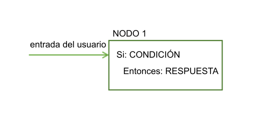
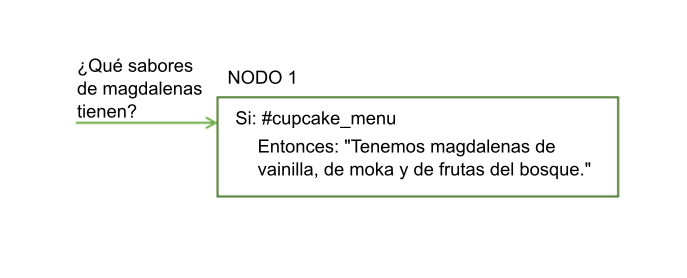
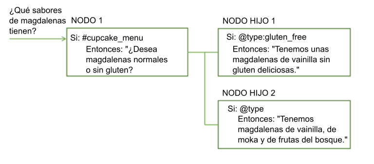
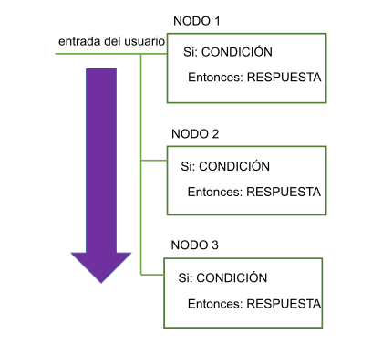
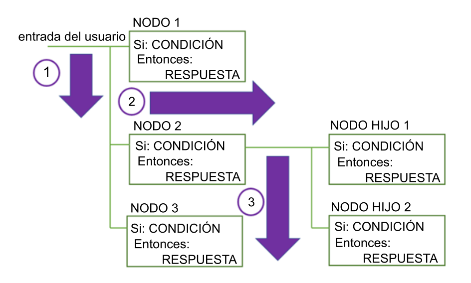
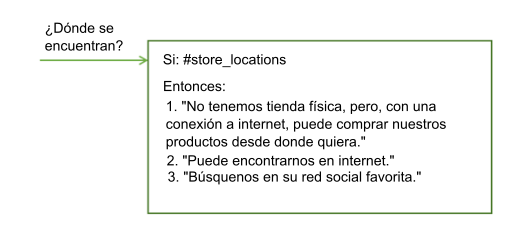

---

copyright:
  years: 2015, 2019
lastupdated: "2019-02-28"

subcollection: assistant

---

{:shortdesc: .shortdesc}
{:new_window: target="_blank"}
{:deprecated: .deprecated}
{:important: .important}
{:note: .note}
{:tip: .tip}
{:pre: .pre}
{:codeblock: .codeblock}
{:screen: .screen}
{:javascript: .ph data-hd-programlang='javascript'}
{:java: .ph data-hd-programlang='java'}
{:python: .ph data-hd-programlang='python'}
{:swift: .ph data-hd-programlang='swift'}
{:table: .aria-labeledby="caption"}

# Visión general del diálogo
{: #dialog-overview}

El diálogo utiliza las intenciones que se identifican en la entrada del usuario, además del contexto de la aplicación, para interactuar con el usuario y finalmente proporcionar una respuesta útil.
{: shortdesc}

El diálogo compara intenciones (lo que dicen los usuarios) con respuestas (lo que responde el bot). La respuesta puede ser la respuesta a una pregunta como `¿Dónde puedo poner gasolina?` o la ejecución de un mandato, como encender la radio. La intención y la entidad podrían ser suficiente información para determinar la respuesta correcta. Otra posibilidad es que el diálogo solicite más información para responder correctamente. Por ejemplo, si un usuario pregunta `¿Dónde puedo comprar comida?` es posible que desee aclarar si busca un restaurante o una tienda de comestibles, para cenar o para llevar, etc. Puede pedir más detalles en una respuesta de texto y crear uno o varios nodos hijo para procesar la nueva entrada.

<iframe class="embed-responsive-item" id="youtubeplayer" title="Visión general del diálogo" type="text/html" width="640" height="390" src="https://www.youtube.com/embed/XkhAMe9gSFU?rel=0" frameborder="0" webkitallowfullscreen mozallowfullscreen allowfullscreen> </iframe>

Nota: El vídeo tiene 15 minutos de duración; en los primeros 5 minutos se explica cómo añadir un nodo.

El diálogo se representa de forma gráfica en la herramienta de {{site.data.keyword.conversationshort}} como un árbol. Cree una rama para procesar cada intención que desea que maneje la conversación. Una rama se compone de varios nodos.

## Nodos del diálogo
{: #dialog-overview-nodes}

Cada nodo del diálogo contiene, como mínimo, una condición y una respuesta.



- Condición: Especifica la información que debe aparecer en la entrada del usuario para este nodo en el diálogo que se va a activar. La información suele ser una intención específica. También puede ser un tipo de entidad, un valor de entidad o un valor de variable de contexto. Consulte [Condiciones](#dialog-overview-conditions) para obtener más información.
- Respuesta: La expresión que el servicio utiliza para responder al usuario. La respuesta también se puede configurar de modo que muestre una imagen o una lista de opciones, o que active acciones mediante programación. Consulte [Respuestas](#dialog-overview-responses) para obtener más información.

Puede pensar en el nodo como si tuviera una construcción de tipo si/entonces (if/then): si esta condición se cumple, entonces devolver esta respuesta.

Por ejemplo, el siguiente nodo se activa si la función de proceso de lenguaje natural del servicio determina que la entrada de usuario contiene la intención `#cupcake-menu`. Como consecuencia de que se active el nodo, el servicio responde con una respuesta adecuada.



Un solo nodo con una condición y respuesta puede gestionar solicitudes sencillas de usuario. Pero generalmente los usuarios tienen preguntas más sofisticadas o desean ayuda con tareas más complejas. Puede añadir nodos hijo que soliciten al usuario que proporcione cualquier información adicional que necesita el servicio.



## Flujo del diálogo
{: #dialog-overview-flow}

El servicio procesa el diálogo que cree desde el primer nodo en el árbol hasta el último.



A medida que baja por el árbol, si el servicio encuentra una condición que se cumple, activa dicho nodo. Luego se mueve por el nodo que ha sido activado para comparar la entrada del usuario con las condiciones de los nodos hijo. A media que se comprueban los nodos hijos, pasa de nuevo desde el primer nodo hijo hasta el último.

Los servicios siguen funcionando de esta forma a través del árbol del diálogo, desde el primer al último nodo, por cada nodo activado, y luego desde el primer al último nodo hijo, por cada nodo hijo activado hasta alcanzar el último nodo de la rama que se está siguiendo.



Cuando empiece a crear el diálogo, debe determinar las ramas para desea incluir y dónde colocarlas. El orden de las ramas es importante porque los nodos se evalúan de primero a último. Se utiliza el primer nodo raíz cuya condición coincida con la entrada; los nodos que hay posteriormente por árbol no se activan.

Cuando el servicio alcanza el final de una rama, o cuando no puede encontrar una condición que se evalúe como verdadera desde el conjunto actual de nodos hijos que está evaluando, salta de nuevo a la base del árbol. Y una vez más, el servicio procesa los nodos raíz del primero al último. Si ninguna de las condiciones se evalúa como verdadera, se devuelve la respuesta del último nodo en el árbol, que normalmente tiene la condición especial `anything_else` que siempre se evalúa como verdadera.

Existe la posibilidad de alterar el flujo estándar de primero a último de las siguientes formas:

- Personalizando lo que sucede después de que se procese un nodo. Por ejemplo, puede configurar un nodo para saltar directamente a otro nodo después de que se haya procesado, incluso si el otro nodo está situado con anterioridad en el árbol. Consulte [Definición de lo que hay que hacer a continuación](#dialog-overview-jump-to) para obtener más información.
- Configurando respuestas condicionales para saltar a otros nodos. Consulte [Respuestas condicionales](#dialog-overview-multiple) para obtener más información.
- Configurando valores de digresión para nodos de diálogo. Las digresiones también pueden afectar a la forma en que los usuarios se mueven por los nodos en tiempo de ejecución. Si habilita las digresiones hacia fuera de la mayoría de los nodos y configura retornos, los usuarios pueden saltar de un nodo a otro y volver de nuevo más fácilmente. Consulte [Digresiones](/docs/services/assistant?topic=assistant-dialog-runtime#dialog-runtime-digressions) para obtener más información.

## Condiciones
{: #dialog-overview-conditions}

Una condición de nodo determina si el nodo se utiliza en la conversación. Las condiciones de respuesta determinan qué respuesta se debe devolver al usuario.

- [Artefactos de condición](#dialog-overview-condition-artifacts)
- [Condiciones especiales](#dialog-overview-special-conditions)
- [Detalles de sintaxis de condición](#dialog-overview-condition-syntax)

Para ver sugerencias sobre cómo realizar acciones más avanzadas en condiciones, consulte [Sugerencias sobre el uso de condiciones](/docs/services/assistant?topic=assistant-dialog-tips#dialog-tips-condition-usage-tips).

### Artefactos de condición
{: #dialog-overview-condition-artifacts}

Puede utilizar uno o varios de los siguientes artefactos en cualquier combinación para definir una condición:

- **Variable de contexto**: El nodo se utiliza si la expresión de la variable de contexto que especifique es verdadera. Utilice la sintaxis, `$nombre_variable:valor` o `$nombre_variable == 'valor'`.

  Para las condiciones de nodo, este tipo de artefacto se suele utilizar con un operador AND u OR y con otro valor de condición. Esto se debe a que algo de la entrada del usuario debe activar el nodo; el valor de la variable de contexto que se compara no es suficiente para activarlo. Por ejemplo, si el objeto de entrada de usuario establece de alguna manera el valor de la variable de contexto, se activa el nodo.

  No defina una condición de nodo en función del valor de una variable de contexto en el mismo nodo del diálogo en el que ha establecido el valor de la variable de contexto.
  {: tip}

  Para las condiciones de respuesta, este tipo de artefacto se puede utilizar solo. Puede cambiar la respuesta en función de un valor de variable de contexto específico. Por ejemplo, `$city:Boston` comprueba si la variable de contexto `$city` contiene el valor `Boston`. Si es así, se devuelve la respuesta.
  
  Para obtener más información sobre las variables de contexto, consulte [Variables de contexto](/docs/services/assistant?topic=assistant-dialog-runtime#dialog-runtime-context).

- **Entidad**: El nodo se utiliza cuando cualquier valor o sinónimo de la entidad se reconoce en la entrada de usuario. Utilice la sintaxis, `@nombre_entidad`. Por ejemplo, `@city` comprueba si se detecta en la entrada de usuario alguno de los nombres de ciudad definidos para la entidad @city. Si es así, se procesa el nodo o la respuesta.

  Tenga en cuenta la posibilidad de crear un nodo igual para manejar los casos en los que no se reconoce ninguno de los valores o sinónimos de la entidad.
  {: tip}

  Para obtener más información sobre las entidades, consulte [Definición de entidades](/docs/services/assistant?topic=assistant-entities).

- **Valor de entidad**: El nodo se utiliza si se detecta el valor de entidad en la entrada de usuario. Utilice la sintaxis, `@nombre_entidad:valor` y especifique un valor definido para la entidad, no un sinónimo. Por ejemplo, `@city:Boston` comprueba si se ha detectado en la entrada de usuario el nombre de ciudad específico `Boston`.

  Si comprueba la presencia de la entidad, sin especificar un valor en particular para la misma, en un nodo de igual, asegúrese de colocar este nodo (que realiza la comprobación de un valor de entidad concreto) antes del nodo de igual que comprueba únicamente la presencia de la entidad. De lo contrario este nodo nunca se evaluará.
  {: tip}

  Si la entidad es una entidad de patrón con grupos de captura, puede comprobar la coincidencia con un determinado valor de grupo. Por ejemplo, puede utilizar la sintaxis: `@us_phone.groups[1] == '617'`.
  Consulte [Almacenamiento y reconocimiento de grupos de entidades de patrón en la entrada](/docs/services/assistant?topic=assistant-dialog-tips#dialog-tips-get-pattern-groups) para obtener más información.

- **Intención**: La condición más sencilla es una sola intención. El nodo se utiliza si, después de que el proceso de lenguaje natural del servicio evalúe la entrada del usuario, determina que la finalidad de la entrada del usuario se correlaciona con la intención predefinida. Utilice la sintaxis, `#nombre_intención`. Por ejemplo, `#weather` comprueba si la entrada del usuario solicita una previsión meteorológica. Si es así, se procesa el nodo con la condición de intención `#weather`.

  Para obtener más información sobre las intenciones, consulte [Definición de intenciones](/docs/services/assistant?topic=assistant-intents).

- **Condición especial**: Condiciones que se proporcionan con el servicio y que puede utilizar para realizar funciones comunes de diálogo. Consulte la tabla **Condiciones especiales** en la siguiente sección para ver detalles.

### Condiciones especiales
{: #dialog-overview-special-conditions}

| Sintaxis de la condición     | Descripción |
|----------------------|-------------|
| `anything_else`      | Puede utilizar esta condición al final de un diálogo para que se procese cuando la entrada de usuario no coincida con ningún otro nodo del diálogo. Esta condición activa el nodo **Anything else**. |
| `conversation_start` | Al igual que **welcome**, esta condición se evalúa como verdadera durante la primera ronda del diálogo. A diferencia de **welcome**, es verdadera tanto si la solicitud inicial de la aplicación contiene la entrada de usuario como si no. Se puede utilizar un nodo con la condición **conversation_start** para inicializar variables de contexto o para realizar otras tareas al principio del diálogo. |
| `false`              | Esta condición siempre se evalúa como falsa. Puede utilizarla al principio de una rama que esté en proceso de desarrollo para impedir que se utilice, o como condición para un nodo que proporciona una función común y solo se utiliza como destino de una acción **Ir a**. |
| `irrelevant`         | Esta condición se evaluará como verdadera si el servicio {{site.data.keyword.conversationshort}} determina que la entrada del usuario es irrelevante. |
| `true`               | Esta condición siempre se evalúa como verdadera. Puede utilizarla al final de una lista de nodos o respuestas para detectar las respuestas que no coincide con ninguna de las condiciones anteriores. |
| `welcome`            | Esta condición se evalúa como verdadera durante la primera vuelta del diálogo (cuando se inicia la conversación), solo si la solicitud inicial procedente de la aplicación no contiene ninguna entrada de usuario. Se evalúa como falsa en todas las demás rondas del diálogo. Esta condición activa el nodo **Welcome**. Normalmente se utiliza un nodo con esta condición para saludar al usuario, por ejemplo para mostrar un mensaje como `Welcome to our Pizza ordering app.` (Bienvenido a nuestra app para pedir pizzas.). Este nodo nunca se procesa durante las interacciones que se producen a través de canales como Facebook o Slack.|
{: caption="Condiciones especiales" caption-side="top"}

### Detalles de sintaxis de condición
{: #dialog-overview-condition-syntax}

Utilice una de estas opciones sintaxis para crear expresiones válidas en condiciones:

- Claves de notaciones para hacer referencia a intenciones, entidades y variables de contexto. Consulte [Acceso y evaluación de objetos](/docs/services/assistant?topic=assistant-expression-language).

- Lenguaje Spring Expression (SpEL), que es un lenguaje de expresión que da soporte a la consulta y manipulación de un gráfico de objetos en tiempo de ejecución. Consulte [Lenguaje Spring Expression Language (SpEL) ](http://docs.spring.io/spring/docs/current/spring-framework-reference/html/expressions.html){: new_window} para obtener más información.

Utilice expresiones regulares para comprobar los valores con los que comparar la condición.  Para encontrar una serie coincidente, por ejemplo, puede utilizar el método `String.find`. Consulte [Métodos](/docs/services/assistant?topic=assistant-dialog-methods) para obtener más detalles.

## Respuestas
{: #dialog-overview-responses}

La respuesta del diálogo define cómo responder al usuario.

Puede responder de las siguientes maneras:

- [Respuesta de texto simple](#dialog-overview-simple-text)
- [Respuestas completas](#dialog-overview-multimedia)
- [Respuestas condicionales](#dialog-overview-multiple)

### Respuesta de texto simple
{: #dialog-overview-simple-text}

Si desea proporcionar una respuesta de texto, simplemente especifique el texto que desea que el servicio muestre al usuario.


Para incluir un valor de variable de contexto en la respuesta, utilice la sintaxis `$variable_name` para especificarlo. Consulte [Variables de contexto](/docs/services/assistant?topic=assistant-dialog-runtime#dialog-runtime-context) para obtener más información. Por ejemplo, si sabe que la variable de contexto $user está establecida en el nombre del usuario actual antes de que se procese un nodo, puede hacer referencia a la misma en la respuesta de texto del nodo de este modo:

```
Hello $user
```
{: screen}

Si el nombre del usuario actual es `Norman`, la respuesta que se muestra a Norman es `Hello Norman`.

Si incluye uno de estos caracteres especiales en una respuesta de texto, coloque un carácter de escape añadiendo una barra inclinada invertida (``\`) al principio. Si utiliza el editor JSON, tiene que utilizar dos barras inclinadas invertidas (``\\`) para definir el carácter de escape. La especificación del carácter de escape evita que el servicio lo malinterprete como uno de los siguientes tipos de artefacto:

| Carácter especial | Artefacto | Ejemplo |
|-------------------|----------|---------|
| `$` | Variable de contexto | `La tasa de la transacción es de \$2.` |
| `@` | Entidad | `Envíenos sus comentarios a feedback\@example.com.` |
{: caption="Caracteres especiales como caracteres de escape en respuestas" caption-side="top"}

Las integraciones incorporadas dan soporte a los siguientes elementos de sintaxis de marcación:

| Formato | Sintaxis | Ejemplo |
|------------|--------|---------|
| Cursiva | `Estamos hablando de *práctica*.` | Estamos hablando de *práctica*. |
| Negrita | `En fútbol **no** existe el llanto.` | En fútbol **no** existe el llanto. |
| Enlace de hipertexto | `Póngase en contacto con nosotros en [ibm.com](https://www.ibm.com).` | Póngase en contacto con nosotros en [ibm.com ](https://www.ibm.com). |
{: caption="Sintaxis de marcación admitida" caption-side="top"}

El panel "Pruébelo" no admite actualmente la sintaxis de marcación. Para incluir un enlace que solo se muestre en el panel "Pruébelo" y en la integración de enlace de vista previa, puede utilizar la sintaxis HTML. Por ejemplo: `Póngase en contacto con nosotros en <a href="https://www.ibm.com">ibm.com</a>.` (*No* intente especificar un carácter de escape en los signos de comillas con una barra inclinada invertida `\"`, por ejemplo.) Sin embargo, la sintaxis de HTML no recibe soporte de ninguna de las otras integraciones incorporadas.
{: note}

#### Más información sobre respuestas simples
{: #dialog-overview-variety}

- [Adición de varias líneas](#dialog-overview-multiline)
- [Adición de variedad](#dialog-overview-add-variety)

#### Adición de varias líneas
{: #dialog-overview-multiline}

Si desea una sola respuesta de texto incluya varias líneas separadas por retornos de carro, siga estos pasos:

1.  Añada cada línea que desee mostrar al usuario como una frase separada en su propio campo de variación de respuesta. Por ejemplo:

  <table>
  <caption>Respuesta de varias líneas</caption>
  <tr>
    <th>Variaciones de respuestas</th>
  </tr>
  <tr>
    <td>Hi.</td>
  </tr>
  <tr>
    <td>How are you today?</td>
  </tr>
  </table>

1.  Para el valor de variación de respuesta, seleccione **multiline**.

    Si utiliza un conocimiento de diálogo creado antes de que se añadiera soporte para tipos de respuesta completa al servicio, es posible que no vea la opción *multiline*. Añada un segundo tipo de respuesta de texto a la respuesta de nodo actual. Esta acción cambia la forma en que se representa la respuesta en el archivo JSON subyacente. Como resultado, la opción de varias líneas pasa a estar disponible. Elija el tipo de variación de varias líneas. Ahora puede suprimir el segundo tipo de respuesta de texto que ha añadido a la respuesta.
    {: note}

Cuando se muestra la respuesta al usuario, se muestran ambas variaciones de respuesta, una en cada línea, del siguiente modo.

```
Hi.
How are you today?
```
{: screen}

#### Adición de variedad
{: #dialog-overview-add-variety}

Si los usuarios vuelven con frecuencia a su servicio de conversación, es posible que se cansen de escuchar siempre el mismo saludo y las mismas respuestas.  Puede añadir *variaciones* a las respuestas para que la conversación puede responder a la misma condición de diferentes maneras.

En este ejemplo, la respuesta que proporciona el servicio en respuesta a las preguntas sobre las ubicaciones de las tiendas difiere entre una interacción y la siguiente:



Puede optar por rotar entre las variaciones de respuestas secuencialmente o en orden aleatorio. De forma predeterminada, las respuestas se rotan secuencialmente, como si fueran seleccionadas en una lista ordenada.

Para cambiar la secuencia en la que se devuelven las respuestas de texto individuales, siga los pasos siguientes:

1.  Añada cada variación de la respuesta en su propio campo de variación de respuesta. Por ejemplo:

  <table>
  <caption>Variación de respuestas</caption>
  <tr>
    <th>Variaciones de respuestas</th>
  </tr>
  <tr>
    <td>Hello.</td>
  </tr>
  <tr>
    <td>Hi.</td>
  </tr>
  <tr>
    <td>Howdy!</td>
  </tr>
  </table>

1.  Para el valor de variación de respuesta, seleccione uno de estos valores:

    - **sequential**: El sistema devuelve la primera variación de respuesta la primera vez que se activa el nodo del diálogo, la segunda variación de respuesta la segunda vez que se activa el nodo, y así sucesivamente, en el orden en que defina las variaciones en el nodo.

      Como resultado, las respuestas se devuelven en el orden siguiente cuando se procesa el nodo:

      - Primera vez:

        ```
        Hello.
        ```
        {: screen}

      - Segunda vez:

        ```
        Hi.
        ```
        {: screen}

      - Tercera vez:
        ```
        Howdy!
        ```
        {: screen}

    - **random**: El sistema selecciona aleatoriamente una serie de texto de la lista de variaciones la primera vez que se activa el nodo de diálogo, y selecciona aleatoriamente otra variación la vez siguiente, sin repetir la misma serie de texto de forma consecutiva.

      Ejemplo del orden en el que se pueden devolver respuestas cuando se procesa el nodo:

      - Primera vez:

        ```
        Howdy!
        ```
        {: screen}

      - Segunda vez:

        ```
        Hi.
        ```
        {: screen}

      - Tercera vez:

        ```
        Hello.
        ```
        {: screen}

### Respuestas completas
{: #dialog-overview-multimedia}

Puede devolver respuestas con elementos multimedia o interactivos, como imágenes o botones que se pueden pulsar, para simplificar el modelo de interacción de la aplicación y mejorar la experiencia del usuario.

Además del tipo de respuesta predeterminado de **texto**, para el que se especifica el texto que se devolverá al usuario como respuesta, se admiten los siguientes tipos de respuesta:

- **Conectar con un agente humano**:  El diálogo llama a un servicio que designa el usuario, normalmente un servicio que gestiona las colas de incidencias de soporte de agente humano, para pasar la conversación a una persona. Si lo desea puede incluir un mensaje que resuma el problema del usuario, el cual se suministrará al agente humano. Es responsabilidad del servicio externo mostrar el mensaje que visualiza el usuario que explica que la conversación se está transfiriendo. El diálogo no gestiona dicha comunicación. La transferencia de diálogo no se produce cuando el usuario prueba nodos con este tipo de respuesta en el panel "Pruébelo". Debe acceder a un nodo que utilice este tipo de respuesta desde un despliegue de prueba para ver cómo lo experimentarán los usuarios.

  Solo pueden ver este tipo de respuesta en instancias de servicio los usuarios de un plan Plus o Premium, y solo recibe soporte con integraciones de aplicaciones Intercom o personalizadas.
  {: note}

- **Imagen**: Se incluye una imagen en la respuesta. El archivo de imagen de origen debe estar alojado en algún lugar y debe tener un URL que se puede utilizar para hacer referencia al mismo. No puede ser un archivo que esté almacenado en un directorio que no sea accesible al público.
- **Opción**: Añade una lista de una o varias opciones. Cuando un usuario pulsa una de las opciones, se envía al servicio un valor asociado de entrada de usuario. La forma en que se representan las opciones puede diferir en función de dónde se haya desplegado el diálogo. Por ejemplo, en un canal de integración, las opciones se pueden visualizar como botones que se pueden pulsar, pero en otra se pueden visualizar como una lista desplegable.
- **Pausa**: Obliga a la aplicación a esperar un número especificado de milisegundos antes de continuar con el proceso. Puede optar por mostrar una indicación de que el diálogo está trabajando en la creación de una respuesta. Utilice este tipo de respuesta si tiene que realizar una acción que podría tardar algún tiempo. Por ejemplo, un nodo padre realiza una llamada a Cloud Function y muestra el resultado en un nodo hijo. Puede utilizar este tipo de respuesta como respuesta para que el nodo padre para dar tiempo a la llamada de programación para que se complete y luego saltar al nodo hijo para mostrar el resultado. Este tipo de respuesta no se representa en el panel "Pruébelo". Debe acceder a un nodo que utilice este tipo de respuesta desde un despliegue de prueba para ver cómo lo experimentarán los usuarios.

#### Adición de respuestas completas
{: #dialog-overview-multimedia-add}

Para añadir una respuesta completa, siga los siguientes pasos:

1.  Pulse el menú desplegable en el campo de respuesta para elegir un tipo de respuesta y, a continuación, proporcione toda la información necesaria:

    - **Conectar con un agente humano**.  Si lo desea, puede añadir un mensaje que se compartirá con el agente de usuario al que se transfiere la conversación.

        Este tipo de respuesta solo recibe soporte con integraciones de Intercom y de aplicaciones personalizadas. En el caso de aplicaciones personalizadas, debe programar la aplicación cliente para que reconozca cuándo se activa este tipo de respuesta.
        {: note}

    - **Imagen**. Añada el URL completo al archivo de imagen alojada en el campo **Origen de imagen**. La imagen debe estar en formato .jpg, .gif o .png. El archivo de imagen debe estar en una ubicación a la que pueda dirigirse públicamente el URL.

        Por ejemplo: `https://www.example.com/assets/common/logo.png`.

        Si desea mostrar el título y la descripción de la imagen sobre la imagen incorporada en la respuesta, añádalos en los campos suministrados.

        Las integraciones de Slack necesitan un título. Otros canales de integración pasan por alto los títulos o las descripciones.
        {: note}

    - **Opción**. Siga los pasos siguientes:

      1.  Pulse **Añadir opción**.
      1.  En el campo **Lista de etiquetas**, especifique la opción que desea visualizar en la lista. La etiqueta debe tener menos de 64 caracteres de longitud.
      1.  En el campo **Valor** correspondiente, especifique la entrada de usuario que se pasará al servicio cuando se seleccione esta opción. El valor debe tener menos de 2.048 caracteres de longitud. (Una limitación actual aplica un límite de 64 caracteres, pero esto está en vías de solución).

          Especifique un valor que sepa que activará la intención correcta cuando se envíe. Por ejemplo, puede ser un ejemplo de usuario de los datos de entrenamiento correspondientes a la intención.
      1.  Repita los pasos anteriores para añadir más opciones a la lista.
      1.  Añada una introducción a la lista en el campo **Título**. El título puede solicitar al usuario que elija una de las opciones de la lista.

          Algunos canales de integración no muestran el título.
          {: note}

      1.  Si lo desea, añada información adicional en el campo **Descripción**. Si se especifica, la descripción se muestra después del título y antes de la lista de opciones.

      Algunos canales de integración no muestran la descripción.
      {: note}

      Por ejemplo, puede crear una respuesta como la siguiente:

        <table>
        <caption>Opciones de respuesta</caption>
        <tr>
          <th>Título de la lista</th>
          <th>Descripción de la lista</th>
          <th>Etiqueta de la opción</th>
          <th>Entrada de usuario que se envía cuando se pulsa</th>
        </tr>
        <tr>
          <td>Insurance types</td>
          <td>Which of these items do you want to insure?</td>
          <td></td>
          <td></td>
        </tr>
        <tr>
          <td></td>
          <td></td>
          <td>Boat</td>
          <td>I want to buy boat insurance</td>
        </tr>
        <tr>
          <td></td>
          <td></td>
          <td>Car</td>
          <td>I want to buy car insurance</td>
        </tr>
         <tr>
          <td></td>
          <td></td>
          <td>Home</td>
          <td>I want to buy home insurance</td>
        </tr>
        </table>

    - **Pausa**. Añada el periodo de tiempo de la pausa como un número de milisegundos (ms) en el campo **Duración**.

        El valor no puede superar los 10.000 ms. Normalmente los usuarios están dispuestos a esperar unos 8 segundos (8.000 ms) para que alguien especifique una respuesta. Para evitar que se visualice un indicador de escritura durante la pausa, seleccione **Desactivado**.

        Añada otro tipo de respuesta, como por ejemplo un tipo de respuesta de texto, después de la pausa para indicar claramente que se ha terminado la pausa.
        {: tip}

    - **Texto**. Añada el texto que se devolverá al usuario en el campo de texto. Si lo desea, elija un valor de variación para la respuesta de texto. Consulte [Respuesta de texto simple](#dialog-overview-simple-text) para ver más detalles.

1.  Pulse **Añadir respuesta** para añadir otro tipo de respuesta a la respuesta actual.

    Es posible que desee añadir varios tipos de respuesta a una sola respuesta para proporcionar una respuesta más completa a una consulta de usuario. Por ejemplo, si un usuario solicita ubicaciones de tiendas, puede mostrar un mapa y un botón para cada ubicación de tienda que el usuario puede pulsar para ver los detalles de la dirección. Para crear ese tipo de respuesta, puede utilizar una combinación de tipos de respuesta de imagen, de opciones y de texto. Otro ejemplo es el uso de un tipo de respuesta de texto antes de un tipo de respuesta de pausa para poder avisar a los usuarios antes de hacer una pausa en el diálogo.

    No puede añadir más de 5 tipos de respuesta a una sola respuesta. Esto significa que, si define tres respuestas condicionales para un nodo de diálogo, no se puede añadir más de 5 tipos de respuesta a cada respuesta condicional.
    {: note}

    Un solo nodo de diálogo no puede tener más de una respuesta **Conectar con un agente humano**.
    {: note}

1.  Si ha añadido más de un tipo de respuesta, puede pulsar las flechas **Subir o bajar** para organizar los tipos de respuesta en el orden que desea que los procese el servicio.

### Respuestas condicionales
{: #dialog-overview-multiple}

Un solo nodo de diálogo puede proporcionar distintas respuestas, cada uno activada por una condición diferente.  Utilice este enfoque para abordar varios escenarios en un solo nodo.

<iframe class="embed-responsive-item" id="youtubeplayer1" title="Adición de respuestas condicionales" type="text/html" width="640" height="390" src="https://www.youtube.com/embed/Q5_-f7_Iyvg?rel=0" frameborder="0" webkitallowfullscreen mozallowfullscreen allowfullscreen> </iframe>

El nodo sigue teniendo una condición principal, que es la condición para utilizar el nodo y procesar las condiciones y respuestas que contiene.

En este ejemplo, el servicio utiliza la información recopilada anteriormente sobre la ubicación del usuario para adaptar su respuesta y proporcionar información sobre la tienda más cercana al usuario. Consulte [Variables de contexto](/docs/services/assistant?topic=assistant-dialog-runtime#dialog-runtime-context) para obtener más información sobre cómo almacenar la información recopilada por el usuario.


Este nodo único ahora proporciona la función equivalente de cuatro nodos separados.

Para añadir respuestas condicionales a un nodo, siga los pasos siguientes:

1.  Pulse **Personalizar** y luego pulse el conmutador **Varias respuestas** para **activarlo**.

    La sección de respuesta de nodo cambia para mostrar un par de campos de condición y respuesta. Puede añadir una condición y una respuesta.
1.  Para personalizar aún más una respuesta, pulse el icono **Editar respuesta**  que hay junto a la respuesta.

    Debe abrir la respuesta para editarla para completar las tareas siguientes:

    - **Actualizar contexto**. Para cambiar el valor de una variable de contexto cuando se activa la respuesta, especifique el valor de contexto en el editor de contexto. El contexto se actualiza para cada respuesta condicional individual; no hay ningún editor de contexto común ni editor de JSON para todas las respuestas condicionales.
    - **Añadir respuestas completas**. Para añadir más de una respuesta de texto o para añadir tipos de respuesta que no sean respuestas de texto a una única respuesta condicional, debe abrir la vista de respuesta de edición.
    - **Configurar un salto**. Para indicar al servicio que salte a otro nodo después de que se procese esta respuesta condicional, seleccione **Ir a** en la *Y finalmente* de la vista de edición de la respuesta. Identifique el nodo que desea que el servicio procese a continuación. Consulte la [Configuración de la acción Ir a](#dialog-overview-jump-to-config) para ver más detalles.

      Una acción **Ir a** configurada para el nodo no se procesa hasta que se procesen todas las respuestas condicionales. Por lo tanto, si una respuesta condicional está configurada para que salte a otro nodo, y se activa la respuesta condicional, el salto configurado para el nodo nunca se procesa y, por lo tanto, no se produce.

1.  Pulse **Añadir respuesta** para añadir otra respuesta condicional.

Las condiciones de un nodo se evalúan en orden, como lo hacen los nodos.  Asegúrese de que sus respuestas condiciones aparecen listadas en el orden correcto.  Si necesita cambiar el orden, seleccione un par de condición y respuesta y súbala o bájela en la lista utilizando las flechas que se visualizan.

## Definición de lo que hay que hacer a continuación
{: #dialog-overview-jump-to}

Después de ofrecer la respuesta especificada, puede indicar al servicio para haga una de estas cosas:

- **Esperar una entrada de usuario**: El servicio espera a que el usuario especifique una nueva entrada que obtiene la respuesta. Por ejemplo, la respuesta puede realizar al usuario una pregunta de tipo sí o no. El diálogo no avanzará hasta que el usuario proporcione más información.
- **Saltar entrada de usuario**: Utilice esta opción cuando desee omitir la espera de la entrada de usuario y en su lugar desee ir directamente al primer nodo hijo del nodo actual.

  Para que esta opción esté disponible, el nodo actual debe tener al menos un nodo hijo.
  {: note}

- **Saltar a otro nodo del diálogo**: Utilice esta opción cuando desee que la conversación vaya directamente a un nodo de diálogo totalmente diferente. Puede utilizar una acción *Ir a* para dirigir el flujo a un nodo de diálogo común, por ejemplo desde varias ubicaciones del árbol.

  El nodo de destino al que desea ir debe existir para configurar la opción Ir a para que lo utilice.
  {: note}

### Configuración de la acción Ir a
{: #dialog-overview-jump-to-config}

Si elige saltar a otro nodo, especifique cuándo se procesa el nodo de destino eligiendo una de las opciones siguientes:

- **Condición**: Si el destino de la sentencia es la sección de la condición del nodo de diálogo seleccionado, el servicio comprueba primero si la condición del nodo de destino se evalúa como verdadera.
    - Si la condición se evalúa como verdadera, el sistema procesa de forma inmediata el nodo de destino.
    - Si la condición no se evalúa como verdadera, el sistema pasa al siguiente nodo hermano del nodo de destino para evaluar su condición, y repite este proceso hasta que encuentra un nodo de diálogo con una condición que se evalúe como verdadera.

    - Si el sistema procesa todos los hermanos y ninguna de las condiciones se evalúa como verdadera, se utiliza la estrategia básica de volver atrás, de forma que el diálogo evalúa los nodos a nivel base del árbol del diálogo.

    Elegir la condición como destino resulta útil para encadenar las condiciones de los nodos del diálogo. Por ejemplo, supongamos que desea comprobar primero si la entrada contiene una intención, como por ejemplo `#turn_on`, y, si es así, es posible que desee comprobar si la entrada contiene entidades, como `@lights`, `@radio` o `@wipers`. El encadenamiento de condiciones ayuda a estructurar los árboles del diálogo.

    Evite elegir esta opción cuando configure un salto desde una respuesta condicional que vaya a un nodo situado encima del nodo actual en el árbol de diálogo. De lo contrario, podría crear un bucle infinito. Si el servicio salta al nodo anterior y comprueba su condición, es probable que devuelva false porque se está evaluando la misma entrada de usuario que ha desencadenado el nodo actual la última vez a través del diálogo. El servicio irá al siguiente hermano o de nuevo al nodo raíz para comprobar las condiciones en estos nodos, y probablemente acabará activando este nodo de nuevo, lo que significa que el proceso se repetirá.
    {: note}

- **Respuesta**: Si el destino de la sentencia es la sección de la respuesta del nodo de diálogo seleccionado, se ejecuta inmediatamente. Esto es, el sistema no evalúa la condición del nodo de diálogo seleccionado sino que procesa inmediatamente la respuesta del nodo de diálogo seleccionado.

  Elegir la respuesta como destino resulta útil para encadenar varios nodos del diálogo. La respuesta se procesa como si la condición de este nodo de diálogo fuera verdadera. Si el nodo del diálogo seleccionado tiene otra acción **Ir a**, dicha acción también se ejecuta inmediatamente.

- **Esperar entrada de usuario**: Espera una entrada nueva del usuario y, a continuación, empieza a procesarla desde el nodo al que ha saltado. Esta opción resulta útil si el nodo de origen solicita una pregunta, por ejemplo, y desea saltar a otro nodo para procesar la respuesta del usuario a la pregunta.

## Más información

Para obtener información sobre el lenguaje de expresión que utiliza el diálogo, más métodos, entidades del sistema y otros detalles útiles, consulte la sección de **Referencia** del panel de navegación.

También puede utilizar la API para añadir nodos o para editar un diálogo. Consulte [Modificación de un diálogo mediante a API](/docs/services/assistant?topic=assistant-api-dialog-modify) para obtener más información.
