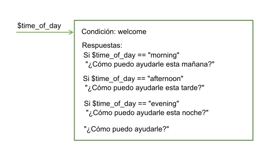
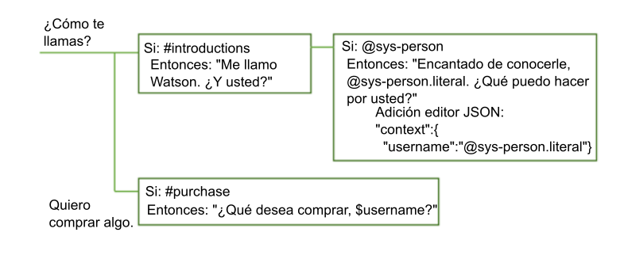
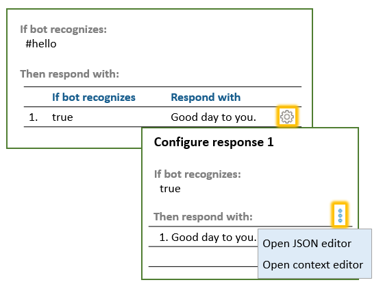

---

copyright:
  years: 2015, 2018
lastupdated: "2018-02-16"

---

{:shortdesc: .shortdesc}
{:new_window: target="_blank"}
{:tip: .tip}
{:pre: .pre}
{:codeblock: .codeblock}
{:screen: .screen}
{:javascript: .ph data-hd-programlang='javascript'}
{:java: .ph data-hd-programlang='java'}
{:python: .ph data-hd-programlang='python'}
{:swift: .ph data-hd-programlang='swift'}

# Cómo se procesa el diálogo
{: #dialog-runtime}

Conozca como se procesa un diálogo en tiempo de ejecución cuando una persona interactúa con su instancia del servicio {{site.data.keyword.conversationshort}} desplegado.
{: shortdesc}

## Anatomía de una llamada de diálogo
{: message-anatomy}

Cada expresión de usuario se pasa al diálogo como una llamada API de /message. Se incluyen las expresiones que los usuarios realizan como respuesta a solicitudes del diálogo donde se le solicita más información. Algunos planes de suscripción incluyen un número establecido de llamadas de API, de modo que ayuda a entender lo que constituye una llamada. Una llamada de API /message individual equivale a una ronda de diálogo individual y está formada por una entrada del usuario y la correspondiente respuesta desde el diálogo. 

El cuerpo de la solicitud y la respuesta de una llamada de API /message incluye los siguientes objetos: 

- `context`: Contiene las variables que están destinadas a ser persistentes. Para pasar información de una llamada a la siguiente, el desarrollador de aplicaciones debe pasar el contexto de la respuesta de la llamada API anterior en cada llamada de API posterior. Por ejemplo, el diálogo puede recopilar el nombre del usuario y, a continuación, hacer referencia al nombre de usuario en nodos posteriores. 

  ```json
  {
    "context" : {
            "user_name" : "<? @sys-person.literal ?>"
    }
  ```
  {: codeblock}

  Consulte [Retención de información a través de rondas de diálogo](dialog-runtime.html#context) para obtener más información. 

- `input`: Serie de texto que el usuario envió. La serie del texto puede contener hasta 2.048 caracteres. 

  ```json
  {
    "input": {
      "text" : "Where's your nearest store?"
    }
  ```
  {: codeblock}

- `output`: Respuesta del diálogo que se visualiza al usuario. Esta sección permite definir objetos, tales como variables, que no están destinadas a ser persistentes. Por ejemplo, si desea suprimir permanentemente una variable de contexto denominada `temp` que ha definido en algún otro lugar del diálogo, puede utilizar la expresión siguiente para hacerlo. 

  ```json
  {
  "output": {
    "text" : {},
    "deleted_variable" : "<? context.remove('temp') ?>"
  ```
  {: codeblock}

  Consulte [Una respuesta compleja](dialog-overview.html#complex) para obtener más información sobre el objeto de salida. 

Obtenga más información sobre las llamadas de API /message en la [Referencia de API ](https://www.ibm.com/watson/developercloud/conversation/api/v1/){: new_window}. 

## Retención de información a través de rondas de diálogo
{: #context}

El diálogo no tiene estado, lo que significa que no retiene información entre una interacción con el usuario y la siguiente. Es responsabilidad del desarrollador de aplicaciones mantener toda la información persistente que necesite la aplicación. La aplicación debe buscar y almacenar el objeto de contexto en la respuesta de la API del mensaje, y pasarlo con la solicitud de API /message siguiente que se realice como parte del flujo de la conversación. 

La forma más sencilla de conservar la información es almacenar todo el objeto de contexto en la memoria la aplicación de cliente - un navegador web, por ejemplo. A medida que aumenta la complejidad de la aplicación, o si es necesario pasar y almacenar información personal, es posible que tenga que almacenar y recuperar la información a partir de una base de datos. 

La aplicación puede pasar información al diálogo, y el diálogo puede actualizar esta información y pasarla a la aplicación o un nodo posterior. El diálogo lo hace mediante variables de contexto.

Una variable de contexto es una variable que el usuario define en un nodo y para la que puede especificar un valor predeterminado. Otros nodos o lógica de aplicación pueden establecer o cambiar posteriormente el valor de la variable de contexto.

Puede definir una condición sobre valores de variables de contexto haciendo referencia a una variable de contexto desde una condición de nodo de diálogo para determinar si se debe ejecutar un nodo. Y puede hacer referencia a una variable de contexto desde condiciones de respuesta del nodo del diálogo para mostrar distintas respuestas, en función de un valor especificado por un servicio externo o por el usuario.

### Cómo pasar contexto desde la aplicación
{: #context-from-app}

Para pasar información de la aplicación al diálogo, defina una variable de contexto y pase la variable de contexto al diálogo.

Por ejemplo, la aplicación puede definir una variable de contexto $time_of_day y pasarla al diálogo, el cual puede utilizar la información para adaptar el saludo que muestra al usuario.



En este ejemplo, el diálogo sabe que la aplicación establece la variable a uno de estos valores: *morning*, *afternoon* o *evening*. Puede comprobar para cada valor, y, dependiendo del valor que encuentre, devolver el saludo adecuado. Si la variable no se pasa o tiene un valor que no coincide con ninguno de los valores esperados, se muestra al usuario un saludo más genérico.

### Cómo pasar contexto de nodo a nodo
{: #context-node-to-node}

El diálogo también puede añadir variables de contexto para pasar información de un nodo a otro o para actualizar los valores de las variables de contexto. Cuando el diálogo solicita y obtiene información del usuario, puede realizar un seguimiento de la información y hacer referencia a la misma más adelante en la conversación.

Por ejemplo, en un nodo puede preguntar a los usuarios cómo se llaman y en un nodo posterior dirigirse a ellos por su nombre.



En este ejemplo, se utiliza la entidad del sistema @sys-person para extraer el nombre del usuario de la entrada si el usuario lo especifica. En el editor JSON, la variable de contexto username se define y se establece en el valor @sys-person. En un nodo posterior, se incluye la variable de contexto $username en la respuesta para dirigirse al usuario por su nombre.

## Definición de una variable de contexto
{: #context-var-define}

Defina una variable de contexto con un par de nombre y valor con uno de los siguientes editores: 

- **Editor de contexto**: Muestra un campo **Variable** y el correspondiente campo de **Valor** en la vista de edición de nodo que podrá cumplimentar con la información del valor y el nombre de variable de contexto. 

  **Nota**: Estos campos se visualizan automáticamente en los nodos que añada. Para los nodos que se han creado con una versión anterior del servicio, debe abrir el editor de contexto para que se añadan los campos. 

- **Editor JSON**: Cuando se abre, ofrece una vista interna del contenido JSON que se pasa con la solicitud API /message que se envía al servicio de {{site.data.keyword.conversationshort}}. Puede definir variables de contexto añadiendo pares de nombre y valor a la sección `"context":{}` del cuerpo JSON. 

El par de nombre y valor debe cumplir estos requisitos:

- El `nombre` puede contener cualquier carácter alfabético en mayúsculas o minúsculas, caracteres numéricos (0-9) y signos de subrayado.

  **Nota**: Puede incluir otros caracteres en el nombre, como puntos y guiones. Sin embargo, si lo hace, debe utilizar uno de los siguientes métodos cada vez que con posterioridad haga referencia a la variable:

  - **context['nombre-variable']**

      La sintaxis de expresión SpEL completa.
  - **$(nombre-variable)**

      Sintaxis abreviada con el nombre de la variable especificado entre paréntesis. Consulte [Acceso y evaluación de objetos](expression-language.html#shorthand-syntax-for-context-variables) para ver más detalles.

- El `valor` puede ser cualquier tipo JSON soportado, como por ejemplo una variable de serie simple, un número o una matriz JSON. Cuando se define la variable de contexto utilizando el editor JSON, puede también puede especificar como valor un objeto JSON. 

En la tabla siguiente se muestra cómo definir pares de nombre y valor en los campos del editor de variables de contexto: 

| Variable  | Valor |
|:---------------|--------------------|
| dessert        | cake               |
| toppings_array | ["onion","olives"] |
| age            | 18                 |

En el siguiente ejemplo de JSON se definen valores para las variables de contexto de cadena $dessert, de matriz $toppings_array y de número $age:

```json
{
  "context": {
    "dessert": "cake",
    "toppings_array": ["onion", "olives"],
    "age": 18
  }
}
```
{: codeblock}

Para definir una variable de contexto, siga estos pasos:

1.  Defina la variable de contexto en la sección del nodo que representa el instante en el que desea establecer la variable durante la evaluación del nodo del diálogo. 

    **Nota**: Todos los valores existentes de las variables de contexto que se definen para este nodo se visualizan en un conjunto de campos de **Variable** y **Valor** correspondientes. Si no desea que se visualicen en la vista de edición del nodo, debe cerrar el editor de contexto. Puede cerrar el editor desde el mismo menú que el utilizado para abrirlo. En los siguientes pasos se describe como acceder al menú. 

    - Para añadir una variable de contexto que se establece o modifica después de que se haya procesado la respuesta del nodo, añada la variable de contexto en la sección de la respuesta. 

      Pulse el icono **Opciones**  que se asocia con la respuesta y, a continuación, elija el editor con una de las siguientes opciones: 

      - **Abrir el editor JSON**
      - **Abrir el editor de contexto**

      

      Si el valor de **Varias respuestas** está **activado** para el nodo, en primer lugar debe pulsar el icono **Editar respuesta** . 

      

    - Para añadir una variable de contexto que se establece o actualiza después de que se satisfaga una condición de ranura, pulse el icono **Editar ranura** . Desde el menú **Opciones**  en la cabecera de la vista *Configurar ranura*, pulse **Abrir editor JSON**. (Para obtener más información sobre las ranuras, consulte [Obtención de información con ranuras](dialog-slots.html)).

      **Nota**: Actualmente no hay una forma de utilizar el editor de contexto para definir variables de contexto que se establecen en esta fase de la evaluación del nodo de diálogo. 

      

    - Para añadir una variable de contexto que se procese después de que se satisfaga una condición de respuesta, pulse el icono **Editar ranura** . Pulse el icono **Opciones**  y, a continuación, seleccione **Habilitar respuestas condicionales**. Pulse el icono **Editar respuesta**  junto a la respuesta que desea asociar a la variable de contexto. Pulse el icono **Opciones**  en la sección de la respuesta y, a continuación, elija el editor con una de las siguientes opciones: 

      - **Abrir el editor JSON**
      - **Abrir el editor de contexto**

      
1.  Para definir la variable de contexto en el editor de contexto, añada el par de nombre y el valor de variable a los campos **Variable** y **Valor**. 
1.  Para definir la variable de contexto en el editor JSON, siga estos pasos adicionales:

    - Añada el bloque `"context":{}` si no está presente. 

      ```json
      {
        "context":{},
      "output":{}
    }
    ```
      {: codeblock}

    - En el bloque de contexto, añada un par de nombre y valor para cada variable que desee definir.

      ```json
      {
            "context":{
      "name": "value"
    },
        "output": {}
      }
      ```
      {: codeblock}

    En este ejemplo, una variable denominada `new_variable` se añade a un bloque de context que ya contiene una variable. 

    ```json
    {
      "context":{
        "existing_variable": "value",
        "new_variable":"value"
      }
    }
    ```
    {: codeblock}

    Para hacer referencia posteriormente a la variable de contexto, utilice la sintaxis `$name`, donde *name* es el nombre de la variable de contexto que ha definido. Por ejemplo, `$new_variable`.  

## Tareas comunes de variables de contexto
{: #context-common-tasks}

Para almacenar toda la serie que ha proporcionado el usuario como entrada, utilice `input.text`:

| Variable| Valor |
|----------|------------------|
| repeat   | `<?input.text?>` |

```json
{
  "context": {
    "repeat": "<?input.text?>"
      }
    }
```
{: codeblock}

Para almacenar el valor de una entidad en una variable de contexto, utilice esta sintaxis:

| Variable| Valor |
|----------|------------------|
| place    | @place           |

```json
{
  "context": {
    "place": "@place"
      }
    }
```
{: codeblock}

Puede añadir un objeto JSON a una variable de contexto utilizando el editor. La expresión siguiente define un objeto full_name que contiene un conjunto de valores, nombre y apellido, que juntos forman el nombre completo de una persona. 

| Variable| Valor |
|---------------|------------------|
| full_name     | { "first":"Paul", "last":"Smith" } |

```json
{
  "context": {
    "full_name": {
      "first":"Paul",
      "last":"Smith"
      }
  }
}
```
{: codeblock}

Si especifica `$full_name.first` en la respuesta, se visualiza `Paul`. 

Para almacenar el valor de una serie extraída de la entrada del usuario, puede incluir una expresión SpEL que utilice el método de extracción para aplicar una expresión regular a la entrada del usuario. La expresión siguiente extrae un número de la entrada del usuario y la almacena en la variable de contexto `$number`. 

| Variable| Valor |
|----------|-------------------------------------|
| número | `<?input.text.extract('[\d]+',0)?>` |

```json
{
  "context": {
   "number": "<?input.text.extract('[\\d]+',0)?>"
  }
}
```
{: codeblock}

Cuando define una expresión regular en el editor JSON, debe codificar con escape las barras invertidas que se utilicen en las expresiones con otra barra invertida (`\\`). No es necesario codificar con escape barras invertidas en las expresiones regulares que se definen utilizando el editor de variables de contexto.
{: tip}

Para almacenar el valor de una entidad de patrón, añada .literal al nombre de entidad. Con esta sintaxis se asegura de que en la variable se almacena el texto exacto de la entrada del usuario que coincide con el patrón especificado.

| Variable| Valor |
|----------|------------------|
| email    | @email.literal   |

```json
{
  "context": {
    "email": "<? @email.literal ?>"
  }
}
```
{: codeblock}

## Supresión de una variable de contexto
{: #context-delete}

Para suprimir una variable de contexto, establezca la variable en null. 

```json
{
  "context": {
    "order_form": null
  }
}
```
{: codeblock}

Si desea eliminar cualquier rastro de la variable de contexto, utilice el método JSONObject.remove(string) para suprimirla del objeto de contexto. Sin embargo, debe utilizar una variable para realizar la eliminación. Defina la nueva variable en la salida del mensaje para que no se guarde más allá de la llamada actual. 

```json
{
  "output": {
    "text" : {},
    "deleted_variable" : "<? context.remove('order_form') ?>"
  }
}
```
{: codeblock}

Alternativamente puede suprimir una variable de contexto en la lógica de su aplicación. 

### Orden de operación
{: #context-order-of-ops}

El orden en el que se definen las variables de contexto no determina el orden en el que las evalúa el servicio. El servicio evalúa las variables, que se definen como pares de nombre y valor de JSON, en orden aleatorio. No establezca un valor en la primera variable de contexto y espere poderlo utilizar en la segunda, ya que no hay ninguna garantía de que la primera variable de contexto de la lista se ejecute antes que la segunda de la lista. Por ejemplo, no utilice dos variables de contexto para implementar lógica que devuelva un número aleatorio comprendido entre cero y un valor superior que se pasa al nodo.

```json
"context": {
    "upper": "<? @sys-number.numeric_value + 1?>",
    "answer": "<? new Random().nextInt($upper) ?>"
}
```
{: codeblock}

Utilice una expresión ligeramente más compleja para no tener que depender de que el valor de la variable de contexto $upper se evalúe antes que la variable de contexto $answer.

```json
"context": {
    "answer": "<? new Random().nextInt(@sys-number.numeric_value + 1) ?>"
}
```
{: codeblock}

### Almacenamiento de valores de entidad de patrón
{: #context-pattern-entities}

Para almacenar el valor de una entidad de patrón en una variable de contexto, añada .literal al nombre de la entidad. Con esta sintaxis se asegura de que en la variable se almacena el texto exacto de la entrada del usuario que coincide con el patrón especificado.

```json
{
  "context": {
    "email": "<? @email.literal ?>"
  }
}
```
{: codeblock}

Para almacenar el texto de un grupo individual en una entidad de patrón donde se hayan definido grupos, especifique el índice de la matriz del grupo que desea almacenar. Por ejemplo, supongamos que el patrón de entidad se define como tal como sigue para la entidad @phone_number. (Recuerde, los paréntesis denotan grupos de patrón):

`\b((958)|(555))-(\d{3})-(\d{4})\b`

Para almacenar solamente el código de área del número de teléfono que se especifica en la entrada de usuario, puede utilizar la sintaxis siguiente:

```json
{
  "context": {
    "area_code": "<? @phone_number.groups[1] ?>"
  }
}
```
{: codeblock}

Los grupos se delimitan mediante la expresión regular que se utiliza para definir el patrón de grupo. Por ejemplo, si la entrada de usuario que coincide con el patrón definido en la entidad `@phone_number` es: `958-234-3456`, se crearían los siguientes grupos: 

| Número de grupo| Valor de motor de expresión regular| Valor de diálogo   | Explicación |
|--------------|---------------------|----------------|-------------|
| groups[0]    | `958-234-3456`      | `958-234-3456` | El primer grupo es siempre la serie coincidente completa. |
| groups[1]    | `((958)`l`(555))`   | `958`          | Serie que coincide con la expresión regular del primer grupo definido, que es `((958)`l`(555))`. |
| groups[2]    | `(958)`             | `958`          | Coincidencia con relación al grupo que se incluye como el primer operando en la expresión OR `((958)`l`(555))` |
| groups[3]    | `(555)`             | `null`         | Sin coincidencia con relación al grupo que se incluye como el segundo operando en la expresión OR `((958)`l`(555))` |
| groups[4]    | `(\d{3})`           | `234`          | Serie que coincide con la expresión regular que se ha definido para el grupo. |
| groups[5]    | `(\d{4})`           | `3456`         | Serie que coincide con la expresión regular que se ha definido para el grupo. |
{: caption="Detalles de grupo" caption-side="top"}

Para ayudarle a averiguar qué número de grupo se debe utilizar para capturar la sección de la entrada en la que está interesado, puede extraer información sobre todos los grupos al mismo tiempo. Utilice la sintaxis siguiente para crear una variable de contexto que devuelve una matriz con todas las coincidencias de entidad de patrón agrupadas: 

```json
{
  "context": {
    "array_of_matched_groups": "<? @phone_number.groups ?>"
  }
}
```
{: codeblock}

Utilice el panel "Pruébelo" para especificar algunos valores de prueba como número de teléfono. Para la entrada `958-123-2345`, esta expresión establece `$array_of_matched_groups` en `["958-123-2345","958","958",null,"123","2345"]`. 

Puede contar entonces cada valor en la matriz, empezando desde 0, para obtener el número de grupo para la misma. 

| Valor de elemento de matriz | Número de elemento de matriz |
|---------------------|----------------------|
| "958-123-2345"      | 0 |
| "958"               | 1 |
| "958"               | 2 |
| null                | 3 |
| "123"               | 4 |
| "2345"              | 5 |
{: caption="Elementos de matriz" caption-side="top"}

Es fácil determinar que, por ejemplo, para capturar los últimos cuatro dígitos del número de teléfono, necesita el grupo núm. 5. 

Para devolver la estructura JSONArray que se ha creado para representar la entidad del patrón agrupado, utilice la sintaxis siguiente: 

```json
{
  "context": {
    "json_matched_groups": "<? @phone_number.groups_json ?>"
  }
}
```
{: codeblock}

Esta expresión establece `$json_matched_groups` en la siguiente matriz JSON: 

```json
[
  {"group": "group_0","location": [0, 12]},
  {"group": "group_1","location": [0, 3]},
  {"group": "group_2","location": [0, 3]},
  {"group": "group_3"},
  {"group": "group_4","location": [4, 7]},
  {"group": "group_5","location": [8, 12]}
]
```
{: codeblock}

**Nota**: `location` es una propiedad de una entidad que utiliza un desplazamiento de caracteres que empieza por cero para indicar dónde empieza y acaba el valor de la entidad detectada en el texto de entrada. 

Si espera recibir dos números de teléfono en la entrada, puede comprobar los dos números de teléfono. Si están presentes, utilice la siguiente sintaxis para capturar, por ejemplo, el código de área del segundo número. 

```json
{
  "context": {
    "second_areacode": "<? entities['phone_number'][1].groups[1] ?>"
  }
}
```
{: codeblock}

Si la entrada es `I want to change my phone number from 958-234-3456 to 555-456-5678` (Deseo cambiar mi número de teléfono de 958-234-3456 a 555-456-5678), `$second_areacode` es `555`. 

## Actualización de un valor de variable de contexto
{: #context-update}

Si un nodo establece el valor de una variable de contexto que ya está establecido, el valor anterior se sobrescribe.

### Actualización de un objeto JSON complejo

Los valores anteriores se sobrescribe para todos los tipos de JSON, excepto para un objeto JSON. Si la variable de contexto es un tipo complejo como un objeto JSON, se utiliza un procedimiento de fusión de JSON para actualizar la variable. La operación de fusión añade las propiedades recién definidas y sobrescribe las propiedades existentes del objeto.

En este ejemplo, se define una variable de contexto de nombre como un objeto complejo.

```json
{
  "context": {
    "complex_object": {
      "user_firstname" : "Paul",
      "user_lastname" : "Pan",
      "has_card" : false
    }
  }
}
```
{: codeblock}

Un nodo de diálogo actualiza el objeto JSON de la variable de contexto con los valores siguientes:

```json
{
  "complex_object": {
    "user_firstname": "Peter",
    "has_card": true
  }
}
```
{: codeblock}

El resultado es este contexto:

```json
{
  "complex_object": {
    "user_firstname": "Peter",
    "user_lastname": "Pan",
    "has_card": true
  }
}
```
{: codeblock}

Consulte [Métodos del lenguaje de expresión](dialog-methods.html#objects) para obtener más información sobre los métodos que puede aplicar a los objetos. 

### Actualización de matrices

Si los datos de contexto del diálogo contienen una matriz de valores, puede actualizar la matriz añadiendo valores, eliminando un valor o sustituyendo todos los valores.

Elija una de estas acciones para actualizar la matriz. En cada caso, vemos la matriz antes de la acción, la acción y la matriz después de que se haya aplicado la acción.

- **Append**: Para añadir valores al final de una matriz, utilice el método `append`.

    Para este contexto de tiempo de ejecución del diálogo:

    ```json
    {
      "context": {
        "toppings_array": ["onion", "olives"]
      }
    }
    ```
    {: codeblock}

    Realice esta actualización:

    ```json
    {
      "context": {
        "toppings_array": "<? $toppings_array.append('ketchup', 'tomatoes') ?>"
      }
    }
    ```
    {: codeblock}

    Resultado:

    ```json
    {
      "context": {
        "toppings_array": ["onion", "olives", "ketchup", "tomatoes"]
      }
    }
    ```
    {: codeblock}

- **Remove**: Para eliminar un elemento, utilice el método `remove` y especifique su valor o posición en la matriz.

    - **Remove by value** elimina un elemento de una matriz por su valor.

        Para este contexto de tiempo de ejecución del diálogo:

        ```json
        {
          "context": {
            "toppings_array": ["onion", "olives"]
          }
        }
        ```
        {: codeblock}

        Realice esta actualización:

        ```json
        {
          "context": {
            "toppings_array": "<? $toppings_array.removeValue('onion') ?>"
          }
        }
        ```
        {: codeblock}

        Resultado:

        ```json
        {
          "context": {
            "toppings_array": ["olives"]
          }
        }
        ```
        {: codeblock}

    - **Remove by position**: Eliminación de un elemento de la matriz por su posición de índice:

        Para este contexto de tiempo de ejecución del diálogo:

        ```json
        {
          "context": {
            "toppings_array": ["onion", "olives"]
          }
        }
        ```
        {: codeblock}

        Realice esta actualización:

        ```json
        {
          "context": {
            "toppings_array": "<? $toppings_array.remove(0) ?>"
          }
        }
        ```
        {: codeblock}

        Resultado:

        ```json
        {
          "context": {
            "toppings_array": ["olives"]
          }
        }
        ```
        {: codeblock}

- **Overwrite**: Para sobrescribir los valores de una matriz, simplemente establezca para la matriz los nuevos valores:

    Para este contexto de tiempo de ejecución del diálogo:

        ```json
        {
          "context": {
            "toppings_array": ["onion", "olives"]
          }
        }
        ```
        {: codeblock}

    Realice esta actualización:

        ```json
        {
          "context": {
            "toppings_array": ["ketchup", "tomatoes"]
          }
        }
        ```
        {: codeblock}

    Resultado:

        ```json
        {
          "context": {
            "toppings_array": ["ketchup", "tomatoes"]
          }
        }
        ```
        {: codeblock}

Consulte [Métodos del lenguaje de expresión](dialog-methods.html#arrays) para obtener más información sobre los métodos que puede realizar en las matrices. 

## Digresiones
{: #digressions}

Una digresión se produce cuando un usuario está en medio de un flujo de diálogo que está diseñado para abordar un objetivo y, de forma abrupta, cambia el tema para iniciar un flujo de diálogo que está diseñado para abordar un objetivo diferente. El diálogo siempre ha dado soporte a la posibilidad de que el usuario cambie el asunto. Si ninguno de los nodos en la rama del diálogo que se está procesando coincide con el objetivo último de la entrada del usuario, la conversación vuelve de nuevo al árbol para comprobar las condiciones de nodo raíz en busca de una coincidencia apropiada. Los valores de digresión disponibles para el nodo, ofrecen la posibilidad de personalizar aún más este comportamiento.   

Con los valores digresión, puede permitir que la conversación vuelva al flujo del diálogo que se interrumpió cuando se produjo la digresión. Por ejemplo, el usuario podría haber solicitado un nuevo teléfono, pero cambiar el tema para preguntar sobre tabletas electrónicas. El diálogo puede responder a la pregunta sobre las tabletas, y luego volver a donde se quedó en el proceso de la solicitud de un teléfono. El permitir las digresiones y volver al punto en donde se encontraba, ofrece a los usuarios un mayor control sobre el flujo de la conversación en tiempo de ejecución. Por lo tanto los usuarios pueden cambiar el tema, seguir el flujo sobre el tema no relacionado hasta su fin y, a continuación, volver a donde se encontraban con anterioridad. El resultado es un flujo de diálogo que simular mejor una conversación entre humanos. 

La siguiente imagen muestra un esquema de la interfaz de usuario del árbol del diálogo que muestra el concepto de la digresión. Se muestra cómo un usuario interactúa con los nodos del diálogo que están configurados para permitir digresiones que vuelven al flujo de diálogo que estaba en curso. El usuario empieza a proporcionar la información necesaria para realizar una reserva para una cena. En mitad del proceso de cumplimentar las ranuras en el nodo #reservation, el usuario realiza una pregunta sobre posibilidad de un menú vegetariano. El diálogo responde a la nueva pregunta del usuario buscando un nodo raíz que aborde esta pregunta (un nodo que se condiciona con base a #cuisine_intent). A continuación vuelve a la conversación que estaba en curso mostrando una solicitud para la siguiente ranura vacía desde el nodo de diálogo original. 


### Antes de empezar

A medida que prueba en general el diálogo, decide cuando y cómo tiene sentido permitir digresiones y volver de dichas digresiones. Los siguientes controles para las digresiones se aplican a los nodos de forma automática. Hágalo si desea cambiar este comportamiento predeterminado.

- Cada nodo raíz en el diálogo está configurado para permitir tratar digresiones de forma predeterminada. Los nodos hijo no pueden ser el destino de una digresión. 
- Los nodos con ranuras están configurados para evitar que las digresiones se alejen. Todos los otros nodos están configurados para permitir que las digresiones se alejen. Sin embargo, la conversación no permite que se aleje una digresión de un nodo en las siguientes circunstancias: 

  - Si alguno de los nodos hijos del nodo actual contienen la condición `anything_else` o `true`. 

    Estas condiciones son especiales en que siempre se evalúan como verdaderas. Debido a su comportamiento predeterminado, a menudo se utilizan en diálogos para forzar que un nodo padre evalúe un nodo hijo específico de forma sucesiva. Para evitar romper la lógica del flujo del diálogo existente, no se permiten digresiones en este caso. Antes de poder habilitar que se alejen las digresiones de estos nodos, debe cambiar la condición del nodo hijo a un valor distinto. 

  - Si el nodo está configurado para saltar a otro nodo o saltar la entrada de usuario después de que sea procesado. 

    La sección del paso final de un nodo especifica qué debe ocurrir después de que el nodo se procese. Cuando el diálogo está configurado para saltar directamente a otro nodo, a menudo es para asegurarse de que se sigue una secuencia específica. Y cuando el nodo está configurado para saltar la entrada de usuario, es equivalente a obligar al diálogo a procesar el primer nodo hijo después del nodo actual de forma sucesiva. Para evitar romper la lógica del flujo del diálogo existente, no se permiten digresiones en ninguno de estos casos. Antes de permitir que las digresiones se alejen de este nodo, debe cambiar lo que se especifica en la sección del paso final. 

### Personalización de digresiones
{: #enable-digressions}

No se define un inicio ni un fin de una digresión. Es el usuario quien controla el flujo de la digresión en tiempo de ejecución. El diseñador del diálogo únicamente especifica cómo debe participar cada nodo en una digresión que lleve el usuario. Para cada nodo, se configura si: 

- una digresión puede empezar y alejarse del nodo
- una digresión que empieza en otro lugar puede dirigirse a un nodo y ser tratada por el mismo 
- una digresión que empieza en otro lugar y que entra en el nodo debe volver al flujo de diálogo interrumpido después de que se haya completado el flujo de diálogo actual

Para cambiar el comportamiento de una digresión para un nodo individual, siga estos pasos:

1.  Pulse el nodo para abrir su vista de edición.

1.  Pulse **Personalizar** y, a continuación, pulse el separador **Digresiones**. 

    Las opciones de configuración difieren en función de si el nodo que está editando es un nodo raíz, un nodo hijo, un nodo con hijos o un nodo con ranuras. 

    **Alejar digresiones de este nodo**

    Si las circunstancias listadas con anterioridad no se aplican, tiene las siguientes opciones: 

    - **Todos los tipos de nodo**: Elija si desea permitir que los usuarios alejen digresiones del nodo actual antes de alcanzar el final de la rama del diálogo actual. 

    - **Todos los nodos que tienen hijos**: Elija si desea que la conversación vuelva al nodo actual después de una digresión si la respuesta del nodo actual ya se ha visualizado y los nodos hijo son accesorios para el objetivo del nodo. Establezca el conmutador *Permitir volver desde digresiones desencadenadas después de esta respuesta de nodo* en **No** para evitar que el diálogo vuelva al nodo actual y continúe procesando su rama.  

      Por ejemplo, si el usuario solicita, `Do you sell cupcakes?` (¿Vende cupcakes?) y se visualiza la respuesta `We offer cupcakes in a variety of flavors and sizes` (Ofrecemos cupcakes de distintos sabores y tamaños) antes de que el usuario cambie el tema, podría desear que el diálogo no volviese desde donde lo dejó. Especialmente, si los nodos hijo unicamente tratan de posibles preguntas de seguimiento al usuario, se pueden ignorar. 

      Sin embargo, si el nodo se basa en sus nodos hijo para hacer frente a la pregunta, es posible que desee forzar la conversación para volver y continuar el proceso de los nodos en la rama actual. Por ejemplo, la respuesta inicial podría ser, `We offer cupcakes in all shapes and sizes. Which menu do you want to see: gluten-free, dairy-free, or regular?` Ofrecemos cupcakes en distintas formas y tamaños. ¿Qué menú desea ver: sin gluten, sin lactosa o normal?. Si en este momento el usuario cambia el tema, podría desear que el diálogo volviese de forma que el usuario pudiese elegir un tipo de menú y obtener la información que desease. 

    - **Nodos con ranuras**: Elija si desea permitir a los usuarios alejarse del nodo con una digresión antes de haber cumplimentado todas las ranuras. Establezca el conmutador *Permitir alejar digresiones al cumplimentar ranuras* en **Sí** para permitir que las digresiones se alejen. 

      Si se habilitada, cuando la conversación vuelve desde la digresión, se visualiza la solicitud para la siguiente ranura no cumplimentada para que el usuario continúe proporcionado información. Si se inhabilitada, se ignoran las entradas que el usuario envía y que no contengan un valor que sirva para cumplimentar una ranura. Sin embargo, definiendo manejadores de ranura puede tratar preguntas no solicitadas que anticipa que los usuarios podrían realizar mientras interactúan con el nodo. Consulte [Adición de ranuras](dialog-slots.html#add-slots) para obtener más información. 

      En la imagen siguiente se muestra cómo están configuradas digresiones que se alejan del nodo #reservation con ranuras (mostradas en la ilustración anterior). 

      

    - **Nodos con ranuras**: Elija si el usuario únicamente se puede alejar con una digresión si volverán al nodo actual seleccionando el recuadro de selección **Solo digresiones desde ranuras a nodos que permiten retornos**. 

      Cuando se selecciona, como el diálogo busca un nodo para responder la pregunta no relacionada del usuario, ignora los nodos raíz que no están configurados para volver después de la digresión. Seleccione este recuadro de selección si desea impedir que los usuarios puedan abandonar permanentemente el nodo antes de haber terminado de cumplimentar las ranuras necesarias. 

    **Digresiones a este nodo**

    Tiene las siguientes opciones sobre cómo se comportarán las digresiones que lleguen a este nodo: 

    - Evitar digresiones en este nodo. Consulte [Inhabilitación de digresiones en un nodo raíz](#diable-digressions) para obtener más detalles. 

    - Cuando se habilitan las digresiones en un nodo, elija si el diálogo debe volver al flujo de diálogo desde que la digresión se alejó. Cuando lo seleccione, después de que se haya procesado la rama del nodo actual, el flujo de diálogo vuelve al nodo interrumpido. Para hacer que el diálogo vuelva después, seleccione **Volver después de una digresión**.

    En la imagen siguiente se muestra la forma en la que se configuran las digresiones en el nodo #cuisine (mostrado en la ilustración anterior). 

    

1.  Pulse **Aplicar**. 

1.  Utilice el panel "Pruébelo" para probar el comportamiento de la digresión. 

    Nuevamente, no puede definir el inicio y el final de una digresión. El usuario controla dónde y cuándo ocurrirán las digresiones. Sólo puede aplicar valores que determinan cómo un nodo participa en la digresión. Dado que digresiones son imprevisibles, es difícil saber cómo sus decisiones de configuración afectarán la conversación general. Para ver realmente el impacto de las opciones que realiza, debe probar el diálogo. 

Los nodos #reservation y #cuisine representan dos ramas del diálogo que pueden participar en una única digresión dirigida por el usuario. Los valores de digresión que se configuran para cada nodo individual son los que hacen posible este tipo de digresión en tiempo de ejecución. 


### Inhabilitación digresiones en un nodo raíz
{: #disable-digressions}

Cuando el flujo de una digresión alcanza un nodo raíz, sigue el curso del diálogo que está configurado para dicho nodo. Por lo tanto, podría procesar una serie de nodos hijo antes de alcanzar el final de una rama de nodos y, a continuación, si está configurado para ello, volver al flujo de diálogo que fue interrumpido. Mediante pruebas de diálogo, podría encontrar que un nodo raíz se desencadena demasiado a menudo, o a veces inesperadamente, o que su diálogo es demasiado complejo y conduce al usuario a un discurso demasiado lejano como para ser considerado como una digresión temporal. Si determina que sería mejor no permitir que los usuarios lo utilizasen para digresiones, configure el nodo raíz para no permitir su uso por parte de las digresiones. 

Para inhabilitar las digresiones en un nodo raíz, siga estos pasos:

1.  Pulse para abrir el nodo raíz que desea editar.
1.  Pulse **Personalizar** y, a continuación, pulse el separador **Digresiones**. 
1.  Establezca el conmutador *Permitir digresiones en este nodo* en **desactivado**.
1.  Pulse **Aplicar**. 

Si decide que desea evitar digresiones en varios nodos raíz, pero no desea editar cada uno individualmente, puede añadir los nodos a una carpeta. En la página *Personalizar* de la carpeta, establezca *Permitir digresiones en este nodo* en **desactivado** para aplicar la configuración en todos los nodos al mismo tiempo. Consulte [Organización del diálogo con carpetas](dialog-build.html#folders) para obtener más información.

### Consideraciones de diseño 
{: #digression-design-considerations}

- **Evite la proliferación de nodos de retorno**: muchos diseñadores de diálogos incluyen un nodo con una condición `true` o `anything_else` al final de cada rama del diálogo como una manera de evitar que los usuarios se queden atrapados en la rama. Este diseño devuelve un mensaje genérico si la entrada de usuario no coincide con nada de lo que se prevé e incluye un nodo de diálogo específico para tratar esta situación. Sin embargo, los usuarios no pueden alejarse con digresiones de flujos de diálogo que utilizan este enfoque. 

  Evalúe las ramas que utilizarán esta aproximación para determinar si sería mejor permitir alejarse de la rama con digresiones. Si la entrada del usuario no coincide con nada de lo que prevé, podría encontrar en el árbol una coincidencia con relación a la misma con un flujo de diálogo totalmente distinto. En lugar de responder con un mensaje genérico, podría poner el resto del diálogo a disposición de la entrada del usuario para intentar tratarla. Además, el nodo `Anything else` a nivel raíz siempre puede responder a la entrada que no puede responder ninguno de los otros nodos raíz. 

- **Reconsidere los saltos para un nodo de cierre**: Muchos diálogos se diseñan para realizar una pregunta de cierre estándar como, por ejemplo, `Did I answer your question today?` (¿He respondido su pregunta? Los usuarios no pueden realizar digresiones desde nodos configurados para saltar a otro nodo. Por ello, si configura todos sus nodos al final de la rama para saltar a un nodo de cierre común, no se pueden dar digresiones. Considere el seguimiento de satisfacción del usuario a través de métricas o por otros medios. 

- **Pruebe las posibles cadenas de digresión**: Si un usuario se aleja con una digresión del nodo actual a otro nodo que a su vez permite alejarse con digresiones, podría potencialmente alejarse con digresiones desde dicho nodo, repitiéndose de nuevo este patrón una o más veces. Si todos los nodos en la cadena de digresión estuviesen configurados para volver después de la digresión, el usuario al final tendría que ser conducido al nodo del diálogo actual. Sin embargo, pruebe situaciones que encaden varias digresiones para determinar si los nodos individuales funcionan tal como espera. 

- **Recuerde que el nodo actual tiene prioridad**: Recuerde que los nodos fuera del flujo actual sólo son considerados como destinos de digresión si el flujo actual no puede tratar la entrada de usuario. Es aún más importante en un nodo con ranuras que permite alejarse con digresiones, en particular, para dejar claro a los usuarios qué información se necesita de ellos, y añadir sentencias de confirmación que aparezcan después de que el usuario haya proporcionado un valor. 

  Todas las ranuras se pueden cumplimentar durante el proceso de cumplimentación de las ranuras. Por ello, una ranura podría capturar la entrada de usuario de forma inesperada. Por ejemplo, podría tener un nodo con ranuras que recopila la información necesaria para realizar una reserva para una cena. Una de las ranuras podría recopilar información de la fecha. Al proporcionar detalles de la reserva, el usuario podría haber preguntado, `What's the weather meant to be tomorrow?` (¿Qué tiempo se espera mañana?) El diálogo podría tener un nodo raíz que se condicionase con #forecast (previsión) que podría responder la respuesta del usuario. Sin embargo, si la respuesta del usuario incluyese la palabra `tomorrow` (mañana) mientras se está procesando el nodo de reserva con ranuras, el servicio presupondría que la respuesta del usuario está proporcionando o actualizando es con relación a la fecha de la reserva. *El nodo actual siempre tiene siempre una mayor prioridad.* Si define una sentencia de confirmación clara, por ejemplo, `Ok, setting the reservation date to tomorrow` (De acuerdo, estableciendo la fecha de reserva para mañana), es más probable que el usuario se dé cuenta de la confusión y corrija el malentendido.  

  Por el contrario, cuando está cumplimentando ranuras, si el usuario proporciona un valor que no se espera que ninguna de las ranuras, es posible que se encuentre una coincidencia en un nodo raíz sin relación alguna al que el usuario nunca tuviese la intención de llegar. 

  Asegúrese de hacer muchas pruebas a medida que configura el comportamiento de la digresión. 

- **Cuándo utilizar digresiones en lugar de manejadores de ranura**: Para preguntas generales que los usuarios pueden realizar en cualquier momento, utilice un nodo raíz que al que puedan llegar las digresiones, procesa la entrada, y luego vuelva al flujo que estaba en curso. Para nodos con ranuras, intente anticipar los tipos de preguntas relacionadas que los usuarios podrían realizar al cumplimentar las ranuras, y tratarlas añadiendo manejadores al nodo. 

  Por ejemplo, si el nodo con ranuras recopila la información necesaria para cumplimentar una reclamación de seguros, es posible que desee añadir manejadores para abordar preguntas habituales sobre el seguro. Sin embargo, para las preguntas sobre cómo obtener ayuda, o sus ubicaciones tiendas, o la historia de su empresa, utilice un nodo de nivel raíz. 
