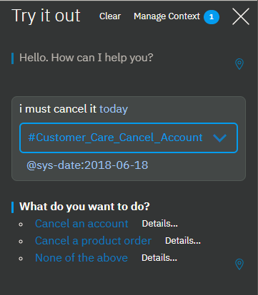

---

copyright:
  years: 2015, 2019
lastupdated: "2018-02-21"

subcollection: assistant

---

{:shortdesc: .shortdesc}
{:new_window: target="_blank"}
{:deprecated: .deprecated}
{:important: .important}
{:note: .note}
{:tip: .tip}
{:pre: .pre}
{:codeblock: .codeblock}
{:screen: .screen}
{:javascript: .ph data-hd-programlang='javascript'}
{:java: .ph data-hd-programlang='java'}
{:python: .ph data-hd-programlang='python'}
{:swift: .ph data-hd-programlang='swift'}
{:gif: data-image-type='gif'}

# Cómo se procesa el diálogo
{: #dialog-runtime}

Conozca cómo se procesa un diálogo en tiempo de ejecución cuando una persona interactúa con su instancia del servicio {{site.data.keyword.conversationshort}} desplegado.
{: shortdesc}

## Anatomía de una llamada de diálogo
{: #dialog-runtime-message-anatomy}

Cada expresión de usuario se pasa al diálogo como una llamada API de /message. Se incluyen las expresiones que los usuarios realizan como respuesta a solicitudes del diálogo donde se le solicita más información. Algunos planes de suscripción incluyen un número establecido de llamadas de API, de modo que ayuda a entender lo que constituye una llamada. Una llamada de API /message individual equivale a una ronda de diálogo individual y está formada por una entrada del usuario y la correspondiente respuesta desde el diálogo.

El cuerpo de la solicitud y la respuesta de una llamada de API /message incluye los siguientes objetos:

- `context`: Contiene las variables que están destinadas a ser persistentes. Para pasar información de una llamada a la siguiente, el desarrollador de aplicaciones debe pasar el contexto de la respuesta de la llamada API anterior en cada llamada de API posterior. Por ejemplo, el diálogo puede recopilar el nombre del usuario y, a continuación, hacer referencia al nombre de usuario en nodos posteriores.

  ```json
  {
    "context" : {
      "user_name" : "<? @sys-person.literal ?>"
    }
  ```
  {: codeblock}

  Consulte [Retención de información a través de rondas de diálogo](#dialog-runtime-context) para obtener más información.

- `input`: Serie de texto que el usuario envió. La serie del texto puede contener hasta 2.048 caracteres.

  ```json
  {
    "input": {
      "text" : "Where's your nearest store?"
    }
  ```
  {: codeblock}

- `output`: Respuesta del diálogo que se devuelve al usuario.

  ```json
  {
  "output": {
    "generic":[
      {
        "values": [
          {
            "text": "This is my response text."
          }
        ],
        "response_type": "text",
        "selection_policy": "sequential"
      }
    ]
  }
  }
  ```
  {: codeblock}

En la respuesta de la API /message resultante, la respuesta de texto está formateada de la siguiente manera:

```json
{
   "text": "This is my response text.",
   "response_type": "text"
}
```

Se da soporte al siguiente formato de objeto `output` por motivos de compatibilidad con versiones anteriores. Cualquier espacio de trabajo que especifique una respuesta de texto utilizando este formato seguirá funcionando correctamente. Con la introducción de los tipos de respuesta completa, la estructura `output.text` se ha aumentado con la estructura `output.generic` para facilitar el soporte de otros tipos de respuestas además del texto. Utilice el nuevo formato cuando cree nuevos nodos para tener más flexibilidad, ya que posteriormente puede cambiar el tipo de respuesta si es necesario.
{: note}

  ```json
  {
  "output": {
    "text": {
      "values": [
        "This is my response text."
      ]
    }
  }
  ```
  {: codeblock}

Puede definir tipos de respuesta que no sean una respuesta de texto. Consulte [Respuestas](/docs/services/assistant?topic=assistant-dialog-overview#dialog-overview-responses) para obtener más detalles.

Obtenga más información sobre las llamadas de API /message en la [Referencia de API ](https://{DomainName}/apidocs/assistant-v2){: new_window}.

### Retención de información a través de rondas de diálogo
{: #dialog-runtime-context}

El diálogo de un conocimiento de diálogo no tiene estado, lo que significa que no retiene información entre una interacción con el usuario y la siguiente. Cuando añade un conocimiento de diálogo a un asistente y lo despliega, el asistente guarda el contexto de una llamada de mensaje y luego vuelve a enviarla en la siguiente solicitud durante la sesión actual. La sesión actual dura mientras un usuario interactúa con el asistente, y luego hasta 60 minutos de inactividad para los planes Plus o Premium (5 minutos para los planes Lite o Estándar). Si no añade el conocimiento de diálogo a un asistente, es su responsabilidad como desarrollador de aplicaciones personalizadas mantener la información que necesita la aplicación. La aplicación debe buscar y almacenar el objeto de contexto en la respuesta de la API del mensaje, y pasarlo con la solicitud de API /message siguiente que se realice como parte del flujo de la conversación.

Una forma de conservar la información consiste en almacenar todo el objeto de contexto en la memoria la aplicación de cliente, por ejemplo en un navegador web. A medida que aumenta la complejidad de la aplicación, o si es necesario pasar y almacenar información personal, es posible que tenga que almacenar y recuperar la información a partir de una base de datos. Por supuesto, el enfoque más sencillo es el que le evita tener que almacenar el contexto. Para implementar este enfoque, añada el conocimiento de diálogo a un asistente y deje que el asistente realice automáticamente un seguimiento del contexto.

La aplicación puede pasar información al diálogo, y el diálogo puede actualizar esta información y pasarla a la aplicación o un nodo posterior. El diálogo lo hace mediante *variables de contexto*.

## Variables de contexto
{: #dialog-runtime-context-variables}

Una variable de contexto es una variable que el usuario define en un nodo. Puede especificar un valor predeterminado para la misma. Otros nodos, la lógica de aplicación o una entrada de usuario pueden establecer o cambiar posteriormente el valor de la variable de contexto.

Puede definir una condición sobre valores de variables de contexto haciendo referencia a una variable de contexto desde una condición de nodo de diálogo para determinar si se debe ejecutar un nodo. También puede hacer referencia a una variable de contexto desde condiciones de respuesta del nodo del diálogo para mostrar distintas respuestas, en función de un valor especificado por un servicio externo o por el usuario.

Más información:

- [Cómo pasar contexto desde la aplicación](#dialog-runtime-context-from-app)
- [Cómo pasar contexto de nodo a nodo](#dialog-runtime-context-node-to-node)
- [Definición de una variable de contexto](#dialog-runtime-context-var-define)
- [Tareas comunes de variables de contexto](#dialog-runtime-context-common-tasks)
- [Supresión de una variable de contexto](#dialog-runtime-context-delete)
- [Actualización de una variable de contexto](#dialog-runtime-context-update)
- [Cómo se procesan las variables de contexto](#dialog-runtime-context-processing)
- [Orden de operación](#dialog-runtime-context-order-of-ops)
- [Adición de variables de contexto a un nodo con ranuras](#dialog-runtime-context-var-slots)

### Cómo pasar contexto desde la aplicación
{: #dialog-runtime-context-from-app}

Para pasar información de la aplicación al diálogo, defina una variable de contexto y pase la variable de contexto al diálogo.

Por ejemplo, la aplicación puede definir una variable de contexto $time_of_day y pasarla al diálogo, el cual puede utilizar la información para adaptar el saludo que muestra al usuario.


En este ejemplo, el diálogo sabe que la aplicación establece la variable a uno de estos valores: *morning*, *afternoon* o *evening*. Puede comprobar para cada valor, y, dependiendo del valor que encuentre, devolver el saludo adecuado. Si la variable no se pasa o tiene un valor que no coincide con ninguno de los valores esperados, se muestra al usuario un saludo más genérico.

### Cómo pasar contexto de nodo a nodo
{: #dialog-runtime-context-node-to-node}

El diálogo también puede añadir variables de contexto para pasar información de un nodo a otro o para actualizar los valores de las variables de contexto. Cuando el diálogo solicita y obtiene información del usuario, puede realizar un seguimiento de la información y hacer referencia a la misma más adelante en la conversación.

Por ejemplo, en un nodo puede preguntar a los usuarios cómo se llaman y en un nodo posterior dirigirse a ellos por su nombre.


En este ejemplo, se utiliza la entidad del sistema @sys-person para extraer el nombre del usuario de la entrada si el usuario lo especifica. En el editor JSON, la variable de contexto username se define y se establece en el valor @sys-person. En un nodo posterior, se incluye la variable de contexto $username en la respuesta para dirigirse al usuario por su nombre.

### Definición de una variable de contexto
{: #dialog-runtime-context-var-define}

Para definir una variable de contexto, añada el nombre de la variable al campo **Variable** y añada un valor predeterminado para la misma al campo **Valor** en la vista de edición del nodo.

1.  Pulse esta opción para abrir el nodo de diálogo al que desea añadir una variable de contexto.

1.  Pulse el icono **Opciones**   asociado a la respuesta de nodo y pulse **Abrir editor de contexto**.

      

      Si el valor **Varias respuestas** está **Activo** para el nodo, primero debe pulsar el icono **Editar respuesta**  para la respuesta con la que desea asociar la variable de contexto.

      

1.  Añada el par de nombre y valor de la variable a los campos **Variable** y **Valor**.

    - El `nombre` puede contener cualquier carácter alfabético en mayúsculas o minúsculas, caracteres numéricos (0-9) y signos de subrayado.

      Puede incluir otros caracteres en el nombre, como puntos y guiones. Sin embargo, si lo hace, debe especificar la sintaxis abreviada `$(variable-name)` cada vez que haga referencia posteriormente a la variable. Consulte [Expresiones para acceder a objetos](/docs/services/assistant?topic=assistant-expression-language#expression-language-shorthand-context) para obtener más información.
      {:tip}

    - El `valor` puede ser cualquier tipo JSON soportado, como por ejemplo una variable de serie simple, un número, una matriz JSON o un objeto JSON.

En la tabla siguiente se muestran algunos ejemplos de cómo definir pares de nombre y valor para distintos tipos de valores:

| Variable       | Valor                         | Tipo de valor |
|:---------------|-------------------------------|------------|
| dessert        | "cake"                        | Serie     |
| age            | 18                            | Número     |
| toppings_array | ["onions","olives"]            | Matriz JSON |
| full_name      | {"first":"John","last":"Doe"} | Objeto JSON |

Para hacer referencia posteriormente a estas variables de contexto, utilice la sintaxis `$name`, donde *name* es el nombre de la variable de contexto que ha definido.

Por ejemplo, puede especificar la siguiente expresión como la respuesta del diálogo:

`The customer, $age-year-old <? $full_name.first ?>, wants a pizza with <? $toppings_array.join(' and ') ?>, and then $dessert.`

La salida resultante se muestra así:

`The customer, 18-year-old John, wants a pizza with onions and olives, and then cake.`

También puede utilizar el editor JSON para definir variables de contexto. Es posible que prefiera utilizar el editor JSON si desea añadir una expresión compleja como el valor de la variable. Consulte [Variables de contexto en el editor JSON](#dialog-runtime-context-var-json) para obtener más detalles.

### Tareas comunes de variables de contexto
{: #dialog-runtime-context-common-tasks}

Para almacenar toda la serie que ha proporcionado el usuario como entrada, utilice `input.text`:

| Variable | Valor            |
|----------|------------------|
| repeat   | `<?input.text?>` |

Por ejemplo, suponga que la entrada del usuario es `I want to order a device.` Si la respuesta del nodo es `You said: $repeat`, entonces la respuesta se muestra así: `You said: I want to order a device.`

Para almacenar el valor de una entidad en una variable de contexto, utilice esta sintaxis:

| Variable | Valor            |
|----------|------------------|
| place    | `@place`         |

Por ejemplo, suponga que la entrada de usuario es `I want to go to Paris.` Si la entidad @place reconoce `Paris`, entonces el servicio guarda `Paris` en la variable de contexto `$place`.

Para almacenar el valor de una serie extraída de la entrada del usuario, puede incluir una expresión SpEL que utilice el método `extract` para aplicar una expresión regular a la entrada del usuario. La expresión siguiente extrae un número de la entrada del usuario y la almacena en la variable de contexto `$number`.

| Variable | Valor                               |
|----------|-------------------------------------|
| número   | `<?input.text.extract('[\d]+',0)?>` |

Para almacenar el valor de una entidad de patrón, añada .literal al nombre de entidad. Con esta sintaxis se asegura de que en la variable se almacena el texto exacto de la entrada del usuario que coincide con el patrón especificado.

| Variable | Valor                  |
|----------|------------------------|
| email    | `<? @email.literal ?>` |

Por ejemplo, suponga que la entrada de usuario es `Contact me at joe@example.com.` La entidad llamada `@email` reconoce el formato de correo electrónico `name@domain.com`. Al configurar la variable de contexto para almacenar `@email.literal`,
indica que desea almacenar la parte de la entrada que coincide con el patrón. Si omite la propiedad `.literal` de la expresión del valor, se devuelve el nombre del valor de la entidad que ha especificado para el patrón en lugar del segmento de la entrada de usuario que coincide con el patrón.

Muchos de estos ejemplos de valor utilizan métodos para capturar distintas partes de la entrada de usuario. Para obtener más información sobre los métodos que puede utilizar, consulte [Métodos de lenguaje de expresión](/docs/services/assistant?topic=assistant-dialog-methods).

### Supresión de una variable de contexto
{: #dialog-runtime-context-delete}

Para suprimir una variable de contexto, establezca la variable en null.

| Variable   | Valor            |
|------------|------------------|
| order_form | `null`           |

Alternativamente puede suprimir una variable de contexto en la lógica de su aplicación. Para obtener información sobre cómo eliminar la variable por completo, consulte [Supresión de una variable de contexto en JSON](#dialog-runtime-context-delete-json).

### Actualización de un valor de variable de contexto
{: #dialog-runtime-context-update}

Para actualizar el valor de una variable de contexto, defina una variable de contexto con el mismo nombre que la variable de contexto anterior, pero esta vez especifique un valor distinto para la misma.

Cuando más de un nodo establece el valor de la misma variable de contexto, el valor de la variable de contexto puede cambiar en el curso de una conversación con un usuario. El valor que se aplica en un momento determinado depende del nodo que el usuario está desencadenando en el curso de la conversación. El valor especificado para la variable de contexto en el último nodo que se procesa sobrescribe los valores que han establecido para la variable los nodos que se han procesado anteriormente.

Para obtener información sobre cómo actualizar el valor de una variable de contexto cuando el valor es un objeto JSON o un tipo de datos de matriz JSON, consulte [Actualización de un valor de variable de contexto en JSON](#dialog-runtime-context-update-json)

### Cómo se procesan las variables de contexto
{: #dialog-runtime-context-processing}

El lugar en el que se define la variable de contexto es importante. La variable de contexto no se crea y se establece en el valor que especifique para el mismo hasta que el servicio procese la parte del nodo de diálogo donde ha definido la variable de contexto. En la mayoría de los casos, el usuario define la variable de contexto como parte de la respuesta del nodo. Cuando lo hace, se crea la variable de contexto y se le da el valor especificado cuando el servicio devuelve la respuesta del nodo.

Para un nodo con respuestas condicionales, la variable de contexto se crea y se establece cuando se cumple la condición correspondiente a una respuesta específica y se procesa la respuesta. Por ejemplo, si define una variable de contexto para la respuesta condicional #1 y el servicio procesa únicamente la respuesta condicional #2, entonces la variable de contexto que ha definido para la respuesta condicional #1 no se crea ni se establece.

Para obtener información sobre dónde añadir las variables de contexto que desea que el servicio cree y establezca a medida que un usuario interactúa con un nodo con ranuras, consulte [Adición de variables de contexto a un nodo con ranuras](#dialog-runtime-context-var-slots).

### Orden de operación
{: #dialog-runtime-context-order-of-ops}

Cuando el usuario define varias variables para que se procesen juntas, el orden en el que las define no determina el orden en el que el servicio evalúa las variables. El servicio evalúa las variables en orden aleatorio. No establezca un valor en la primera variable de contexto en la lista y espere a poder utilizarlo en la segunda variable de la lista, porque no hay garantía de que la primera variable de contexto se ejecute antes que la segunda. Por ejemplo, no utilice dos variables de contexto para implementar la lógica que compruebe si la entrada de usuario contiene la palabra `Yes`.

| Variable        | Valor            |
|-----------------|------------------|
| user_input      | <? input.text ?> |
| contains_yes    | <? $user_input.contains('Yes') ?> |

Utilice en su lugar una expresión ligeramente más compleja para evitar tener que depender de que el valor de la primera variable de la lista (user_input) se evalúe antes que la segunda variable (contains_yes).

| Variable      | Valor            |
|---------------|------------------|
| contains_yes  | <? input.text.contains('Yes') ?> |

### Adición de variables de contexto a un nodo con ranuras
{: #dialog-runtime-context-var-slots}

Para obtener más información sobre las ranuras, consulte [Obtención de información con ranuras](/docs/services/assistant?topic=assistant-dialog-slots).

1.  Abra el nodo con ranuras en la vista de edición.

    - Para añadir una variable de contexto que se procese después de que se satisfaga una condición de respuesta, siga estos pasos:

      1.  Pulse el icono **Editar ranura** .
      1.  Pulse el icono **Opciones**  y, a continuación, seleccione **Habilitar respuestas condicionales**.
      1.  Pulse el icono **Editar respuesta**  junto a la respuesta que desea asociar a la variable de contexto.
      1.  Pulse el icono **Opciones**  en la sección de respuesta y, a continuación, pulse **Abrir editor de contexto**.
      1.  Añada el par de nombre y valor de la variable a los campos **Variable** y **Valor**.

      

    - Para añadir una variable de contexto que se establezca o se actualice después de que se cumpla una condición de ranura, siga los pasos siguientes:

      1.  Pulse el icono **Editar ranura** .
      1.  Desde el menú **Opciones**  en la cabecera de la vista *Configurar ranura*, pulse **Abrir editor JSON**.
      1.  Añada el par de nombre y valor de la variable en formato JSON.

          ```json
          {
            "time_of_day": "morning"
          }
          ```
          {: codeblock}

      Actualmente no hay una forma de utilizar el editor de contexto para definir variables de contexto que se establecen en esta fase de la evaluación del nodo de diálogo. Debe utilizar en su lugar el editor JSON. Para obtener más información sobre el uso del editor JSON, consulte [Variables de contexto en el editor JSON](#dialog-runtime-context-var-json).
      {: note}

      

## Variables de contexto en el editor JSON
{: #dialog-runtime-context-var-json}

También puede definir una variable de contexto en el editor JSON. Es posible que desee utilizar el editor JSON si va a definir una variable de contexto compleja y desea poder ver la expresión SpEL completa a medida que la añade o la cambia.

El par de nombre y valor debe cumplir estos requisitos:

- El `nombre` puede contener cualquier carácter alfabético en mayúsculas o minúsculas, caracteres numéricos (0-9) y signos de subrayado.

  Puede incluir otros caracteres en el nombre, como puntos y guiones. Sin embargo, si lo hace, debe especificar la sintaxis abreviada `$(variable-name)` cada vez que haga referencia posteriormente a la variable. Consulte [Expresiones para acceder a objetos](/docs/services/assistant?topic=assistant-expression-language#expression-lanaguage-shorthand-context) para obtener más información.
  {:tip}

- El `valor` puede ser cualquier tipo JSON soportado, como por ejemplo una variable de serie simple, un número, una matriz JSON o un objeto JSON.

El siguiente ejemplo JSON define los valores de la serie $dessert, la matriz $toppings_array, el número $age y las variables de contexto de objeto $full_name:

```json
{
  "context": {
    "dessert": "cake",
    "toppings_array": [
      "onions",
      "olives"
    ],
    "age": 18,
    "full_name": {
      "first": "Jane",
      "last": "Doe"
    }
  },
         "output": {}
       }
```
{: codeblock}

Para definir una variable de contexto en formato JSON, siga estos pasos:

1.  Pulse esta opción para abrir el nodo de diálogo al que desea añadir la variable de contexto.

    Todos los valores existentes de las variables de contexto que se definen para este nodo se visualizan en un conjunto de campos de **Variable** y **Valor** correspondientes. Si no desea que se visualicen en la vista de edición del nodo, debe cerrar el editor de contexto. Puede cerrar el editor desde el mismo menú que se utiliza para abrir el editor JSON; en los siguientes pasos se describe cómo acceder al menú.
    {: note}

1.  Pulse el icono **Opciones**   asociado a la respuesta y pulse **Abrir editor JSON**.

    

    Si el valor **Varias respuestas** está **Activo** para el nodo, primero debe pulsar el icono **Editar respuesta**  para la respuesta con la que desea asociar la variable de contexto.

    

1.  Añada el bloque `"context":{}` si no está presente.

    ```json
    {
      "context":{},
      "output":{}
    }
    ```
    {: codeblock}

1.  En el bloque de contexto, añada un par `"name"`y `"value"` para cada variable de contexto que desee definir.

    ```json
    {
      "context":{
        "name": "value"
    },
         "output": {}
       }
    ```
    {: codeblock}

    En este ejemplo, una variable denominada `new_variable` se añade a un bloque de context que ya contiene una variable.

    ```json
    {
      "context":{
        "existing_variable": "value",
        "new_variable":"value"
      }
    }
    ```
    {: codeblock}

    Para hacer referencia posteriormente a la variable de contexto, utilice la sintaxis `$name`, donde *name* es el nombre de la variable de contexto que ha definido. Por ejemplo, `$new_variable`.

Más información:

- [Supresión de una variable de contexto en JSON](#dialog-runtime-context-delete-json)
- [Actualización de un valor de variable de contexto en JSON](#dialog-runtime-context-update-json)
- [Establecimiento de una variable de contexto igual que otra](#dialog-runtime-var-equals-var)

### Supresión de una variable de contexto en JSON
{: #dialog-runtime-context-delete-json}

Para suprimir una variable de contexto, establezca la variable en null.

```json
{
  "context": {
    "order_form": null
  }
}
```
{: codeblock}

Si desea eliminar cualquier rastro de la variable de contexto, utilice el método JSONObject.remove(string) para suprimirla del objeto de contexto. Sin embargo, debe utilizar una variable para realizar la eliminación. Defina la nueva variable en la salida del mensaje para que no se guarde más allá de la llamada actual.

```json
{
  "output": {
    "text" : {},
    "deleted_variable" : "<? context.remove('order_form') ?>"
  }
}
```
{: codeblock}

Alternativamente puede suprimir una variable de contexto en la lógica de su aplicación.

### Actualización de un valor de variable de contexto en JSON
{: #dialog-runtime-context-update-json}

En general, si un nodo establece el valor de una variable de contexto que ya está establecido, el nuevo valor sobrescribe el valor anterior.

#### Actualización de un objeto JSON complejo

Los valores anteriores se sobrescribe para todos los tipos de JSON, excepto para un objeto JSON. Si la variable de contexto es un tipo complejo como un objeto JSON, se utiliza un procedimiento de fusión de JSON para actualizar la variable. La operación de fusión añade las propiedades recién definidas y sobrescribe las propiedades existentes del objeto.

En este ejemplo, se define una variable de contexto de nombre como un objeto complejo.

```json
{
  "context": {
    "complex_object": {
      "user_firstname" : "Paul",
      "user_lastname" : "Pan",
      "has_card" : false
    }
  }
}
```
{: codeblock}

Un nodo de diálogo actualiza el objeto JSON de la variable de contexto con los valores siguientes:

```json
{
  "complex_object": {
    "user_firstname": "Peter",
    "has_card": true
  }
}
```
{: codeblock}

El resultado es este contexto:

```json
{
  "complex_object": {
    "user_firstname": "Peter",
    "user_lastname": "Pan",
    "has_card": true
  }
}
```
{: codeblock}

Consulte [Métodos del lenguaje de expresión](/docs/services/assistant?topic=assistant-dialog-methods#dialog-methods-objects) para obtener más información sobre los métodos que puede aplicar a los objetos.

#### Actualización de matrices

Si los datos de contexto del diálogo contienen una matriz de valores, puede actualizar la matriz añadiendo valores, eliminando un valor o sustituyendo todos los valores.

Elija una de estas acciones para actualizar la matriz. En cada caso, vemos la matriz antes de la acción, la acción y la matriz después de que se haya aplicado la acción.

- **Append**: Para añadir valores al final de una matriz, utilice el método `append`.

    Para este contexto de tiempo de ejecución del diálogo:

    ```json
    {
      "context": {
        "toppings_array": ["onion", "olives"]
      }
    }
    ```
    {: codeblock}

    Realice esta actualización:

    ```json
    {
      "context": {
        "toppings_array": "<? $toppings_array.append('ketchup', 'tomatoes') ?>"
      }
    }
    ```
    {: codeblock}

    Resultado:

    ```json
    {
      "context": {
        "toppings_array": ["onion", "olives", "ketchup", "tomatoes"]
      }
    }
    ```
    {: codeblock}

- **Remove**: Para eliminar un elemento, utilice el método `remove` y especifique su valor o posición en la matriz.

    - **Remove by value** elimina un elemento de una matriz por su valor.

        Para este contexto de tiempo de ejecución del diálogo:

        ```json
        {
          "context": {
            "toppings_array": ["onion", "olives"]
          }
        }
        ```
        {: codeblock}

        Realice esta actualización:

        ```json
        {
          "context": {
            "toppings_array": "<? $toppings_array.removeValue('onion') ?>"
          }
        }
        ```
        {: codeblock}

        Resultado:

        ```json
        {
          "context": {
            "toppings_array": ["olives"]
          }
        }
        ```
        {: codeblock}

    - **Remove by position**: Eliminación de un elemento de la matriz por su posición de índice:

        Para este contexto de tiempo de ejecución del diálogo:

        ```json
        {
          "context": {
            "toppings_array": ["onion", "olives"]
          }
        }
        ```
        {: codeblock}

        Realice esta actualización:

        ```json
        {
          "context": {
            "toppings_array": "<? $toppings_array.remove(0) ?>"
          }
        }
        ```
        {: codeblock}

        Resultado:

        ```json
        {
          "context": {
            "toppings_array": ["olives"]
          }
        }
        ```
        {: codeblock}

- **Overwrite**: Para sobrescribir los valores de una matriz, simplemente establezca para la matriz los nuevos valores:

    Para este contexto de tiempo de ejecución del diálogo:

        ```json
        {
          "context": {
            "toppings_array": ["onion", "olives"]
          }
        }
        ```
        {: codeblock}

    Realice esta actualización:

        ```json
        {
          "context": {
            "toppings_array": ["ketchup", "tomatoes"]
          }
        }
        ```
        {: codeblock}

    Resultado:

        ```json
        {
          "context": {
            "toppings_array": ["ketchup", "tomatoes"]
          }
        }
        ```
        {: codeblock}

Consulte [Métodos del lenguaje de expresión](/docs/services/assistant?topic=assistant-dialog-methods#dialog-methods-arrays) para obtener más información sobre los métodos que puede realizar en las matrices.

### Establecimiento de una variable de contexto igual que otra
{: #dialog-runtime-var-equals-var}

Cuando se establece una variable de contexto igual que otra variable de contexto, se define un puntero entre uno y otro. Si el valor de una de las variables cambia posteriormente, el valor de la otra variable también se modifica.

Por ejemplo, si especifica una variable de contexto tal como se indica a continuación, cuando el valor de `$var1` o de `$var2` cambia posteriormente, el valor de la otra también cambia.

| Variable  | Valor  |
|-----------|--------|
| var2      | var1   |

No establezca una variable igual que otra para capturar un valor en un punto en el tiempo. Cuando trate con matrices, por ejemplo, si desea capturar un valor de matriz almacenado en una variable de contexto en un determinado punto del diálogo para guardarlo para utilizar posteriormente, puede crear una nueva variable basada en el valor actual de la variable.

Por ejemplo, para crear una copia de los valores de una matriz en un determinado punto del flujo de diálogo, añada una nueva matriz que contenga los valores correspondientes a la matriz existente. Para ello, puede utilizar la sintaxis siguiente:

```json
{
"context": {
   "var2": "<? output.var2?:new JsonArray().append($var1) ?>"
 }
 }
 ```
{: codeblock}

## Digresiones
{: #dialog-runtime-digressions}

Una digresión se produce cuando un usuario está en medio de un flujo de diálogo que está diseñado para abordar un objetivo y, de forma abrupta, cambia el tema para iniciar un flujo de diálogo que está diseñado para abordar un objetivo diferente. El diálogo siempre ha dado soporte a la posibilidad de que el usuario cambie el asunto. Si ninguno de los nodos en la rama del diálogo que se está procesando coincide con el objetivo último de la entrada del usuario, la conversación vuelve de nuevo al árbol para comprobar las condiciones de nodo raíz en busca de una coincidencia apropiada. Los valores de digresión disponibles para el nodo, ofrecen la posibilidad de personalizar aún más este comportamiento.

Con los valores digresión, puede permitir que la conversación vuelva al flujo del diálogo que se interrumpió cuando se produjo la digresión. Por ejemplo, el usuario podría haber solicitado un nuevo teléfono, pero cambiar el tema para preguntar sobre tabletas electrónicas. El diálogo puede responder a la pregunta sobre las tabletas, y luego volver a donde se quedó en el proceso de la solicitud de un teléfono. El permitir las digresiones y volver al punto en donde se encontraba, ofrece a los usuarios un mayor control sobre el flujo de la conversación en tiempo de ejecución. Por lo tanto los usuarios pueden cambiar el tema, seguir el flujo sobre el tema no relacionado hasta su fin y, a continuación, volver a donde se encontraban con anterioridad. El resultado es un flujo de diálogo que simular mejor una conversación entre humanos.

{: gif}

La imagen animada muestra un esquema de la interfaz de usuario del árbol del diálogo que muestra el concepto de una digresión. Se muestra cómo un usuario interactúa con los nodos del diálogo que están configurados para permitir digresiones que vuelven al flujo de diálogo que estaba en curso. El usuario empieza a proporcionar la información necesaria para realizar una reserva para una cena. En mitad del proceso de cumplimentar las ranuras en el nodo #reservation, el usuario realiza una pregunta sobre posibilidad de un menú vegetariano. El diálogo responde a la nueva pregunta del usuario buscando un nodo raíz que aborde esta pregunta (un nodo que se condiciona con base a #cuisine_intent). A continuación vuelve a la conversación que estaba en curso mostrando una solicitud para la siguiente ranura vacía desde el nodo de diálogo original.

Vea este vídeo para obtener más información.

<iframe class="embed-responsive-item" id="youtubeplayer" title="Visión general de las digresiones" type="text/html" width="640" height="390" src="https://www.youtube.com/embed/I3K7mQ46K3o?rel=0" frameborder="0" webkitallowfullscreen mozallowfullscreen allowfullscreen> </iframe>

- [Antes de empezar](#dialog-runtime-digression-prereqs)
- [Personalización de digresiones](#dialog-runtime-enable-digressions)
- [Sugerencias sobre el uso de digresiones](#dialog-runtime-digress-tips)
- [Inhabilitación de digresiones hacia dentro de un nodo raíz](#dialog-runtime-disable-digressions)
- [Guía de aprendizaje de las digresiones](#dialog-runtime-digression-tutorial)
- [Consideraciones de diseño](#dialog-runtime-digression-design-considerations)

### Antes de empezar
{: #dialog-runtime-digression-prereqs}

A medida que prueba en general el diálogo, decide cuándo y cómo tiene sentido permitir digresiones y volver de dichas digresiones. Los siguientes controles para las digresiones se aplican a los nodos de forma automática. Hágalo si desea cambiar este comportamiento predeterminado.

- Cada nodo raíz en el diálogo está configurado para permitir tratar digresiones de forma predeterminada. Los nodos hijo no pueden ser el destino de una digresión.
- Los nodos con ranuras están configurados para impedir las digresiones hacia fuera. Todos los otros nodos están configurados para permitir las digresiones hacia fuera. Sin embargo, la conversación no permite la digresión hacia fuera de un nodo en las siguientes circunstancias:

  - Si alguno de los nodos hijos del nodo actual contiene la condición `anything_else` o `true`.

    Estas condiciones son especiales en que siempre se evalúan como verdaderas. Debido a su comportamiento predeterminado, a menudo se utilizan en diálogos para forzar que un nodo padre evalúe un nodo hijo específico de forma sucesiva. Para evitar romper la lógica del flujo del diálogo existente, no se permiten digresiones en este caso. Para permitir las digresiones hacia fuera de este nodo, primero debe cambiar la condición del nodo hijo a un valor distinto.

  - Si el nodo está configurado para saltar a otro nodo o saltar la entrada de usuario después de que sea procesado.

    La sección del paso final de un nodo especifica qué debe ocurrir después de que el nodo se procese. Cuando el diálogo está configurado para saltar directamente a otro nodo, a menudo es para asegurarse de que se sigue una secuencia específica. Y cuando el nodo está configurado para saltar la entrada de usuario, es equivalente a obligar al diálogo a procesar el primer nodo hijo después del nodo actual de forma sucesiva. Para evitar romper la lógica del flujo del diálogo existente, no se permiten digresiones en ninguno de estos casos. Para permitir las digresiones hacia fuera de este nodo, primero debe cambiar lo que se especifica en la sección del paso final.

### Personalización de digresiones
{: #dialog-runtime-enable-digressions}

No se define un inicio ni un fin de una digresión. Es el usuario quien controla el flujo de la digresión en tiempo de ejecución. El diseñador del diálogo únicamente especifica cómo debe participar cada nodo en una digresión que lleve el usuario. Para cada nodo, se configura si:

- una digresión puede empezar y alejarse del nodo
- una digresión que empieza en otro lugar puede dirigirse a un nodo y ser tratada por el mismo
- una digresión que empieza en otro lugar y que entra en el nodo debe volver al flujo de diálogo interrumpido después de que se haya completado el flujo de diálogo actual

Para cambiar el comportamiento de una digresión para un nodo individual, siga estos pasos:

1.  Pulse el nodo para abrir su vista de edición.

1.  Pulse **Personalizar** y, a continuación, pulse el separador **Digresiones**.

    Las opciones de configuración difieren en función de si el nodo que está editando es un nodo raíz, un nodo hijo, un nodo con hijos o un nodo con ranuras.

    **Digresiones hacia fuera de este nodo**

    Si las circunstancias listadas con anterioridad no se aplican, tiene las siguientes opciones:

    - **Todos los tipos de nodo**: Elija si desea permitir a los usuarios las digresiones hacia fuera del nodo actual antes de alcanzar el final de la rama del diálogo actual.

    - **Todos los nodos que tienen hijos**: Elija si desea que la conversación vuelva al nodo actual después de una digresión si la respuesta del nodo actual ya se ha visualizado y los nodos hijo son accesorios para el objetivo del nodo. Establezca el conmutador *Permitir volver desde digresiones desencadenadas después de esta respuesta de nodo* en **No** para evitar que el diálogo vuelva al nodo actual y continúe procesando su rama.

      Por ejemplo, si el usuario solicita, `Do you sell cupcakes?` (¿Vende cupcakes?) y se visualiza la respuesta `We offer cupcakes in a variety of flavors and sizes` (Ofrecemos cupcakes de distintos sabores y tamaños) antes de que el usuario cambie el tema, podría desear que el diálogo no volviese desde donde lo dejó. Especialmente, si los nodos hijo únicamente tratan de posibles preguntas de seguimiento al usuario, se pueden ignorar.

      Sin embargo, si el nodo se basa en sus nodos hijo para hacer frente a la pregunta, es posible que desee forzar la conversación para volver y continuar el proceso de los nodos en la rama actual. Por ejemplo, la respuesta inicial podría ser, `We offer cupcakes in all shapes and sizes. Which menu do you want to see: gluten-free, dairy-free, or regular?` Ofrecemos cupcakes en distintas formas y tamaños. ¿Qué menú desea ver: sin gluten, sin lactosa o normal?. Si en este momento el usuario cambia el tema, podría desear que el diálogo volviese de forma que el usuario pudiese elegir un tipo de menú y obtener la información que desease.

    - **Nodos con ranuras**: Elija si desea permitir a los usuarios las digresiones hacia fuera del nodo antes de haber cumplimentado todas las ranuras. Establezca el conmutador *Permitir digresiones hacia fuera al cumplimentar ranuras* en **Sí** para permitir las digresiones hacia fuera.

      Si se habilita, cuando la conversación vuelve desde la digresión, se visualiza la solicitud para la siguiente ranura no cumplimentada para que el usuario continúe proporcionado información. Si se inhabilita, se ignoran las entradas que el usuario envía y que no contengan un valor que sirva para cumplimentar una ranura. Sin embargo, definiendo manejadores de ranura puede tratar preguntas no solicitadas que anticipa que los usuarios podrían realizar mientras interactúan con el nodo. Consulte [Adición de ranuras](/docs/services/assistant?topic=assistant-dialog-slots#dialog-slots-add) para obtener más información.

      En la imagen siguiente se muestra cómo están configuradas las digresiones hacia fuera del nodo #reservation con ranuras (mostradas en la ilustración anterior).

      

    - **Nodos con ranuras**: Elija si el usuario únicamente puede hacer digresiones hacia fuera si volverán al nodo actual seleccionando el recuadro de selección **Solo digresiones desde ranuras a nodos que permiten retornos**.

      Cuando se selecciona, como el diálogo busca un nodo para responder la pregunta no relacionada del usuario, ignora los nodos raíz que no están configurados para volver después de la digresión. Seleccione este recuadro de selección si desea impedir que los usuarios puedan abandonar permanentemente el nodo antes de haber terminado de cumplimentar las ranuras necesarias.

    **Digresiones hacia dentro este nodo**

    Tiene las siguientes opciones sobre cómo se comportarán las digresiones hacia dentro de un nodo:

    - Impedir a los usuarios las digresiones hacia dentro del nodo. Consulte [Inhabilitación de digresiones hacia dentro de un nodo raíz](#dialog-runtime-disable-digressions) para obtener más detalles.

    - Cuando se permiten las digresiones hacia dentro de un nodo, elija si el diálogo debe volver al flujo de diálogo del que se alejó con una digresión. Si se selecciona, después de que se haya procesado la rama del nodo actual, el flujo de diálogo vuelve al nodo interrumpido. Para hacer que el diálogo vuelva después, seleccione **Volver después de una digresión**.

    En la imagen siguiente se muestra la forma en la que se configuran las digresiones hacia dentro del nodo #cuisine (mostrado en la ilustración anterior).

    

1.  Pulse **Aplicar**.

1.  Utilice el panel "Pruébelo" para probar el comportamiento de la digresión.

    Nuevamente, no puede definir el inicio y el final de una digresión. El usuario controla dónde y cuándo ocurrirán las digresiones. Sólo puede aplicar valores que determinan cómo un nodo participa en la digresión. Dado que las digresiones son imprevisibles, es difícil saber cómo sus decisiones de configuración afectarán la conversación general. Para ver realmente el impacto de las opciones que realiza, debe probar el diálogo.

Los nodos #reservation y #cuisine representan dos ramas del diálogo que pueden participar en una única digresión dirigida por el usuario. Los valores de digresión que se configuran para cada nodo individual son los que hacen posible este tipo de digresión en tiempo de ejecución.


### Sugerencias sobre el uso de digresiones
{: #dialog-runtime-digress-tips}

En esta sección se describen soluciones a situaciones con las que se puede encontrar cuando utilice digresiones.

- **Mensaje de retorno personalizado**: Para cualquiera de los nodos en los que haya habilitado las digresiones hacia fuera, tenga en cuenta la posibilidad de añadir un texto que permita a los usuarios saber que están volviendo a donde lo dejaron en un flujo de diálogo anterior. En la respuesta de texto, utilice una sintaxis especial que le permita añadir dos versiones de la respuesta.

  Si no emprende ninguna acción, se muestra la misma respuesta de texto una segunda vez para comunicar a los usuarios que han regresado al nodo desde el que se han desviado. Puede dejar claro a los usuarios que han vuelto a la hebra de conversación original, especifique un mensaje exclusivo que se mostrará cuando vuelvan.

  Por ejemplo, si la respuesta de texto original para el nodo es `What's the order number?`, puede mostrar un mensaje como `Now let's get back to where we left off. What is the order number?` cuando los usuarios vuelvan al nodo.

  Para ello, utilice la sintaxis siguiente para especificar la respuesta de texto de nodo:

  `<? (returning_from_digression)? "post-digression message" : "first-time message" ?>`

  Por ejemplo:

  ```bash
  <? (returning_from_digression)? "Now, let's get back to where we left off.
  What is the order number?" : "What's the order number?" ?>
  ```
  {: codeblock}

  No puede incluir expresiones SpEL ni sintaxis abreviada en las respuestas de texto que añada. De hecho, la sintaxis abreviada no se puede utilizar en absoluto. Debe crear el mensaje concatenando las series de texto y la sintaxis de expresión SpEL completa juntos para formar la respuesta completa.
  {: note}
  
  Por ejemplo, utilice la sintaxis siguiente para incluir una variable de contexto en una respuesta de texto que normalmente especificaría como `What can I do for you, $username?`:

  ```bash
  <? (returning_from_digression)? "Where were we, " +
  context["username"] + "? Oh right, I was asking what can I do
  for you today." : "What can I do for you today, " +
  context["username"] + "?" ?>
  ```

  Para obtener más información sobre la sintaxis de expresión SpEL, consulte [Expresión para acceder a objetos](/docs/services/assistant?topic=assistant-expression-language#expression-language-shorthand-syntax).

- **Prevención de retornos**: En algunos casos, es posible que desee evitar el retorno a un flujo de conversación interrumpido en función de en una opción que el usuario haga en el flujo de diálogo actual. Puede utilizar una sintaxis especial para evitar un retorno desde un nodo específico.

  Por ejemplo, supongamos que tiene un nodo condicionado a `#General_Connect_To_Agent` o una intención similar. Cuando se active, si desea obtener la confirmación del usuario antes de transferirlo a un servicio externo, puede añadir una respuesta como por ejemplo `Do you want me to transfer you to an agent now?` Luego podría añadir dos nodos hijo condicionados por `#yes` y `#no` respectivamente.
  
  La mejor forma de gestionar las digresiones para este tipo de rama consiste en establecer el nodo raíz de modo que permita retornos de digresión. Sin embargo, en el nodo `#yes`, incluya la expresión SpEL `<? clearDialogStack() ?>` en la respuesta. Por ejemplo:
  
    ```bash
  OK. I will transfer you now. <? clearDialogStack() ?>
  ```
  {: codeblock}

  Esta expresión SpEL impide que se produzca el retorno de digresión desde este nodo. Cuando se solicita una confirmación, si el usuario responde positivamente, se muestra la respuesta adecuada y el flujo de diálogo que se interrumpió no se reanuda. Si el usuario responde negativamente, se devuelve al usuario al flujo que se interrumpió.

### Inhabilitación de digresiones hacia dentro de un nodo raíz
{: #dialog-runtime-disable-digressions}

Cuando un flujo realiza una digresión hacia dentro de un nodo raíz, sigue el curso del diálogo configurado para dicho nodo. Por lo tanto, podría procesar una serie de nodos hijo antes de alcanzar el final de una rama de nodos y, a continuación, si está configurado para ello, volver al flujo de diálogo que fue interrumpido. Mediante pruebas de diálogo, podría encontrar que un nodo raíz se desencadena demasiado a menudo, o a veces inesperadamente, o que su diálogo es demasiado complejo y conduce al usuario a un discurso demasiado lejano como para ser considerado como una digresión temporal. Si determina que sería mejor no permitir que los usuarios lo utilizasen para digresiones, configure el nodo raíz para no permitir su uso por parte de las digresiones.

Para inhabilitar las digresiones hacia dentro de un nodo raíz, siga estos pasos:

1.  Pulse para abrir el nodo raíz que desea editar.
1.  Pulse **Personalizar** y pulse el separador **Digresiones**.
1.  Establezca *Permitir digresiones hacia dentro de este nodo* en **Desactivado**.
1.  Pulse **Aplicar**.

Si decide que desea impedir las digresiones hacia dentro de varios nodos raíz, pero no desea editar cada uno individualmente, puede añadir los nodos a una carpeta. En la página *Personalizar* de la carpeta, establezca *Permitir digresiones hacia dentro de este nodo* en *Desactivado* para aplicar la configuración en todos los nodos a la vez. Consulte [Organización del diálogo con carpetas](/docs/services/assistant?topic=assistant-dialog-build#dialog-build-folders) para obtener más información.

### Guía de aprendizaje sobre digresiones
{: #dialog-runtime-digression-tutorial}

Siga la [guía de aprendizaje](/docs/services/assistant?topic=assistant-tutorial-digressions) para importar un espacio de trabajo que ya tenga un conjunto de nodos definidos. Puede hacer los ejercicios que muestran el funcionamiento de las digresiones.

### Consideraciones sobre el diseño
{: #dialog-runtime-digression-design-considerations}

- **Evite la proliferación de nodos de retorno**: Muchos diseñadores de diálogos incluyen un nodo con una condición `true` o `anything_else` al
final de cada rama del diálogo como una manera de evitar que los usuarios se queden atrapados en la rama. Este diseño devuelve un mensaje genérico si la entrada de usuario no coincide con nada de lo que se prevé e incluye un nodo de diálogo específico para tratar esta situación. Sin embargo, los usuarios no pueden realizar digresiones hacia fuera de flujos de diálogo que utilizan este enfoque.

  Evalúe las ramas que utilizarán esta aproximación para determinar si sería mejor permitir las digresiones hacia fuera de la rama. Si la entrada del usuario no coincide con nada de lo que prevé, podría encontrar en el árbol una coincidencia con relación a la misma con un flujo de diálogo totalmente distinto. En lugar de responder con un mensaje genérico, podría poner el resto del diálogo a disposición de la entrada del usuario para intentar tratarla. Además, el nodo `Anything else` a nivel raíz siempre puede responder a la entrada que no puede responder ninguno de los otros nodos raíz.

- **Reconsidere los saltos para un nodo de cierre**: Muchos diálogos se diseñan de modo que realicen una pregunta de cierre estándar como, por ejemplo, `Did I answer your question today?` (¿He respondido a su pregunta?) Los usuarios no pueden realizar una digresión hacia fuera de los nodos que están configurados para saltar a otro nodo. Por ello, si configura todos sus nodos al final de la rama para saltar a un nodo de cierre común, no se pueden realizar digresiones. Considere el seguimiento de satisfacción del usuario a través de métricas o por otros medios.

- **Pruebe las posibles cadenas de digresión**: Si un usuario realiza una digresión hacia fuera del nodo actual hacia otro nodo que a su vez permite las digresiones hacia fuera, potencialmente el usuario podría realizar una digresión hacia fuera de ese otro nodo, repitiéndose de nuevo este patrón una o más veces. Si el nodo inicial de la cadena de digresión está configurado para volver después de la digresión, el usuario al final tendría que ser conducido al nodo del diálogo actual. De hecho, los siguientes nodos de la cadena que están configurados para no volver se excluyen y no se tienen en cuenta como destinos de la digresión. Pruebe situaciones que encadenen varias digresiones para determinar si los nodos individuales funcionan tal como espera.

- **Recuerde que el nodo actual tiene prioridad**: Recuerde que los nodos fuera del flujo actual sólo son considerados como destinos de digresión si el flujo actual no puede tratar la entrada de usuario. Es aún más importante en un nodo con ranuras que permite digresiones hacia fuera, en particular, para dejar claro a los usuarios qué información se necesita de ellos, y añadir sentencias de confirmación que aparezcan después de que el usuario haya proporcionado un valor.

  Todas las ranuras se pueden cumplimentar durante el proceso de cumplimentación de las ranuras. Por ello, una ranura podría capturar la entrada de usuario de forma inesperada. Por ejemplo, podría tener un nodo con ranuras que recopila la información necesaria para realizar una reserva para una cena. Una de las ranuras podría recopilar información de la fecha. Al proporcionar detalles de la reserva, el usuario podría haber preguntado, `What's the weather meant to be tomorrow?` (¿Qué tiempo se espera para mañana?) Sin embargo, si la respuesta del usuario incluyese la palabra `tomorrow` (mañana) mientras se está procesando el nodo de reserva con ranuras, el servicio presupondría que la respuesta del usuario está proporcionando o actualizando es con relación a la fecha de la reserva. *El nodo actual siempre tiene prioridad* Si define una sentencia de confirmación clara, por ejemplo, `Ok, setting the reservation date to tomorrow` (De acuerdo, estableciendo la fecha de reserva para mañana), es más probable que el usuario se dé cuenta de la confusión y corrija el malentendido.

  Por el contrario, cuando está cumplimentando ranuras, si el usuario proporciona un valor que no se espera que ninguna de las ranuras, es posible que se encuentre una coincidencia en un nodo raíz sin relación alguna al que el usuario nunca tuviese la intención de llegar.

  Asegúrese de hacer muchas pruebas a medida que configura el comportamiento de la digresión.

- **Cuándo utilizar digresiones en lugar de manejadores de ranura**: Para preguntas generales que los usuarios pueden realizar en cualquier momento, utilice un nodo raíz que al que puedan llegar las digresiones, procesa la entrada, y luego vuelva al flujo que estaba en curso. Para nodos con ranuras, intente anticipar los tipos de preguntas relacionadas que los usuarios podrían realizar al cumplimentar las ranuras, y tratarlas añadiendo manejadores al nodo.

  Por ejemplo, si el nodo con ranuras recopila la información necesaria para cumplimentar una reclamación de seguros, es posible que desee añadir manejadores para abordar preguntas habituales sobre el seguro. Sin embargo, para las preguntas sobre cómo obtener ayuda, o sus ubicaciones tiendas, o la historia de su empresa, utilice un nodo de nivel raíz.

## Disambiguation 
{: #dialog-runtime-disambiguation}

Esta característica solo está disponible para los usuarios de los planes Plus o Premium.
{: tip}

Si habilita la desambiguación, indica al servicio que solicite ayuda a los usuarios cuando encuentre más de un nodo de diálogo que puede responder a su entrada. En lugar de adivinar qué nodo debe procesar, el asistente comparte una lista de las principales opciones de nodo con el usuario y le solicita que elija la adecuada.


Si está habilitada, la desambiguación no se activa a menos que se cumplan las condiciones siguientes:

- La puntuación de confianza de una o más de las intenciones finalistas detectadas en la entrada de usuario es superior al 55 % de la puntuación de confianza de la intención principal.
- La puntuación de confianza de la intención principal está por encima de 0,2.

Incluso cuando se cumplen estas condiciones, la desambiguación no se produce a menos que dos o más nodos independientes del diálogo cumplan los siguientes criterios:

- La condición de nodo incluye una de las intenciones que han desencadenado la desambiguación. De lo contrario, la condición de nodo se evalúa como verdadera. Por ejemplo, si el nodo comprueba un tipo de entidad y la entidad se menciona en la entrada de usuario, se considera apta.
- El campo *nombre de nodo externo* del nodo contiene texto.

Más información

- [Ejemplo de desambiguación](#dialog-runtime-disambig-example)
- [Habilitación de la desambiguación](#dialog-runtime-disambig-enable)
- [Elección de nodo](#dialog-runtime-choose-nodes)
- [Manejo de ninguno de los anteriores](#dialog-runtime-handle-none)
- [Prueba de la desambiguación ](#dialog-runtime-disambig-test)

### Ejemplo de desambiguación
{: #dialog-runtime-disambig-example}

Por ejemplo, supongamos que tiene un diálogo con dos nodos con condiciones de intención para solicitudes de cancelación. Las condiciones son las siguientes:

- eCommerce_Cancel_Product_Order
- Customer_Care_Cancel_Account

Si el usuario especifica `i must cancel it today`, se pueden detectar las siguientes intenciones en la entrada:

`[`
`{"intent":"Customer_Care_Cancel_Account","confidence":0.6618281841278076},`
`{"intent":"eCommerce_Cancel_Product_Order","confidence":0.4330700159072876},`
`{"intent":"Customer_Care_Appointments","confidence":0.2902342438697815},`
`{"intent":"Customer_Care_Store_Hours","confidence":0.2550420880317688},`
`...]`

El servicio tiene una confianza del `0,6618281841278076` (66 %) en que el objetivo del usuario coincide con la intención `#Customer_Care_Cancel_Account`. Si alguna otra intención tiene una puntuación de confianza mayor que el 55 % de 66 %, se ajusta a los criterios para convertirse en candidata a desambiguación.

`0,66 x 0,55 = 0,36`

Las intenciones con una puntuación mayor que 0,36 son aptas.

En nuestro ejemplo, la intención `#eCommerce_Cancel_Product_Order` está por encima del umbral, con una puntuación de confianza del `0,4330700159072876`.

Si la entrada del usuario es `i must cancel it today`, ambos nodos de diálogo se considerarán candidatos viables para responder. Para determinar qué nodo de diálogo se debe procesar, el asistente solicita al usuario que elija uno. Y, para ayudar al usuario a elegir entre ambos, el asistente proporciona un breve resumen de lo que hace cada nodo. El texto de resumen que muestra se extrae directamente de la información de *nombre de nodo externo* que se ha especificado para cada nodo.



Observe que el servicio reconoce el término `today` en la entrada de usuario como una fecha, una mención de la entidad `@sys-date`. Si el árbol de diálogo contiene un nodo condicionado por la entidad `@sys-date`, también se incluye en la lista de opciones de desambiguación. Esta imagen muestra que se incluye en la lista como la opción *Capturar información de fecha*.


El siguiente vídeo contiene una visión general de desambiguación.

<iframe class="embed-responsive-item" id="youtubeplayer0" title="Visión general de la desambiguación" type="text/html" width="640" height="390" src="https://www.youtube.com/embed/VVyklAXlmbA?rel=0" frameborder="0" webkitallowfullscreen mozallowfullscreen allowfullscreen> </iframe>

### Habilitación de la desambiguación
{: #dialog-runtime-disambig-enable}

Para habilitar la desambiguación, siga estos pasos:

1.  En la página Diálogos, pulse **Valores**.
1.  Pulse **Desambiguación**.
1.  En la sección *Habilitar desambiguación*, coloque el conmutador en **Activo**.
1.  En el campo de mensaje de solicitud, añada texto que muestre la lista de opciones de nodo de diálogo. Por ejemplo, *What do you want to do?* (¿Qué quiere hacer?)
1.  **Opcional**: En el campo de mensaje Ninguno de los anteriores, añada texto que se muestre como opción adicional que los usuarios puedan elegir si ninguno de los otros nodos de diálogo refleja lo que el usuario quiere hacer. Por ejemplo, *Ninguno de los anteriores*.

    El mensaje debe ser corto para que se muestre en una línea con las otras opciones. El mensaje debe tener menos de 512 caracteres. Para obtener información sobre lo que hace el servicio si un usuario elige esta opción, consulte [Manejo de Ninguno de los anteriores](#dialog-runtime-handle-none).

1.  Pulse **Cerrar**
1.  Elija los nodos de diálogo para los desea que el asistente solicite ayuda.

    - Puede elegir nodos de cualquier nivel de la jerarquía de árbol.
    - Puede elegir nodos que estén condicionados por intenciones, entidades, condiciones especiales, variables de contexto o cualquier combinación de estos valores.

    Consulte [Selección de nodos](#dialog-runtime-choose-nodes) para ver sugerencias.

    Para cada nodo que desea que opte a la desambiguación, siga estos pasos:

    1.  Pulse para abrir el nodo en la vista de edición.
    1.  En el campo *nombre de nodo externo*, describe la tarea de usuario que va a manejar este nodo de diálogo. Por ejemplo, *Cancel an account* (Cancelar una cuenta).

        

### Selección de nodos
{: #dialog-runtime-choose-nodes}

Elija como opciones de desambiguación nodos que sirvan como raíz de una rama distintiva del diálogo. Pueden incluir nodos que sean hijos de otros nodos. La clave es que el nodo esté condicionado por uno o varios valores distintivos que le diferencien de cualquier otro.

La herramienta puede reconocer conflictos de intenciones, que se producen cuando dos o más intenciones tienen ejemplos de usuario que se solapan. [Resuelva este tipo de conflictos](/docs/services/assistant?topic=assistant-intents#intents-resolve-conflicts) en primer lugar para garantizar que las propias intenciones sean tan exclusivas como sea posible, lo que ayuda al servicio a adjudicar mejores puntuaciones de confianza de intenciones.
{: note}

Tenga en cuenta lo siguiente:

- Para los nodos condicionados por intenciones, si el servicio confía en que la condición de intención del nodo coincide con la intención del usuario, el nodo se incluye como una opción de desambiguación.
- Para los nodos con condiciones booleanas (condiciones que se evalúan como true o false), el nodo se incluye como una opción de desambiguación si la condición se evalúa como true. Por ejemplo, cuando el nodo está condicionado por un tipo de entidad, si la entidad se menciona en la entrada que activa la desambiguación, el nodo se incluye.
- El orden de los nodos en la jerarquía de árbol afecta a la desambiguación.

  - Afecta a si la desambiguación se activa
  
    Por ejemplo, eche un vistazo al [caso de ejemplo](#dialog-runtime-disambig-example) utilizado anteriormente como introducción a la desambiguación. Si el nodo condicionado por `@sys-date` se hubiera colocado en el árbol de diálogo por encima de los nodos condicionados por las intenciones `#Customer_Care_Cancel_Account` y `#eCommerce_Cancel_Product_Order`, nunca se activaría la desambiguación cuando un usuario especificara `i must cancel it today`. Esto se debe a que el servicio consideraría que la fecha mencionada (`today`) es más importante que las referencias a intenciones, debido a la colocación de los nodos correspondientes en el árbol.

  - Afecta a los nodos que se incluyen en la lista de opciones de desambiguación
  
    A veces un nodo no aparece en la lista de opciones de desambiguación según lo esperado. Esto puede ocurrir si un nodo también hace referencia a un valor de condición que no es apto para la inclusión en la lista de desambiguación por algún motivo. Por ejemplo, una mención de entidad podría activar un nodo que está situado antes en el árbol de diálogo, pero que no está habilitado para la desambiguación. Si la misma entidad es la única condición para un nodo que *está* habilitado para la desambiguación, pero está situada más abajo en el árbol, no se añade como opción de desambiguación porque el servicio nunca accede a la misma. Se ha comparado con el nodo anterior y se ha omitido, de modo que el servicio no procesa el último nodo.

Para cada nodo que a la desambiguación, pruebe casos de ejemplo en los que espera que el nodo se incluya en la lista de opciones de desambiguación. La prueba le da la oportunidad de realizar ajustes en el orden de los nodos o en otros factores que puedan afectar a la forma en que la desambiguación funciona en tiempo de ejecución.

### Manejo de Ninguno de los anteriores
{: #dialog-runtime-handle-none}

Cuando un usuario pulsa la opción *Ninguno de los anteriores*, el servicio quita las intenciones que se han reconocido en la entrada de usuario del mensaje y lo vuelve a enviar. Esta acción suele activar el nodo anything else en el árbol de diálogo.

Para personalizar la respuesta que se devuelve en esta situación, puede añadir un nodo raíz con una condición que compruebe si hay una entrada de usuario sin intenciones reconocidas (recuerde que las intenciones se quitan) y que contenga una propiedad `suggestion_id`. El servicio añade una propiedad `suggestion_id` cuando se activa la desambiguación.
{: tip}

Añada un nodo raíz con la siguiente condición:

```json
intents.size()==0 && input.suggestion_id
```
{: codeblock}

Esta condición solo la cumple la entrada que ha activado un conjunto de opciones de desambiguación de las que el usuario ha indicado que ninguna se ajusta a su objetivo.

Añada una respuesta que indique a los usuarios que entiende que ninguna de las opciones que se sugirieron satisfacía sus necesidades y emprenda la acción adecuada.

Una vez más, la ubicación de los nodos en el árbol es importante. Si un nodo condicionado por un tipo de entidad que se menciona en la entrada de usuario está por encima de este nodo en el árbol, se muestra su respuesta.

### Prueba de la desambiguación
{: #dialog-runtime-disambig-test}

Para probar la desambiguación, siga estos pasos:

1.  En el panel "Pruébelo", especifique una expresión de prueba que crea que es una buena candidata para la desambiguación, lo que significa que dos o más nodos de diálogo están configurados para manejar expresiones como esta.

1.  Si la respuesta no contiene una lista de opciones de nodo de diálogo para que elija tal como se esperaba, primero compruebe que ha añadido información de resumen al campo de nombre de nodo externo para cada uno de los nodos.

1.  Si todavía no se activa la desambiguación, podría ser que las puntuaciones de confianza de los nodos no tengan valores tan cercanos como se pensaba.

    Puede obtener información acerca de intenciones, entidades y otras propiedades que se devuelven para determinadas entradas de usuario.

    - Para ver las puntuaciones de confianza de las intenciones que se han detectado en la entrada de usuario, añada temporalmente `<? intents ?>` al final de la respuesta de nodo para un nodo que sepa que se va a activar.

      Esta expresión SpEL muestra las intenciones detectadas en la entrada de usuario como una matriz. La matriz incluye el nombre de la intención y el nivel de confianza que tiene servicio tiene en que la intención refleja el objetivo previsto por el usuario.

    - Para ver qué entidades, si las hay, se han detectado en la entrada de usuario, puede sustituir temporalmente la respuesta actual por una sola respuesta de texto que contenga la expresión `<? entities ?>`.

      Esta expresión SpEL muestra las entidades detectadas en la entrada de usuario como una matriz. La matriz incluye el nombre de la entidad, la ubicación de la mención de la entidad dentro de la serie de entrada de usuario, la serie de mención de la entidad y el nivel de confianza que tiene el servicio en el término sea una mención del tipo de entidad especificado.

    - Para ver detalles de todos los artefactos a la vez, incluidas otras propiedades, como por ejemplo el valor de una variable de contexto determinada en el momento de la llamada, puede examinar toda la respuesta de la API. Consulte [Visualización de detalles de llamadas
de API](/docs/services/assistant?topic=assistant-dialog-tips#dialog-tips-inspect-api).

1.  Elimine temporalmente la descripción que ha añadido al campo *nombre de nodo externo* para al menos uno de los nodos que cree que aparecerá en la lista como opción de desambiguación.

1.  Vuelva a escribir la expresión de prueba en el panel "Pruébelo".

    Si ha añadido la expresión `<? intents ?>` a la respuesta, el texto que se devuelve incluye una lista de las intenciones que el servicio ha reconocido en la expresión de prueba e incluye la puntuación de confianza de cada una.

    

Cuando termine de realizar pruebas, elimine las expresiones SpEL que haya adjuntado a las respuestas de nodo o vuelva a añadir las respuestas originales que haya sustituido por expresiones y rellene los campos de cualquier *nombre de nodo externo* del que haya eliminado texto.
