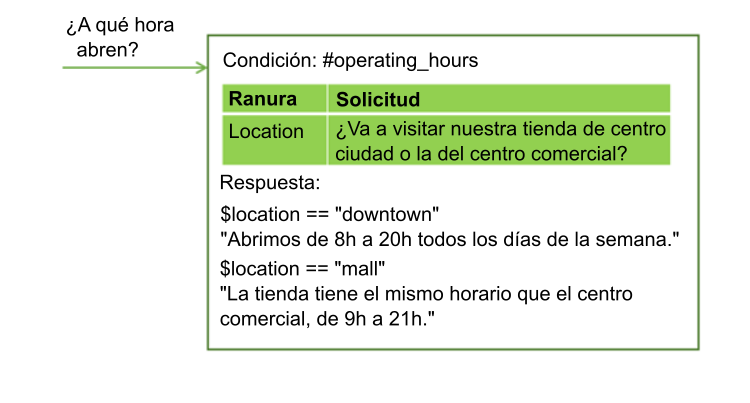
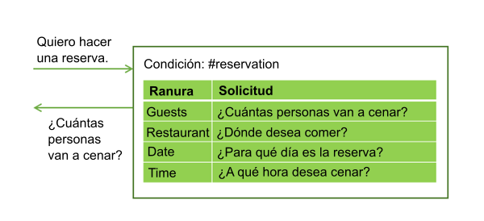
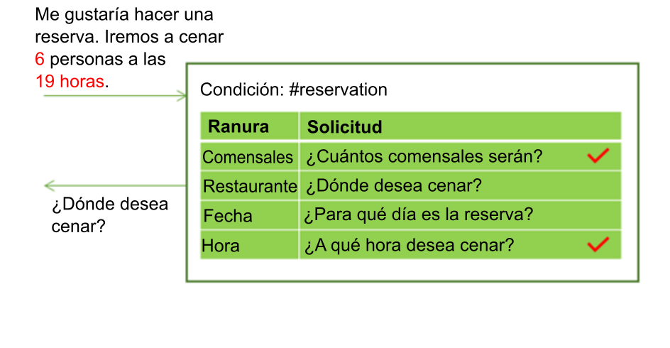
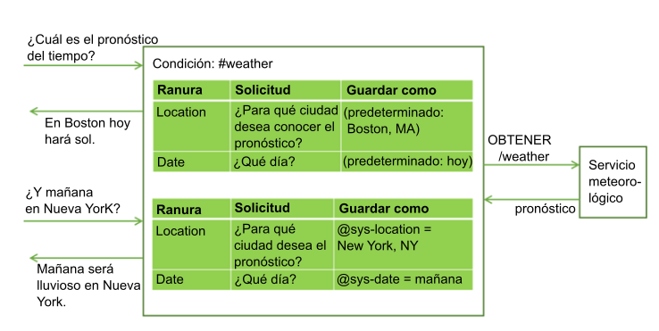
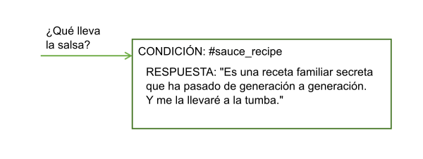

---

copyright:
  years: 2015, 2018
lastupdated: "2018-02-16"

---

{:shortdesc: .shortdesc}
{:new_window: target="_blank"}
{:tip: .tip}
{:pre: .pre}
{:codeblock: .codeblock}
{:screen: .screen}
{:javascript: .ph data-hd-programlang='javascript'}
{:java: .ph data-hd-programlang='java'}
{:python: .ph data-hd-programlang='python'}
{:swift: .ph data-hd-programlang='swift'}
{:table: .aria-labeledby="caption"}

# Obtención de información con ranuras
{: #dialog-slots}

Añada ranuras a un nodo de diálogo para obtener varios fragmentos de información de un usuario dentro de ese nodo. Las ranuras recopilan información al ritmo de los usuarios. Los detalles que proporciona el usuario se guardan, y el servicio solo pide los detalles que los usuarios no han guardado.

<iframe class="embed-responsive-item" id="youtubeplayer" type="text/html" width="640" height="390" src="https://www.youtube.com/embed/ES4GHcDsSCI?rel=0" frameborder="0" webkitallowfullscreen mozallowfullscreen allowfullscreen> </iframe>

## ¿Por qué añadir ranuras?
{: #why-add-slots}

Utilice ranuras para obtener la información que necesita para poder responder con precisión al usuario. Por ejemplo, si los usuarios hacen preguntas sobre las horas de funcionamiento, pero el horario difiere según ubicación de la tienda, puede hacer una pregunta complementaria sobre la ubicación de la tienda que tienen previsto visitar antes de responder. Luego puede añadir condiciones de respuesta que tengan en cuenta la información sobre ubicación proporcionada.



Las ranuras le pueden ayudar a recopilar varios fragmentos de información que necesita para completar una tarea compleja para un usuario, como hacer una reserva para cenar.



El usuario puede proporcionar valores para varias ranuras a la vez. Por ejemplo, la entrada puede incluir la información `There will be 6 of us dining at 7 PM.` (Iremos 6 personas a cenar a las 19 horas). Esta entrada contiene dos valores necesarios que faltaban: el número de comensales y la hora de la reserva. El servicio reconoce y guarda ambos, cada uno en su ranura correspondiente. Luego muestra la solicitud que está asociada a la siguiente ranura vacía.



Las ranuras permiten al servicio responder a preguntas complementarias sin tener que volver a restablecer el objetivo del usuario. Por ejemplo, un usuario puede solicitar una previsión meteorológica, y luego realizar una pregunta complementaria sobre el tiempo en otra ubicación o de otra manera. Si guarda las variables de previsión necesarias, como ubicación y día, en ranuras, si un usuario realiza una pregunta complementaria con nuevos valores de variables, puede sobrescribir los valores de la ranura con los nuevos valores proporcionados y ofrecer una respuesta que refleje la nueva información. (Para obtener más información sobre cómo realizar llamadas a un servicio externo desde un diálogo, consulte [Realización de llamadas mediante programación desde un nodo del diálogo](dialog-actions.html)).



La utilización de ranuras genera un flujo de diálogo más natural entre el usuario y el servicio, y es más fácil para gestionar que la recopilación de información utilizando muchos nodos separados.

## Adición de ranuras
{: #add-slots}

1.  Identifique las unidades de información que desea recopilar. Por ejemplo, para pedir una pizza, probablemente deseará recopilar la información siguiente:

    - Hora de entrega
    - Tamaño

1.  Si no ha empezado a crear un diálogo, siga las instrucciones en [Creación de un diálogo](dialog-build.html) para crear uno. 

1.  En la vista de edición del diálogo, pulse **Personalizar** y, a continuación, pulse el conmutador que hay junto a **Ranuras** para **activarlo**. 

    **Nota**: Para obtener más información sobre el recuadro de selección **Solicitar todo**, consulte [Solicitud de todo a la vez](dialog-slots.html#slots-prompt-for-everything).

1.  **Añada una ranura para cada unidad de información necesaria**.Para cada ranura, especifique estos detalles:

    - **Comprobar**: Identifique el tipo de información que desea extraer de la respuesta del usuario en la solicitud de la ranura. En la mayoría de los casos, se comprueban valores de entidad. De hecho, el constructor de condiciones que se visualiza sugiere entidades que puede utilizar para las comprobaciones. Sin embargo, también se pueden comprobar intenciones, tan solo tiene que escribir el nombre de la intención en el campo. Aquí puede utilizar los operadores AND y OR para definir condiciones más complejas.

      **Importante**: El valor de *Comprobar* se utiliza en primer lugar como condición, pero luego se convierte en el valor de la variable de contexto que ha indicado en el campo *Guardar como*. Si desea cambiar cómo se guarda el valor, cambie su formato, por ejemplo, y luego añada la expresión que reformatea el valor directamente para el campo **Comprobar**. 

      Por ejemplo, si una entidad tiene definidos patrones de expresiones regulares para la misma, entonces después de añadir el nombre de entidad, añada `.literal` al nombre de la entidad. Después de seleccionar `@email` en la lista de entidades definidas, por ejemplo, edite el campo **Comprobar** para que contenga `@email.literal`. Al añadir la propiedad `.literal`, indica que desea capturar el texto exacto que ha especificado el usuario y que se identifica como una dirección de correo electrónico en función de su patrón. Haga directamente este cambio de sintaxis en el campo **Comprobar**. 

      **Aviso:** Si desea aplicar una expresión compleja al valor antes de guardarlo, puede abrir el editor JSON para definir la expresión SpEL compleja. Sin embargo, la expresión compleja que defina en el editor JSON no se reflejará en el campo **Comprobar** campo cuando salga del editor JSON. Y si pulsa el campo **Comprobar** para seleccionarlo con posterioridad a haber definido su expresión compleja, se eliminará la expresión. 

      Evite comprobar valores de variables de contexto. Puesto que el valor que comprueba es también el valor que se guarda, cuando se utiliza una variable de contexto en la condición, puede dar lugar a un comportamiento inesperado si se utiliza en el contexto. No intente utilizar una ranura opcional para visualizar una respuesta sólo si se establece una variable de contexto dada. Si se establece la variable, la respuesta de Encontrar de la ranura que defina para la ranura opcional se visualizará junto con la respuesta devuelta por cualquiera otra ranura, una y otra vez.
      {: tip}

    - **Guardar como**: Especifique un nombre para la variable de contexto en la que va a guardar el valor que le interesa de la respuesta del usuario en la solicitud de la ranura. No especifique una variable de contexto que se haya utilizado anteriormente en el diálogo, por lo que podría tener un valor. Solo se muestra la solicitud correspondiente a la ranura cuando la variable de contexto para la ranura es nula.

    - **Solicitud**: Escriba una sentencia que obtenga el fragmento de información que necesita del usuario. Después de que se muestre esta solicitud, la conversación se detiene y el servicio espera a que el usuario responda.

    - Si desea mostrar información diversa de seguimiento con base a si el usuario ha proporcionado la información que necesita en la respuesta a la solicitud de ranura inicial, puede editar la ranura (pulsando el icono **Editar ranura** ) y definirla: 

      - **Encontrado**: Se visualiza después de que el usuario proporcione la información esperada. 

      - **No encontrado**: Se visualiza si la información proporcionada por el usuario no se entiende, o no se proporciona en el formato esperado. Si la ranura se cumplimenta correctamente, o si se comprende la entrada de usuario y la gestiona un manejador de ranura, entonces esta sentencia nunca se visualiza. 

      Para obtener información sobre cómo definir las condiciones y las acciones asociadas para las respuestas Encontrado y No encontrado, consulte [Adición de condiciones a las respuestas Encontrado y No encontrado](dialog-slots.html#slot-handler-next-steps).

    En esta tabla se muestran los valores de ranura de ejemplo para un nodo que ayuda a los usuarios a realizar un pedido de una pizza recopilando dos elementos de información, el tamaño de la pizza y el tiempo de entrega. 

    <table>
    <caption>Ejemplos de ranuras para el pedido de pizzas</caption>
    <tr>
      <th>Comprobar</th>
      <th>Guardar como</th>
      <th>Solicitud</th>
      <th>Pregunta complementaria si se encuentra</th>
      <th>Pregunta complementaria si no se encuentra</th>
    </tr>
    <tr>
      <td>@size</td>
      <td>$size</td>
      <td>What size pizza would you like? (¿De qué tamaño desea la pizza?)</td>
      <td>$size it is (Es $size). </td>
      <td>What size did you want? We have small, medium, and large. (¿Qué tamaño quería? Tenemos pequeña, mediana y grande). </td>
    </tr>
    <tr>
      <td>@sys-time</td>
      <td>$time</td>
      <td>When do you need the pizza by? (¿Cuándo quiere la pizza?)</td>
      <td>For delivery by $time (Para entregarla a las $time.   </td>
      <td>What time did you want it delivered? We need at least a half hour to prepare it (¿A qué hora quería la pizza? Necesitamos al menos media hora para prepararla). </td>
    </tr>
    </table>

1.  **Haga una ranura opcional o inhabilítela bajo determinadas condiciones**. Una ranura se puede configurar opcionalmente de estas formas: 

    - **Opcional**: Para hacer una ranura opcional, añada una ranura sin una solicitud. El servicio no solicita información al usuario, pero busca la información en la entrada del usuario, y guarda el valor si el usuario la proporciona. Por ejemplo, supongamos que desea añadir una ranura que capture información sobre restricciones alimentarias en caso de que el usuario especifique una. Sin embargo, no desea solicitar a todos los usuarios esta información alimentaria, ya que en la mayoría de los casos es irrelevante.

       <table>
       <caption>Ranura opcional</caption>
       <tr>
          <th>Información</th>
          <th>Comprobar</th>
          <th>Guardar como</th>
       </tr>
       <tr>
          <td>Wheat restriction (Sin gluten)</td>
          <td>@dietary</td>
          <td>$dietary</td>
      </tr>
      </table>

          Si una ranura es opcional, solo haga referencia a su variable de contexto en el texto de la respuesta de nivel de nodo si lo puede expresar de modo que tenga sentido aunque no se especifique ningún valor para la ranura. Por ejemplo, supongamos que desea expresar una sentencia como la siguiente: `I am ordering a $size $dietary pizza for delivery at $time.` (Voy a pedir una pizza $size $dietary para las $time). El texto resultante tiene sentido independientemente de que se haya o no se haya proporcionado la información de restricción en la dieta como, por ejemplo, `gluten-free` (sin gluten) o `dairy-free` (sin lactosa). El resultado es, `I am ordering a large gluten-free pizza for delivery at 3:00PM.` (Estoy pidiendo una pizza grande sin gluten para ser entregada a las 15:00 h). o `I am ordering a large pizza for delivery at 3:00PM.` (Estoy pidiendo una pizza grande para ser entregada a las 15:00 h).
      {: tip}

    - **Condicional**: Si desea una ranura ser habilitada únicamente bajo determinadas condiciones, puede añadir una condición a la misma. Por ejemplo, si la ranura 1 solicita una hora de inicio de una reunión, la ranura 2 captura la duración de la reunión y la ranura 3 captura la fecha de finalización, podría querer habilitar la ranura 3 (y solicitar por la hora de finalización de la reunión) únicamente si no se proporciona el valor para la ranura 2. Si desea que una ranura sea condicional, edítela y desde el menú **Más** , seleccione **Habilitar condición**. Defina la condición que se debe satisfacer para habilitar la ranura. 

      Puede condicionar el valor de una variable de contexto desde una ranura anterior porque el orden en el que se listan las ranuras es el orden en el que se evalúan. Sin embargo, compruebe únicamente condiciones con un valor de variable de contexto de ranura que esté seguro que existirá cuando se evalúe esta ranura. Por ejemplo, asegúrese de que la ranura anterior es obligatoria.
    {: tip}
1.  **Mantenga a los usuarios encaminados**.
    Puede definir manejadores de ranura que proporcionan respuestas a preguntas que pueden efectuar los usuarios durante la interacción y que sean tangenciales a la finalidad del nodo.

    Por ejemplo, el usuario puede preguntar sobre la receta de la salsa de tomate o sobre dónde adquiere los ingredientes. Para manejar estas preguntas de otro ámbito, pulse el enlace **Gestionar manejadores** y añada una condición y una respuesta para cada pregunta prevista.

    

    Después de responder a la pregunta de otro ámbito, se muestra la solicitud asociada a la ranura vacía actual.

    Esta condición se activa si el usuario proporciona una entrada que coincide con las condiciones del manejador de ranura en cualquier momento durante el flujo de nodos del diálogo hasta que se muestra la respuesta de nivel de nodo. Consulte [Manejo de solicitudes para salir de un proceso](dialog-slots.html#slots-node-level-handler) para conocer otras maneras de utilizar un manejador de ranura.
1.  **Añada una respuesta de nivel de nodo**.
    Esta respuesta a nivel de nodo no se ejecuta hasta que se rellenen todas las ranuras necesarias. Puede añadir una respuesta que resuma la información que ha recopilado. Por ejemplo, `A $size pizza is scheduled for delivery at $time. Enjoy!`
(Se ha previsto la entrega de una pizza $size para su entrega a las $time. ¡Disfrútela!).


      Si desea definir diferentes respuestas basándose en determinadas condiciones, pulse **Personalizar** y, a continuación, habilite el conmutador **Varias respuestas** para **activarlo**. Para obtener información sobre respuestas condicionales, consulte [Respuestas condicionales](dialog-overview.html#multiple).
1.  **Añada lógica que restablezca las variables de contexto de la ranura**.
    A medida que recopila respuestas del usuario por ranura, se van guardando en variables de contexto. Puede utilizar las variables de contexto para pasar la información a otro nodo o a una aplicación o servicio externo para que las utilicen. Sin embargo, después de pasar la información, debe establecer las variables de contexto como nulas para restablecer el nodo de modo que pueda volver a recopilar información. No puede anular las variables de contexto dentro del nodo actual porque el servicio no saldrá del nodo hasta que se hayan rellenado las ranuras necesarias. Considere la posibilidad de utilizar uno de los siguientes métodos:

    - Añadir proceso a la aplicación externa que anula las variables.
    - Añadir un nodo hijo que anule las variables.
    - Insertar un nodo padre que anule las variables y que luego salte al nodo con ranuras.

¡Pruébelo! Siga la [guía de aprendizaje](tutorial-slots.html) paso a paso. 

## Sugerencias para la utilización de ranuras
{: #slots-tips}

Las siguientes propiedades de las ranuras puede ayudarle a comprobar y establecer valores en variables de contexto de la ranura. 

| Nombre de propiedad | Descripción |
|------------------------|-------------|
| `all_slots_filled`     | Se evalúa como verdadera únicamente si se han establecido todas las variables de contexto de todas las ranuras en el nodo. Consulte [Cómo evitar que se muestre una respuesta de la condición Encontrado cuando no es necesario](dialog-slots.html#slots-stifle-found-responses) para obtener un ejemplo de su uso. |
| `event.current_value`  | Valor actual de la variable de contexto correspondiente a esta ranura. Consulte [Sustitución de un valor de variable de contexto de ranura](dialog-slots.html#slots-found-handler-event-properties) para obtener un ejemplo del uso de esta propiedad y la propiedad event.previous_value. |
| `event.previous_value` | Valor anterior de la variable de contexto correspondiente a esta ranura. |
| `has_skipped_slots`    | Su valor es verdadero si se procesa alguno de los manejadores de ranura o alguna de las ranuras configuradas con una opción de ir al siguiente paso que salta ranuras. Consulte [Adición de condiciones a las respuestas de Encontrado y No encontrado](dialog-slots.html#slot-handler-next-steps) para obtener más información sobre las opciones del siguiente paso para las ranuras y [Manejo de solicitudes para salir de un proceso](dialog-slots.html#slots-node-level-handler) para obtener más información sobre las opciones del siguiente paso para manejadores de ranura. |
| `slot_in_focus`        | Fuerza la aplicación de la condición de ranura únicamente a la ranura actual. Consulte [Obtención de confirmación](dialog-slots.html#slots-get-confirmation) para obtener más detalles. |
{: caption="Propiedades de ranura" caption-side="top"}

Considere la utilización de estas aproximaciones para el manejo de tareas comunes. 

- [Solicitud de todo a la vez](dialog-slots.html#slots-prompt-for-everything)
- [Captura de varios valores](dialog-slots.html#slots-multiple-entity-values)
- [Reformateo de valores](dialog-slots.html#slots-reformat-values)
- [Obtención de confirmación](dialog-slots.html#slots-get-confirmation)
- [Sustitución de un valor de variable de contexto de ranura](dialog-slots.html#slots-found-handler-event-properties)
- [Cómo evitar confusiones con números](dialog-slots.html#slots-avoid-number-confusion)
- [Adición de condiciones a las respuestas de Encontrado y No encontrado](dialog-slots.html#slot-handler-next-steps)
- [Seguir adelante después de varios intentos con anomalías](dialog-slots.html#slots-stop-trying-after-3)
- [Cómo evitar que se muestre una respuesta de la condición Encontrado cuando no es necesario](dialog-slots.html#slots-stifle-found-responses)
- [Manejo de solicitudes para salir de un proceso](dialog-slots.html#slots-node-level-handler)

### Solicitud de todo a la vez
{: #slots-prompt-for-everything}

Incluya una solicitud inicial para todo el nodo que indique claramente a los usuarios las unidades de información que desea que proporcionen. Si se muestra en primer lugar esta solicitud, se proporciona a los usuarios la oportunidad de ofrecer todos los detalles a la vez en lugar de tener que esperar a que se les solicite cada fragmento de información.

Por ejemplo, cuando el nodo se activa porque un cliente quiere pedir una pizza, puede responder con una solicitud preliminar de tipo `I can take your pizza order. Tell me what size pizza you want and the time that you want it delivered` (Puedo realizar su pedido. Dígame qué pizza quiere y a qué hora la desea). 

Si el usuario ofrece un fragmento de esta información en su solicitud inicial, no se muestra la solicitud. Por ejemplo, supongamos que la entrada inicial es `I want to order a large pizza` (Quiero pedir una pizza grande). Cuando el servicio analiza la entrada, reconoce `large` (grande) como el tamaño de la pizza y rellena la ranura **Size** (Tamaño) con el valor especificado. Puesto que una de las ranuras contiene información, se salta la visualización de la solicitud inicial para evitar el tener que volver a solicitar información sobre el tamaño de la pizza. En lugar de ello, muestra la solicitud correspondiente a las ranura restantes en las que falta información.

En el panel Personalizar en el que ha habilitado la característica Ranuras, marque el recuadro de selección **Solicitar todo** para habilitar la solicitud inicial. Este valor añade el campo **Si no hay ranuras con información, preguntar esto primero** al nodo, donde puede especificar el texto que solicita toda la información al usuario.

### Captura de varios valores
{: #slots-multiple-entity-values}

Puede pedir una lista de artículos y guardarlos en una ranura.

Por ejemplo, supongamos que desea preguntar a los usuarios si desean ingredientes adicionales en su pizza. Para ello, defina una entidad (@toppings), y los valores aceptados para la misma (pepperoni, cheese, mushroom, etc.). Añada una ranura que solicite al usuario ingredientes adicionales. Utilice la propiedad values del tipo de entidad para capturar varios valores, si se especifican.

<table>
<caption>Ranura de varios valores</caption>
<tr>
  <th>Comprobar</th>
  <th>Guardar como</th>
  <th>Solicitud</th>
  <th>Pregunta complementaria si se encuentra</th>
  <th>Pregunta complementaria si no se encuentra</th>
</tr>
<tr>
  <td>@toppings.values</td>
  <td>$toppings</td>
  <td>Any toppings on that? (¿Desea algún ingrediente adicional?)</td>
  <td>Great addition (Buen ingrediente).</td>
  <td>What toppings would you like? We offer... (¿Qué ingrediente desea añadir? Le ofrecemos...)</td>
</tr>
</table>

Para hacer referencia posteriormente a ingredientes adicionales especificados por el usuario, utilice la sintaxis `<? $entity-name.join(',') ?>` para obtener una lista de cada artículo de la matriz de ingredientes y sepárelos con una coma. Por ejemplo, `I am ordering you a $size pizza with <? $toppings.join(',') ?> for delivery by $time` (Estoy pidiendo una pizza $size con <? $toppings.join(',') ?> para entregar a las $time). 

### Reformateo de valores
{: #slots-reformat-values}

Puesto que está pidiendo información al usuario y tiene que hacer referencia a su entrada en las respuestas, considere la posibilidad de reformatear los valores de modo que los pueda mostrar en un formato más adecuado.

Por ejemplo, los valores de hora se guardan en el formato `hh:mm:ss`. Puede utilizar el editor de JSON para la ranura para reformatear el valor de hora cuando lo guarde para que utilice el formato `horas:minutos AM/PM`:

```json
{
  "context":{
    "time": "<? @sys-time.reformatDateTime('h:mm a') ?>"
  }
}
```
{: codeblock}

Consulte [Métodos para procesar valores](dialog-methods.html) para ver otras ideas de reformateo.

### Obtención de confirmación
{: #slots-get-confirmation}

Añada una ranura después de las otras que solicite al usuario que confirme que la información que ha recopilado es precisa y completa. Esta ranura puede buscar respuestas que coincidan con las intenciones #yes o #no. 

<table>
<caption>Ranura de confirmación</caption>
<tr>
  <th>Comprobar</th>
  <th>Guardar como</th>
  <th>Solicitud</th>
  <th>Pregunta complementaria si se encuentra</th>
  <th>Pregunta complementaria si no se encuentra</th>
</tr>
<tr>
  <td>#yes || #no</td>
  <td>$confirmation</td>
  <td>I'm going to order you a `$size` pizza for delivery at `$time`. Should I go ahead? (Voy a pedirle una pizza `$size` para las `$time`. ¿Continúo?). </td>
  <td>Your pizza is on its way! (Su pizza está de camino). </td>
  <td>Consulte *Respuesta compleja*</td>
</tr>
</table>

**Respuesta compleja** Puesto que los usuarios pueden incluir sentencias afirmativas o de negación en otros lugares durante el diálogo (*Oh yes, we want the pizza delivered at 5pm*) (Sí, queremos que nos entreguen la pizza a las 17 h) o (*no guests tonight, let's make it a small*) (No tenemos invitados esta noche, la queremos pequeña), utilice la propiedad `slot_in_focus` para dejar claro en la condición de ranura que está buscando una respuesta del estilo Sí o No a la solicitud de esta ranura en concreto. 

```json
(#yes || #no) && slot_in_focus
```
{: codeblock}

La propiedad `slot_in_focus` siempre se evalúa como un valor booleano (true o false). Incluya esta propiedad únicamente en una condición para la que desea un resultado booleano. No la utilice, por ejemplo, en condiciones de ranura que comprueben el tipo de entidad y luego guarden el valor de la entidad.
{: tip}

En la solicitud **No encontrado**, deje claro que está buscando una respuesta del estilo Sí o No. 

```json
{
  "output":{
    "text": {
      "values": [
        "Respond with Yes to indicate that you want the order to
         be placed as-is, or No to indicate that you do not."
      ]
    }
  }
}
```
{: codeblock}

En la solicitud de **Encontrado**, añada una condición que compruebe una respuesta del estilo No (#no). Si se encuentra, se vuelve a solicitar de nuevo toda la información y se restauran las variables de contexto guardadas con anterioridad. 

```json
{
  "conditions": "#no",
  "output":{
    "text": {
      "values": [
        "Let's try this again. Tell me what size pizza you want and the time..."
      ]
    }
  },
  "context":{
    "size": null,
    "time": null,
    "confirmation": null
  }
}
```
{: codeblock}

### Sustitución de un valor de variable de contexto de ranura
{: #slots-found-handler-event-properties}

Si, en cualquier momento antes de que el usuario salga de un nodo con ranuras, el usuario proporciona un nuevo valor para una ranura, el nuevo valor se guarda en la variable de contexto de ranura, sustituyendo el valor especificado previamente. El diálogo puede reconocer de forma explícita que se ha producido esta sustitución utilizando propiedades especiales definidas para la condición de Encontrado: 

- `event.previous_value`: Valor anterior de la variable de contexto correspondiente a esta ranura.
- `event.current_value`: Valor actual de la variable de contexto correspondiente a esta ranura.

Por ejemplo, supongamos que el diálogo pregunta por una ciudad de destino para una reserva de vuelo. El usuario especifica `Paris`. Define la variable de contexto de la ranura $destination como *Paris*. A continuación, el usuario, dice `Oh wait. I want to fly to Madrid instead (Un momento; quiero ir a Madrid)` Si configura la condición Encontrado del siguiente modo, el diálogo puede manejar correctamente este tipo de cambio.

Cuando el usuario responde, si se encuentra @destination: 

```json
Condition: (event.previous_value != null) &&
           (event.previous_value != event.current_value)
    Response: Ok, updating destination from
    <? event.previous_value ?> to <? event.current_value ?>.
Response: Ok, destination is $destination.
```
{: codeblock}

Esta configuración de ranura permite al diálogo reaccionar ante un cambio de destino del usuario con la respuesta `Ok, updating the destination from Paris to Madrid` (De acuerdo, cambio el destino París por Madrid).

### Cómo evitar confusiones con números
{: #slots-avoid-number-confusion}

Algunos valores que proporcionan los usuarios se pueden identificarse como más de un tipo de entidad.

Es posible que tenga dos ranuras que almacenen el mismo tipo de valor, como por ejemplo una fecha de llegada y una de salida. Incorpore lógica en las condiciones de la ranura que distinga entre sí valores similares.

Además, el servicio puede reconocer varios tipos de entidad en una sola entrada de usuario. Por ejemplo, si un usuario especifica una moneda, se reconoce como el tipo de entidad @sys-currency y @sys-number. Realice algunas pruebas en el panel *Pruébelo* para comprender la forma en la que el sistema interpreta distintas entradas de usuario e incorpore en las condiciones lógica que evite posibles interpretaciones erróneas. 

En la lógica exclusiva de la característica de ranuras, cuando dos entidades se reconocen como una sola entrada de usuario, se utiliza la que tiene el intervalo más largo. Por ejemplo, si el usuario especifica *May 2*, aunque el servicio de {{site.data.keyword.conversationshort}} reconoce las entidades @sys-date (05022017) y @sys-number (2) en el texto, solo se registra y se aplica a la ranura la entidad con un mayor rango (@sys-date).
{: tip}

### Adición de condiciones a las respuestas de Encontrado y No encontrado
{: #slot-handler-next-steps}

Para cada ranura, puede utilizar las respuestas condicionales con acciones asociadas para ayudarle a extraer la información que necesita del usuario. Para ello, siga estos pasos: 

1.  Pulse el icono **Editar ranura**  en la ranura en la que desea añadir respuestas condicionales de Encontrado y No encontrado. 
1.  Desde el menú **Más** , seleccione **Habilitar respuestas condicionales**. 
1.  Especifique la condición y la respuesta a visualizar cuando se satisface dicha condición. 

    **Ejemplo de Encontrado**: La ranura espera la hora en la que realizar la reserva para la cena. Podría utilizar @sys-time en el campo *Comprobar* para capturarla. Para evitar guardar un tiempo no válido, añada una respuesta condicional que, por ejemplo, compruebe si la hora que se ha proporcionado es anterior a la hora del último turno en el restaurante.  
`@sys-time.after('21:00:00')` La correspondiente respuesta podría ser similar a *Our last seating is at 9PM.* (Nuestro último turno es a las 21 h).   

    **Ejemplo de No encontrado**: La ranura esperaba una entidad @location que acepta un conjunto específico de ciudades donde la cadena tiene restaurantes. La condición de No encontrado podría comprobar @sys-location en el caso de que el usuario especificase una ciudad válida donde la cadena no tuviese restaurante. La correspondiente respuesta podría ser, *We have no restaurants in that location.* (No tenemos restaurantes en esta ubicación). 

1.  Si desea personalizar lo que sucede a continuación si la condición se cumple, pulse el icono **Editar respuesta** . 

    Para las respuestas de Encontrado (que se visualizan cuando el usuario proporciona un valor que coincide con el tipo de valor especificado en el campo Comprobar), puede elegir una de estas acciones para realizar a continuación: 

      - **Continuar (predeterminado)**: Indica al servicio a continuar en la siguiente ranura vacía después de visualizar la respuesta. En la respuesta asociada, nos aseguramos de que se ha entendido la entrada del usuario. Por ejemplo, *Ok. You want to schedule it for $date.* (De acuerdo. Desea planificarla el $date). 
      - **Borrar ranura y solicitar de nuevo**: Si está utilizando una entidad en el campo *Comprobar* que debe recoger el valor erróneo, añada condiciones que capturen las malinterpretaciones más probables, y utilice esta acción para borrar el valor de ranura actual y solicitar el valor correcto. 
      - **Saltar a respuesta**:
Si, cuando la condición que define se satisface, no necesita cumplimentar ninguna de las ranuras restantes en este nodo, elija esta acción para saltar el resto de las ranuras e ir directamente a la siguiente respuesta a nivel de nodo. Por ejemplo, podría añadir una condición para comprobar si la edad del usuario está por debajo de los 16 años. Si fuese así, podría saltar el resto de las ranuras solicitando respuestas acerca de los permisos de conducción del usuario. 

    Para las respuestas de No encontrado (que se visualizan cuando el usuario no ha proporcionado un valor válido), puede elegir realizar una de estas acciones: 

      - **Esperar una entrada de usuario (predeterminado)**: Detiene la conversación y el servicio espera a que el usuario responda. En el caso más sencillo, el texto que especifique aquí puede indicar más explícitamente el tipo de información que desea que proporcione el usuario. Si utiliza esta acción con una respuesta condicional, asegúrese de elaborar la respuesta condicional de forma que indique con claridad el error en la respuesta del usuario y lo que en su lugar espera que responda.  
      - **Solicitar de nuevo**: Después de la respuesta de No encontrado, el servicio repite de nuevo la solicitud de la ranura y espera a que el usuario responda. Si utiliza esta acción con una respuesta condicional, la respuesta tan solo puede explicar qué era lo incorrecto en la respuesta que ha proporcionado el usuario. No es necesario reiterar el tipo de información que desea que proporcione el usuario porque la solicitud de la ranura habitualmente lo explica. 

        Si elige esta opción, considere en añadir como mínimo una variación a la respuesta de No encontrado de forma que el usuario no vea exactamente el mismo texto más de una vez. Aproveche la oportunidad de una reformulación distinta para explicar la información que necesita que proporcione el usuario y su formato.
        {: tip}

      - **Saltar esta ranura**: Indica al servicio que deje de intentar cumplimentar la ranura actual y, en su lugar, continúe en la solicitud de la siguiente ranura vacía. Esta opción es útil en una ranura donde desea que sea opcional como visualizar una solicitud que solicite información al usuario. Por ejemplo, podría tener una entidad @seating (reserva) para capturar las preferencias de reservas del restaurante tales como *outside* (exterior), *near the fireplace* (cerca de la chimenea), *private* (reservado), etc. Puede añadir una ranura que solicite al usuario *Do you have any seating preferences?* (¿Tiene alguna preferencia para la reserva?) que compruebe `@seating.values`.  Si se proporciona una respuesta válida, se guarda la información de preferencias en `$seating_preferences`. Sin embargo, elegir esta acción como siguiente paso de la respuesta de No encontrado, indica al servicio que deje de intentar cumplimentar esta ranura si el usuario no proporciona una respuesta válida para la misma. 
      - **Saltar a respuesta**:
Si, cuando la condición que define se satisface, no necesita cumplimentar ninguna de las ranuras restantes en este nodo, elija esta acción para saltar el resto de las ranuras e ir directamente a la siguiente respuesta a nivel de nodo. Por ejemplo, si después de capturar la información de un vuelo de ida, la solicitud de la ranura es *Are you buying round trip tickets?* (¿Está comprando billetes de ida y vuelta?) la condición de No encontrado puede comprobar si se indica #No, en cuyo caso se utilizará esta opción para saltar el resto de las ranuras para capturar información sobre el vuelo de vuelta, para ir en su lugar directamente a la respuesta a nivel de nodo. 

    Pulse **Atrás** para volver a la vista de edición de la ranura.
1.  Para añadir otra respuesta condicional, pulse **Añadir una respuesta**, y luego especifique la condición y la respuesta a visualizar si se cumple la condición. 

    Asegúrese de añadir al menos una respuesta que se visualizará de cualquier manera. Puede dejar el campo de condición en blanco para capturar todas las respuestas. El servicio cumplimenta de forma automática el campo de la condición vacía con la condición especial `true`. 

1.  Pulse **Guardar** para guardar los cambios, cierre la vista de edición de la ranura, y vuelva a la vista de edición del nodo. 

### Seguir adelante después de varios intentos con anomalías
{: #slots-stop-trying-after-3}

Proporcione a los usuarios una forma de salir de una ranura si no pueden responder correctamente después de varios intentos utilizando las respuestas condicionales de No encontrado. En la respuesta de captura general ("catchall"), abra el editor JSON para añadir una variable de contexto de contador que realizará un seguimiento del número de veces que se ha devuelto la respuesta de No encontrado. En un nodo anterior, asegúrese de establecer el valor de la variable de contexto de contador inicial en 0.

En este ejemplo, el servicio solicita el tamaño de la pizza. Permite que el usuario responda a la pregunta incorrectamente 3 veces antes de establecer en nombre del usuario un tamaño (medio). (Puede incluir una ranura de confirmación donde los usuarios siempre pueden corregir el tamaño cuando se les pida confirmar la información del pedido). 

```json
Check for: @size
Save as: $size
Catchall Not found condition:
{
  "output": {
    "text": {
      "values": [
        "What size did you want? We have small, medium, and large."
      ],
      "selection_policy": "sequential"
    }
  },
"context": {
   "counter": "<? context['counter'] + 1 ?>"
  }
}
```
{: codeblock}

Para responder de forma distinta después de 3 intentos, añada otra condición de No encontrado como esta: 
```json
{
  "conditions": "$counter > 1",
  "output": {
    "text": {
      "values": [
        "We will bring you a size medium pizza."
      ]
    }
  },
"context": {
   "size": "medium"
  }
  ```
  {: codeblock}

Esta condición es más precisa que la condición de verdadero de la respuesta de captura genérica ("catchall"), de forma que debe mover esta respuesta para que aparezca antes de la respuesta condicional original o por el contrario nunca se activará. Seleccione la respuesta condicional y utilice las flechas para moverla hacia arriba. 

### Cómo evitar que se muestre una respuesta de la condición de Encontrado cuando no es necesario
{: #slots-stifle-found-responses}

Si especifica respuestas de la condición de Encontrado para varias ranuras, si un usuario especifica valores para varias ranuras a la vez, se muestra la respuesta de la condición de Encontrado para al menos una de las ranuras. Es probable que desee que se devuelva la respuesta de la condición de Encontrado para todas ellas o para ninguna de ellas.

Para evitar que se muestran respuestas de Encontrado, puede hacer una de estas cosas para cada respuesta de la condición de Encontrado:

- Añada una condición a la respuesta que impida que se muestre si determinadas ranuras contienen información. Por ejemplo, puede añadir una condición como `!($size && $time)`, que evita que se muestre la respuesta si se especifican las variables de contexto $size y $time.
- Añada la condición `!all_slots_filled` a la respuesta. Este valor impide que se muestre la respuesta si todas las ranuras contienen información. No utilice este método si va a incluir una ranura de confirmación. La ranura de confirmación también es una ranura, y generalmente deseará evitar que se muestren las respuestas de la condición de Encontrado antes de que se rellene la propia ranura de confirmación.

### Manejo de solicitudes para salir de un proceso
{: #slots-node-level-handler}

Añada al menos un manejador de ranura que pueda reconocer cuándo un usuario desea salir del nodo.

Por ejemplo, en un nodo que recopile información para una cita en una peluquería para mascotas, puede añadir un manejador de ranura que condicione la intención #cancel, que reconozca expresiones como <q>Forget it. I changed my mind. (Olvídalo. He cambiado de opinión.).</q>

1.  En el editor de JSON del manejador, rellene todas las variables de contexto de la ranura con valores ficticios para evitar que el nodo continúe solicitando la información que falta. Y, en la respuesta del manejador, añada un mensaje como por ejemplo `Ok, we'll stop there. No appointment will be scheduled (Lo dejamos aquí. No se planificará ninguna cita)..` 
1.  Elija entre las siguientes opciones la acción que desea que el servicio tome a continuación:

    - **Solicitar de nuevo (predeterminado)**: Muestra la solicitud en la que se encontraba el usuario interactuando justo antes de realizar la pregunta fuera del ámbito existente. 
    - **Saltar la ranura actual**: Visualiza la solicitud asociada con la ranura posterior a la ranura en la que estaba interactuando el usuario antes de realizar la pregunta fuera del ámbito existente. El servicio no realiza intentos adicionales de cumplimentar la ranura que ha saltado. 
    - **Saltar a respuesta**: Salta las solicitudes del resto de las ranuras, incluida la ranura en la que se encontraba interactuando el usuario justo antes de realizar la pregunta fuera del ámbito existente. 

1.  En la respuesta de nivel de nodo, añada una condición que comprueba si hay un valor ficticio en una de las variables de contexto de la ranura. Si se encuentra, se muestra un último mensaje como el siguiente: `If you decide to make an appointment later, I'm here to help.` (Si más adelante quiere planificar una cita, aquí estaremos para ayudarle). Si no se encuentra, muestra el mensaje de resumen estándar del nodo, como por ejemplo `I am making a grooming appointment for your $animal at $time on $date.` (Estoy planificando una cita para su $animal a las $time el día $date).

A continuación se muestra un ejemplo de JSON que define un manejador de ranura para el ejemplo de solicitud de pizzas. Tenga en cuenta, tal como se ha indicado anteriormente, las variables de contexto se han establecido todas ellas con valores ficticios. De hecho, la variable de contexto `$size` se ha establecido en `dummy`. Este valor de $size desencandena la respuesta a nivel de nodo para mostrar el mensaje apropiado y salir del nodo de ranuras. 

```json
{
"conditions": "#cancel",
 "output": {
   "text": {
     "values": [
       "Ok, we'll stop there. No pizza delivery will be scheduled."
     ],
    "selection_policy": "sequential"
    }
  },
"context": {
   "time": "12:00:00",
   "size": "dummy",
   "confirmation":"true"
}
}
```
{: codeblock}

**Importante**: Tenga en cuenta la lógica utilizada en las condiciones que se evalúan antes de esta para poder crear condiciones distintas. Cuando se recibe una entrada de usuario, las condiciones se evalúan en este orden:

- Condiciones de Encontrado a nivel de la ranura actual. 
- Manejadores de ranura en el orden en el que aparecen listados.
- Condiciones de No encontrado a nivel de ranura actual.

Tenga cuidado al añadir condiciones que siempre se evalúan como true (como las condiciones especiales, `true` o `anything_else`) como manejadores de ranura. Por ranura, si el manejador de ranura se evalúa como true, la condición de No encontrado se omite por completo. Por lo tanto, el uso de un manejador de ranura que siempre se evalúe como true evita de forma efectiva la evaluación de la condición No encontrado para cada ranura.
{: tip}

Por ejemplo, supongamos que se ofrecen servicios de peluquería para todos los animales excepto para gatos. Para la ranura Animal, es probable que se le ocurra utilizar la siguiente condición de ranura para evitar que el valor `cat` se guarde en la ranura Animal:

```json
Check for @animal && !@animal:cat, then save it as $animal.
```
{: codeblock}

Y, para comunicar a los usuarios que no acepta gatos, podría especificar el siguiente valor en la condición de No encontrado de la ranura Animal:

```json
If @animal:cat then, "I'm sorry. We do not groom cats."
```
{: codeblock}

Aunque sea lógico, si también define un manejador de ranura de #exit, entonces (dado el orden de evaluación de condiciones) esta condición de No encontrado probablemente nunca se active. Puede utilizar en su lugar esta condición de ranura:

```json
Check for @animal, then save it as $animal.
```
{: codeblock}

Y, para gestionar una posible respuesta `cat`, añada este valor a la condición de Encontrado:

```json
If @animal:cat then, "I'm sorry. We do not groom cats."
```
{: codeblock}

En el editor de JSON de la condición de Encontrado, restablezca el valor de la variable de contexto $animal porque actualmente está establecida en cat y no debería ser así.

```json
{
  "output":{
    "text": {
      "values": [
        "I'm sorry. We do not groom cats."
      ]
    }
  },
  "context":{
    "animal": null
  }
}
```
{: codeblock}

## Ejemplos de ranuras

Para acceder a archivos JSON que implementen distintos escenarios de uso común de ranuras, vaya al [repositorio de conversaciones ](https://github.com/watson-developer-cloud/community/tree/master/conversation){: new_window} comunitario en GitHub.

Para revisar un ejemplo, descargue uno de los archivos JSON de ejemplo y luego impórtelo como un nuevo espacio de trabajo. En el separador Diálogo, puede revisar los nodos del diálogo para ver cómo se han implementado las ranuras para responder ante distintos casos de uso.
