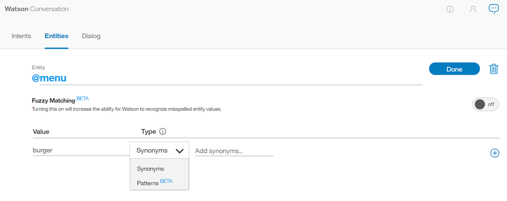
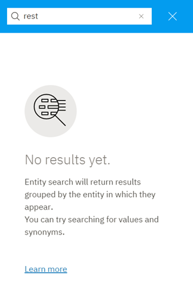

---

copyright:
  years: 2015, 2018
lastupdated: "2018-01-30"

---

{:shortdesc: .shortdesc}
{:new_window: target="_blank"}
{:tip: .tip}
{:pre: .pre}
{:codeblock: .codeblock}
{:screen: .screen}
{:javascript: .ph data-hd-programlang='javascript'}
{:java: .ph data-hd-programlang='java'}
{:python: .ph data-hd-programlang='python'}
{:swift: .ph data-hd-programlang='swift'}

# Definición de entidades
{: #entities}

Las ***entidades*** representan una clase de objeto o un tipo de datos que es relevante para el objetivo del usuario. Cuando reconoce las entidades mencionadas en la información de entrada del usuario, el servicio {{site.data.keyword.conversationshort}} puede elegir las acciones específicas que debe llevar a cabo para cumplir una intención.

<iframe class="embed-responsive-item" id="youtubeplayer" type="text/html" width="640" height="390" src="https://www.youtube.com/embed/kAZ9m-oCKxM" frameborder="0" webkitallowfullscreen mozallowfullscreen allowfullscreen> </iframe>

## Límites de las entidades
{: #entity-limits}

El número de entidades, los valores de las entidades y los sinónimos que puede crear dependen del plan del servicio {{site.data.keyword.conversationshort}}:

| Plan de servicio      | Entidades por espacio de trabajo | Valores de entidad por espacio de trabajo | Sinónimos de entidad por espacio de trabajo |
|-------------------|-----------------------:|----------------------------:|--------------------------------:|
| Estándar/ Premium |                          1000 |                            100.000 |                              100.000 |
| Lite              |                            25 |                            100.000 |                              100.000 |

Las entidades del sistema cuyo uso habilite cuentan en los totales de uso de su plan.

## Creación de entidades
{: #creating-entities}

Utilice la herramienta {{site.data.keyword.conversationshort}} para crear entidades.

1.  En la herramienta {{site.data.keyword.conversationshort}}, abra el espacio de trabajo y pulse el separador **Entidades**. Si **Entidades** no está visible, utilice el menú  para abrir la página.

1.  Pulse **Añadir entidad**.

        También puede pulsar **Utilizar entidades del sistema** para seleccionar entre una lista de entidades comunes, proporcionadas por {{site.data.keyword.IBM_notm}}, que se pueden aplicar a cualquier caso de uso. Consulte [Habilitación de entidades del sistema](#enable_system_entities) para ver más detalles.


1.  En el campo **Nombre de entidad**, escriba un nombre descriptivo para la entidad. 

    El nombre de entidad puede contener letras (en Unicode), números, signos de subrayado y guiones. Por ejemplo:
    - `@location`
    - `@menu_item`
    - `@product`

    No incluya el carácter `@` en nombres de entidad cuando los cree en la herramienta {{site.data.keyword.conversationshort}}. Los nombres de entidad no pueden contener espacios ni pueden tener más de 64 caracteres. Los nombres de entidad no puede empezar por la serie `sys-`, que está reservado para las entidades del sistema.
    {: tip}

1.  Seleccione **Crear entidad**.

    

1.  En el campo **Nombre de valor**, escriba el texto de un posible valor para la entidad y pulse `Intro`. El valor de una entidad puede ser cualquier serie de un máximo de 64 caracteres de longitud.

    > **Importante:** No incluya información confidencial o personal en los nombres o valores de entidad. Los nombres y valores pueden ser expuestas en URL en una app.

1.  Para **Coincidencia aproximada**, pulse el botón para activarla o desactivarla; la coincidencia aproximada está desactivada de forma predeterminada. Esta característica está disponible para los idiomas indicados en el tema [Idiomas soportados](lang-support.html).
 {: #fuzzy-matching}

    Puede activar la coincidencia aproximada para mejorar la capacidad del servicio para reconocer términos de entrada de usuario con una sintaxis parecida a la entidad, pero sin necesidad de que la coincidencia sea exacta. Hay tres componentes para la coincidencia aproximada: lematización, errores ortográficos y coincidencia parcial:
    - *Lematización* - La característica reconoce la forma del lexema de los valores de entidad que tienen varias formas gramaticales. Por ejemplo, el lexema de 'bananas' sería 'banana', mientras que el lexema de 'running' sería 'run'.
    - *Errores ortográficos* - La característica es capaz de correlacionar la entrada de usuario con la entidad adecuada correspondiente, a pesar de que contenga errores ortográficos o ligeras diferencias sintácticas. Por ejemplo, si define *giraffe* como sinónimo para una entidad animal y la entrada de usuario contiene los términos *giraffes* o *girafe*, la coincidencia aproximada es capaz de correlacionar correctamente el término con la entidad animal. 
    - *Coincidencia parcial* - Esta característica sugiere automáticamente sinónimos basados en subseries presenten en las entidades definidas por el usuario y asigna un ámbito de confianza bajo en comparación con una coincidencia de entidad exacta.

    **Nota** - En el caso del inglés, la coincidencia aproximada evita la captura de algunas palabras en inglés válidas y comunes como coincidencias aproximadas para una determinada entidad. Esta característica utiliza palabras del diccionario inglés estándar. También puede definir un valor/sinónimo de entidad inglés, y la coincidencia aproximada encontrará coincidencias únicamente del valor/sinónimo definido de su entidad. Por ejemplo, una coincidencia aproximada podría encontrar coincidencias del término `unsure` (inseguro) con `insurance` (seguro); sin embargo, si define `unsure` como una valor/sinónimo de una entidad como `@option`, entonces `unsure` siempre se emparejaría con `@option`, y no con `insurance`.  

1.  Cuando haya especificado un nombre de valor, puede añadir cualquier sinónimo o definir patrones específicos para dicho valor de entidad seleccionando `Sinónimos` o `Patrones` en el menú desplegable *Tipo*. 

    

    > **Nota:** Puede añadir sinónimos *o* patrones para un único valor de entidad, puede no añadir ambos.

    - En el campo **Sinónimos**, escriba cualquier sinónimo para el valor de entidad. Un sinónimo puede ser cualquier serie de un máximo de 64 caracteres de longitud.

      
    - El campo **Patrones** le permite definir patrones específicos para un valor de entidad. Un patrón **debe** especificarse como una expresión regular en el campo.
  

      
      {: #pattern-entities}

      En este ejemplo, para la entidad *ContactInfo*, los patrones correspondientes a teléfono (phone), correo electrónico (email) y sitio web (website) se pueden definir del siguiente modo: 
      - Phone
        - `localPhone`: `(\d{3})-(\d{4})`, por ejemplo 426-4968
        - `fullUSphone`: `(\d{3})-(\d{3})-(\d{4})`, por ejemplo 800-426-4968
        - `internationalPhone`: `^(\(?\+?[0-9]*\)?)?[0-9_\- \(\)]*$`, por ejemplo +44 1962 815000
      - `email`: `\b[A-Za-z0-9._%+-]+@[A-Za-z0-9.-]+\.[A-Za-z]{2,}\b`, por ejemplo name@ibm.com
      - `website`: `(https?:\/\/)?([\da-z\.-]+)\.([a-z\.]{2,6})([\/\w \.-]*)*\/?$`, por ejemplo https://www.ibm.com

      Cuando se utiliza entidades de patrón, generalmente es necesario almacenar el texto que coincida con el patrón en una variable de contexto (o variable de acción), desde dentro del árbol de diálogo.

      Supongamos que quiere preguntar al usuario su dirección de correo electrónico. La condición del nodo de diálogo contendrá una condición parecida a `@contactInfo:email`. Para asignar el correo electrónico especificado por el usuario como una variable de contexto, se puede utilizar la siguiente sintaxis para capturar la coincidencia de patrón dentro de la sección de respuesta del nodo de diálogo:

      ```json
      {
          "context" : {
            "email": "<? @contactInfo.literal ?>"
          }
      }
      ```
      {: screen}
      {: #capture-group}

      *Capturar grupos* - En las expresiones regulares, cualquier patrón dentro de unos paréntesis normales se capturará como un grupo. Por ejemplo, el valor de entidad `fullUSphone` contiene tres grupos capturados: 

        - `(\d{3})` - Código de área estadounidense
        - `(\d{3})` - Prefijo
        - `(\d{4})` - Número de línea

      La agrupación es de utilidad si, por ejemplo, desea que el servicio {{site.data.keyword.conversationshort}} solicite a los usuarios su número de teléfono, y a continuación solo desee utilizar el código de área en el número que se ha proporcionado como respuesta. 

      Para asignar el código de área especificado por el usuario como una variable de contexto, se puede utilizar la siguiente sintaxis para capturar la coincidencia de grupo dentro de la sección de respuesta del nodo de diálogo: 

        ```json
        {
            "context" : {
            "area_code": "<? @fullUSphone.groups[1] ?>"
            }
        }
        ```
       {: screen}

      Para obtener información adicional sobre la captura de grupos en el tiempo de ejecución del diálogo, consulte [Almacenamiento de valores de entidad de patrón en variables de contexto](dialog-overview-context-groups.html). 

      El motor de comparación de patrones que utiliza el servicio {{site.data.keyword.conversationshort}} tiene ciertas limitaciones de sintaxis, necesarias para evitar problemas de rendimiento que se pueden producir cuando se utilizan otros motores de expresión regular. 
        - Los patrones de entidad no pueden contener:
          - Repeticiones positivas (por ejemplo, `x*+`)
          - Referencias anteriores (por ejemplo, `\g1`)
          - Ramas condicionales (por ejemplo, `(?(cond)true)`)
        - Cuando una entidad de patrón empieza o finaliza con un carácter Unicode, e incluye límites de palabra, por ejemplo `\bš\b`, la coincidencia de patrón no coincide correctamente con el límite de palabra. En este ejemplo, para la entrada `š zkouška`, la coincidencia devuelve `Grupo 0: 6-7 š` (`š zkou`_**`š`**_`ka`), en lugar de la respuesta correcta `Grupo 0: 0-1 š` (_**`š`**_ `zkouška`). 

      El motor de expresión regular se basa en parte en el motor de expresión regular de Java. El servicio {{site.data.keyword.conversationshort}} generará un error si intenta cargar un patrón no soportado, ya sea mediante la API o desde dentro de la IU de herramientas del servicio {{site.data.keyword.conversationshort}}.

1.  Pulse **Añadir valor** y repita el proceso para añadir más valores de entidad.

1.  Cuando haya terminado de añadir valores de entidad, seleccione  para finalizar la creación de la entidad. 

### Resultados

La entidad que ha creado se añade al separador **Entidades** y el sistema empieza a formarse a sí mismo con los nuevos datos.

## Edición de entidades

Puede pulsar cualquier entidad de la lista para abrirla a fin de editarla. Puede cambiar el nombre o suprimir entidades, y puede añadir, editar o suprimir valores, sinónimos o patrones.

> **Nota**: Si cambia el tipo de entidad de `Sinónimo` a `Patrón`, o viceversa, se convierten los valores existentes, sin embargo, podría ser menos útil tal como está. 

## Búsqueda de entidades

La característica de búsqueda sirve para encontrar nombres, valores y sinónimos de entidad. 

1.  Seleccione el separador **Entidades** en la barra de navegación y, a continuación *Mis entidades*. 

    

    **Nota**: No es posible realizar búsquedas con las entidades de sistema. 

1.  Seleccione el icono de búsqueda: . 

1.  Especifique una frase o término de búsqueda. 

    

    **Nota**: La primera vez que efectúa la búsqueda, se crea un índice por lo que es posible que vea un mensaje para que espere mientras se indexa el contenido. 

### Resultados

Se mostrarán las entidades que contienen su término de búsqueda, con los correspondientes ejemplos. Seleccione un resultado para editarlo. 

  

## Importación de entidades

Si tiene un gran número de entidades, puede que le resulte más fácil importarlas desde un archivo CSV (valores separador por comas) que definirlas una por una en la herramienta {{site.data.keyword.conversationshort}}.

1.  Recopile las entidades en un archivo CSV o expórtelas desde una hoja de cálculo a un archivo CSV. El formato necesario para cada línea del archivo es el siguiente:

    ```
    <entity>,<value>,<synonyms>
    ```
    {: screen}

    donde &lt;entity&gt; es el nombre de una entidad, &lt;value&gt; es un valor para la entidad y &lt;synonyms&gt; es una lista separada por comas de sinónimos del valor.

    ```
    weekday,Monday,Mon
    weekday,Tuesday,Tue,Tues
    weekday,Wednesday,Wed
    weekday,Thursday,Thur,Thu,Thurs
    weekday,Friday,Fri
    weekday,Saturday,Sat
    weekday,Sunday,Sun
    month,January,Jan
    month,February,Feb
    month,March,Mar
    month,April,Apr
    month,May
    ```
    {: screen}

    También se da soporte a los patrones en la importación de archivos CSV. Las series delimitadas con `/` se considerarán un patrón (en contraposición a un sinónimo). 

    ```
    ContactInfo,localPhone,/(\d{3})-(\d{4})/
    ContactInfo,fullUSphone,/(\d{3})-(\d{3})-(\d{4})/
    ContactInfo,internationalPhone,/^(\(?\+?[0-9]*\)?)?[0-9_\- \(\)]*$/
    ContactInfo,email,/\b[A-Za-z0-9._%+-]+@[A-Za-z0-9.-]+\.[A-Za-z]{2,}\b/
    ContactInfo,website,/(https?:\/\/)?([\da-z\.-]+)\.([a-z\.]{2,6})([\/\w \.-]*)*\/?$/
    ```
    {: screen}

        Guarde el archivo CSV con codificación UTF-8 y sin marca de orden de bytes (BOM). El tamaño máximo del archivo CSV es 10 MB. Si el archivo CSV es mayor, considere la posibilidad de dividirlo en varios archivos y de importarlos por separado.  En la herramienta {{site.data.keyword.conversationshort}}, abra el espacio de trabajo y pulse el separador **Entidades**.
    {: tip}

1.  Pulse  y luego arrastre un archivo o examine para seleccionar un archivo del sistema. El archivo se valida y se importa y el sistema empieza a formarse a sí mismo con los datos nuevos.

### Resultados

Puede ver las entidades importadas en el separador Entidades. Es posible que deba renovar la página para ver las entidades nuevas.

## Exportación de entidades
{: #export_entities}

Puede exportar varias entidades a un archivo CSV para luego importarlas y reutilizarlas para otra aplicación de {{site.data.keyword.conversationshort}}. 

Se da soporte a los patrones en la exportación de archivos CSV. Las series delimitadas con `/` se considerarán un patrón (en contraposición a un sinónimo).
{: tip}

1.  Seleccione las entidades que desea y, a continuación, seleccione **Exportar**.

    

## Supresión de entidades
{: #delete_entities}

Puede seleccionar varias entidades para suprimirlas.

**IMPORTANTE**: Si suprime entidades, también suprime todos los valores, sinónimos o patrones asociados y estos elementos no se pueden recuperar más tarde. Todos los nodos de diálogo que hacen referencia a estas entidades o valores se deben actualizar manualmente para que dejen de hacer referencia al contenido suprimido.

1.  Seleccione las entidades que desea y, a continuación, seleccione **Suprimir**.

    

## Habilitación de entidades del sistema
{: #enable_system_entities}

El servicio {{site.data.keyword.conversationshort}} proporciona una serie de *entidades del sistema*, que son entidades comunes que puede utilizar para cualquier aplicación. La habilitación de una entidad del sistema permite llenar rápidamente su espacio de trabajo con datos de entrenamiento que son comunes a muchos casos de uso.

Las entidades del sistema se pueden utilizar para reconocer una amplia gama de valores correspondientes a los tipos de objetos que representan. Por ejemplo, la entidad del sistema `@sys-number` coincide con cualquier valor numérico, incluidos números enteros, fracciones decimales o incluso números escritos como palabras.

Las entidades del sistema se mantienen de forma centralizada, de modo que cualquier actualización está disponible automáticamente. No puede modificar las entidades del sistema.

1.  En el separador Entidades, pulse **Entidades del sistema**.

    

1.  Examine la lista de entidades del sistema para elegir las que resulten útiles para la aplicación.
    - Para ver más información sobre una entidad del sistema, incluidos ejemplos de entada coincidente, pulse la entidad en la lista.
    - Para ver detalles sobre las entidades del sistema disponibles, consulte [Entidades del sistema](system-entities.html).

1.  Pulse el conmutador que hay junto a una entidad del sistema para habilitarla o inhabilitarla. 

### Resultados

Después de habilitar las entidades del sistema, el servicio {{site.data.keyword.conversationshort}} comienza el formarse. Una vez finalizada la entrenamiento, puede utilizar las entidades.
