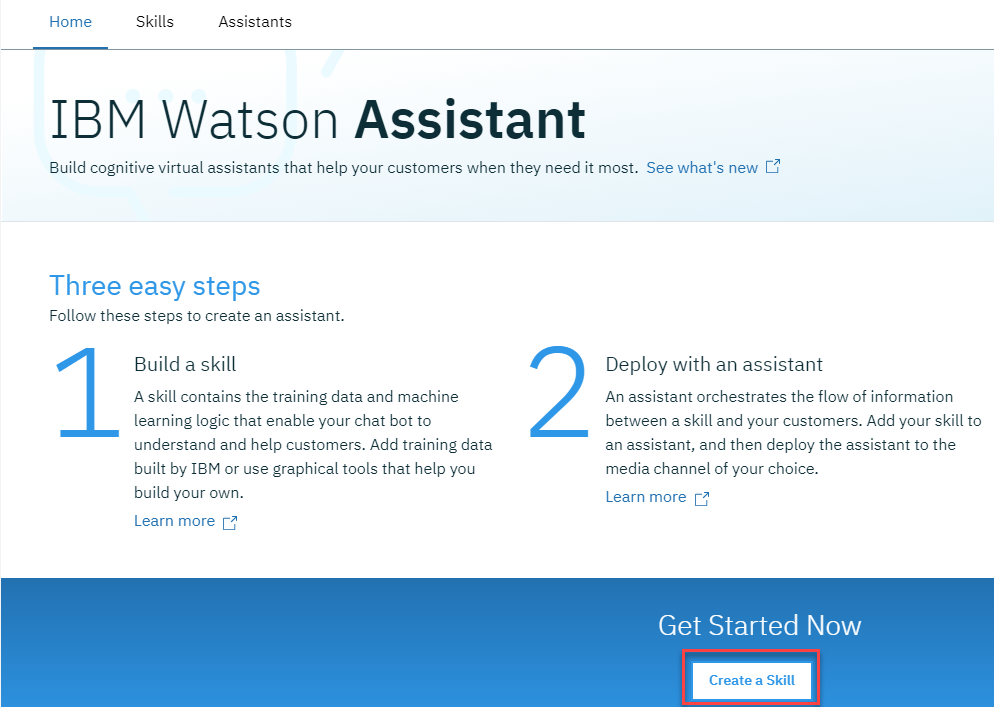
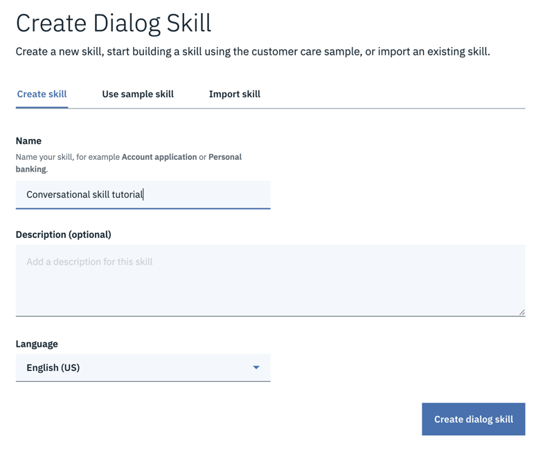

---

copyright:
  years: 2015, 2019
lastupdated: "2019-03-01"

subcollection: assistant

---

{:shortdesc: .shortdesc}
{:new_window: target="_blank"}
{:deprecated: .deprecated}
{:important: .important}
{:note: .note}
{:deprecated: .deprecated}
{:important: .important}
{:note: .note}
{:tip: .tip}
{:pre: .pre}
{:codeblock: .codeblock}
{:screen: .screen}
{:javascript: .ph data-hd-programlang='javascript'}
{:java: .ph data-hd-programlang='java'}
{:python: .ph data-hd-programlang='python'}
{:swift: .ph data-hd-programlang='swift'}
{:hide-dashboard: .hide-dashboard}
{:download: .download}
{:gif: data-image-type='gif'}

# Guía de aprendizaje de iniciación
{: #getting-started}

En esta breve guía de aprendizaje presentamos una introducción a la herramienta {{site.data.keyword.conversationshort}} y al proceso de crear el primer asistente.
{: shortdesc}

## Antes de empezar
{: #getting-started-prerequisites}
{: hide-dashboard}

Para poder empezar necesitará una instancia de servicio.
{: hide-dashboard}

1.  {: hide-dashboard} Vaya a la página [{{site.data.keyword.conversationshort}} ](https://cloud.ibm.com/catalog/services/watson-assistant) en el catálogo de {{site.data.keyword.cloud_notm}}.

    La instancia de servicio se creará en el grupo de recursos **default** si no elige otro y *no se puede* cambiar posteriormente. Este grupo es suficiente para probar el servicio.

    Si va a crear una instancia para utilizarla de forma más intensiva, obtenga más información sobre los [grupos de recursos ](https://{DomainName}/docs/resources/bestpractice_rgs#bp_resourcegroups){: new_window}.
1.  {: hide-dashboard} Regístrese para obtener una cuenta de {{site.data.keyword.cloud_notm}} gratuita o inicie una sesión.
1.  {: hide-dashboard} Pulse **Crear**.

## Paso 1: Abrir la herramienta
{: #getting-started-launch-tool}

Después de crear una instancia de servicio de {{site.data.keyword.conversationshort}}, irá a la página **Gestionar** del panel de control del servicio.
{: hide-dashboard}

1.  Pulse **Iniciar herramienta**. Si se le solicita que inicie una sesión en la herramienta, proporcione sus credenciales de {{site.data.keyword.cloud_notm}}.

<!-- Remove this text after dedicated instances have the developer console: begin -->

{{site.data.keyword.Bluemix_dedicated_notm}}: Seleccione la instancia de servicio en el panel de control para iniciar la herramienta.

<!-- Remove this text after dedicated instances have the Developer Console: end -->

## Paso 2: Crear un conocimiento de diálogo
{: #getting-started-add-skill}

El primer paso en la herramienta {{site.data.keyword.conversationshort}} consiste en crear un conocimiento.

Un *conocimiento de diálogo* es un contenedor de los artefactos que definen el flujo de una conversación que el asistente puede tener con sus clientes.

1.  Desde la página de inicio de la herramienta {{site.data.keyword.conversationshort}}, pulse **Crear un conocimiento**.

    

1.  Pulse **Crear nuevo**.

    

1.  Asigne al conocimiento el nombre `Conversational skill tutorial`.
1.  **Opcional**. Si el diálogo que tiene previsto crear utilizará un idioma distinto del inglés, elija el idioma adecuado en la lista.
1.  Pulse **Crear**.

    

Irá a la página Intenciones de la herramienta.

## Paso 3: Añadir intenciones de un catálogo de contenido
{: #getting-started-add-catalog}

Añada datos de entrenamiento creados por IBM al conocimiento añadiendo intenciones de un catálogo de contenido. En concreto, otorgará al asistente acceso al catálogo de contenido **General** para que el diálogo pueda saludar a los usuarios y terminar conversaciones con ellos.

1.  En la herramienta {{site.data.keyword.conversationshort}}, pulse el separador **Catálogo de contenido**.
1.  Busque **General** en la lista y pulse **Añadir a conocimiento**.

    
1.  Abra el separador **Intenciones** para revisar las intenciones y las expresiones de ejemplo asociadas que se añadieron a los datos de entrenamiento. Puede reconocerlas porque cada nombre de intención empieza con el prefijo `#General_`. En el siguiente paso añadirá las intenciones `#General_Greetings` y `#General_Ending` a su diálogo.

    

Ha empezado con éxito a crear los datos de entrenamiento añadiendo contenido predefinido de {{site.data.keyword.IBM_notm}}.

## Paso 4: Crear un diálogo
{: #getting-started-build-dialog}

Un [diálogo](/docs/services/assistant?topic=assistant-dialog-overview) define el flujo de la conversación en forma de árbol lógico. Compara intenciones (lo que dicen los usuarios) con respuestas (lo que responde el bot). Cada nodo del árbol tiene una condición que lo activa, en función de la entrada de usuario.

Vamos a crear un diálogo sencillo que maneje nuestras intenciones de saludo y de fin de conversación, cada una con un solo nodo.

### Adición de un nodo de inicio

1.  En la herramienta {{site.data.keyword.conversationshort}}, pulse el separador **Diálogo**.
1.  Pulse **Crear**. Verá dos nodos:
    - **Welcome**: contiene un saludo que se muestra a los usuarios la primera vez que interactúan con el asistente.
    - **Anything else**: contiene frases que se utilizan para responder a los usuarios cuando no se reconoce la información que especifican.

    
1.  Pulse el nodo **Welcome** para abrirlo en la vista de edición.
1.  Sustituya la respuesta predeterminada por el texto `Welcome to the Watson Assistant tutorial!`.

    
1.  Pulse  para cerrar la vista de edición.

Ha creado un nodo de diálogo que se activa mediante la condición `welcome`. (`welcome` es una condición especial que funciona como una intención, pero que no empieza por un `#`.) Se activa cuando se inicia una nueva conversación. El nodo especifica que cuando se inicia una nueva conversación, el sistema debe responder con el mensaje de bienvenida que añada a la sección de respuesta de este primer nodo.

### Prueba del nodo de inicio

Puede probar el diálogo en cualquier momento para verificarlo. Vamos a probarlo ahora.

- Pulse el icono  para abrir el panel "Pruébelo". Debería ver el mensaje de bienvenida.

### Adición de nodos para manejar intenciones

Ahora vamos a añadir nodos entre el nodo `Welcome` y el nodo `Anything else` que gestionen nuestras intenciones.

1.  Pulse el icono Más  del nodo **Welcome** y seleccione **Añadir nodo debajo**.
1.  Escriba `#General_Greetings` en el campo **Especificar una condición** de este nodo. Luego seleccione la opción **`#General_Greetings`**.
1.  Añada la respuesta, `Good day to you!`
1.  Pulse  para cerrar la vista de edición.

   

1.  Pulse el icono Más  en este nodo y luego seleccione **Añadir nodo debajo** para crear un nodo igual. En el nodo de igual, especifique `#General_Ending` como condición y `OK. See you later.` como respuesta.

   

1.  Pulse  para cerrar la vista de edición.

   

### Prueba de reconocimiento de intención

Ha creado un diálogo sencillo para reconocer y responder a las entradas greeting y ending. Vamos a ver si funcionan.

1.  Pulse el icono  para abrir el panel "Pruébelo". Aparece este mensaje de bienvenida tranquilizador.
1.  En la parte inferior del panel, escriba `Hello` y pulse Intro. La salida indica que se ha reconocido la intención #hello y aparece la respuesta adecuada (`Good day to you`).
1.  Intente la entrada siguiente:
    - `bye`
    - `howdy`
    - `see ya`
    - `good morning`
    - `sayonara`

{: gif}

{{site.data.keyword.watson}} reconoce las intenciones incluso cuando la entrada no coincide exactamente con los ejemplos que ha incluido. El diálogo utiliza intenciones para identificar la finalidad de la entrada de usuario, independientemente de los términos precisos utilizados, y responde en la forma que especifique.

### Resultado de crear un diálogo

Eso es todo. Ha creado una conversación sencilla con dos intenciones y un diálogo para reconocerlas.

## Paso 5: Crear un asistente
{: #getting-started-create-assistant}

Un [*asistente*](/docs/services/assistant?topic=assistant-assistants) es un bot cognitivo al que se añade un conocimiento que le permite interactuar con sus clientes de forma útil.

1.  Pulse el separador **Asistentes**.
1.  Pulse **Crear nuevo**.

    
1.  Asigne al asistente el nombre `Watson Assistant tutorial`.
1.  En el campo Descripción, especifique `This is a sample assistant that I am creating to help me learn.`
1.  Pulse **Crear**.

    

## Paso 6: Añadir su conocimiento al asistente
{: #getting-started-add-skill-to-assistant}

Añada el conocimiento de diálogo que ha creado al asistente que ha creado.

1.  En la página del nuevo asistente, pulse **Añadir conocimiento**.

    Si ha creado o si ha recibido acceso con el rol de desarrollador a los espacios de trabajo creados con la versión disponible a nivel general del servicio {{site.data.keyword.conversationshort}}, los verá en la lista de la página Conocimientos como conocimientos de conversación.
    {: tip}

    
1.  Elija añadir el conocimiento que ha creado antes al asistente.

## Paso 7: Integrar el asistente
{: #getting-started-integrate-assistant}

Ahora que tiene un asistente que puede participar en un intercambio conversacional sencillo, publíquelo en una página web pública en la que puede probarlo. El servicio proporciona una integración incorporada que se denomina Enlace de vista previa. Cuando crea este tipo de integración, el asistente se crea en un widget de chat alojado en una página web de IBM. Puede abrir la página web y conversar con su asistente para probarlo.

1.  Pulse el separador **Asistentes**, busque el asistente de `Watson Assistant tutorial` que ha creado y ábralo.
1.  En el área *Integraciones*, pulse **Añadir integración**.
1.  Busque **Enlace de vista previa** y pulse **Seleccionar integración**.

1.  Pulse el URL que se visualiza en la página.

    La página se abre en un nuevo separador.
1.  Diga `hello` a su asistente espere a que responda. Puede compartir el URL con otros que deseen probar su asistente.

## Siguientes pasos
{: #getting-started-next-steps}

Esta guía de aprendizaje se basa en un ejemplo sencillo. Para una aplicación real, deberá definir algunas intenciones más interesantes, algunas entidades y un diálogo más complejo que utilice ambas. Cuando tiene una versión depurada del asistente, puede integrarla con canales que utilizan sus clientes, como por ejemplo Slack. A medida que aumente el tráfico entre el asistente y sus clientes, puede utilizar las herramientas que se proporcionan en el separador **Herramientas de análisis** para analizar conversaciones reales e identificar áreas de mejora.

- Consulte las guías de aprendizaje de seguimiento que crean diálogos más avanzados:
    - Añada nodos estándares con la guía de aprendizaje sobre [Creación de un diálogo complejo](/docs/services/assistant?topic=assistant-tutorial).
    - Obtenga información sobre las ranuras con la guía de aprendizaje sobre [Adición de un nodo con ranuras](/docs/services/assistant?topic=assistant-tutorial-slots).
- Consulte más [apps de ejemplo](/docs/services/assistant?topic=assistant-sample-apps) para ver ideas.
