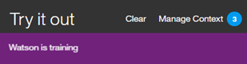
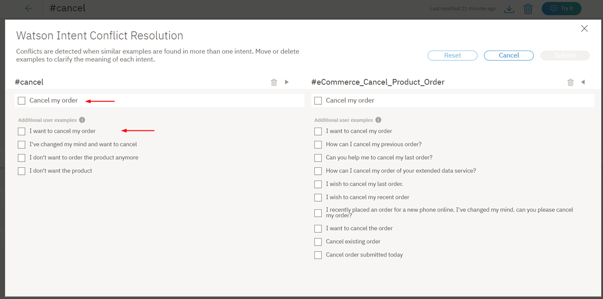

---

copyright:
  years: 2015, 2019
lastupdated: "2019-02-28"

subcollection: assistant

---

{:shortdesc: .shortdesc}
{:new_window: target="_blank"}
{:deprecated: .deprecated}
{:important: .important}
{:note: .note}
{:tip: .tip}
{:pre: .pre}
{:codeblock: .codeblock}
{:screen: .screen}
{:javascript: .ph data-hd-programlang='javascript'}
{:java: .ph data-hd-programlang='java'}
{:python: .ph data-hd-programlang='python'}
{:swift: .ph data-hd-programlang='swift'}

# Definición de intenciones
{: #intents}

Las ***intenciones*** son objetivos o propósitos expresados en una entrada de cliente, como por ejemplo responder a una pregunta o procesar el pago de una factura. Al reconocer la intención expresada en una entrada de cliente, el servicio {{site.data.keyword.conversationshort}} puede elegir el flujo de diálogo correcto para responder a la misma.
{: shortdesc}

<iframe class="embed-responsive-item" id="youtubeplayer" title="Cómo trabajar con intenciones" type="text/html" width="640" height="390" src="https://www.youtube.com/embed/OPdOCUPGMIQ" frameborder="0" webkitallowfullscreen mozallowfullscreen allowfullscreen> </iframe>

## Visión general de la creación de intenciones
{: #intents-described}

- Planifique las intenciones de su aplicación.

  Tenga en cuenta lo que cree que desearán hacer los clientes y lo que desea que la aplicación sea capaz de manejar. Por ejemplo, tal vez desee que su aplicación ayude a sus clientes a realizar una compra. Si es así, puede añadir una intención `#buy_something`. (El símbolo `#` antes del nombre de la intención ayuda a identificar claramente que se trata de una intención.)

- Entrene a Watson sobre intenciones.

  Cuando haya decidido qué solicitudes de negocio desea que maneje la aplicación para sus clientes, debe entrenar a Watson sobre las mismas. Para cada objetivo de negocio (como por ejemplo `#buy_something`), debe proporcionar al menos 10 ejemplos de expresiones que los clientes utilizan normalmente para indicar su objetivo. Por ejemplo, `I want to make a purchase` (Deseo realizar una compra).
  
  Lo ideal es que encuentre ejemplos de expresiones de usuarios del mundo eral que extraiga de procesos de negocio existentes. Los ejemplos de usuario deben estar adaptados a su negocio específico. Por ejemplo, si se trata de una compañía de seguros, los ejemplos de usuario pueden parecerse más a `I want to buy a new XYZ insurance plan` (Quiero adquirir un nuevo plan de seguros XYZ).
  
  El servicio utiliza los ejemplos que proporcione para crear un modelo de aprendizaje automático que pueda reconocer estas expresiones y otras parecidas y correlacionarlas con la intención adecuada.

Empiece con unas pocas intenciones y pruébelas a medida que amplía de forma iterativa el ámbito de la aplicación.

## Creación de intenciones
{: #intents-create-task}

Utilice la herramienta {{site.data.keyword.conversationshort}} para crear intenciones.

1.  En la herramienta {{site.data.keyword.conversationshort}}, abra el conocimiento de diálogo. El conocimiento se abre en la página **Intenciones**.

1.  Seleccione **Crear nueva**.

1.  En el campo **Nombre de intención**, escriba un nombre para la intención.
    - El nombre de la intención puede contener letras (en Unicode), números, signos de subrayado, guiones y puntos.
    - El nombre no puede consistir únicamente en `..` ni en cualquier otra serie formada solo por puntos.
    - Los nombres de intención no pueden contener espacios y no deben superar los 128 caracteres. A continuación se muestran algunos ejemplos de nombres de intención:
        - `#weather_conditions`
        - `#pay_bill`
        - `#escalate_to_agent`

    La herramienta incluye automáticamente el carácter `#` en los nombres de intención, de modo que no tiene que añadirlo.
    {: tip}

    Añada una descripción de la intención en el campo **Descripción**.

1.  Seleccione **Crear intención** para guardar el nombre de la intención.

    

1.  A continuación, en el campo **Añadir ejemplos de usuario**, escriba el texto de un ejemplo de usuario para la intención. Un ejemplo podría ser cualquier serie de hasta 1024 caracteres de longitud. Estos serían ejemplos correspondientes a la intención `#pay_bill`:
    - `I need to pay my bill.`
    - `Pay my account balance`
    - `make a payment`

    Para añadir ejemplos de usuario extraídos de solicitudes de soporte reales realizadas por los clientes, consulte [Adición de ejemplos de archivos de registro](#intents-intent-recommendations).

    Para obtener información sobre el impacto de incluir referencias a entidades en los ejemplos de usuario, consulte [Cómo se tratan las referencias a entidades](#intents-entity-references).
    {: tip}

    Los nombres de intención y el texto de ejemplo pueden ser expuestos en los URL cuando una aplicación interactúa con el servicio. No incluya información confidencial o personal en estos artefactos.
    {: important}

1.  Pulse **Añadir ejemplo** para guardar el ejemplo.

1.  Repita el mismo proceso para añadir más ejemplos. Puede tabular entre ejemplos. Especifique al menos 5 ejemplos para cada intención. Cuantos más ejemplos proporcione, más precisa podrá ser la aplicación.

    Para obtener ayuda para la creación de ejemplos de usuario, consulte el apartado sobre [Obtención de recomendaciones de ejemplos de usuario de intenciones](/docs/services/assistant?topic=assistant-intent-recommendations#intent-recommendations-get-example-recommendations).

1.  Cuando haya terminado de añadir ejemplos, pulse  para dar por finalizada la creación de la intención.

El sistema empieza a formarse a sí mismo sobre la intención y los ejemplos de usuario que ha añadido.

## Cómo se tratan las referencias a entidades
{: #intents-entity-references}

Cuando se incluye una mención a una entidad en un ejemplo de usuario, el modelo de aprendizaje automático utiliza la información de diferentes maneras en estos casos de ejemplo:

- [Referencia a valores de entidades y sinónimos en ejemplos de intenciones](#intents-related-entities)
- [Menciones anotadas](#intents-annotated-mentions)
- [Referencia directa a un nombre de entidad en un ejemplo de intención](#intents-entity-as-example)

### Referencia a valores de entidades y sinónimos en ejemplos de intenciones
{: #intents-related-entities}

Si ha definido, o tiene previsto definir, entidades que están relacionadas con esta intención, mencione los valores de entidad o los sinónimos en algunos de los ejemplos. Esto ayuda a establecer una relación entre la intención y las entidades. Se trata de una relación débil, pero informa al modelo.


*Importante*:

  - Los datos del ejemplo de la intención deberían ser representativos y típicos de los datos que los usuarios finales proporcionarán. Se pueden recopilar ejemplos de datos de usuario reales, o de personas expertas del campo específico. Es importante la naturaleza de la representatividad y precisión de los datos.
  - Tanto los datos de aprendizaje como los de prueba (a efectos de evaluación) deberían reflejar la distribución de las intenciones en el uso real. Habitualmente, las intenciones más frecuentes tienen relativamente más ejemplos, y una mejor cobertura de respuestas.
  - Puede incluir puntuación en el texto de ejemplo, en la medida que sea natural. Si cree que algunos usuarios expresarán sus intenciones con ejemplos que incluyan puntuación, mientras que otros usuarios no lo harán, incluya dos versiones. En general, cuanto mayor sea la cobertura de los distintos patrones, mejor será la respuesta.

### Menciones anotadas
{: #intents-annotated-mentions}

A medida que defina entidades, puede anotar menciones de la entidad directamente desde los ejemplos de usuario de intenciones existentes. El modelo de clasificación de intenciones *no* utiliza las relaciones que identifique de esta forma entre la intención y la entidad. Sin embargo, si añade la mención a la entidad, también se añade a dicha entidad como un valor nuevo. Y, cuando añade la mención a un valor de entidad existente, también se añade a dicho valor de entidad como un sinónimo nuevo. La clasificación de intenciones utiliza estos tipos de referencias al diccionario en ejemplos de usuario de intención para establecer una referencia débil entre una intención y una entidad.

Consulte [Adición de entidades contextuales](/docs/services/assistant?topic=assistant-entities#entities-create-annotation-based) para obtener más información sobre las entidades contextuales.

### Referencia directa a un nombre de entidad en un ejemplo de intención
{: #intents-entity-as-example}

Se trata de un enfoque avanzado que, si se utiliza, se debe utilizar de forma coherente.
{: note}

Puede optar por hacer referencia directamente a las entidades en los ejemplos de intenciones. Por ejemplo, supongamos que tiene una entidad denominada `@PhoneModelName`, que contiene los valores *Galaxy S8*, *Moto Z2*, *LG G6* y *Google Pixel 2*. Al crear una intención, por ejemplo, `#order_phone`, podría proporcionar los siguientes datos de entrenamiento:

- Can I get a `@PhoneModelName`?
- Help me order a `@PhoneModelName`.
- Is the `@PhoneModelName` in stock?
- Add a `@PhoneModelName` to my order.


Actualmente, únicamente se puede hacer referencia directa a entidades de sinónimo que defina (los valores de patrón se pasan por alto). No es posible utilizar [entidades de sistema](/docs/services/assistant?topic=assistant-system-entities).

Si elige hacer referencia a una entidad como un ejemplo de una intención (por ejemplo, `@PhoneModelName`) *en un lugar cualquiera* de los datos de entrenamiento, cancelará el valor utilizado en una referencia directa (por ejemplo, *Galaxy S8*) en un ejemplo de intención en cualquier otro lugar. Todas las intenciones utilizarán entonces un enfoque de tipo entidad como ejemplo de intención. No se puede aplicar este enfoque solo a una intención específica.
{: important}

En la práctica, esto significa que si anteriormente ha entrenado la mayoría de sus intenciones basándose en referencias directas (*Galaxy S8*) y ahora utiliza referencias de entidad (`@PhoneModelName`) solo para una intención, el cambio afecta al entrenamiento anterior. Si elige utilizar referencias de tipo `@Entity`, debe sustituir todas las referencias directas anteriores por referencias de tipo `@Entity`.

El hecho de definir una intención de ejemplo con una `@Entity` que tiene 10 valores definidos **no**
equivale a especificar dicho ejemplo 10 veces. El servicio de {{site.data.keyword.conversationshort}} no da tanto peso a dicha sintaxis de intención de ejemplo.

## Prueba de las intenciones
{: #intents-test}

Cuando termine de crear nuevas intenciones, puede probar el sistema para ver si reconoce las intenciones tal como espera.

1.  En la herramienta {{site.data.keyword.conversationshort}}, pulse el icono .

1.  En el panel *Pruébelo*, escriba una pregunta u otra serie de texto y pulse Intro para ver si se reconoce la intención. Si se reconoce la intención errónea, puede mejorar el modelo añadiendo este texto como ejemplo a la intención correcta.

    Si ha realizado cambios recientemente en el conocimiento, es posible que vea un mensaje que indica que el sistema continúa formándose. Si ve este mensaje, espere hasta que finalice el entrenamiento antes de realizar la prueba:
    {: tip}

    

    La respuesta indica la intención que se ha reconocido de la entrada.

    

1.  Si el sistema no reconoce la intención correcta, puede corregirla. Para corregir la intención reconocida, seleccione la intención mostrada y luego seleccione la intención correcta de la lista. Una vez enviada la corrección, el sistema se forma a sí mismo automáticamente para incorporar los nuevos datos.

    

1.  Si la entrada no está relacionada con ninguna de las intenciones de la aplicación, puede enseñar al servicio seleccionando la intención mostrada y pulsando **Marcar como irrelevante**.

    

    *Marcar como irrelevante*
    {: #intents-mark-irrelevant}

    La opción *Marcar como irrelevante* no está disponible en todos los idiomas. Consulte [Idiomas soportados](/docs/services/assistant?topic=assistant-language-support) para obtener más información.

    **Importante**: Las intenciones que se marcan como irrelevantes se guardan como contraejemplos en el espacio de trabajo JSON y se incluyen como parte de los datos de entrenamiento. Asegúrese de que antes de designar una entrada como irrelevante.

      - No se puede acceder a las entradas ni se pueden modificar más adelantes con la herramienta.
      - La única forma de revertir la identificación de una entrada como irrelevante es utilizar la misma entrada en el panel *Pruébelo*
de nuevo, y esta vez asignarla a una intención.

Si las intenciones no se reconocen correctamente, considere la posibilidad de realizar los siguientes tipos de cambios:

- Añada el texto que no se reconoce como ejemplo a la intención correcta.
- Mueva los ejemplos existentes de una intención de otra.
- Si considera que las intenciones se parecen demasiado, vuelva a definirlas.

## Puntuación absoluta
{: #intents-absolute-scoring}

El servicio {{site.data.keyword.conversationshort}} puntúa la confianza de cada intención por separado, no en relación con otras intenciones. Este enfoque añade flexibilidad; se pueden detectar varias intenciones en una sola entrada de usuario. También significa que es posible que el sistema no devuelva ninguna intención. Si la intención principal tiene una puntuación de confianza baja (menor que 0,2), la intención principal se incluye en la matriz de intenciones que devuelve la API, pero los nodos que condicional la intención no se activan. Si desea detectar el caso en que no se han detectado intenciones con puntuaciones de confianza correctas, utilice la condición especial `irrelevant` en el nodo de diálogo. Consulte [Condiciones especiales](/docs/services/assistant?topic=assistant-dialog-overview#dialog-overview-special-conditions) para obtener más información.

A medida que cambian las puntuaciones de confianza de las intenciones, es posible que se deban reestructurar los diálogos. Por ejemplo, si un nodo de diálogo utiliza una intención en su condición y la puntuación de confianza de la intención empieza a caer por debajo de 0,2, el nodo de diálogo deja de procesarse. Si cambia la puntuación de confianza, el comportamiento del diálogo también puede cambiar.

## Límites de las intenciones
{: #intents-limits}

El número de intenciones y los ejemplos que puede crear dependen de su plan de servicio {{site.data.keyword.conversationshort}}:

| Plan de servicio     | Intentos por conocimiento | Ejemplos por conocimiento |
|------------------|------------------:|-------------------:|
| Premium          |             2.000 |             25.000 |
| Plus             |             2.000 |             25.000 |
| Estándar         |             2.000 |             25.000 |
| Lite             |               100 |             25.000 |
{: caption="Detalles del plan de servicio" caption-side="top"}

## Edición de intenciones
{: #intents-edit}

Puede pulsar cualquier intención de la lista para abrirla a fin de editarla. Puede realizar
los siguientes cambios:

- Cambiar el nombre de la intención.
- Suprimir la intención.
- Añadir, editar o suprimir ejemplos.
- Mover un ejemplo a otra intención.

Puede tabular desde el nombre de la intención a cada ejemplo, editando los ejemplos si así lo desea.

Para mover o suprimir un ejemplo, pulse el recuadro de selección asociado al mismo y luego pulse **Mover** o **Suprimir**.

  

## Búsqueda de intenciones
{: #intents-search}

Utilice la característica de búsqueda para encontrar ejemplos, nombres de intenciones y descripciones.

1.  En la página **Intenciones**, pulse el icono Buscar.

    

1.  Especifique una frase o término de búsqueda.

    

Se mostrarán las intenciones que contienen su término de búsqueda, con los correspondientes ejemplos.

  

## Exportación de intenciones
{: #intents-export}

Puede exportar varias intenciones a un archivo CSV para luego importarlas y reutilizarlas para otra aplicación de {{site.data.keyword.conversationshort}}.

1.  En la página **Intenciones**, seleccione las intenciones que desee en la lista y pulse **Exportar**.

    

## Importación de intenciones y ejemplos
{: #intents-import}

Si tiene un gran número de intenciones y ejemplo, puede que le resulte más fácil importarlos desde un archivo CSV (valores separados por comas) que definirlos uno por uno en la herramienta {{site.data.keyword.conversationshort}}. Asegúrese de eliminar cualquier dato personal de los ejemplos de usuario que incluya en el archivo.

Como alternativa, puede cargar un archivo con expresiones de usuario sin formatear (procedentes, por ejemplo, de registros del centro de atención al cliente) y dejar que el servicio busque candidatos para los ejemplos de usuario de los datos. Consulte [Adición de ejemplos de archivos de registro](/docs/services/assistant?topic=assistant-intent-recommendations#intent-recommendations-get-example-recommendations) para obtener más información. Esta característica solo está disponible para los usuarios de los planes Plus y Premium.

1.  Recopile las entidades y ejemplos en un archivo CSV o expórtelos desde una hoja de cálculo a un archivo CSV. El formato necesario para cada línea del archivo es el siguiente:

    ```
    <example>,<intent>
    ```
    {: screen}

    donde `<example>` es el texto de un ejemplo de usuario y `<intent>` es el nombre de la intención con la que desea que coincida el ejemplo. Por ejemplo:

    ```
    Tell me the current weather conditions.,weather_conditions
    Is it raining?,weather_conditions
    What's the temperature?,weather_conditions
    Where is your nearest location?,find_location
    Do you have a store in Raleigh?,find_location
    ```
    {: screen}

    **Importante:** Guarde el archivo CSV con codificación UTF-8 y sin marca de orden de bytes (BOM).

1.  En la página **Intenciones**, pulse el icono *Importar*  y luego arrastre un archivo o examine para seleccionar un archivo del sistema.

    

    **Importante:** El tamaño máximo del archivo CSV es 10 MB. Si el archivo CSV es mayor, considere la posibilidad de dividirlo en varios archivos y de importarlos por separado.

    El archivo se valida y se importa y el sistema empieza a formarse a sí mismo con los datos nuevos.

Puede ver las intenciones importadas y los ejemplos correspondientes en el separador **Intenciones**. Es posible que deba renovar la página para ver los nuevos ejemplos e intenciones.

## Resolución de conflictos de intenciones 
{: #intents-resolve-conflicts}

Esta característica solo está disponible para los usuarios de los planes Plus o Premium.
{: tip}

La aplicación {{site.data.keyword.conversationshort}} detecta un conflicto cuando dos o más ejemplos de intención de intenciones *separadas*
son tan parecidas que {{site.data.keyword.conversationshort}} se confunde al elegir qué intención utilizar.

Para resolver conflictos:

1.  En la página **Intenciones**, revise las intenciones con conflictos.

    

    Defina el conmutador en **Mostrar solo conflictos** para ver una lista solo de las intenciones con conflictos.
    {: tip}

    

1.  Abra un conflicto de intención. Para el ejemplo de intención que está causando el conflicto, pulse **Resolver conflicto**.

    

1.  Ahora tiene la opción de mover un ejemplo conflictivo a otra intención o de suprimir un ejemplo conflictivo por completo.

    En este caso, los ejemplos `Cancel my order` y `I want to cancel my order` aparecen en la intención `#cancel` y en la intención `#eCommerce_Cancel_Product_Order`.

    

    Los otros ejemplos de usuario son ejemplos de entrenamiento que no necesariamente están en conflicto, pero que se parecen a los ejemplos en conflicto. Se muestran para proporcionar contexto para ayudar a resolver el conflicto.

1.  Seleccione los ejemplos `Cancel my order` y `I want to cancel my order` y muévalos de la intención `#cancel` a la intención `#eCommerce_Cancel_Product_Order`:

    

1.  Cuando decida dónde colocar un ejemplo, busque la intención que tiene sinónimos o ejemplos de casi sinónimos.

    Intente que cada intención sea tan distintiva y centrada en un objetivo como sea posible. Si tiene dos intenciones con varios ejemplos de usuario que se solapan, tal vez no necesite dos intenciones separadas. Puede mover o suprimir ejemplos de usuario que no se solapen directamente a una intención y luego suprimir la otra.
    {: tip}

    Seleccione los otros ejemplos de la intención `#cancel` y suprímalos:

    

1.  Pulse el botón **Enviar** para resolver los conflictos:

    

    La opción *Restablecer* le permite volver a empezar a mover el ejemplo de conflicto entre las intenciones. La opción *Cancelar* le devuelve a la página de intenciones.

Ha resuelto un conflicto y puede continuar la revisión de otras intenciones conflictivas.

Vea este vídeo para obtener más información.

<iframe class="embed-responsive-item" id="youtubeplayer0" title="Visión general de la resolución de conflictos de intenciones" type="text/html" width="640" height="390" src="https://www.youtube.com/embed/9gQtjCBxjdc?rel=0" frameborder="0" webkitallowfullscreen mozallowfullscreen allowfullscreen> </iframe>

## Supresión de intenciones
{: #intents-delete}

Puede seleccionar varias intenciones para suprimirlas.

**IMPORTANTE**: Si suprime intenciones y también suprime todos los ejemplos asociados, estos elementos no se pueden recuperar más tarde. Todos los nodos de diálogo que hacen referencia a estas intenciones se deben actualizar manualmente para que dejen de hacer referencia al contenido suprimido.

1.  En la página **Intenciones**, seleccione las intenciones que desee en la lista y pulse **Suprimir**.

    
