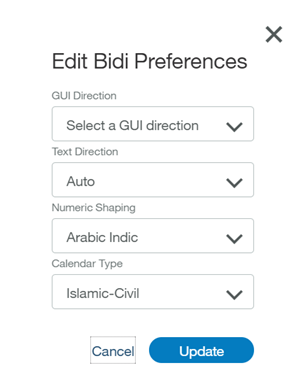

---

copyright:
  years: 2015, 2019
lastupdated: "2019-05-20"

subcollection: assistant

---

{:shortdesc: .shortdesc}
{:new_window: target="_blank"}
{:deprecated: .deprecated}
{:important: .important}
{:note: .note}
{:tip: .tip}
{:pre: .pre}
{:codeblock: .codeblock}
{:screen: .screen}
{:javascript: .ph data-hd-programlang='javascript'}
{:java: .ph data-hd-programlang='java'}
{:python: .ph data-hd-programlang='python'}
{:swift: .ph data-hd-programlang='swift'}

# Idiomas soportados
{: #language-support}

El servicio {{site.data.keyword.conversationshort}} da soporte a los idiomas que aparecen en la lista. Las características individuales reciben soporte en mayor o menor medida según el idioma.
{: shortdesc}

En las tablas siguientes, el nivel de soporte del idioma y de las características se indica con estos códigos:

- **GA** - La característica está disponible a nivel general y recibe soporte para este idioma. Tenga en cuenta que las características pueden seguir actualizándose incluso después de que estén disponibles a nivel general.
- **Beta** - La característica solo recibe soporte como release Beta y continúa en proceso de prueba antes de que esté disponible a nivel general en este idioma.
- **ND** - Indica que una característica no está disponible en este idioma.

La primera tabla muestra el nivel de soporte para todas las características, excepto las relacionadas con intenciones y entidades, que se muestran en la segunda y en la tercera tabla.

**Tabla 1. Detalles de soporte de características**

| Idioma | **Definición de [intenciones](/docs/services/assistant?topic=assistant-intents)**, **[entidades](/docs/services/assistant?topic=assistant-entities)** y **[diálogo](/docs/services/assistant?topic=assistant-dialog-build)** | **Búsqueda** |
|:---:|:---:|:---:|
| **Inglés (en)**                   | GA | GA |
| **Árabe (ar)**                    | GA | ND |
| **Chino (simplificado) (zh-cn)**   | GA | Beta |
| **Chino (tradicional) (zh-tw)**  | Beta | Beta |
| **Checo (cs)**                     | GA | Beta |
| **Neerlandés (nl)**                     | GA | Beta |
| **Francés (fr)**                    | GA | Beta |
| **Alemán (de)**                    | GA | Beta |
| **Italiano (it)**                   | GA | Beta |
| **Japonés (ja)**                  | GA | Beta |
| **Coreano (ko)**                    | GA | Beta |
| **Portugués (de Brasil) (pt-br)** | GA | Beta |
| **Español (es)**                   | GA | Beta |
{: caption="Detalles de soporte de características" caption-side="top"}

**Tabla 2a. Detalles de soporte de la característica de intenciones**

| Idioma | **[Puntuación absoluta](/docs/services/assistant?topic=assistant-intents#intents-absolute-scoring)** y **[Marcar como irrelevante](/docs/services/assistant?topic=assistant-logs#logs-mark-irrelevant)** | **[Catálogo de contenido](/docs/services/assistant?topic=assistant-catalog)** |
|:---:|:---:|:---:|
| **Inglés (en)**                   | GA | GA |
| **Árabe (ar)**                    | Beta | GA |
| **Chino (simplificado) (zh-cn)**   | GA | ND |
| **Chino (tradicional) (zh-tw)**  | Beta | ND |
| **Checo (cs)**                     | GA | ND |
| **Neerlandés (nl)**                     | GA | ND |
| **Francés (fr)**                    | GA | GA |
| **Alemán (de)**                    | GA | GA |
| **Italiano (it)**                   | GA | GA |
| **Japonés (ja)**                  | GA | GA |
| **Coreano (ko)**                    | GA | ND |
| **Portugués (de Brasil) (pt-br)** | GA | GA |
| **Español (es)**                   | GA | GA |
{: caption="Detalles de soporte de la característica de intenciones" caption-side="top"}

**Tabla 2b. Detalles de soporte de la característica de intenciones (continuación)**

| Idioma | **[Recomendaciones de ejemplo para el usuario](/docs/services/assistant?topic=assistant-intent-recommendations#intent-recommendations-get-example-recommendations)** | **[Recomendaciones de intención](/docs/services/assistant?topic=assistant-intent-recommendations#intent-recommendations-get-intent-recommendations)** |
|:---:|:---:|
| **Inglés (en)**                   | GA | GA |
| **Árabe (ar)**                    | ND | ND |
| **Chino (simplificado) (zh-cn)**   | ND | ND |
| **Chino (tradicional) (zh-tw)**  | ND | ND |
| **Checo (cs)**                     | ND | ND |
| **Neerlandés (nl)**                     | ND | ND |
| **Francés (fr)**                    | ND | ND |
| **Alemán (de)**                    | ND | ND |
| **Italiano (it)**                   | ND | ND |
| **Japonés (ja)**                  | GA | ND |
| **Coreano (ko)**                    | ND | ND |
| **Portugués (de Brasil) (pt-br)** | ND | ND |
| **Español (es)**                   | ND | ND |
{: caption="Detalles de soporte de la característica de intenciones (continuación)" caption-side="top"}

**Tabla 3. Detalles de soporte de la característica de entidades**

| Idioma | **[Coincidencia aproximada de entidades](/docs/services/assistant?topic=assistant-entities#entities-fuzzy-matching)** | **[Entidades contextuales](/docs/services/assistant?topic=assistant-entities#entities-create-annotation-based)** | **[Recomendaciones de sinónimos](/docs/services/assistant?topic=assistant-entities#entities-synonyms)** |
|:---:|:---:|:---:|:---:|
| **Inglés (en)**                   | GA | Beta | GA |
| **Árabe (ar)**                    | GA (solo errores ortográficos) | ND | ND |
| **Chino (simplificado) (zh-cn)**   | ND | ND | ND |
| **Chino (tradicional) (zh-tw)**  | ND | ND | ND |
| **Checo (cs)**                     | GA (solo errores ortográficos) | ND | ND |
| **Neerlandés (nl)**                     | GA (solo errores ortográficos) | ND | ND |
| **Francés (fr)**                    | GA (solo errores ortográficos) | ND | GA |
| **Alemán (de)**                    | GA (solo errores ortográficos) | ND | ND |
| **Italiano (it)**                   | GA (solo errores ortográficos) | ND | ND |
| **Japonés (ja)**                  | GA (solo errores ortográficos) | ND | GA |
| **Coreano (ko)**                    | GA (solo errores ortográficos) | ND | ND |
| **Portugués (de Brasil) (pt-br)** | GA (solo errores ortográficos) | ND | ND |
| **Español (es)**                   | GA (solo errores ortográficos) | ND | GA |
{: caption="Detalles de soporte de la característica de entidades" caption-side="top"}

**Tabla 4. Detalles de soporte de la característica del sistema**

| Idioma | **Entidades del sistema ([number](/docs/services/assistant?topic=assistant-system-entities#system-entities-sys-number) (número), [currency](/docs/services/assistant?topic=assistant-system-entities#system-entities-sys-currency) (moneda), [percentage](/docs/services/assistant?topic=assistant-system-entities#system-entities-sys-percentage) (porcentaje), [date, time](/docs/services/assistant?topic=assistant-system-entities#system-entities-sys-date-time) (fecha, hora))** | **[Nuevas entidades del sistema](/docs/services/assistant?topic=assistant-beta-system-entities)** |
|:---|:---:|:---:|
| **Inglés (en)**                   | GA, Beta ([location](/docs/services/assistant?topic=assistant-system-entities#system-entities-sys-location) (ubicación), [person](/docs/services/assistant?topic=assistant-system-entities#system-entities-sys-person) (persona)) | Beta |
| **Árabe (ar)**                    | Beta | ND |
| **Chino (simplificado) (zh-cn)**   | GA | ND |
| **Chino (tradicional) (zh-tw)**  | Beta | ND |
| **Checo (cs)**                     | GA | ND |
| **Neerlandés (nl)**                     | GA | ND |
| **Francés (fr)**                    | GA | ND |
| **Alemán (de)**                    | GA | Beta |
| **Italiano (it)**                   | GA | ND |
| **Japonés (ja)**                  | GA | ND |
| **Coreano (ko)**                    | GA | ND |
| **Portugués (de Brasil) (pt-br)** | GA | ND |
| **Español (es)**                   | GA | ND |
{: caption="Detalles de soporte de la característica de entidad del sistema" caption-side="top"}

**Nota:** El servicio {{site.data.keyword.conversationshort}} da soporte a varios idiomas, tal como se indica, pero la interfaz de la herramienta propiamente dicha (descripciones, etiquetas, etc.) está en inglés. Todos los idiomas soportados se pueden especificar y formar con la interfaz en inglés.

**Conformidad del estándar GB18030**: GB18030 es un estándar chino que especifica una página de códigos ampliada que se utiliza en el mercado chino. Este estándar de página de códigos es importante para la industria del software porque el Comité técnico de estandarización de tecnología de la información nacional de China obliga desde el 1 de septiembre de 2001 a que todas las aplicaciones de software para el mercado de China estén habilitadas para el estándar GB18030. El servicio {{site.data.keyword.conversationshort}} da soporte a esta codificación, y se ha certificado el cumplimiento del estándar GB18030.

## Cómo cambiar el idioma de un conocimiento
{: #language-support-change-language}

Una vez que se ha creado un conocimiento, su idioma no se puede modificar. Si es necesario cambiar el idioma soportado de un conocimiento, debe descargar el conocimiento. Luego debe editar el archivo JSON resultante en un editor de texto y buscar una propiedad de JSON denominada `language`.

La propiedad `language` debe estar establecida en el idioma original del conocimiento; por ejemplo, inglés sería `en`. Modifique el valor de esta propiedad para cambiarla por idioma deseado (`fr` para francés, `de` para alemán, etc.). Guarde los cambios en el archivo JSON e importe el archivo modificado en la instancia del servicio {{site.data.keyword.conversationshort}}.

## Configuración de idiomas bidireccionales
{: #language-support-configure-bi-directional}

Para idiomas bidireccionales, como por ejemplo el árabe, puede cambiar las preferencias del conocimiento. En el mosaico del conocimiento, seleccione el menú desplegable *Acciones* y seleccione **Preferencias de Bidi** (esta opción solo está disponible para los conocimientos definidos en un idioma bidireccional):

Seleccione entre las siguientes opciones para el conocimiento:

- **Dirección de GUI**: Especifica la dirección de los elementos, como botones o menús, en la interfaz gráfica de usuario. Seleccione `LTR` (izquierda a derecha, left-to-right) o `RTL` (derecha a izquierda, right-to-left). Si no lo especifica, la herramienta sigue el valor de dirección de GUI del navegador web.
- **Dirección de texto**: Especifica la dirección del texto que se escribe. Seleccione `LTR` (izquierda a derecha, left-to-right) o `RTL` (derecha a izquierda, right-to-left) o bien seleccione `Auto`, que elegirá automáticamente la dirección del texto en función de los valores del sistema. La opción `Ninguno` mostrará el texto de izquierda a derecha.
- **Forma numérica**: Especifica la forma de numerales que se utilizará cuando se representen dígitos regulares. Elija entre `Nominal`, `Árabe-Índico` o `Árabe-Europeo`. La opción `Ninguno` mostrará numerales occidentales.
- **Tipo de calendario**: Especifica cómo se eligen las fechas filtradas en la IU del conocimiento. Seleccione `Islámico-Civil`, `Islámico-Tabular`, `Islámico-Umm al-Qura` o `Gregoriano`.

  Este valor no se aplica al panel "Pruébelo".
  {: note}

Cuando termine de realizar selecciones, pulse **Actualizar** para guardar y volver al mosaico del conocimiento.

## Cómo trabajar con caracteres acentuados
{: #language-support-accents}

En un entorno conversacional, puede que los usuarios utilicen o no acentos cuando interactúan con el servicio {{site.data.keyword.conversationshort}}. Por lo tanto, las versiones acentuadas y no acentuadas de las palabras se pueden tratar de la misma manera para la detección de intenciones y el reconocimiento de entidades.

Sin embargo, para algunos idiomas, como el español, algunos acentos puede alterar el significado de la entidad. Por lo tanto, para la detección de entidades, aunque la entidad original pueda tener implícitamente un acento, su asistente también puede considerar como coincidencia la versión no acentuada de la misma entidad, pero con una puntuación de confianza ligeramente inferior.

Por ejemplo, para la palabra "barrió", que lleva acento y corresponde al pretérito indefinido del verbo "barrer", su asistente también puede considerar como coincidencia la palabra "barrio", pero con un nivel de confianza ligeramente inferior.

El sistema proporcionará la mayor puntuación de confianza en entidades con coincidencias exactas. Por ejemplo, `barrio` no se detectará si `barrió` está en el conjunto de datos de entrenamiento; y `barrió` no se detectará si `barrio` está en el conjunto de datos de entrenamiento.

Se espera que forme el sistema con los caracteres y acentos adecuados. Por ejemplo, si espera `barrió` como respuesta, debe colocar `barrió` en el conjunto de datos de entrenamiento.

Aunque no lleven acento, lo mismo se aplica a las palabras que utilizan, por ejemplo, la letra `ñ` frente a la letra `n`, como "uña" frente a "una". En este caso la letra `ñ` no es simplemente una `n` con virgulilla, sino que es una letra específica del español.

Puede habilitar la coincidencia aproximada si cree que los clientes no utilizarán los acentos correctamente o cometerán errores ortográficos en algunas palabras (por ejemplo, colocando una `n` en lugar de una `ñ`), o bien puede excluirlas de forma explícita de los ejemplos de entrenamiento.
