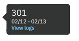

---

copyright:
  years: 2015, 2019
lastupdated: "2019-02-21"

subcollection: assistant

---

{:shortdesc: .shortdesc}
{:new_window: target="_blank"}
{:deprecated: .deprecated}
{:important: .important}
{:note: .note}
{:tip: .tip}
{:pre: .pre}
{:codeblock: .codeblock}
{:screen: .screen}
{:javascript: .ph data-hd-programlang='javascript'}
{:java: .ph data-hd-programlang='java'}
{:python: .ph data-hd-programlang='python'}
{:swift: .ph data-hd-programlang='swift'}

# Visión general de las métricas
{: #logs-overview}

La página Visión general proporciona un resumen de las interacciones entre los usuarios y su asistente. Puede ver la cantidad de tráfico durante un periodo de tiempo determinado, así como las intenciones y entidades que se han reconocido con mayor frecuencia en las conversaciones de los usuarios.
{: shortdesc}

Utilice las métricas para responder a preguntas de este tipo:

* ¿Cuál ha sido el día con más o con menos conversaciones durante el último mes?
* ¿Cuál ha sido el número medio de conversaciones por semana durante el último mes?
* ¿Qué intenciones han aparecido con mayor frecuencia durante la última semana?
* ¿Qué valores de entidad se han reconocido más veces durante el mes de febrero?

Para ver información sobre métricas, seleccione **Visión general** en la barra de navegación.

  

## Controles
{: #logs-overview-controls}

Puede utilizar los controles siguientes para filtrar la información:

- Filtros *Intenciones* y *Entidades*: Utilice cualquiera de estos filtros desplegables para mostrar los datos correspondientes a una intención o entidad específica en su conocimiento.

  **Importante**: Los filtros de intenciones y de entidades se cumplimentan con las intenciones y las entidades del ***conocimiento***, no con lo que hay en el origen de datos. Si ha [seleccionado un origen de datos](/docs/services/assistant?topic=assistant-logs#logs-deploy-id) que no es el conocimiento, es posible que no vea una intención o una entidad de los registros del origen de datos como una opción en los filtros, a menos que las intenciones y las entidades también estén en el conocimiento.

- *Renovar datos*: Le permite renovar las estadísticas de la página Visión general inmediatamente. La página Visión general muestra la última vez que se han actualizado los datos que se muestran. Puede seleccionar **Renovar datos** si cree que pueden estar disponibles datos nuevos.

  Las estadísticas representan tráfico externo (procedente de usuarios o llamadas de API) que ha interactuado con el asistente; no incluyen las interacciones procedentes del panel *Pruébelo* de la herramienta.

- *Control de periodo de tiempo*: Utilice este control para elegir el periodo para el que se muestran datos. Este control afecta a todos los datos que se muestran en la página: no sólo al número de conversaciones que se muestran en el gráfico, sino también a las estadísticas mostradas junto con el gráfico y a las listas de las principales intenciones y entidades.

  Las estadísticas pueden cubrir un periodo de tiempo más largo que el periodo para el que se conservan registros de conversaciones.
  {: note}

  

  Puede elegir si desea ver datos correspondientes a un solo día, una semana, un mes o un trimestre. En cada caso, los puntos de datos del gráfico se ajustan a un periodo de medición adecuado. Por ejemplo, cuando se ve un gráfico correspondiente a un día, los datos se presentan en valores por hora, pero cuando se ve un gráfico correspondiente a una semana, los datos se muestran por día. Una semana siempre va de domingo a sábado. No puede crear periodos de tiempo personalizados, como por ejemplo una semana que vaya de jueves a miércoles, o un mes que comience cualquier día que no sea el primero.

  Si elige una vista de un solo día, por ejemplo, la hora que se muestra para cada conversación está adaptado para reflejar el huso horario del navegador. Puede diferir de la indicación de fecha y hora si revisa el mismo registro de conversación mediante una llamada de API; las llamadas del registro de API siempre se muestran en UTC.

    

## Gráficos y estadísticas
{: #logs-overview-graphs}

Varias tarjetas de puntuación estadísticas proporcionan datos de registro para la aplicación:

* *Total de conversaciones*: El número total de conversaciones entre usuarios activos y la aplicación durante este periodo de tiempo, tal como muestra el gráfico correspondiente.

  Una sola conversación es un conjunto de mensajes que consta de los mensajes que un usuario activo envía a la aplicación y de los mensajes con los que responde la aplicación.

  **Importante**: Se considera que una 'conversación' es *cualquier* conjunto de mensajes enviados o recibidos por una aplicación/bot, de modo que si el servicio empieza por decir "Hi, how can I help you?" (Hola, ¿en qué puedo ayudarle?)y luego el usuario cierra su navegador sin responder, este mensaje se incluye en el recuento total de conversaciones.

* *Número medio de mensajes por conversación*: El número total de mensajes recibidos durante el periodo de tiempo seleccionado dividido por el número total de conversaciones durante el periodo de tiempo seleccionado, tal como se muestra en el gráfico correspondiente.
* *Número máximo de conversaciones*: El número máximo de conversaciones correspondientes a un solo punto de datos dentro del periodo de tiempo seleccionado.
* *Comprensión débil*: El número de mensajes individuales con una comprensión débil. Estos mensajes no están clasificados por una intención y no contienen ninguna entidad conocida. Pueden ser útiles para identificar posibles problemas del diálogo.

Los gráficos detallados proporcionan información adicional:

* *Total de conversaciones*: El número total de conversaciones entre usuarios activos y la aplicación durante este periodo de tiempo.

  Mientras visualiza el gráfico ***Conversaciones***, puede pulsar en un punto de datos individual para ver el valor numérico, tal como se muestra a continuación:

  

* *Número medio de mensajes por conversación*: El número total de mensajes recibidos durante el periodo de tiempo seleccionado dividido por el número total de conversaciones durante el periodo de tiempo seleccionado.
* *Total de mensajes*: El número total de mensajes recibidos de los usuarios activos durante el periodo de tiempo seleccionado.
* *Usuarios activos*: El número de usuarios que han estado interactuando con la aplicación durante el periodo de tiempo seleccionado.
* *Número medio de conversaciones por usuario*: El número total de conversaciones durante el periodo de tiempo seleccionado dividido por el número total de usuarios durante el periodo de tiempo seleccionado.

  Las estadísticas correspondientes a *Usuarios activos* y a *Número medio de conversaciones por usuario* necesitan un parámetro `user_id` exclusivo. Consulte [Habilitación de métricas de usuario](/docs/services/assistant?topic=assistant-logs-resources#logs-resources-user-id) para obtener más información.
  {: important}

## Principales intenciones y principales entidades
{: #logs-overview-tops}

También puede ver las intenciones y entidades que se han reconocido con mayor frecuencia durante el periodo de tiempo especificado.

* *Principales intenciones* - Las intenciones se muestran en una lista sencilla. Además de ver el número de veces que se ha reconocido una intención, puede seleccionar una intención para abrir la página **Conversaciones de usuario** con el rango de fechas filtrado para que coincida con los datos que está visualizando, y la intención filtrada para que coincida con la intención seleccionada.

* En la lista también se muestran las *Entidades principales*. Para cada entidad, puede seleccionar en la columna **Valores** para ver una lista de los valores más comunes que se han identificado para esta entidad durante el periodo de tiempo. También puede seleccionar una entidad para abrir la página **Conversaciones de usuario** con el rango de fechas filtrado para que coincida con los datos que está visualizando y la entidad filtrada para que coincida con la entidad seleccionada.

Consulte [Cómo aprender de las conversaciones](/docs/services/assistant?topic=assistant-logs) para ver consejos sobre cómo editar intenciones y entidades en función de los descubrimientos que realice revisando las intenciones y las entidades que reconoce el servicio.
