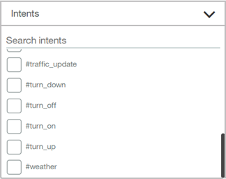
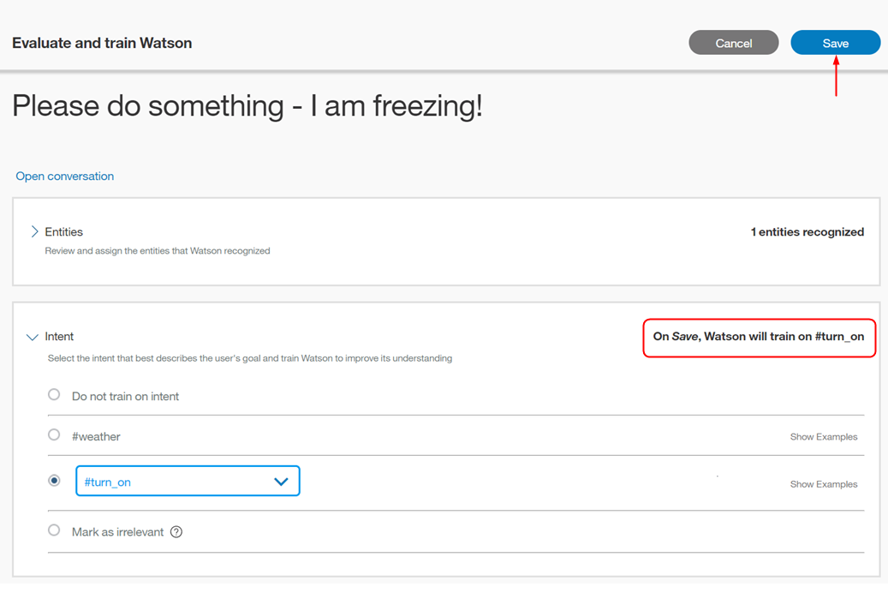
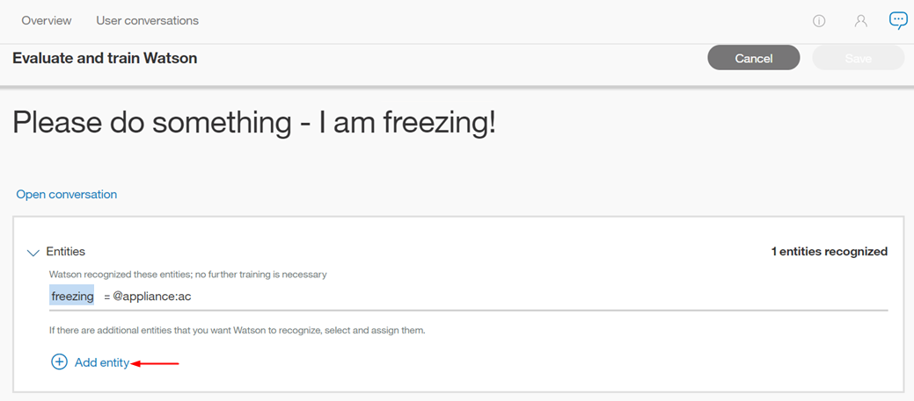

---

copyright:
  years: 2015, 2019
lastupdated: "2019-02-28"

subcollection: assistant

---

{:shortdesc: .shortdesc}
{:new_window: target="_blank"}
{:deprecated: .deprecated}
{:important: .important}
{:note: .note}
{:tip: .tip}
{:pre: .pre}
{:codeblock: .codeblock}
{:screen: .screen}
{:javascript: .ph data-hd-programlang='javascript'}
{:java: .ph data-hd-programlang='java'}
{:python: .ph data-hd-programlang='python'}
{:swift: .ph data-hd-programlang='swift'}

# Cómo aprender de las conversaciones
{: #logs}

Para abrir una lista de mensajes entre los usuarios y el asistente que utiliza este conocimiento de diálogo, seleccione **Conversaciones de usuario** en la barra de navegación.
{: shortdesc}

Cuando se abre la página **Conversaciones de usuarios**, la vista predeterminada muestra los resultados del último día, con el resultado más reciente el primero. Están disponibles la intención principal (#intent) y los valores de entidades reconocidas (@entity) utilizadas en un mensaje y el texto del mensaje. Para las intenciones que no se reconocen, el valor mostrado es *Irrelevante*. Si una entidad no se reconoce, o no se ha proporcionado, el valor mostrado es *No se han encontrado entidades*. 

Es importante señalar que la página **Conversaciones de usuarios** muestra el número total de *mensajes* entre los usuarios y la aplicación. Un mensaje es una sola expresión que un usuario envía a la aplicación. Cada conversación puede estar formada por varios mensajes. Por lo tanto, el número de resultados de esta página **Conversaciones de usuarios** es distinto del número de conversaciones que se muestra en la página [Visión general](/docs/services/assistant?topic=assistant-logs-overview).

## Límites del registro
{: #logs-limits}

El periodo de tiempo durante el que se retienen mensajes dependen del plan de servicio de {{site.data.keyword.conversationshort}}:

  Plan de servicio                         | Retención de mensajes del chat
  ------------------------------------ | ------------------------------------
  Premium                              | Últimos 90 días
  Plus                                 | Últimos 30 días
  Estándar                             | Últimos 30 días
  Lite                                 | Últimos 7 días

## Filtrado de mensajes
{: #logs-filter-messages}

Puede filtrar los mensajes por *Sentencias de usuario de búsqueda*, *Intenciones*, *Entidades* y *Últimos* n *días*:

*Sentencias de usuario de búsqueda* - Escriba una palabra en la barra de búsqueda. Se realizará una búsqueda de las entradas de los usuarios, pero no de las respuestas de la aplicación.

*Intenciones* - Seleccione el menú desplegable y escriba una intención en el campo de entrada o bien seleccione en la lista con información. Puede seleccionar más de una intención, lo cual filtra los resultados utilizando cualquiera de las intenciones seleccionadas, incluidas las marcadas como *Irrelevante*.



*Entidades* - Seleccione el menú desplegable y escriba una entidad en el campo de entrada o bien seleccione en la lista con información. Puede seleccionar más de una entidad, lo cual filtra los resultados por cualquiera de las entidades seleccionadas. Si filtra por intención *y* entidad, los resultados incluirán los mensajes que tienen ambos valores. También puede filtrar por los resultados con *No han encontrado entidades*.


Los mensajes pueden tardar un tiempo en actualizarse. Deje pasar al menos 30 minutos tras la interacción de un usuario con la aplicación antes de intentar filtrar según ese contenido.

## Visualización de un mensaje individual
{: #logs-see-message}

Puede expandir cada entrada de mensaje para ver qué ha dicho el usuario en la conversación completa y cómo ha respondido la aplicación. Para ello, seleccione **Abrir conversación**. Irá automáticamente al mensaje que ha seleccionado dentro de esa conversación.

El tiempo que se muestra en la parte superior de cada conversación está adaptado para reflejar el huso horario del navegador. Puede diferir de la indicación de fecha y hora si revisa el mismo registro de conversación mediante una llamada de API; las llamadas del registro de API siempre se muestran en UTC.


A continuación, puede optar por la clasificación o clasificaciones correspondientes al mensaje que ha seleccionado.


## Mejora entre asistentes
{: #logs-deploy-id}

Crear un conocimiento de diálogo es un proceso iterativo. Cuando desarrolla un conocimiento, utiliza el panel *Pruébelo* para verificar que el servicio reconoce las intenciones y entidades correctas en entradas de prueba y para realizar las correcciones necesarias.

Desde la página de conversaciones de usuario, puede analizar las interacciones reales entre el asistente que ha utilizado para desplegar el conocimiento y los usuarios. En función de estas interacciones, puede realizar correcciones para mejorar la precisión con la que el conocimiento de diálogo reconoce las intenciones y las entidades. Es difícil saber exactamente *cómo* los usuarios realizarán preguntas, o qué mensajes aleatorios pueden enviar, por lo que es importante analizar con frecuencia conversaciones reales para mejorar sus conocimientos de diálogo.

En el caso de una instancia de {{site.data.keyword.conversationshort}} que incluya varios asistentes, es posible que en ocasiones resulte útil utilizar datos de mensaje del conocimiento de diálogo de un asistente para mejorar el conocimiento de diálogo utilizado por otro asistente dentro de esa misma instancia.

 Si es un usuario del plan Premium de {{site.data.keyword.conversationshort}}, sus instancias se pueden configurar de modo que permitan el acceso a los datos de registro desde asistentes de distintas instancias premium.

Como ejemplo, supongamos que tiene una instancia de {{site.data.keyword.conversationshort}} denominada *HelpDesk*. En su instancia HelpDesk tiene dos asistentes: Production y Development. Cuando trabaje en el conocimiento de diálogo para el asistente Development, puede utilizar los registros de los mensajes del asistente Production para mejorar el conocimiento de diálogo del asistente Development.

Cualquier cambio que realice dentro del conocimiento de diálogo para el asistente Development solo afectará al conocimiento del diálogo del asistente Development, aunque utilice datos procedentes de mensajes enviados al asistente Production.

Paralelamente, si crea varias versiones de un conocimiento, quizás desee utilizar datos de mensajes de una versión para mejorar los datos de entrenamiento de otra versión.

### Selección de un origen de datos
{: #logs-pick-data-source}

El término *origen de datos* hace referencia a los registros compilados a partir de conversaciones entre los clientes y el asistente o la aplicación personalizada para los que se ha desplegado un conocimiento de diálogo.

Cuando se abre el separador *Análisis*, se muestran las métricas generadas por las interacciones de usuario con el conocimiento de diálogo actual. No se muestran métricas si el conocimiento actual no ha sido desplegado y utilizado por los clientes.

Para cumplimentar las métricas con datos de mensaje de un conocimiento de diálogo o una versión de conocimiento que se haya añadido a otro asistente o a otra aplicación personalizada, que haya interactuado con los clientes, siga estos pasos:

1.  Pulse el campo **Origen de datos** para ver una lista de asistentes con datos de registro que quizás desee utilizar.

    La lista incluye los asistentes que se han desplegado y a los que tiene acceso. Consulte [Explicación de *Mostrar ID de despliegue*](#logs-deployment-id-explained) para obtener más información sobre esta opción.

1.  Seleccione un origen de datos.

Se muestra información estadística correspondiente al origen de datos seleccionado.

Observe que la lista no incluye versiones de conocimientos. Para obtener los datos asociados con una versión específica de un conocimiento, debe saber el intervalo de tiempo durante el que un asistente desplegado ha utilizado un conocimiento específico. Puede seleccionar el asistente como el origen de datos y, a continuación, filtrar los datos de métricas según las fechas adecuadas.

### Explicación de *Mostrar ID de despliegue*
{: #logs-deployment-id-explained}

Las aplicaciones que utilizan la versión V1 de la API deben especificar un ID de despliegue en cada uno de los mensajes que se envían mediante la API `/message`. Este ID identifica la app desplegada desde la que se ha realizado la llamada. La página Análisis puede utilizar este ID de despliegue para recuperar y mostrar los registros asociados a una aplicación activa específica.

En el caso de asistentes o apps personalizadas que utilicen la versión V2 de la API, el servicio incluye automáticamente un id de sistema y un id de conocimiento con cada llamada a /message para que pueda elegir un origen de datos por nombre de asistente en lugar de utilizar un ID de despliegue.

Para añadir el ID de despliegue, los usuarios de la API V1 incluyen la propiedad deployment dentro de los metadatos de [context ](https://cloud.ibm.com/apidocs/assistant?curl=#get-response-to-user-input){: new_window}, como en este ejemplo:

```json
"context" : {
  "metadata" : {
       "deployment": "HelpDesk-Production"
  }
}
```
{: codeblock}

## Cómo realizar mejoras en los datos de entrenamiento
{: #logs-fix-data}

Utilice información extraída de conversaciones reales para corregir el modelo asociado a su conocimiento de diálogo.

Si utiliza datos de otro origen de datos, las mejoras que realice en el modelo solo se aplicarán al conocimiento de diálogo actual. El campo **Origen de datos** muestra el origen de los mensajes que está utilizando para mejorar este conocimiento de diálogo, y la parte superior de la página muestra el conocimiento de diálogo al que está aplicando los cambios.

### Corrección de una intención
{: #logs-correct-intent}

1.  Para corregir una intención, seleccione el icono de edición  que hay junto a la intención seleccionada.
1.  En la lista proporcionada, seleccione la intención correcta para esta entrada.
    - Empiece escribiendo en el campo de entrada y se filtrará la lista de intenciones.
    - También puede elegir **Marcar como irrelevante** en este menú. (Para obtener más información, consulte [Marcar como irrelevante](/docs/services/assistant?topic=assistant-intents#intents-mark-irrelevant)). O bien puede elegir **No entrenar en intención**, que no guarda este mensaje como ejemplo para el entrenamiento.

    
1.  Seleccione **Guardar**.

    

    El servicio {{site.data.keyword.conversationshort}} da soporte a la adición de entrada de usuario como un ejemplo para una intención *tal-cual*. Si está utilizando referencias de @entity como ejemplos en sus datos de entrenamiento de intenciones, y un mensaje de usuario que desea guardar contiene un valor de entidad o un sinónimo de sus datos de entrenamiento, debe editar el mensaje posteriormente. Después de guardarlo, edite el mensaje en la página Intenciones para sustituir la entidad a la que hace referencia. Para obtener más información, consulte [Referencia directa a @Entity como un ejemplo de intención](/docs/services/assistant?topic=assistant-intents#intents-entity-as-example).
    {: tip}

### Adición de un valor de entidad o sinónimo
{: #logs-add-entity}

1.  Para añadir un valor de entidad o sinónimo, seleccione el icono de edición  que hay junto a la entidad elegida.
1.  Seleccione **Añadir entidad**.

    
1.  Ahora seleccione una palabra o frase en la entrada de usuario subrayada.

    
1.  Elija una entidad a la que se añadirá la frase resaltada como valor.
    - Empiece escribiendo en el campo de entrada y se filtrará la lista de entidades y valores.
    - Para añadir la frase resaltada como sinónimo de un valor existente, elija `@entidad:valor` en la lista desplegable.

    
1.  Seleccione **Guardar**.

    
