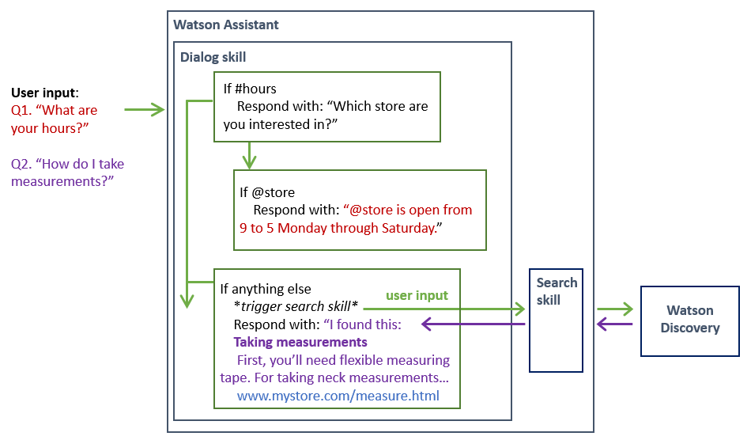

---

copyright:
  years: 2015, 2019
lastupdated: "2019-08-02"

subcollection: assistant

---

{:shortdesc: .shortdesc}
{:new_window: target="_blank"}
{:deprecated: .deprecated}
{:important: .important}
{:note: .note}
{:tip: .tip}
{:pre: .pre}
{:codeblock: .codeblock}
{:screen: .screen}
{:javascript: .ph data-hd-programlang='javascript'}
{:java: .ph data-hd-programlang='java'}
{:python: .ph data-hd-programlang='python'}
{:swift: .ph data-hd-programlang='swift'}

# Creación de un conocimiento de búsqueda 
{: #skill-search-add}

Un asistente utiliza un *conocimiento de búsqueda* para direccionar las consultas de cliente complejas al servicio {{site.data.keyword.discoveryfull}}. {{site.data.keyword.discoveryshort}} trata la entrada de usuario como una consulta de búsqueda. Localiza la información relevante para la consulta de un origen de datos externo y la devuelve al asistente.
{: shortdesc}

Esta característica solo está disponible para los usuarios de los planes Plus o Premium.
{: note}

Añada un conocimiento de búsqueda a su asistente para evitar que el asistente tenga que decir cosas como, `Lo siento. No puedo ayudarle`. En su lugar, el asistente puede consultar documentos o datos de la empresa existentes para ver si se puede encontrar y compartir cualquier información útil con el cliente.


El siguiente vídeo de 4 minutos proporciona una visión general del conocimiento de búsqueda.

<iframe class="embed-responsive-item" id="youtubeplayer" title="Descripción general del conocimiento de búsqueda" type="text/html" width="640" height="390" src="https://www.youtube.com/embed/ZcgGf8J2Cfw?rel=0" frameborder="0" webkitallowfullscreen mozallowfullscreen allowfullscreen> </iframe>

Para obtener más información sobre cómo el conocimiento de búsqueda puede contribuir a su negocio, [lea esta publicación de blog ](https://medium.com/ibm-watson/adding-search-to-watson-assistant-99e4e81839e5){: new_window}.

## Cómo funciona
{: #skill-search-add-how}

El conocimiento de búsqueda busca información de una recopilación de datos que crea el usuario mediante el servicio {{site.data.keyword.discoveryshort}}.

{{site.data.keyword.discoveryshort}} es un servicio que rastrea, convierte y normaliza los datos no estructurados. El producto aplica el análisis de datos y la intuición cognitiva para enriquecer los datos de forma que luego pueda encontrar y recuperar fácilmente la información significativa. Para obtener más información sobre {{site.data.keyword.discoveryshort}}, consulte la [documentación del producto ](/docs/services/discovery?topic=discovery-about){: new_window}.

Por lo general, el tipo de recopilación de datos que añade a {{site.data.keyword.discoveryshort}} y al que accede desde su asistente contiene información que es propiedad de su empresa. Esta información propietaria puede incluir FAQ, material auxiliar de ventas, manuales técnicos o documentos escritos por expertos en la materia. Busque en esa densa recopilación de información propietaria para encontrar respuestas rápidamente a las preguntas de los clientes.

El diagrama siguiente muestra cómo se procesa la entrada de usuario cuando se añaden tanto un conocimiento de diálogo como un conocimiento de búsqueda a un asistente.



## Antes de empezar
{: #skill-search-add-prereqs}

Si no tiene una instancia de servicio de {{site.data.keyword.discoveryshort}}, se le suministra una instancia de plan Lite gratuita como parte de este proceso. Si tiene una instancia de servicio de {{site.data.keyword.discoveryshort}}, conéctese a la misma; no se le solicitará que cree una instancia nueva como parte de este proceso.

Si crea una instancia de descubrimiento en primer lugar, no añada el origen de datos enriquecido previamente que se denomina *Watson Discovery News* a la instancia. No es un tipo de datos en el que se puedan realizar búsquedas desde {{site.data.keyword.conversationshort}}.
{: tip}

## Crear el conocimiento de búsqueda
{: #skill-search-add-task}

1.  Pulse en el separador **Diálogo** y luego en **Crear conocimiento**.

1.  Pulse el icono *Buscar conocimiento* y luego en **Siguiente**.

    Sólo puede seleccionar el conocimiento de búsqueda si es un usuario del plan Plus o Premium.
    {: note}

1.  Especifique los detalles del nuevo conocimiento:
    - **Nombre**: un nombre no puede contener más de 100 caracteres. El nombre es obligatorio.
    - **Descripción**: una descripción no puede contener más de 200 caracteres.

1.  Pulse **Continuar**.

Los pasos restantes difieren en función de si tiene acceso a una instancia del servicio {{site.data.keyword.discoveryshort}} existente con recopilaciones creadas o no. Siga el procedimiento adecuado para su situación:

- [Conéctese a una instancia existente de Watson Discovery](#skill-search-add-connect-discovery)
- [Cree una instancia de Watson Discovery](#skill-search-add-create-discovery)

## Conexión a una instancia existente del servicio Watson Discovery
{: #skill-search-add-connect-discovery}

1.  Elija la instancia del servicio {{site.data.keyword.discoveryshort}} de la que desea extraer información.
{: #choose-d-instance}

    En la lista se muestran las instancias del servicio {{site.data.keyword.discoveryshort}} a las que tiene acceso.

    Si ve un aviso que indica que algunas de las instancias del servicio {{site.data.keyword.discoveryshort}} no tienen credenciales definidas, significa que puede acceder al menos a una instancia que nunca ha abierto directamente desde el panel de control de {{site.data.keyword.cloud_notm}}. Debe acceder a una instancia de servicio para que se creen credenciales para la misma. Las credenciales deben existir para que {{site.data.keyword.conversationshort}} pueda establecer una conexión con la instancia del servicio {{site.data.keyword.discoveryshort}} en su nombre. Si cree que en la lista falta una instancia del servicio {{site.data.keyword.discoveryshort}}, abra la instancia directamente desde el panel de control de {{site.data.keyword.cloud}} para generar credenciales para la misma.
    {: note}

1.  Indique la recopilación de datos que se va a utilizar, realizando una de las siguientes acciones:
{: #pick-data-collection}

    - Elija una recopilación de datos existente.

      Pulse el enlace *Abrir en Discovery* para revisar la configuración de una recopilación de datos antes de decidir la que va a utilizar.

      Vaya a [Configurar la búsqueda](#search-skill-add-configure).

    - Si no tiene una recopilación o no desea utilizar ninguna de las recopilaciones de datos que aparecen en la lista, pulse **Crear una nueva recopilación** para añadir una. Siga el procedimiento del apartado sobre [Creación de una recopilación de datos](#search-skill-add-create-discovery-collection).

      El botón **Crear una nueva recopilación** no se visualiza si ha alcanzado el límite de recopilaciones que tiene permitido crear en función del plan de servicio de {{site.data.keyword.discoveryshort}}. Consulte los [Planes de precios de {{site.data.keyword.discoveryshort}} ](/docs/services/discovery/discovery-about?topic=discovery-discovery-pricing-plans){: new_window} para ver información sobre los límites de cada plan.
      {: note}

## Creación de una instancia de servicio de Watson Discovery
{: #skill-search-add-create-discovery}

1.  Para crear una instancia de servicio de {{site.data.keyword.discoveryshort}}, pulse **Crear nueva recopilación**.

    Si no tiene una instancia de servicio de {{site.data.keyword.discoveryshort}} existente, se creará automáticamente un servicio de {{site.data.keyword.discoveryshort}}.

    Se proporciona una instancia del plan Lite del servicio en {{site.data.keyword.Bluemix_notm}}, independientemente del plan de servicio de {{site.data.keyword.conversationshort}} que tenga.
    {: note}

1.  Revise los términos y condiciones de uso de la instancia y pulse **Aceptar** para continuar.

1.  [Cree una recopilación de datos](#skill-search-add-create-discovery-collection).

## Creación de una recopilación de datos
{: #skill-search-add-create-discovery-collection}

Si tiene un plan Lite del servicio Descubrimiento, tiene la oportunidad de actualizar el plan. Si no desea actualizar ahora mismo, pulse **Empecemos**.

1.  Para crear una recopilación de {{site.data.keyword.discoveryshort}}, realice una de las acciones siguientes:

      - Para crear una recopilación a partir de datos almacenados en un tipo de origen de datos para el que {{site.data.keyword.discoveryshort}} proporciona soporte incorporado, elija un tipo de origen de datos.

        1.  Especifique la información solicitada para el origen de datos que seleccione y pulse **Conectar**.

            Consulte [Conexión con orígenes de datos ](/docs/services/discovery?topic=discovery-sources){: new_window} para ver más detalles.
        1.  Indique la frecuencia con la que desea que los datos del origen de datos se sincronicen con la recopilación que está creando en {{site.data.keyword.discoveryshort}}.
        1.  Especifique la información que desea extraer del origen de datos e incluir en la recopilación de {{site.data.keyword.discoveryshort}}.

            Las opciones que se muestran difieren en función del tipo de origen de datos.

            - Para un origen de datos de Salesforce, seleccione los tipos de objeto que desea extraer de los documentos de origen. Puede seleccionar, por ejemplo, un [tipo de objeto de caso ](https://developer.salesforce.com/docs/atlas.en-us.object_reference.meta/object_reference/sforce_api_objects_case.htm#!) que represente un *caso*, que es un problema de un cliente.
            - Para un origen de datos de Sharepoint, especifique vías de acceso.
            - Para repositorios de archivos, especifique directorios o archivos.
            - Para un origen de datos de rastreo web, especifique el URL base de un sitio web que desee rastrear. La página web que especifique y las páginas a las que se enlace se rastrearán, y se creará un documento por cada página web.

            Watson necesitará unos minutos para empezar a crear documentos. Tan pronto como el origen empiece a ser procesado, el número de documentos que se visualizan en la página de detalles de {{site.data.keyword.discoveryshort}} aumenta. Es posible que deba renovar la página. 
            
            Para obtener ayuda sobre la creación de orígenes de datos, consulte [Resolución de problemas](#skill-search-add-troubleshoot).

        1.  Pulse **Guardar y sincronizar objetos**.

            Se crea la recopilación de datos. Una vez finalizado el proceso, se muestra una página de resumen en {{site.data.keyword.discoveryshort}} en otro separador del navegador web.

      - Para crear una recopilación mediante la carga de documentos, pulse **Cargar documentos**.

        1.  En primer lugar, defina la colección y, a continuación, cargue los documentos. Proporcione la siguiente información:

            - Nombre de la recopilación. El nombre debe ser exclusivo para esta instancia de servicio.
            - Idioma. Seleccione el idioma de los archivos que va a añadir a esta recopilación. Para obtener información acerca de los idiomas admitidos por {{site.data.keyword.discoveryshort}}, consulte [Soporte de idiomas ](/docs/services/discovery?topic=discovery-language-support){: new_window}.

              Si está cargando un documento PDF y desea extraer información de la parte, la naturaleza e información de categoría de la misma, expanda la sección **Avanzado** y pulse **Utilizar la configuración de contrato predeterminada con esta recopilación**. Para obtener más detalles, consulte [requisitos de la recopilación ](/docs/services/discovery?topic=discovery-element-classification#element-collection){: new_window}.
        1.  Cargue los documentos.

            Los tipos de archivos soportados incluyen archivos PDF, HTML, JSON y DOC. Consulte [Adición de contenido ](/docs/services/discovery?topic=discovery-addcontent){: new_window} para obtener más detalles.
            {: note}

            No está disponible la sincronización en curso de los documentos cargados. Si desea seleccionar los cambios que se realizan en un documento, cargue una versión posterior del documento.

Espere a que la recopilación se haya ingerido por completo antes de volver a {{site.data.keyword.conversationshort}}.

### Ejemplo de creación de recopilación de datos
{: #skill-search-add-json-collection-example}

Por ejemplo, podría tener un archivo JSON como este:

```bash
{
  "Title": "Acerca de",
  "Shortdesc": "IBM Watson Assistant es un bot cognitivo que puede personalizar para adaptarlo a sus necesidades empresariales y desplegar en varios canales para ofrecer ayuda a los clientes donde y cuando la necesiten.",
  "Topics": "descripción general",
  "url": "https://cloud.ibm.com/docs/services/assistant?topic=assistant-index"
}
```
{: codeblock}

Si carga un archivo JSON que contiene valores de nombre que se repiten, la búsqueda sólo indexa y devuelve la primera aparición del par nombre y valor. Desglose el archivo en varios archivos JSON y suba el grupo.
{: tip}

## Configuración de la búsqueda
{: #skill-search-add-configure}

1.  En la instancia de {{site.data.keyword.discoveryshort}}, pulse **Finalizar configuración en el asistente de Watson**.

1.  En la página de conocimientos de búsqueda de {{site.data.keyword.conversationshort}}, pulse **Configurar**.

1.  Elija los campos de recopilación de {{site.data.keyword.discoveryshort}} de los que quiere extraer texto para incluir en el resultado de la búsqueda que se devuelve al usuario.

    Los campos que están disponibles difieren en función de los datos que se han ingerido.

    Cada resultado de la búsqueda puede constar de las secciones siguientes:

    - **Título**: título del resultado de la búsqueda. Utilice el título, el nombre o un tipo de campo similar de la recopilación como título de resultado de la búsqueda.

      Debe seleccionar algo para el título o no se visualiza ninguna respuesta de resultados de búsqueda en las integraciones de Facebook y Slack.
    - **Cuerpo**: descripción del resultado de la búsqueda. Utilice un campo abstracto, de resumen o de resaltado de la recopilación como cuerpo del resultado de la búsqueda.

       Debe seleccionar algo para el cuerpo o no se visualiza ninguna respuesta de resultados de búsqueda en las integraciones de Facebook y Slack.
    - **URL**: este campo se puede llenar con cualquier contenido de pie de página que desee incluir al final del resultado de la búsqueda.

       Por ejemplo, es posible que desee incluir un enlace de hipertexto al objeto de datos original en su origen de datos nativo. La mayoría de los orígenes de datos en línea proporcionan URL públicos de referencia automática para objetos del almacén para dar soporte al acceso directo. Si añade un URL, debe ser válido y accesible. Si no lo es, la integración de Slack no incluirá el URL en su respuesta y la integración de Facebook no devolverá ninguna respuesta.

       Las integraciones con Facebook y Slack pueden mostrar correctamente la respuesta del resultado de búsqueda cuando el campo URL está vacío.
  
    Debe elegir un valor para, como mínimo, una de las secciones de resultados de la búsqueda.
    {: important}

    Consulte [Sugerencias para la selección de campos de recopilación](#skill-search-add-field-tips) para obtener ayuda.

    Si no hay ninguna opción disponible en los campos desplegables, tendrá que dar más tiempo a {{site.data.keyword.discoveryshort}} para que termine de crear la recopilación. Después de esperar, si la colección no se crea, es posible que la recogida no contenga ningún documento o que tenga errores de proceso que deberá tener en cuenta en primer lugar.

    Para continuar con el [Ejemplo del archivo JSON cargado](#skill-search-add-json-collection-example), una buena correlación consistiría en utilizar los campos *Title*, *Shortdesc* y *url*.

    

    A medida que se añaden correlaciones de campos, se muestra una vista previa del resultado de la búsqueda con información de los campos correspondientes de la recopilación de datos. Esta vista previa muestra lo que se incluye en la respuesta de resultados de la búsqueda que se devuelve a los usuarios.

    Para obtener ayuda sobre la configuración de la búsqueda, consulte [Resolución de problemas](#skill-search-add-troubleshoot).

1.  Esboce distintos mensajes para compartirlos con los usuarios en función del éxito que tenga la búsqueda.

    <table>
    <caption>Mensajes del resultado de la búsqueda</caption>
    <tr>
      <th>Nombre de campo</th>
      <th>Caso de ejemplo</th>
      <th>Mensaje de ejemplo</th>
    </tr>
    <tr>
      <td>Mensaje</td>
      <td>Se devuelven resultados de la búsqueda</td>
      <td>He encontrado esta información que puede resultar útil: </td>
    </tr>
    <tr>
      <td>No se han encontrado resultados.</td>
      <td>No se han encontrado resultados de la búsqueda</td>
      <td>He buscado en mi base de conocimientos la información que podría responder a la consulta, pero no ha encontrado nada útil que compartir.</td>
    </tr>
    <tr>
      <td>Mensaje de error</td>
      <td>Por algún motivo, no he podido completar la búsqueda.</td>
      <td>Es posible que tenga información que podría ayudar a responder a su consulta, pero en este momento no puedo realizar búsquedas en mi base de conocimientos.</td>
    </tr>
    </table>

1.  Pulse **Pruébelo** para abrir el panel "Pruébelo" para hacer una prueba. Escriba un mensaje de prueba para ver los resultados que se devuelven cuando se aplican las opciones de configuración a la búsqueda. Realice los ajustes necesarios.

1.  Pulse **Crear**.

Si desea cambiar la configuración de la tarjeta del resultado de búsqueda más adelante, abra de nuevo el conocimiento de búsqueda y realice los cambios. No es necesario guardar los cambios a medida que los realice; se aplican automáticamente. Cuando esté satisfecho con los resultados de la búsqueda, pulse **Guardar** para finalizar la configuración del conocimiento de búsqueda.

Si decide que desea conectarse a una instancia de servicio de {{site.data.keyword.discoveryshort}} o recopilación de datos distinta, cree un nuevo conocimiento de búsqueda y configúrelo para conectarse a la otra instancia. **No puede** cambiar los detalles de la instancia de servicio o de la recopilación de datos para un conocimiento de búsqueda después de crearlo.
{: important}

### Sugerencias para la selección de campos de recopilación
{: #skill-search-add-field-tips}

Los campos de recolección adecuados de los que extraer datos varían en función del origen de los datos de la recopilación y de cómo se ha enriquecido el origen de datos. Después de elegir un tipo de recopilación de datos, los valores de campo de recopilación se rellenan previamente con campos de origen que se considere que es probable que tengan información útil, dado el tipo de origen de datos de la colección. En cualquier caso, usted conoce sus datos mejor que nadie. Puede cambiar los campos de origen a otros que contengan la mejor información para cubrir sus necesidades.

Para obtener más información sobre la estructura de los documentos de la recopilación, incluidos los nombres de los campos que contienen información que podría desear extraer, abra la recopilación en {{site.data.keyword.discoveryshort}} y luego pulse el icono de esquema Ver datos .

Los campos de origen se crean cuando se crea la colección. Para obtener más información sobre los campos que se generan automáticamente, como por ejemplo `enriched_text.concepts.text`, consulte [Configuración del servicio > Adición de características ](/docs/services/discovery?topic=discovery-configservice#adding-enrichments){: new_window}.

## Resolución de problemas
{: #skill-search-add-troubleshoot}

Revise esta información para obtener ayuda para realizar tareas comunes.

- **Creación de una recopilación de datos de rastreo web**: cosas que hay que saber al crear un origen de datos de rastreo web:

    - En el caso de un Plan Lite de {{site.data.keyword.discoveryshort}}, no pueden crear más de 1000 documentos. 
    - Para aumentar el número de documentos disponibles para la recopilación de datos, pulse Añadir un grupo de URL donde puede listar los URL para las páginas que desea rastrear, pero que no están enlazadas desde el URL de inicio.
    - Para reducir la cantidad de documentos disponibles para la recopilación de datos, especifique un subdominio del URL base. O bien, en los valores de rastreo web, limite el número de saltos que puede realizar Watson desde la página original. También puede especificar subdominios para excluir explícitamente del rastreo.
    - Si no se muestran documentos pasados unos minutos y tras actualizar la página, asegúrese de que el contenido que quiere procesar esté disponible en la página de origen del URL. Algunos contenidos de páginas web se generan dinámicamente y, por lo tanto, no se pueden rastrear.

- **Configuración de resultados de búsqueda para documentos subidos**: si utiliza una recopilación de documentos subidos y no puede obtener los resultados de búsqueda correctos o los resultados no son suficientemente concisos, pueden plantearse utilizar *Compresión inteligente de documentos* cuando cree la recopilación de datos. 

  Esta función le permite anotar documentos en función del formato de texto. Por ejemplo, puede enseñar a {{site.data.keyword.discoveryshort}} que cualquier texto en negrita de 28 puntos es un título de documento. Si aplica esta información a la colección al incorporarla para su proceso, puede utilizar posteriormente el campo *title* como el origen de la sección de título del resultado de la búsqueda. 
  
  También puede utilizar la Comprensión inteligente de documentos para dividir documentos de gran tamaño en segmentos para facilitar la búsqueda. Para obtener más información, consulte el tema [Comprensión inteligente de documentos ](/docs/services/discovery?topic=discovery-sdu) en la documentación de {{site.data.keyword.discoveryshort}}.

- **Mejora de los resultados de la búsqueda**: Si no le gustan los resultados que está viendo, revise esta información para obtener ayuda.

  - Llame al conocimiento de búsqueda desde un nodo de diálogo, y especifique los detalles del filtro. 

    Desde una respuesta de conocimiento de búsqueda de nodo de diálogo, puede especificar un filtro de sintaxis de consulta de {{site.data.keyword.discoveryshort}} completo para ayudar a reducir los resultados. 
    
    Por ejemplo, puede definir un filtro que filtre los documentos de la colección de datos que no mencionan una intención en el título del documento o en algún otro campo de metadatos. O el filtro puede filtrar documentos que no identifican a una entidad como una entidad conocida en los metadatos de la colección de datos o que no mencionan la entidad en ningún lado del texto completo del documento. Para obtener detalles sobre cómo agregar un tipo de respuesta de conocimiento de búsqueda, consulte [Agregar respuestas enriquecidas](https://cloud.ibm.com/docs/services/assistant?topic=assistant-dialog-overview#dialog-overview-multimedia-add).

    Para obtener más información sobre cómo mejorar los resultados, lea la publicación de blog [Mejore los resultados de la consulta de lenguaje natural de Watson Discovery ](https://developer.ibm.com/blogs/improving-your-natural-language-query-results-from-watson-discovery/).

## Siguientes pasos
{: #skill-search-add-next-steps}

Después de crear el conocimiento, aparece como un mosaico en la página Conocimientos.

El conocimiento de búsqueda no puede interactuar con los clientes hasta que se añada a un asistente y este se despliegue. Consulte [Creación de asistentes](/docs/services/assistant?topic=assistant-assistant-add).

### Adición del conocimiento a un asistente
{: #skill-search-add-to-assistant}

Puede añadir un conocimiento a un asistente. Abra el icono del asistente y añada el conocimiento al asistente desde allí. No puede elegir el asistente que utilizará el conocimiento desde la página de configuración de conocimientos.

Un conocimiento de búsqueda puede ser utilizado por más de un asistente.

1.  En el separador Asistente, pulse para abrir el mosaico correspondiente al asistente al que desea añadir el conocimiento.

1.  Pulse **Añadir conocimiento de búsqueda**.

1.  Pulse **Añadir conocimiento existente**.

    Pulse el conocimiento que desea añadir entre los conocimientos que se muestran.

Después de añadir un conocimiento de búsqueda a un asistente, se habilita automáticamente para el asistente como se indica a continuación:

- Si el asistente sólo tiene un conocimiento de búsqueda, cualquier entrada de usuario que se envía a uno de los canales de integración del asistente desencadena el conocimiento de búsqueda.

- Si el asistente tiene un conocimiento de diálogo y uno de búsqueda, cualquier entrada de usuario desencadena primero el conocimiento de diálogo. El diálogo se encarga de cualquier entrada de usuario que tenga una alta fiabilidad que pueda responder correctamente. Cualquier consulta que normalmente desencadene el nodo `anything_else` en el árbol de diálogo se envía al conocimiento de búsqueda en su lugar.

  Puede impedir que se desencadene la búsqueda desde el nodo `anything_else` siguiendo los pasos de [Inhabilitación de la búsqueda](#search-skill-add-disable).
  {: note}

- Si desea que se desencadene una consulta de búsqueda específica para preguntas específicas, añada un tipo de respuesta de conocimiento de búsqueda al nodo de diálogo adecuado. Consulte [Respuestas](/docs/services/assistant?topic=assistant-dialog-overview#dialog-overview-multimedia) para obtener más detalles.

## Activadores de búsqueda
{: #skill-search-add-trigger}

El conocimiento de búsqueda se desencadena de las formas siguientes:

- **Nodo de cualquier otra cosa**: busca en un origen de datos externo una respuesta relevante cuando ninguno de los nodos de diálogo puede responder a la consulta del usuario.

  En lugar de mostrar un mensaje estándar como, por ejemplo, `No sé cómo ayudarle con este asunto.`, el asistente puede decir `Quizás esta información le ayude:`, seguido del texto que devuelve la búsqueda. Si hay un conocimiento de búsqueda enlazado al asistente, siempre que se activa el nodo `anything_else`, en lugar de mostrar la respuesta del nodo se realiza una búsqueda. El asistente pasa la entrada de usuario como consulta al conocimiento de búsqueda y devuelve los resultados de la búsqueda como respuesta.

  Puede impedir que se desencadene la búsqueda desde el nodo `anything_else` siguiendo los pasos de [Inhabilitación de la búsqueda](#search-skill-add-disable).
  {: note}

- **Tipo de respuesta de búsqueda**: si añade un tipo de respuesta de búsqueda a un nodo de diálogo, su asistente recupera texto de un origen de datos externo y lo devuelve como respuesta a una pregunta concreta. Este tipo de búsqueda se produce únicamente cuando se procesa el nodo de diálogo individual.

  Este método resulta útil si desea limitar una consulta de usuario antes de desencadenar una búsqueda. Por ejemplo, la rama de diálogo podría recopilar información sobre el tipo de dispositivo que el cliente desea comprar. Si conoce la versión y el modelo, puede enviar una palabra clave de modelo en la consulta que se envía al conocimiento de búsqueda y obtener mejores resultados.
- **Solo conocimiento de búsqueda**: si solo hay un conocimiento de búsqueda asociado a un asistente y no hay ningún conocimiento de diálogo enlazado al mismo, la consulta de búsqueda se envía al servicio {{site.data.keyword.discoveryshort}} cuando se recibe una entrada de usuario de uno de los canales de integración del asistente.

## Probar el conocimiento de búsqueda
{: #search-skill-add-test}

Después de configurar la búsqueda, puede enviar consultas de prueba para ver los resultados de la búsqueda que se devuelven de {{site.data.keyword.discoveryshort}} utilizando el panel "Pruébelo" del conocimiento de búsqueda.

Para probar la experiencia completa que tendrán los clientes cuando haga preguntas que responde el diálogo o que desencadenan una búsqueda, utilice una integración de canal como, por ejemplo, el enlace de vista previa.

Desde el panel "Pruébelo", no puede probar la experiencia de usuario completa. El conocimiento de búsqueda se configura por separado y se conecta a un asistente. El conocimiento de diálogo no tiene forma de saber los detalles de la búsqueda y, por lo tanto, no puede mostrar los resultados de la búsqueda en el panel "Pruébelo".
{: important}

Configure al menos un canal de integración para probar el conocimiento de búsqueda. En el canal, especifique las consultas que desencadenan la búsqueda. Si inicia cualquier tipo de búsqueda a partir del diálogo, pruebe el diálogo para asegurarse de que la búsqueda se desencadene según lo esperado. Si no utiliza tipos de respuesta de búsqueda, pruebe que se active una búsqueda solo cuando no haya nodos de diálogo existentes que puedan responder a la entrada del usuario. Cada vez que se active una búsqueda, asegúrese de que devuelva resultados con sentido.

## Envío de más solicitudes al conocimiento de búsqueda
{: #search-skill-add-increase-flow}

Si quiere que el conocimiento de diálogo responda con menos frecuencia y, en su lugar, envíe más consultas al conocimiento de búsqueda, puede configurar el diálogo para ello.

Debe añadir tanto un conocimiento de diálogo como un conocimiento de búsqueda a su asistente para que este enfoque funcione.

Siga este procedimiento para hacer que sea menos probable que el diálogo responda estableciendo el umbral de nivel de confianza desde el valor predeterminado de 0,2, a 0,5. El cambio del umbral de nivel de confianza a 0,5 indica a su asistente que no responda con una respuesta del cuadro de diálogo a menos que el asistente tenga una confianza superior al 50 % de que el diálogo puede entender la intención del usuario y atenderla.

1.  En la página *Diálogo* de su conocimiento de diálogo, asegúrese de que el último nodo del árbol de diálogo tenga una condición `anything_else`.

    Siempre que se procesa este nodo. Se desencadena el conocimiento de búsqueda.

1.  Añada una carpeta al diálogo. Coloque la carpeta encima del primer nodo de diálogo que quiera desenfatizar. Añada la siguiente condición a la carpeta:

    `intents[0].confidence > 0.5`

    Esta condición se aplica a todos los nodos de la carpeta. La condición indica a su asistente que procese los nodos en la carpeta sólo si su asistente tiene al menos un 50 % de confianza de que conoce la intención del usuario.

1.  Mueva a la carpeta los nodos de diálogo que no desea que el asistente procese a menudo.

Después de cambiar el diálogo, pruebe el asistente para asegurarse de que el conocimiento de búsqueda se desencadena con la frecuencia que usted quiera.

Un enfoque alternativo es enseñar el diálogo los temas a ignorar. Para ello, puede añadir expresiones que quiera que el asistente envíe al conocimiento de búsqueda inmediatamente como expresiones de prueba en el panel "Pruébelo" del conocimiento de diálogo. A continuación, puede seleccionar la opción **Marcar como irrelevante** dentro del panel "Pruébelo" para enseñar al diálogo a que no responda a esta expresión o a similares. Para obtener más información, consulte [Enseñar a su asistente los temas a ignorar](/docs/services/assistant?topic=assistant-logs#logs-mark-irrelevant).

## Inhabilitación de la búsqueda
{: #search-skill-add-disable}

Puede inhabilitar el conocimiento de búsqueda para que no se active.

Es posible que desee hacerlo de forma temporal, mientras está configurando la integración. O quizás prefiera desencadenar solo una búsqueda de consultas de usuario específicas que pueda identificar dentro del diálogo, y utilizar un tipo de respuesta de conocimiento de búsqueda que responder.

Para evitar que se desencadene el conocimiento de búsqueda, realice los pasos siguientes:

1.  En la página **Asistentes**, pulse el menú de su asistente y, a continuación, seleccione **Valores**.
1.  Abra la página *Conocimiento de búsqueda* y, a continuación, pulse para cambiar el conmutador a **Inhabilitado**.
