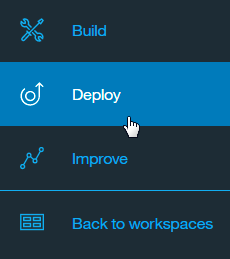

---

copyright:
  years: 2015, 2018
lastupdated: "2018-01-24"

---

{:shortdesc: .shortdesc}
{:new_window: target="_blank"}
{:tip: .tip}
{:pre: .pre}
{:codeblock: .codeblock}
{:screen: .screen}
{:javascript: .ph data-hd-programlang='javascript'}
{:java: .ph data-hd-programlang='java'}
{:python: .ph data-hd-programlang='python'}
{:swift: .ph data-hd-programlang='swift'}

# Realización de pruebas en Slack

Puede utilizar la herramienta de despliegue de prueba para integrar su espacio de trabajo de {{site.data.keyword.conversationshort}} en un equipo Slack como usuario de bot. Utilice este método si realizar una prueba rápida mediante un bot Slack como interfaz de usuario para el espacio de trabajo.

La herramienta de despliegue de prueba utiliza el servicio {{site.data.keyword.openwhisk}} para desplegar una aplicación Slack creada previamente en su equipo como usuario bot. Esta aplicación maneja la comunicación con los espacios de trabajo de {{site.data.keyword.conversationshort}}. 


Tenga en cuenta que la herramienta de despliegue de prueba tiene algunas limitaciones:

- No puede utilizar esta herramienta para publicar una aplicación para que la utilicen otros equipos.
- Si utiliza este método para desplegar más de un espacio de trabajo en el mismo equipo, todos los espacios de trabajo responderán al nombre de usuario `@ibmwatson_bot`. Se recomienda utilizar esta herramienta para desplegar un solo espacio cada vez en cada equipo Slack.
- Debe tener permiso para instalar apps a su equipo Slack. Póngase en contacto con el administrador de Slack si no está seguro de si tiene este permiso.
- La aplicación Slack previamente creada solo sirve para realizar pruebas y es posible que no siempre esté disponible.
- Debido a las restricciones de {{site.data.keyword.openwhisk_short}}, esta herramienta solo está disponible actualmente para la región EE.UU. Sur de {{site.data.keyword.Bluemix_notm}}.

Para instalar la aplicación como usuario bot:

1. En la herramienta {{site.data.keyword.conversationshort}}, abra el espacio que desea probar en Slack.
1. Pulse el icono de menú de la esquina superior izquierda y seleccione **Desplegar**. Se abre la página Opciones de despliegue.

   

1. En **Desplegar con {{site.data.keyword.openwhisk_short}}**, pulse **Probar en Slack** y siga las instrucciones. 

   

## Conversación con el bot

Después de completar el proceso de despliegue, puede utilizar el nombre de usuario `@ibmwatson_bot` para interactuar con el espacio de trabajo de {{site.data.keyword.conversationshort}}, al igual que lo haría con cualquier otro bot de Slack.

Tenga en cuenta que el bot desplegado en el equipo conserva el estado de cada usuario dentro de un canal concreto. Esto significa que cualquier variable que guarde en el contexto de diálogo se mantiene indefinidamente, a menos que el diálogo la borre.

Si necesita poder restablecer la conversación a un estado inicial conocido, debe hacerlo en el diálogo. Asegúrese de que el diálogo tiene un nodo que se ejecute al final de la conversación o en cualquier otro momento que deba volver a empezar. Actualice el JSON correspondiente a este nodo para restablecer todas las variables de contexto en los valores de inicio adecuados. (Si es necesario, puede utilizar las acciones **Ir a** o una intención especial "end conversation" (finalizar conversación) para ejecutar este nodo.)

Por ejemplo, si el trabajo utiliza una variable de contexto denominada `drink_order` para guardar la selección de bebidas de un usuario, puede utilizar el método `context.remove` para suprimir esta variable cuando finaliza la conversación:

```json
"context": {
   "reset_drink_order": "<?context.remove('drink_order')?>"
 }
```
{: codeblock}

Para obtener más información sobre cómo modificar valores de variables de contexto, consulte [Actualización de un valor de variable de contexto](dialog-overview.html#updating-a-context-variable-value).

**Nota:** Cuando termine de probar su espacio de trabajo, puede suprimir el despliegue de prueba; para ello vaya a la herramienta de despliegue de prueba y pulse **Suprimir prueba**. Recuerde que también debe desautorizar por separado la aplicación bot en su equipo Slack.
