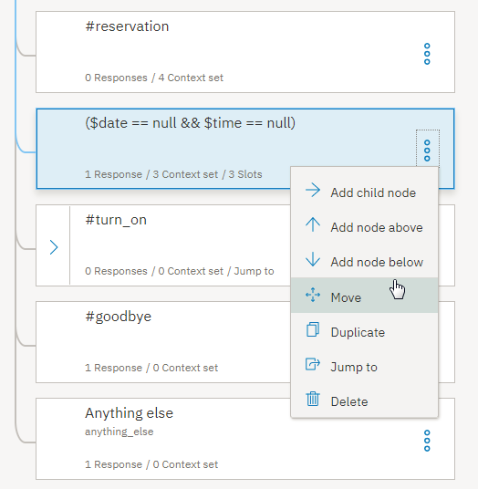

---

copyright:
  years: 2015, 2019
lastupdated: "2019-02-21"

subcollection: assistant

---

{:shortdesc: .shortdesc}
{:new_window: target="_blank"}
{:deprecated: .deprecated}
{:important: .important}
{:note: .note}
{:tip: .tip}
{:pre: .pre}
{:codeblock: .codeblock}
{:screen: .screen}
{:javascript: .ph data-hd-programlang='javascript'}
{:java: .ph data-hd-programlang='java'}
{:python: .ph data-hd-programlang='python'}
{:swift: .ph data-hd-programlang='swift'}

# Guía de aprendizaje: Mejora de un nodo con ranuras
{: #tutorial-slots-complex}

En esta guía de aprendizaje, se mejorará un nodo simple con ranuras que recopilan la información necesaria para realizar una reserva para un restaurante.
{: shortdesc}

## Objetivos del aprendizaje
{: #tutorial-slots-complex-objectives}

Cuando termine la guía de aprendizaje, habrá aprendido a:

- Probar un nodo con ranuras
- Añadir condiciones de ranura para tratar las interacciones de usuario más comunes
- Anticipar y tratar una entrada de usuario no relacionada
- Manejar respuestas de usuario no esperadas

### Duración
{: #tutorial-slots-complex-duration}

Le llevará entre 2 y 3 horas completar esta guía de aprendizaje.

### Requisito previo
{: #tutorial-slots-complex-prereqs}

Antes de empezar, complete [Adición de un nodo con ranuras a un diálogo](/docs/services/assistant?topic=assistant-tutorial-slots). Debe completar la primera guía de aprendizaje sobre las ranuras antes de empezar con esta guía puesto que se basará en el nodo con ranuras creado en esta primera guía de aprendizaje.

## Paso 1: Mejorar el formato de las respuestas
{: #tutorial-slots-complex-fix-format}

Cuando se guardan los valores de entidad de fecha y hora, se convierten en un formato estandarizado. Este formato estandarizado es útil para realizar cálculos sobre los valores, sin embargo, es posible que no desee exponer este formato a los usuarios. En este paso, reformateará los valores de fecha (`2017-12-29`) y hora (`17:00:00`) a los que el diálogo hace referencia.

1.  Para reformatear el valor de la variable de contexto $date, pulse el icono **Editar respuesta**  para la ranura de @sys-date.

1.  En el menú **Más** , seleccione **Abrir editor JSON** y luego edite el JSON que define la variable de contexto. Añada un método que reformatee la fecha de forma que la convierta desde el valor `2017-12-29` a un día completo de la semana, seguido por el día y el mes completo. Edite el JSON de la siguiente manera:

    ```json
    {
      "context": {
        "date": "<? @sys-date.reformatDateTime('EEEE, MMMM d') ?>"
      }
    }
    ```
    {: codeblock}

    La máscara EEEE indica que desea utilizar el día completo de la semana. Si utiliza 3 E (EEE), se abrevia el día de la semana, por ejemplo, a Fri (Vié) en lugar de Friday (Viernes). La máscara MMMM indica que desea utilizar el día completo del mes. Una vez más, si utiliza solo 3 M (MMM), el mes se abrevia, por ejemplo, a Dec en lugar de Diciembre.

1.  Pulse **Guardar**.

1.  Para cambiar el formato en el que se almacena el valor de la hora en la variable de contexto $time para utilizar la hora, los minutos e indicar AM o PM, pulse el icono **Editar respuesta**  para la ranura @sys-time.

1.  En el menú **Más** , seleccione **Abrir editor JSON** y, a continuación, edite el JSON que define la variable de contexto para que indique:

    ```json
    {
      "context": {
        "time": "<? @sys-time.reformatDateTime('h:mm a') ?>"
      }
    }
    ```
    {: codeblock}

1.  Pulse **Guardar**.

1.  Pruebe el nodo de nuevo. Abra el panel "Pruébelo", y pulse **Borrar** para suprimir los valores de las variables de contexto de la ranura que especificó con anterioridad al probar el nodo con ranuras. Para ver el efecto de los cambios realizados, utilice el siguiente script:

    <table>
    <caption>Detalles de script</caption>
    <tr>
      <th>Interlocutor</th>
      <th>Expresión</th>
    </tr>
    <tr>
      <td>Usted</td>
      <td>I want to make a reservation (Quiero realizar una reserva)</td>
    </tr>
    <tr>
      <td>Watson</td>
      <td>What day would you like to come in? (¿Qué día le gustaría venir?)</td>
    </tr>
    <tr>
      <td>Usted</td>
      <td>Friday (Viernes)</td>
    </tr>
    <tr>
      <td>Watson</td>
      <td>What time do you want the reservation to be made for? (¿A qué hora desea realizar la reserva?)</td>
    </tr>
    <tr>
      <td>Usted</td>
      <td>5pm (17h)</td>
    </tr>
    <tr>
      <td>Watson</td>
      <td>How many people will be dining? (¿Cuántas personas vendrán?)</td>
    </tr>
    <tr>
      <td>Usted</td>
      <td>6</td>
    </tr>
    </table>

    En esta ocasión Watson responde con, `OK. I am making you a reservation for 6 on Friday, December 29 at 5:00 PM. (De acuerdo. Estoy haciendo una reserva para 6 personas el viernes 29 de diciembre a las 17:00 h.).`

Ha mejorado satisfactoriamente el formato que el diálogo utiliza cuando se hace referencia a valores de variables de contexto en sus respuestas. El diálogo ahora utiliza `Friday, December 29` (viernes, 29 de diciembre) en lugar del formato más técnico, `2017-12-29`. Y utiliza `5:00 PM` (17 h) en lugar de `17:00:00`. Para obtener más información sobre los métodos SpEL que puede utilizar con los valores de fecha y hora, consulte [Métodos para procesar valores](/docs/services/assistant?topic=assistant-dialog-methods#dialog-methods-date-time).

## Paso 2: Solicitar toda la información a la vez
{: #tutorial-slots-complex-ask-for-everything}

Ahora que ha probado el diálogo más de una vez, puede haber observado que puede ser molesto tener que responder las solicitudes de ranura una a una. Para evitar que los usuarios tengan que proporcionar un elemento de información cada vez, puede solicitar a la vez todos estos elementos que necesita. Hacerlo ofrece al usuario una oportunidad de proporcionar toda la información o parte de ella, en una única entrada.

El nodo con ranuras está diseñado para encontrar y guardar todos los valores de ranura que el usuario proporciona mientras se procesa el nodo actual. Ayude a los usuarios a sacar partido del diseño haciéndoles saber los valores que pueden especificar.

En este paso, aprenderá a solicitar toda la información al mismo tiempo.

1.  En el nodo principal con ranuras, pulse **Personalizar**.

1.  Seleccione el recuadro de selección **Solicitar todo** para habilitar la solicitud inicial y, a continuación, pulse **Aplicar**.

   

1.  De nuevo en la vista de edición, desplácese hacia abajo en el campo recién añadido **Si no hay ranuras cumplimentadas de forma previa, solicitar esto primero**. Añada la siguiente solicitud inicial para el nodo, `I can make a reservation for you. Just tell me the day and time of the reservation, and how many people it is for.` (Puedo hacer una reserva en su nombre. Tan solo dígame el día y la hora de la reserva así como el número de personas para la misma.).

1.  Pulse  para cerrar la vista de edición del nodo.

1.  Pruebe este cambio en el panel "Pruébelo". Abra el panel y, a continuación, pulse **Borrar** para anular los valores de las variables de contexto de la ranura de la prueba anterior.

1.  Especifique `i'd like to make a reservation.` (me gustaría hacer una reserva.).

    El diálogo responde con, `I can make a reservation for you. Just tell me the day and time of the reservation, and how many people it is for.` (Puedo hacer una reserva en su nombre. Tan solo dígame el día y la hora de la reserva así como el número de personas para la misma.).

1.  Especifique, `it's for Saturday. There will be 2 of us coming in at 8pm` (es para el sábado. Vendremos 2 a las 20 h.).

    El diálogo responde con, `OK. I am making you a reservation for 2 on Saturday at 8:00 PM.` (De acuerdo. Estoy haciendo una reserva para 2 personas el sábado a las 20 h.).

    

Si el usuario proporciona cualquiera de los valores de ranura en su entrada inicial, no se visualiza la solicitud que solicita todo. Por ejemplo, la entrada inicial del usuario podría ser, `I want to make a reservation for this Friday night.` (Deseo hacer una reserva para este viernes por la noche). En este caso, la solicitud inicial se omite porque no desea solicitar información que el usuario ya ha proporcionado, la fecha (`Friday` (Viernes)), en este ejemplo. En su lugar, el diálogo muestra la solicitud para la siguiente ranura vacía.
{: note}

## Paso 3: Tratar los ceros correctamente
{: #tutorial-slots-complex-recognize-zero}

Si utiliza la entidad del sistema `sys-number` en una condición de ranura, no maneja correctamente los ceros. En lugar de establecer la variable de contexto que define para la ranura en 0, el servicio establecer la variable de contexto en false. Como resultado, la ranura no cree que esté completo y solicita una y otra vez un número al usuario hasta que este especifica un número distinto de cero.

1.  Pruebe el nodo para comprender mejor el problema. Abra el panel "Pruébelo", y pulse **Borrar** para suprimir los valores de las variables de contexto de la ranura que especificó con anterioridad al probar el nodo con ranuras. Utilice el siguiente script:

    <table>
    <caption>Detalles de script</caption>
    <tr>
      <th>Interlocutor</th>
      <th>Expresión</th>
    </tr>
    <tr>
      <td>Usted</td>
      <td>i want to make a reservation (quiero realizar una reserva)</td>
    </tr>
    <tr>
      <td>Watson</td>
      <td>I can make a reservation for you. Just tell me the day and time of the reservation, and how many people it is for. (Puedo hacer una reserva en su nombre. Tan solo dígame el día y la hora de la reserva así como el número de personas para la misma.).</td>
    </tr>
    <tr>
      <td>Usted</td>
      <td>We want to dine May 23 at 8pm. (Queremos cenar el 23 de mayo a las 20:00.) There will be 0 guests. (Seremos 0 comensales.)</td>
    </tr>
    <tr>
      <td>Watson</td>
      <td>How many people will be dining? (¿Cuántas personas vendrán?)</td>
    </tr>
    <tr>
      <td>Usted</td>
      <td>0</td>
    </tr>
    <tr>
      <td>Watson</td>
      <td>How many people will be dining? (¿Cuántas personas vendrán?)</td>
    </tr>
    </table>

    Quedará atrapado en este bucle hasta que especifique un número distinto de 0.

1.  Para garantizar que la ranura trate los ceros correctamente, cambie la condición de ranura `@sys-number` por `@sys-number || @sys-number:0`.

1.  Pulse el icono **Editar respuesta**  correspndiente a la ranura.

1.  Cuando se crea la variable de contexto, esta utiliza automáticamente la misma expresión que se ha especificado para la condición de ranura. Sin embargo, la variable de contexto solo debe guardar un número. Edite el valor que se ha guardado como variable de contexto para eliminar de la misma el operador `OR`. En el menú **Más** , seleccione **Abrir editor JSON** y luego edite el JSON que define la variable de contexto. Modifique la variable `"guests":"@sys-number || @sys-number:0"` para que utilice la siguiente sintaxis:

    ```json
    {
      "context": {
        "guests": "@sys-number"
      }
    }
    ```
    {: codeblock}

1.  Pulse **Guardar**.

1.  Pruebe el nodo de nuevo. Abra el panel "Pruébelo", y pulse **Borrar** para suprimir los valores de las variables de contexto de la ranura que especificó con anterioridad al probar el nodo con ranuras. Para ver el efecto de los cambios realizados, utilice el siguiente script:

    <table>
    <caption>Detalles de script</caption>
    <tr>
      <th>Interlocutor</th>
      <th>Expresión</th>
    </tr>
    <tr>
      <td>Usted</td>
      <td>i want to make a reservation (quiero realizar una reserva)</td>
    </tr>
    <tr>
      <td>Watson</td>
      <td>I can make a reservation for you. Just tell me the day and time of the reservation, and how many people it is for. (Puedo hacer una reserva en su nombre. Tan solo dígame el día y la hora de la reserva así como el número de personas para la misma.).</td>
    </tr>
    <tr>
      <td>Usted</td>
      <td>We want to dine May 23 at 8pm. (Queremos cenar el 23 de mayo a las 20:00.) There will be 0 guests. (Seremos 0 comensales.)</td>
    </tr>
    </table>

    En esta ocasión Watson responde con, `OK. I am making you a reservation for 0 on Wednesday, May 23 at 8:00 PM. (De acuerdo. Estoy haciendo una reserva para 0 personas el miércoles 23 de mayo a las 20:00.)`

Ha formateado correctamente la ranura de número para que trate los ceros correctamente. Por supuesto, es posible que no desee que el nodo acepte un cero como un número válido de comensales. En el paso siguiente se muestra cómo validar los valores especificados por los usuarios.

## Paso 4: Validar la entrada del usuario
{: #tutorial-slots-complex-slot-conditions}

Hasta ahora, hemos supuesto que el usuario proporcionará los tipos de valor adecuados para las ranuras. Esto no siempre es así en realidad. Puede considerar algunas veces que los usuarios proporcionarán un valor válido y para ello añadirá respuestas condicionales a las ranuras. En este paso, utilizará las respuestas condicionales ranura para realizar las tareas siguientes:

- Asegurarse de que la fecha solicitada no está en el pasado.
- Comprobar si una hora para la reserva solicitada está dentro de la ventana temporal de realización de reservas.
- Confirmar la entrada del usuario.
- Asegurarse de que el número de comensales proporcionado es mayor que cero.
- Indicar que está sustituyendo un valor por otro.

Para validar la entrada del usuario, siga estos pasos:

1.  Desde la vista de edición del nodo con ranuras, pulse el icono **Editar ranura**  para la ranura de `@sys-date`.

1.  Desde el menú **Opciones** , en la cabecera de *Configurar ranura 1*, seleccione **Habilitar respuestas condicionales**.

1.  En la sección **Encontrado**, añada una respuesta condicional pulsando el icono **Editar respuesta** .

1.  Añada la siguiente condición y respuesta para comprobar si la fecha que el usuario especifica es anterior a la fecha actual:

    <table>
    <caption>Detalles de la respuesta 1 condicional de la ranura 1</caption>
    <tr>
      <th>Condición</th>
      <th>Respuesta</th>
      <th>Acción</th>
    </tr>
    <tr>
      <td>`@sys-date.before(now())`</td>
      <td>You cannot make a reservation for a day in the past. (No puede realizar una reserva anterior a la fecha actual.).</td>
      <td>Borrar la ranura y realizar la solicitud de nuevo</td>
    </tr>
    </table>

1.  Añada una segunda respuesta condicional que se visualiza si el usuario proporciona una fecha válida. Este tipo de confirmación simple permite al usuario saber que su respuesta ha sido entendida.

    <table>
    <caption>Detalles de la respuesta 2 condicional de la ranura 1</caption>
    <tr>
      <th>Condición</th>
      <th>Respuesta</th>
      <th>Acción</th>
    </tr>
    <tr>
      <td>`true`</td>
      <td>$date it is ($date es)</td>
      <td>Continuar</td>
    </tr>
    </table>

1.  Desde la vista de edición del nodo con ranuras, pulse el icono **Editar ranura**  para la ranura de `@sys-time`.

1.  Desde el menú **Opciones**  en la cabecera de *Configurar ranura 2*, seleccione **Habilitar respuestas condicionales**.

1.  En la sección **Encontrado**, añada una respuesta condicional pulsando el icono **Editar respuesta** .

1.  Añada los siguientes condiciones y respuestas para comprobar si la hora que ha especificado el usuario está dentro de la ventana temporal permitida:

    <table>
    <caption>Detalles de la respuesta condicional de la ranura 2</caption>
    <tr>
      <th>Condición</th>
      <th>Respuesta</th>
      <th>Acción</th>
    </tr>
    <tr>
      <td>`@sys-time.after('21:00:00')`</td>
      <td>Our last seating is at 9 PM. (Nuestra última reserva es a las 21 h).</td>
      <td>Borrar la ranura y realizar la solicitud de nuevo</td>
    </tr>
    <tr>
      <td>`@sys-time.before('09:00:00')`</td>
      <td>Our first seating is at 9 AM. (Nuestra primera reserva es a las 9 h.).</td>
      <td>Borrar la ranura y realizar la solicitud de nuevo</td>
    </tr>
    </table>

1.  Añada una tercera respuesta condicional que se visualiza si el usuario proporciona una hora válida dentro de la ventana temporal. Este tipo de confirmación simple permite al usuario saber que su respuesta ha sido entendida.

    <table>
    <caption>Detalles de la respuesta condicional 3 de la ranura 2</caption>
    <tr>
      <th>Condición</th>
      <th>Respuesta</th>
      <th>Acción</th>
    </tr>
    <tr>
      <td>`true`</td>
      <td>Ok, the reservation is for $time. (De acuerdo, la reserva es a las $time.).</td>
      <td>Continuar</td>
    </tr>
    </table>

1.  Edite la ranura de @sys-number para validar el valor proporcionado por el usuario de las formas siguientes:

    - Compruebe que el número de comensales es mayor que cero.
    - Anticípese y soluciones el caso en el que el usuario cambia el número de comensales.

      Si, en un punto cualquiera del nodo cuando se están procesando las ranuras, el usuario cambia un valor de ranura, se actualiza el correspondiente valor de variable de contexto de ranura. Sin embargo, puede ser útil hacer saber al usuario que se está sustituyendo el valor, tanto para proporcionar una mejor retroalimentación para el usuario como para dar al usuario la posibilidad de cambiar lo que no tenía previsto. 

1.  Desde la vista de edición del nodo con ranuras, pulse el icono **Editar ranura**  para la ranura de `@sys-number`.

1.  Desde el menú **Opciones**  en la cabecera de *Configurar ranura 3*, seleccione **Habilitar respuestas condicionales**.

1.  En la sección **Encontrado**, añada una respuesta condicional pulsando el icono  y, a continuación, añada la siguiente condición y respuesta:

    <table>
    <caption>Detalles de la respuesta condicional de la ranura 3</caption>
    <tr>
      <th>Condición</th>
      <th>Respuesta</th>
      <th>Acción</th>
    </tr>
    <tr>
      <td>`entities['sys-number']?.value == 0`</td>
      <td>Please specify a number that is larger than 0 (Especifique un número mayor que cero).</td>
      <td>Borrar la ranura y realizar la solicitud de nuevo</td>
    </tr>
    <tr>
      <td>`(event.previous_value != null) && (event.previous_value != event.current_value)`</td>
      <td>Ok, updating the number of guests from `<? event.previous_value ?>` to `<? event.current_value ?>` (De acuerdo, actualizando el número de comensales de `<? event.previous_value ?>` a `<? event.current_value ?>`).</td>
      <td>Continuar</td>
    </tr>
    <tr>
      <td>`true`</td>
      <td>Ok. The reservation is for $guests guests. (De acuerdo. La reserva es para $guests comensales.).</td>
      <td>Continuar</td>
    </tr>
    </table>

## Paso 5: Añadir una ranura de confirmación
{: #tutorial-slots-complex-confirmation-slot}

Puede que desee diseñar el diálogo para llamar a un sistema de reservas externo y realmente realizar una reserva para el usuario en el sistema. Antes de que su aplicación pueda hacerlo, probablemente desee confirmar con el usuario que el diálogo ha entendido correctamente los detalles de la reserva. Puede hacer esto añadiendo una ranura de confirmación al nodo.

1.  La ranura de confirmación esperará una respuesta Sí o No del usuario. En primer lugar, debe enseñar al diálogo a reconocer una intención de Sí o No en la entrada del usuario.

1.  Pulse el separador **Intenciones** para volver a la página de Intenciones. Añada las siguientes intenciones y expresiones de ejemplo.

- `#yes`

   ```json
   Yes
   Sure
   I'd like that
   Please do
   Yes please.
   Ok
   That sounds good.
   ```
   {: screen}

   

- `#no`

   ```json
   No
   No thanks.
   Please don't.
   Please do not!
   That's not what I want at all
   Absolutely not.
   No way
   ```
   {: screen}

   

1.  Vuelva al separador **Diálogo** y, a continuación, pulse para editar el nodo con ranuras. Pulse **Añadir ranura** para añadir una cuarta ranura y, a continuación, especifique los siguientes valores para dicha ranura:

    <table>
    <caption>Detalles de la ranura de confirmación</caption>
    <tr>
      <th>Comprobar</th>
      <th>Guardar como</th>
      <th>Si no está presente, preguntar</th>
    </tr>
    <tr>
      <td>`(#yes || #no) && slot_in_focus`</td>
      <td>$confirmation</td>
      <td>I'm going to reserve you a table for $guests on $date at $time. Should I go ahead? (Voy a pedirle una pizza `$size` para las `$time`. ¿Continúo?).</td>
    </tr>
    </table>

    Esta condición comprueba ambas respuestas. Especificará qué ocurre a continuación dependiendo de si la respuesta es Sí o No utilizando respuestas de ranura condicional. La propiedad `slot_in_focus` fuerza que el ámbito de la condición se aplique únicamente a la ranura actual. Este valor impide que sentencias aleatorias que coincidiesen con relación a las intenciones `#yes` o `#no` que pudiese realizar el usuario desencadenasen esta ranura.

    Por ejemplo, el usuario puede responder al número de ranura de comensales, y decir algo, como `Yes, there will be 5 of us.` (Sí, seremos 5). No quiere que el `Yes` (Sí) que se incluye en esta respuesta cumplimente de forma accidental la ranura de confirmación. Al añadir la propiedad `slot_in_focus` a la condición, un sí o no que indique el usuario únicamente se aplica a esta ranura cuando el usuario está respondiendo a la solicitud específica de esta ranura.

1.  Pulse el icono **Editar ranura** . Desde el menú **Opciones**  en la cabecera de *Configurar ranura 4*, seleccione **Habilitar respuestas condicionales**.

1.  En la solicitud de **Encontrado**, añada una condición que compruebe una respuesta del estilo No (`#no`). Utilice la respuesta, `Alright. Let's start over. I'll try to keep up this time.` (De acuerdo. Empecemos de nuevo. Intentaré hacerlo esta vez). De lo contrario, puede suponer que el usuario confirmó los detalles de la reserva y continuar con la reserva.

    Cuando se encuentre la intención `#no`, también debe restablecer las variables de contexto que se han guardado con anterioridad en un valor nulo, de forma que pueda solicitar la información de nuevo. Los valores de las variables de contexto se pueden restablecer con el editor JSON. Pulse el icono **Editar respuesta**  para la respuesta condicional que acaba de añadir. Desde el menú **Opciones** , pulse **Abrir editor JSON**. Añada un bloque `context` que establece las variables de contexto en `null`, tal como se muestra a continuación.

    ```json
    {
      "output":{
        "text": {
          "values": [
            "Alright. Let's start over. I'll try to keep up this time."
          ]
        }
      },
  "context":{
        "date": null,
        "time": null,
        "guests": null
      }
    }
    ```
    {: codeblock}

1.  Pulse **Atrás** y, a continuación, pulse **Guardar**.

1.  Pulse de nuevo el icono **Editar ranura**  para la ranura de confirmación. En la solicitud **No encontrado**, deje claro que está buscando una respuesta del estilo Sí o No. Añada una respuesta con los valores siguientes.

    <table>
    <caption>Detalles de respuesta de No encontrado</caption>
    <tr>
      <th>Condición</th>
      <th>Respuesta</th>
    </tr>
    <tr>
      <td>`true`</td>
      <td>Respond with Yes to indicate that you want the reservation to be made as-is, or No to indicate that you do not. (Responda con Sí para indicar que desea realizar la reserva tal como está, o No para indicar que no la desea realizar).</td>
    </tr>
    </table>

1.  Pulse **Guardar**.

1.  Ahora que tiene las respuestas de confirmación para los valores de ranura, y que puede preguntar todo al mismo tiempo, es posible que observe que las respuestas de ranura individuales se visualizan antes de que se visualice la respuesta de la ranura de confirmación, lo puede parecer repetitivo a los usuarios. Edite la ranura de respuestas de Encontrado para evitar que se muestren en determinadas condiciones.

1.  Sustituya la condición `true` que se especificó en el fragmento de JSON para la última respuesta condicional en la ranura de @sys-date con `!($time && $guests)`. Por ejemplo:

    <table>
    <caption>Detalles de la respuesta 2 condicional de la ranura 1</caption>
    <tr>
      <th>Condición</th>
      <th>Respuesta</th>
      <th>Acción</th>
    </tr>
    <tr>
      <td>`!($time && $guests)`</td>
      <td>$date it is ($date es)</td>
      <td>Continuar</td>
    </tr>
    </table>

1.  Sustituya la condición `true` que se especificó en el fragmento de JSON para la última respuesta condicional en la ranura de @sys-time con `!($date && $guests)`. Por ejemplo:

    <table>
    <caption>Detalles de la respuesta condicional 3 de la ranura 2</caption>
    <tr>
      <th>Condición</th>
      <th>Respuesta</th>
      <th>Acción</th>
    </tr>
    <tr>
      <td>`!($date && $guests)`</td>
      <td>Ok, the reservation is for $time. (De acuerdo, la reserva es a las $time.).</td>
      <td>Continuar</td>
    </tr>
    </table>

1.  Sustituya la condición `true` que se especificó en el fragmento de JSON para la última respuesta condicional en la ranura de @sys-number con `!($date && $time)`. Por ejemplo:

    <table>
    <caption>Detalles de la respuesta 2 condicional de la ranura 3</caption>
    <tr>
      <th>Condición</th>
      <th>Respuesta</th>
      <th>Acción</th>
    </tr>
    <tr>
      <td>`!($date && $time)`</td>
      <td>Ok. The reservation is for $guests guests. (De acuerdo. La reserva es para $guests comensales.).</td>
      <td>Continuar</td>
    </tr>
    </table>

Si añade más tarde ranuras, debe editar estas condiciones para tener en cuenta las variables de contexto asociadas a las ranuras adicionales. Si no incluye una ranura de confirmación, puede especificar solo `!all_slots_filled`, lo que sería válido independientemente del número de ranuras que añadiese más tarde.

## Paso 6: Restablecer los valores de las variables de contexto de ranura
{: #tutorial-slots-complex-reset-variables}

Es posible que haya observado que antes de cada prueba, debe borrar los valores de las variables de contexto que se crearon durante la prueba anterior. Esto es necesario hacerlo porque el nodo con ranuras solo pregunta a los usuarios la información que considera que falta. Si todas las variables de contexto de ranura se cumplimentan con valores válidos, no se realiza solicitud alguna. Lo mismo ocurre para el diálogo en tiempo de ejecución. Debe crear en el diálogo un mecanismo por el que pueda restablecer las variables de contexto de ranura en un valor nulo de forma que el siguiente usuario las pueda cumplimentar de nuevo. Para ello, añadiremos un nodo padre al nodo con ranuras que establezca las variables de contexto en un valor nulo.

1.  Desde la vista del árbol del diálogo, pulse el icono **Más**  en el nodo con ranuras y, a continuación, seleccione **Añadir nodo por encima**.

1.  Especifique `#reservation` como la condición para el nuevo nodo. (Esta es la misma condición que la utilizada por el nodo con ranuras, sin embargo, cambiará la condición del nodo con ranuras más tarde en este procedimiento).

1.  Pulse el icono **Opciones**  junto a la respuesta del nodo y, a continuación, pulse **Abrir editor JSON**. Añada una entrada para cada variable de contexto de ranura definida en el nodo con ranuras, y establézcalas con un valor `null`.

    ```json
    {
      "context": {
        "date": null,
        "time": null,
        "guests": null,
        "confirmation": null
      },
      "output": {}
    }
    ```
    {: codeblock}

    

1.  Pulse para editar el otro nodo #reservation, el creado con anterioridad y donde se añadieron las ranuras.

1.  Cambie la condición del nodo de `#reservation` a `($date == null && $time == null)` y, a continuación, cierre la vista de edición del nodo pulsando .

1.  Pulse el icono **Más**  en el nodo con ranuras y, a continuación, seleccione **Mover**.

    

1.  Seleccione el nodo `#reservation` como destino de la ubicación a la que moverse y, a continuación, elija **Como nodo hijo** en el menú.

1.  Pulse para editar el nodo `#reservation`. En la sección *Y finalmente*, cambie la acción de *Esperar una entrada de usuario* a **Saltar entrada de usuario**.

    

    Cuando una entrada de usuario coincide con la intención `#reservation`, se activa este nodo. Todas las variables de contexto de la ranura se establecen con un valor nulo, y luego el diálogo salta directamente al nodo con ranuras para procesarlo.

## Paso 7: Proporcionar a los usuarios una forma de salir del proceso
{: #tutorial-slots-complex-handler}

La adición de un nodo con ranuras es un mecanismo poderoso porque mantiene en su curso a los usuarios proporcionando la información necesaria para obtener una respuesta útil o realizar una acción en su nombre. Sin embargo, puede haber ocasiones en las que un usuario esté proporcionando detalles de la reserva, y al final decida no continuar. Se debe proporcionar a los usuarios una forma de salir del proceso de forma adecuada. Puede hacerlo añadiendo un manejador de ranura que detecte el deseo de un usuario de salir del proceso, y salir del nodo sin guardar ninguno de los valores recopilados.

1.  En primer lugar, debe enseñar al diálogo a reconocer una intención #exit en la entrada del usuario.

1.  Pulse el separador **Intenciones** para volver a la página de Intenciones. Añada la intención #exit con las siguientes expresiones de ejemplo.

    ```json
    I want to stop
    Exit!
    Cancel this process
    I changed my mind. I don't want to make a reservation.
    Stop the reservation
    Wait, cancel this.
    Nevermind.
    ```
    {: screen}

    

1.  Vuelva al diálogo pulsando el separador **Diálogo**. Pulse para abrir el nodo con ranuras y, a continuación, pulse **Gestionar manejadores**.

    

1.  Añada los siguientes valores a los campos.

    <table>
    <caption>Detalles de manejador a nivel de nodo</caption>
    <tr>
      <th>Condición</th>
      <th>Respuesta</th>
      <th>Acción</th>
    </tr>
    <tr>
      <td>`#exit`</td>
      <td>Ok, we'll stop there. No reservation will be made. (De acuerdo, acabaremos aquí. No se realizará ninguna reserva.).</td>
      <td>Saltar a respuesta</td>
    </tr>
    </table>

    La acción **Saltar a respuesta** salta directamente a la respuesta a nivel de nodo sin visualizar las solicitudes asociadas con cualquiera del resto de las ranuras sin cumplimentar.

1.  Pulse **Atrás** y, a continuación, pulse **Guardar**.

1.  Ahora, necesitará editar la respuesta a nivel de nodo para que se reconozca cuándo un usuario desea salir del proceso en lugar de realizar una reserva. Añada una respuesta condicional al nodo.

    En la vista de edición del nodo con ranuras, pulse **Personalizar**, pulse el conmutador de **Varias respuestas** para **activarlo** y, a continuación, pulse **Aplicar**.

    

1.  Desplácese hacia abajo a la sección de la respuesta para el nodo con ranuras y, a continuación, pulse **Añadir respuesta**.

1.  Añada los siguientes valores a los campos.

    <table>
    <caption>Detalles de respuesta condicional a nivel de nodo</caption>
    <tr>
      <th>Condición</th>
      <th>Respuesta</th>
    </tr>
    <tr>
      <td>`has_skipped_slots`</td>
      <td>I look forward to helping you with your next reservation. Have a good day. (Espero ayudarle en una próxima reserva. Espero que tenga un buen día.).</td>
    </tr>
    </table>

    La condición `has_skipped_slots` comprueba las propiedades de los nodos de ranura para ver si se ha saltado alguno de los nodos. El manejador `#exit` salta el resto de las ranuras para ir directamente a la respuesta de nodo. Por ello, cuando la propiedad `has_skipped_slots` está presente, sabrá que se ha desencadenado la intención `#exit` por lo que el diálogo podrá visualizar una respuesta alternativa.

    Si configura más de una ranura para saltar otras ranuras, o si configura otro manejador de sucesos de nivel de nodo para saltar las ranuras, debe utilizar otra aproximación para comprobar si se ha activado la intención #exit. Consulte [Manejo de solicitudes para salir de un proceso](/docs/services/assistant?topic=assistant-dialog-slots#dialog-slots-node-level-handler) para conocer una forma distinta de hacerlo.
    {: note}

1.  Desea que el servicio compruebe la propiedad `has_skipped_slots` antes de visualizar la respuesta a nivel de nodo estándar. Mueva hacia arriba la respuesta condicional `has_skipped_slots` de forma que se procese antes que la respuesta condicional original o nunca se activará. Para ello, pulse en la respuesta que acaba de añadir, utilice la **flecha hacia arriba** para moverla y, a continuación, pulse **Guardar**.

1.  Pruebe este cambio utilizando el siguiente script en el panel "Pruébelo".

    <table>
    <caption>Detalles de script</caption>
    <tr>
      <th>Interlocutor</th>
      <th>Expresión</th>
    </tr>
    <tr>
      <td>Usted</td>
      <td>i want to make a reservation (quiero realizar una reserva)</td>
    </tr>
    <tr>
      <td>Watson</td>
      <td>I can make a reservation for you. Just tell me the day and time of the reservation, and how many people it is for. (Puedo hacer una reserva en su nombre. Tan solo dígame el día y la hora de la reserva así como el número de personas para la misma.).</td>
    </tr>
    <tr>
      <td>Usted</td>
      <td>it's for 5 people (es para 5 personas)</td>
    </tr>
    <tr>
      <td>Watson</td>
      <td>Ok. The reservation is for 5 guests.  What day would you like to come in? (¿Qué día le gustaría venir?)</td>
    </tr>
    <tr>
      <td>Usted</td>
      <td>Nevermind (No importa)</td>
    </tr>
    <tr>
      <td>Watson</td>
      <td>Ok, we'll stop there. No reservation will be made.  I look forward to helping you with your next reservation. Have a good day. (Espero ayudarle en una próxima reserva. Espero que tenga un buen día.).</td>
    </tr>
    </table>

## Paso 8: Aplicar un valor válido si el usuario no proporciona uno después de varios intentos

En algunos casos, un usuario podría malinterpretar lo que está preguntando. Podría responder una y otra vez con el tipo equivocado de valores. Para planificar esta posibilidad, puede añadir un contador a la ranura, y tras 3 intentos fallidos por el usuario para proporcionar un valor válido, puede aplicar un valor para la ranura en nombre del usuario y avanzar.

Para la información de $time, definirá una sentencia de seguimiento que se mostrará cuando el usuario no proporcione una hora válida.

1.  Cree una variable de contexto que mantenga un seguimiento de cuántas veces el usuario ha proporcionado un valor que no coincide con el tipo de valor que la ranura espera. Es necesario inicializar la variable y establecerla en 0 antes de procesar el nodo con las ranuras, de forma que la añadirá al nodo padre `#reservation`.

1.  Pulse para editar el nodo `#reservation`. Abra el editor JSON asociado con la respuesta del nodo, pulsando el icono **Opciones**  en la sección de la respuesta y elija **Abrir editor JSON**. Añada una variable de contexto denominada `counter` al final del bloque existente `"context"`, debajo de la variable `confirmation`. Establezca la variable `counter` igual a `0`.

       ```json
       {
         "context": {
           "date": null,
           "time": null,
           "guests": null,
           "confirmation": null,
           "counter": 0
         },
         "output": {}
       }
       ```
       {: codeblock}

1.  En la vista del árbol, expanda el nodo `#reservation` y, a continuación, pulse editar el nodo con ranuras. 

1.  Pulse el icono **Editar ranura**  para la ranura de `@sys-time`.

1.  Desde el menú **Opciones**  en la cabecera de *Configurar ranura 2*, seleccione **Habilitar respuestas condicionales**.

1.  En la sección de **No encontrado**, añada una respuesta condicional.

    <table>
    <caption>Detalles de respuesta de No encontrado</caption>
    <tr>
      <th>Condición</th>
      <th>Respuesta</th>
    </tr>
    <tr>
      <td>`true`</td>
      <td>Please specify the time that you want to eat. The restaurant seats people between 9AM and 9PM. (Especifique la hora en la que desea comer. El restaurante está abierto entre las 9 de la mañana y las 9 de la noche).</td>
    </tr>
    </table>

1.  Incremente en una unidad la variable `counter` cada vez que se active la respuesta. Recuerde, esta respuesta sólo se activa cuando el usuario no proporciona un valor de hora válido. Pulse el icono **Editar respuesta** .

1.  Pulse el icono **Opciones**  y seleccione **Abrir editor JSON**. Añada la siguiente definición de variable de contexto.

    ```json
    {
      "output": {
        "text": {
          "values": [
            "Please specify the time that you want to eat.
              The restaurant seats people between 9AM and 9PM."
          ]
        }
      },
"context": {
        "counter": "<? context['counter'] + 1 ?>"
      }
    }
    ```
    {: codeblock}

    Esta expresión añade una unidad al contador incremental.

1.  Pulse **Atrás** y, a continuación, pulse **Guardar**.

1.  Vuelva a abrir la ranura de @sys-time pulsando el icono **Editar ranura** .

    Añadirá una segunda respuesta condicional a la sección **No encontrado** que comprobará si el contador es mayor que 1, lo que indicará que el usuario con anterioridad ha proporcionado una respuesta no válida 3 veces. En este caso, el diálogo asignará el valor de hora en nombre del usuario a la hora más habitual, las 20 h. No se preocupe, el usuario tendrá la oportunidad de cambiar el valor de la hora cuando se active la ranura de confirmación. Pulse **Añadir una respuesta**.

1.  Añada la siguiente condición y respuesta.

    <table>
    <caption>Detalles de respuesta de No encontrado</caption>
    <tr>
      <th>Condición</th>
      <th>Respuesta</th>
    </tr>
    <tr>
      <td>`$counter > 1`</td>
      <td>You seem to be having trouble choosing a time. I will make the reservation at 8PM for you. (Parece que tenemos un problema para elegir una hora. Haré en su nombre la reserva a las 20 h.).</td>
    </tr>
    </table>

    Debe establecer la variable $time a las 20 h, para ello, pulse el icono **Editar respuesta** . Seleccione **Abrir editor JSON** y añada la siguiente definición de variable de contexto y, a continuación, pulse **Atrás**.

    ```json
    {
      "output": {
        "text": {
          "values": [
            "You seem to be having trouble choosing a time.
              I will make the reservation at 8 PM for you."
          ]
        }
      },
"context": {
        "time": "<? '20:00:00'.reformatDateTime('h:mm a') ?>"
      }
    }
    ```
    {: codeblock}

1.  La respuesta condicional que acaba de añadir tiene una condición más precisa que la condición true utilizada por la primera respuesta condicional. Debe mover esta respuesta hasta que aparezca antes de la respuesta original o nunca se activará. Pulse la respuesta que acaba de añadir, y utilice las flechas para moverla y, a continuación, pulse **Guardar**.

1.  Pruebe los cambios utilizando el siguiente script.

| Interlocutor | Expresión |
|---------|-----------|
| Usted     | i want to make a reservation (quiero realizar una reserva) |
| Watson  | I can make a reservation for you. Just tell me the day and time of the reservation, and how many people it is for. (Puedo hacer una reserva en su nombre. Tan solo dígame el día y la hora de la reserva así como el número de personas para la misma.). |
| Usted     | tomorrow (mañana) |
| Watson  | Friday, December 29 it is.  What time do you want the reservation to be made for? (Es el viernes 29 de diciembre. ¿A qué hora desea realizar la reserva?) |
| Usted     | orange (naranja) |
| Watson  | Please specify the time that you want to eat. The restaurant seats people between 9AM and 9PM. (Especifique la hora en la que desea comer. El restaurante está abierto entre las 9 de la mañana y las 9 de la noche). |
| Usted     | pink (rosa) |
| Watson  | Please specify the time that you want to eat. The restaurant seats people between 9AM and 9PM. (Especifique la hora en la que desea comer. El restaurante está abierto entre las 9 de la mañana y las 9 de la noche). |
| Usted     | purple (púrpura) |
| Watson  | You seem to be having trouble choosing a time. I will make the reservation at 8PM for you.  How many people will be dining? (Parece que tenemos un problema para elegir una hora. Haré en su nombre la reserva a las 20 h. ¿Cuántas personas vendrán?) |

## Paso 9: Conectarse a un servicio externo
{: #tutorial-slots-complex-action}

Ahora que el diálogo puede recopilar y confirmar los detalles de reserva de un usuario, puede llamar a un servicio externo para realmente reservar una mesa en el sistema mediante un servicio de reservas en línea de restaurantes. Consulte [Cómo realizar llamadas mediante programación desde un nodo de diálogo](/docs/services/assistant?topic=assistant-dialog-actions) para obtener más detalles.

En la lógica que llame al servicio de reservas, asegúrese de comprobar `has_skipped_slots` y no continúe con la reserva si está presente.

### Resumen
{: #tutorial-slots-complex-summary}

En esta guía de aprendizaje se ha probado un nodo con ranuras y se han realizado cambios para optimizar la interactuación con usuarios reales. Para obtener más información sobre este tema, consulte [Obtención de información con ranuras](/docs/services/assistant?topic=assistant-dialog-slots).

## Siguientes pasos
{: #tutorial-slots-complex-deploy}

Para desplegar el conocimiento del diálogo, primero conéctelo con un asistente y luego despliegue el asistente. Lo puede hacer de varias formas. Consulte [Adición de integraciones](/docs/services/assistant?topic=assistant-deploy-integration-add) para obtener más detalles.
