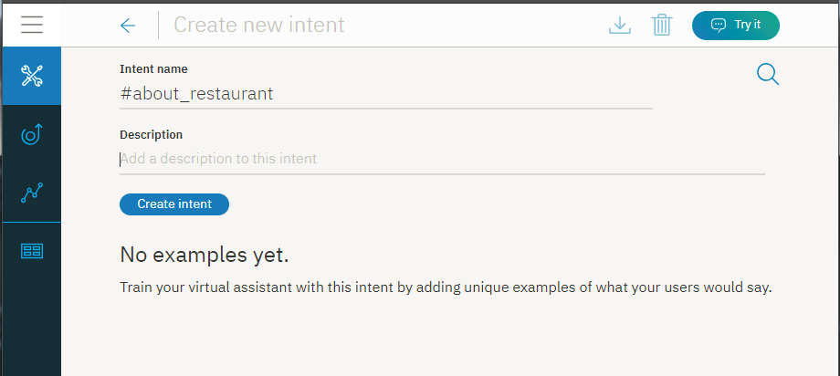
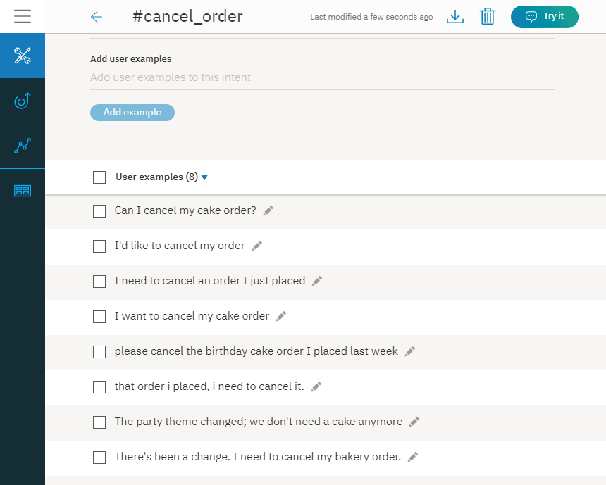
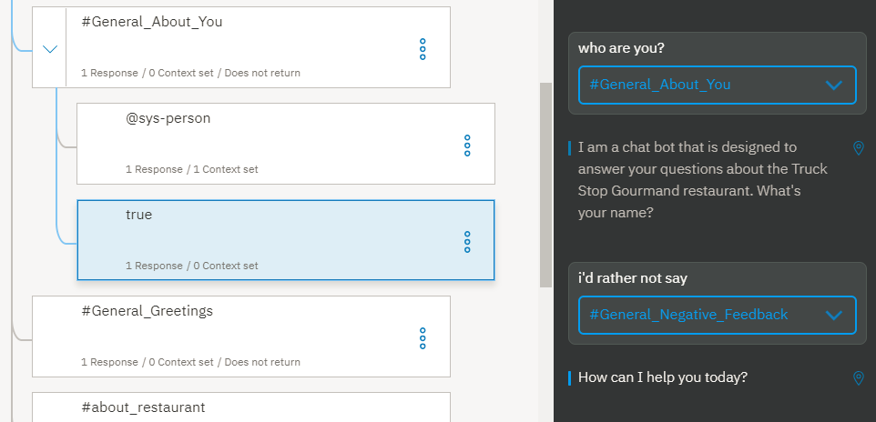

---

copyright:
  years: 2015, 2019
lastupdated: "2019-02-28"

subcollection: assistant

---

{:shortdesc: .shortdesc}
{:new_window: target="_blank"}
{:deprecated: .deprecated}
{:important: .important}
{:note: .note}
{:tip: .tip}
{:pre: .pre}
{:codeblock: .codeblock}
{:screen: .screen}
{:javascript: .ph data-hd-programlang='javascript'}
{:java: .ph data-hd-programlang='java'}
{:python: .ph data-hd-programlang='python'}
{:swift: .ph data-hd-programlang='swift'}
{:gif: data-image-type='gif'}

# Guía de aprendizaje: Creación de un diálogo complejo
{: #tutorial}

En esta guía de aprendizaje, utilizará el servicio {{site.data.keyword.conversationshort}} para crear un diálogo para un asistente que ayuda a los usuarios a responder a consultas sobre un restaurante ficticio llamado *Truck Stop Gourmand*.
{: shortdesc}

## Objetivos del aprendizaje
{: #tutorial-objectives}

Cuando termine la guía de aprendizaje, habrá aprendido a:

- Planificar un diálogo
- Definir intenciones personalizadas
- Añadir nodos de diálogo que puedan manejar las intenciones
- Añadir entidades para hacer que sus respuestas sean más específicas
- Añadir una entidad de patrón y utilizarla en el diálogo para encontrar patrones en la entrada de usuario
- Definir y hacer referencia a variables de contexto

### Duración
{: #tutorial-duration}

Le llevará entre 2 y 3 horas completar esta guía de aprendizaje.

### Requisito previo
{: #tutorial-prereqs}

Antes de empezar, complete la [Guía de aprendizaje de iniciación](/docs/services/assistant?topic=assistant-getting-started).

Utilizará el conocimiento de diálogo que ha creado y añadirá nodos al diálogo simple que ha creado como parte del ejercicio de iniciación.

## Paso 1: Planificar el diálogo
{: #tutorial-plan}

Va a crear un asistente para un restaurante llamado *Truck Stop Gourmand* que tiene una ubicación y un próspero negocio de repostería. Desea que el asistente sencillo responda preguntas sobre el restaurante y su menú y pueda cancelar pedidos de repostería de los clientes. Por lo tanto, tiene que crear intenciones que manejen consultas relacionadas con los siguientes temas:

- Información sobre el restaurante
- Detalles del menú
- Cancelaciones de pedidos

Empezará creando intenciones que representen estos temas y luego creará un diálogo que responda a las preguntas de los usuarios sobre los mismos.

## Paso 2: Responder a las preguntas sobre el restaurante
{: #tutorial-add-about-intent}

Añada una intención que reconozca cuándo los clientes pidan detalles sobre el propio restaurante. Una intención es la finalidad u objetivo expresado en la entrada del usuario. La intención `#General_About_You` que se proporciona con el catálogo de contenido *General*
sirve una función similar, pero sus ejemplos de usuario se centran en consultas sobre el asistente, no sobre la empresa que utiliza el asistente para ayudar a sus clientes. Por lo tanto, añadirá su propia intención.

### Adición de la intención #about_restaurant
{: #tutorial-add-about-restaurant}

1.  En el separador **Intenciones**, pulse **Añadir intención**.

    
1.  Escriba `about_restaurant` en el campo *Nombre de intención* y pulse **Crear intención**.

    
1.  Añada los siguientes ejemplos de usuario:

    ```
    Tell me about the restaurant (Cuénteme algo sobre el restaurante)
    i want to know about you (me gustaría saber algo sobre usted)
    who are the restaurant owners and what is their philosophy? (¿quiénes son los dueños del restaurante y cuál es su filosofía?)
    What's your story? (Explíqueme su historia)
    Where do you source your produce from? (¿Dónde adquiere sus materias primas?)
    Who is your head chef and what is the chef's background? (¿Quién es el chef y cuál es su formación?)
    How many locations do you have? (¿Cuántos establecimientos tienen?)
    do you cater or host functions on site? (¿Atienden clientes en su propio local?)
    Do you deliver? (¿Hacen entregas a domicilio?)
    Are you open for breakfast? (¿Sirven desayunos?)
    ```
    {: screen}

1.  Pulse el icono **Cerrar**  para terminar de añadir la intención `#about_restaurant`.

Ha añadido una intención y ha proporcionado ejemplos de expresiones que los usuarios reales pueden especificar para activar esta intención.

### Adición de un nodo de diálogo que se activa mediante la intención #about_restaurant
{: #tutorial-trigger-about-intent}

Añada un nodo de diálogo que reconozca cuándo la entrada de usuario se correlaciona con la intención que ha creado en el paso anterior, lo que significa que su condición comprueba si el servicio ha reconocido la intención `#about_restaurant` en la entrada del usuario.

1.  Pulse el separador **Diálogos**.
1.  Busque el nodo `#General_Greetings` en el árbol de diálogo.

    Añadirá un nodo que compruebe si hay preguntas sobre el restaurante bajo este nodo de saludo inicial para que refleje el flujo que podría esperar encontrarse en una conversación normal. Por ejemplo, `Hello.` y luego `Tell me about yourself.`

1.  Pulse el icono **More**  en el nodo `#General_Greetings` y seleccione **Añadir nodo debajo**.

    
1.  Empiece por escribir `#about_restaurant` en el campo **Especificar una condición** de este nodo. Luego seleccione la opción `#about_restaurant`.
1.  Añada el texto siguiente como respuesta:

    ```
    Truck Stop Gourmand is the brain child of Gloria and Fred Smith. What started out as a food truck in 2004 has expanded into a thriving restaurant. We now have one brick and mortar restaurant in downtown Portland. The bigger kitchen brought with it new chefs, but each one is faithful to the philosophy that made the Smith food truck so popular to begin with: deliver fresh, local produce in inventive and delicious ways. Join us for lunch or dinner seven days a week. Or order a cake from our bakery.
    ```
    {: codeblock}

1.  También vamos a añadir una imagen a la respuesta.

    Pulse **Añadir tipo de respuesta**. Seleccione **Imagen** en la lista desplegable. En el campo **Origen de imagen**, añada `https://www.ibmlearningcenter.com/wp-content/uploads/2018/02/IBM-Learning-Center-Food4.jpg`.
1.  Suba el tipo de respuesta de imagen para que se muestre en la respuesta antes que el texto. Pulse la flecha **Subir** para reorganizar los dos tipos de respuesta.

    

1.  Pulse  para cerrar la vista de edición.

### Prueba del nodo de diálogo #about_restaurant
{: #tutorial-test-about-intent}

Para probar la intención, compruebe si las expresiones de usuario que son parecidas a los ejemplos que ha añadido a los datos de entrenamiento, pero no exactamente iguales, han enseñado correctamente al servicio a reconocer entradas con una intención `#about_restaurant`.

1.  Pulse el icono  para abrir el panel "Pruébelo".

1.  Escriba `I want to learn more about your restaurant.`

    El servicio indica que se reconoce la intención `#about_restaurant` y devuelve una respuesta con la imagen y el texto que ha especificado para el nodo de diálogo.

    

¡Enhorabuena! Ha añadido una intención personalizada y un nodo de diálogo que sabe cómo manejarla.

La intención `#about_restaurant` está diseñada para reconocer diversas preguntas generales sobre el restaurante. Ha añadido un solo nodo para capturar este tipo de preguntas. La respuesta es larga, pero es una sola sentencia que potencialmente puede responder a todas las preguntas sobre los siguientes temas:

- Los dueños del restaurante
- La historia del restaurante
- La filosofía
- El número de locales
- Los días de apertura
- Las comidas servidas
- El hecho de que el restaurante prepara pasteles para llevar

Para los tipos de preguntas generales fáciles de contestar hay una sola respuesta general disponible.

## Paso 3: Responder a preguntas sobre el menú
{: #tutorial-menu}

Una pregunta lave de los posibles clientes de restaurante es sobre el menú. El restaurante Truck Stop Gourmand cambia el menú a diario. Además de su menú estándar, dispone de menús vegetarianos y menús de la tienda de repostería. Cuando un usuario pregunta sobre el menú, el diálogo tiene que averiguar qué menú debe compartir y luego proporcionar un hiperenlace al menú que se mantiene actualizado diariamente en el sitio web del restaurante. Si esta información cambia con regularidad, no desea codificar la información en un nodo de diálogo.

### Adición de una intención #menu
{: #tutorial-add-menu-intent}

1.  Pulse el separador **Intenciones**.
1.  Pulse **Añadir intención**.

    

1.  Escriba `menu` en el campo *Nombre de intención* y luego pulse **Crear intención**.

    

1.  Añada los siguientes ejemplos de usuario:

    ```
    I want to see a menu (Me gustaría ver el menú)
    What do you have for food? (¿Qué tienen para comer?)
    Are there any specials today? (¿Hay alguna especialidad del día?)
    where can i find out about your cuisine? (¿Dónde puedo encontrar detalles sobre su tipo de cocina?)
    What dishes do you have? (¿Qué platos tienen?)
    What are the choices for appetizers? (¿Qué ofrecen como aperitivo?)
    do you serve desserts? (¿Sirven postres?)
    What is the price range of your meals? (¿Cuál es el precio medio de su cubierto?)
    How much does a typical dish cost? (¿Cuánto cuesta un plato típico?)
    tell me the entree choices (dígame qué entrantes ofrecen)
    Do you offer a prix fixe option? (¿Tienen menú a precio fijo?)
    ```
    {: screen}

1.  Pulse el icono **Cerrar**  para terminar de añadir la intención `#menu`.

### Adición de un nodo de diálogo activado por la intención #menu
{: #tutorial-trigger-menu-intent}

Añada un nodo de diálogo que reconozca cuándo la entrada de usuario se correlaciona con la intención que ha creado en el paso anterior, lo que significa que su condición comprueba si el servicio ha reconocido la intención `#menu` en la entrada del usuario.

1.  Pulse el separador **Diálogos**.
1.  Busque el nodo `#about_restaurant` en el árbol de diálogo.

    Añadirá un nodo que compruebe si hay preguntas sobre el menú por debajo de este nodo.

1.  Pulse el icono **Más**  en el nodo `#about_restaurant` y luego seleccione **Añadir nodo debajo**.

    

1.  Empiece por escribir `#menu` en el campo **Especificar una condición** de este nodo. Luego seleccione la opción `#menu`.

    

1.  Añada el texto siguiente como respuesta:

    `In keeping with our commitment to giving you only fresh local ingredients, our menu changes daily to accommodate the produce we pick up in the morning. You can find today's menu on our website.`

1.  Añada un tipo de respuesta *option* que proporcione una lista de opciones para que el usuario elija. En este caso, la lista de opciones incluye las distintas versiones del menú que están disponibles.

    Pulse **Añadir tipo de respuesta**. Seleccione **Opción** en la lista desplegable.

    

1.  En el campo **Título**, añada *Which menu do you want to see?* (¿Qué menú desea ver?).

    

1.  Pulse **Añadir opción**.

1.  En el campo **Etiqueta**, añada `Standard`. El texto que añada como etiqueta se mostrará en la respuesta al usuario como una opción que puede seleccionar.

1.  En el campo **Valor**, añada `standard menu`. El texto que se especifica como valor es lo que se envía al servicio como nueva entrada de usuario cuando un usuario elige esta opción en la lista y pulsa en la misma.

1.  Repita los dos pasos anteriores para añadir información de etiqueta y de valor para los otros tipos de menú:

    <table>
    <caption>Detalles del tipo de respuesta de opción</caption>
    <tr>
      <th>Etiqueta</th>
      <th>Valor</th>
    </tr>
    <tr>
      <td>Vegetarian</td>
      <td>vegetarian menu</td>
    </tr>
    <tr>
      <td>Cake shop</td>
      <td>cake shop menu</td>
    </tr>
    </table>

    

1.  Pulse  para cerrar la vista de edición.

### Adición de una entidad @menu
{: #tutorial-add-menu-entity}

Para reconocer los distintos tipos de menús que los clientes indican que desean ver, añadirá una entidad `@menu`. Las entidades representan una clase de objeto o un tipo de datos que es relevante para el objetivo del usuario. Mediante la comprobación de la presencia de determinadas entidades en la entrada de usuario, puede añadir más respuestas, cada una de ellas adaptada a una solicitud de usuario distinta. En este caso, añadirá una entidad `@menu` que puede distinguir entre los distintos tipos de menú.

1.  Pulse el separador **Entidades**.

    

1.  Pulse **Añadir entidad**.

1.  Escriba `menu` en el campo de nombre de entidad.

    

1.  Pulse **Crear entidad**.

1.  Añada `standard` al campo *Nombre de valor* y luego añada `standard menu` al campo **Sinónimos** y pulse Intro.

1.  Añada los siguientes sinónimos adicionales:

    - bill of fare
    - cuisine
    - carte du jour

    

1.  Pulse **Añadir valor** para añadir el valor `@menu:standard`.

1.  Añada `vegetarian` al campo *Nombre de valor* y luego añada `vegetarian menu` al campo **Sinónimos** y pulse Intro.

1.  Pulse **Mostrar recomendaciones** y, a continuación, pulse los recuadros de selección correspondientes a *meatless diet* (dieta sin carne), *meatless* (sin carne) y *vegan dieta* (dieta vegana).

1.  Pulse **Añadir seleccionados**.

1.  Pulse el campo *Añadir sinónimo* vacío y añada estos sinónimos adicionales:

    - vegan
    - plants-only

    

1.  Pulse **Añadir valor** para añadir el valor `@menu:vegetarian`.

1.  Añada `cake` al campo *Nombre de valor* y luego añada `cake menu` al campo **Sinónimos** y pulse Intro.

1.  Añada los siguientes sinónimos adicionales:

    - cake shop menu
    - dessert menu
    - bakery offerings

    

1.  Pulse **Añadir valor** para añadir el valor `@menu:cake`.

1.  Pulse el icono **Cerrar**  para terminar de añadir la entidad `@menu`.

### Adición de nodos hijo activados por los tipos de entidad @menu
{: #tutorial-trigger-menu-entity}

En este paso, añadirá nodos hijo al nodo de diálogo que comprueba la intención `#menu`. Cada nodo hijo mostrará una respuesta distinta en función del tipo de entidad `@menu` que el usuario elija en la lista de opciones.

1.  Pulse el separador **Diálogos**.
1.  Busque el nodo `#menu` en el árbol de diálogo.

    Añadirá un nodo hijo para manejar cada opción de tipo de menú que haya añadido al nodo `#menu`.

1.  Pulse el icono **Más**  en el nodo `#menu` y luego seleccione **Añadir nodo hijo**.

    

1.  Empiece por escribir `@menu:standard` en el campo **Especificar una condición** de este nodo. Luego seleccione la opción `@menu:standard`.

1.  Añada el siguiente mensaje en el campo de texto de respuesta: `To see our menu, go to the <a href="https://www.example.com/menu.html" target="blank">menu</a> page on our website.`

    

1.  Pulse  para cerrar la vista de edición.

1.  Pulse el icono **Más**  en el nodo `@menu:standard` y luego seleccione **Añadir nodo debajo**.

1.  Empiece por escribir `@menu:vegetarian` en el campo **Especificar una condición** de este nodo. Luego seleccione la opción `@menu:vegetarian`.

1.  Añada el siguiente mensaje en el campo de texto de respuesta: `To see our vegetarian menu, go to the <a href="https://www.example.com/vegetarian-menu.html" target="blank">vegetarian menu</a> page on our website.`

    

1.  Pulse  para cerrar la vista de edición.

1.  Pulse el icono **Más**  en el nodo `@menu:vegetarian` y luego seleccione **Añadir nodo debajo**.

1.  Empiece por escribir `@menu:cake` en el campo **Especificar una condición** de este nodo. Luego seleccione la opción `@menu:cake`.

1.  Añada el siguiente mensaje en el campo de texto de respuesta: `To see our cake shop menu, go to the <a href="https://www.example.com/menu.html" target="blank">cake shop menu</a> page on our website.`

    

1.  Pulse  para cerrar la vista de edición.

1.  Es probable que el menú estándar se solicite con más frecuencia, así que muévalo a la parte inferior de la lista de nodos hijo. Si se coloca al final se evita que se active accidentalmente cuando alguien pregunte por un menú especial en lugar de por el menú estándar.

1.  Pulse el icono **Más**  en el nodo `@menu:standard` y luego seleccione **Mover**.

    

1.  Seleccione el nodo `@menu:cake` y luego seleccione **Nodo debajo**.

    

Ha añadido nodos que reconocen solicitudes de usuario de detalles de los menús. Su respuesta informa al usuario de que hay tres tipos de menús disponibles y les pide que elijan uno. Cuando el usuario elige un tipo de menú, se muestra una respuesta con un enlace de hipertexto a una página web con los detalles del menú solicitado.

### Prueba de los nodos de diálogo de opciones de menú
{: #tutorial-test-menu-options-intent}

Pruebe los nodos de diálogo que ha añadido para que reconozcan las preguntas sobre los menús.

1.  Pulse el icono  para abrir el panel "Pruébelo".

1.  Escriba `What type of food do you serve?`

    El servicio indica que se reconoce la intención `#menu` y muestra la lista de opciones de menú para que el usuario elija una.

    
1.  Pulse la opción `Cake shop`.

    El servicio reconoce la intención `#menu` y la referencia a la entidad `@menu:cake` y muestra la respuesta `To see our cake shop menu, go to the cake shop page on our website.`

    
1.  Pulse el hiperenlace *cake shop* en la respuesta.

    Se abre una nueva página del navegador que muestra el sitio web example.com.

1.  Cierre la página del navegador web.

Bien hecho. Ha añadido correctamente una intención y una entidad que reconoce las solicitudes de usuario de detalles sobre los menús y les dirige al menú adecuado.

La intención `#menu` representa una necesidad común y clave de los clientes potenciales del restaurante. Debido a su importancia y a su popularidad, ha añadido una sección más compleja al diálogo para que responda bien.

## Paso 4: Gestionar pedidos de repostería
{: #tutorial-manage-orders}

Los clientes realizan los pedidos en persona, por teléfono o mediante el formulario de pedido en el sitio web. Una vez realizado el pedido, los usuarios pueden cancelarlo a través del asistente virtual. En primer lugar, defina una entidad que pueda reconocer números de pedido. A continuación, añada una intención que reconozca cuándo los usuarios desean cancelar un pedido de repostería.

### Adición de una entidad de patrón de número de pedido
{: tutorial-add-pattern-entity}

Desea que el asistente reconozca los números de pedido, por lo que creará una entidad de patrón que reconozca el formato exclusivo que utiliza el restaurante para identificar sus pedidos. La sintaxis de los números de pedido que utiliza la pastelería del restaurante consiste en 2 letras mayúsculas seguidas de 5 números. Por ejemplo, `YR34663`. Añada una entidad que pueda reconocer este patrón de caracteres.

1.  Pulse el separador **Entidades**.
1.  Pulse **Añadir entidad**.
1.  Escriba `order_number` en el campo de nombre de entidad.
1.  Pulse **Crear entidad**.

    
1.  Añada `order_syntax` al campo *Nombre de valor* y luego pulse la flecha hacia abajo que hay junto a **Sinónimos** para cambiar el tipo por **Patrones**.

    
1.  Añada la siguiente expresión regular al campo Patrón: `[A-Z]{2}\d{5}`

    

1.  Pulse **Añadir valor**.

    

1.  Pulse el icono **Cerrar**  para terminar de añadir la entidad `@order_number`.

    

### Adición de una intención para cancelar un pedido
{: #tutorial-cancel-order-intent}

1.  Pulse el separador **Intenciones**.
1.  Pulse **Añadir intención**.
1.  Escriba `cancel_order` en el campo *Nombre de intención* y luego pulse **Crear intención**.
1.  Añada los siguientes ejemplos de usuario:

    ```
    I want to cancel my cake order
    I need to cancel an order I just placed
    Can I cancel my cake order?
    I'd like to cancel my order
    There's been a change. I need to cancel my bakery order.
    please cancel the birthday cake order I placed last week
    The party theme changed; we don't need a cake anymore
    that order i placed, i need to cancel it.
    ```
    {: screen}

    
1.  Pulse el icono **Cerrar**  para terminar de añadir la intención `#cancel_order`.

### Adición de una intención yes
{: #tutorial-yes-intent}

Antes de realizar una acción en nombre del usuario, debe obtener la confirmación de que está realizando la acción adecuada. Añada una intención #yes al diálogo que pueda reconocer cuándo un usuario está de acuerdo con lo que propone el servicio.

1.  Pulse el separador **Intenciones**.
1.  Pulse **Añadir intención**.
1.  Escriba `yes` en el campo *Nombre de intención* y luego pulse **Crear intención**.
1.  Añada los siguientes ejemplos de usuario:

    ```
    Yes
    Correct
    Please do.
    You've got it right.
    Please do that.
    that is correct.
    That's right
    yeah
    Yup
    Yes, I'd like to go ahead with that.
    ```
    {: screen}

    
1.  Pulse el icono **Cerrar**  para terminar de añadir la intención `#yes`.

### Adición de nodos de diálogo que puedan gestionar solicitudes para cancelar un pedido
{: #tutorial-cancel-order-dialog}

Ahora, añada un nodo de diálogo que pueda manejar las solicitudes para cancelar un pedido de repostería.

1.  Pulse el separador **Diálogo**.
1.  Busque el nodo `#menu`. Pulse el icono **Más**  en el nodo `#menu` y luego seleccione **Añadir nodo debajo**.
1.  Empiece por escribir `#cancel_order` en el campo **Especificar una condición** de este nodo. Luego seleccione la opción `#cancel_order`.
1.  Añada el siguiente mensaje en el campo de texto de respuesta:

    ```
    If the pickup time is more than 48 hours from now, you can cancel your order.
    ```
    {: codeblock}

    

    Para poder cancelar realmente el pedido, debe conocer el número de pedido. Es posible que el usuario especifique el número de pedido en la solicitud original. Por lo tanto, para no pedirle de nuevo el número de pedido, compruebe si hay un número con el patrón de número de pedido en la entrada original. Para ello, defina una variable de contexto que habría guardado el número de pedido si se hubiera especificado.

1.  Abra el editor de contexto. Pulse el icono **Más**  y seleccione **Abrir editor de contexto**.

    
1.  Especifique el siguiente par de nombre de variable de contexto y valor:

    <table>
    <caption>Detalles de la variable de contexto de número de pedido</caption>

    <tr>
      <th>Variable</th>
      <th>Valor</th>
    </tr>
    <tr>
      <td>$ordernumber</td>
      <td><? @order_number.literal ?></td>
    </tr>
    </table>

    El valor de la variable de contexto (`<? @order_number.literal ?>`) es una expresión SpEL que captura el número que especifica el usuario que coincide con el patrón definido por la entidad de patrón @order_number. Lo guarda en la variable `$ordernumber`.

    
1.  Pulse  para cerrar la vista de edición.

    Ahora añada nodos hijo que soliciten el número de pedido o que obtengan del usuario la confirmación de que desea cancelar el pedido con el número de pedido detectado.
1.  Pulse el icono **Más**  en el nodo `#cancel_order` y luego seleccione **Añadir nodo hijo**.

    
1.  Añada una etiqueta al nodo para distinguirlo de los otros nodos hijo que va a añadir. En el campo de nombre, añada `Ask for order number`. Escriba `true` en el campo **Especificar una condición** de este nodo.

1.  Añada el siguiente mensaje en el campo de texto de respuesta:

    ```
    What is the order number?
    ```
    {: codeblock}

    
1.  Pulse  para cerrar la vista de edición.

    Ahora añada otro nodo hijo que informe al usuario de que está cancelando el pedido.
1.  Pulse el icono **Más**  en el nodo `Ask for order number` y luego seleccione **Añadir nodo hijo**.
1.  Escriba `@order_number` en el campo **Especificar una condición** de este nodo.
1.  Abra el editor de contexto. Pulse el icono **Más**  y seleccione **Abrir editor de contexto**.
1.  Especifique el siguiente par de nombre de variable de contexto y valor:

    <table>
    <caption>Detalles de la variable de contexto de número de pedido</caption>

    <tr>
      <th>Variable</th>
      <th>Valor</th>
    </tr>
    <tr>
      <td>$ordernumber</td>
      <td><? @order_number.literal ?></td>
    </tr>
    </table>

    El valor de la variable de contexto (`<? @order_number.literal ?>`) es una expresión SpEL que captura el número que especifica el usuario que coincide con el patrón definido por la entidad de patrón @order_number. Lo guarda en la variable `$ordernumber`.
1.  Añada el siguiente mensaje en el campo de texto de respuesta:

    ```
    Ok. The order $ordernumber is canceled. We hope we get the opportunity to bake a cake for you sometime soon.
    ```
    {: codeblock}

    
1.  Pulse  para cerrar la vista de edición.
1.  Añada otro nodo para capturar el caso en que un usuario proporciona un número, pero no es un número de pedido válido. Pulse el icono **Más**  en el nodo `@order_number` y luego seleccione **Añadir nodo debajo**.
1.  Escriba `true` en el campo **Especificar una condición** de este nodo.
1.  Añada el siguiente mensaje en el campo de texto de respuesta:

    ```
    I need the order number to cancel the order for you. If you don't know the order number, please call us at 958-234-3456 to cancel over the phone.
    ```
    {: codeblock}

    
1.  Pulse  para cerrar la vista de edición.

1.  Añada un nodo bajo el nodo de solicitud de cancelación de pedido inicial que responsa en el caso de que el usuario especifique el número de pedido en la solicitud inicial, para no tener que volver a preguntárselo. Pulse el icono **Más**  en el nodo `#cancel_order` y luego seleccione **Añadir nodo hijo**.
1.  Añada una etiqueta al nodo para distinguirlo de los otros nodos hijo. En el campo de nombre, añada `Number provided`. Escriba `@order_number` en el campo **Especificar una condición** de este nodo.
1.  Añada el siguiente mensaje en el campo de texto de respuesta:

    ```
    Just to confirm, you want to cancel order $ordernumber?
    ```
    {: codeblock}

    
1.  Pulse  para cerrar la vista de edición.

    Debe añadir nodos hijo que comprueben la respuesta del usuario a la pregunta de confirmación.
1.  Pulse el icono **Más**  en el nodo `Number provided` y luego seleccione **Añadir nodo hijo**.
1.  Escriba `#yes` en el campo **Especificar una condición** de este nodo.

1.  Añada el siguiente mensaje en el campo de texto de respuesta:

    ```
    Ok. The order $ordernumber is canceled. We hope we get the opportunity to bake a cake for you sometime soon.
    ```
    {: codeblock}

    
1.  Pulse  para cerrar la vista de edición.

1.  Pulse el icono **Más**  en el nodo `#yes` y luego seleccione **Añadir nodo debajo**.

1.  Escriba `true` en el campo **Especificar una condición** de este nodo.

    No añada una respuesta. En lugar de ello, redirigirá a los usuarios a la rama que solicita los detalles de número de pedido que ha creado con anterioridad.

1.  En la sección *Y finalmente*, elija **Ir a**.

    
1.  Seleccione la condición del nodo *Ask for order number*.

    
1.  Pulse  para cerrar la vista de edición.
1.  Mueva el nodo *Number provided* sobre el nodo *Ask for order number*. Pulse el icono **Más**  en el nodo `Number provided` y luego seleccione **Mover**. Seleccione el nodo *Ask for order number* y luego pulse **Encima de nodo**.

    
1.  Imponga que la conversación debe evaluar los nodos hijos que hay bajo el nodo `#cancel_order` en el momento de la ejecución. Pulse para abrir el nodo `#cancel_order` en la vista de edición y luego, en la sección `Y finalmente`, seleccione `Saltar entrada de usuario`.

    

### Prueba de cancelaciones de pedidos
{: #tutorial-test-cancel-order}

Pruebe si el servicio puede reconocer patrones de caracteres que coincidan con el patrón utilizado para los números de pedido de productos en la entrada de usuario.

1.  Pulse el icono  para abrir el panel "Pruébelo".

1.  Escriba `i want to cancel my order number TW12345.` (quiero cancelar mi número de pedido TW12345.)

    El servicio reconoce tanto la intención `#cancel_order` como la entidad `@order_number`. Responde lo siguiente: `If the pickup time is more than 48 hours from now, you can cancel your order. Just to confirm, you want to cancel order TW12345?` (Si la hora de recogida está pasadas las 48 horas a partir de ahora, puede cancelar su pedido. Solo para confirmar, ¿desea cancelar el pedido TW12345?).

1.  Escriba `Yes`.

    El servicio reconoce la intención `#yes` y responde `Ok. The order TW12345 is canceled. We hope we get the opportunity to bake a cake for you sometime soon.` (De acuerdo. El pedido TW12345 queda cancelado. Esperamos poderle preparar un pastel en el futuro.)

    

    Ahora pruébelo en el caso de que no sepa el número de pedido.
1.  Pulse **Borrar** en el panel "Pruébelo" para volver a empezar. Escriba `I want to cancel my order.` (Quiero cancelar mi pedido.)

    El servicio reconoce la intención `#cancel_order` y responde `If the pickup time is more than 48 hours from now, you can cancel your order. What is the order number?` (Si la hora de recogida está pasadas las 48 horas a partir de ahora, puede cancelar su pedido. ¿Cuál es el número de pedido?).

1.  Escriba `I don't know.` (No lo sé.).

    El servicio responde `I need the order number to cancel the order for you. If you don't know the order number, please call us at 958-234-3456 to cancel over the phone.` (Necesito saber el número de pedido para cancelar el pedido. Si no sabe el número de pedido, llámenos al teléfono 958-234-3456 para hacer la cancelación por teléfono.).

    

Si realiza más pruebas, es posible que encuentre que el diálogo no es muy útil en los casos en los que el usuario no recuerda el formato del número de pedido. Es posible que el usuario solo incluya los números o que escriba las letras pero olvide que deben ser mayúsculas. Por lo tanto, sería conveniente ofrecerles una pista en estos casos. Si desea ser amable, añada otro nodo al árbol de diálogo que compruebe los números en la entrada de usuario.

1.  Busque el nodo `@order-number` que es un hijo del nodo *Ask order number*.

1.  Pulse el icono **Más**  en el nodo `@order_number` y luego seleccione **Añadir nodo debajo**.

1.  En el campo de condición, añada `input.text.find('\d')`, que es una expresión SpEL que indica que si se encuentran uno o varios números en la entrada de usuario, se active esta respuesta.

1.  En el campo de respuesta de texto, añada esta respuesta:

    ```
    The correct format for our order numbers is AAnnnnn. The A's represents 2 upper-case letters, and the n's represents 5 numbers. Do you have an order number in that format? (El formato correcto de nuestros números de pedido es AAnnnn. Las A representan 2 letras mayúsculas y las n representan 5 números. ¿Tiene un número de pedido con este formato?)
    ```
    {: codeblock}

1.  Pulse  para cerrar la vista de edición.

1.  Pulse el icono **Más**  en el nodo `input.text.find('\d')` y seleccione **Añadir nodo hijo**.

1.  Escriba `true` en el campo **Especificar una condición** de este nodo.

1.  Habilite las respuestas condicionales pulsando **Personalizar** y cambiando el valor de *Varias respuestas* para **activarlo**.

1.  Pulse **Aplicar**.

1.  En el campo *Si el bot reconoce* que acaba de añadir, escriba `@order_number` y en el campo *Responder* escriba:

    ```
    Ok. The order $ordernumber is canceled. We hope we get the opportunity to bake a cake for you sometime soon.
    ```
    {: codeblock}

1.  Pulse **Añadir respuesta**.

1.  En el campo *Si el bot reconoce*, escriba `true` y en el campo *Responder* escriba:

    ```
    I need the order number to cancel the order for you. If you don't know the order number, please call us at 958-234-3456 to cancel over the phone.
    ```
    {: codeblock}

    
1.  Pulse  para cerrar la vista de edición.

Ahora, cuando realice una prueba, puede especificar un conjunto de números o una combinación de números y texto como entrada, y el diálogo le recordará el formato correcto del número de pedido. Ha probado correctamente su diálogo, ha encontrado un punto débil en el mismo y lo ha corregido.

Otra forma de abordar este tipo de escenario consiste en añadir un nodo con ranuras. Consulte la guía de aprendizaje sobre [Adición de un nodo con ranuras a un diálogo](/docs/services/assistant?topic=assistant-tutorial-slots) para obtener más información sobre el uso de ranuras.
{:tip}

## Paso 5: Añadir un toque personal
{: #tutorial-get-username}

Si el usuario muestra interés en el propio bot, desea que el asistente virtual detecte esa curiosidad y se comprometa con el usuario de una forma más personal. Quizás recuerde la intención `#General_About_You`, que se proporciona con el catálogo de contenido *General*, cuyo uso hemos considerado anteriormente, antes de añadir su propia intención `#about_restaurant` personalizada. Está pensada para reconocer este tipo de preguntas del usuario. Añada un nodo que esté condicionado por esta intención. En su respuesta, puede preguntar el nombre del usuario y guardarlo en una variable $username que se puede utilizar en cualquier otro lugar del diálogo, si está disponible.

En primer lugar, tiene que asegurarse de que el servicio reconozca un nombre si el usuario lo especifica. Para ello puede habilitar la entidad `@sys-person`, que está diseñada para reconocer nombres propios y apellidos comunes (en inglés).

### Adición de una entidad del sistema person
{: #tutorial-add-person-entity}

El servicio proporciona una serie de *entidades del sistema*, que son entidades comunes que puede utilizar para cualquier aplicación.

1.  Pulse el separador **Entidades** y luego pulse **Entidades del sistema**.

1.  Busque el conmutador de la entidad *`@sys-person`* y **actívelo**.

    

### Adición de un nodo que maneje preguntas sobre el bot
{: #tutorial-add-about-you-node}

Ahora, añada un nodo de diálogo que pueda reconocer el interés del usuario en el bot y pueda responder.

1.  Pulse el separador **Diálogos**.
1.  Busque el nodo `Welcome` en el árbol de diálogo.
1.  Pulse el icono **Más**  en el nodo `Welcome` y luego seleccione **Añadir nodo debajo**.
1.  Empiece por escribir `#General_About_You` en el campo **Especificar una condición** de este nodo. Luego seleccione la opción `#General_About_You`.
1.  Añada el siguiente mensaje en el campo de texto de respuesta:

    ```
    I am a virtual assistant that is designed to answer your questions about the Truck Stop Gourmand restaurant. What's your name?
    (Soy un asistente virtual diseñado para responder a sus preguntas sobre el restaurante Truck Stop Gourmand. ¿Cómo se llama?)
    ```
    {: codeblock}

    
1.  Pulse  para cerrar la vista de edición.
1.  Pulse el icono **Más**  en el nodo `#General_About_You` y luego seleccione **Añadir nodo hijo**.
1.  Empiece por escribir `@sys-person` en el campo **Especificar una condición** de este nodo. Luego seleccione la opción `@sys-person`.
1.  Añada el siguiente mensaje en el campo de texto de respuesta:

    ```
    Hello, <? @sys-person.literal ?>! It's lovely to meet you. How can I help you today.
    (Hola, <? @sys-person.literal ?>! Encantado de hablar con usted. En qué puedo ayudarle.)
    ```
    {: codeblock}

1.  Para capturar el nombre que proporciona el usuario, añada una variable de contexto al nodo. Pulse el icono **Más**  y seleccione **Abrir editor de contexto**.
1.  Especifique el siguiente par de nombre de variable de contexto y valor:

    <table>
    <caption>Detalles de variable de contexto de nombre de usuario</caption>

    <tr>
      <th>Variable</th>
      <th>Valor</th>
    </tr>
    <tr>
      <td>$username</td>
      <td><? @sys-person.literal ?></td>
    </tr>
    </table>

    El valor de la variable de contexto (`<? @sys-person.literal ?>`) es una expresión SpEL que captura el nombre de usuario tal como lo especifica el usuario y la guarda en la variable de contexto `$username`.

    
1.  Pulse  para cerrar la vista de edición.
1.  Pulse el icono **Más**  en el nodo `@sys-person` y luego seleccione **Añadir nodo debajo**.

    Va a añadir un nodo para capturar respuestas del usuario que no incluyan un nombre. Si el usuario elige no compartirlo, desea que el bot continúe con la conversación de algún modo.
1.  Escriba `true` en el campo **Especificar una condición** de este nodo.
1.  Añada el siguiente mensaje en el campo de texto de respuesta:

    ```
    How can I help you today?
    ```
    {: codeblock}

    
1.  Pulse  para cerrar la vista de edición.

Si, en el momento de la ejecución, el usuario activa este nodo y especifica un nombre, ya sabrá el nombre del usuario. Si lo sabe, debe utilizarlo. Añada respuestas condicionales al nodo de diálogo de saludo que ha añadido anteriormente para incluir una respuesta condicional que utilice el nombre de usuario, si se conoce.

### Adición del nombre de usuario al saludo
{: #tutorial-add-username-to-greeting}

Si sabe el nombre del usuario, debe incluirlo en el mensaje de saludo. Para ello, añada respuestas condicionales e incluya una variación del mensaje de bienvenida que incluya el nombre del usuario.

1.  Busque el nodo `#General_Greetings` en el árbol de diálogo y pulse para abrirlo en la vista de edición.
1.  Pulse **Personalizar** y luego coloque el conmutador *Varias respuestas* en **activo**.

    
1.  Pulse **Aplicar**.

    
1.  Pulse **Añadir respuesta**.
1.  En el campo *Si el bot reconoce*, escriba `$username` y en el campo *Responder con* escriba:

    ```
    Good day to you, $username!
    (¡Buenos días $username!)
    ```
    {: codeblock}

1.  Pulse la flecha hacia arriba correspondiente a la respuesta número 2 para moverla de modo que aparezca en la lista antes que la respuesta número 1 (`Good day to you!`).

    
1.  Pulse  para cerrar la vista de edición.

### Prueba de la personalización
{: #tutorial-test-personalize}

Pruebe si el servicio puede reconocer y guardar el nombre de un usuario y puede hacer referencia al usuario posteriormente.

1.  Pulse el icono  para abrir el panel "Pruébelo".

1.  Pulse **Borrar** para reiniciar la sesión de conversación.

1.  Escriba `Who are you?`

    El servicio reconoce la intención `#General_About_You`. Su respuesta acaba con la pregunta `What's your name?`
1.  Escriba `I am Jane Doe.`

    El servicio reconoce `Jane Doe` como una mención de la entidad `@sys-person`. Hace un comentario con el nombre y le pregunta en qué le puede ayudar.
1.  Escriba `Hello.`

    El servicio reconoce la intención `#General_Greetings` y responde `Good day to you, Jane Doe!`. Utiliza la respuesta condicional que incluye el nombre del usuario porque la variable de contexto `$username` contiene un valor en el momento en que se activa el nodo de saludo.

    

Puede añadir una respuesta condicional que condicione y que incluya el nombre del usuario para cualquier otra respuesta en la que la personalización añadiría valor a la conversación.

## Paso 6: Probar el asistente desde la integración de la página web
{: #tutorial-integrate-assistant}

Ahora que ha creado una versión más sofisticada del asistente, vuelva a la página web pública que ha desplegado como parte de la guía de aprendizaje anterior y pruebe las nuevas prestaciones que ha añadido.

1.  Abra el asistente.
1.  En el área *Integraciones*, pulse **Enlace de vista previa**.
1.  Pulse el URL que se visualiza en la página.

    La página se abre en un nuevo separador.
1.  Repita algunas de las expresiones de prueba que ha enviado al panel "Pruébelo" para ver cómo se comporta el asistente en una integración real.

    A diferencia de cuando envía expresiones de prueba al servicio desde el panel "Pruébelo", se aplican cargos de uso estándar a las llamadas de API resultantes de las expresiones que se envían al widget de conversación.
    {: note}

## Siguientes pasos
{: #tutorial-deploy}

Ahora que ha creado y probado el conocimiento del diálogo, puede compartirlo con los clientes. Para desplegar el conocimiento, primero conéctelo con un asistente y luego despliegue el asistente. Lo puede hacer de varias formas. Consulte [Adición de integraciones](/docs/services/assistant?topic=assistant-deploy-integration-add) para obtener más detalles.
