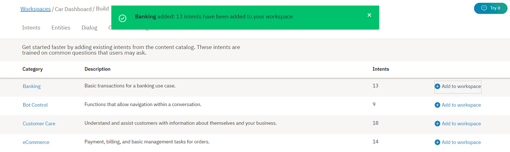

---

copyright:
  years: 2015, 2018
lastupdated: "2018-02-13"

---

{:shortdesc: .shortdesc}
{:new_window: target="_blank"}
{:tip: .tip}
{:pre: .pre}
{:codeblock: .codeblock}
{:screen: .screen}
{:javascript: .ph data-hd-programlang='javascript'}
{:java: .ph data-hd-programlang='java'}
{:python: .ph data-hd-programlang='python'}
{:swift: .ph data-hd-programlang='swift'}

# Utilisation des catalogues

**Les *catalogues*** vous permettent d'ajouter facilement des intentions courantes à votre espace de travail de service {{site.data.keyword.conversationshort}}.
{: shortdesc}

## Ajout d'un catalogue à votre espace de travail
{: #add-catalog}

Utilisez l'outil {{site.data.keyword.conversationshort}} pour ajouter des catalogues. 

1.  Dans l'outil {{site.data.keyword.conversationshort}}, ouvrez votre espace de travail, puis sélectionnez l'onglet **Catalog** dans la barre de navigation. Si l'onglet **Catalog** ne s'affiche pas, utilisez le menu  pour ouvrir la page.

1.  Sélectionnez un catalogue, par exemple, *Billing*, pour voir les intentions qui sont fournies avec lui. 

    

    Vous verrez des informations sur les intentions qui sont définies dans la catégorie *Billing*. 

    

    Les intentions qui sont ajoutées à partir d'un catalogue se distinguent des autres intentions par leur convention de dénomination, en l'occurrence, `#Billing_ . . .`

1.  Sélectionnez  pour revenir à l'onglet **Catalog**. 

1.  Ensuite, ajoutez le catalogue *Billing* à votre espace de travail en cliquant sur le bouton `Add to Bot`. Un message indiquant que les intentions *Billing* ont été ajoutées à votre espace de travail s'affichera. 

    

1.  A présent, sélectionnez l'onglet **Intents** et vérifiez que les intentions *Billing* ont été ajoutées à votre espace de travail 

    

### Résultats

Les intentions du catalogue *Billing* ont été ajoutées à l'onglet **Intents** de votre espace de travail, et le système commence à s'entraîner lui-même en utilisant les nouvelles données. 

## Edition des exemples de catalogue

Comme pour toute autre intention, une fois que les intentions du catalogue *Billing* ont été ajoutées à votre espace de travail, vous pouvez effectuer les modifications suivantes : 

- Renommer l'intention
- Supprimer l'intention
- Ajouter, éditer, ou supprimer des exemples
- Déplacer un exemple vers une autre intention

Vous pouvez passer du nom d'intention à chaque exemple à l'aide de touche de tabulation, et le cas échéant, éditer les exemples.

Pour déplacer ou supprimer un exemple, sélectionnez-le en cochant la case qui lui correspond, puis choisissez **Move** ou **Delete**.

  
