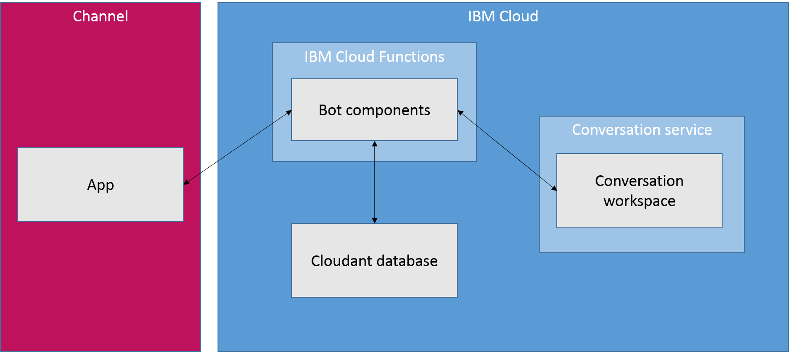

---

copyright:
  years: 2015, 2018
lastupdated: "2018-02-09"

---

{:shortdesc: .shortdesc}
{:new_window: target="_blank"}
{:tip: .tip}
{:pre: .pre}
{:codeblock: .codeblock}
{:screen: .screen}
{:javascript: .ph data-hd-programlang='javascript'}
{:java: .ph data-hd-programlang='java'}
{:python: .ph data-hd-programlang='python'}
{:swift: .ph data-hd-programlang='swift'}

# Déploiement sur un canal avec le connecteur {{site.data.keyword.conversationshort}}

Une fois que vous avez développé votre espace de travail, vous pouvez utiliser le connecteur {{site.data.keyword.conversationshort}} pour vous connecter rapidement à un canal de communication, tel que Slack ou Facebook Messenger. Le connecteur {{site.data.keyword.conversationshort}} est un ensemble de composants {{site.data.keyword.openwhisk}} qui arbitrent la communication entre votre espace de travail {{site.data.keyword.conversationshort}} et une application Slack ou Facebook que vous possédez, en stockant les données de session dans une base de données Cloudant. 

En connectant votre espace de travail à une application de canal, vous pouvez le rendre disponible en tant qu'agent conversationnel avec lequel les utilisateurs Slack ou Facebook Messenger peuvent interagir. Les réponses provenant de votre dialogue peuvent inclure des réponses multimédia et interactives, telles que des images et des boutons sur lesquels l'utilisateur peut cliquer. (Pour plus d'informations sur la définition d'une réponse multimédia, reportez-vous à la rubrique [Réponses multimédia](dialog-multimedia.html).)



Le connecteur {{site.data.keyword.conversationshort}} présente certaines limitations :

- Vous devez créer une application Slack ou Facebook ou disposer de droits d'administration pour modifier l'application que vous souhaitez utiliser. 
- En raison des restrictions relatives à {{site.data.keyword.openwhisk_short}}, cet outil est actuellement disponible uniquement pour la région {{site.data.keyword.Bluemix_notm}} du Sud des Etats-Unis.

## Déploiement sur Slack à l'aide de l'outil {{site.data.keyword.conversationshort}}

L'outil {{site.data.keyword.conversationshort}} permet de déployer rapidement un bot à l'aide du connecteur {{site.data.keyword.conversationshort}}. L'outil vous guide lors du processus de collecte des informations requises pour configurer votre application de canal et les composants du connecteur, puis il déploie automatiquement les composants requis sur IBM Cloud. 

**Remarque :** actuellement, seul Slack est pris en charge par l'interface de l'outil {{site.data.keyword.conversationshort}}, mais vous pouvez utiliser un processus {{site.data.keyword.Bluemix_short}} automatisé pour le déploiement pour Facebook Messenger. Pour plus d'informations sur le déploiement pour Facebook Messenger, reportez-vous à la documentation dans le [référentiel GitHub {{site.data.keyword.conversationshort}} connector ](https://github.com/watson-developer-cloud/conversation-connector/blob/master/channels/facebook/README.md){: new_window}.

Pour déployer un bot à l'aide de l'outil de déploiement automatisé :

1. Dans l'outil {{site.data.keyword.conversationshort}}, ouvrez l'espace de travail que vous souhaitez déployer. 
1. Cliquez sur l'icône de menu dans l'angle supérieur gauche, puis sélectionnez **Deploy**.

   

1. Sous **Deploy with {{site.data.keyword.openwhisk_short}}**, cliquez sur **Deploy to Slack**.
1. Sur la page Slack, cliquez sur **Deploy to Slack app** et suivez les instructions.

   

## Déploiement manuel

Au lieu d'utiliser l'outil automatisé pour déployer votre espace de travail comme un bot, vous pouvez configurer et déployer manuellement les composants requis sur IBM Cloud. Il existe plusieurs situations dans lesquelles vous pouvez être amené à effectuer cette opération :

- **Redéploiement partiel**. Vous souhaiterez peut-être redéployer certains composants d'un déploiement existant afin de modifier votre configuration, de corriger des problèmes ou d'appliquer un correctif à partir d'une version plus récente. 
- **Extension de votre bot avec de nouvelles fonctions**. Vous pouvez modifier les composants fournis pour ajouter de nouvelles fonctions, telles que le prétraitement des entrées utilisateur avant de les envoyer à l'espace de travail {{site.data.keyword.conversationshort}} .
- **Déploiement sur un nouveau canal**. Si vous souhaitez déployer un bot sur un canal autre que Slack ou Facebook Messenger, vous pouvez suivre le canevas des composants existants pour développer vos propres composants. 

Les composants du connecteur {{site.data.keyword.conversationshort}} sont hébergés dans un référentiel GitHub public, que vous pouvez télécharger ou cloner. Pour plus d'informations, reportez-vous à la documentation fournie dans le [référentiel ](https://github.com/watson-developer-cloud/conversation-connector){: new_window}.

## Discussion avec le bot

Une fois le processus de déploiement terminé, vous pouvez utiliser le nom d'utilisateur du bot pour interagir avec votre espace de travail {{site.data.keyword.conversationshort}}, comme vous le feriez avec n'importe quel autre bot Slack ou Facebook Messenger.

Gardez à l'esprit que le connecteur {{site.data.keyword.conversationshort}} conserve séparément l'état pour chaque utilisateur qui interagit avec le bot. (Dans le cas de Slack, un utilisateur peut avoir plusieurs conversations uniques avec le bot, une via des messages directs et une autre dans chaque canal.) Cela signifie que les variables éventuellement stockées dans le contexte du dialogue sont conservées indéfiniment, sauf si vous les effacez. 

Si vous avez besoin de pouvoir réinitialiser la conversation avec un état de début connu, vous pouvez le faire au sein de votre dialogue. Assurez-vous que votre dialogue possède un noeud qui est exécuté à la fin de la conversation ou au moment (quel qu'il soit) auquel vous devez recommencer. Mettez à jour l'objet JSON pour ce noeud afin de réinitialiser toutes les variables contextuelles avec les valeurs de début appropriées. (Si nécessaire, vous pouvez utiliser les actions **Jump to** ou une intention "end conversation" spéciale pour exécuter cette noeud.)

Par exemple, si votre espace de travail utilise une variable contextuelle appelée `drink_order` pour stocker la sélection de boissons d'un utilisateur, vous pouvez utiliser la méthode `context.remove` pour supprimer cette variable lorsque la conversation prend fin :

```json
"context": {
   "reset_drink_order": "<?context.remove('drink_order')?>"
 }
```
{: codeblock}

Pour plus d'informations sur la modification des valeurs de variable contextuelle, reportez-vous à la rubrique [Mise à jour d'une valeur de variable contextuelle](dialog-runtime.html#context-update).

Vous pouvez également effacer le contexte ou apporter des modifications au comportement du bot, en éditant les actions {{site.data.keyword.openwhisk_short}} déployées. Pour plus d'informations, reportez-vous à la documentation fournie dans le [référentiel GitHub ](https://github.com/watson-developer-cloud/conversation-connector){: new_window}.
