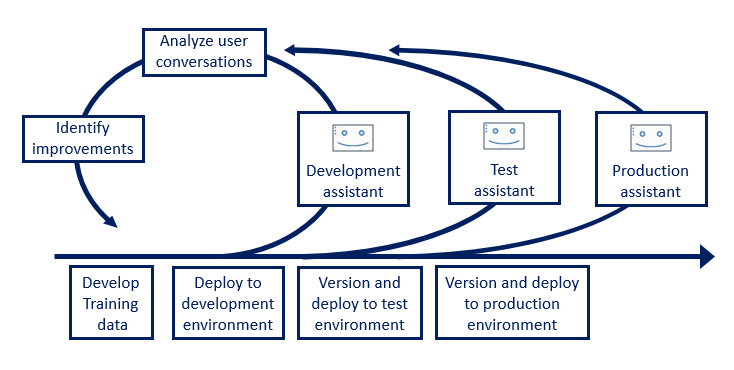

---

copyright:
  years: 2015, 2019
lastupdated: "2019-07-19"

subcollection: assistant

---

{:shortdesc: .shortdesc}
{:new_window: target="_blank"}
{:deprecated: .deprecated}
{:important: .important}
{:note: .note}
{:tip: .tip}
{:pre: .pre}
{:codeblock: .codeblock}
{:screen: .screen}
{:javascript: .ph data-hd-programlang='javascript'}
{:java: .ph data-hd-programlang='java'}
{:python: .ph data-hd-programlang='python'}
{:swift: .ph data-hd-programlang='swift'}

# Processus de développement
{: #dev-process}

Utilisez {{site.data.keyword.conversationshort}} pour tirer parti de l'IA lors de la création, du déploiement et de l'amélioration incrémentielle d'un assistant conversationnel.
{: shortdesc}

## Flux de travail
{: #dev-process-workflow}

Le flux de travail type d’un projet d’assistant comprend les étapes suivantes :

1.  Définissez un ensemble restreint de besoins clients clés auxquels l'assistant doit répondre en votre nom, y compris tous les processus métier qu'il peut initier ou mener à bien pour vos clients. Ne démarrez pas trop grand.
1.  Créez des intentions qui représentent les besoins du client que vous avez identifiés à l'étape précédente. Par exemple, des intentions telles que `#about_company` ou `#place_order`.

     Utilisez la fonction de recommandations d'intention pour exploiter vos journaux de centre d'appels existants afin de déterminer les intentions optimales pour votre cas d'utilisation. Pour plus d'informations, reportez-vous à la rubrique [Obtention d'aide pour définir les intentions](/docs/services/assistant?topic=assistant-intent-recommendations).
    {: tip}

1.  Construisez un dialogue qui détecte les intentions définies et y répond, soit par des réponses simples, soit par un flux de dialogue qui collecte d’abord plus d’informations.
1.  Définissez les entités nécessaires pour comprendre plus clairement la demande de l'utilisateur.

    Explorez des exemples utilisateur d'intention existants pour les mentions de valeur d'entité commune. L'utilisation d'annotations pour définir des entités capture non seulement le texte de la valeur de l'entité, mais également le contexte dans lequel la valeur de l'entité est généralement utilisée dans une phrase.

    Pour les entités basées sur un dictionnaire, utilisez les recommandations de synonymes pour développer les définitions de vos entités.
    {: tip}

1.  Testez chaque fonction que vous ajoutez à l'assistant dans le panneau "Try it", au fur et à mesure de votre progression.
1.  Lorsque votre assistant de travail est capable de gérer avec succès les tâches clés, ajoutez une intégration qui déploie l'assistant dans un environnement de développement. Testez l'assistant déployé et apportez des améliorations.

1.  Après avoir créé un assistant efficace, prenez un instantané de la compétence de dialogue et enregistrez-la en tant que version.

    Lorsque vous atteignez un jalon de développement, l'enregistrement d'une version vous permet de revenir en arrière si des modifications ultérieures apportées à la compétence en réduisent l'efficacité. Reportez-vous à la rubrique [Création de versions de compétences](/docs/services/assistant?topic=assistant-versions).
1.  Déployez la version de l’assistant dans un environnement de test et testez-la.

    Si vous utilisez le widget de chat hébergé sur le Web, vous pouvez partager l'URL avec d'autres personnes pour obtenir leur aide en matière de test.
1.  Utilisez les métriques de l'onglet Analytics pour rechercher les améliorations à apporter et apportez des modifications.

    Si vous devez tester différentes approches pour résoudre un problème, créez une version pour chaque solution, afin de pouvoir déployer et tester chacune d'elles indépendamment, et comparer les résultats.
1.  Lorsque vous êtes satisfait des performances de votre assistant, déployez la meilleure version de celui-ci dans un environnement de production.
1.  Surveillez les journaux des conversations des utilisateurs avec l’assistant déployé.

    Vous pouvez afficher les journaux d'une version d'une compétence en cours de production à partir de l'onglet Analytics d'une version de développement de la compétence. Lorsque vous constatez des erreurs de classification ou d'autres problèmes, vous pouvez les corriger dans la version de développement de la compétence, puis déployer la version améliorée en production après le test. Pour plus d'informations, reportez-vous à la rubrique [Amélioration grâce aux assistants](/docs/services/assistant?topic=assistant-logs#logs-deploy-id).

Le processus d'analyse des journaux et d'amélioration de la compétence de dialogue est en cours. Avec le temps, vous voudrez peut-être développer les tâches que l'assistant peut gérer pour vous. Les besoins des clients changent également. A mesure que de nouveaux besoins apparaissent, les métriques générées par vos assistants déployés peuvent vous aider à les identifier et à les résoudre lors des itérations suivantes.
