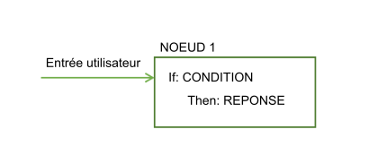
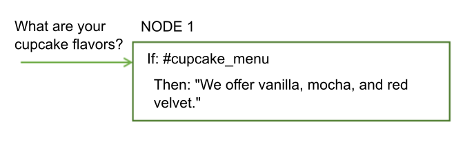
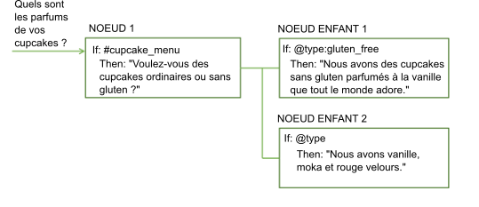
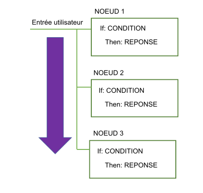
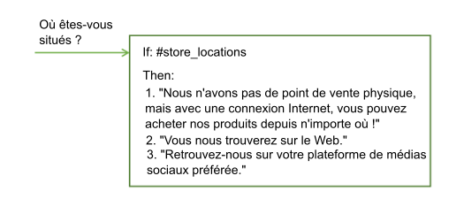

---

copyright:
  years: 2015, 2019
lastupdated: "2019-08-06"

keywords: condition, response, options, jump, jump-to, multiline, response variations

subcollection: assistant

---

{:shortdesc: .shortdesc}
{:new_window: target="_blank"}
{:deprecated: .deprecated}
{:important: .important}
{:note: .note}
{:tip: .tip}
{:pre: .pre}
{:codeblock: .codeblock}
{:screen: .screen}
{:javascript: .ph data-hd-programlang='javascript'}
{:java: .ph data-hd-programlang='java'}
{:python: .ph data-hd-programlang='python'}
{:swift: .ph data-hd-programlang='swift'}
{:table: .aria-labeledby="caption"}

# Présentation du dialogue
{: #dialog-overview}

Le dialogue utilise les intentions qui sont identifiées dans l'entrée utilisateur, plus le contexte issu de l'application, pour interagir avec l'utilisateur et, in fine, fournir une réponse utile.
{: shortdesc}

La boîte de dialogue fait correspondre les intentions (ce que disent les utilisateurs) aux réponses (ce que le bot dit en retour). La réponse peut être la réponse à une question, telle que `Où puis-je trouver de l'essence ?` ou l'exécution d'une commande, comme allumer la radio. L'intention et l'entité peuvent suffire pour identifier la réponse appropriée, ou bien le dialogue peut demander à l'utilisateur de saisir davantage d'informations pour répondre correctement. Par exemple, si un utilisateur demande `Où puis-je trouver de la nourriture ?`, vous souhaiterez peut-être lui demander de préciser s'il recherche un restaurant ou un magasin d'alimentation, pour dîner sur place ou pour emporter, etc. Vous pouvez réclamer davantage d'informations dans une réponse textuelle et créer un ou plusieurs noeuds enfant pour traiter la nouvelle entrée.

<iframe class="embed-responsive-item" id="youtubeplayer" title="Présentation du dialogue" type="text/html" width="640" height="390" src="https://www.youtube.com/embed/XkhAMe9gSFU?rel=0" frameborder="0" webkitallowfullscreen mozallowfullscreen allowfullscreen> </iframe>

Remarque : la vidéo dure 15 minutes. Les 5 premières minutes expliquent comment ajouter un noeud.

Le dialogue est représenté graphiquement dans {{site.data.keyword.conversationshort}} sous la forme d'une arborescence. Créez une branche pour traiter chaque intention qui doit être gérée par votre conversation. Une branche est composée de plusieurs noeuds.

## Noeuds de dialogue
{: #dialog-overview-nodes}

Chaque noeud de dialogue contient au moins une condition et une réponse.



- Condition : indique les informations que l'entrée utilisateur doit contenir pour déclencher ce noeud dans le dialogue. L'information est généralement une intention spécifique. Il peut également s'agir d'un type d'entité, d'une valeur d'entité ou d'une valeur de variable contextuelle. Pour plus d'informations, reportez-vous à la section [Conditions](#dialog-overview-conditions).
- Response : énoncé que l'assistant utilise pour répondre à l'utilisateur. La réponse peut aussi être configurée pour afficher une image ou une liste d'options, ou pour déclencher des actions par programmation. Pour plus d'informations, reportez-vous à la section [Réponses](#dialog-overview-responses).

Le noeud est basé sur une construction if/then : si cette condition a pour valeur true, renvoyer cette réponse.

Par exemple, le noeud ci-dessous est déclenché si la fonction de traitement du langage naturel de l'assistant détermine que l'entrée utilisateur contient l'intention `#cupcake-menu`. Suite au déclenchement du noeud, l'assistant fournit une réponse appropriée.



Un noeud comportant une condition et une réponse peut gérer des demandes d'utilisateur simples. Mais, la plupart du temps, les utilisateurs posent des questions plus sophistiquées ou demandent de l'aide pour des tâches plus complexes. Vous pouvez ajouter des noeuds enfant qui demandent à l'utilisateur de fournir les informations supplémentaires dont l'assistant a besoin.



## Flux de dialogue
{: #dialog-overview-flow}

Le dialogue que vous créez est traité par l'assistant depuis le premier noeud jusqu'au dernier noeud de l'arborescence.



A mesure que l'assistant se déplace vers le bas dans l'arborescence, s'il détecte une condition qui est satisfaite, il déclenche ce noeud. Il se déplace alors le long du noeud déclenché afin de comparer l'entrée utilisateur à d'éventuelles conditions de noeud enfant. A mesure qu'il effectue ces comparaisons avec des noeuds enfant, il se déplace de nouveau depuis le premier noeud jusqu'au dernier noeud.

L'assistant continue de suivre son chemin à travers l'arborescence du dialogue depuis le premier noeud jusqu'au dernier noeud, le long de chaque noeud déclenché, puis depuis le premier noeud enfant jusqu'au dernier noeud enfant et le long de chaque noeud enfant déclenché jusqu'à ce qu'il atteigne le dernier noeud de la branche qu'il parcourt.


Lorsque vous commencez à créer le dialogue, vous devez déterminer les branches que vous souhaitez inclure, et l'endroit où vous souhaitez les placer. L'ordre des branches est important car les noeuds sont évalués du premier jusqu'au dernier. Le premier noeud racine dont la condition correspond à l'entrée est utilisé ; les autres noeuds ajoutés ultérieurement dans l'arborescence ne sont pas déclenchés.

Lorsque l'assistant atteint la fin d'une branche, ou s'il ne trouve aucune condition qui renvoie la valeur true à partir de l'ensemble de noeuds enfant en cours sur lequel porte son évaluation, il repasse dans la base de l'arborescence. Et, là encore, l'assistant traite les noeuds racine, du premier jusqu'au dernier. Si aucune des conditions ne renvoie la valeur true, la réponse émise par le dernier noeud de l'arborescence, qui possède généralement une condition `anything_else` spéciale qui renvoie toujours la valeur true, est renvoyée.

Vous pouvez interrompre le flux "du premier au dernier" standard des manières suivantes :

- En personnalisant ce qui se produit après le traitement d’un noeud. Par exemple, vous pouvez configurer un noeud pour qu'il accède directement à un autre noeud une fois qu'il a été traité, même si l'autre noeud est positionné avant dans l'arborescence. Pour plus d'informations, reportez-vous à la rubrique [Définition de l'étape suivante](#dialog-overview-jump-to).
- En configurant les réponses conditionnelles pour accéder aux autres noeuds. Pour plus d'informations, reportez-vous à la rubrique [Réponses conditionnelles](#dialog-overview-multiple).
- En configurant les paramètres de digression pour les noeuds de dialogue. Les digressions peuvent aussi avoir un impact sur la façon dont les utilisateurs se déplacent à travers les noeuds lors de l'exécution. Si vous permettez les digressions à partir de la plupart des noeuds et configurez les retours, les utilisateurs peuvent passer d'un noeud à un autre et revenir au noeud initial plus facilement. Pour plus d'informations, reportez-vous à la rubrique [Digressions](/docs/services/assistant?topic=assistant-dialog-runtime#dialog-runtime-digressions).

## Conditions
{: #dialog-overview-conditions}

Une condition de noeud détermine si ce noeud est utilisé dans la conversation. Les conditions de réponse déterminent la réponse à renvoyer à un utilisateur.

- [Artefacts de condition](#dialog-overview-condition-artifacts)
- [Conditions spéciales](#dialog-overview-special-conditions)
- [Détails de syntaxe de condition](#dialog-overview-condition-syntax)

Pour des conseils sur l'exécution d'actions plus avancées dans les conditions, reportez-vous à la rubrique [Conseils d'utilisation des conditions](/docs/services/assistant?topic=assistant-dialog-tips#dialog-tips-condition-usage-tips).

### Artefacts de condition
{: #dialog-overview-condition-artifacts}

Vous pouvez utiliser un ou plusieurs des artefacts suivants, dans n'importe quelle combinaison, pour définir une condition :

- **Variable contextuelle** : le noeud est utilisé si l'expression de variable contextuelle que vous spécifiez a pour valeur true. Utilisez la syntaxe `$variable_name:value` ou `$variable_name == 'value'`.

  Pour les conditions de noeud, ce type d'artefact est généralement utilisé avec un opérateur AND ou OR et une autre valeur de condition. En effet, quelque chose dans l'entrée utilisateur doit déclencher le noeud ; la seule valeur de la variable contextuelle mise en correspondance ne suffit pas pour le déclencher. Si, par exemple, l'objet d'entrée utilisateur définit la valeur de la variable contextuelle, le noeud est déclenché.

  Vous ne devez pas définir une condition de noeud en fonction de la valeur d'une variable contextuelle dans le même noeud de dialogue que celui dans lequel vous définissez cette valeur de variable contextuelle.
  {: tip}

  Pour les conditions de réponse, ce type d'artefact peut être utilisé seul. Vous pouvez modifier la réponse en fonction d'une valeur de variable contextuelle spécifique. Par exemple, `$city:Boston` vérifie si la variable contextuelle `$city` contient la valeur `Boston`. Si tel est le cas, la réponse est renvoyée.
  
  Pour plus d'informations sur les variables contextuelles, reportez-vous à la rubrique [Variables contextuelles](/docs/services/assistant?topic=assistant-dialog-runtime#dialog-runtime-context).

- **Entité** : le noeud est utilisé dès lors qu'une valeur ou un synonyme de l'entité est reconnu dans l'entrée utilisateur. Utilisez la syntaxe `@entity_name`. Par exemple, `@city` vérifie si certains des noms de ville qui sont définis pour l'entité @city ont été détectés dans l'entrée utilisateur. Si tel est le cas, le noeud ou la réponse est traité.

  Envisagez de créer un noeud homologue pour gérer les situations où les valeurs ou les synonymes de l'entité ne sont pas du tout reconnus.
  {: tip}

  Pour plus d'informations sur les entités, reportez-vous à la rubrique [Définition d'entités](/docs/services/assistant?topic=assistant-entities).

- **Valeur d'entité** : le noeud est utilisé si la valeur d'entité est détectée dans l'entrée utilisateur. Utilisez la syntaxe`@entity_name:value`, puis spécifiez une valeur définie pour l'entité, et non un synonyme. Par exemple : `@city:Boston` vérifie si le nom de ville spécifique `Boston` a été détecté dans l'entrée utilisateur.

  Si vous recherchez l'entité, sans indiquer de valeur spécifique pour cette dernière, dans un noeud homologue, prenez soin de placer ce noeud (qui recherche une valeur d'entité spécifique) avant le noeud homologue qui recherche uniquement l'entité. Sinon, ce noeud ne sera jamais évalué.
  {: tip}

  Si l'entité est une entité de canevas avec des groupes de capture, vous pouvez rechercher une correspondance de valeur de groupe donnée. Par exemple, vous pouvez utiliser la syntaxe `@us_phone.groups[1] == '617'`.
  Pour plus d'informations, reportez-vous à la rubrique [Stockage et reconnaissance des groupes d'entités de canevas dans les entrées](/docs/services/assistant?topic=assistant-dialog-tips#dialog-tips-get-pattern-groups).

- **Intention** : la condition la plus simple correspond à une seule et même intention. Le noeud est utilisé si, après que le traitement en langage naturel de l'assistant a évalué l'entrée utilisateur, il détermine que le but de l'entrée utilisateur correspond à l'intention prédéfinie. Utilisez la syntaxe `#intent_name`. Par exemple, `#weather` vérifie si l'entrée utilisateur demande une prévision météorologique. Si tel est le cas, le noeud avec la condition d'intention `#weather` est traité.

  Pour plus d'informations sur les intentions, reportez-vous à la rubrique [Définition d'intentions](/docs/services/assistant?topic=assistant-intents).

- **Condition spéciale** : conditions qui sont fournies avec le produit et que vous pouvez utiliser pour effectuer des fonctions de dialogue de base. Pour plus de détails, reportez-vous au tableau **Conditions spéciales**.

### Conditions spéciales
{: #dialog-overview-special-conditions}

| Syntaxe de condition     | Description |
|----------------------|-------------|
| `anything_else`      | Vous pouvez utiliser cette condition à la fin du dialogue pour qu'elle soit traitée lorsque l'entrée utilisateur ne correspond à aucun autre noeud du dialogue. Le noeud **Anything else** est déclenché par cette condition. |
| `conversation_start` | A l'instar de **welcome**, cette condition renvoie la valeur true lors du premier échange du dialogue. Contrairement à **welcome**, elle renvoie la valeur true, que la demande initiale émise par l'application contienne ou non l'entrée utilisateur. Un noeud comportant la condition **conversation_start** peut être utilisé pour initialiser des variables contextuelles ou pour effectuer d'autres tâches au début du dialogue. |
| `false`              | Cette condition prend toujours la valeur false. Vous pouvez l'utiliser au début d'une branche en cours de développement, afin d'empêcher son utilisation, ou comme la condition d'un noeud qui fournit une fonction de base et qui est utilisé uniquement comme cible d'une action **Jump to**. |
| `irrelevant`         | Cette condition renvoie la valeur true si l'entrée utilisateur est déterminée comme non pertinente par le service {{site.data.keyword.conversationshort}}. |
| `true`               | Cette condition renvoie toujours la valeur true. Vous pouvez l'utiliser à la fin d'une liste de noeuds ou de réponses afin de capturer les réponses qui ne correspondaient à aucune des conditions précédentes. |
| `welcome`            | Cette condition renvoie la valeur true lors du premier échange de dialogue (lorsque la conversation démarre), uniquement si la demande initiale émise par l'application ne contient aucune entrée utilisateur. Elle prend la valeur false dans tous les échanges de dialogue suivants. Le noeud **Welcome** est déclenché par cette condition. En général, un noeud comportant cette condition est utilisé comme message d'accueil, par exemple, `Bienvenue dans notre application de commande de pizza.` Ce noeud n'est jamais traité lors d'interactions via des canaux tels que Facebook ou Slack.|
{: caption="Conditions spéciales" caption-side="top"}

### Détails de syntaxe de condition
{: #dialog-overview-condition-syntax}

Utilisez l'une des options de syntaxe suivantes pour créer des expressions valides dans des conditions :

- Des notations sténographiques, qui permettent de faire référence à des intentions, des entités et des variables contextuelles. Reportez-vous à la rubrique [Accès à des objets en vue de leur évaluation](/docs/services/assistant?topic=assistant-expression-language).

- Le langage d'expression SpEL, qui prend en charge l'interrogation et la manipulation d'un graphe d'objets lors de l'exécution. Pour plus d'informations, reportez-vous à l'article [Spring Expression Language (SpEL) language ](http://docs.spring.io/spring/docs/current/spring-framework-reference/html/expressions.html){: new_window}.

Vous pouvez utiliser des expressions régulières pour comparer des valeurs à des conditions.  Pour trouver une chaîne correspondante, par exemple, vous pouvez utiliser la méthode `String.find`. Pour plus d'informations, reportez-vous à la rubrique [Méthodes](/docs/services/assistant?topic=assistant-dialog-methods).

## Réponses
{: #dialog-overview-responses}

La réponse de dialogue décrit comment répondre à l'utilisateur.

Vous pouvez répondre des manières suivantes :

- [Réponse textuelle simple](#dialog-overview-simple-text)
- [Réponses enrichies](#dialog-overview-multimedia)
- [Réponses conditionnelles](#dialog-overview-multiple)

### Réponse textuelle simple
{: #dialog-overview-simple-text}

Si vous souhaitez fournir une réponse textuelle, il vous suffit d'entrer le texte que l'assistant doit afficher pour l'utilisateur.


Pour inclure une valeur de variable contextuelle dans la réponse, utilisez la syntaxe `$variable-name` pour la spécifier. Pour plus d'informations, reportez-vous à la section [Variables contextuelles](/docs/services/assistant?topic=assistant-dialog-runtime#dialog-runtime-context). Par exemple, si vous savez que la variable contextuelle $user est définie sur le nom de l'utilisateur en cours avant le traitement d'un noeud, vous pouvez vous y référer dans la réponse textuelle du noeud, comme suit :

```
Bonjour $user
```
{: screen}

Si le nom de l'utilisateur en cours est `Norman`, la réponse affichée à Norman est `Bonjour Norman`.

Si vous incluez l'un des caractères spéciaux suivants dans une réponse textuelle, mettez-le en échappement en le faisant précéder d'une barre oblique inversée (``\`). Dans l'éditeur JSON, vous devez utiliser deux barres obliques inversées pour la mise en échappement (``\\`). La mise en échappement du caractère empêche l'assistant de l'interpréter à tort comme étant l'un des types d'artefact suivants : 

| Caractère spécial | Artefact | Exemple |
|-------------------|----------|---------|
| `$` | Variable contextuelle | `Les frais de transaction s'élèvent à \$2.` |
| `@` | Entité | `Envoyez-nous vos commentaires à l'adresse feedback\@example.com.` |
{: caption="Caractères spéciaux à mettre en échappement dans les réponses" caption-side="top"}

Les intégrations incorporées prennent en charge les éléments syntaxiques Markdown suivants :

| Format | Syntaxe | Exemple |
|------------|--------|---------|
| Italique | `Nous parlons de *pratique*.` | Nous parlons de *pratique*. |
| Gras | `Le baseball **c'est pas** pour les mauviettes.` | Le baseball **c'est pas** pour les mauviettes. |
| Lien hypertexte | `Contactez-nous sur [ibm.com](https://www.ibm.com).` | Contactez-nous sur [ibm.com](https://www.ibm.com). |
{: caption="Syntaxe Markdown prise en charge" caption-side="top"}

Le panneau "Try it out" ne prend actuellement pas en charge la syntaxe Markdown. L'intégration du lien d'aperçu permet de tester le dialogue dans la page Web de prévisualisation pour voir comment la syntaxe de Markdown est affichée. 

Le panneau "Try it out" et l'intégration du lien d'aperçu prennent en charge la syntaxe HTML. Les intégrations Slack et Facebook ne le font pas. 

#### En savoir plus sur les réponses simples
{: #dialog-overview-variety}

- [Ajout de plusieurs lignes](#dialog-overview-multiline)
- [Ajout de variantes](#dialog-overview-add-variety)

#### Ajout de plusieurs lignes
{: #dialog-overview-multiline}

Si vous souhaitez qu'une seule réponse textuelle inclue plusieurs lignes séparées par des retours à la ligne, procédez comme suit :

1.  Ajoutez chaque ligne que vous souhaitez présenter à l'utilisateur sous forme de phrase distincte dans sa propre zone de variante de réponse. Par exemple :

  <table>
  <caption>Réponse sur plusieurs lignes</caption>
  <tr>
    <th>Variantes de réponse</th>
  </tr>
  <tr>
    <td>Salut.</td>
  </tr>
  <tr>
    <td>Comment allez-vous ?</td>
  </tr>
  </table>

1.  Pour le paramètre de variante de réponse, choisissez l'option **multiline**.

    Si vous utilisez une compétence de dialogue créée avant que la prise en charge des types de réponse enrichie ait été ajoutée au produit, vous risquez de ne pas voir l'option *multiline*. Ajoutez un deuxième type de réponse textuelle à la réponse du noeud actuel. Cette action modifie la manière dont la réponse est représentée dans le JSON sous-jacent. En conséquence, l'option multiline devient disponible. Choisissez le type de variante multiline. Vous pouvez maintenant supprimer le deuxième type de réponse textuelle que vous avez ajouté à la réponse.
    {: note}

Lorsque la réponse est présentée à l'utilisateur, les deux variantes de réponse sont affichées, une sur chaque ligne, comme suit :

```
Salut.
Comment allez-vous ?
```
{: screen}

#### Ajout de variantes
{: #dialog-overview-add-variety}

Si vos utilisateurs utilisent fréquemment votre service de conversation, ils peuvent finir par se lasser d'entendre toujours le même message d'accueil et les mêmes réponses.  Vous pouvez ajouter des *variantes* à vos réponses de sorte que votre conversation puisse répondre de différentes manières à une même condition.

Dans l'exemple ci-dessous, la réponse fournie par l'assistant aux questions relatives à l'emplacement d'un magasin diffère d'une interaction à l'autre :



Vous pouvez choisir de faire alterner les variantes de réponse de manière séquentielle ou aléatoire. Par défaut, les réponses alternent de manière séquentielle, comme si elles avaient été choisies dans une liste ordonnée.

Pour modifier la séquence dans laquelle est renvoyée chaque réponse textuelle, procédez comme suit :

1.  Ajoutez chaque variante de la réponse dans sa propre zone de variante de réponse. Par exemple :

  <table>
  <caption>Réponses variables</caption>
  <tr>
    <th>Variantes de réponse</th>
  </tr>
  <tr>
    <td>Bonjour.</td>
  </tr>
  <tr>
    <td>Salut.</td>
  </tr>
  <tr>
    <td>Coucou !</td>
  </tr>
  </table>

1.  Pour le paramètre de variante de réponse, choisissez l'un des paramètres suivants :

    - **sequential** : le système renvoie la première variante de réponse la première fois que le noeud de dialogue est déclenché, la deuxième variante de réponse la deuxième fois que le noeud est déclenché, et ainsi de suite, dans l'ordre où vous définissez les variantes dans le noeud.

      Résultats dans les réponses renvoyées dans l'ordre suivant lors du traitement du noeud :

      - Première fois :

        ```
        Bonjour.
        ```
        {: screen}

      - Deuxième fois :

        ```
        Salut.
        ```
        {: screen}

      - Troisième fois :
        ```
        Coucou !
        ```
        {: screen}

    - **random** : le système sélectionne de manière aléatoire une chaîne de texte dans la liste de variantes lors du premier déclenchement du noeud de dialogue et sélectionne de manière aléatoire une autre variante la prochaine fois, sans répéter la même chaîne de texte consécutivement.

      Exemple de l'ordre dans lequel les réponses peuvent être renvoyées lors du traitement du noeud :

      - Première fois :

        ```
        Coucou !
        ```
        {: screen}

      - Deuxième fois :

        ```
        Salut.
        ```
        {: screen}

      - Troisième fois :

        ```
        Bonjour.
        ```
        {: screen}

### Réponses enrichies
{: #dialog-overview-multimedia}

Vous pouvez renvoyer des réponses avec des éléments multimédias ou interactifs tels que des images ou des boutons cliquables pour simplifier le modèle d'interaction de votre application et améliorer l'expérience utilisateur.

En plus du type de réponse par défaut **Text**, pour lequel vous spécifiez le texte à renvoyer à l'utilisateur en réponse, les types de réponse suivants sont pris en charge :

- **Connect to human agent** :  Le dialogue appelle un service que vous désignez, généralement un service qui gère les files d'attente de tickets de demande de service d'agent humain, pour transmettre la conversation à une personne. Vous pouvez éventuellement inclure un message résumant le problème de l'utilisateur afin de le transmettre à l'agent humain. Il incombe au service externe d’afficher un message destiné à expliquer à l’utilisateur que la conversation est en cours de transfert. Le dialogue ne gère pas cette communication. Le transfert de dialogue ne se produit pas lorsque vous testez des noeuds avec ce type de réponse dans le panneau "Try it out". Vous devez accéder à un noeud qui utilise ce type de réponse à partir d'un déploiement test pour savoir quelle sera l'expérience de vos utilisateurs.

  Ce type de réponse est disponible uniquement pour les utilisateurs des forfaits Plus ou Premium et est uniquement pris en charge avec les intégrations d'applications Intercom ou personnalisées.
  {: note}

- **Image** : incorpore une image dans la réponse. Le fichier image source doit être hébergé quelque part et avoir une URL que vous pouvez utiliser pour y faire référence. Il ne peut s'agir d'un fichier stocké dans un répertoire qui n'est pas accessible publiquement.
- **Option** : ajoute une liste d'une ou de plusieurs options. Lorsqu'un utilisateur clique sur l'une des options, une valeur d'entrée utilisateur associée est envoyée à l'assistant. Le mode de rendu des options peut varier selon l'endroit où vous déployez le dialogue. Par exemple, dans un canal d'intégration, les options peuvent être affichées sous forme de boutons cliquables, mais dans un autre, elles peuvent apparaître sous forme de liste déroulante.
- **Pause** : force l'application à attendre un nombre spécifié de millisecondes avant de poursuivre le traitement. Vous pouvez choisir de montrer à un indicateur que le dialogue est en train de saisir une réponse. Utilisez ce type de réponse si vous devez effectuer une action qui peut être longue. Par exemple, un noeud parent effectue un appel Cloud Function et affiche le résultat dans un noeud enfant. Vous pouvez utiliser ce type de réponse comme réponse du noeud parent pour permettre l'exécution de l'appel programmatique, puis passer au noeud enfant pour afficher le résultat. Ce type de réponse ne s'affiche pas dans le panneau "Try it out". Vous devez accéder à un noeud qui utilise ce type de réponse à partir d'un déploiement test pour savoir quelle sera l'expérience de vos utilisateurs.
- **Compétence de recherche** :  recherche dans une source de données externe les informations pertinentes à renvoyer à l'utilisateur. La source de données recherchée est une collection de données de service {{site.data.keyword.discoveryshort}} que vous configurez lorsque vous ajoutez une compétence de recherche à l'assistant qui utilise cette compétence de dialogue. Pour plus d'informations, reportez-vous à la rubrique [Création d'une compétence de recherche](/docs/services/assistant?topic=assistant-skill-search-add).

  Ce type de réponse est disponible pour les utilisateurs des forfaits Plus ou Premium uniquement.
  {: note}

#### Ajout de réponses enrichies
{: #dialog-overview-multimedia-add}

Pour ajouter une réponse enrichie, procédez comme suit :

1.  Cliquez sur le menu déroulant dans la zone de réponse pour choisir un type de réponse, puis fournissez les informations requises :

    - **Connect to human agent**.  Vous pouvez éventuellement ajouter un message à partager avec l'agent humain auquel la conversation est transférée.

        Ce type de réponse est pris en charge uniquement avec les intégrations d'applications Intercom et personnalisées. Pour les applications personnalisées, vous devez programmer l'application client pour qu'elle reconnaisse le moment où ce type de réponse est déclenché.
        {: note}

    - **Image**. Ajoutez l'URL complète vers le fichier image hébergé dans la zone **Image source**. L'image doit être au format .jpg, .gif ou .png. Le fichier image doit être stocké dans un emplacement publiquement adressable par URL.

        Par exemple : `https://www.example.com/assets/common/logo.png`.

        Si vous souhaitez afficher un titre et une description d'image au-dessus de l'image incorporée dans la réponse, ajoutez-les dans les zones fournies.

        Pour accéder à une image stockée dans {{site.data.keyword.cloud}} {{site.data.keyword.cos_short}}, activez l'accès public à chaque objet de stockage d'images, puis référencez-le en spécifiant la source de l'image avec la syntaxe suivante : `https://s3.eu.cloud-object-storage.appdomain.cloud/your-bucket-name/image-name.png`.

        Les intégrations Slack nécessitent un titre. Les autres canaux d'intégration ignorent les titres ou les descriptions.
        {: note}

    - **Option**. Effectuez les étapes suivantes :

      1.  Cliquez sur **Add option**.
      1.  Dans la zone **List label**, entrez l’option à afficher dans la liste. Le libellé doit comporter moins de 64 caractères.
      1.  Dans la zone **Value** correspondante, saisissez l'entrée utilisateur à transmettre à l'assistant lorsque cette option est sélectionnée. La valeur doit comporter moins de 2 048 caractères.

          Spécifiez une valeur dont vous savez qu'elle déclenchera l'intention correcte lors de la soumission. Par exemple, il peut s’agir d’un exemple d’utilisateur provenant des données d'apprentissage de l’intention.
      1.  Répétez les étapes précédentes pour ajouter d'autres options à la liste.

          Vous pouvez ajouter jusqu'à 20 options.
      1.  Ajoutez une introduction à la liste dans la zone **Title**. Le titre peut demander à l'utilisateur de choisir dans la liste d'options.

          Certains canaux d'intégration n'affichent pas le titre.
          {: note}

      1.  Ajoutez éventuellement des informations supplémentaires dans la zone **Description**. Si elle est fournie, la description est affichée après le titre et avant la liste d'options.

      Certains canaux d'intégration n'affichent pas la description.
      {: note}

      Par exemple, vous pouvez construire une réponse comme suit :

        <table>
        <caption>Options de réponse</caption>
        <tr>
          <th>Titre de la liste</th>
          <th>Description de la liste</th>
          <th>Libellé d'option</th>
          <th>Entrée utilisateur soumise lorsque vous cliquez dessus</th>
        </tr>
        <tr>
          <td>Types d'assurance</td>
          <td>Lequel de ces articles voulez-vous assurer ?</td>
          <td></td>
          <td></td>
        </tr>
        <tr>
          <td></td>
          <td></td>
          <td>Bateau</td>
          <td>Je veux contracter une assurance bateau</td>
        </tr>
        <tr>
          <td></td>
          <td></td>
          <td>Voiture</td>
          <td>Je veux contracter une assurance auto</td>
        </tr>
         <tr>
          <td></td>
          <td></td>
          <td>Habitation</td>
          <td>Je veux contracter une assurance habitation</td>
        </tr>
        </table>

    - **Pause**. Ajoutez la durée de la pause, en millisecondes (ms), à la zone **Duration**.

        La valeur ne peut pas dépasser 10 000 ms. Les utilisateurs sont généralement disposés à attendre la saisie d'une réponse pendant environ 8 secondes (8 000 ms). Pour empêcher l'affichage d'un indicateur de frappe pendant la pause, choisissez **Off**.

        Ajoutez un autre type de réponse, tel qu'un type de réponse textuelle, après la pause pour indiquer clairement que la pause est terminée.
        {: tip}

    - **Text**. Ajoutez le texte à renvoyer à l'utilisateur dans la zone de texte. Vous pouvez éventuellement choisir un paramètre de variante pour la réponse textuelle. Pour plus d'informations, reportez-vous à la rubrique [Réponse textuelle simple](#dialog-overview-simple-text).

    - **Compétence de recherche**.  Indique que vous souhaitez rechercher une réponse pertinente dans une source de données externe. 

      Ce type de réponse n'est visible que pour les utilisateurs du forfait Plus ou Premium.
      {: note}

      Pour modifier la requête de recherche à transmettre au service {{site.data.keyword.discoveryshort}}, cliquez sur **Customize**, puis remplissez les zones suivantes :

        - **Query** : facultatif. Vous pouvez spécifier une requête spécifique en langage naturel à transmettre à {{site.data.keyword.discoveryshort}}. Si vous n'ajoutez pas de requête, le texte d'entrée exact du client est transmis en tant que requête. 

          Par exemple, vous pouvez spécifier `Pour quelles villes prenez-vous l'avion ?`. Cette valeur de requête est transmise à {{site.data.keyword.discoveryshort}} en tant que requête de recherche. {{site.data.keyword.discoveryshort}} utilise la compréhension du langage naturel pour comprendre la requête et trouver une réponse ou des informations pertinentes sur le sujet dans la collection de données configurée pour la compétence de recherche.

          Vous pouvez inclure des informations spécifiques fournies par l'utilisateur en référençant des entités détectées dans l'entrée utilisateur dans le cadre de la requête. Par exemple, `Parlez-moi de @product`. Ou vous pouvez référencer une variable contextuelle, telle que `Avez-vous des vols vers $destination ?` Veillez simplement à concevoir votre dialogue de sorte que la recherche ne soit déclenchée que si les entités ou les variables de contexte que vous avez mentionnées dans la requête ont été définies avec des valeurs valides. 

          Cette zone est équivalente au paramètre {{site.data.keyword.discoveryshort}} `natural_language_query`. Pour plus d'informations, reportez-vous à la rubrique [Paramètres de requête ](/docs/services/discovery?topic=discovery-query-parameters#nlq){: new_window}.

        - **Filter** : facultatif. Spécifiez une chaîne de texte définissant les informations devant figurer dans les résultats de recherche renvoyés. 

          - Pour indiquer que vous souhaitez renvoyer uniquement les documents avec un sentiment positif détecté, par exemple, spécifiez `enriched_text.sentiment.document.label:positive`.

          - Pour filtrer les résultats afin d'inclure uniquement les documents que le processus d'ingestion a identifiés comme contenant l'entité `Boston, MA`, spécifiez `enriched_text.entities.text:"Boston, MA"`.

          - Pour filtrer les résultats afin d'inclure uniquement les documents que le processus d'ingestion a identifiés comme contenant un nom de produit fourni par le client, vous pouvez spécifier `enriched_text.entities.text:@product`.

          - Pour filtrer les résultats afin d'inclure uniquement les documents que le processus d'ingestion a identifiés comme contenant un nom de ville que vous avez enregistré dans une variable contextuelle nommée `$destination`, vous pouvez spécifier `enriched_text.entities.text:$destination`.

        Si vous ajoutez à la fois une requête et une valeur de filtre, le paramètre filter est d'abord appliqué pour filtrer les documents de collection de données et mettre en cache les résultats. Le paramètre de requête classe ensuite les résultats mis en cache. 

        Cette zone est équivalente au paramètre {{site.data.keyword.discoveryshort}} `filter`. Pour plus d'informations, reportez-vous à la rubrique [Paramètres de requête ](/docs/services/discovery?topic=discovery-query-parameters#filter){: new_window}.

      Ce type de réponse renvoie uniquement une réponse valide si l'assistant auquel vous avez ajouté cette compétence de dialogue a également une compétence de recherche associée. Testez ce type de réponse à partir du lien d'aperçu ou d'une autre intégration au niveau assistant. Vous ne pouvez pas le tester à partir du panneau "Try it out" de la compétence de dialogue.

1.  Cliquez sur **Add response type** pour ajouter un autre type de réponse à la réponse en cours. 

    Vous souhaiterez peut-être ajouter plusieurs types de réponse à une réponse unique pour fournir une réponse plus riche à une requête utilisateur. Par exemple, si un utilisateur demande des emplacements de magasin, vous pouvez afficher une carte et un bouton pour chaque site de magasin sur lequel l'utilisateur peut cliquer pour obtenir l'adresse. Pour créer ce type de réponse, vous pouvez utiliser une combinaison de types de réponses image, options et texte. Un autre exemple consiste à utiliser un type de réponse textuelle avant un type de réponse de pause afin que vous puissiez avertir les utilisateurs avant de mettre le dialogue en pause.

    Vous ne pouvez pas ajouter plus de 5 types de réponse à une seule réponse. Cela signifie que si vous définissez trois réponses conditionnelles pour un noeud de dialogue, vous ne pouvez pas ajouter plus de 5 types de réponse à chaque réponse conditionnelle.
    {: note}

    Un seul nœud de dialogue ne peut pas avoir plus d'un type de réponse **Connect to human agent** ou **Search skill**.
    {: note}

1.  Si vous avez ajouté plusieurs types de réponse, vous pouvez cliquer sur les flèches **Move** de déplacement vers le haut et vers le bas pour organiser les types de réponse dans l'ordre où l'assistant doit les traiter. 

### Réponses conditionnelles
{: #dialog-overview-multiple}

Un seul et même noeud de dialogue peut fournir différentes réponses, chacune d'elles étant déclenchées par une condition différente.  Utilisez cette approche pour prendre en charge plusieurs scénarios dans un seul et même noeud.

<iframe class="embed-responsive-item" id="youtubeplayer1" title="Ajout de réponses conditionnelles" type="text/html" width="640" height="390" src="https://www.youtube.com/embed/Q5_-f7_Iyvg?rel=0" frameborder="0" webkitallowfullscreen mozallowfullscreen allowfullscreen> </iframe>

Le noeud comporte toujours une condition principale, qui sert à l'utilisation du noeud et au traitement des conditions et des réponses qu'il contient.

Dans l'exemple ci-dessous, l'assistant utilise des informations qu'il a collectées précédemment au sujet de l'endroit où se trouve un utilisateur afin de personnaliser sa réponse, et il fournit des informations sur le magasin le plus proche de l'utilisateur. Pour savoir comment stocker les informations collectées auprès de l'utilisateur, reportez-vous à la section [Variables contextuelles](/docs/services/assistant?topic=assistant-dialog-runtime#dialog-runtime-context).


A présent, ce seul et même noeud fournit les mêmes fonctions que quatre noeuds distincts.

Pour ajouter des réponses conditionnelles à un noeud, procédez comme suit :

1.  Cliquez sur **Customize**, puis sur le bouton à bascule **Multiple responses** pour l'activer (**On**).

    La section de réponse du noeud change pour afficher une paire de zones de condition et de réponse. Vous pouvez y ajouter une condition et une réponse.
1.  Pour personnaliser davantage une réponse, cliquez sur l'icône **Edit response**  en regard de la réponse.

    Vous devez ouvrir la réponse en édition afin d'effectuer les tâches suivantes :

    - **Mettre à jour le contexte**. Pour modifier la valeur d'une variable contextuelle lorsque la réponse est déclenchée, spécifiez la valeur contextuelle dans l'éditeur de contexte. Vous mettez à jour le contexte pour chaque réponse conditionnelle ; il n'existe pas d'éditeur de contexte commun ni d'éditeur JSON pour l'ensemble des réponses conditionnelles.
    - **Ajouter des réponses enrichies**. Pour ajouter plusieurs réponses textuelles ou des types de réponses autres que les réponses textuelles à une seule réponse conditionnelle, vous devez ouvrir la vue d'édition de la réponse.
    - **Configurer un saut**. Pour que l'assistant passe à un autre noeud après le traitement de cette réponse conditionnelle, sélectionnez **Jump to** dans la section *And finally* la vue d'édition de la réponse. Identifiez le noeud que l'assistant doit traiter ensuite. Pour plus d'informations, reportez-vous à la rubrique [Configuration de l'action Jump to](#dialog-overview-jump-to-config).

      Une action **Jump to** configurée pour le noeud n'est pas traitée tant que toutes les réponses conditionnelles n'ont pas été traitées. Par conséquent, si une réponse conditionnelle est configurée pour passer à un autre noeud et que la réponse conditionnelle est déclenchée, le saut configuré pour le noeud n'est jamais traité et ne se produit donc pas.

1.  Cliquez sur **Add response** pour ajouter une autre réponse conditionnelle.

Les conditions définies dans un noeud sont évaluées dans un ordre défini, tout comme les noeuds.  Veillez à ce que vos réponses conditionnelles soient répertoriées dans l'ordre souhaité.  Si vous devez modifier cet ordre, sélectionnez une paire condition et réponse, et déplacez-la vers le haut ou vers le bas dans la liste à l'aide des flèches affichées.

## Définition de l'étape suivante
{: #dialog-overview-jump-to}

Après avoir formulé la réponse spécifiée, vous pouvez demander à l'assistant d'effectuer l'une des actions suivantes :

- **Wait for user input** : l'assistant attend que l'utilisateur fournisse une nouvelle entrée sollicitée par la réponse. Par exemple, la réponse peut poser une question à laquelle l'utilisateur doit répondre par oui ou par non. Le dialogue ne progresse pas tant que l'utilisateur ne fournit pas une autre entrée.
- **Skip user input** : utilisez cette option pour ignorer le message réclamant une entrée utilisateur et accéder directement au premier noeud enfant du noeud en cours.

  Le noeud en cours doit avoir au moins un noeud enfant pour que cette option soit disponible.
  {: note}

- **Jump to another dialog node** : utilisez cette option lorsque vous souhaitez que la conversion accède directement à un noeud de dialogue complètement différent. Vous pouvez utiliser une action *Jump to* pour acheminer le flux vers un noeud de dialogue commun à partir de plusieurs emplacements dans l'arborescence, par exemple.

  Avant de pouvoir configurer l'action Jump to pour un noeud cible auquel vous voulez passer directement, ce dernier doit déjà exister.
  {: note}

### Configuration de l'action Jump to
{: #dialog-overview-jump-to-config}

Si vous choisissez de passer à un autre noeud, indiquez le moment où le noeud cible est traité en choisissant l'une des options suivantes :

- **Condition** : si l'instruction cible la section condition du noeud de dialogue sélectionné, l'assistant vérifie d'abord si la condition du noeud ciblé renvoie la valeur true.
    - Si la condition renvoie la valeur true, le système traite le noeud cible immédiatement.
    - Si la condition ne renvoie pas la valeur true, le système passe au noeud apparenté suivant du noeud cible afin d'évaluer sa condition et répète ce processus jusqu'à ce qu'il trouve un noeud de dialogue avec une condition qui renvoie la valeur true.

    - Si le système traite tous les éléments apparentés et qu'aucune des conditions ne renvoie la valeur true, la stratégie de rétromigration de base est utilisée et le dialogue évalue les noeuds du niveau de base de l'arborescence.

    Cibler la condition est utile pour enchaîner les conditions de noeuds de dialogue. Par exemple, vous souhaiterez peut-être vérifier d'abord si l'entrée contient une intention, par exemple, `#turn_on`, et si tel est le cas, vous souhaiterez peut-être vérifier si l'entrée contient des entités, par exemple, `@lights`, `@radio` ou `@wipers`. Enchaîner les conditions permet de structurer des arborescences de dialogue plus vastes.

    Evitez de choisir cette option lors de la configuration d'un accès direct à partir d'une réponse conditionnelle vers un noeud situé au-dessus du noeud en cours dans l'arborescence du dialogue. Sinon, vous pouvez créer une boucle infinie. Si l'assistant accède au noeud précédent et vérifie sa condition, il est susceptible de renvoyer la valeur false car l'entrée utilisateur qui a déclenché le dernier noeud en cours dans le dialogue est en cours d'évaluation. L'assistant ira au noeud frère suivant ou reviendra à la racine pour vérifier les conditions de ces noeuds et finira probablement par déclencher à nouveau ce noeud, ce qui signifie que le processus se répète.
    {: note}

- **Réponse** : si l'instruction cible la section réponse du noeud de dialogue sélectionné, celle-ci est exécutée immédiatement. Autrement dit, le système n'évalue pas la condition du noeud de dialogue sélectionné et exécute immédiatement la réponse du noeud de dialogue sélectionné.

  Cibler la réponse est utile pour enchaîner plusieurs noeuds de dialogue. La réponse est traitée comme si la condition de ce noeud de dialogue avait pour valeur true. Si le noeud de dialogue sélectionné comporte une autre action **Jump to**, celle-ci est également exécutée immédiatement.

- **Wait for user input**: : attend la nouvelle entrée utilisateur, puis commence à la traiter à partir du noeud auquel vous accédez. Cette option est utile si le noeud source pose une question, par exemple, et que vous souhaitez passer à un noeud distinct pour traiter la réponse de l'utilisateur à la question.

## Informations complémentaires

Pour obtenir des informations sur le langage d'expression utilisé par un dialogue, et sur les méthodes, les entités de système, ainsi que d'autres informations utiles, reportez-vous à la section **Reference** dans le panneau de navigation.

Vous pouvez également utiliser l'API pour ajouter des noeuds ou éditer un dialogue. Pour plus d'informations, reportez-vous à la rubrique [Modification d'un dialogue à l'aide de l'API](/docs/services/assistant?topic=assistant-api-dialog-modify).
