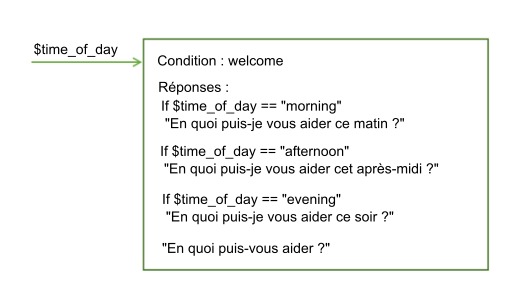

---

copyright:
  years: 2015, 2018
lastupdated: "2018-02-16"

---

{:shortdesc: .shortdesc}
{:new_window: target="_blank"}
{:tip: .tip}
{:pre: .pre}
{:codeblock: .codeblock}
{:screen: .screen}
{:javascript: .ph data-hd-programlang='javascript'}
{:java: .ph data-hd-programlang='java'}
{:python: .ph data-hd-programlang='python'}
{:swift: .ph data-hd-programlang='swift'}

# Mode de traitement du dialogue
{: #dialog-runtime}

Cette rubrique vous permet de comprendre comment votre dialogue est traité lorsqu'une personne interagit avec votre instance du service {{site.data.keyword.conversationshort}} déployé lors de l'exécution.
{: shortdesc}

## Anatomie d'un appel de dialogue
{: message-anatomy}

Chaque énoncé d'utilisateur est transmis au dialogue en tant qu'appel d'API /message. Cela inclut les énoncés que les utilisateurs utilisent pour répondre aux invites du dialogue leur demandant des informations supplémentaires. Certains plans d'abonnement incluent un nombre défini d'appels d'API, par conséquent, il peut être utile de comprendre ce qui constitue un appel. Un appel d'API /message simple équivaut à un échange de dialogue simple, qui est constitué d'une entrée provenant de l'utilisateur et d'une réponse correspondante provenant du dialogue. 

Le corps de la demande et de la réponse d'appel d'API /message comprend les objets suivants :

- `context` : contient des variables destinées à être conservées. Pour faire passer des informations d'un appel à un autre, le développeur d'applications doit transmettre le contexte de réponse de l'appel d'API précédent avec chaque appel d'API suivant. Par exemple, le dialogue peut collecter le nom de l'utilisateur, puis désigner ce dernier par son nom dans les noeuds suivants. 

  ```json
  {
    "context" : {
      "user_name" : "<? @sys-person.literal ?>"
    }
  ```
  {: codeblock}

  Pour plus d'informations, reportez-vous à la rubrique [Conservation d'informations entre chaque échange de dialogue](dialog-runtime.html#context). 

- `input` : chaîne de texte qui a été soumise par l'utilisateur. La chaîne de texte peut contenir jusqu'à 2 048 caractères. 

  ```json
  {
    "input": {
      "text" : "Where's your nearest store?"
    }
  ```
  {: codeblock}

- `output` : réponse du dialogue à afficher pour l'utilisateur. Vous pouvez utiliser cette section pour définir des objets, tels que des variables, qui ne sont pas destinés à être conservés. Par exemple, si vous souhaitez supprimer définitivement une variable contextuelle nommée `temp` que vous avez définie ailleurs dans le dialogue, vous pouvez utiliser l'expression suivante : 

  ```json
  {
  "output": {
    "text" : {},
    "deleted_variable" : "<? context.remove('temp') ?>"
  ```
  {: codeblock}

  Pour plus d'informations sur l'objet en sortie, reportez-vous à la rubrique [Réponse complexe](dialog-overview.html#complex). 

Pour en savoir plus sur l'appel d'API /message, reportez-vous à la documentation [API reference ](https://www.ibm.com/watson/developercloud/conversation/api/v1/){: new_window}.

## Conservation d'informations entre chaque échange de dialogue
{: #context}

Le dialogue est sans état, ce qui signifie qu'il ne conserve aucune information entre chaque interaction avec l'utilisateur. Il incombe au développeur d'applications de gérer les informations continues dont l'application a besoin. L'application doit rechercher et stocker l'objet contextuel dans la réponse d'API de message et la transmettre dans l'objet contextuel avec la demande d'API /message suivante qui est effectuée dans le cadre du flux de conversation. 

Le moyen le plus simple pour gérer les informations consiste à stocker l'intégralité de l'objet contextuel en mémoire dans l'application client, telle qu'un navigateur Web. A mesure qu'une application devient plus complexe, ou si elle a besoin de transmettre et stocker des informations identifiant la personne, vous pouvez stocker et extraire les informations à partir d'une base de données. 

L'application peut transmettre des informations au dialogue, et le dialogue peut mettre à jour ces informations et les transmettre en retour à l'application ou à un noeud suivant. Pour cela, le dialogue utilise des variables contextuelles. 

Une variable contextuelle est une variable que vous définissez dans un noeud et à laquelle vous attribuez éventuellement une valeur. D'autres noeuds ou logiques d'application peuvent ensuite définir ou modifier la valeur de la variable contextuelle.

Vous pouvez évaluer des conditions par rapport à des valeurs de variable contextuelle en référençant une variable contextuelle à partir d'une condition de noeud de dialogue afin de déterminer si un noeud doit être exécuté. Et vous pouvez référencer une variable contextuelle à partir de conditions de réponse de noeud de dialogue afin d'afficher différentes réponses en fonction d'une valeur fournie par un service externe ou par l'utilisateur.

### Transmission de contexte à partir de l'application
{: #context-from-app}

Transmettez des informations de l'application au dialogue en définissant une variable contextuelle et en transmettant celle-ci au dialogue.

Par exemple, votre application peut définir une variable contextuelle $time_of_day et la transmettre au dialogue, lequel peut utiliser cette information afin de personnaliser le message d'accueil à afficher pour l'utilisateur.



Dans cet exemple, le dialogue sait que l'application définit la variable avec l'une des valeurs suivantes : *morning*, *afternoon* ou *evening*. Il peut rechercher chaque valeur, et selon la valeur qui est présente, renvoyer le message d'accueil approprié. Si la variable n'est pas transmise ou comporte une valeur qui ne correspond à aucune des valeurs prévues, l'utilisateur voit s'afficher un message d'accueil plus générique.

### Transmission de contexte d'un noeud à un autre
{: #context-node-to-node}

Le dialogue peut également ajouter des variables contextuelles pour transmettre des informations d'un noeud à un autre ou pour mettre à jour les valeurs de variables contextuelles. A mesure que le dialogue demande et obtient des informations auprès de l'utilisateur, il peut suivre les informations et les référencer ultérieurement dans la conversation.

Par exemple, dans un noeud, vous pouvez demander leur nom à des utilisateurs, et dans un noeud ultérieur, vous pouvez vous adresser à eux directement par leur nom.


Dans cet exemple, l'entité de système @sys-person est utilisée pour extraire le nom de l'utilisateur de l'entrée si l'utilisateur le communique. Dans l'éditeur JSON, la variable contextuelle $username est définie avec la valeur @sys-person. Dans un noeud suivant, la variable contextuelle $username est incluse dans la réponse pour s'adresser à l'utilisateur par son nom.

## Définition d'une variable contextuelle
{: #context-var-define}

Définissez une variable contextuelle en spécifiant une paire nom-valeur pour la variable dans l'un des éditeurs suivants : 

- **Editeur de contexte** : présente une zone **Variable** et une zone **Value** correspondante dans la vue édition du noeud que vous pouvez renseigner avec le nom et la valeur de variable contextuelle. 

  **Remarque** : ces zones s'affichent automatiquement dans les noeuds que vous ajoutez. En ce qui concerne les noeuds qui ont été créés avec une version antérieure du service, vous devez ouvrir l'éditeur de contexte pour les zones à ajouter. 

- **Editeur JSON** : lorsqu'il est ouvert, il fournit une vue du contenu JSON sous-jacent qui est transmis avec la demande d'API /message qui est envoyée au service {{site.data.keyword.conversationshort}}. Vous pouvez définir des variables contextuelles en ajoutant des paires nom-valeur à la section `"context":{}` du corps JSON. 

La paire nom-valeur doit répondre aux exigences suivantes :

- Le `nom` peut contenir des caractères alphabétiques majuscules et minuscules, des caractères numériques (0-9) et des traits de soulignement.

  **Remarque** : vous pouvez inclure d'autres caractères, par exemple, des points et des traits d'union, dans le nom. Cependant, dans ce cas, vous devez utiliser l'une des approches suivantes à chaque fois que vous faites référence à la variable :

  - **context['variable-name']**

      Syntaxe d'expression SpEL complète.
  - **$(variable-name)**

      Syntaxe abrégée avec le nom de variable entre parenthèses.
Pour plus d'informations, reportez-vous à la rubrique [Accès à des objets en vue de leur évaluation](expression-language.html#shorthand-syntax-for-context-variables).

- La `valeur` peut correspondre à n'importe quel type JSON pris en charge, par exemple, une variable de chaîne simple, un nombre ou un tableau JSON. Lorsque vous définissez la variable contextuelle à l'aide de l'éditeur JSON, vous pouvez également spécifier un objet JSON en tant que valeur. 

Le tableau suivant montre comment définir des paires nom-valeur dans les zones d'un éditeur de variable contextuelle :

| Variable       | Valeur             |
|:---------------|--------------------|
| dessert        | cake               |
| toppings_array | ["onion","olives"] |
| age            | 18                 |

L'exemple JSON suivant définit des valeurs pour les variables contextuelles de chaîne $dessert, de tableau $toppings_array et de nombre $age :

```json
{
  "context": {
    "dessert": "cake",
    "toppings_array": ["onion", "olives"],
    "age": 18
  }
}
```
{: codeblock}

Pour définir une variable contextuelle, procédez comme suit :

1.  Définissez la variable contextuelle dans la section du noeud représentant l'heure à laquelle vous souhaitez que la variable soit définie durant l'évaluation de noeud de dialogue. 

    **Remarque** : toutes les valeurs de variable contextuelle existantes qui sont définies pour ce noeud sont affichées dans un ensemble de zones **Variable** et **Valeur** correspondantes. Si vous ne voulez pas qu'elles apparaissent dans la vue d'édition du noeud, vous devez fermer l'éditeur de contexte. La fermeture de l'éditeur peut se faire à partir du même menu que pour l'ouverture ; les étapes permettant d'accéder à ce menu sont décrites ci-après. 

    - Pour ajouter une variable contextuelle qui est définie ou modifiée une fois que la réponse de noeud est traitée, utilisez la section de réponse. 

      Cliquez sur l'icône **Options**  qui est associée à la réponse, puis choisissez un éditeur en sélectionnant l'une des options suivantes : 

      - **Open JSON editor**
      - **Open context editor**

      

      Si le paramètre **Multiple responses** est activé (**On**) pour le noeud, vous devez d'abord cliquer sur l'icône d'**édition de réponse** . 

      

    - Pour ajouter une variable contextuelle qui est définie ou mise à jour après qu'une condition d'attribut est remplie, cliquez sur l'icône d'**édition d'attribut** . A partir du menu **Options**  dans l'en-tête de vue *Configure slot*, cliquez sur **Open JSON editor**. (Pour plus d'informations sur les attributs, reportez-vous à la rubrique [Collecte d'informations à l'aide d'attributs](dialog-slots.html).)

      **Remarque** : actuellement, il n'est pas possible d'utiliser l'éditeur de contexte pour définir des variables contextuelles qui sont définies durant cette phase de l'évaluation de noeud de dialogue. 

      

    - Pour ajouter une variable contextuelle qui est traitée après qu'une condition de réponse pour un attribut est remplie, cliquez sur l'icône d'**édition d'attribut** . Cliquez sur l'icône **Options** , puis sélectionnez **Enable conditional responses**. Cliquez sur l'icône d'**édition de réponse**  située en regard de la réponse à laquelle vous souhaitez associer la variable contextuelle. Cliquez sur l'icône **Options**  dans la section de réponse, puis choisissez un éditeur en sélectionnant l'une des options suivantes : 

      - **Open JSON editor**
      - **Open context editor**

      
1.  Pour définir la variable contextuelle dans l'éditeur de contexte, ajoutez la paire nom-valeur de la variable dans les zones **Variable** et **Valeur**. 
1.  Pour définir la variable contextuelle dans l'éditeur JSON, procédez comme suit :

    - Ajoutez un bloc `"context":{}`, le cas échéant.

      ```json
      {
        "context":{},
      "output":{}
    }
      ```
      {: codeblock}

    - Dans le bloc context, ajoutez une paire nom-valeur pour chaque variable contextuelle que vous souhaitez définir.

      ```json
      {
        "context":{
          "name": "value"
      },
        "output": {}
      }
      ```
      {: codeblock}

    Dans cet exemple, une variable nommée `new_variable` est ajoutée à un bloc context qui contient déjà une variable.

    ```json
    {
      "context":{
        "existing_variable": "value",
        "new_variable":"value"
      }
    }
    ```
    {: codeblock}

    Pour faire référence par la suite à la variable contextuelle, utilisez la syntaxe `$name` où *name* est le nom de la variable contextuelle que vous avez définie. Par exemple, `$new_variable`.

## Tâches de variable contextuelle courantes
{: #context-common-tasks}

Pour stocker l'intégralité de la chaîne qui a été fournie en entrée par l'utilisateur, utilisez `input.text` :

| Variable | Valeur           |
|----------|------------------|
| repeat   | `<?input.text?>` |

```json
{
  "context": {
    "repeat": "<?input.text?>"
      }
}
```
{: codeblock}

Pour stocker la valeur d'une entité dans une variable contextuelle, utilisez la syntaxe suivante :

| Variable | Valeur           |
|----------|------------------|
| place    | @place           |

```json
{
  "context": {
    "place": "@place"
      }
}
```
{: codeblock}

Vous pouvez ajouter un objet JSON à une variable contextuelle en utilisant n'importe lequel des éditeurs. L'expression suivante définit un objet full_name contenant un ensemble de valeurs de prénom (first) et de nom (last), qui constituent le nom complet d'une personne. 

| Variable      | Valeur           |
|---------------|------------------|
| full_name     | { "first":"Paul", "last":"Smith" } |

```json
{
  "context": {
    "full_name": {
      "first":"Paul",
      "last":"Smith"
      }
  }
}
```
{: codeblock}

Si vous spécifiez `$full_name.first` dans la réponse, `Paul` s'affiche. 

Pour stocker la valeur d'une chaîne que vous extrayez à partir de l'entrée utilisateur, vous pouvez inclure une expression SpEL qui utilise la méthode extract afin d'appliquer une expression régulière à l'entrée utilisateur. L'expression décrite ci-après extrait un nombre de l'entrée utilisateur et le sauvegarde dans la variable contextuelle `$number`. 

| Variable | Valeur           |
|----------|-------------------------------------|
| number   | `<?input.text.extract('[\d]+',0)?>` |

```json
{
  "context": {
     "number": "<?input.text.extract('[\\d]+',0)?>"
  }
}
```
{: codeblock}

Lorsque vous définissez une expression régulière dans l'éditeur JSON, vous devez mettre en échappement les barres obliques inversées éventuellement présentes dans l'expression en utilisant une autre barre oblique inversée (`\\`). Vous n'avez pas besoin de mettre en échappement les barres obliques inversées dans des expressions régulières que vous définissez à l'aide de l'éditeur de variable contextuelle.
{: tip}

Pour stocker la valeur d'une entité de canevas, ajoutez .literal au nom d'entité. L'utilisation de cette syntaxe permet de s'assurer que le passage de texte issu d'une entrée utilisateur qui correspondait exactement au canevas spécifié est stocké dans la variable.

| Variable | Valeur           |
|----------|------------------|
| email    | @email.literal   |

```json
{
  "context": {
    "email": "<? @email.literal ?>"
  }
}
```
{: codeblock}

## Suppression d'une variable contextuelle
{: #context-delete}

Pour supprimer une variable contextuelle, affectez la valeur NULL à cette variable. 

```json
{
  "context": {
    "order_form": null
  }
}
```
{: codeblock}

Si vous souhaitez retirer toute trace de la variable contextuelle, vous pouvez utiliser la méthode JSONObject.remove(string) pour la supprimer de l'objet contextuel. Toutefois, vous devez utiliser une variable pour effectuer la suppression. Définissez la nouvelle variable dans la sortie du message pour qu'elle ne soit pas sauvegardée au-delà de l'appel en cours. 

```json
{
  "output": {
    "text" : {},
    "deleted_variable" : "<? context.remove('order_form') ?>"
  }
}
```
{: codeblock}

Vous pouvez également supprimer la variable contextuelle dans votre logique d'application. 

### Ordre des opérations
{: #context-order-of-ops}

L'ordre dans lequel vous définissez les variables contextuelles ne détermine pas l'ordre dans lequel elles sont évaluées par le service. Le service évalue de façon aléatoire les variables qui sont définies en tant que paires composées d'un nom et d'une valeur JSON. Si vous définissez une valeur dans la première variable contextuelle, ne vous attendez pas à pouvoir l'utiliser dans la deuxième, en effet, il n'y a aucune garantie que la première variable contextuelle de votre liste sera exécutée avant la deuxième. Par exemple, n'utilisez pas deux variables contextuelles pour implémenter une logique qui renvoie un nombre aléatoire compris entre zéro et une valeur supérieure qui est transmise au noeud.

```json
"context": {
    "upper": "<? @sys-number.numeric_value + 1?>",
    "answer": "<? new Random().nextInt($upper) ?>"
}
```
{: codeblock}

Utilisez une expression légèrement plus complexe pour éviter d'avoir à vous baser sur la valeur de la variable contextuelle $upper en cours d'évaluation avant que la variable contextuelle $answer ne soit évaluée.

```json
"context": {
    "answer": "<? new Random().nextInt(@sys-number.numeric_value + 1) ?>"
}
```
{: codeblock}

### Stockage de valeurs d'entité de canevas
{: #context-pattern-entities}

Pour stocker la valeur d'une entité de canevas dans une variable contextuelle, ajoutez .literal au nom d'entité. L'utilisation de cette syntaxe permet de s'assurer que le passage de texte issu d'une entrée utilisateur qui correspondait exactement au canevas spécifié est stocké dans la variable.

```json
{
  "context": {
    "email": "<? @email.literal ?>"
  }
}
```
{: codeblock}

Pour stocker le texte d'un groupe unique dans une entité de canevas avec des groupes définis, spécifiez le numéro de tableau du groupe que vous souhaitez stocker. Supposons par exemple que le canevas d'entité est défini comme suit pour l'entité @phone_number (n'oubliez pas que les parenthèses désignent des groupes de canevas) :

`\b((958)|(555))-(\d{3})-(\d{4})\b`

Pour stocker uniquement l'indicatif régional du numéro de téléphone spécifié dans l'entrée utilisateur, vous pouvez utiliser la syntaxe suivante :

```json
{
  "context": {
    "area_code": "<? @phone_number.groups[1] ?>"
  }
}
```
{: codeblock}

Les groupes sont délimités par l'expression régulière qui est utilisée pour définir le canevas de groupe. Par exemple, si l'entrée utilisateur correspondant au canevas défini dans l'entité `@phone_number` est `958-234-3456`, les groupes suivants sont créés :

| Numéro de groupe | Valeur de moteur d'expression régulière | Valeur de dialogue | Explication |
|--------------|---------------------|----------------|-------------|
| groups[0]    | `958-234-3456`      | `958-234-3456` | Le premier groupe est toujours la chaîne qui correspond parfaitement. |
| groups[1]    | `((958)`l`(555))`   | `958`          | Chaîne qui correspond à l'expression régulière pour le premier groupe défini, `((958)`l`(555))`. |
| groups[2]    | `(958)`             | `958`          | Correspondance par rapport au groupe qui est inclus comme première opérande dans l'opération OR `((958)`l`(555))`. |
| groups[3]    | `(555)`             | `null`         | Pas de correspondance par rapport au groupe qui est inclus comme seconde opérande dans l'opération OR `((958)`l`(555))`. |
| groups[4]    | `(\d{3})`           | `234`          | Chaîne qui correspond à l'expression régulière définie pour le groupe. |
| groups[5]    | `(\d{4})`           | `3456`         | Chaîne qui correspond à l'expression régulière définie pour le groupe. |
{: caption="Détails de groupe" caption-side="top"}

Afin de vous aider à déchiffrer le numéro de groupe à utiliser pour capturer la section d'entrée qui vous intéresse, vous pouvez extraire des informations sur tous les groupes en même temps. Utilisez la syntaxe suivante pour créer une variable contextuelle qui renvoie un tableau de toutes les correspondances d'entité de canevas regroupées :

```json
{
  "context": {
    "array_of_matched_groups": "<? @phone_number.groups ?>"
  }
}
```
{: codeblock}

Utilisez le panneau "Try it out" pour entrer des valeurs de numéro de téléphone de test. Pour l'entrée `958-123-2345`, cette expression affecte à `$array_of_matched_groups` la valeur `["958-123-2345","958","958",null,"123","2345"]`.

Vous pouvez ensuite compter chaque valeur du tableau à partir de 0 afin d'obtenir le numéro de groupe correspondant. 

| Valeur d'élément de tableau| Numéro d'élément de tableau|
|----------------------------|----------------------------|
| "958-123-2345"             | 0                          |
| "958"                      | 1                          |
| "958"                      | 2                          |
| null                       | 3                          |
| "123"                      | 4                          |
| "2345"                     | 5                          |
{: caption="Eléments de tableau" caption-side="top"}

Il est facile de déterminer que pour capturer les quatre derniers chiffres du numéro de téléphone, vous devez regrouper #5, par exemple.

Afin de renvoyer la structure de tableau JSON qui est créée pour représenter l'entité de canevas regroupée, utilisez la syntaxe suivante :

```json
{
  "context": {
    "json_matched_groups": "<? @phone_number.groups_json ?>"
  }
}
```
{: codeblock}

Cette expression affecte à `$json_matched_groups` le tableau JSON suivant :

```json
[
  {"group": "group_0","location": [0, 12]},
  {"group": "group_1","location": [0, 3]},
  {"group": "group_2","location": [0, 3]},
  {"group": "group_3"},
  {"group": "group_4","location": [4, 7]},
  {"group": "group_5","location": [8, 12]}
]
```
{: codeblock}

**Remarque** : `location` est une propriété d'une entité qui utilise un décalage de caractère basé sur des zéros indiquant où la valeur d'entité détectée commence et finit dans le texte d'entrée. 

Si vous vous attendez à ce que deux numéros de téléphone soient fournis en entrée, vous pouvez rechercher deux numéros de téléphone. S'ils sont présents, utilisez la syntaxe suivante pour capturer l'indicatif régional du second numéro, par exemple :

```json
{
  "context": {
    "second_areacode": "<? entities['phone_number'][1].groups[1] ?>"
  }
}
```
{: codeblock}

Si l'entrée est `Je veux changer mon numéro de téléphone 958-234-3456 et le remplacer par 555-456-5678`, la valeur de `$second_areacode` est `555`.

## Mise à jour d'une valeur de variable contextuelle
{: #context-update}

Si un noeud définit la valeur d'une variable contextuelle qui est déjà définie, la valeur précédente est écrasée.

### Mise à jour d'un objet JSON complexe

Les valeurs précédentes sont écrasées pour tous les types JSON, sauf un objet JSON. Si la variable contextuelle est un type complexe, par exemple, un objet JSON, une procédure de fusion JSON est utilisée pour mettre à jour la variable. L'opération de fusion ajoute les propriétés nouvellement définies pour l'objet et écrase les propriétés existantes.

Dans l'exemple ci-dessous, une variable contextuelle de nom est définie en tant qu'objet complexe :

```json
{
  "context": {
    "complex_object": {
      "user_firstname" : "Paul",
      "user_lastname" : "Pan",
      "has_card" : false
    }
  }
}
```
{: codeblock}

Un noeud de dialogue met à jour l'objet JSON de variable contextuelle avec les valeurs suivantes :

```json
{
  "complex_object": {
    "user_firstname": "Peter",
    "has_card": true
  }
}
```
{: codeblock}

Le résultat obtenu est le contexte suivant :

```json
{
  "complex_object": {
    "user_firstname": "Peter",
    "user_lastname": "Pan",
    "has_card": true
  }
}
```
{: codeblock}

Pour plus d'informations sur les méthodes que vous pouvez exécuter sur des objets, reportez-vous à la rubrique [Méthodes de langage d'expression](dialog-methods.html#objects). 

### Mise à jour de tableaux

Si les données contextuelles de votre dialogue contiennent un tableau de valeurs, vous pouvez mettre à jour ce tableau en ajoutant des valeurs, en retirant des valeurs ou en remplaçant toutes les valeurs.

Choisissez l'une des actions répertoriées ci-après pour mettre à jour le tableau. Pour chaque cas, le tableau est décrit avant et après l'action, et entre ces deux descriptions, l'action proprement dite est présentée.

- **Action d'ajout** : pour ajouter des valeurs à la fin d'un tableau, utilisez la méthode `append`.

    Pour le contexte d'exécution de dialogue suivant :

    ```json
    {
      "context": {
        "toppings_array": ["onion", "olives"]
      }
    }
    ```
    {: codeblock}

    Effectuez la mise à jour suivante :

    ```json
    {
      "context": {
        "toppings_array": "<? $toppings_array.append('ketchup', 'tomatoes') ?>"
      }
    }
    ```
    {: codeblock}

    Résultat :

    ```json
    {
      "context": {
        "toppings_array": ["onion", "olives", "ketchup", "tomatoes"]
      }
    }
    ```
    {: codeblock}

- **Action de retrait** : pour retirer un élément, utilisez la méthode `remove` et spécifiez sa valeur ou sa position dans le tableau.

    - **Action de retrait par valeur** : permet de retirer un élément d'un tableau en utilisant sa valeur.

        Pour le contexte d'exécution de dialogue suivant :

        ```json
        {
          "context": {
            "toppings_array": ["onion", "olives"]
      }
        }
        ```
        {: codeblock}

        Effectuez la mise à jour suivante :

        ```json
        {
          "context": {
            "toppings_array": "<? $toppings_array.removeValue('onion') ?>"
          }
        }
        ```
        {: codeblock}

        Résultat :

        ```json
        {
          "context": {
            "toppings_array": ["olives"]
          }
        }
        ```
        {: codeblock}

    - **Action de retrait par position** : permet de retirer un élément d'un tableau en utilisant sa position dans l'index.

        Pour le contexte d'exécution de dialogue suivant :

        ```json
        {
          "context": {
            "toppings_array": ["onion", "olives"]
      }
        }
        ```
        {: codeblock}

        Effectuez la mise à jour suivante :

        ```json
        {
          "context": {
            "toppings_array": "<? $toppings_array.remove(0) ?>"
          }
        }
        ```
        {: codeblock}

        Résultat :

        ```json
        {
          "context": {
            "toppings_array": ["olives"]
          }
        }
        ```
        {: codeblock}

- **Action d'écrasement** : pour écraser les valeurs contenues dans un tableau, il suffit de définir le tableau avec les nouvelles valeurs.

    Pour le contexte d'exécution de dialogue suivant :

        ```json
        {
          "context": {
            "toppings_array": ["onion", "olives"]
      }
        }
        ```
        {: codeblock}

    Effectuez la mise à jour suivante :

        ```json
        {
          "context": {
            "toppings_array": ["ketchup", "tomatoes"]
          }
        }
        ```
        {: codeblock}

    Résultat :

        ```json
        {
          "context": {
            "toppings_array": ["ketchup", "tomatoes"]
          }
        }
        ```
        {: codeblock}

Pour plus d'informations sur les méthodes que vous pouvez exécuter sur des tableaux, reportez-vous à la rubrique [Méthodes de langage d'expression](dialog-methods.html#arrays). 

## Digressions
{: #digressions}

Une digression se produit lorsqu'un utilisateur, qui est en plein milieu d'un flux de dialogue conçu pour traiter un objectif, change brutalement de sujet pour initier un flux de dialogue conçu pour traiter un autre objectif. Le dialogue a toujours pris en charge la possibilité pour l'utilisateur de changer de sujet. Si aucun des noeuds présents dans la branche de dialogue en cours de traitement ne correspond à l'objectif de la dernière entrée utilisateur, la conversation revient à l'arborescence afin de rechercher une correspondance appropriée pour les conditions de noeud racine. Les paramètres de digression disponibles au niveau noeud vous permettent de personnaliser davantage ce comportement. 

Grâce aux paramètres de digression, vous pouvez autoriser la conversation à revenir au flux de dialogue qui a été interrompu lorsque la digression est survenue. Par exemple, l'utilisateur est en train de commander un nouveau téléphone, mais il pose une question relative aux tablettes. Votre dialogue peut répondre à la question portant sur les tablettes, puis ramener l'utilisateur là où il s'était arrêté dans le processus de commande d'un téléphone. Le fait d'autoriser des digressions et le retour dans le flux de dialogue initial offre aux utilisateurs la possibilité de mieux contrôler le flux de la conversion durant la phase d'exécution. Ils peuvent changer de sujet, suivre jusqu'au bout le flux de dialogue lié à l'autre sujet qui est sans rapport avec le premier, puis revenir là où ils étaient avant. Le résultat est un flux de dialogue qui simule de manière plus réaliste une conversion entre humains. 

L'image présentée ci-après utilise une maquette de l'interface utilisateur d'arborescence de dialogue pour illustrer le concept de digression. Elle montre comment un utilisateur interagit avec des noeuds de dialogue qui sont configurés pour autoriser des digressions qui permettent de revenir au flux de dialogue qui était en cours. l'utilisateur commence à fournir les informations requises afin de réserver une table pour dîner. Alors qu'il est en train de remplir les attributs du noeud #reservation, l'utilisateur pose une question sur les options du menu végétarien. Le dialogue répond à la nouvelle question de l'utilisateur en recherchant parmi les noeuds racine un noeud qui traite de cette question (un noeud qui définit des conditions sur l'intention #cuisine). Il revient ensuite à la conversation qui était en cours en affichant l'invite pour l'attribut vide suivant du noeud de dialogue initial. 


### Avant de commencer

Lorsque vous testez l'ensemble de votre dialogue, décidez quand et où il est judicieux d'autoriser des digressions et des retours à partir de ces digressions. Les contrôles de digression ci-après s'appliquent automatiquement aux noeuds. Vous ne devez effectuer une action que si vous souhaitez modifier ce comportement par défaut. 

- Chacun des noeuds racine de votre dialogue est configuré pour permettre aux digressions de les cibler par défaut. Les noeuds enfant ne peuvent pas être la cible d'une digression.
- Les noeuds avec des attributs sont configurés pour empêcher les digressions sortantes. Tous les autres noeuds sont configurés pour autoriser les digressions sortantes. Toutefois, la conversation ne peut pas faire digression à partir d'un noeud dans les circonstances suivantes : 

  - Si l'un des noeuds enfant du noeud en cours contient la condition `anything_else` ou `true`.

    Ces conditions sont spéciales car elles renvoient toujours la valeur true. Etant donné leur comportement connu, elles sont souvent utilisées dans des dialogues pour forcer un noeud parent à évaluer un noeud enfant spécifique, de manière successive. Pour empêcher l'interruption d'une logique de flux de dialogue existante, la digression n'est pas autorisée dans ce cas. Avant de pouvoir activer des digressions à partir de ce type de noeud, vous devez modifier la condition du noeud enfant. 

  - Si le noeud est configuré pour accéder directement à un autre noeud ou ignorer l'entrée utilisateur après son traitement.

    La section d'étape finale d'un noeud spécifie ce qu'il doit advenir une fois que le noeud est traité. Souvent, le dialogue est configuré pour accéder directement à un autre noeud dans le but de s'assurer qu'une séquence spécifique est suivie. Et lorsque le noeud est configuré pour ignorer l'entrée utilisateur, cela revient à forcer le dialogue à traiter le premier noeud enfant après le noeud en cours, de manière successive. Pour empêcher l'interruption d'une logique de flux de dialogue existante, les digressions ne sont autorisées dans aucun de ces cas. Avant de pouvoir activer des digressions à partir de ce noeud, vous devez modifier ce qui est spécifié dans la section d'étape finale. 

### Personnalisation des digressions
{: #enable-digressions}

Vous ne pouvez pas définir le début et la fin d'une digression. L'utilisateur contrôle entièrement le flux de digression durant la phase d'exécution. Vous spécifiez uniquement si un noeud peut ou non participer à une digression dirigée par un utilisateur. Pour chaque noeud, vous configurez :

- si une digression peut démarrer à partir du noeud et le quitter ;
- si une digression qui démarre ailleurs peut cibler le noeud et y entrer ;
- si une digression qui démarre ailleurs et entre dans le noeud doit retourner au flux de dialogue interrompu une fois le flux de dialogue en cours terminé.

Pour modifier le comportement de digression d'un noeud individuel, procédez comme suit :

1.  Cliquez sur le noeud pour ouvrir sa vue édition. 

1.  Cliquez sur **Customize**, puis sur l'onglet **Digressions**. 

    Les options de configuration diffèrent selon que le noeud que vous éditez est un noeud racine, un noeud enfant, un noeud avec enfants ou un noeud avec attributs. 

    **Digressions à partir de ce noeud**

    Si les circonstances mentionnées précédemment ne s'appliquent pas, les options que vous pouvez sélectionner sont les suivantes :

    - **All node types** : indiquez si vous autorisez ou non les utilisateurs à faire digression à partir du noeud en cours avant d'atteindre la fin de la branche de dialogue en cours. 

    - **All nodes that have children** : indiquez si vous souhaitez ou non que la conversation revienne dans le noeud en cours après une digression si la réponse du noeud en cours a déjà été affichée et que ses noeuds enfant sont fortuits pour l'objectif du noeud. Affectez à l'option à bascule *Allow return from digressions triggered after this node's response* la valeur **No** pour empêcher le dialogue de revenir au noeud en cours et de continuer à traiter sa branche. 

      Par exemple, si l'utilisateur demande : `Vendez-vous des cupcakes ?` et que la réponse, `Nous avons une grande variété de parfums et de tailles`, s'affiche avant que l'utilisateur change de sujet, vous ne voudrez peut-être pas que le dialogue revienne là où il s'était arrêté. En particulier, si les noeuds enfant traitent uniquement les éventuelles questions de suivi de l'utilisateur et peuvent en toute sécurité être ignorés. 

      Toutefois, si le noeud fait appel à ses noeuds enfant pour traiter la question, vous souhaiterez peut-être forcer la conversation à revenir et à continuer à traiter les noeuds de la branche en cours. Par exemple, si la réponse initiale est `Nous avons des cupcakes de toutes les formes et de toutes les tailles. Quel menu souhaitez-vous voir : sans gluten, sans lactose ou ordinaire ?` Si l'utilisateur change de sujet à ce stade, vous souhaiterez peut-être que le dialogue revienne de la digression de manière à permettre à l'utilisateur de choisir un type de menu et d'obtenir les informations souhaitées. 

    - **Nodes with slots** : indiquez si vous souhaitez autoriser ou non les utilisateurs à faire digression à partir du noeud avant que tous les attributs soient remplis. Affectez à l'option à bascule *Allow digressions away while slot filling* la valeur **Yes** pour permettre les digressions sortantes. 

      Si cette case est cochée, lorsque la conversation revient de la digression, l'invite pour l'attribut non renseigné suivant s'affiche afin d'encourager l'utilisateur à continuer à fournir des informations. Si cette case n'est pas cochée, toutes les entrées que l'utilisateur soumet et qui ne contiennent pas une valeur susceptible de convenir pour un attribut sont ignorées. Toutefois, vous pouvez définir des gestionnaires d'attributs dans le but de prendre en charge des questions non sollicitées dont vous pensez qu'elles seront peut-être posées par vos utilisateurs lors de leur interaction avec le noeud. Pour plus d'informations, reporte-vous à la rubrique [Ajout d'attributs](dialog-slots.html#add-slots). 

      L'illustration suivante montre comment les digressions à partir d'un noeud #reservation avec attributs (présenté dans l'illustration précédente) sont configurées. 

      

    - **Nodes with slots** : indiquez si l'utilisateur est autorisé ou non à faire digression à partir d'un noeud seulement s'il revient dans le noeud en cours en cochant la case **Only digress from slots to nodes that allow returns**. 

      Lorsque cette case est cochée, dans la mesure où le dialogue recherche un noeud pour répondre à la question hors sujet de l'utilisateur, il ignore les noeuds racine qui ne sont pas configurés pour revenir après la digression. Cochez cette case si vous voulez empêcher les utilisateurs de pouvoir quitter définitivement le noeud avant qu'ils aient terminé de remplir les attributs requis. 

    **Digressions dans ce noeud**

    Les choix possibles pour définir le comportement des digressions dans un noeud sont les suivants :

    - Empêcher les utilisateurs de pouvoir faire digression dans le noeud. Pour plus d'informations, reportez-vous à la rubrique [Désactivation des digressions dans un noeud racine](#diable-digressions). 

    - Lorsque les digressions dans le noeud sont activées, indiquez si le dialogue doit ou non revenir au flux de dialogue à partir duquel il a fait digression. Lorsque cette option est sélectionnée, une fois le traitement de la branche du noeud en cours terminé, le flux de dialogue revient au noeud interrompu. Pour faire en sorte que le dialogue revienne après, sélectionnez **Return after digression**.

    L'illustration suivante montre comment les digressions dans le noeud #cuisine (présenté dans l'illustration précédente) sont configurées. 

    

1.  Cliquez sur **Apply**.

1.  Utilisez le panneau "Try it out" pour tester le comportement de digression. 

    Là encore, vous ne pouvez pas définir le début et la fin d'une digression. L'utilisateur contrôle où et quand les digressions se produisent. Vous pouvez uniquement appliquer des paramètres qui déterminent de quelle façon un noeud spécifique participe à une digression. Les digressions étant tellement imprévisibles, il est difficile de savoir quel sera l'impact de vos décisions de configuration sur l'ensemble de la conversation. Pour réellement voir l'impact de vos choix, vous devez tester le dialogue. 

Les noeuds #reservation et #cuisine représentent deux branches de dialogue qui peuvent participer à une digression dirigée par un utilisateur. Ce sont les paramètres de digression configurés pour chaque noeud spécifique qui rendent ce type de digression possible lors de la phase d'exécution. 


### Désactivation des digressions dans un noeud racine
{: #disable-digressions}

Lorsqu'un flux fait digression dans un noeud racine, il suit le cours du dialogue qui est configuré pour ce noeud. Par conséquent, il peut traiter une série de noeuds enfant avant d'atteindre la fin de la branche de noeud, puis, s'il est configuré à cet effet, revenir au flux de dialogue qui a été interrompu. Lorsque vous testez votre dialogue, vous pouvez constater qu'un noeud racine est déclenché trop souvent ou à des moments inattendus, ou qu'il est trop complexe et éloigne beaucoup trop l'utilisateur de sa trajectoire pour être un bon candidat pour une digression temporaire. Si vous déterminez qu'il est préférable de ne pas autoriser les utilisateurs à faire digression dans ce noeud, vous pouvez configurer le noeud racine pour ne pas autoriser les digressions dans ce dernier. 

Pour complètement désactiver les digressions dans un noeud racine, procédez comme suit :

1.  Cliquez pour ouvrir le noeud racine que vous souhaitez éditer. 
1.  Cliquez sur **Customize**, puis sur l'onglet **Digressions**. 
1.  Affectez à l'option à bascule *Allow digressions into this node* la valeur **Off**.
1.  Cliquez sur **Apply**.

Si vous décidez d'empêcher les digressions dans plusieurs noeuds racine, mais que vous ne souhaitez pas éditer chacun d'eux individuellement, vous pouvez ajouter les noeuds à un dossier. Sur la page *Customize* du dossier, vous pouvez affecter à l'option à bascule *Allow digressions into this node* la valeur **Off** pour appliquer la configuration à tous les noeuds en même temps. Pour plus d'informations, reportez-vous à la rubrique [Organizing the dialog with folders](dialog-build.html#folders). 

### Remarques relatives à la conception
{: #digression-design-considerations}

- **Evitez la prolifération des noeuds de rétromigration** : de nombreux concepteurs de dialogue incluent un noeud avec une condition `true` ou `anything_else` à la fin de chaque branche de dialogue comme moyen d'empêcher les utilisateurs de rester coincés dans la branche. Cette conception renvoie un message générique si l'entrée utilisateur ne correspond à rien de ce que vous aviez anticipé et incluait un noeud de dialogue spécifique à traiter. Toutefois, les utilisateurs ne peuvent pas faire digression à partir des flux de dialogue qui utilisent cette approche. 

  Evaluez les branches qui utilisent cette approche pour déterminer s'il ne serait pas préférable d'autoriser les digressions à partir des branches. Si l'entrée utilisateur ne correspond à rien de ce que vous aviez anticipé, il se peut qu'une correspondance soit trouvée avec un flux de dialogue de votre arborescence complètement différent. Au lieu de répondre avec un message générique, vous pouvez effectivement mettre le reste du dialogue à contribution pour essayer de traiter l'entrée utilisateur. Et le noeud `Anything else` de niveau racine peut toujours répondre à l'entrée qui ne peut être traitée par aucun des autres noeuds racine. 

- **Remettez en question les accès directs à un noeud fermant** : de nombreux dialogues sont conçus pour poser une question fermante standard, par exemple, `Ai-je répondu à votre question ?` Les utilisateurs ne peuvent pas faire digression à partir de noeuds qui sont configurés pour accéder directement à un autre noeud. Par conséquent, si vous configurez tous vos noeuds de branche finaux pour qu'ils accèdent directement à un noeud fermant commun, les digressions ne peuvent pas se produire. Pensez à assurer le suivi de la satisfaction des utilisateurs via des métriques ou d'autres moyens. 

- **Testez les chaînes de digression possibles** : si un utilisateur fait digression à partir du noeud en cours vers un autre noeud qui autorise les digressions sortantes, l'utilisateur peut potentiellement faire digression à partir de cet autre noeud et répéter ce modèle une ou plusieurs fois. Si tous les noeuds de la chaîne de digression sont configurés pour revenir après la digression, l'utilisateur finit par être ramené au noeud de dialogue en cours. Cependant, testez des scénarios qui font digression plusieurs fois afin de déterminer si les noeuds individuels fonctionnent comme prévu. 

- **Gardez à l'esprit que le noeud en cours est prioritaire** : n'oubliez pas que les noeuds situés en dehors du flux en cours sont considérés comme des cibles de digression uniquement si le flux en cours ne peut pas traiter l'entrée utilisateur. Il est encore plus important dans un noeud avec attributs qui autorise les digressions sortantes, afin de faire comprendre clairement aux utilisateurs les informations qu'ils doivent spécifier et pour ajouter des instructions de confirmation qui s'affichent après que l'utilisateur a fourni une valeur. 

  N'importe quel attribut peut être rempli durant le processus de remplissage d'attribut. Par conséquent, un attribut peut capturer une entrée utilisateur de manière inattendue. Par exemple, vous pouvez avoir un noeud avec attributs qui collecte les informations nécessaires pour faire une réservation pour dîner. L'un des attributs collecte les informations de date. Alors qu'il fournit les détails de la réservation, l'utilisateur peut demander : `Quel est le temps prévu pour demain ?` Vous pouvez avoir un noeud racine qui définit des conditions sur #forecast et qui répond à l'utilisateur. Toutefois, étant donné que l'entrée utilisateur inclut le mot `demain` et que le noeud de réservation avec attributs est en cours de traitement, le service considère que l'utilisateur est en train de fournir ou de mettre à jour la date de réservation à la place. *Le noeud en cours est toujours prioritaire.* Si vous définissez une instruction de confirmation claire, par exemple, `Ok, votre table est réservée pour demain`, l'utilisateur a plus de chances de réaliser qu'il y a eu un malentendu et d'y remédier. 

  A l'inverse, alors qu'il remplit des attributs, si l'utilisateur fournit une valeur qui n'est attendue par aucun des attributs, il y a une chance pour qu'elle corresponde à un noeud racine qui n'a absolument aucun rapport et vers lequel l'utilisateur n'a jamais eu l'intention de faire digression. 

  Prenez soin de faire beaucoup de tests avant de configurer le comportement de digression. 

- **Quand utiliser des digressions à la place de gestionnaires d'attributs** : pour les questions d'ordre général que les utilisateurs peuvent poser à tout moment, utilisez un noeud racine qui autorise les digressions entrantes, traite l'entrée, puis revient au flux qui était en cours. Pour les noeuds avec attributs, essayez d'anticiper les types de questions connexes que les utilisateurs peuvent souhaiter poser alors qu'ils remplissent les attributs, et traitez-les en ajoutant des gestionnaires au noeud. 

  Par exemple, si le noeud avec attributs collecte les informations requises pour remplir une déclaration de sinistre, vous souhaiterez peut-être ajouter des gestionnaires qui traitent des questions courantes relevant du domaine de l'assurance. Toutefois, pour des questions portant sur l'obtention d'une assistance, sur les emplacements de vos magasins ou sur l'historique de votre société, utilisez un noeud de niveau racine. 
