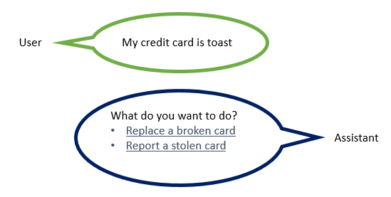

---

copyright:
  years: 2015, 2019
lastupdated: "2019-08-06"

keywords: context, context variable, digression, disambiguation, autocorrection, spelling correction, spell check, confidence 

subcollection: assistant

---

{:shortdesc: .shortdesc}
{:new_window: target="_blank"}
{:deprecated: .deprecated}
{:important: .important}
{:note: .note}
{:tip: .tip}
{:pre: .pre}
{:codeblock: .codeblock}
{:screen: .screen}
{:javascript: .ph data-hd-programlang='javascript'}
{:java: .ph data-hd-programlang='java'}
{:python: .ph data-hd-programlang='python'}
{:swift: .ph data-hd-programlang='swift'}
{:gif: data-image-type='gif'}

# Mode de traitement du dialogue
{: #dialog-runtime}

Cette rubrique vous permet de comprendre comment votre dialogue est traité lorsqu'une personne interagit avec votre instance du service {{site.data.keyword.conversationshort}} déployé lors de l'exécution.
{: shortdesc}

## Anatomie d'un appel de dialogue
{: #dialog-runtime-message-anatomy}

Chaque énoncé utilisateur est transmis au dialogue en tant qu'appel d'API /message. Cela inclut les énoncés que les utilisateurs utilisent pour répondre aux invites du dialogue leur demandant des informations supplémentaires. Certains forfaits d'abonnement incluent un nombre défini d'appels d'API, par conséquent, il peut être utile de comprendre ce qui constitue un appel. Un appel d'API /message simple équivaut à un échange de dialogue simple, qui est constitué d'une entrée provenant de l'utilisateur et d'une réponse correspondante provenant du dialogue.

Le corps de la demande et de la réponse d'appel d'API /message comprend les objets suivants :

- `context` : contient des variables destinées à être conservées. Pour faire passer des informations d'un appel à un autre, le développeur d'applications doit transmettre le contexte de réponse de l'appel d'API précédent avec chaque appel d'API suivant. Par exemple, le dialogue peut collecter le nom de l'utilisateur, puis désigner ce dernier par son nom dans les noeuds suivants. L'exemple suivant montre comment l'objet de contexte est représenté dans l'éditeur JSON de dialogue :

  ```json
  {
    "context" : {
      "user_name" : "<? @sys-person.literal ?>"
    }
  ```
  {: codeblock}

  Pour plus d'informations, reportez-vous à la rubrique [Conservation d'informations entre chaque échange de dialogue](#dialog-runtime-context).

- `input` : chaîne de texte qui a été soumise par l'utilisateur. La chaîne de texte peut contenir jusqu'à 2 048 caractères. L'exemple suivant montre comment l'objet d'entrée est représenté dans l'éditeur JSON de dialogue :

  ```json
  {
    "input": {
      "text" : "Où est votre magasin le plus proche ?"
    }
  ```
  {: codeblock}

- `output` : réponse du dialogue à renvoyer à l'utilisateur. L'exemple suivant montre comment l'objet de sortie est représenté dans l'éditeur JSON de dialogue :

  ```json
  {
  "output": {
    "generic":[
      {
        "values": [
          {
            "text": "Voici le texte de ma réponse."
          }
        ],
        "response_type": "text",
        "selection_policy": "sequential"
      }
    ]
  }
  }
  ```
  {: codeblock}

Dans la réponse API/message obtenue, la réponse textuelle est formatée comme suit :

```json
{
   "text": "Voici le texte de ma réponse.",
   "response_type": "text"
}
```

Le format JSON d'objet `output` suivant est pris en charge pour la compatibilité amont. Tous les espaces de travail qui spécifient une réponse textuelle à l'aide de ce format continueront à fonctionner correctement. Avec l'introduction des types de réponse enrichie, la structure `output.text` a été augmentée par la structure `output.generic` pour faciliter la prise en charge d'autres types de réponses, outre le texte. Utilisez le nouveau format lorsque vous créez de nouveaux noeuds pour vous obtenir plus de flexibilité, car vous pourrez ultérieurement modifier le type de réponse, si nécessaire.
{: note}

  ```json
  {
  "output": {
    "text": {
      "values": [
        "Voici le texte de ma réponse."
      ]
    }
  }
  ```
  {: codeblock}

Il existe des types de réponse autres qu'une réponse textuelle que vous pouvez définir. Pour plus d'informations, reportez-vous à la rubrique [Réponses](/docs/services/assistant?topic=assistant-dialog-overview#dialog-overview-responses).

Pour en savoir plus sur l'appel d'API /message, reportez-vous à la documentation [API reference ](https://{DomainName}/apidocs/assistant-v2){: new_window}.

### Conservation d'informations entre chaque échange de dialogue
{: #dialog-runtime-context}

Le dialogue dans une compétence de dialogue est sans état, ce qui signifie qu'il ne conserve aucune information entre chaque interaction avec l'utilisateur. Lorsque vous ajoutez une compétence de dialogue à un assistant et que vous la déployez, celui-ci
enregistre le contexte d'un appel de message, puis le soumet à nouveau à la demande suivante tout au long de la session en cours. La session en cours dure aussi longtemps qu'un utilisateur interagit avec l'assistant, puis jusqu'à 60 minutes d'inactivité pour les forfaits Plus ou Premium (5 minutes pour les forfaits Lite ou Standard). Si vous n’ajoutez pas la compétence de dialogue à un assistant, il est de votre responsabilité, en tant que développeur d’applications personnalisées, de conserver les informations permanentes nécessaires à l’application. L'application doit rechercher et stocker l'objet contextuel dans la réponse d'API de message et la transmettre dans l'objet contextuel avec la demande d'API /message suivante qui est effectuée dans le cadre du flux de conversation.

Une façon de conserver les informations vous-même consiste à stocker l'intégralité de l'objet contextuel en mémoire dans l'application client, dans un navigateur Web, par exemple. A mesure qu'une application devient plus complexe, ou si elle a besoin de transmettre et stocker des informations identifiant la personne, vous pouvez stocker et extraire les informations à partir d'une base de données. Bien sûr, l'approche la plus simple est celle qui vous évite d'avoir à stocker du contexte. Pour mettre en oeuvre cette approche, ajoutez la compétence de dialogue à un assistant et laissez-le suivre le contexte pour vous.

L'application peut transmettre des informations au dialogue, et le dialogue peut mettre à jour ces informations et les transmettre en retour à l'application ou à un noeud suivant. Pour cela, le dialogue utilise des *variables contextuelles*.

## Variables contextuelles
{: #dialog-runtime-context-variables}

Une variable contextuelle est une variable que vous définissez dans un noeud. Vous pouvez spécifier une valeur par défaut pour cette variable. D'autres noeuds, la logique d'application ou une entrée utilisateur peuvent ultérieurement définir ou modifier la valeur de la variable contextuelle.

Vous pouvez définir des conditions par rapport à des valeurs de variable contextuelle en référençant une variable contextuelle à partir d'une condition de noeud de dialogue afin de déterminer si un noeud doit être exécuté. Vous pouvez également référencer une variable contextuelle à partir de conditions de réponse de noeud de dialogue afin d'afficher différentes réponses en fonction d'une valeur fournie par un service externe ou par l'utilisateur.

En savoir plus :

- [Transmission de contexte à partir de l'application](#dialog-runtime-context-from-app)
- [Transmission de contexte d'un noeud à un autre](#dialog-runtime-context-node-to-node)
- [Définition d'une variable contextuelle](#dialog-runtime-context-var-define)
- [Tâches de variable contextuelle courantes](#dialog-runtime-context-common-tasks)
- [Suppression d'une variable contextuelle](#dialog-runtime-context-delete)
- [Mise à jour d'une variable contextuelle](#dialog-runtime-context-update)
- [Comment les variables contextuelles sont traitées](#dialog-runtime-context-processing)
- [Ordre des opérations](#dialog-runtime-context-order-of-ops)
- [Ajout de variables contextuelles à un noeud doté d'attributs](#dialog-runtime-context-var-slots)

### Transmission de contexte à partir de l'application
{: #dialog-runtime-context-from-app}

Transmettez des informations de l'application au dialogue en définissant une variable contextuelle et en transmettant celle-ci au dialogue.

Par exemple, votre application peut définir une variable contextuelle $time_of_day et la transmettre au dialogue, lequel peut utiliser cette information afin de personnaliser le message d'accueil à afficher pour l'utilisateur.


Dans cet exemple, le dialogue sait que l'application définit la variable avec l'une des valeurs suivantes : *morning*, *afternoon* ou *evening*. Il peut rechercher chaque valeur, et selon la valeur qui est présente, renvoyer le message d'accueil approprié. Si la variable n'est pas transmise ou comporte une valeur qui ne correspond à aucune des valeurs prévues, l'utilisateur voit s'afficher un message d'accueil plus générique.

### Transmission de contexte d'un noeud à un autre
{: #dialog-runtime-context-node-to-node}

Le dialogue peut également ajouter des variables contextuelles pour transmettre des informations d'un noeud à un autre ou pour mettre à jour les valeurs de variables contextuelles. A mesure que le dialogue demande et obtient des informations auprès de l'utilisateur, il peut suivre les informations et les référencer ultérieurement dans la conversation.

Par exemple, dans un noeud, vous pouvez demander leur nom à des utilisateurs, et dans un noeud ultérieur, vous pouvez vous adresser à eux directement par leur nom.


Dans cet exemple, l'entité de système @sys-person est utilisée pour extraire le nom de l'utilisateur de l'entrée si l'utilisateur le communique. Dans l'éditeur JSON, la variable contextuelle $username est définie avec la valeur @sys-person. Dans un noeud suivant, la variable contextuelle $username est incluse dans la réponse pour s'adresser à l'utilisateur par son nom.

### Définition d'une variable contextuelle
{: #dialog-runtime-context-var-define}

Définissez une variable contextuelle en ajoutant le nom de la variable à la zone **Variable** et en lui attribuant une valeur par défaut dans la zone **Value** dans la vue édition du noeud.

1.  Cliquez pour ouvrir le noeud de dialogue auquel vous souhaitez ajouter une variable contextuelle.

1.  Cliquez sur l'icône **Options**  qui est associée à la réponse du noeud, puis cliquez sur **Open context editor**.

      

      Si le paramètre **Multiple responses** est activé (**On**) pour le noeud, vous devez d'abord cliquer sur l'icône d'**édition de réponse**  pour la réponse à laquelle vous souhaitez associer la variable contextuelle.

      

1.  Ajoutez la paire nom-valeur de la variable dans les zones **Variable** et **Valeur**.

    - Le `nom` peut contenir des caractères alphabétiques majuscules et minuscules, des caractères numériques (0-9) et des traits de soulignement.

      Vous pouvez inclure d'autres caractères, par exemple, des points et des traits d'union, dans le nom. Cependant, dans ce cas, vous devez spécifier la syntaxe abrégée `$(variable-name)` chaque fois que vous faites ensuite référence à la variable. Pour plus d'informations, reportez-vous à la rubrique [Expressions permettant d'accéder à des objets](/docs/services/assistant?topic=assistant-expression-language#expression-language-shorthand-context).
      {:tip}

    - La `valeur` peut correspondre à n'importe quel type JSON pris en charge, par exemple, une variable de chaîne simple, un nombre, un tableau JSON ou un objet JSON.

Le tableau suivant montre quelques exemples sur la manière de définir des paires nom-valeur pour différents types de valeurs :

| Variable       | Valeur                         | Type de valeur |
|:---------------|-------------------------------|------------|
| dessert        | "gâteau"                        | Chaîne     |
| age            | 18                            | Nombre     |
| toppings_array | ["oignons","olives"]            | Tableau JSON |
| full_name      | {"first":"Anne","last":"Onyme"} | Objet JSON |

Pour faire référence par la suite à ces variables contextuelles, utilisez la syntaxe `$name` où *name* est le nom de la variable contextuelle que vous avez définie.

Par exemple, vous pouvez spécifier l'expression suivante comme réponse du dialogue :

`Le client, $age-year-old <? $full_name.first ?>, veut une pizza avec <? $toppings_array.join(' and ') ?>, puis $dessert.`

Le résultat obtenu est affiché comme suit :

`Le client, John, âgé de 18 ans, veut une pizza avec des oignons et des olives, puis un gâteau.`

Vous pouvez également utiliser l'éditeur JSON pour définir des variables contextuelles. Vous préférerez peut-être utiliser l'éditeur JSON si vous souhaitez ajouter une expression complexe en tant que valeur de variable. Pour plus d'informations, reportez-vous à la section [Variables contextuelles dans l'éditeur JSON](#dialog-runtime-context-var-json).

### Tâches de variable contextuelle courantes
{: #dialog-runtime-context-common-tasks}

Pour stocker l'intégralité de la chaîne qui a été fournie en entrée par l'utilisateur, utilisez `input.text` :

| Variable | Valeur            |
|----------|------------------|
| repeat   | `<?input.text?>` |

Par exemple, l'entrée utilisateur est `Je voudrais commander un appareil.` Si la réponse du noeud est `Vous avez dit : $repeat`, alors la réponse apparaît comme suit `Vous avez dit : Je voudrais commander un appareil.`

Pour stocker la valeur d'une entité dans une variable contextuelle, utilisez la syntaxe suivante :

| Variable | Valeur            |
|----------|------------------|
| place    | `@place`         |

Par exemple, l'entrée utilisateur est `Je voudrais aller à Paris.` Si votre entité `@place` reconnaît `Paris`, l'assistant enregistre `Paris` dans la variable contextuelle `$place`. 

Pour stocker la valeur d'une chaîne que vous extrayez à partir de l'entrée utilisateur, vous pouvez inclure une expression SpEL qui utilise la méthode `extract` afin d'appliquer une expression régulière à l'entrée utilisateur. L'expression décrite ci-après extrait un nombre de l'entrée utilisateur et le sauvegarde dans la variable contextuelle `$number`.

| Variable | Valeur                               |
|----------|-------------------------------------|
| number   | `<?input.text.extract('[\d]+',0)?>` |

Pour stocker la valeur d'une entité de canevas, ajoutez .literal au nom d'entité. L'utilisation de cette syntaxe permet de s'assurer que le passage de texte issu d'une entrée utilisateur qui correspondait exactement au canevas spécifié est stocké dans la variable.

| Variable | Valeur                  |
|----------|------------------------|
| email    | `<? @email.literal ?>` |

Par exemple, l'entrée utilisateur est `Contactez-moi sur anne@exemple.com.` Votre entité nommée `@email` reconnaît le format de courrier électronique `name@domain.com`. En configurant la variable contextuelle pour stocker `@email.literal`, vous indiquez que vous souhaitez stocker la partie de l'entrée qui correspond au canevas. Si vous omettez la propriété `.literal` de l'expression de valeur, le nom de la valeur d'entité que vous avez spécifié pour le canevas est renvoyé au lieu du segment d'entrée utilisateur correspondant au canevas.

Bon nombre de ces exemples de valeur utilisent des méthodes pour capturer différentes parties de l'entrée utilisateur. Pour plus d'informations sur les méthodes disponibles, reportez-vous à la rubrique [Méthodes de langage d'expression](/docs/services/assistant?topic=assistant-dialog-methods).

### Suppression d'une variable contextuelle
{: #dialog-runtime-context-delete}

Pour supprimer une variable contextuelle, affectez la valeur NULL à cette variable.

| Variable   | Valeur            |
|------------|------------------|
| order_form | `null`           |

Vous pouvez également supprimer la variable contextuelle dans votre logique d'application. Pour plus d'informations sur la suppression complète de la variable, reportez-vous à la rubrique [Suppression d'une variable contextuelle en JSON](#dialog-runtime-context-delete-json).

### Mise à jour d'une valeur de variable contextuelle
{: #dialog-runtime-context-update}

Pour mettre à jour la valeur d'une variable contextuelle, définissez une variable contextuelle portant le même nom que la variable contextuelle précédente, mais cette fois, spécifiez une valeur différente pour celle-ci.

Lorsque plusieurs noeuds définissent la valeur de la même variable contextuelle, la valeur de la variable contextuelle peut changer au cours d'une conversation avec un utilisateur. La valeur appliquée à un moment donné dépend du noeud déclenché par l'utilisateur au cours de la conversation. La valeur spécifiée pour la variable contextuelle dans le dernier noeud traité remplace toutes les valeurs définies pour la variable par les noeuds traités précédemment.

Pour plus d'informations sur la mise à jour de la valeur d'une variable contextuelle lorsque celle-ci est un objet JSON ou un type de données de tableau JSON, reportez-vous à la rubrique [Mise à jour d'une valeur de variable contextuelle en JSON](#dialog-runtime-context-update-json).

### Comment les variables contextuelles sont traitées
{: #dialog-runtime-context-processing}

L'emplacement où vous définissez la variable contextuelle est important. La variable contextuelle n'est pas créée et définie sur la valeur que vous spécifiez jusqu'à ce que l'assistant traite la partie du noeud de dialogue dans laquelle vous avez défini la variable contextuelle. Dans la plupart des cas, vous définissez la variable contextuelle dans le cadre de la réponse du noeud. Lorsque vous procédez ainsi, la variable contextuelle est créée et reçoit la valeur spécifiée lorsque l'assistant renvoie la réponse du noeud. 

Pour un noeud avec des réponses conditionnelles, la variable contextuelle est créée et définie lorsque la condition pour une réponse spécifique est remplie et que cette réponse est traitée. Par exemple, si vous définissez une variable contextuelle pour la réponse conditionnelle n° 1 et que l'assistant traite la réponse conditionnelle n° 2 uniquement, la variable contextuelle que vous avez définie pour la réponse conditionnelle n° 1 n'est pas créée ni définie. 

Pour plus d'informations sur les emplacements où ajouter les variables contextuelles que l'assistant doit créer et définir lorsqu'un utilisateur interagit avec un noeud doté d'attributs, reportez-vous à la rubrique [Ajout de variables contextuelles à un noeud doté d'attributs](#dialog-runtime-context-var-slots).

### Ordre des opérations
{: #dialog-runtime-context-order-of-ops}

Lorsque vous définissez plusieurs variables à traiter ensemble, l'ordre dans lequel vous les définissez ne détermine pas l'ordre dans lequel elles sont évaluées par l'assistant. L'assistant évalue les variables dans un ordre aléatoire. Si vous définissez une valeur dans la première variable contextuelle de la liste, ne vous attendez pas à pouvoir l'utiliser dans la seconde variable de la liste, car rien ne garantit que la première variable contextuelle sera exécutée avant la seconde. Par exemple, n'utilisez pas deux variables contextuelles pour implémenter une logique qui vérifie si l'entrée utilisateur contient le mot `Oui`.

| Variable        | Valeur            |
|-----------------|------------------|
| user_input      | <? input.text ?> |
| contains_yes    | <? $user_input.contains('Oui') ?> |

Utilisez plutôt une expression légèrement plus complexe pour éviter de devoir compter sur la valeur de la première variable de votre liste (user_input) en cours d'évaluation avant l'évaluation de la seconde variable (contains_yes).

| Variable      | Valeur            |
|---------------|------------------|
| contains_yes  | <? input.text.contains('Oui') ?> |

### Ajout de variables contextuelles à un noeud doté d'attributs
{: #dialog-runtime-context-var-slots}

Pour plus d'informations sur les attributs, reportez-vous à la rubrique [Collecte d'informations à l'aide d'attributs](/docs/services/assistant?topic=assistant-dialog-slots).

1.  Ouvrez le noeud avec attributs dans la vue édition.

    - Pour ajouter une variable contextuelle qui est traitée après qu'une condition de réponse pour un attribut est remplie, procédez comme suit :

      1.  Cliquez sur l'icône d'**édition d'attribut** .
      1.  Cliquez sur l'icône **Options** , puis sélectionnez **Enable conditional responses**.
      1.  Cliquez sur l'icône d'**édition de réponse**  située en regard de la réponse à laquelle vous souhaitez associer la variable contextuelle.
      1.  Cliquez sur l'icône **Options**  dans la section de réponse, puis cliquez sur **Open context editor**.
      1.  Ajoutez la paire nom-valeur de la variable dans les zones **Variable** et **Valeur**.

      

    - Pour ajouter une variable contextuelle qui est définie ou mise à jour après qu'une condition d'attribut est remplie, procédez comme suit :

      1.  Cliquez sur l'icône d'**édition d'attribut** .
      1.  A partir du menu **Options**  dans l'en-tête de vue *Configure slot*, cliquez sur **Open JSON editor**.
      1.  Ajoutez la paire nom-valeur de la variable au format JSON.

          ```json
          {
            "time_of_day": "morning"
          }
          ```
          {: codeblock}

      Actuellement, il n'est pas possible d'utiliser l'éditeur de contexte pour définir des variables contextuelles qui sont définies durant cette phase de l'évaluation de noeud de dialogue. Vous devez utiliser l'éditeur JSON à la place. Pour plus d'informations sur l'utilisation de l'éditeur JSON, reportez-vous à la rubrique [Variables contextuelles dans l'éditeur JSON](#dialog-runtime-context-var-json).
      {: note}

      

## Variables contextuelles dans l'éditeur JSON
{: #dialog-runtime-context-var-json}

Vous pouvez également définir une variable contextuelle dans l'éditeur JSON. Vous voudrez peut-être utiliser l'éditeur JSON si vous définissez une variable contextuelle complexe et souhaitez voir l'expression SpEL complète lorsque vous l'ajoutez ou la modifiez.

La paire nom-valeur doit répondre aux exigences suivantes :

- Le `nom` peut contenir des caractères alphabétiques majuscules et minuscules, des caractères numériques (0-9) et des traits de soulignement.

  Vous pouvez inclure d'autres caractères, par exemple, des points et des traits d'union, dans le nom. Cependant, dans ce cas, vous devez spécifier la syntaxe abrégée `$(variable-name)` chaque fois que vous faites ensuite référence à la variable. Pour plus d'informations, reportez-vous à la rubrique [Expressions permettant d'accéder à des objets](/docs/services/assistant?topic=assistant-expression-language#expression-lanaguage-shorthand-context).
  {:tip}

- La `valeur` peut correspondre à n'importe quel type JSON pris en charge, par exemple, une variable de chaîne simple, un nombre, un tableau JSON ou un objet JSON.

L'exemple JSON suivant définit des valeurs pour les variables contextuelles d'objet $dessert string, $toppings_array, $age number et $full_name :

```json
{
  "context": {
    "dessert": "gâteau",
    "toppings_array": [
      "oignons",
      "olives"
    ],
    "age": 18,
    "full_name": {
      "first": "Anne",
      "last": "Onyme"
    }
  },
         "output": {}
       }
```
{: codeblock}

Pour définir une variable contextuelle au format JSON, procédez comme suit :

1.  Cliquez pour ouvrir le noeud de dialogue auquel vous souhaitez ajouter la variable contextuelle.

    Toutes les valeurs de variable contextuelle existantes qui sont définies pour ce noeud sont affichées dans un ensemble de zones **Variable** et **Valeur** correspondantes. Si vous ne voulez pas qu'elles apparaissent dans la vue d'édition du noeud, vous devez fermer l'éditeur de contexte. La fermeture de l'éditeur peut se faire à partir du même menu que pour l'ouverture de l'éditeur JSON ; les étapes permettant d'accéder à ce menu sont décrites ci-après.
    {: note}

1.  Cliquez sur l'icône **Options**  qui est associée à la réponse, puis cliquez sur **Open JSON editor**.

    

    Si le paramètre **Multiple responses** est activé (**On**) pour le noeud, vous devez d'abord cliquer sur l'icône d'**édition de réponse**  pour la réponse à laquelle vous souhaitez associer la variable contextuelle.

    

1.  Ajoutez un bloc `"context":{}`, le cas échéant.

    ```json
    {
      "context":{},
      "output":{}
    }
    ```
    {: codeblock}

1.  Dans le bloc context, ajoutez une paire `"name"` et `"value"` pour chaque variable contextuelle que vous souhaitez définir.

    ```json
    {
      "context":{
        "name": "value"
    },
         "output": {}
       }
    ```
    {: codeblock}

    Dans cet exemple, une variable nommée `new_variable` est ajoutée à un bloc context qui contient déjà une variable.

    ```json
    {
      "context":{
        "existing_variable": "value",
        "new_variable":"value"
      }
    }
    ```
    {: codeblock}

    Pour faire référence par la suite à la variable contextuelle, utilisez la syntaxe `$name` où *name* est le nom de la variable contextuelle que vous avez définie. Par exemple, `$new_variable`.

En savoir plus :

- [Suppression d'une variable contextuelle en JSON](#dialog-runtime-context-delete-json)
- [Mise à jour d'une variable contextuelle en JSON](#dialog-runtime-context-update-json)
- [Définition d'une variable contextuelle égale à une autre](#dialog-runtime-var-equals-var)

### Suppression d'une variable contextuelle en JSON
{: #dialog-runtime-context-delete-json}

Pour supprimer une variable contextuelle, affectez la valeur NULL à cette variable.

```json
{
  "context": {
    "order_form": null
  }
}
```
{: codeblock}

Si vous souhaitez retirer toute trace de la variable contextuelle, vous pouvez utiliser la méthode JSONObject.remove(string) pour la supprimer de l'objet contextuel. Toutefois, vous devez utiliser une variable pour effectuer la suppression. Définissez la nouvelle variable dans la sortie du message pour qu'elle ne soit pas sauvegardée au-delà de l'appel en cours.

```json
{
  "output": {
    "text" : {},
    "deleted_variable" : "<? context.remove('order_form') ?>"
  }
}
```
{: codeblock}

Vous pouvez également supprimer la variable contextuelle dans votre logique d'application.

### Mise à jour d'une variable contextuelle en JSON
{: #dialog-runtime-context-update-json}

En général, si un noeud définit la valeur d'une variable contextuelle qui est déjà définie, la valeur précédente est écrasée par la nouvelle valeur.

#### Mise à jour d'un objet JSON complexe

Les valeurs précédentes sont écrasées pour tous les types JSON, sauf un objet JSON. Si la variable contextuelle est un type complexe, par exemple, un objet JSON, une procédure de fusion JSON est utilisée pour mettre à jour la variable. L'opération de fusion ajoute les propriétés nouvellement définies pour l'objet et écrase les propriétés existantes.

Dans l'exemple ci-dessous, une variable contextuelle de nom est définie en tant qu'objet complexe :

```json
{
  "context": {
    "complex_object": {
      "user_firstname" : "Paul",
      "user_lastname" : "Pan",
      "has_card" : false
    }
  }
}
```
{: codeblock}

Un noeud de dialogue met à jour l'objet JSON de variable contextuelle avec les valeurs suivantes :

```json
{
  "complex_object": {
    "user_firstname": "Peter",
    "has_card": true
  }
}
```
{: codeblock}

Le résultat obtenu est le contexte suivant :

```json
{
  "complex_object": {
    "user_firstname": "Peter",
    "user_lastname": "Pan",
    "has_card": true
  }
}
```
{: codeblock}

Pour plus d'informations sur les méthodes que vous pouvez exécuter sur des objets, reportez-vous à la rubrique [Méthodes de langage d'expression](/docs/services/assistant?topic=assistant-dialog-methods#dialog-methods-objects).

#### Mise à jour de tableaux

Si les données contextuelles de votre dialogue contiennent un tableau de valeurs, vous pouvez mettre à jour ce tableau en ajoutant des valeurs, en retirant des valeurs ou en remplaçant toutes les valeurs.

Choisissez l'une des actions répertoriées ci-après pour mettre à jour le tableau. Pour chaque cas, le tableau est décrit avant et après l'action, et entre ces deux descriptions, l'action proprement dite est présentée.

- **Action d'ajout** : pour ajouter des valeurs à la fin d'un tableau, utilisez la méthode `append`.

    Pour le contexte d'exécution de dialogue suivant :

    ```json
    {
      "context": {
        "toppings_array": ["oignons", "olives"]
      }
    }
    ```
    {: codeblock}

    Effectuez la mise à jour suivante :

    ```json
    {
      "context": {
        "toppings_array": "<? $toppings_array.append('ketchup', 'tomates') ?>"
      }
    }
    ```
    {: codeblock}

    Résultat :

    ```json
    {
      "context": {
        "toppings_array": ["oignons", "olives", "ketchup", "tomates"]
      }
    }
    ```
    {: codeblock}

- **Action de retrait** : pour retirer un élément, utilisez la méthode `remove` et spécifiez sa valeur ou sa position dans le tableau.

    - **Action de retrait par valeur** : permet de retirer un élément d'un tableau en utilisant sa valeur.

        Pour le contexte d'exécution de dialogue suivant :

        ```json
        {
          "context": {
            "toppings_array": ["oignons", "olives"]
      }
        }
        ```
        {: codeblock}

        Effectuez la mise à jour suivante :

        ```json
        {
          "context": {
            "toppings_array": "<? $toppings_array.removeValue('oignons') ?>"
          }
        }
        ```
        {: codeblock}

        Résultat :

        ```json
        {
          "context": {
            "toppings_array": ["olives"]
          }
        }
        ```
        {: codeblock}

    - **Action de retrait par position** : permet de retirer un élément d'un tableau en utilisant sa position dans l'index.

        Pour le contexte d'exécution de dialogue suivant :

        ```json
        {
          "context": {
            "toppings_array": ["oignons", "olives"]
      }
        }
        ```
        {: codeblock}

        Effectuez la mise à jour suivante :

        ```json
        {
          "context": {
            "toppings_array": "<? $toppings_array.remove(0) ?>"
          }
        }
        ```
        {: codeblock}

        Résultat :

        ```json
        {
          "context": {
            "toppings_array": ["olives"]
          }
        }
        ```
        {: codeblock}

- **Action d'écrasement** : pour écraser les valeurs contenues dans un tableau, il suffit de définir le tableau avec les nouvelles valeurs.

    Pour le contexte d'exécution de dialogue suivant :

        ```json
        {
          "context": {
            "toppings_array": ["oignons", "olives"]
      }
        }
        ```
        {: codeblock}

    Effectuez la mise à jour suivante :

        ```json
        {
          "context": {
            "toppings_array": ["ketchup", "tomates"]
          }
        }
        ```
        {: codeblock}

    Résultat :

        ```json
        {
          "context": {
            "toppings_array": ["ketchup", "tomates"]
          }
        }
        ```
        {: codeblock}

Pour plus d'informations sur les méthodes que vous pouvez exécuter sur des tableaux, reportez-vous à la rubrique [Méthodes de langage d'expression](/docs/services/assistant?topic=assistant-dialog-methods#dialog-methods-arrays).

### Définition d'une variable contextuelle égale à une autre
{: #dialog-runtime-var-equals-var}

Lorsque vous définissez une variable contextuelle égale à une autre variable contextuelle, vous définissez un pointeur de l'une à l'autre. Si la valeur de l'une des variables change par la suite, la valeur de l'autre variable est également modifiée.

Par exemple, si vous spécifiez une variable contextuelle comme suit, alors, lorsque la valeur de `$var1` ou `$var2` change par la suite, la valeur de l'autre change également.

| Variable  | Valeur  |
|-----------|--------|
| var2      | var1   |

Ne définissez pas une variable égale à une autre pour capturer une valeur de point dans le temps. Par exemple, lorsqu’il s’agit de tableaux, si vous souhaitez capturer une valeur de tableau stockée dans une variable contextuelle à un moment donné dans le dialogue pour la sauvegarder en vue d’une utilisation ultérieure, vous pouvez créer une nouvelle variable en fonction de la valeur actuelle de la variable.

Par exemple, pour créer une copie des valeurs d'un tableau à un certain point du flux de dialogue, ajoutez un nouveau tableau rempli avec les valeurs du tableau existant. Pour ce faire, vous pouvez utiliser la syntaxe suivante :

```json
{
"context": {
   "var2": "<? output.var2?:new JsonArray().append($var1) ?>"
 }
 }
 ```
{: codeblock}

## Digressions
{: #dialog-runtime-digressions}

Une digression se produit lorsqu'un utilisateur, qui est en plein milieu d'un flux de dialogue conçu pour traiter un objectif, change brutalement de sujet pour initier un flux de dialogue conçu pour traiter un autre objectif. Le dialogue a toujours pris en charge la possibilité pour l'utilisateur de changer de sujet. Si aucun des noeuds présents dans la branche de dialogue en cours de traitement ne correspond à l'objectif de la dernière entrée utilisateur, la conversation revient à l'arborescence afin de rechercher une correspondance appropriée pour les conditions de noeud racine. Les paramètres de digression disponibles au niveau noeud vous permettent de personnaliser davantage ce comportement.

Grâce aux paramètres de digression, vous pouvez autoriser la conversation à revenir au flux de dialogue qui a été interrompu lorsque la digression est survenue. Par exemple, l'utilisateur est en train de commander un nouveau téléphone, mais il pose une question relative aux tablettes. Votre dialogue peut répondre à la question portant sur les tablettes, puis ramener l'utilisateur là où il s'était arrêté dans le processus de commande d'un téléphone. Le fait d'autoriser des digressions et le retour dans le flux de dialogue initial offre aux utilisateurs la possibilité de mieux contrôler le flux de la conversion durant la phase d'exécution. Ils peuvent changer de sujet, suivre jusqu'au bout le flux de dialogue lié à l'autre sujet qui est sans rapport avec le premier, puis revenir là où ils étaient avant. Le résultat est un flux de dialogue qui simule de manière plus réaliste une conversion entre humains.

{: gif}

L'image animée ci-après utilise une maquette de l'interface utilisateur d'arborescence de dialogue pour illustrer le concept de digression. Elle montre comment un utilisateur interagit avec des noeuds de dialogue qui sont configurés pour autoriser des digressions qui permettent de revenir au flux de dialogue qui était en cours. l'utilisateur commence à fournir les informations requises afin de réserver une table pour dîner. Alors qu'il est en train de remplir les attributs du noeud #reservation, l'utilisateur pose une question sur les options du menu végétarien. Le dialogue répond à la nouvelle question de l'utilisateur en recherchant parmi les noeuds racine un noeud qui traite de cette question (un noeud conditionné par l'intention #cuisine). Il revient ensuite à la conversation qui était en cours en affichant l'invite pour l'attribut vide suivant du noeud de dialogue initial.

Regardez cette vidéo pour en savoir plus.

<iframe class="embed-responsive-item" id="youtubeplayer" title="Présentation des digressions" type="text/html" width="640" height="390" src="https://www.youtube.com/embed/I3K7mQ46K3o?rel=0" frameborder="0" webkitallowfullscreen mozallowfullscreen allowfullscreen> </iframe>

- [Avant de commencer](#dialog-runtime-digression-prereqs)
- [Personnalisation des digressions](#dialog-runtime-enable-digressions)
- [Conseils relatifs à l'utilisation des digressions](#dialog-runtime-digress-tips)
- [Désactivation des digressions dans un noeud racine](#dialog-runtime-disable-digressions)
- [Tutoriel sur les digressions](#dialog-runtime-digression-tutorial)
- [Remarques relatives à la conception](#dialog-runtime-digression-design-considerations)

### Avant de commencer
{: #dialog-runtime-digression-prereqs}

Lorsque vous testez l'ensemble de votre dialogue, décidez quand et où il est judicieux d'autoriser des digressions et des retours à partir de ces digressions. Les contrôles de digression ci-après s'appliquent automatiquement aux noeuds. Vous ne devez effectuer une action que si vous souhaitez modifier ce comportement par défaut.

- Chacun des noeuds racine de votre dialogue est configuré pour permettre aux digressions de les cibler par défaut. Les noeuds enfant ne peuvent pas être la cible d'une digression.
- Les noeuds avec des attributs sont configurés pour empêcher les digressions sortantes. Tous les autres noeuds sont configurés pour autoriser les digressions sortantes. Toutefois, la conversation ne peut pas faire digression à partir d'un noeud dans les circonstances suivantes :

  - Si l'un des noeuds enfant du noeud en cours contient la condition `anything_else` ou `true`.

    Ces conditions sont spéciales car elles renvoient toujours la valeur true. Etant donné leur comportement connu, elles sont souvent utilisées dans des dialogues pour forcer un noeud parent à évaluer un noeud enfant spécifique, de manière successive. Pour empêcher l'interruption d'une logique de flux de dialogue existante, la digression n'est pas autorisée dans ce cas. Avant de pouvoir activer des digressions à partir de ce type de noeud, vous devez modifier la condition du noeud enfant.

  - Si le noeud est configuré pour accéder directement à un autre noeud ou ignorer l'entrée utilisateur après son traitement.

    La section d'étape finale d'un noeud spécifie ce qu'il doit advenir une fois que le noeud est traité. Souvent, le dialogue est configuré pour accéder directement à un autre noeud dans le but de s'assurer qu'une séquence spécifique est suivie. Et lorsque le noeud est configuré pour ignorer l'entrée utilisateur, cela revient à forcer le dialogue à traiter le premier noeud enfant après le noeud en cours, de manière successive. Pour empêcher l'interruption d'une logique de flux de dialogue existante, les digressions ne sont autorisées dans aucun de ces cas. Avant de pouvoir activer des digressions à partir de ce noeud, vous devez modifier ce qui est spécifié dans la section d'étape finale.

### Personnalisation des digressions
{: #dialog-runtime-enable-digressions}

Vous ne pouvez pas définir le début et la fin d'une digression. L'utilisateur contrôle entièrement le flux de digression durant la phase d'exécution. Vous spécifiez uniquement si un noeud peut ou non participer à une digression dirigée par un utilisateur. Pour chaque noeud, vous configurez :

- si une digression peut démarrer à partir du noeud et le quitter ;
- si une digression qui démarre ailleurs peut cibler le noeud et y entrer ;
- si une digression qui démarre ailleurs et entre dans le noeud doit retourner au flux de dialogue interrompu une fois le flux de dialogue en cours terminé.

Pour modifier le comportement de digression d'un noeud individuel, procédez comme suit :

1.  Cliquez sur le noeud pour ouvrir sa vue édition.

1.  Cliquez sur **Customize**, puis sur l'onglet **Digressions**.

    Les options de configuration diffèrent selon que le noeud que vous éditez est un noeud racine, un noeud enfant, un noeud avec enfants ou un noeud avec attributs.

    **Digressions à partir de ce noeud**

    Si les circonstances mentionnées précédemment ne s'appliquent pas, les options que vous pouvez sélectionner sont les suivantes :

    - **All node types** : indiquez si vous autorisez ou non les utilisateurs à faire digression à partir du noeud en cours avant d'atteindre la fin de la branche de dialogue en cours.

    - **All nodes that have children** : indiquez si vous souhaitez ou non que la conversation revienne dans le noeud en cours après une digression si la réponse du noeud en cours a déjà été affichée et que ses noeuds enfant sont fortuits pour l'objectif du noeud. Affectez à l'option à bascule *Allow return from digressions triggered after this node's response* la valeur **No** pour empêcher le dialogue de revenir au noeud en cours et de continuer à traiter sa branche.

      Par exemple, si l'utilisateur demande : `Vendez-vous des cupcakes ?` et que la réponse, `Nous avons une grande variété de parfums et de tailles`, s'affiche avant que l'utilisateur change de sujet, vous ne voudrez peut-être pas que le dialogue revienne là où il s'était arrêté. En particulier, si les noeuds enfant traitent uniquement les éventuelles questions de suivi de l'utilisateur et peuvent en toute sécurité être ignorés.

      Toutefois, si le noeud fait appel à ses noeuds enfant pour traiter la question, vous souhaiterez peut-être forcer la conversation à revenir et à continuer à traiter les noeuds de la branche en cours. Par exemple, si la réponse initiale est `Nous avons des cupcakes de toutes les formes et de toutes les tailles. Quel menu souhaitez-vous voir : sans gluten, sans lactose ou ordinaire ?` Si l'utilisateur change de sujet à ce stade, vous souhaiterez peut-être que le dialogue revienne de la digression de manière à permettre à l'utilisateur de choisir un type de menu et d'obtenir les informations souhaitées.

    - **Nodes with slots** : indiquez si vous souhaitez autoriser ou non les utilisateurs à faire digression à partir du noeud avant que tous les attributs soient remplis. Affectez à l'option à bascule *Allow digressions away while slot filling* la valeur **Yes** pour permettre les digressions sortantes.

      Si cette case est cochée, lorsque la conversation revient de la digression, l'invite pour l'attribut non renseigné suivant s'affiche afin d'encourager l'utilisateur à continuer à fournir des informations. Si cette case n'est pas cochée, toutes les entrées que l'utilisateur soumet et qui ne contiennent pas une valeur susceptible de convenir pour un attribut sont ignorées. Toutefois, vous pouvez définir des gestionnaires d'attributs dans le but de prendre en charge des questions non sollicitées dont vous pensez qu'elles seront peut-être posées par vos utilisateurs lors de leur interaction avec le noeud. Pour plus d'informations, reporte-vous à la rubrique [Ajout d'attributs](/docs/services/assistant?topic=assistant-dialog-slots#dialog-slots-add).

      L'illustration suivante montre comment les digressions à partir d'un noeud #reservation avec attributs (présenté dans l'illustration précédente) sont configurées.

      

    - **Nodes with slots** : indiquez si l'utilisateur est autorisé ou non à faire digression à partir d'un noeud seulement s'il revient dans le noeud en cours en cochant la case **Only digress from slots to nodes that allow returns**.

      Lorsque cette case est cochée, dans la mesure où le dialogue recherche un noeud pour répondre à la question hors sujet de l'utilisateur, il ignore les noeuds racine qui ne sont pas configurés pour revenir après la digression. Cochez cette case si vous voulez empêcher les utilisateurs de pouvoir quitter définitivement le noeud avant qu'ils aient terminé de remplir les attributs requis.

    **Digressions dans ce noeud**

    Les choix possibles pour définir le comportement des digressions dans un noeud sont les suivants :

    - Empêcher les utilisateurs de pouvoir faire digression dans le noeud. Pour plus d'informations, reportez-vous à la rubrique [Désactivation des digressions dans un noeud racine](#dialog-runtime-disable-digressions).

    - Lorsque les digressions dans le noeud sont activées, indiquez si le dialogue doit ou non revenir au flux de dialogue à partir duquel il a fait digression. Lorsque cette option est sélectionnée, une fois le traitement de la branche du noeud en cours terminé, le flux de dialogue revient au noeud interrompu. Pour faire en sorte que le dialogue revienne après, sélectionnez **Return after digression**.

    L'illustration suivante montre comment les digressions dans le noeud #cuisine (présenté dans l'illustration précédente) sont configurées.

    

1.  Cliquez sur **Apply**.

1.  Utilisez le panneau "Try it out" pour tester le comportement de digression.

    Là encore, vous ne pouvez pas définir le début et la fin d'une digression. L'utilisateur contrôle où et quand les digressions se produisent. Vous pouvez uniquement appliquer des paramètres qui déterminent de quelle façon un noeud spécifique participe à une digression. Les digressions étant tellement imprévisibles, il est difficile de savoir quel sera l'impact de vos décisions de configuration sur l'ensemble de la conversation. Pour réellement voir l'impact de vos choix, vous devez tester le dialogue.

Les noeuds #reservation et #cuisine représentent deux branches de dialogue qui peuvent participer à une digression dirigée par un utilisateur. Ce sont les paramètres de digression configurés pour chaque noeud spécifique qui rendent ce type de digression possible lors de la phase d'exécution.


### Conseils relatifs à l'utilisation des digressions
{: #dialog-runtime-digress-tips}

Cette section décrit des solutions aux situations que vous pourriez rencontrer lors de l’utilisation de digressions.

- **Message de retour personnalisé** : Pour tous les noeuds pour lesquels vous activez des retours après une digression, envisagez d'ajouter un libellé permettant aux utilisateurs de savoir qu'ils reviennent à l'endroit où ils s'étaient arrêtés dans un flux de dialogue précédent. Dans votre réponse textuelle, utilisez une syntaxe spéciale qui vous permet d’ajouter deux versions de la réponse.

  Si vous n'effectuez aucune action, la même réponse textuelle est affichée une seconde fois pour que les utilisateurs sachent qu'ils sont revenus au noeud dont ils se sont éloignés. Vous pouvez indiquer plus clairement aux utilisateurs qu'ils sont revenus dans le fil de conversation initial en spécifiant un message unique à afficher lors de leur retour.

  Par exemple, si la réponse textuelle d'origine du noeud est `Quel est le numéro de commande ?`, vous pouvez afficher un message du type `Revenons maintenant où nous nous sommes arrêtés. Quel est le numéro de commande ?` lorsque les utilisateurs reviennent au noeud.

  Pour ce faire, utilisez la syntaxe suivante pour spécifier la réponse textuelle du noeud :

  `<? (returning_from_digression)? "post-digression message" : "first-time message" ?>`

  Par exemple :

  ```bash
  <? (returning_from_digression)? "Maintenant, revenons où nous en étions.
  Quel est le numéro de commande ?" : "Quel est le numéro de commande ?" ?>
  ```
  {: codeblock}

  Vous ne pouvez pas inclure d'expressions SpEL ou de syntaxe abrégée dans les réponses textuelles que vous ajoutez. En fait, vous ne pouvez pas utiliser la syntaxe abrégée du tout. Au lieu de cela, vous devez créer le message en concaténant les chaînes de texte et la syntaxe d'expression SpEL complète pour former la réponse complète.
  {: note}
  
  Par exemple, utilisez la syntaxe suivante pour inclure une variable contextuelle dans une réponse textuelle que vous formuleriez normalement comme ceci : `Comment puis-je vous être utile, $username ?` :

  ```bash
  <? (returning_from_digression)? "Où en étions nous, " +
  context["username"] + " ? Ah oui, je vous demandais comment je peux vous être utile." : "Comment puis-je vous être utile, " +
  context["username"] + " ?" ?>
  ```

  Pour plus de détails sur la syntaxe des expressions SpEL, reportez-vous à la rubrique [Expression pour accéder aux objets](/docs/services/assistant?topic=assistant-expression-language#expression-language-shorthand-syntax).

- **Prévention des retours** : Dans certains cas, vous pouvez empêcher le retour au flux de conversation interrompu en fonction du choix fait par l'utilisateur dans le flux de dialogue en cours. Vous pouvez utiliser une syntaxe spéciale pour empêcher un retour à partir d'un noeud spécifique.

  Par exemple, vous pouvez avoir un noeud conditionné par `#General_Connect_To_Agent` ou une intention similaire. Une fois déclenché, si vous souhaitez obtenir la confirmation de l'utilisateur avant de le transférer vers un service externe, vous pouvez ajouter une réponse du type `Voulez-vous que je vous transfère maintenant vers un agent ?` Vous pouvez ensuite ajouter deux noeuds enfants conditionnés respectivement par `#yes` et `#no`.
  
  La meilleure façon de gérer les digressions pour ce type de branche consiste à définir le noeud racine pour autoriser les retours de digression. Toutefois, sur le noeud `#yes`, incluez l'expression SpEL `<? clearDialogStack() ?>` dans la réponse. Par exemple :
  
    ```bash
  Très bien. Je vous transfère immédiatement. <? clearDialogStack() ?>
  ```
  {: codeblock}

  Cette expression SpEL empêche le retour de digression à partir de ce noeud. Lorsqu'une confirmation est demandée, si l'utilisateur répond par l'affirmative, la réponse appropriée est affichée et le flux de dialogue qui a été interrompu n'est pas repris. Si l'utilisateur dit non, il est renvoyé au flux qui a été interrompu.

### Désactivation des digressions dans un noeud racine
{: #dialog-runtime-disable-digressions}

Lorsqu'un flux fait digression dans un noeud racine, il suit le cours du dialogue qui est configuré pour ce noeud. Par conséquent, il peut traiter une série de noeuds enfant avant d'atteindre la fin de la branche de noeud, puis, s'il est configuré à cet effet, revenir au flux de dialogue qui a été interrompu. Lorsque vous testez votre dialogue, vous pouvez constater qu'un noeud racine est déclenché trop souvent ou à des moments inattendus, ou qu'il est trop complexe et éloigne beaucoup trop l'utilisateur de sa trajectoire pour être un bon candidat pour une digression temporaire. Si vous déterminez qu'il est préférable de ne pas autoriser les utilisateurs à faire digression dans ce noeud, vous pouvez configurer le noeud racine pour ne pas autoriser les digressions dans ce dernier.

Pour complètement désactiver les digressions dans un noeud racine, procédez comme suit :

1.  Cliquez pour ouvrir le noeud racine que vous souhaitez éditer.
1.  Cliquez sur **Customize**, puis sur l'onglet **Digressions**.
1.  Affectez à l'option à bascule *Allow digressions into this node* la valeur **Off**.
1.  Cliquez sur **Apply**.

Si vous décidez d'empêcher les digressions dans plusieurs noeuds racine, mais que vous ne souhaitez pas éditer chacun d'eux individuellement, vous pouvez ajouter les noeuds à un dossier. Sur la page *Customize* du dossier, vous pouvez affecter à l'option à bascule *Allow digressions into this node* la valeur **Off** pour appliquer la configuration à tous les noeuds en même temps. Reportez-vous à la rubrique [Organisation du dialogue à l'aide de dossiers].(/docs/services/assistant?topic=assistant-dialog-build#dialog-build-folders) pour plus d'informations.

### Tutoriel sur les digressions
{: #dialog-runtime-digression-tutorial}

Suivez le [tutoriel](/docs/services/assistant?topic=assistant-tutorial-digressions) pour importer un espace de travail comportant un ensemble de noeuds déjà défini. Vous pouvez parcourir quelques exercices illustrant le fonctionnement des digressions.

### Considérations sur la conception
{: #dialog-runtime-digression-design-considerations}

- **Evitez la prolifération des noeuds de secours** : de nombreux concepteurs de dialogue incluent un noeud avec une condition `true` ou `anything_else` à la fin de chaque branche de dialogue afin d'empêcher les utilisateurs de rester bloqués dans la branche. Cette conception renvoie un message générique si l'entrée utilisateur ne correspond à rien de ce que vous aviez anticipé et incluait un noeud de dialogue spécifique à traiter. Toutefois, les utilisateurs ne peuvent pas faire digression à partir des flux de dialogue qui utilisent cette approche.

  Evaluez les branches qui utilisent cette approche pour déterminer s'il ne serait pas préférable d'autoriser les digressions à partir des branches. Si l'entrée utilisateur ne correspond à rien de ce que vous aviez anticipé, il se peut qu'une correspondance soit trouvée avec un flux de dialogue de votre arborescence complètement différent. Au lieu de répondre avec un message générique, vous pouvez effectivement mettre le reste du dialogue à contribution pour essayer de traiter l'entrée utilisateur. Et le noeud `Anything else` de niveau racine peut toujours répondre à l'entrée qui ne peut être traitée par aucun des autres noeuds racine.

- **Remettez en question les accès directs à un noeud fermant** : de nombreux dialogues sont conçus pour poser une question fermante standard, par exemple, `Ai-je répondu à votre question ?` Les utilisateurs ne peuvent faire digression à partir des noeuds configurés pour passer à un autre noeud. Par conséquent, si vous configurez tous vos noeuds de branche finaux pour qu'ils accèdent directement à un noeud fermant commun, les digressions ne peuvent pas se produire. Pensez à assurer le suivi de la satisfaction des utilisateurs via des métriques ou d'autres moyens.

- **Testez les chaînes de digression possibles** : si un utilisateur fait digression à partir du noeud en cours vers un autre noeud qui autorise les digressions sortantes, l'utilisateur peut potentiellement faire digression à partir de cet autre noeud et répéter ce modèle une ou plusieurs fois. Si le noeud de départ dans la chaîne de digression est configuré pour revenir après la digression, l'utilisateur finit par être ramené au noeud de dialogue en cours. En fait, tous les noeuds suivants de la chaîne qui sont configurés pour ne pas revenir ne sont pas considérés comme des cibles de digression. Testez des scénarios qui font digression plusieurs fois afin de déterminer si les noeuds individuels fonctionnent comme prévu.

- **Gardez à l'esprit que le noeud en cours est prioritaire** : n'oubliez pas que les noeuds situés en dehors du flux en cours sont considérés comme des cibles de digression uniquement si le flux en cours ne peut pas traiter l'entrée utilisateur. Il est encore plus important dans un noeud avec attributs qui autorise les digressions sortantes, afin de faire comprendre clairement aux utilisateurs les informations qu'ils doivent spécifier et pour ajouter des instructions de confirmation qui s'affichent après que l'utilisateur a fourni une valeur.

  N'importe quel attribut peut être rempli durant le processus de remplissage d'attribut. Par conséquent, un attribut peut capturer une entrée utilisateur de manière inattendue. Par exemple, vous pouvez avoir un noeud avec attributs qui collecte les informations nécessaires pour faire une réservation pour dîner. L'un des attributs collecte les informations de date. Alors qu'il fournit les détails de la réservation, l'utilisateur peut demander : `Quel est le temps prévu pour demain ?` Vous pouvez avoir un noeud racine conditionné par #forecast et qui pourrait répondre à l'utilisateur. Toutefois, étant donné que l'entrée utilisateur inclut le mot `demain` et que le noeud de réservation avec attributs est en cours de traitement, l'assistant considère que l'utilisateur est en train de fournir ou de mettre à jour la date de réservation à la place. *Le noeud en cours a toujours la priorité.* Si vous définissez une instruction de confirmation claire, par exemple, `Très bien, votre table est réservée pour demain`, l'utilisateur a plus de chances de réaliser qu'il y a eu un malentendu et d'y remédier.

  A l'inverse, alors qu'il remplit des attributs, si l'utilisateur fournit une valeur qui n'est attendue par aucun des attributs, il y a une chance pour qu'elle corresponde à un noeud racine qui n'a absolument aucun rapport et vers lequel l'utilisateur n'a jamais eu l'intention de faire digression.

  Veillez à réaliser de nombreux tests avant de configurer le comportement de digression.

- **Quand utiliser des digressions à la place de gestionnaires d'attributs** : pour les questions d'ordre général que les utilisateurs peuvent poser à tout moment, utilisez un noeud racine qui autorise les digressions entrantes, traite l'entrée, puis revient au flux qui était en cours. Pour les noeuds avec attributs, essayez d'anticiper les types de questions connexes que les utilisateurs peuvent souhaiter poser alors qu'ils remplissent les attributs, et traitez-les en ajoutant des gestionnaires au noeud.

  Par exemple, si le noeud avec attributs collecte les informations requises pour remplir une déclaration de sinistre, vous souhaiterez peut-être ajouter des gestionnaires qui traitent des questions courantes relevant du domaine de l'assurance. Toutefois, pour des questions portant sur l'obtention d'une assistance, sur les emplacements de vos magasins ou sur l'historique de votre société, utilisez un noeud de niveau racine.

## Correcting user input
{: #dialog-runtime-spell-check}

Activez la fonction *de correction automatique* pour corriger les erreurs d’orthographe commises par les utilisateurs dans les énoncés qu’ils soumettent en entrée. Lorsque la correction automatique est activée, les mots mal orthographiés sont automatiquement corrigés. Et ces mots corrigés sont utilisés pour évaluer l'entrée. Lorsqu'il reçoit des informations plus précises, l'assistant peut reconnaître plus souvent les mentions d'entités et comprendre l'intention de l'utilisateur.

Vous pouvez activer ce paramètre uniquement pour les compétences de dialogue en langue anglaise. Il est automatiquement activé pour les nouvelles compétences de dialogue en anglais.
{: note}

Avec la correction automatique activée, l'entrée utilisateur est corrigée de la manière suivante :

- Entrée initiale : `permtez-mo de demndr une adéson`
- Entrée corrigée : `permettez-moi de demander une adhésion`

Lorsque l'assistant détermine s'il faut corriger l'orthographe d'un mot, il ne repose pas sur un simple processus de recherche dans un dictionnaire. Au lieu de cela, il utilise une combinaison de traitement du langage naturel et de modèles probabilistes pour déterminer si un terme est mal orthographié et doit être corrigé.

### Activation de la correction automatique
{: #dialog-runtime-spell-check-enable}

Pour activer la correction automatique, procédez comme suit :

1.  Dans la page Skills, ouvrez votre compétence.
1.  Cliquez sur l'onglet **Options**.
1.  Activez la **Correction automatique**.

### Test de la correction automatique
{: #dialog-runtime-spell-check-test}

1.  Dans le panneau "Try it out", soumettez un énoncé comprenant des mots mal orthographiés.

    Si les mots de votre entrée sont mal orthographiés, ils sont automatiquement corrigés et une icône  s'affiche. L'énoncé corrigé est souligné.
1.  Survolez l'énoncé souligné pour voir la formulation initiale.

Si certains termes mal orthographiés doivent être corrigés par l'assistant mais que ce n’est pas le cas, passez en revue les règles utilisées par l'assistant pour décider de corriger un mot ou non, afin de vérifier si ce mot appartient à la catégorie de mots que l'assistant ne modifie pas intentionnellement. Pour éviter la surcorrection, l'assistant ne corrige pas l'orthographe des types d'entrée suivants :

- Mots en majuscules
- Emojis
- Entités de localisation, telles que des états et des adresses
- Nombres et unités de mesure ou de temps
- Noms propres, tels que prénoms ou noms de société courants
- Texte entre guillemets
- Mots contenant des caractères spéciaux, tels que des traits d'union (-), des astérisques (*), des perluètes (&) ou des signes (@), y compris ceux utilisés dans les adresses électroniques ou les URL.
- Les mots * appartenant * à cette compétence, c'est-à-dire les mots qui ont une signification implicite car ils apparaissent dans les valeurs d'entité, les synonymes d'entité ou les exemples d'utilisateur d'intention. Les mentions d'une entité contextuelle peuvent être corrigées par inadvertance. En effet, les termes qui fonctionnent comme des mentions d’entités contextuelles sont fluides ; ils ne peuvent pas être prédéterminés et évités par la fonction de vérification orthographique comme peut le faire une liste de termes basés sur un dictionnaire. Si, après le test, vous trouvez que les mentions sont surcorrigées pour une certaine entité contextuelle, envisagez d'utiliser une entité basée sur un dictionnaire à la place.
  {: note}

Si le mot qui n'est pas corrigé ne fait manifestement pas partie de ces types d'entrées, il peut être intéressant de vérifier si la correspondance partielle (Fuzzy Matching) est activée pour l'entité.

#### Quel est le lien entre la correction orthographique automatique et la correspondance partielle ?
{: #dialog-runtime-spell-check-vs-fuzzy-matching}

La correspondance partielle aide l'assistant à reconnaître les mentions d'entités basées sur un dictionnaire dans les entrées utilisateur. Elle utilise une approche de recherche dans le dictionnaire pour faire correspondre un mot de l'entrée utilisateur à une valeur d'entité existante ou à un synonyme dans les données d'apprentissage de la compétence. Par exemple, si l'utilisateur entre `liivre` et que vos données d'apprentissage contiennent une entité `@reading_material` avec la valeur `livre`, alors la correspondance partielle reconnaît que les deux termes (`liivre` et `livre`) signifient la même chose. Lorsque vous activez la correction automatique et la correspondance partielle, la fonction de correspondance partielle s'exécute avant le déclenchement de la correction automatique. Si elle trouve un terme pouvant correspondre à une valeur d'entité de dictionnaire existante ou à un synonyme, elle ajoute ce terme à la liste des mots qui *appartiennent* à la compétence, et ne le corrige pas. Par exemple, si un utilisateur entre une phrase comme `Je sohaite acheter un liivre`, la correspondance partielle reconnaît que le terme `liivre` signifie la même chose que la valeur d'entité `livre`, et l'ajoute à la liste des mots protégés. Votre assistant corrige la saisie comme suit : `Je souhaite acheter un liivre`. Notez qu'il corrige `sohaite` mais *ne corrige pas* l'orthographe de `liivre`. Si vous voyez ce type de résultat lorsque vous testez votre dialogue, vous pourriez penser que votre assistant ne fonctionne pas correctement. Mais ce n'est pas le cas. Grâce à la correspondance partielle, il identifie correctement `liivre` comme une mention d'entité `@reading_material`. Et grâce à la correction automatique qui modifie le terme `sohaite`, votre assistant est en mesure de mapper l'entrée sur votre intention `#buy_something`. Chaque fonction fait sa part pour aider votre assistant à comprendre la signification de l'entrée utilisateur.

#### Fonctionnement de la correction automatique
{: #dialog-runtime-spell-check-how-it-works}

Normalement, l’entrée utilisateur est enregistrée telle quelle dans la zone `text` de l’objet `input` du message. Si et seulement si l'entrée utilisateur est corrigée d’une manière ou d’une autre, une zone est créée dans l’objet `input` appelée `original_text`. Cette zone stocke l'entrée initiale de l'utilisateur qui comprend tous les mots mal orthographiés. Et le texte corrigé est ajouté à la zone `input.text`.

## Désambiguïsation 
{: #dialog-runtime-disambiguation}

Cette fonctionnalité est disponible uniquement pour les utilisateurs Plus ou Premium.
{: note}

Lorsque vous activez la désambiguïsation, vous demandez à l'assistant de demander de l'aide aux utilisateurs lorsqu'il constate que plusieurs noeuds de dialogue peuvent répondre à leur entrée. Au lieu de deviner le noeud à traiter, votre assistant fournit une liste des options de noeud supérieur à l'utilisateur et lui demande de choisir celle qui convient.



Si cette option est activée, la désambiguïsation n'est pas déclenchée sauf si les conditions suivantes sont remplies:

- La cote de confiance d'une ou plusieurs intentions finalistes détectées dans l'entrée utilisateur est supérieur à 55 % de la cote de confiance de l'intention supérieure.
- La cote de confiance de l’intention supérieure dépassé 0,2.

Même lorsque ces conditions sont remplies, la désambiguïsation ne se produit pas sauf si deux noeuds indépendants ou plus de votre boîte de dialogue répondent aux critères suivants :

- La condition de noeud inclut l'une des intentions ayant déclenché la désambiguïsation. Ou bien la condition de noeud est évaluée à true. Par exemple, si le noeud recherche un type d'entité et que l'entité est mentionnée dans l'entrée utilisateur, il est éligible.
- Il y a du texte dans la zone *nom du noeud externe* du noeud.

En savoir plus

- [Exemple de désambiguïsation](#dialog-runtime-disambig-example)
- [Activation de la désambiguïsation](#dialog-runtime-disambig-enable)
- [Choix des noeuds](#dialog-runtime-choose-nodes)
- [Gestion de l'option None of the above](#dialog-runtime-handle-none)
- [Test de désambiguïsation](#dialog-runtime-disambig-test)

### Exemple de désambiguïsation
{: #dialog-runtime-disambig-example}

Soit un dialogue comportant deux noeuds avec des conditions d'intention qui répondent aux demandes d'annulation. Les conditions sont les suivantes :

- eCommerce_Cancel_Product_Order
- Customer_Care_Cancel_Account

Si l'entrée utilisateur est `je dois l'annuler aujourd'hui`, les intentions suivantes peuvent être détectées dans l'entrée :

`[`
`{"intent":"Customer_Care_Cancel_Account","confidence":0,6618281841278076},`
`{"intent":"eCommerce_Cancel_Product_Order","confidence":0,4330700159072876},`
`{"intent":"Customer_Care_Appointments","confidence":0,2902342438697815},`
`{"intent":"Customer_Care_Store_Hours","confidence":0,2550420880317688},`
`...]`

L'assistant est à `0,6618281841278076` (66 %) confiant que l'objectif de l'utilisateur correspond à l'intention `#Customer_Care_Cancel_Account`. Si une autre intention a une cote de confiance supérieure à 55 % sur 66 %, elle correspond aux critères pour être candidate à la désambiguïsation.

`0,66 x 0,55 = 0,36`

Les intentions avec une cote supérieur à 0,36 sont éligibles.

Dans notre exemple, l'intention `#eCommerce_Cancel_Product_Order` est supérieure au seuil, avec une cote de confiance de `0,4330700159072876`.

Lorsque l'entrée utilisateur est `Je dois l'annuler aujourd'hui`, les deux noeuds de dialogue seront considérés comme des candidats viables pour répondre. Pour déterminer le noeud de dialogue à traiter, l’assistant demande à l’utilisateur d’en choisir un. Et pour aider l'utilisateur, l'assistant fournit un bref résumé de l'action de chaque noeud. Le texte récapitulatif qu'il affiche est extrait directement des informations *nom de noeud externe* spécifiées pour chaque noeud.


Notez que l'assistant reconnaît le terme `aujourd'hui` dans l'entrée utilisateur en tant que date, une mention de l'entité `@sys-date`. Si votre arborescence de dialogue contient un noeud conditionné par l'entité `@sys-date`, il est également inclus dans la liste des choix en matière de désambiguïsation. Cette image montre qu'il est inclus dans la liste en tant qu'option de *capture des informations sur la date*.


La vidéo suivante donne un aperçu de la désambiguïsation.

<iframe class="embed-responsive-item" id="youtubeplayer0" title="Présentation de la désambiguïsation" type="text/html" width="640" height="390" src="https://www.youtube.com/embed/VVyklAXlmbA?rel=0" frameborder="0" webkitallowfullscreen mozallowfullscreen allowfullscreen> </iframe>

### Activation de la désambiguïsation
{: #dialog-runtime-disambig-enable}

Pour activer la désambiguïsation, procédez comme suit :

1.  Ouvrez l'onglet **Options** de la compétence de dialogue dans laquelle vous souhaitez activer la désambiguïsation.

    Si votre application est hébergée à Dallas, pour activer la désambiguïsation, cliquez sur **Settings** dans la page **Dialog**.
    {: note}

1.  Dans la section *Disambiguation*, définissez l'option à bascule sur **On**.
1.  Dans la zone du message de désambiguïsation, ajoutez du texte à afficher avant la liste des options de noeud de dialogue. Par exemple, *Que voulez-vous faire ?*
1.  Dans la zone **Anything else**, ajoutez du texte à afficher en tant qu'option supplémentaire que les utilisateurs peuvent sélectionner si aucune autre option de noeud de dialogue ne reflète ce que l'utilisateur souhaite faire. Par exemple, *None of the above*.

    Rédigez un message court, afin qu'il s'affiche en ligne avec les autres options. Le message doit comporter moins de 512 caractères. Pour plus d'informations sur les actions de l'assistant si un utilisateur choisit cette option, reportez-vous à la rubrique [Gestion de l'option None of the above](#dialog-runtime-handle-none).

1.  Si vous souhaitez limiter le nombre d'options de désambiguïsation pouvant être affichées pour un utilisateur, spécifiez un chiffre compris entre 2 et 5 dans le champ **Nombre maximal de suggestions**

    Vos modifications sont automatiquement sauvegardées.

1.  A présent, cliquez sur l'onglet **Dialog**. Examinez votre dialogue pour décider des noeuds de dialogue pour lesquels l’assistant doit demander de l’aide.

    - Vous pouvez choisir des noeuds à n'importe quel niveau de la hiérarchie.
    - Vous pouvez choisir des noeuds qui conditionnent des intentions, des entités, des conditions spéciales, des variables contextuelles ou toute combinaison de ces valeurs.

    Reportez-vous à la rubrique [Choix des noeuds](#dialog-runtime-choose-nodes) pour des conseils.

    Pour chaque noeud que vous souhaitez mettre à disposition à partir de la liste des options de désambiguïsation, procédez comme suit :

    1.  Cliquez pour ouvrir le noeud en mode édition.
    1.  Dans le champ *nom du noeud externe*, décrivez la tâche utilisateur que ce noeud de dialogue doit gérer. Par exemple, *Annuler un compte*.

        

### Choix des noeuds
{: #dialog-runtime-choose-nodes}

Choisissez des noeuds qui servent de racine à une branche distincte du dialogue comme choix de désambiguïsation. Ceux-ci peuvent inclure des noeuds enfants d'autres noeuds. La clé est que le noeud est conditionné sur une ou plusieurs valeurs distinctes qui le distinguent de tout le reste.

{{site.data.keyword.conversationshort}} peut reconnaître les conflits d'intention qui se produisent lorsque deux ou plusieurs intentions ont des exemples d'utilisateurs qui se chevauchent. [Résolvez ces conflits](/docs/services/assistant?topic=assistant-intents#intents-resolve-conflicts), tout d'abord pour vous assurer que les intentions elles-mêmes sont aussi uniques que possible, ce qui aide l'assistant à obtenir de meilleures cotes de confiance.
{: note}

N'oubliez pas :

- Pour les noeuds conditionnés par l'intention, si l'assistant est confiant que la condition d'intention du noeud correspond à l'intention de l'utilisateur, le noeud est alors inclus en tant qu'option de désambiguïsation.
- Pour les noeuds avec des conditions booléennes (conditions définies sur vrai ou faux), le noeud est inclus en tant qu'option de désambiguïsation si la condition est vraie. Par exemple, lorsque le noeud est conditionné par un type d'entité, si l'entité est mentionnée dans l'entrée qui déclenche la désambiguïsation, le noeud est alors inclus.
- L'ordre des noeuds dans l'arborescence a un impact sur la désambiguïsation.

  - L'impact porte sur le fait que la désambiguïsation soit déclenchée ou pas
  
    Regardez le [scénario] (#dialog-runtime-disambig-example) utilisé précédemment pour présenter la désambiguïsation, par exemple. Si le noeud conditionné par `@sys-date` a été placé plus haut dans l'arborescence de dialogue que les noeuds dont la condition est définie sur les intentions `#Customer_Care_Cancel_Account` et `#eCommerce_Cancel_Product_Order`, la désambiguïsation ne serait jamais déclenchée lorsqu'un utilisateur entre `je dois l'annuler aujourd'hui`. En effet, l'assistant considérerait que la mention de date (`aujourd'hui`) est plus importante que les références d'intention en raison de l'emplacement des noeuds correspondants dans l'arborescence.

  - L'impact porte sur le choix des noeuds inclus dans la liste des options de désambiguïsation
  
    Parfois, un noeud n'est pas répertorié comme une option de désambiguïsation comme prévu. Cela peut se produire si une valeur de condition est également référencée par un noeud qui ne peut pas être inclus dans la liste de désambiguïsation pour une raison quelconque. Par exemple, une mention d'entité peut déclencher un noeud antérieur dans l'arborescence du dialogue mais non activé pour la désambiguïsation. Si la même entité est la seule condition pour un noeud *activé* pour la désambiguïsation, mais qui est situé plus bas dans l'arborescence, elle n'est pas ajoutée en tant qu'option de désambiguïsation car l'assistant ne l'atteint jamais. Elle correspond au noeud précédent et a été omise, de sorte que l'assistant ne traite pas le noeud le plus récent.

Pour chaque noeud pour lequel vous avez choisi la désambiguïsation, testez des scénarios dans lesquels vous prévoyez que le noeud soit inclus dans la liste des options de désambiguïsation. Les tests vous permettent d'apporter des modifications à l'ordre des nœuds ou à d'autres facteurs susceptibles d'avoir une incidence sur l'efficacité de la désambiguïsation au moment de l'exécution.

### Gestion de l'option None of the above
{: #dialog-runtime-handle-none}

Lorsqu'un utilisateur clique sur l'option *None of the above*, l'assistant supprime du message les intentions reconnues dans l'entrée utilisateur et soumet le message à nouveau. Cette action déclenche généralement le noeud Anything else dans votre arborescence de dialogue.

Pour personnaliser la réponse renvoyée dans cette situation, vous pouvez ajouter un noeud racine avec une condition qui recherche une entrée utilisateur sans intentions reconnues (les intentions sont supprimées, rappelez-vous) et contient une propriété `suggestion_id`. Une propriété `suggestion_id` est ajoutée par l'assistant lorsque la désambiguïsation est déclenchée.
{: tip}

Ajoutez un noeud racine avec la condition suivante :

```json
intents.size()==0 && input.suggestion_id
```
{: codeblock}

Cette condition est remplie uniquement par une entrée ayant déclenché un ensemble d'options de désambiguïsation parmi lesquelles l'utilisateur a indiqué qu'aucune ne correspond à son objectif.

Ajoutez une réponse permettant aux utilisateurs de savoir que vous comprenez qu'aucune des options suggérées ne répondaient à leurs besoins et prenez les mesures appropriées.

Là encore, l’emplacement des noeuds dans l’arborescence est important. Si un noeud conditionné par un type d'entité mentionné dans l'entrée utilisateur est plus haut dans l'arborescence que ce noeud, sa réponse s'affiche à la place.

### Test de la désambiguïsation
{: #dialog-runtime-disambig-test}

Pour tester la désambiguïsation, procédez comme suit :

1.  Dans le panneau "Try it out", entrez un énoncé de test que vous pensez être un bon candidat pour la désambiguïsation, ce qui signifie que deux ou plusieurs de vos noeuds de dialogue sont configurés pour traiter les énoncés de ce type.

1.  Si la réponse ne contient pas de liste d'options de noeud de dialogue parmi lesquelles choisir, vérifiez tout d'abord que vous avez ajouté des informations récapitulatives à la zone de nom de noeud externe pour chacun des noeuds.

1.  Si la désambiguïsation n'est toujours pas déclenchée, il se peut que les valeurs des cotes de confiance des noeuds ne soient pas aussi proches que vous le pensiez.

    - Pour obtenir une liste des intentions qui répondent au seuil de désambiguïsation pour une entrée utilisateur donnée, vous pouvez utiliser l'expression SpEL suivante dans la réponse textuelle d'un nœud.

      ```json
      Les intentions suivantes respectent le seuil de désambiguïsation : <? intents.filter("x", "x.confidence > intents[0].confidence * 0.55") ?>
      ```
      {: codeblock}

      Cette expression obtient le score de confiance de la première intention dans le tableau d'intentions reconnues dans l'entrée utilisateur. Elle multiplie ensuite le score de confiance de la première intention par 0,55 pour obtenir le seuil de confiance devant être atteint par les autres intentions de la matrice pour que la désambiguïsation se produise. Enfin, elle filtre le tableau d'intentions pour n'inclure que les intentions ayant des scores de confiance supérieurs au seuil. 

      Le tableau renvoyé par cette expression vous donne une idée de la nature et du nombre d'intentions à inclure en tant qu'options de désambiguïsation si chaque intention était utilisée dans une condition de nœud de dialogue d'un nœud activé pour la désambiguïsation. Ajoutez l'expression à un noeud dont vous savez qu'il sera déclenché par votre entrée de test.

      Pour plus de détails sur la méthode `JSONArray.filter` utilisée dans l'expression, reportez-vous à la rubrique [Méthodes de langage d'expression](/docs/services/assistant?topic=assistant-dialog-methods#dialog-methods-array-filter).

    - Pour voir les scores de confiance de toutes les intentions détectées dans l'entrée utilisateur, ajoutez temporairement `<? intents ?>` à la fin de la réponse du nœud pour un nœud qui, selon vous, va être déclenché.

      Cette expression SpEL affiche les intentions détectées dans l'entrée utilisateur sous forme de tableau. Le tableau inclut le nom de l'intention et le niveau de confiance qu'a l'assistant que l'intention reflète l'objectif recherché par l'utilisateur. 

    - Pour voir quelles entités, le cas échéant, ont été détectées dans l'entrée utilisateur, vous pouvez remplacer temporairement la réponse actuelle par une réponse textuelle contenant l'expression SpEL, `<? entities ?>`. 

      Cette expression SpEL affiche les entités détectées dans l'entrée utilisateur sous forme de tableau. Le tableau inclut le nom de l'entité, l'emplacement de la mention de l'entité dans la chaîne d'entrée utilisateur, la chaîne de mention de l'entité et le niveau de confiance qu'a l'assistant que le terme est une mention du type d'entité spécifié. 

    - Pour afficher les détails de tous les artefacts simultanément, y compris d'autres propriétés, telles que la valeur d'une variable contextuelle donnée au moment de l'appel, vous pouvez inspecter l'intégralité de la réponse de l'API. Reportez-vous à la rubrique [Affichage des détails de l'appel d'API](/docs/services/assistant?topic=assistant-dialog-tips#dialog-tips-inspect-api).

1.  Supprimez temporairement la description que vous avez ajoutée à la zone *nom du noeud externe* pour au moins l'un des noeuds qui, selon vous, sera répertorié en tant qu'option de désambiguïsation.

1.  Entrez à nouveau l'énoncé de test dans le panneau "Try it out".

    Si vous avez ajouté l'expression `<? intents ?>` à la réponse, le texte renvoyé inclut une liste des intentions que l'assistant a reconnues dans l'énoncé de test, ainsi que la cote de confiance de chacune d'elles.  

    

Une fois les tests terminés, supprimez les expressions SpEL que vous avez ajoutées aux réponses des noeuds ou rajoutez toutes les réponses initiales que vous avez remplacées par des expressions, puis remplissez à nouveau les zones *nom du nœud externe* dont vous avez supprimé le texte.
