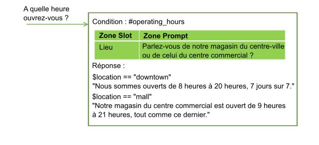
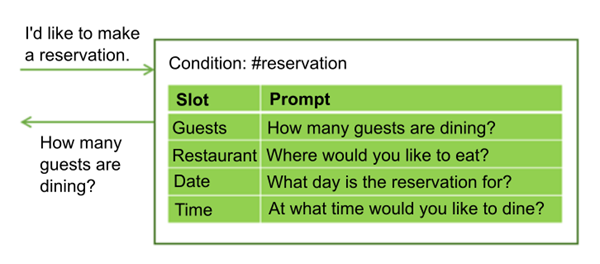
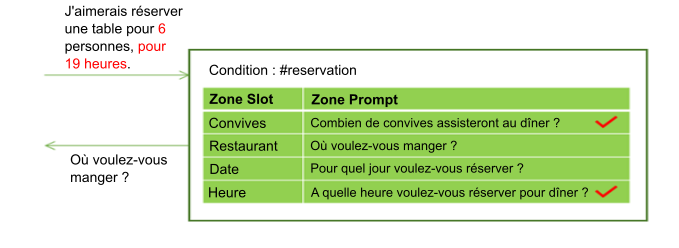
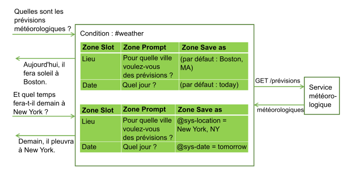
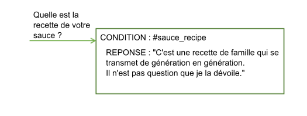

---

copyright:
  years: 2015, 2019
lastupdated: "2019-08-12"

keywords: slot, slots

subcollection: assistant

---

{:shortdesc: .shortdesc}
{:new_window: target="_blank"}
{:deprecated: .deprecated}
{:important: .important}
{:note: .note}
{:tip: .tip}
{:pre: .pre}
{:codeblock: .codeblock}
{:screen: .screen}
{:javascript: .ph data-hd-programlang='javascript'}
{:java: .ph data-hd-programlang='java'}
{:python: .ph data-hd-programlang='python'}
{:swift: .ph data-hd-programlang='swift'}
{:table: .aria-labeledby="caption"}

# Collecte d'informations à l'aide d'attributs
{: #dialog-slots}

Ajoutez des attributs à un noeud de dialogue afin de collecter plusieurs éléments d'informations auprès d'un utilisateur au sein de ce noeud. Les attributs permettent de collecter des informations au rythme de l'utilisateur. Les détails fournis à l'avance par un utilisateur sont enregistrés et votre assistant ne demande que les détails manquants pour répondre à la demande. 

<iframe class="embed-responsive-item" id="youtubeplayer" title="Ajout d'attributs à un noeud" type="text/html" width="640" height="390" src="https://www.youtube.com/embed/kMLyKfmO9wI?rel=0" frameborder="0" webkitallowfullscreen mozallowfullscreen allowfullscreen> </iframe>

## Pourquoi ajouter des attributs ?
{: #dialog-slots-why}

Les attributs vous permettent d'obtenir les informations dont vous avez besoin pour répondre de manière précise à l'utilisateur. Par exemple, si un utilisateur demande des horaires d'ouverture et de fermeture et que ces informations varient en fonction des différents sites de magasin, vous pouvez poser une question complémentaire afin de demander à l'utilisateur sur quel site il souhaite se rendre, avant de lui répondre. Vous pouvez ensuite ajouter des conditions de réponse qui tiennent compte des informations de site fournies.



Les attributs peuvent vous aider à collecter plusieurs éléments d'informations dont vous avez besoin afin d'effectuer une tâche complexe pour un utilisateur, par exemple, réserver une table dans un restaurant.



L'utilisateur peut fournir des valeurs pour plusieurs attributs en même temps. Par exemple, l'entrée peut inclure les informations suivantes : `C'est une réservation pour 6 personnes à 19 heures.` Cette entrée contient deux des valeurs requises manquantes : le nombre de personnes et l'heure de la réservation. L'assistant reconnaît et stocke ces deux valeurs, chacune dans son attribut correspondant. Il affiche ensuite l'invite qui est associée au prochain attribut vide.



Les attributs permettent à l'assistant de répondre à des questions complémentaires sans avoir à redéfinir l'objectif de l'utilisateur. Par exemple, un utilisateur peut demander des prévisions météorologiques, puis poser une question complémentaire portant sur la météo pour un autre endroit ou un autre jour. Imaginons que vous sauvegardiez les variables de prévision requises, comme l'endroit et le jour, dans des attributs, si un utilisateur poste une question complémentaire afin d'obtenir de nouvelles valeurs de variable, vous pouvez écraser les valeurs d'attribut avec les nouvelles valeurs fournies et donner une réponse qui reflète les nouvelles informations. (Pour en savoir plus sur l'appel d'un service externe à partir d'un dialogue, reportez-vous à la rubrique [Procédure permettant de passer des appels de programmation à partir d'un noeud de dialogue](/docs/services/assistant?topic=assistant-dialog-webhooks)).



L'utilisation d'attributs permet de produire un flux de dialogue plus naturel entre l'utilisateur et l'assistant et est plus facile à gérer que l'opération consistant à essayer de collecter les informations en utilisant un grand nombre de noeuds distincts.

## Ajout d'attributs
{: #dialog-slots-add}

1.  Identifiez les unités d'informations que vous souhaitez collecter. Par exemple, pour commander une pizza pour quelqu'un, vous souhaiterez peut-être collecter les informations suivantes :

    - Heure de livraison
    - Taille

1.  Si vous n'avez pas commencer à créer un dialogue, suivez les instructions décrites dans la rubrique [Création d'un dialogue](/docs/services/assistant?topic=assistant-dialog-build) pour en créer un.

1.  Dans la vue d'édition du noeud de dialogue, cliquez sur **Customize**, puis cliquez sur le bouton à bascule en regard de la case **Slots** pour l'activer (**on**).

    Pour plus d'informations sur la case à cocher **Prompt for everything**, reportez-vous à la section [Procédure permettant de demander toutes les informations en même temps](#dialog-slots-prompt-for-everything).

1.  **Ajoutez un attribut pour chaque unité d'informations requises**. Pour chaque attribut, spécifiez les détails suivants :

    - **Check for** : identifiez le type d'information que vous souhaitez extraire de la réponse de l'utilisateur afin de la transmettre pour la demande d'attribut. La plupart du temps, vous recherchez des valeurs d'entité. En fait, le générateur de conditions qui s'affiche suggère des entités que vous pouvez rechercher. Cependant, vous pouvez également rechercher une intention ; il vous suffit de taper le nom d'intention dans la zone. Vous pouvez utiliser des opérateurs AND et OR ici pour définir des conditions plus complexes.

      La valeur *Check for* est d'abord utilisée comme condition, puis elle devient la valeur de la variable contextuelle que vous indiquez dans la zone *Save as*. Elle spécifie à la fois **les éléments à vérifier** et **les éléments à sauvegarder**. Si vous souhaitez modifier la façon dont la valeur est sauvegardée, ajoutez l'expression qui reformate la valeur dans la zone *Check for*.
      {: important}

      Par exemple, si l'entité est une entité de canevas, telle que `@email`, après avoir ajouté le nom d'entité, ajoutez-lui `.literal`. La propriété `.literal` indique que vous souhaitez capturer le texte exact entré par l'utilisateur et qui a été identifié comme adresse électronique sur la base de son canevas.

      Dans certains cas, vous pouvez utiliser une expression pour capturer la valeur, mais ne pas appliquer l'expression à ce qui est sauvegardé. Dans ce cas, vous pouvez utiliser une valeur de la zone *Check for* pour capturer la valeur, puis ouvrir l'éditeur JSON pour modifier la valeur de la variable contextuelle afin de sauvegarder autre chose.

      Les modifications apportées à la valeur de la variable contextuelle d'un attribut dans l'éditeur JSON ne sont pas reflétées dans la zone **Check for** après que vous quittez l'éditeur JSON. Et si vous cliquez sur la zone **Check for** pour l'activer à tout moment après avoir utilisé l'éditeur JSON pour modifier la valeur, les modifications que vous avez apportées sont perdues.
      {: important}

      Evitez de rechercher des valeurs de variables contextuelles dans la zone *Check for*. La valeur à vérifier étant également la valeur sauvegardée, l'utilisation d'une variable contextuelle dans la condition peut entraîner un comportement inattendu.

    - **Save as** : indiquez le nom de la variable contextuelle dans laquelle vous souhaitez stocker la valeur d'intérêt provenant de la réponse de l'utilisateur et à transmettre à la demande d'attribut.

       Ne réutilisez pas une variable contextuelle utilisée ailleurs dans le dialogue. Si la variable contextuelle comporte déjà une valeur, l'invite de l'attribut n'est pas affichée. La demande d'attribut s'affiche uniquement lorsque la variable contextuelle pour l'attribut a pour valeur null.

    - **Prompt** : écrivez une instruction qui sollicite l'élément d'information dont vous avez besoin auprès de l'utilisateur. Après l'affichage de cette invite, la conversation marque une pause et l'assistant attend la réponse de l'utilisateur.

    - Si vous souhaitez que différentes instructions de suivi s'affichent selon que l'utilisateur fournit ou non les informations dont vous avez besoin en réponse à la demande d'attribut initiale, vous pouvez éditer l'attribut (en cliquant sur l'icône d'**édition d'attribut** ) et les instructions de suivi :

      - **Found** : s'affiche après que l'utilisateur a fourni les informations attendues.

      - **Not found** : s'affiche si les informations fournies par l'utilisateur ne sont pas comprises ou si elles ne sont pas fournies dans le format attendu. Si l'attribut est correctement renseigné, ou si l'entrée utilisateur est comprise et gérée par un gestionnaire d'attributs, cette instruction ne s'affiche jamais.

      Pour savoir comment définir les conditions et les actions associées des réponses Found et Not found, reportez-vous à la rubrique [Ajout de conditions aux réponses Found et Not found](#dialog-slots-handler-next-steps).

    Le tableau ci-après contient des exemples de valeur d'attribut pour un noeud permettant aux utilisateurs de commander une pizza. Deux éléments d'informations sont collectés, la taille de la pizza et l'heure de la livraison.

    <table>
    <caption>Exemples d'attribut de commande de pizza</caption>
    <tr>
      <th>Zone Check for</th>
      <th>Zone Save as</th>
      <th>Zone Prompt</th>
      <th>Réponse de suivi si la valeur est trouvée (condition If Found)</th>
      <th>Réponse de suivi si la valeur n'est pas trouvée (condition If Not Found)</th>
    </tr>
    <tr>
      <td>@size</td>
      <td>$size</td>
      <td>Quelle taille de pizza voulez-vous ?</td>
      <td>$size, très bien.</td>
      <td>Quelle taille souhaitiez-vous ? Nous proposons des pizza petites, moyennes et grandes.</td>
    </tr>
    <tr>
      <td>@sys-time</td>
      <td>$time</td>
      <td>Quand voulez-vous être livré ?</td>
      <td>Pour une livraison à $time.</td>
      <td>A quelle heure souhaitiez-vous être livré ? Il faut compter au moins 30 minutes de préparation.</td>
    </tr>
    </table>

1.  **Rendez un attribut facultatif ou désactivez-le sous certaines conditions**. Vous pouvez éventuellement configurer un attribut en procédant comme suit :

    - **Facultatif** : pour rendre un attribut facultatif, ajoutez-le sans invite. L'assistant ne réclame pas les informations à l'utilisateur, mais il recherche ces informations dans l'entrée utilisateur et il sauvegarde la valeur si l'utilisateur la fournit. Par exemple, vous pouvez ajouter un attribut qui capture des informations relatives à des restrictions alimentaires si l'utilisateur spécifie des restrictions. Cependant, vous ne pouvez pas demander à tous les utilisateurs d'indiquer des restrictions alimentaires car cela n'est pas pertinent dans la plupart des cas.

       <table>
       <caption>Attribut facultatif</caption>
       <tr>
          <th>Information</th>
          <th>Zone Check for</th>
          <th>Zone Save as</th>
       </tr>
       <tr>
          <td>Restriction relative au gluten</td>
          <td>@dietary</td>
          <td>$dietary</td>
      </tr>
      </table>

      Si vous rendez un attribut facultatif, vous devez uniquement référencer sa variable contextuelle dans le texte de la réponse de niveau noeud si vous pouvez la libeller de telle manière qu'elle soit compréhensible même si aucune valeur n'est fournie pour l'attribut. Par exemple, vous pouvez libeller une instruction récapitulative, telle que `Je voudrais commander une $size pizza $dietary et être livré à $time.` Le texte obtenu reste compréhensible que les restrictions alimentaires, par exemple, `sans gluten` ou `sans lactose`, soient fournies ou non. Le résultat est `Je voudrais commander une grande pizza sans gluten et être livré à 15h.` ou `Je voudrais commander une grande pizza et être livré à 15h.`
      {: tip}

    - **Conditionnel** : si vous souhaitez qu'un attribut soit activé uniquement dans certaines conditions, vous pouvez lui ajouter une condition. Par exemple, si l'attribut 1 demande l'heure de début d'une réunion, l'attribut 2 capture la durée de la réunion et l'attribut 3 capture l'heure de fin, vous souhaiterez peut-être activer l'attribut 3 (et demander l'heure de fin de la réunion) uniquement si aucune valeur n'a été fournie pour l'attribut 2. Pour rendre un attribut conditionnel, éditez-le, puis, dans le menu **Autres options** , sélectionnez **Enable condition**. Définissez la condition qui doit être remplie pour que l'attribut soit activé.

      Vous pouvez définir une condition sur la valeur d'une variable contextuelle à partir d'un attribut antérieur car l'ordre dans lequel les attributs sont répertoriés correspond à celui dans lequel ils sont évalués. Toutefois, seule la condition définie sur une variable contextuelle d'attribut dont vous pouvez être sûr contiendra une valeur lorsque cet attribut sera évalué. L'attribut antérieur doit être un attribut obligatoire, par exemple.
    {: tip}
1.  **Assurez le suivi des utilisateurs**. Vous pouvez éventuellement définir des gestionnaires d'attributs qui fournissent des réponses aux questions que peuvent se poser les utilisateurs lors de l'interaction et qui sont tangentielles par rapport à l'objectif du noeud.

    Par exemple, l'utilisateur peut demander la recette de la sauce tomate ou l'endroit où vous vous êtes procuré les ingrédients. Pour gérer ce type de questions hors sujet, cliquez sur le lien **Manage handlers** et ajoutez une condition et une réponse pour chaque question anticipée.

    

    Après la réponse à la question hors sujet, l'invite associée à l'attribut non renseigné s'affiche.

    Cette condition est déclenchée si l'utilisateur fournit une entrée qui correspond tout le temps aux conditions du gestionnaire d'attributs pendant le flux du noeud de dialogue jusqu'à ce que la réponse de niveau noeud s'affiche. Pour connaître les autres moyens permettant d'utiliser le gestionnaire d'attributs, reportez-vous à la rubrique [Traitement des demandes de sortie d'un processus](#dialog-slots-node-level-handler).
1.  **Ajoutez une réponse de niveau noeud**. La réponse de niveau noeud n'est pas exécutée tant que tous les attributs requis ne sont pas renseignés. Vous pouvez ajouter une réponse qui récapitule les informations que vous avez collectées. Par exemple, `Une $size vous sera livrée à $time. Bon appétit !`

    Si vous souhaitez définir des réponses différentes en fonction de certaines conditions, cliquez sur **Customize**, puis cliquez sur le bouton à bascule **Multiple responses** pour l'activer (**on**). Pour plus d'informations sur les réponses conditionnelles, reportez-vous à la rubrique [Réponses conditionnelles](/docs/services/assistant?topic=assistant-dialog-overview#dialog-overview-multiple).
1.  **Ajoutez une logique qui réinitialise les variables contextuelles d'attribut**. A mesure que vous collectez les réponses de l'utilisateur pour chaque attribut, elles sont sauvegardées dans des variables contextuelles. Vous pouvez utiliser les variables contextuelles pour transmettre les informations à un autre noeud ou à une application ou à un service externe en vue de leur utilisation. Cependant, après avoir transmis les informations, vous devez affecter la valeur null aux variables contextuelles afin de réinitialiser le noeud pour qu'il recommence à collecter des informations. Vous ne pouvez pas affecter la valeur null aux variables contextuelles au sein du noeud en cours car l'assistant ne quittera pas le noeud tant que les attributs requis ne seront pas renseignés. En revanche, songez à utiliser l'une des méthodes suivantes :

    - Ajoutez un traitement à l'application externe qui affecte la valeur null aux variables.
    - Ajoutez un noeud enfant qui affecte la valeur null aux variables.
    - Insérez un noeud parent qui affecte la valeur null aux variables, puis passez au noeud comportant avec des attributs.

Faites un essai ! Suivez le [tutoriel](/docs/services/assistant?topic=assistant-tutorial-slots) détaillé.

## Conseils relatifs à l'utilisation des attributs
{: #dialog-slots-tips}

Les propriétés d'attribut suivantes peuvent vous aider à vérifier et définir des valeurs dans des variables contextuelles d'attribut.

| Nom de propriété          | Description |
|------------------------|-------------|
| `all_slots_filled`     | Renvoie la valeur true uniquement si toutes les variables contextuelles pour tous les attributs présents dans le noeud ont été définis. Pour voir un exemple d'utilisation, reportez-vous à la rubrique [Procédure permettant d'empêcher l'affichage d'une réponse Found lorsque celle-ci est inutile](#dialog-slots-stifle-found-responses). |
| `event.current_value`  | Valeur en cours de la variable contextuelle pour cet attribut. Pour voir un exemple d'utilisation de cette propriété et de la propriété event.previous_value, reportez-vous à la rubrique [Remplacement d'une valeur de variable contextuelle d'attribut](#dialog-slots-found-handler-event-properties). |
| `event.previous_value` | Valeur précédente de la variable contextuelle pour cet attribut. |
| `has_skipped_slots`    | Valeur True si l'un quelconque des attributs ou des gestionnaires d'attributs qui sont configurés avec une option d'étape suivante qui ignore les attributs a été traitée. Pour plus d'informations sur les options d'étape suivante pour les attributs, reportez-vous à la rubrique [Ajout de conditions aux réponses Found et Not found](#slot-handler-next-steps) et pour plus d'informations sur les options d'étape suivante pour les gestionnaires d'attributs, reportez-vous à la rubrique [Traitement des demandes de sortie d'un processus](#dialog-slots-node-level-handler). |
| `slot_in_focus`        | Force l'application de la condition d'attribut à l'attribut en cours uniquement. Pour plus d'informations, reportez-vous à la rubrique [Procédure permettant d'obtenir une confirmation](#dialog-slots-get-confirmation). |
{: caption="Propriétés d'attribut" caption-side="top"}

Pensez à utiliser les approches décrites ci-après pour gérer des tâches courantes.

- [Procédure permettant de demander toutes les informations en même temps](#dialog-slots-prompt-for-everything)
- [Procédure permettant de capturer plusieurs valeurs](#dialog-slots-multiple-entity-values)
- [Procédure permettant de reformater des valeurs](#dialog-slots-reformat-values)
- [Traitement des zéros](#dialog-slots-zero)
- [Procédure permettant d'obtenir une confirmation](#dialog-slots-get-confirmation)
- [Procédure permettant de remplacer une valeur de variable contextuelle d'attribut](#dialog-slots-found-handler-event-properties)
- [Procédure permettant d'éviter de confondre des nombres](#dialog-slots-avoid-slot-confusion)
- [Ajout de conditions aux réponses Found et Not found](#dialog-slots-handler-next-steps)
- [Procédure permettant de passer à autre chose après plusieurs tentatives infructueuses](#dialog-slots-stop-trying-after-3)
- [Procédure permettant d'empêcher l'affichage d'une réponse Found lorsque celle-ci est inutile](#dialog-slots-stifle-found-responses)
- [Traitement des demandes de sortie d'un processus](#dialog-slots-node-level-handler)

### Procédure permettant de demander toutes les informations en même temps
{: #dialog-slots-prompt-for-everything}

Incluez une invite initiale pour l'ensemble du noeud afin d'indiquer clairement à l'utilisateur quelles sont les unités d'information qu'il doit fournir. L'affichage de cette invite initiale permet aux utilisateurs de fournir tous les détails en une seule fois et ne pas avoir à attendre d'être invité à fournir un élément d'information à la fois.

Par exemple, lorsque le noeud est déclenché parce qu'un client souhaite commander une pizza, vous pouvez répondre avec l'invite préliminaire suivante : `Je peux prendre votre commande. Indiquez-moi la taille de la pizza que vous désirez et l'heure à laquelle vous souhaitez être livré.`

Si l'utilisateur fournit ne serait-ce qu'une partie de ces informations dans sa demande initiale, l'invite n'apparaît pas. Par exemple, l'entrée initiale peut être `Je voudrais commander une grande pizza.` Lorsque l'assistant analyse l'entrée, il reconnaît `grande` comme étant la taille de la pizza et il renseigne l'attribut **Taille** avec la valeur fournie. Etant donné que l'un des attributs est renseigné, le service ignore l'affichage de l'invite initiale pour éviter de redemander la taille de la pizza. En revanche, il affiche les invites pour les autres attributs qui sont pas renseignés.

Sur le panneau Customize où vous avez activé la fonction Slots, cochez la case **Prompt for everything** pour activer l'invite initiale. Ce paramètre ajoute la zone **If no slots are pre-filled, ask this first** au noeud, dans laquelle vous pouvez spécifier le texte qui invite l'utilisateur à spécifier toutes les informations.

### Procédure permettant de capturer plusieurs valeurs
{: #dialog-slots-multiple-entity-values}

Vous pouvez demander une liste d'éléments et les sauvegarder dans un attribut.

Par exemple, vous pouvez demander aux utilisateurs s'ils souhaitent de la garniture sur leur pizza. Pour cela, définissez une entité (@toppings), et la valeur acceptée pour cette dernière (pepperoni, fromage, champignons, etc.). Ajoutez un attribut qui demande à l'utilisateur quelle garniture il désire. Utilisez la propriété values du type d'entité pour capturer plusieurs valeurs, le cas échéant.

<table>
<caption>Attribut Multiple value</caption>
<tr>
  <th>Zone Check for</th>
  <th>Zone Save as</th>
  <th>Zone Prompt</th>
  <th>Réponse de suivi si la valeur est trouvée (condition If Found)</th>
  <th>Réponse de suivi si la valeur n'est pas trouvée (condition If Not Found)</th>
</tr>
<tr>
  <td>@toppings.values</td>
  <td>$toppings</td>
  <td>Désirez-vous une garniture ?</td>
  <td>Excellent choix !</td>
  <td>Quelle garniture désirez-vous ? Nous vous proposons ...</td>
</tr>
</table>

Pour référencer ultérieurement les garnitures spécifiées par l'utilisateur, utilisez `<? $entity-name.join(',') ?>` pour répertorier chaque élément dans le tableau des garnitures en séparant les valeurs par une virgule. Par exemple, `Je voudrais commander une pizza $size avec <? $toppings.join(',') ?> pour une livraison à $time.` 

### Procédure permettant de reformater des valeurs
{: #dialog-slots-reformat-values}

Etant donné que vous demandez à l'utilisateur de fournir des informations et que devez référencer leur entrée dans des réponses, songez à reformater les valeurs de manière à pouvoir les afficher dans un format convivial.

Par exemple, les valeurs d'heure sont sauvegardées au format `hh:mm:ss`. Vous pouvez utiliser l'éditeur JSON pour l'attribut afin de reformater la valeur d'heure lorsque vous la sauvegardez de sorte que le format `hour:minutes AM/PM` soit utilisé :

```json
{
  "context":{
    "time": "<? @sys-time.reformatDateTime('h:mm a') ?>"
  }
}
```
{: codeblock}

Pour plus d'informations sur le reformatage des idées, reportez-vous à la rubrique [Méthodes de langage d'expression](/docs/services/assistant?topic=assistant-dialog-methods).

### Traitement des zéros
{: #dialog-slots-zero}

L'utilisation de `@sys-number` dans une condition d'attribut est utile pour capturer les nombres spécifiés par les utilisateurs dans leur entrée. Toutefois, cette entité ne se comporte pas comme prévu lorsque les utilisateurs spécifient le nombre zéro (0). Au lieu de traiter zéro comme un chiffre valide, la condition est évaluée à la valeur false et l'assistant invite à nouveau l'utilisateur à entrer un chiffre. Pour éviter ce comportement, recherchez une mention `@sys-number` supérieure ou égale à zéro dans la condition d'attribut.

Pour vous assurer qu'une condition d'attribut qui vérifie les mentions numériques traite correctement les zéros, procédez comme suit : 

1.  Ajoutez `@sys-number >= 0` dans la zone de condition d'attribut, puis indiquez le nom de la variable contextuelle et l'invite de texte.
    
    Ce que vous vérifiez dans l'entrée correspond également à ce qui est enregistré dans la variable de contexte d'attribut. Toutefois, dans ce cas, vous souhaitez que seul le nombre (tel que `5`) soit sauvegardé. Vous ne souhaitez pas sauvegarder `5 > = 0`. Pour modifier ce qui est sauvegardé, vous devez modifier la valeur de la variable contextuelle.

1.  Ouvrez l'attribut pour l'éditer en cliquant sur l'icône d'**édition d'attribut** . Dans le menu **Autres options** , ouvrez l'éditeur JSON.

1.  Modifiez la valeur de la variable contextuelle.

    La valeur sera similaire à ceci :

    ```json
    {
      "context": {
        "number": "@sys-number >= 0"
      }
    }
    ```
    {: codeblock}

    Modifiez-la pour qu'elle ressemble à ceci :

    ```json
    {
      "context": {
        "number":"@sys-number"
      }
    }
    ```
    {: codeblock}

1.  Sauvegardez vos modifications. 

Les modifications apportées à la valeur de la variable contextuelle ne sont pas reflétées dans la zone Check for, ce qui est approprié. N'éditez pas la valeur de la zone Check for et ne cliquez pas non plus sur la zone. Si vous le faites, la modification que vous avez apportée au JSON est perdue.
{: tip}

Si vous ne souhaitez pas accepter le zéro en tant que valeur numérique, vous pouvez ajouter une réponse conditionnelle à l'attribut pour rechercher les zéros et indiquer à l'utilisateur qu'il doit fournir un nombre supérieur à zéro. Cependant, il est important que la condition d'attribut puisse reconnaître un zéro lorsqu'il est fourni en entrée.

### Procédure permettant d'obtenir une confirmation
{: #dialog-slots-get-confirmation}

Ajoutez un attribut après les autres attributs afin de demander à l'utilisateur de confirmer que les informations que vous avez collectées sont exactes et complètes. L'attribut peut rechercher les réponses qui correspondent à l'intention #yes ou #no.

<table>
<caption>Attribut Confirmation</caption>
<tr>
  <th>Zone Check for</th>
  <th>Zone Save as</th>
  <th>Zone Prompt</th>
  <th>Réponse de suivi si la valeur est trouvée (condition If Found)</th>
  <th>Réponse de suivi si la valeur n'est pas trouvée (condition If Not Found)</th>
</tr>
<tr>
  <td>#yes || #no</td>
  <td>$confirmation</td>
  <td>Vous avez commandé une `$size` pizza pour une livraison à `$time`. Vous confirmez votre commande ?</td>
  <td>C'est parti !</td>
  <td>reportez-vous à la rubrique *Réponse complexe*</td>
</tr>
</table>

**Réponse complexe** : étant donné que les utilisateurs peuvent inclure des instructions affirmatives ou négatives à d'autres moments durant le dialogue (*Tout à fait, nous voulons être livrés à 17h*) ou (*Je ne reçois pas d'amis ce soir, donc, je vais en prendre une petite*), utilisez la propriété `slot_in_focus` pour préciser dans la condition d'attribut que vous recherchez une réponse Yes ou No uniquement pour l'invite de cet attribut.

```json
(#yes || #no) && slot_in_focus
```
{: codeblock}

La propriété `slot_in_focus` prend toujours une valeur booléenne (true ou false). Vous devez l'inclure uniquement dans une condition pour laquelle vous souhaitez obtenir un résultat booléen. Vous ne devez pas l'utiliser dans des conditions d'attribut qui recherchent un type d'entité, puis qui sauvegardent la valeur d'entité, par exemple.
{: tip}

Dans l'invite **Not found**, précisez que vous attendez une réponse Yes ou No de la part de l'utilisateur.

```json
{
  "output":{
    "text": {
      "values": [
        "Respond with Yes to indicate that you want the order to
         be placed as-is, or No to indicate that you do not."
      ]
    }
  }
}
```
{: codeblock}

Dans l'invite **Found**, ajoutez une condition qui recherche une réponse No (#no). Lorsque cette réponse est trouvée, redemandez toutes les informations et réinitialisez les variables contextuelles que vous avez sauvegardées précédemment.

```json
{
  "conditions": "#no",
  "output":{
    "text": {
      "values": [
        "Essayons à nouveau. Dites-moi quelle taille de pizza vous souhaitez et à quelle heure..." ]
    }
  },
  "context":{
    "size": null,
    "time": null,
    "confirmation": null
  }
}
```
{: codeblock}

### Procédure permettant de remplacer une valeur de variable contextuelle d'attribut
{: #dialog-slots-found-handler-event-properties}

Si, avant de quitter un noeud comportant des attributs, un utilisateur fournit une nouvelle valeur pour un attribut, cette nouvelle valeur est sauvegardée dans la variable contextuelle d'attribut et remplace la valeur qui avait été spécifiée précédemment. Votre dialogue reconnaît ce remplacement de manière explicite en utilisant des propriétés spéciales qui sont définies pour la condition Found :

- `event.previous_value` : précédente valeur de la variable contextuelle pour cet attribut.
- `event.current_value` : valeur en cours de la variable contextuelle pour cet attribut.

Par exemple, votre dialogue demande une ville de destination pour une réservation de billet d'avion. L'utilisateur indique `Paris.` Vous affectez à la variable contextuelle d'attribut $destination la valeur *Paris*. Ensuite, l'utilisateur dit : `Attendez. Finalement, je veux un billet d'avion pour Madrid.` Si vous configurez la condition Found comme suit, votre dialogue peut facilement gérer ce type de modification :

Lorsque l'utilisateur répond, si @destination est trouvé :

```json
Condition: (event.previous_value != null) &&
           (event.previous_value != event.current_value)
    Response: Ok, updating destination from
    <? event.previous_value ?> par <? event.current_value ?>.
Response: Ok, destination is $destination.
```
{: codeblock}

Cette configuration d'attribut permet à votre dialogue de réagir au changement de destination de l'utilisateur en disant : `Très bien, nous remplaçons la destination Paris par Madrid.`

### Éviter la confusion en matière de remplissage des attributs 
{: #dialog-slots-avoid-slot-confusion}

Lorsqu’une entrée utilisateur est évaluée, l’attribut comportant la première condition d'attribut correspondant est rempli uniquement. Recherchez les causes possibles d’interprétation erronée suivantes et corrigez-les : 

- **Problème** : la même entité est utilisée dans plusieurs attributs. 

    Par exemple, `@sys-date` est utilisé pour capturer la date de départ dans un attribut et la date d'arrivée dans un autre.

    **Solution**: utilisez des conditions Found d'attribut qui permettent à l'utilisateur de préciser la date que vous enregistrez dans un attribut avant de l'enregistrer.

- **Problème** : un terme correspond totalement ou partiellement aux entités dans plusieurs conditions d'attribut.

    Par exemple, si un attribut capture un ID de produit (`@id`) avec une syntaxe telle que `GR1234` et qu'un autre attribut capture un nombre (`@number`), tel que `1234`, l'entrée utilisateur contenant un ID, tel que `BR3344`, peut être réclamée par l'attribut `@number` en tant que référence numérique et peut renseigner la variable contextuelle `$number` avec `3344`.

    **Solution** : placez l'attribut avec la condition d'entité qui capture le modèle plus long (@id) plus haut dans la liste d'attributs que la condition qui capture le motif plus court (@number).

- **Problème** : plusieurs types d’entité de système sont reconnus dans un terme.

    Par exemple, si l'utilisateur entre *2 mai*, votre assistant reconnaît les entités `@sys-date` (2017-05-02) et `@sys-number` (2).

    **Solution** : dans une logique qui est spécifique à la fonction d'attributs, lorsque deux entités de système sont reconnues dans une seule entrée utilisateur, celle dont la portée est la plus étendue est utilisée. Par conséquent, même si votre assistant reconnaît les deux entités de système dans le texte, seule l'entité système ayant une durée plus longue (`@sys-date` avec `2017-05-02`) est enregistrée et appliquée à l'attribut.

Cette solution de contournement n'est pas nécessaire si vous utilisez les entités de système révisées. Avec les entités mises à jour, une référence de date est considérée comme une mention `@sys-date` uniquement et n'est pas également traitée comme une mention `@sys-number`. Pour plus d'informations, reportez-vous à la rubrique [Nouvelles entités de système](/docs/services/assistant?topic=assistant-beta-system-entities).
  {: note}

### Ajout de conditions aux réponses Found et Not found
{: #dialog-slots-handler-next-steps}

Pour chaque attribut, vous pouvez utiliser des réponses conditionnelles avec des actions associées pour vous aider à obtenir les informations dont vous avez besoin de la part de l'utilisateur. Pour cela, procédez comme suit :

1.  Cliquez sur l'icône d'**édition d'attribut**  pour l'attribut auquel vous souhaitez ajouter des réponses conditionnelles Found et Not found.
1.  Dans le menu **Autres options** , sélectionnez **Enable conditional responses**.
1.  Entrez la condition et la réponse à afficher si la condition est remplie.

    **Exemple Found** : l'attribut attend l'heure de la réservation d'une table pour dîner. Vous pouvez utiliser @sys-time dans la zone *Check for* pour la capturer. Pour empêcher qu'une heure non valide soit sauvegardée, vous pouvez ajouter une réponse conditionnelle qui vérifie si l'heure fournie est antérieure à l'heure du dernier service du restaurant, par exemple. `@sys-time.after('21:00:00')` : la réponse correspondante peut être : *Le dîner est servi jusqu'à 21h.*

    **Exemple Not found** : l'attribut attend une entité @location qui accepte un ensemble spécifique de villes dans lesquelles la chaîne de restaurants est implantée. La condition Not found peut rechercher @sys-location si l'utilisateur spécifie une ville qui est valide mais qui ne compte aucun restaurant de la chaîne. La réponse correspondante peut être *Nous n'avons aucun restaurant à cet endroit.*

1.  Si vous souhaitez personnaliser ce qu'il se passe lorsque la condition est remplie, cliquez sur l'icône d'**édition de réponse** .

    Pour les réponses Found (affichées lorsque l'utilisateur fournit une valeur qui correspond au type de valeur spécifié dans la zone Check for), vous pouvez choisir l'une des actions suivantes présentées ci-dessous :

      - **Move on (action par défaut)** : indique à l'assistant qu'il doit passer à l'attribut vide suivant après avoir affiché la réponse. Dans la réponse associée, garantissez à l'utilisateur que son entrée a été comprise. Par exemple, *Ok. Vous souhaitez réserver pour le $date.*
      - **Clear slot and prompt again** : si vous utilisez une entité dans la zone *Check for* qui est susceptible de sélectionner une valeur non valide, ajoutez des conditions qui interceptent toute interprétation erronée et utilisez cette action pour effacer la valeur d'attribut en cours et demander la valeur correcte.
      - **Skip to response** : si, lorsque la condition que vous définissez est remplie, vous n'avez plus besoin de renseigner aucun des attributs restants dans ce noeud, choisissez cette action pour ignorer les attributs restants et accéder directement à la réponse de niveau noeud suivante. Par exemple, vous pouvez ajouter une condition qui vérifie si l'utilisateur a moins de 16 ans. Si tel est le cas, vous pouvez ignorer les attributs restants qui posent des questions relatives au permis de conduire de l'utilisateur.

    Pour les réponses Not found (affichées lorsque l'utilisateur ne fournit pas une valeur valide), vous pouvez choisir l'une des actions suivantes :

      - **Wait for user input (action par défaut)** : la conversation marque une pause et l'assistant attend la réponse de l'utilisateur. Dans le plus simple des cas, le texte que vous indiquez ici peut stipuler de manière plus explicite le type d'information dont vous avez besoin de la part de l'utilisateur. Si vous utilisez cette action avec une réponse conditionnelle, prenez soin de formuler la réponse conditionnelle en précisant clairement ce qui n'allait pas dans la réponse de l'utilisateur et ce que vous attendez comme réponse de la part de ce dernier.
      - **Prompt again** : après avoir affiché la réponse Not found, l'assistant répète l'invite d'attribut et attend la réponse de l'utilisateur. Si vous utilisez cette action avec une réponse conditionnelle, la réponse peut simplement expliquer ce qui n'allait pas dans la réponse fournie par l'utilisateur. Elle n'a pas besoin de réitérer le type d'information que l'utilisateur doit fournir car cela est généralement expliqué par l'invite d'attribut.

        Si vous choisissez cette option, pensez à ajouter au moins une variante de la réponse Not found de sorte que le même texte ne s'affiche pas plusieurs fois pour l'utilisateur. Profitez-en pour utiliser différentes formulations afin d'expliquer à l'utilisateur les informations qu'il doit fournir et le format dans lequel il doit les spécifier.
        {: tip}

      - **Skip this slot** : indique à l'assistant qu'il doit cesser d'essayer de remplir l'attribut en cours et qu'il doit passer à l'invite pour l'attribut vide suivant. Cette option est utilise dans un attribut que vous souhaitez rendre facultatif et pour lequel vous souhaitez afficher une invite demandant à l'utilisateur de fournir des informations. Imaginons que vous ayez une entité @seating qui capture les préférences en matière de placement dans un restaurant, par exemple, *à l'extérieur*, *près de la cheminée*, *privé*, etc. Vous pouvez ajouter un attribut associé à l'invite *Avez-vous une préférence en matière de placement ?* et qui recherche `@seating.values`. Si une réponse valide est fournie, les informations de préférence sont sauvegardées dans `$seating_preferences`. Toutefois, en choisissant cette action comme étape suivante de la réponse Not found, vous indiquez à l'assistant qu'il doit cesser d'essayer de remplir cet attribut si l'utilisateur ne fournit pas une valeur valide pour cet attribut.
      - **Skip to response** : si, lorsque la condition que vous définissez est remplie, vous n'avez plus besoin de renseigner aucun des attributs restants dans ce noeud, choisissez cette action pour ignorer les attributs restants et accéder directement à la réponse de niveau noeud suivante. Par exemple, si après avoir capturé des informations de vol pour un aller simple, l'invite d'attribut est *Achetez-vous des billets aller-retour ?*, la condition Not found peut rechercher #No. Si la réponse #No est trouvée, utilisez cette option pour ignorer les attributs restants qui capturent des informations sur le vol retour et accédez directement à la réponse de niveau noeud à la place.

    Cliquez sur **Back** pour revenir à la vue édition de l'attribut.
1.  Pour ajouter une autre réponse conditionnelle, cliquez sur **Add a response**, puis entrez la condition et la réponse à afficher si la condition est remplie.

    Prenez soin d'ajouter au moins une réponse qui sera affichée quoi qu'il arrive. Vous pouvez laisser la zone de condition vide pour cette réponse fourre-tout. L'assistant remplit automatiquement la zone de condition vide avec la condition spéciale `true`.

1.  Cliquez sur **Save** pour sauvegarder vos modifications, fermez la vue édition de l'attribut et revenez à la vue édition du noeud.

### Procédure permettant de passer à autre chose après plusieurs tentatives infructueuses
{: #dialog-slots-stop-trying-after-3}

Vous pouvez fournir aux utilisateurs un moyen de quitter un attribut s'ils ne peuvent pas y répondre correctement après plusieurs tentatives en utilisant des réponses conditionnelles Not found. Dans la réponse fourre-tout, ouvrez l'éditeur JSON afin d'ajouter une variable contextuelle de compteur qui assure le suivi du nombre de renvois d'une réponse Not found. Dans un noeud précédent, prenez soin d'affecter la valeur 0 à la variable contextuelle de compteur initiale.

Dans cet exemple, l'assistant demande la taille de la pizza. Il permet à l'utilisateur de donner 3 réponses incorrectes avant d'appliquer une taille (moyenne) à la variable. (Vous pouvez inclure un attribut de confirmation dans lequel les utilisateurs peuvent corriger la taille lorsqu'il leur est demandé de confirmer les informations relatives à la commande.)

Check for: @size
Save as: $size
Not found catchall condition:

```json
{
  "output": {
    "text": {
      "values": [
        "Quelle taille souhaitiez-vous ? Nous proposons des pizza petites, moyennes et grandes."
      ],
      "selection_policy": "sequential"
    }
  },
"context": {
    "counter": "<? context['counter'] + 1 ?>"
  }
}
```
{: codeblock}

Pour donner une réponse différente après 3 tentatives, ajoutez une autre condition Not found semblable à la suivante :
```json
{
  "conditions": "$counter > 1",
  "output": {
    "text": {
      "values": [
        "Nous vous apporterons une pizza de taille moyenne."
      ]
    }
  },
"context": {
    "size": "medium"
  }
  ```
  {: codeblock}

Cette condition Not found est plus précise que la condition Not found catchall, dont la valeur par défaut est `true`. Vous devez donc déplacer cette réponse de sorte qu'elle apparaisse avant la réponse conditionnelle d'origine, sinon elle ne sera pas déclenchée. Sélectionnez la réponse conditionnelle et utilisez la flèche vers le haut pour la déplacer vers le haut.

### Procédure permettant d'empêcher l'affichage d'une réponse Found lorsque celle-ci est inutile
{: #dialog-slots-stifle-found-responses}

Lorsque vous spécifiez des réponses Found pour plusieurs attributs, si un utilisateur indique en même temps des valeurs pour plusieurs attributs, la réponse Found pour au moins l'un d'entre eux apparaîtra. Vous souhaiterez probablement que la réponse Found soit renvoyée pour tous les attributs ou pour aucun d'entre eux.

Pour empêcher que des réponses Found ne s'affichent, vous pouvez effectuer l'une des opérations suivantes sur chaque réponse Found :

- Ajoutez une condition à la réponse afin de l'empêcher d'apparaître si des attributs spécifiques sont renseignés. Par exemple, vous pouvez ajouter une condition, telle que `!($size && $time)`, qui empêche la réponse d'apparaître si les variables contextuelles $size et $time sont toutes les deux fournies.
- Ajoutez la condition `!all_slots_filled` à la réponse. Ce paramètre empêche la réponse d'apparaître si tous les attributs sont renseignés. N'utilisez pas cette approche si vous ajoutez un attribut de confirmation. L'attribut de confirmation est également un attribut, et en général, vous souhaitez empêcher que les réponses Found ne s'affichent avant que l'attribut de confirmation proprement dit soit renseigné.

### Traitement des demandes de sortie d'un processus
{: #dialog-slots-node-level-handler}

Ajoutez au moins un gestionnaire d'attributs qui peut reconnaître qu'un utilisateur souhaite quitter le noeud.

Par exemple, dans un noeud qui collecte des informations afin de planifier un rendez-vous de toilettage pour un animal domestique, vous pouvez ajouter un gestionnaire qui définit des conditions sur l'intention #cancel, qui reconnaît des énoncés tels que <q>Oubliez-ça. J'ai changé d'avis.</q>

1.  Dans l'éditeur JSON pour le gestionnaire, renseignez toutes les variables contextuelles d'attribut avec des valeurs factices afin d'empêcher le noeud de continuer à demander d'éventuelles valeurs manquantes. Et, dans la réponse du gestionnaire, ajoutez un message comme `Entendu. Nous allons nous arrêter là. Aucun rendez-vous ne sera pris.`
1.  Choisissez l'action que l'assistant doit effectuer parmi les options suivantes :

    - **Prompt again (par défaut)** : affiche l'invite associée à l'attribut avec lequel l'utilisateur travaillait juste avant de poser la question hors sujet.
    - **Skip current slot** : affiche l'invite associée à l'attribut qui arrive après l'attribut avec lequel l'utilisateur travaillait juste avant de poser la question hors sujet. Et l'assistant ne fait aucune autre tentative pour remplir l'attribut ignoré.
    - **Skip to response** : ignore les invites associées à tous les attributs vides restants, y compris celui avec lequel l'utilisateur travaillait juste avant de poser la question hors sujet.

1.  Dans le message de niveau noeud, ajoutez une condition qui recherche une valeur factice dans l'une des variables contextuelles d'attribut. Si cette valeur est trouvée, un message final tel que `Si vous décidez de prendre un autre rendez-vous plus tard, dites-le moi.` s'affiche. Si cette valeur n'est pas trouvée, le message récapitulatif standard pour le noeud s'affiche, par exemple, `J'ai pris un rendez-vous pour votre $animal à $time le $date.`

Ci-dessous, un objet JSON définit un gestionnaire pour l'exemple de la pizza. Notez que, comme indiqué précédemment, des valeurs factices sont définies pour toutes les variables contextuelles. En fait, la variable contextuelle `$size` prend la valeur `dummy`. Cette valeur $size déclenche la réponse de niveau noeud afin d'afficher le message approprié et de quitter le noeud des attributs.

```json
{
"conditions": "#cancel",
 "output": {
   "text": {
     "values": [
       "Ok, nous allons nous arrêter là. Aucune pizza ne sera livrée."
     ],
      "selection_policy": "sequential"
    }
  },
"context": {
   "time": "12:00:00",
   "size": "dummy",
   "confirmation":"true"
}
}
```
{: codeblock}

**Important** : tenez compte de la logique utilisée dans les conditions qui sont évaluées avant cette condition afin de pouvoir créer des conditions distinctes. Lorsqu'une entrée utilisateur est reçue, les conditions sont évaluées dans l'ordre suivant :

- Conditions Found du niveau d'attribut en cours.
- Gestionnaires d'attributs dans l'ordre où ils sont répertoriés.
- Si les digressions sont autorisées, les conditions du noeud de niveau racine sont vérifiées (sauf le dernier noeud `anything else` dans la racine de l'arborescence du dialogue ou un dossier racine).
- Conditions Not found du niveau d'attribut en cours.
- Condition de noeud `anything else` final.

Soyez prudent lorsque vous ajoutez comme gestionnaires d'attributs des conditions qui renvoient toujours la valeur true (par exemple, les conditions spéciales `true` ou `anything_else`). Pour chaque attribut, si le gestionnaire d'attributs renvoie la valeur true, la condition Not found est complètement ignorée. Par conséquent, le fait d'utiliser un gestionnaire d'attributs qui renvoie toujours la valeur true empêche réellement la condition Not found pour chaque attribut d'être évaluée.
{: tip}

Par exemple, vous toilettez tous les animaux, sauf les chats. Pour l'attribut Animal, vous pouvez être tenté d'utiliser la condition d'attribut suivante pour empêcher la valeur `cat` d'être sauvegardée dans l'attribut Animal :

```json
Check for @animal && !@animal:cat, then save it as $animal.
```
{: codeblock}

Et, pour permettre aux utilisateurs de savoir que vous n'acceptez pas les chats, vous pouvez spécifier la valeur suivante dans la condition Not found de l'attribut Animal :

```json
If @animal:cat then, "Je suis désolé. Nous ne faisons pas le toilettage pour chats."
```
{: codeblock}

Bien que logique, si vous définissez également un gestionnaire d'attributs #exit, étant donné l'ordre d'évaluation des conditions, il est fort probable que cette condition Not found ne soit jamais déclenchée. A la place, vous pouvez utiliser la condition d'attribut suivante :

```json
Check for @animal, then save it as $animal.
```
{: codeblock}

Et, pour faire face à une éventuelle réponse `cat`, ajoutez la valeur suivante à la condition Found :

```json
If @animal:cat then, "Je suis désolé. Nous ne faisons pas le toilettage pour chats."
```
{: codeblock}

Dans l'éditeur JSON pour la condition Found, réinitialisez la valeur de la variable contextuelle $animal car sa valeur actuelle est cat et cela ne devrait pas être le cas.

```json
{
  "output":{
    "text": {
      "values": [
        "Je suis désolé. Nous ne faisons pas le toilettage pour chats."
      ]
    }
  },
  "context":{
    "animal": null
  }
}
```
{: codeblock}

## Exemples d'attributs
{: #dialog-slots-examples}

Pour accéder à des fichiers JSON qui implémentent différents scénarios d'utilisation d'attribut courants, accédez au [référentiel de la communauté pour Conversation ](https://github.com/watson-developer-cloud/community/tree/master/watson-assistant){: new_window} dans GitHub.

Pour explorer un exemple, téléchargez l'un des exemples de fichier JSON, puis importez-le en tant que nouvelle compétence de dialogue. A partir de l'onglet Dialog, vous pouvez passer en revue les noeuds de dialogue afin de voir de quelle façon les attributs ont été implémentés pour prendre en charge les différents scénarios d'utilisation.
