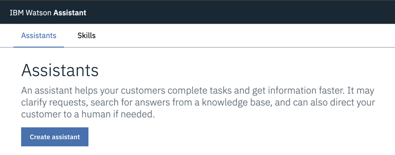
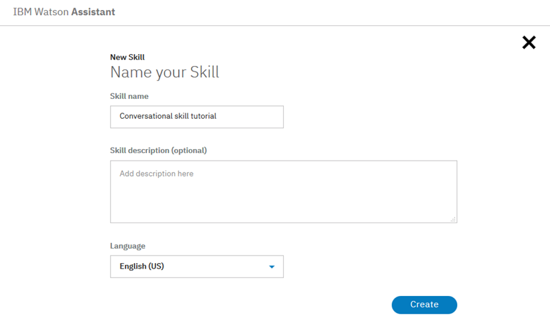
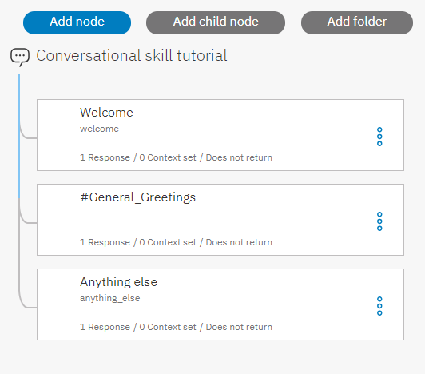

---

copyright:
  years: 2015, 2019
lastupdated: "2019-08-06"

keywords: assistant, omnichannel, virtual agent, virtual assistant, chatbot, conversation, watson assistant, watson conversation

subcollection: assistant

---

{:shortdesc: .shortdesc}
{:new_window: target="_blank"}
{:deprecated: .deprecated}
{:important: .important}
{:note: .note}
{:deprecated: .deprecated}
{:important: .important}
{:note: .note}
{:tip: .tip}
{:pre: .pre}
{:codeblock: .codeblock}
{:screen: .screen}
{:javascript: .ph data-hd-programlang='javascript'}
{:java: .ph data-hd-programlang='java'}
{:python: .ph data-hd-programlang='python'}
{:swift: .ph data-hd-programlang='swift'}
{:hide-dashboard: .hide-dashboard}
{:download: .download}
{:gif: data-image-type='gif'}

# Initiation à {{site.data.keyword.conversationshort}}
{: #getting-started}

Ce tutoriel rapide vous présente {{site.data.keyword.conversationfull}} et vous accompagne dans le processus de création de votre premier assistant.
{: shortdesc}

## Avant de commencer
{: #getting-started-prerequisites}
{: hide-dashboard}

Vous avez besoin d'une instance de service pour commencer.
{: hide-dashboard}

1.  {: hide-dashboard} Accédez à la page [{{site.data.keyword.conversationshort}} ](https://cloud.ibm.com/catalog/services/watson-assistant) dans le catalogue {{site.data.keyword.cloud}}.

    L'instance de service sera créée dans le groupe de ressources **par défaut** si vous n'en choisissez pas un autre et elle *ne pourra pas* être modifiée ultérieurement. Ce groupe est suffisant pour tester le produit. 

    Si vous créez une instance pour une utilisation plus robuste, renseignez-vous sur les [groupes de ressources ](https://{DomainName}/docs/resources/bestpractice_rgs#bp_resourcegroups){: new_window}.
1.  {: hide-dashboard} Inscrivez-vous pour un compte {{site.data.keyword.cloud_notm}} gratuit ou connectez-vous.
1.  {: hide-dashboard} Cliquez sur **Create**.

## Etape 1 : Ouverture de Watson Assistant
{: #getting-started-launch-tool}

Après avoir créé une instance de service {{site.data.keyword.conversationshort}}, vous accédez à la page **Manage** du tableau de bord {{site.data.keyword.conversationshort}}.
{: hide-dashboard}

1.  Cliquez sur **Launch {{site.data.keyword.conversationshort}}**. Si vous êtes invité à vous connecter, entrez vos données d'identification {{site.data.keyword.cloud_notm}}. 

<!-- Remove this text after dedicated instances have the developer console: begin -->

{{site.data.keyword.Bluemix_dedicated_notm}} : sélectionnez votre instance de service dans le tableau de bord pour lancer le produit. 

<!-- Remove this text after dedicated instances have the Developer Console: end -->

Si vous êtes un nouvel utilisateur, un assistant nommé *My first assistant* est créé automatiquement pour vous. Ignorez l'étape suivante. 

Si elle est disponible dans votre région, une visite guidée commence pour vous permettre de mieux connaître le produit. Faites cette visite guidée car elle parcourt ces étapes du tutoriel afin que vous puissiez le reprendre une fois la visite terminée.
  {: tip}

Un [*assistant*](/docs/services/assistant?topic=assistant-assistants) est un bot cognitif auquel vous ajoutez une compétence. Cela lui permet d'interagir avec vos clients de manière utile.

Si un assistant n'est pas créé automatiquement, la première étape consiste à créer un assistant. 

## Etape 2 : Création d'un assistant
{: #getting-started-create-assistant}

1.  Cliquez sur **Create assistant**.

    
1.  Nommez l'assistant `Mon premier assistant`.
1.  Cliquez sur **Create assistant**.

    

## Etape 3 : Création d'une compétence de dialogue
{: #getting-started-add-skill}

Une *compétence de dialogue* est un conteneur pour les artefacts qui définissent le flux d'une conversation que votre assistant peut avoir avec vos clients.

1.  Si l'assistant a été créé, cliquez sur la vignette *Mon premier assistant* pour ouvrir l'assistant.

1.  Cliquez sur **Add dialog skill**.

    

1.  Nommez votre compétence `Tutoriel de compétence conversationnelle`.
1.  **Facultatif**. Si le dialogue que vous prévoyez de créer utilisera une autre langue que l'anglais, choisissez cette langue dans la liste.

    

1.  Cliquez sur **Create dialog skill**.

    

1.  Cliquez pour ouvrir la compétence que vous venez de créer.

Vous arrivez sur la page Intents. 

## Etape 4 : Ajout d'intentions à partir d'un catalogue de contenu
{: #getting-started-add-catalog}

Ajoutez à votre compétence des données d'apprentissage qui ont été créées par IBM en ajoutant des intentions à partir d'un catalogue de contenu. En particulier, vous allez donner à votre assistant l’accès au catalogue de contenu **General** afin que votre dialogue puisse accueillir les utilisateurs et mettre fin aux conversations avec eux.

1.  Cliquez sur l'onglet **Content Catalog**.
1.  Recherchez **General** dans la liste, puis cliquez sur **Add to skill**.

    
1.  Ouvrez l'onglet **Intents** pour passer en revue les intentions et les exemples d'énoncé associés ayant été ajoutés à vos données d'apprentissage. Vous les reconnaîtrez facilement car chaque nom d'intention commence par le préfixe `#General_`. Vous allez ajouter les intentions `#General_Greetings` et `#General_Ending` à votre dialogue dans l'étape suivante.

    

Vous avez commencé à créer vos données d'apprentissage en ajoutant du contenu préconfiguré à partir d'{{site.data.keyword.IBM_notm}}.

## Etape 5 : Création d'un dialogue
{: #getting-started-build-dialog}

Un [dialogue](/docs/services/assistant?topic=assistant-dialog-overview) définit le flux de votre conversation sous la forme d'une arborescence logique. Le dialogue fait correspondre les intentions (ce que disent les utilisateurs) aux réponses (ce que le bot dit en retour). Chaque noeud de l'arborescence comporte une condition qui le déclenche, en fonction d'une entrée utilisateur.

Nous allons créer un dialogue simple qui gère nos intentions greeting et ending, chacune d'elles ayant un seul noeud.

### Ajout d'un noeud de début

1.  Cliquez sur l'onglet **Dialog**.
1.  Cliquez sur **Create dialog**. Deux noeuds s'affichent :
    - **Welcome** : contient un message d'accueil qui s'affiche lorsque vos utilisateurs interagissent pour la première fois avec l'assistant.
    - **Anything else** : contient les phrases qui sont utilisées pour répondre aux utilisateurs lorsque leur entrée n'est pas reconnue.

    
1.  Cliquez sur le noeud **Welcome** pour l'ouvrir dans la vue d'édition.
1.  Remplacez la réponse par défaut par le texte `Bienvenue dans le tutoriel Watson Assistant !`.

    
1.  Cliquez sur l'icône de  pour fermer la vue d'édition.

Vous avez créé un noeud de dialogue déclenché par la condition `welcome`. (`welcome` est une condition spéciale qui fonctionne comme une intention, mais ne commence pas par le signe `#`.) Elle est déclenchée lorsqu'une nouvelle conversation démarre. Votre noeud spécifie que lorsqu'une nouvelle conversation démarre, le système doit répondre avec le message d’accueil que vous ajoutez à la section de réponse de ce premier noeud.

### Test du noeud de début

Vous pouvez tester votre dialogue à tout moment afin de le vérifier. Nous allons le tester maintenant.

- Cliquez sur l'icône  pour ouvrir le panneau "Try it out". Vous devriez voir votre message d’accueil apparaître.

### Ajout de noeuds pour gérer des intentions

A présent, nous allons ajouter des noeuds afin de gérer vos intentions entre le noeud `Welcome` et le noeud `Anything else`.

1.  Cliquez sur l'icône Autres options  sur le noeud **Welcome**, puis sélectionnez **Add node below**.
1.  Dans la zone **If assistant recognizes** de ce noeud, commencez à saisir `#General_Greetings`. Ensuite, sélectionnez l'option **`#General_Greetings`**.
1.  Ajoutez le texte de la réponse `Bonjour !`
1.  Cliquez sur l'icône de  pour fermer la vue d'édition.

   

1.  Cliquez sur l'icône Autres options  sur le noeud hello, puis sélectionnez **Add node below** pour créer un noeud homologue. Dans le noeud homologue, spécifiez `#General_Ending` dans la zone **If assistant recognizes** et `Entendu. À plus tard.` comme réponse.

   

1.  Cliquez sur l'icône de  pour fermer la vue d'édition.

### Test de la reconnaissance des intentions

Vous avez créé un dialogue simple pour reconnaître et répondre aux entrées greeting et ending. Voyons comment il fonctionne.

1.  Cliquez sur l'icône  pour ouvrir le panneau "Try it out". Le rassurant message d'accueil s'affiche.
1.  Au bas du panneau, tapez `Hello` et appuyez sur Entrée. La sortie indique que l'intention `#General_Greetings` a été reconnue, et la réponse appropriée (`Bonjour.`) est affichée.
1.  Essayez les entrées suivantes :
    - `bye`
    - `howdy`
    - `see ya`
    - `good morning`
    - `sayonara`

{: gif}

{{site.data.keyword.watson}} reconnaît vos intentions même lorsque vos entrées ne correspondent pas exactement aux exemples que vous avez ajoutés. Le dialogue utilise des intentions pour identifier l'objectif des entrées utilisateur, quelle que soit la formulation précise utilisée, puis il répond de la manière que vous avez définie.

### Résultat de la création d'un dialogue

C'est terminé. Vous avez créé une conversation simple avec deux intentions et un dialogue afin de les reconnaître.

## Etape 6 : Intégration de l'assistant
{: #getting-started-integrate-assistant}

Maintenant que vous disposez d'un assistant capable de participer à un échange conversationnel simple, testez-le. 

1.  Cliquez sur l'onglet **Assistants**, recherchez l'assistant *Mon premier assistant* et ouvrez-le.
1.  Effectuez l’une des opérations suivantes pour tester votre assistant avec une intégration du lien d'aperçu.  

    L'intégration de lien d'aperçu génère votre assistant dans un widget de discussion hébergé sur une page Web IBM. Vous pouvez ouvrir la page Web et discuter avec votre assistant pour le tester.

    - Si l'assistant a été créé pour vous, vous devez ajouter une intégration du lien d'aperçu. Dans la zone *Integrations*, cliquez sur **Add integration**, puis cliquez sur **Preview Link**. Cliquez sur **Create**.

    - Si vous avez créé l'assistant vous-même, cliquez sur la vignette d'intégration du lien d'aperçu pour l'ouvrir.  
    
      Lorsque vous créez vous-même un assistant, une intégration de lien d'aperçu est créée automatiquement pour vous. 

1.  Cliquez sur l'URL affichée sur la page.

    La page Web de test s'ouvre dans un nouvel onglet.
1.  Entrez `hello` dans la zone de texte et observez la réponse de votre assistant. 

    

    Vous pouvez partager l’URL avec d’autres personnes susceptibles de tester votre assistant.

1.  Après le test, fermez la page Web. Cliquez sur **X** pour fermer la page d'intégration de lien d'aperçu.

## Etapes suivantes
{: #getting-started-next-steps}

Ce tutoriel s'appuie sur un exemple simple. Dans le cas d'une application réelle, vous devez définir des intentions plus intéressantes, quelques entités et un dialogue plus complexe qui les utilise toutes. Lorsque vous disposez d'une version optimisée de l'assistant, vous pouvez l'intégrer aux canaux utilisés par vos clients, tels que Slack. A mesure que le trafic augmente entre l’assistant et vos clients, vous pouvez utiliser les outils fournis dans l’onglet **Analytics** pour analyser les conversations réelles et identifier les points à améliorer.

- Elaborez des tutoriels de suivi qui construisent des dialogues plus avancés :
    - Ajoutez des noeuds standard à l'aide du tutoriel [Création d'un dialogue complexe](/docs/services/assistant?topic=assistant-tutorial).
    - Découvrez les attributs avec le tutoriel [Ajout d'un noeud avec attributs](/docs/services/assistant?topic=assistant-tutorial-slots).
- Examinez d'autres [exemples d'application](/docs/services/assistant?topic=assistant-sample-apps) pour trouver des idées.
