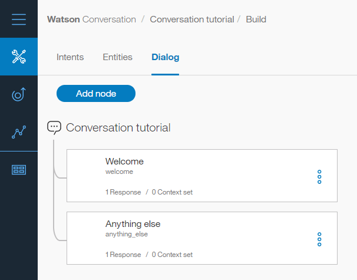

---

copyright:
  years: 2015, 2018
lastupdated: "2018-02-16"

---

{:shortdesc: .shortdesc}
{:new_window: target="_blank"}
{:tip: .tip}
{:pre: .pre}
{:codeblock: .codeblock}
{:screen: .screen}
{:javascript: .ph data-hd-programlang='javascript'}
{:java: .ph data-hd-programlang='java'}
{:python: .ph data-hd-programlang='python'}
{:swift: .ph data-hd-programlang='swift'}
{:download: .download}

# Tutoriel d'initiation
{: #getting-started}

Ce tutoriel rapide vous présente l'outil {{site.data.keyword.conversationshort}} et vous accompagne dans le processus de création de votre première conversation.
{: shortdesc}

## Avant de commencer
{: #prerequisites}

Vous aurez besoin d'une instance de service pour commencer. 

<!-- Remove the text marked `download` after there's no g-s tab in the catalog dashboard -->

Vous avez créé votre instance de service. Cliquez sur **Manage**, puis sur **Launch Tool**. Passez à l'étape 2.
{: download tip}

Si vous avez créé un projet à l'aide du service {{site.data.keyword.conversationshort}}, vous êtes prêt. Passez à l'étape 1. 

1.  Accédez à la page {{site.data.keyword.watson}} Developer Console [Services ](https://console.{DomainName}/developer/watson/services){: new_window}.
1.  Sélectionnez {{site.data.keyword.conversationshort}}, cliquez sur **Add Services**, puis inscrivez-vous afin de recevoir un compte {{site.data.keyword.Bluemix_notm}} gratuit ou connectez-vous. 
1.  Remplacez le nom du projet par `conversation-tutorial`, puis cliquez sur **Create Project**.

<!-- Remove this text after dedicated instances have the developer console: begin -->

Si vous utilisez {{site.data.keyword.Bluemix_dedicated_notm}}, créez votre instance de service à partir de la page [{{site.data.keyword.conversationshort}} ](https://console.{DomainName}/catalog/services/conversation/){: new_window} dans le catalogue. 

<!-- Remove this text after dedicated instances have the developer console: end -->

## Etape 1 : Lancement de l'outil
{: #launch-tool}

Après que vous avez créé un projet incluant le service {{site.data.keyword.conversationshort}}, la page contenant les détails du projet s'affiche. Lancez l'outil {{site.data.keyword.conversationshort}} à partir d'ici.

Cliquez sur **Launch Tool** pour {{site.data.keyword.conversationshort}} sous **Services**.

<!-- To do: Add screenshot for developer console -->

Si vous êtes invité à vous connecter aux outils, entrez vos données d'identification {{site.data.keyword.Bluemix_notm}}. 

Si vous ne vous trouvez pas sur la page contenant les détails d'un projet pour le service {{site.data.keyword.conversationshort}}, accédez à la page {{site.data.keyword.watson}} Developer Console [Projects ](https://console.{DomainName}/developer/watson/projects) et sélectionnez le projet.
{: tip}

<!-- Remove this text after dedicated instances have the developer console: begin -->

{{site.data.keyword.Bluemix_dedicated_notm}} : sélectionnez votre instance de service dans le tableau de bord pour lancer les outils. 

<!-- Remove this text after dedicated instances have the Developer Console: end -->

## Etape 2 : Création d'un espace de travail
{: #create-workspace}

Votre première étape dans l'outil {{site.data.keyword.conversationshort}} consiste à créer un espace de travail.

Un [*espace de travail*](configure-workspace.html) est le conteneur des artefacts qui définissent le flux de conversation.

1.  Dans l'outil {{site.data.keyword.conversationshort}}, cliquez sur **Create**.
1.  Nommez votre espace de travail `{{site.data.keyword.conversationshort}} tutorial`. Si le dialogue que vous prévoyez de créer utilisera une autre langue que l'anglais, choisissez cette langue dans la liste. Cliquez sur **Create**. L'onglet **Intents** de votre nouvel espace de travail s'affiche.

## Etape 3 : Création d'intentions
{: #create-intents}

Une [intention](intents.html) représente l'objectif d'une entrée utilisateur. Vous pouvez considérer les intentions comme des actions que vos utilisateurs peuvent vouloir effectuer dans votre application.

Dans le cadre de cet exemple, nous allons définir deux intentions seulement : l'une pour dire hello et l'autre pour dire goodbye.

1.  Vérifiez que vous êtes sur l'onglet Intents. (Cela devrait être le cas si vous venez de créer l'espace de travail.)
1.  Cliquez sur **Add intent**.
1.  Nommez l'intention `hello`, puis cliquez sur **Create intent**.
1.  Tapez `hello` dans la zone **Add user example** et appuyez sur **Enter**.

   Les *exemples* indiquent au service {{site.data.keyword.conversationshort}} quels types d'entrée utilisateur doivent correspondre à l'intention. Plus vous fournirez d'exemples, plus la reconnaissance des intentions utilisateur par le service sera précise.
1.  Ajoutez quatre exemples :
    - `good morning`
    - `greetings`
    - `hi`
    - `howdy`

1.  Cliquez sur l'icône de **fermeture**  pour terminer la création de l'intention #hello. 
1.  Créez une autre intention nommée #goodbye avec les cinq exemples suivants :
    - `bye`
    - `farewell`
    - `goodbye`
    - `I'm done`
    - `see you later`

Vous avez créé deux intentions, #hello et #goodbye, et fourni des exemples d'entrée utilisateur pour entraîner {{site.data.keyword.watson}} à reconnaître ces intentions dans les entrées utilisateur.

## Etape 4 : Ajout d'intentions à partir d'un catalogue
{: #add-catalog}

Ajoutez à votre espace de travail des données d'apprentissage qui ont été créées par IBM en ajoutant des intentions depuis un catalogue. Plus spécifiquement, vous accorderez à votre assistant les droits d'accès au catalogue `Business Information` de manière à permettre à votre dialogue de traiter les demandes utilisateur relatives aux informations de contact de l'entreprise. 

1.  Dans l'outil {{site.data.keyword.conversationshort}}, cliquez sur l'onglet **Catalog**. 
1.  Recherchez **Business Information** dans la liste, puis cliquez sur **Add to bot**.
1.  Ouvrez l'onglet **Intents** pour passer en revue les intentions et les exemples d'énoncé associés ayant été ajoutés à vos données d'apprentissage. Vous les reconnaîtrez facilement car chaque nom d'intention commence par le préfixe `#Business_Information_`. Vous ajouterez l'intention `#Business_Information_Contact_Us` à votre dialogue au cours d'une étape ultérieure. 

Vous avez correctement complété vos données d'apprentissage avec un contenu prédéfini fourni par IBM.

## Etape 5 : Création d'un dialogue
{: #build-dialog}

Un [dialogue](dialog-build.html) définit le flux de votre conversation sous la forme d'une arborescence logique. Chaque noeud de l'arborescence comporte une condition qui le déclenche, en fonction d'une entrée utilisateur.

Nous allons créer un dialogue simple qui gère nos intentions #hello et #goodbye, chacune d'elles ayant un seul noeud.

### Ajout d'un noeud de début

1.  Dans l'outil {{site.data.keyword.conversationshort}}, cliquez sur l'onglet **Dialog**.
1.  Cliquez sur **Create**. Deux noeuds s'affichent :
    - **Welcome** : contient un message d'accueil qui s'affiche lorsque vos utilisateurs interagissent pour la première fois avec le bot.
    - **Anything else** : contient les phrases qui sont utilisées pour répondre aux utilisateurs lorsque leur entrée n'est pas reconnue.

    
1.  Cliquez sur le noeud **Welcome** pour l'ouvrir dans la vue d'édition.
1.  Remplacez la réponse par défaut par le texte `Welcome to the {{site.data.keyword.conversationshort}} tutorial!`.

    
1.  Cliquez sur l'icône de  pour fermer la vue d'édition.

Vous avez créé un noeud de dialogue qui est déclenché par la condition `welcome` ; cette condition spéciale indique que l'utilisateur a démarré une nouvelle conversation. Votre noeud spécifie que lorsqu'une nouvelle conversation démarre, le système doit répondre avec le message d’accueil :

### Test du noeud de début

Vous pouvez tester votre dialogue à tout moment afin de le vérifier. Nous allons le tester maintenant.

- Cliquez sur l'icône  pour ouvrir le panneau "Try it out". Vous devriez voir votre message d’accueil apparaître.

    

### Ajout de noeuds pour gérer des intentions

A présent, nous allons ajouter des noeuds afin de gérer vos intentions entre le noeud `Welcome` et le noeud `Anything else`.

1.  Cliquez sur l'icône Autres options  sur le noeud **Welcome**, puis sélectionnez **Add node below**.
1.  Tapez `#hello` dans la zone **Enter a condition** de ce noeud. Ensuite, sélectionnez l'option **#hello**.
1.  Ajoutez la réponse, `Good day to you.`
1.  Cliquez sur l'icône de  pour fermer la vue d'édition.

   
1.  Cliquez sur l'icône Autres options  sur le noeud hello, puis sélectionnez **Add node below** pour créer un noeud homologue. Dans le noeud homologue, spécifiez `#Business_Information_Contact_Us` comme condition. 
1.  Ajoutez le texte suivant comme réponse. 

    `Contactez-nous au 800-426-4968 ou faites-nous part de vos commentaires en vous rendant sur le site https://www.ibm.com/scripts/contact/contact/us/en.`
1.  Cliquez sur l'icône Autres options  sur ce noeud, puis sélectionnez **Add node below** pour créer un autre noeud homologue. Dans le noeud homologue, spécifiez `#goodbye` comme condition, et `OK. See you later!` comme réponse.

### Test de la reconnaissance des intentions

Vous avez créé un dialogue simple pour reconnaître et répondre aux entrées hello et goodbye. Voyons comment il fonctionne.

1.  Cliquez sur l'icône  pour ouvrir le panneau "Try it out". Le rassurant message d'accueil s'affiche.
1.  Au bas du panneau, tapez `Hello` et appuyez sur Entrée. La sortie indique que l'intention #hello a été reconnue, et la réponse appropriée (`Good day to you.`) apparaît.
1.  Essayez les entrées suivantes :
    - `bye`
    - `howdy`
    - `see ya`
    - `good morning`
    - `sayonara`

   
1.  Entrez `Who can I call if I have questions?` et appuyez sur la touche Entrée. La sortie indique que l'intention `#Business_Information_Contact_Us` a été reconnue, et la réponse que vous avez ajoutée pour cette intention s'affiche. 

{{site.data.keyword.watson}} reconnaît vos intentions même lorsque vos entrées ne correspondent pas exactement aux exemples que vous avez ajoutés. Le dialogue utilise des intentions pour identifier l'objectif des entrées utilisateur, quelle que soit la formulation précise utilisée, puis il répond de la manière que vous avez définie.

### Résultat de la création d'un dialogue

C'est terminé. Vous avez créé une conversation simple avec deux intentions et un dialogue afin de les reconnaître.

## Etape 6 : Examen de l'exemple d'espace de travail
{: #review-sample-workspace}

Ouvrez l'exemple d'espace de travail pour visualiser des intentions qui ressemblent à celles que vous venez de créer, ainsi que beaucoup d'autres, et voyons comment elles sont utilisées dans un dialogue complexe.

1.  Revenez à la page Workspaces.
   Vous pouvez cliquer sur le bouton  dans le menu de navigation.
1.  Sur la vignette de l'espace de travail **Car Dashboard - Sample**, cliquez sur le bouton **Edit sample**.

    

## Etapes suivantes
{: #next-steps}

Ce tutoriel s'appuie sur un exemple simple. Dans le cas d'une application réelle, vous devrez définir des intentions plus intéressantes, quelques entités et un dialogue plus complexe.

- Essayez le [tutoriel](tutorial.html) avancé pour ajouter des entités et préciser l'objectif d'un utilisateur.
- [Déployez](deploy.html) votre espace de travail en le connectant à une interface utilisateur frontale, à des médias sociaux ou à un canal de transmission de messages.
- Examinez les [exemples d'application](sample-applications.html).
