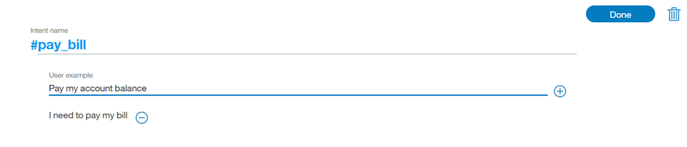
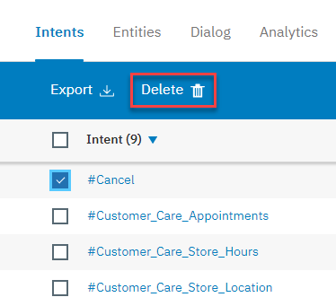
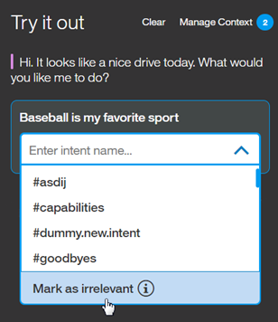

---

copyright:
  years: 2015, 2018
lastupdated: "2018-01-30"

---

{:shortdesc: .shortdesc}
{:new_window: target="_blank"}
{:tip: .tip}
{:pre: .pre}
{:codeblock: .codeblock}
{:screen: .screen}
{:javascript: .ph data-hd-programlang='javascript'}
{:java: .ph data-hd-programlang='java'}
{:python: .ph data-hd-programlang='python'}
{:swift: .ph data-hd-programlang='swift'}

# Définition d'intentions
{: #intents}

Les ***intentions*** sont des objectifs exprimés dans une entrée d'un client, par exemple, répondre à une question ou régler une facture. En reconnaissant l'intention exprimée dans une entrée d'un client, le service {{site.data.keyword.conversationshort}} peut choisir le flux de dialogue approprié pour y répondre.
{: shortdesc}

<iframe class="embed-responsive-item" id="youtubeplayer" type="text/html" width="640" height="390" src="https://www.youtube.com/embed/6HAZpBHqX8M" frameborder="0" webkitallowfullscreen mozallowfullscreen allowfullscreen> </iframe>

## Nombre limite d'intentions
{: #intent-limits}

Le nombre d'intentions et d'exemples que vous pouvez créez dépend de votre plan de service {{site.data.keyword.conversationshort}} :

| Plan de service     | Nombre d'intentions par espace de travail | Nombre d'exemples par espace de travail |
|------------------|----------------------:|-----------------------:|
| Standard/Premium |                 2 000 |                 25 000 |
| Lite             |                   100 |                 25 000 |

## Création d'intentions
{: #creating-intents}

Utilisez l'outil {{site.data.keyword.conversationshort}} pour créer des intentions.

1.  Dans l'outil {{site.data.keyword.conversationshort}}, ouvrez votre espace de travail, puis sélectionnez l'onglet **Intents** dans la barre de navigation. Si l'onglet **Intents** ne s'affiche pas, utilisez le menu  pour ouvrir la page.

1.  Sélectionnez **Create new**.

1.  Dans la zone **Intent name**, tapez un nom pour l'intention. 
    - Le nom d'intention peut contenir des lettres (au format Unicode), des nombres, des traits de soulignement, des traits d'union et des points.
    - Le nom ne peut pas correspondre à `..` ni à aucune autre chaîne composée uniquement de points.
    - Les noms d'intention ne peuvent pas contenir d'espaces et ne doivent pas excéder 128 caractères. Voici quelques exemples de noms d'intention :
        - `#weather_conditions`
        - `#pay_bill`
        - `#escalate_to_agent`

    Les outils incluent automatiquement le caractère `#` dans les noms d'intention, par conséquent, vous n'avez pas besoin d'en ajouter un.
    {: tip}

    Ajoutez une description de l'intention dans la zone **Description**. 

1.  Sélectionnez **Create intent** pour sauvegarder votre nom d'intention. 

    

1.  Ensuite, dans la zone **Add user examples**, tapez le texte d'un exemple d'utilisateur pour l'intention. Un exemple peut être n'importe quelle chaîne de 1024 caractères au maximum. Voici quelques exemples d'intention `#pay_bill` :
    - `I need to pay my bill.`
    - `Pay my account balance`
    - `make a payment`

    **Référencement des entités et des synonymes en tant qu'exemples d'intention**

    Si vous avez défini ou prévu de définir des entités qui correspondent à cette intention, reportez-vous aux entités, ou aux synonymes qui leur sont associés, dans certains des exemples. Cela vous permettra d'établir une relation entre l'intention et les entités.

    
    {: #entity-as-example}

    *Important* :

      - Les exemples de données d'intention doivent être représentatifs et typiques des données qui seront fournies par les utilisateurs finaux. Des exemples peuvent être collectés à partir de données utilisateur réelles ou auprès de personnes qui sont des spécialistes dans votre domaine spécifique. La nature précise et représentative des données est primordiale. 
      - Les données d'apprentissage et les données de test (pour l'évaluation) doivent refléter la distribution des intentions dans une utilisation réelle. Généralement, les intentions plus fréquentes possèdent un plus grand nombre d'exemples et une meilleure couverture de réponse. 
      - Vous pouvez inclure de la ponctuation dans l'exemple de texte tant que cela paraît naturel. Si vous pensez que certains utilisateurs exprimeront leurs intentions avec des exemples comportant de la ponctuation, contrairement à d'autres utilisateurs, incluez les deux versions. Généralement, plus le champ d'application sera élargi à différents canevas, plus la réponse sera appropriée. 

    **Référencement direct d'une entité @Entity en tant qu'exemple d'intention**

    Vous pouvez également choisir de référencer directement des entités dans vos exemples d'intention. Supposons que vous ayez une entité appelée`@PhoneModelName`, qui contient les valeurs *Galaxy S8*, *Moto Z2*, *LG G6* et *Google Pixel 2*. Lorsque vous créez une intention, par exemple, `#order_phone`, vous pouvez fournir des données d'apprentissage telles que les suivantes :
    - Can I get a `@PhoneModelName`?
    - Help me order a `@PhoneModelName`.
    - Is the `@PhoneModelName` in stock?
    - Add a `@PhoneModelName` to my order.

    

    **Remarque** : actuellement, vous pouvez uniquement référencer directement les entités fermées que vous définissez (les valeurs de canevas seront ignorées). Vous ne pouvez pas utiliser des [entités de système](system-entities.html).

    Si vous choisissez de référencer une entité en tant qu'exemple d'intention (par exemple, `@PhoneModelName`) *n'importe où* dans vos données d'apprentissage, elle annule la valeur correspondant à l'utilisation d'une référence directe (par exemple, *Galaxy S8*) partout ailleurs dans un exemple d'intention. Toutes les intentions utiliseront l'approche entity-as-an-intent-example ; vous ne pouvez pas sélectionner cette approche uniquement pour une intention spécifique. 

    En pratique, cela signifie que si vous aviez déjà entraîné la plupart de vos intentions sur la base de références directes (*Galaxy S8*) et que vous utilisez à présent des références d'entité (`@PhoneModelName`) pour une seule intention, cela aura un impact sur l'ensemble de votre entraînement précédent. Si vous choisissez d'utiliser des références `@Entity`, vous devez prendre soin de remplacer toutes les références directes précédentes par des références `@Entity`. 

    **Remarque** : définir un exemple d'intention avec une entité `@Entity` pour laquelle 10 valeurs sont définies **ne revient pas** à spécifier 10 fois cet exemple d'intention. Le service {{site.data.keyword.conversationshort}} n'accorde pas beaucoup d'importance à cette syntaxe d'exemple d'intention. 

    **Important** : les noms d'intention et l'exemple de texte peuvent être exposés dans des URL lorsqu'une application interagit avec le service. N'ajoutez pas d'informations sensibles ou personnelles dans ces artefacts.

    Appuyez sur **Add example** pour sauvegarder l'exemple. 

1.  Répétez le même processus pour ajouter d'autres exemples. Vous pouvez passer d'un exemple à l'autre à l'aide de la touche de tabulation. Indiquez au moins 5 exemples pour chaque intention. Plus vous fournirez d'exemples, plus votre application sera précise.

1.  Lorsque vous avez terminé d'ajouter des valeurs d'entité, sélectionnez l' pour terminer la création de l'intention. 

### Résultats

L'intention que vous avez créée est ajoutée à l'onglet Intents et le système commence à s'entraîner lui-même en utilisant les nouvelles données.

## Edition d'intentions

Vous pouvez sélectionner n'importe quelle intention de la liste pour l'ouvrir et l'éditer. Vous pouvez effectuer les modifications suivantes :

- Renommer l'intention
- Supprimer l'intention
- Ajouter, éditer, ou supprimer des exemples
- Déplacer un exemple vers une autre intention

Vous pouvez passer du nom d'intention à chaque exemple à l'aide de touche de tabulation, et le cas échéant, éditer les exemples.

Pour déplacer ou supprimer un exemple, sélectionnez-le en cochant la case qui lui correspond, puis choisissez **Move** ou **Delete**.

  

## Recherche d'intentions

Utilisez la fonction de recherche pour trouver des exemples d'utilisateur, des noms d'intention et des descriptions. 

1.  Sélectionnez l'onglet **Intents** dans la barre de navigation.

    

1.  Sélectionnez l'icône de recherche : 

1.  Entrez un terme ou une phrase de recherche. 

    

    **Remarque** : lors de votre première recherche, un index est créé ; il se peut qu'un message s'affiche pour vous inviter à patienter pendant l'indexation de votre contenu. 

### Résultats

Les intentions contenant votre terme de recherche, avec des exemples correspondants, s'affichent. Sélectionnez n'importe quel résultat pour l'ouvrir et l'éditer. 

  

## Importation d'intentions et d'exemples

Si vous possédez un grand nombre d'intentions et d'exemples, vous trouverez peut-être plus facile de les importer à partir d'un fichier CSV que de les définir un par un dans l'outil {{site.data.keyword.conversationshort}}.

1.  Collectez les intentions et les exemples dans un fichier CSV ou exportez-les à partir d'une feuille de calcul dans un fichier CSV. Le format requis pour chaque ligne du fichier est le suivant :

    ```
    <example>,<intent>
    ```
    {: screen}

    où `<example>` est le texte de l'exemple d'utilisateur, et `<intent>` est le nom de l'intention à laquelle l'exemple doit correspondre. Par exemple :

    ```
    Tell me the current weather conditions.,weather_conditions
    Is it raining?,weather_conditions
    What's the temperature?,weather_conditions
    Where is your nearest location?,find_location
    Do you have a store in Raleigh?,find_location
    ```
    {: screen}

    > **Important :** sauvegardez le fichier CSV au format UTF-8 et sans marque d'ordre d'octet.

1.  Dans l'outil {{site.data.keyword.conversationshort}}, ouvrez votre espace de travail, puis sélectionnez l'onglet **Intents** dans la barre de navigation. Si l'onglet **Intents** ne s'affiche pas, utilisez le menu  pour ouvrir la page.

1.  Sélectionnez l'icône d'*importation* . Ensuite, faites glisser un fichier, ou recherchez un fichier sur votre ordinateur. Le fichier est validé et importé et le système commence à s'entraîner lui-même en utilisant les nouvelles données.

    

    > **Important :** le fichier CSV ne doit pas excéder 10 Mo. Si votre fichier CSV est plus gros, songez à le fractionner en plusieurs fichiers et à les importer séparément.

### Résultats

Vous pouvez visualiser les intentions importées et les exemples correspondants sur l'onglet **Intents**. Vous devrez peut-être actualiser la page pour voir les nouvelles entités et les nouveaux exemples.

## Exportation d'intentions
{: #export_intents}

Vous pouvez exporter un certain nombre d'intentions vers un fichier CSV, de manière à pouvoir les importer et les réutiliser pour une autre application {{site.data.keyword.conversationshort}}. 

1.  Sur l'onglet Intents, sélectionnez les intentions souhaitées dans la liste, puis choisissez *Export*.

    

## Suppression d'intentions
{: #delete_intents}

Vous pouvez sélectionner un certain nombre d'intentions à supprimer.

**Important** : lorsque vous supprimez des intentions, vous supprimez également tous les exemples qui leur sont associés, et ces éléments ne peuvent plus être extraits ultérieurement. Tous les noeuds de dialogue qui font référence à ces intentions doivent être mis à jour manuellement de manière à ne plus faire référence au contenu supprimé.

1.  Sur l'onglet Intents, sélectionnez les intentions souhaitées dans la liste, puis choisissez *Delete*.

    

## Test de vos intentions
{: #testing-your-intents}

Lorsque vous avez fini de créer de nouvelles intentions, vous pouvez tester le système pour voir s'il reconnaît vos intentions comme prévu.

1.  Dans l'outil {{site.data.keyword.conversationshort}}, sélectionnez l'icône .

1.  Sur le panneau *Try it out*, tapez une question ou une autre chaîne de texte et appuyez sur Entrée pour voir quelle intention est reconnue. Si l'intention reconnue n'est pas celle qui est prévue, vous pouvez améliorer votre modèle en ajoutant ce texte comme exemple dans l'intention appropriée.

    Si vous avez récemment modifié votre espace de travail, il est possible qu'un message indiquant que le système est toujours en phase d'entraînement s'affiche. Lorsque cela se produit, attendez la fin de la phase d'entraînement avant de lancer les tests :
    {: tip}

    

    La réponse indique quelle intention a été reconnue à partir de votre entrée.

    

1.  Si le système n'a pas reconnu l'intention appropriée, vous pouvez corriger cela. Pour ce faire, sélectionnez l'intention affichée et choisissez l'intention correcte dans la liste. Une fois la correction soumise, le système reprend automatiquement son entraînement pour incorporer les nouvelles données.

    

1.  Si l'entrée est sans rapport avec votre application, vous pouvez indiquer ce fait. Sélectionnez l'intention affichée et choisissez **Mark as irrelevant**.

    

Si vos intentions ne sont pas correctement reconnues, songez à effectuer les modifications suivantes :

- Ajoutez le texte non reconnu comme exemple dans l'intention correcte.
- Déplacez les exemples d'une intention vers une autre.
- Déterminez si vos intentions sont trop similaires, puis redéfinissez-les le cas échéant.

## Options Absolute scoring et Mark as irrelevant

Depuis février 2017, il existe un nouvel algorithme permettant d'évaluer la cote de confiance d'une intention et de renvoyer des intentions. Vous pouvez également marquer des entrées comme non pertinentes (*irrelevant*). Ces modifications peuvent nécessiter la [mise à niveau de votre espace de travail ](upgrading.html){: new_window}.

### Option Absolute scoring

A présent, le service {{site.data.keyword.conversationshort}} évalue la cote de confiance de chaque intention isolément et non par rapport à d'autres intentions. Cela offre la souplesse nécessaire pour permettre le renvoi de plusieurs intentions. Cela signifie également que le système peut ne pas renvoyer d'intention du tout. Si la première intention a une cote de confiance inférieure à celle des autres intentions liées à l'entrée de l'utilisateur (inférieure à 0.2), cette intention est tout de même incluse dans le tableau d'intentions renvoyé en sortie par l'API, mais la définition d'une condition sur cette intention #intent renverra la valeur false. Si vous souhaitez détecter le cas où aucune intention ayant une bonne cote de confiance n'a été trouvée, vous pouvez définir une condition sur `irrelevant`.

Si les cotes de confiance relatives aux intentions changent, vous pouvez être amené à restructurer vos dialogues. Par exemple, si vous avez conditionné votre dialogue avec une intention dont la cote de confiance est maintenant faible, la réponse du système ne sera plus valide.

### Option Mark as irrelevant
{: #mark-irrelevant}

Reportez-vous à la rubrique [Langues prises en charge](lang-support.html) pour connaître la disponibilité de cette fonction. 

Après avoir mis à niveau votre espace de travail, vous pouvez [tester les entrées](#testing-your-intents) dans le panneau *Try it out* pour voir les modifications. Vous pouvez utiliser l'option **Mark as irrelevant** pour indiquer que l'entrée est sans rapport avec votre application. 

Si vous avez une intention, telle que #off_topic, pour les entrées qui sont hors de portée ou hors sujet, supprimez l'intention et testez votre espace de travail en marquant les entrées comme non pertinentes.

**Important** : les entrées marquées comme non pertinentes sont stockées dans l'espace de travail et sont incluses dans le cadre des données d'apprentissage. Vous devez être certain que vous souhaitez vraiment effectuer cette modification.

- Les entrées ne sont plus accessibles et ne peuvent plus être modifiées ultérieurement dans les outils.
- Le seul moyen de retirer la balise **Irrelevant** est d'utiliser la même entrée dans le panneau *Try it out*, puis de modifier l'intention. 
