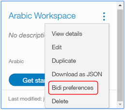

---

copyright:
  years: 2015, 2019
lastupdated: "2019-05-20"

subcollection: assistant

---

{:shortdesc: .shortdesc}
{:new_window: target="_blank"}
{:deprecated: .deprecated}
{:important: .important}
{:note: .note}
{:tip: .tip}
{:pre: .pre}
{:codeblock: .codeblock}
{:screen: .screen}
{:javascript: .ph data-hd-programlang='javascript'}
{:java: .ph data-hd-programlang='java'}
{:python: .ph data-hd-programlang='python'}
{:swift: .ph data-hd-programlang='swift'}

# Langues prises en charge
{: #language-support}

Le service {{site.data.keyword.conversationshort}} prend en charge les langues indiquées ci-après. Chaque fonction est prise en charge à un degré divers pour chaque langue.
{: shortdesc}

Dans les tableaux suivants, le niveau de prise en charge de la fonction et de la langue est indiqué selon les codes suivants :

- **GA** : la fonction est officiellement disponible et prise en charge pour cette langue. A noter que les fonctions peuvent continuer d'être mises à jour, y compris après leur commercialisation.
- **Bêta** : la fonction est prise en charge uniquement en tant que version bêta et continue de faire l'objet de tests avant qu'elle ne soit officiellement disponible dans cette langue.
- **NA** : la fonction n'est pas disponible dans cette langue.

Le premier tableau indique le niveau de prise en charge de toutes les fonctions, à l'exception de celles liées aux intentions et aux entités, qui figurent dans les deuxième et troisième tableaux.

**Tableau 1. Détails de la prise en charge des fonctions**

| Langue | **Définition [d'intentions](/docs/services/assistant?topic=assistant-intents)**, **[d'entités](/docs/services/assistant?topic=assistant-entities)**, et **[de dialogue](/docs/services/assistant?topic=assistant-dialog-build)** | **Recherche** |
|:---:|:---:|:---:|
| **Anglais (en)**                   | GA | GA |
| **Arabe (ar)**                    | GA | NA |
| **Chinois (simplifié) (zh-cn)**   | GA | Bêta |
| **Chinois (traditionnel) (zh-tw)**  | Bêta | Bêta |
| **Tchèque (cs)**                     | GA | Bêta |
| **Néerlandais (nl)**                     | GA | Bêta |
| **Français (fr)**                    | GA | Bêta |
| **Allemand (de)**                    | GA | Bêta |
| **Italien (it)**                   | GA | Bêta |
| **Japonais (ja)**                  | GA | Bêta |
| **Coréen (ko)**                    | GA | Bêta |
| **Portugais (brésil) (pt-br)** | GA | Bêta |
| **Espagnol (es)**                   | GA | Bêta |
{: caption="Détails de la prise en charge des fonctions" caption-side="top"}

**Tableau 2a. Détails de la prise en charge des fonctions d'intention**

| Langue | **[Absolute scoring](/docs/services/assistant?topic=assistant-intents#intents-absolute-scoring)** et **[Mark as irrelevant](/docs/services/assistant?topic=assistant-logs#logs-mark-irrelevant)** | **[Catalogue de contenu](/docs/services/assistant?topic=assistant-catalog)** |
|:---:|:---:|:---:|
| **Anglais (en)**                   | GA | GA |
| **Arabe (ar)**                    | Bêta | GA |
| **Chinois (simplifié) (zh-cn)**   | GA | NA |
| **Chinois (traditionnel) (zh-tw)**  | Bêta | NA |
| **Tchèque (cs)**                     | GA | NA |
| **Néerlandais (nl)**                     | GA | NA |
| **Français (fr)**                    | GA | GA |
| **Allemand (de)**                    | GA | GA |
| **Italien (it)**                   | GA | GA |
| **Japonais (ja)**                  | GA | GA |
| **Coréen (ko)**                    | GA | NA |
| **Portugais (brésil) (pt-br)** | GA | GA |
| **Espagnol (es)**                   | GA | GA |
{: caption="Détails de la prise en charge des fonctions d'intention" caption-side="top"}

**Tableau 2b. Détails de la prise en charge des fonctions d'intention (suite)**

| Langue | **[Recommandations d'exemples utilisateur](/docs/services/assistant?topic=assistant-intent-recommendations#intent-recommendations-get-example-recommendations)** | **[Recommandations d'intention](/docs/services/assistant?topic=assistant-intent-recommendations#intent-recommendations-get-intent-recommendations)** |
|:---:|:---:|
| **Anglais (en)**                   | GA | GA |
| **Arabe (ar)**                    | NA | NA |
| **Chinois (simplifié) (zh-cn)**   | NA | NA |
| **Chinois (traditionnel) (zh-tw)**  | NA | NA |
| **Tchèque (cs)**                     | NA | NA |
| **Néerlandais (nl)**                     | NA | NA |
| **Français (fr)**                    | NA | NA |
| **Allemand (de)**                    | NA | NA |
| **Italien (it)**                   | NA | NA |
| **Japonais (ja)**                  | GA | NA |
| **Coréen (ko)**                    | NA | NA |
| **Portugais (brésil) (pt-br)** | NA | NA |
| **Espagnol (es)**                   | NA | NA |
{: caption="Détails de la prise en charge des fonctions d'intention (suite)" caption-side="top"}

**Tableau 3. Détails de la prise en charge des fonctions d'entité**

| Langue | **[Correspondance partielle d'entités](/docs/services/assistant?topic=assistant-entities#entities-fuzzy-matching)** | **[Entités contextuelles](/docs/services/assistant?topic=assistant-entities#entities-create-annotation-based)** | **[Recommandations de synonymes](/docs/services/assistant?topic=assistant-entities#entities-synonyms)** |
|:---:|:---:|:---:|:---:|
| **Anglais (en)**                   | GA | Bêta | GA |
| **Arabe (ar)**                    | GA (Fautes d'orthographe uniquement) | NA | NA |
| **Chinois (simplifié) (zh-cn)**   | NA | NA | NA |
| **Chinois (traditionnel) (zh-tw)**  | NA | NA | NA |
| **Tchèque (cs)**                     | GA (Fautes d'orthographe uniquement) | NA | NA |
| **Néerlandais (nl)**                     | GA (Fautes d'orthographe uniquement) | NA | NA |
| **Français (fr)**                    | GA (Fautes d'orthographe uniquement) | NA | GA |
| **Allemand (de)**                    | GA (Fautes d'orthographe uniquement) | NA | NA |
| **Italien (it)**                   | GA (Fautes d'orthographe uniquement) | NA | NA |
| **Japonais (ja)**                  | GA (Fautes d'orthographe uniquement) | NA | GA |
| **Coréen (ko)**                    | GA (Fautes d'orthographe uniquement) | NA | NA |
| **Portugais (brésil) (pt-br)** | GA (Fautes d'orthographe uniquement) | NA | NA |
| **Espagnol (es)**                   | GA (Fautes d'orthographe uniquement) | NA | GA |
{: caption="Détails de la prise en charge des fonctions d'entité" caption-side="top"}

**Tableau 4. Détails de la prise en charge des fonctions d'entité de système**

| Langue | **Entités de système ([nombre](/docs/services/assistant?topic=assistant-system-entities#system-entities-sys-number), [devise](/docs/services/assistant?topic=assistant-system-entities#system-entities-sys-currency), [pourcentage](/docs/services/assistant?topic=assistant-system-entities#system-entities-sys-percentage), [date, heure](/docs/services/assistant?topic=assistant-system-entities#system-entities-sys-date-time))** | **[Nouvelles entités de système](/docs/services/assistant?topic=assistant-beta-system-entities)** |
|:---|:---:|:---:|
| **Anglais (en)**                   | GA, Bêta ([emplacement](/docs/services/assistant?topic=assistant-system-entities#system-entities-sys-location), [personne](/docs/services/assistant?topic=assistant-system-entities#system-entities-sys-person)) | Bêta |
| **Arabe (ar)**                    | Bêta | NA |
| **Chinois (simplifié) (zh-cn)**   | GA | NA |
| **Chinois (traditionnel) (zh-tw)**  | Bêta | NA |
| **Tchèque (cs)**                     | GA | NA |
| **Néerlandais (nl)**                     | GA | NA |
| **Français (fr)**                    | GA | NA |
| **Allemand (de)**                    | GA | Bêta |
| **Italien (it)**                   | GA | NA |
| **Japonais (ja)**                  | GA | NA |
| **Coréen (ko)**                    | GA | NA |
| **Portugais (brésil) (pt-br)** | GA | NA |
| **Espagnol (es)**                   | GA | NA |
{: caption="Détails de la prise en charge des fonctions d'entité de système" caption-side="top"}

**Remarque :** le service {{site.data.keyword.conversationshort}} prend en charge plusieurs langues, mais l'interface de l'outil proprement dite (descriptions, libellés, etc.) est en anglais. Toutes les langues prises en charge peuvent être utilisées pour la saisie et l'entraînement via l'interface en anglais.

**Conformité à la norme GB18030** : GB18030 est une norme chinoise qui spécifie une page de codes étendue destinée au marché chinois. Cette norme de page de codes est importante pour l'industrie des logiciels car le China National Information Technology Standardization Technical Committee exige que toute application logicielle commercialisée sur le marché chinois après le 1er septembre 2001 respecte la norme GB18030. Le service {{site.data.keyword.conversationshort}} prend en charge ce codage et est certifié conforme à la norme GB18030.

## Modification de la langue d'une compétence
{: #language-support-change-language}

Une fois qu'une compétence est créée, sa langue ne peut pas être modifiée. S'il doit impérativement modifier la langue d'une compétence, l'utilisateur doit télécharger cette compétence. Il doit ensuite utiliser un éditeur de texte pour éditer le fichier JSON obtenu à l'issue du téléchargement et rechercher une propriété JSON nommée `language`.

La langue d'origine de la compétence doit être définie pour la propriété `language`, par exemple, la valeur `en` pour l'anglais. Modifiez la valeur de cette propriété, en la remplaçant par la langue souhaitée (`fr` pour le français, `de` pour l'allemand, etc.). Sauvegardez les modifications effectuées dans le fichier JSON et importez le fichier ainsi modifié dans votre instance de service {{site.data.keyword.conversationshort}}.

## Configuration des langues bidirectionnelles
{: #language-support-configure-bi-directional}

Pour les langues bidirectionnelles, telles que l'arabe, vous mouvez modifier vos préférences de compétence en conséquence. Sur la vignette de compétence, sélectionnez le menu déroulant *Actions*, puis l'option **Bidi preferences** (cette option s'affiche uniquement dans les compétences pour lesquelles une langue bidirectionnelle est définie) :

Sélectionnez l'une des options suivantes pour votre compétence :

- **GUI Direction** : indique le sens de la disposition des éléments, tels que les boutons ou les menus, dans l'interface graphique. Choisissez`LTR` (de gauche à droite) ou `RTL` (de droite à gauche). Si cette option n'est pas spécifiée, l'outil applique le paramétrage du sens de l'interface graphique défini dans le navigateur Web.
- **Text Direction** : indique le sens du texte lors de la saisie. Choisissez `LTR` (de gauche à droite) ou `RTL` (de droite à gauche) ou sélectionnez `Auto` pour activer la sélection automatique du sens du texte en fonction des paramètres de votre système. Avec l'option `None`, le texte s'affiche de gauche à droite.
- **Numeric Shaping** : indique quelle forme numérique utiliser lors de la présentation de chiffres ordinaires. Choisissez `Nominal`, `Arabic-Indic` ou `Arabic-European`. Avec l'option `None`, les chiffres s'affichent au format occidental.
- **Calendar Type** : indique le mode de filtrage des dates dans l'interface utilisateur de la compétence. Choisissez `Islamic-Civil`, `Islamic-Tabular`, `Islamic-Umm al-Qura` ou `Gregorian`.

  Ce paramètre ne s'applique pas au panneau "Try it out".
  {: note}

Lorsque vous avez terminé de choisir vos options, cliquez sur **Update** pour les sauvegarder et revenir à l'onglet de la compétence.

## Utilisation des caractères accentués
{: #language-support-accents}

Dans un paramétrage conversationnel, les utilisateurs peuvent ou non utiliser des accents lors de l'interaction avec le service {{site.data.keyword.conversationshort}}. Ainsi, les versions accentuées et non accentuées de mots peuvent être interprétées de la même manière pour la détection d'intention et la reconnaissance d'entité.

Toutefois, dans certaines langues, telles que l'espagnol, certains accents peuvent modifier le sens de l'entité. Par conséquent, pour la détection d'entité, même si l'entité d'origine comporte implicitement un accent, l'assistant peut aussi établir une correspondance avec la version non accentuée de la même entité, mais avec une cote de confiance légèrement inférieure.

Par exemple, avec le mot "barrió", qui est accentué et correspond au participe passé du verbe "barrer" (balayer, en français), l'assistant peut également établir une correspondance avec le "barrio" (quartier, en français), mais avec une cote de confiance légèrement inférieure.

Le système fournit la cote de confiance la plus élevée dans les entités pour lesquelles des correspondances exactes sont trouvées. Par exemple, `barrio` ne sera pas détecté si `barrió` figure dans l'ensemble d'entraînement et `barrió` ne sera pas détecté si `barrio` figure dans l'ensemble d'entraînement.

Vous êtes supposé entraîner le système à reconnaître les mots avec les caractères et les accents appropriés. Par exemple, si vous vous attendez à recevoir la réponse `barrió`, vous devez ajouter `barrió` dans l'ensemble d’entraînement.

Bien qu'il ne s'agisse pas d'accents, la même règle s'applique aux mots qui comportent, par exemple, la lettre espagnole `ñ` et non la lettre `n`, par exemple, "uña" et "una". En l'occurrence, la lettre `ñ` n'est pas juste une lettre `n` dotée d'un accent, mais réellement une lettre spécifique de l'alphabet espagnol.

Vous pouvez activer la fonction Fuzzy matching si vous pensez que vos clients n'utiliseront pas les accents de manière appropriée ou feront des fautes d'orthographe (par exemple, en tapant un `n` au lieu d'un `ñ`), ou vous pouvez les exclure explicitement des exemples d'entraînement.
