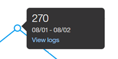

---

copyright:
  years: 2015, 2019
lastupdated: "2019-02-21"

subcollection: assistant

---

{:shortdesc: .shortdesc}
{:new_window: target="_blank"}
{:deprecated: .deprecated}
{:important: .important}
{:note: .note}
{:tip: .tip}
{:pre: .pre}
{:codeblock: .codeblock}
{:screen: .screen}
{:javascript: .ph data-hd-programlang='javascript'}
{:java: .ph data-hd-programlang='java'}
{:python: .ph data-hd-programlang='python'}
{:swift: .ph data-hd-programlang='swift'}

# Présentation des métriques
{: #logs-overview}

La page Overview fournit un récapitulatif des interactions entre les utilisateurs et votre assistant. Vous pouvez visualiser le volume de trafic pour une période donnée, ainsi que les intentions et les entités qui ont été le plus souvent reconnues dans des conversations utilisateur.
{: shortdesc}

Utilisez les métriques pour répondre à des questions telles que :  

* Quels jours ont connu le plus grand nombre de conversations au cours du mois passé ? 
* Quel était le nombre moyen de conversations par semaine au cours du mois passé ? 
* Quelles intentions sont apparues le plus souvent au cours de la semaine passée ?
* Quelles valeurs d'entité ont été reconnues le plus souvent en février ? 

Pour consulter les informations de métriques, sélectionnez **Overview** dans la barre de navigation. 

  

## Commandes
{: #logs-overview-controls}

Vous pouvez utiliser les commandes suivantes pour filtrer les informations : 

- Filtres *Intents* et *Entities* : utilisez l'un de ces filtres déroulants pour afficher les données d'une intention ou d'une entité spécifique dans votre compétence.

  **Important** : les filtres d'intention et d'entité sont renseignés par les intentions et les entités de la ***compétence***, et non par le contenu de la source de données. Si vous avez [sélectionné une source de données](/docs/services/assistant?topic=assistant-logs#logs-deploy-id) autre que la compétence, vous ne verrez peut-être pas d'intention ou d'entité dans les journaux de votre source de données en tant qu'option dans les filtres, sauf si ces intentions et entités font également partie de la compétence. 

- *Refresh data* : vous permet d'actualiser immédiatement les statistiques de la page Overview. La page Overview indique à quel moment les données qu'elle présente ont été mises à jour pour la dernière fois. Vous pouvez sélectionner **Refresh data** si vous pensez que des données plus récentes sont peut-être disponibles.

  Les statistiques représentent le trafic externe (appels d'utilisateurs ou d'API) qui a interagi avec votre assistant ; elles n'incluent pas les interactions à partir du panneau *Try it out* dans l'outil. 

- *Commande de période* : cette commande permet de choisir la période pour laquelle les données sont affichées. Cette commande affecte toutes les données affichées sur la page, pas uniquement le nombre de conversations présenté dans le graphique, mais également les statistiques affichées avec le graphique, et les listes recensant les intentions et les entités les plus souvent reconnues (Top intents et Top entities).

  Les statistiques peuvent couvrir une période plus longue que la période pendant laquelle les journaux de conversations sont conservés. {: note}

  

  Vous pouvez choisir d'afficher les données pour une seule journée, une semaine, un mois ou un trimestre. Dans chaque cas, les points de données affichés sur le graphique s'ajustent par rapport à une période de mesure appropriée. Par exemple, lorsque vous visualisez un graphique pour une journée, les données sont présentées sous forme de valeurs horaires, mais lorsque vous visualisez un graphique pour une semaine, les données sont affichées par jour. Un semaine court toujours du dimanche jusqu'au samedi. Vous ne pouvez pas créer de périodes personnalisées, telles qu'une semaine qui court du jeudi au mercredi suivant ou un mois qui commence à une date autre que le 1er.

  Si vous choisissez une vue du jour unique, par exemple, l'heure affichée pour chaque conversation est localisée pour refléter le fuseau horaire de votre navigateur. L'heure peut différer de l'horodatage affiché si vous consultez le même journal de conversation via un appel d'API. Les appels de journal d’API sont toujours affichés en UTC. 

    

## Graphiques et statistiques 
{: #logs-overview-graphs}

Plusieurs fiches de score statistiques fournissent des données de journal pour votre application :  

* *Total conversations* : nombre total de conversations entre les utilisateurs actifs et votre application, pendant la période sélectionnée, comme indiqué dans le graphique correspondant. 

  Une conversation unique est un ensemble de messages comprenant les messages qu'un utilisateur actif envoie à votre application et les messages auxquels votre application répond. 

  **Important** : une 'conversation' est considérée comme étant *tout* ensemble de messages envoyés ou reçus par une application/un bot ; ainsi, si le service commence par dire "Bonjour, en quoi puis-je vous aider ?" et que l'utilisateur ferme son navigateur sans répondre, ce message est inclus dans le nombre total de conversations.

* *Avg. msg. per conversation* : nombre total de messages reçus pendant la période sélectionnée, divisé par le nombre total de conversations pendant la période sélectionnée, comme indiqué dans le graphique correspondant.
* *Max. conversations* : nombre maximal de conversations pour un seul point de données au cours de la période sélectionnée. 
* *Weak understanding* : nombre de messages individuels mal compris. Ces messages ne sont pas classés par une intention et ne contiennent aucune entité connue. Ces messages peuvent s'avérer utiles pour identifier d'éventuels problèmes au niveau du dialogue.

Les graphiques détaillés fournissent des informations supplémentaires :  

* *Total conversations* : nombre total de conversations entre les utilisateurs actifs et votre application, pendant la période sélectionnée. 

  Lorsque vous visualisez le graphique ***Conversations***, vous pouvez cliquer sur un point de données individuel pour voir la valeur numérique, comme illustré ci-dessous :

  

* *Avg. msg. per conversation* : nombre total de messages reçus pendant la période sélectionnée, divisé par le nombre total de conversations pendant la période sélectionnée.
* *Total messages* : nombre total de messages reçus d'utilisateurs actifs au cours de la période sélectionnée.
* *Active users* : nombre d'utilisateurs uniques ayant utilisé votre application au cours de la période sélectionnée. 
* *Avg. conversations per user* : nombre total de conversations au cours de la période sélectionnée, divisé par le nombre total d'utilisateurs uniques au cours de la période sélectionnée. 

  Les statistiques pour *Active users* et *Avg. conversations per user* nécessitent un paramètre `user_id` unique. Pour plus d'informations, reportez-vous à la rubrique [Activation des métriques utilisateur](/docs/services/assistant?topic=assistant-logs-resources#logs-resources-user-id). {: important}

## Intentions et entités le plus fréquemment reconnues
{: #logs-overview-tops}

Vous pouvez également afficher les intentions et les entités qui ont été reconnues le plus souvent durant la période spécifiée.

* *Top intents* : les intentions sont affichées dans une liste simple. Vous pouvez non seulement afficher le nombre de fois qu'une intention a été reconnue, mais également sélectionner une intention pour ouvrir la page **User conversations** avec la plage de dates filtrée de façon à correspondre aux données que vous visualisez, et l'intention filtrée de façon à correspondre à l'intention sélectionnée.

* Les entités *Top entities* sont également affichés dans une liste. Pour chaque entité, vous pouvez sélectionner dans la colonne **Values** une liste des valeurs les plus courantes identifiées pour cette entité au cours de la période. Vous pouvez également sélectionner une entité pour ouvrir la page **User conversations** avec la plage de dates filtrée pour correspondre aux données que vous consultez et l'entité filtrée pour correspondre à l'entité sélectionnée.

Reportez-vous à la rubrique [Leçons tirées des conversations](/docs/services/assistant?topic=assistant-logs) pour obtenir des conseils sur la manière de modifier les intentions et les entités en fonction des découvertes que vous avez effectuées en examinant les intentions et les entités reconnues par le service. 
