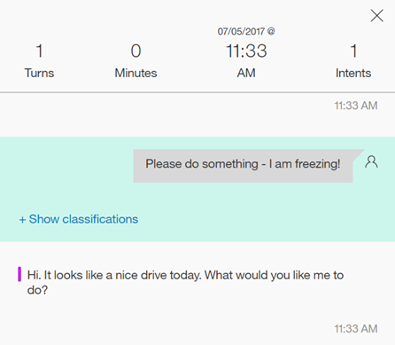
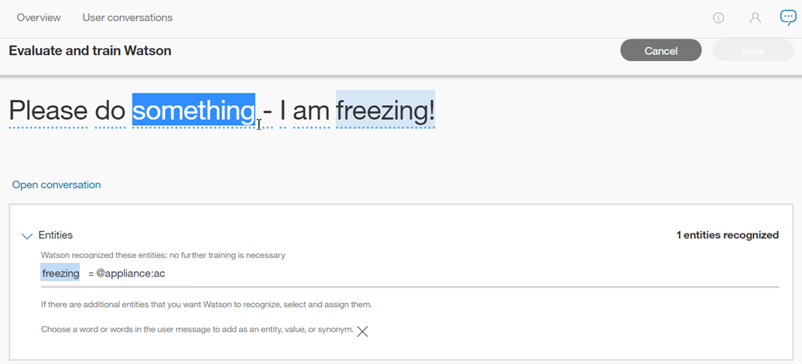

---

copyright:
  years: 2015, 2019
lastupdated: "2019-02-28"

subcollection: assistant

---

{:shortdesc: .shortdesc}
{:new_window: target="_blank"}
{:deprecated: .deprecated}
{:important: .important}
{:note: .note}
{:tip: .tip}
{:pre: .pre}
{:codeblock: .codeblock}
{:screen: .screen}
{:javascript: .ph data-hd-programlang='javascript'}
{:java: .ph data-hd-programlang='java'}
{:python: .ph data-hd-programlang='python'}
{:swift: .ph data-hd-programlang='swift'}

# Leçons tirées des conversations 
{: #logs}

Pour ouvrir une liste de messages entre des utilisateurs et l'assistant qui utilise cette compétence de dialogue, sélectionnez **User conversations** dans la barre de navigation.
{: shortdesc}

Lorsque vous ouvrez la page **User conversations**, la vue par défaut répertorie les résultats correspondant au dernier jour, les résultats les plus récents étant affichés en premier. L'intention supérieure (#intent) et toute valeur d'entité (@entity) reconnue utilisée dans un message, ainsi que le texte du message, sont disponibles. Pour les intentions qui ne sont pas reconnues, la valeur affichée est *Irrelevant*. Si une entité n'est pas reconnue ou n'a pas été indiquée, la valeur affichée est *No entities found*.


Il est important de noter que la page **User conversations** affiche le nombre total de *messages* entre les utilisateurs et votre application. Un message est un énoncé unique que l'utilisateur envoie à l'application. Chaque conversation peut être constituée de plusieurs messages. Par conséquent, le nombre de résultats sur cette page **User conversations** est différent du nombre de conversations affiché sur la page [Overview](/docs/services/assistant?topic=assistant-logs-overview).

## Limites des journaux
{: #logs-limits}

La durée de conservation des messages dépend de votre forfait de service {{site.data.keyword.conversationshort}} :

  Forfait de service                         | Conversation du message de discussion
  ------------------------------------ | ------------------------------------
  Premium                              | 90 derniers jours
  Plus                                 | 30 derniers jours
  Standard                             | 30 derniers jours
  Lite                                 | 7 derniers jours

## Filtrage des messages
{: #logs-filter-messages}

Vous pouvez filtrer les messages à l'aide des critères suivants : *Search user statements*, *Intents*, *Entities* et *Last* n *days*:

*Search user statements* - tapez un mot dans la barre de recherche. Les entrées des utilisateurs sont recherchées, mais pas les réponses à votre application. 

*Intents* - sélectionnez le menu déroulant et tapez une intention dans la zone d'entrée ou choisissez une intention dans la liste proposée. Vous pouvez sélectionner plusieurs intentions, ce qui permet de filtrer les résultats à l'aide de n'importe quelle intention sélectionnée, y compris *Irrelevant*.


*Entities* - sélectionnez le menu déroulant et tapez un nom d'entité dans la zone d'entrée ou choisissez une entité dans la liste proposée. Vous pouvez sélectionner plusieurs entités, ce qui permet de filtrer les résultats à l'aide de n'importe quelle entité sélectionnée. Si vous effectuez un filtrage à l'aide de *intent and entity*, les messages qui comportent les deux valeurs seront inclus dans les résultats. Vous pouvez également effectuer un filtrage à l'aide de *No entities found*.


La mise à jour des messages peut prendre un certain temps. Laissez passer au moins 30 minutes après une interaction entre l'utilisateur et votre application avant de tenter de filtrer l'affichage sur ce contenu. 

## Affichage d'un message individuel
{: #logs-see-message}

Vous pouvez développer chaque entrée de message pour voir ce que l'utilisateur a dit au cours de la totalité de la conversation et ce que votre application a répondu. Pour ce faire, sélectionnez **Open conversation**. Vous accédez automatiquement au message que vous avez sélectionné au sein de cette conversation.

L'heure affichée en haut de chaque conversation est localisée pour refléter le fuseau horaire de votre navigateur. L'heure peut différer de l'horodatage affiché si vous consultez le même journal de conversation via un appel d'API. Les appels de journal d’API sont toujours affichés en UTC. 



Vous pouvez ensuite choisir d'afficher la ou les classification(s) du message que vous avez sélectionné.


## Amélioration grâce aux assistants 
{: #logs-deploy-id}

La création d'une compétence de dialogue est un processus itératif. Pendant que vous développez votre compétence, vous utilisez le panneau *Try it out* pour vérifier que le service reconnaît les intentions et les entités appropriées dans les entrées de test et pour effectuer d'éventuelles corrections. 

A partir de la page User conversations, vous pouvez analyser les interactions réelles entre l’assistant utilisé pour déployer la compétence et vos utilisateurs. Sur la base de ces interactions, vous pouvez apporter des corrections pour améliorer la précision avec laquelle les intentions et les entités sont reconnues par votre compétence de dialogue. Il est difficile de savoir exactement *comment* vos utilisateurs poseront des questions ou quels messages aléatoires ils pourraient envoyer, il est donc important d'analyser fréquemment les conversations réelles pour améliorer vos compétences de dialogue. 

Pour une instance {{site.data.keyword.conversationshort}} incluant plusieurs assistants, il peut parfois s'avérer utile d'utiliser les données de message provenant de la compétence de dialogue d'un assistant pour améliorer la compétence de dialogue utilisée par un autre assistant dans la même instance.

 Si vous êtes un utilisateur Premium de {{site.data.keyword.conversationshort}}, vos instances peuvent éventuellement être configurées pour autoriser l’accès aux données de journal issues des assistants de vos différentes instances Premium. 

Par exemple, supposons que vous ayez une instance {{site.data.keyword.conversationshort}} nommée *HelpDesk*. Vous pouvez avoir un assistant Production et un assistant Développement dans votre instance HelpDesk. Lorsque vous travaillez dans la compétence de dialogue pour l'assistant Développement, vous pouvez utiliser les journaux issus des messages de l'assistant Production pour améliorer la compétence de dialogue de l'assistant Développement. 

Les modifications que vous apportez ensuite à la compétence de dialogue de l’assistant Développement n’affecteront que la compétence de dialogue de cet assistant, même si vous utilisez les données de messages envoyés à l’assistant Production.  

De même, si vous créez plusieurs versions d'une compétence, vous pouvez utiliser les données de message d'une version pour améliorer les données d'apprentissage d'une autre version. 

### Sélection d'une source de données  
{: #logs-pick-data-source}

Le terme *source de données* fait référence aux journaux compilés à partir des conversations entre les clients et l'assistant ou l'application personnalisée par laquelle une compétence de dialogue a été déployée. 

Lorsque vous ouvrez l'onglet *Analytics*, les métriques générées par les interactions de l'utilisateur avec la compétence de dialogue en cours sont affichées. Aucune métrique ne s'affiche si la compétence actuelle n'a pas été déployée et utilisée par les clients. 

Pour renseigner les métriques avec les données de message d'une compétence de dialogue ou d'une version de compétence ajoutée à un assistant ou une application personnalisée différent (ayant déjà interagi avec des clients), procédez comme suit :  

1.   Cliquez dans la zone **Data source** pour afficher une liste des assistants contenant les données de journal que vous pouvez utiliser.

    La liste comprend les assistants déployés et auxquels vous avez accès. Pour plus d'informations sur cette option, reportez-vous à la rubrique [*Affichage des ID de déploiement* : explication](#logs-deployment-id-explained).

1.  Sélectionnez une source de données.

Les informations statistiques pour la source de données sélectionnée sont affichées. 

Notez que la liste n'inclut pas les versions de compétences. Pour obtenir des données associées à une version de compétence spécifique, vous devez connaître le laps de temps pendant lequel une version de compétence spécifique a été utilisée par un assistant déployé. Vous pouvez sélectionner l’assistant comme source de données, puis filtrer les données de métriques en fonction des dates appropriées.  

### *Affichage des ID de déploiement* : explication
{: #logs-deployment-id-explained}

Les applications utilisant la version V1 de l'API doivent spécifier un ID de déploiement dans chaque message envoyé à l'aide de l'API `/message`. Cet ID identifie l'application déployée à partir de laquelle l'appel a été effectué. La page Analytics peut utiliser cet ID de déploiement pour extraire et afficher les journaux associés à une application active spécifique. 

Pour les assistants ou les applications personnalisées utilisant la version V2 de l'API, le service inclut automatiquement un identifiant système et un identifiant de compétence avec chaque appel /message. Vous pouvez donc choisir une source de données par nom d'assistant au lieu d'utiliser un ID de déploiement. 

Pour ajouter l'ID de déploiement, les utilisateurs de l'API V1 incluent la propriété de déploiement dans les métadonnées du [contexte ](https://cloud.ibm.com/apidocs/assistant?curl=#get-response-to-user-input){: new_window} comme dans l'exemple suivant : 

```json
"context" : {
  "metadata" : {
       "deployment": "HelpDesk-Production"
  }
}
```
{: codeblock}

## Amélioration des données d'apprentissage
{: #logs-fix-data}

Utilisez les informations tirées de conversations utilisateur réelles pour corriger le modèle associé à votre compétence de dialogue. 

Si vous utilisez des données provenant d'une autre source de données, les améliorations que vous apportez au modèle s'appliquent uniquement à la compétence de dialogue actuelle. La zone **Data source** indique la source des messages que vous utilisez pour améliorer cette compétence de dialogue. Le haut de la page indique la compétence de dialogue à laquelle vous appliquez les modifications.  

### Correction d'une intention
{: #logs-correct-intent}

1.  Pour corriger une intention, sélectionnez l'icône d'édition  en regard de l'entité #intent choisie.
1.  Dans la liste proposée, sélectionnez l'intention correcte pour cette entrée.
    - Commencez à taper dans la zone d'entrée pour filtrer la liste d'intentions.
    - Vous pouvez également choisir **Mark as irrelevant** dans ce menu. (Pour plus d'informations, reportez-vous à la rubrique sur l'option [Mark as irrelevant](/docs/services/assistant?topic=assistant-intents#intents-mark-irrelevant).) Ou, vous pouvez choisir **Do not train on intent**, et dans ce cas, ce message n'est pas sauvegardé comme exemple pour l'entraînement.

    
1.  Sélectionnez **Save**.

    

    Le service {{site.data.keyword.conversationshort}} prend en charge l'ajout *en l'état* d'une entrée utilisateur en tant qu'exemple à une intention. Si vous utilisez des références @entity en tant qu'exemples dans vos données d'apprentissage d'intention et qu'un message d'utilisateur que vous souhaitez sauvegarder contient une valeur ou un synonyme d'entité provenant de vos données d'apprentissage, vous devrez éditer le message ultérieurement. Après avoir sauvegardé le message, éditez-le sur la page Intents afin de remplacer l'entité à laquelle il fait référence. Pour plus d'informations, reportez-vous à la rubrique [Référencement direct d'une entité @Entity en tant qu'exemple d'intention](/docs/services/assistant?topic=assistant-intents#intents-entity-as-example).
    {: tip}

### Ajout d'une valeur d'entité ou d'un synonyme
{: #logs-add-entity}

1.  Pour ajouter une valeur d'entité ou un synonyme, sélectionnez l'icône d'édition  en regard de l'entité @entity choisie.
1.  Sélectionnez **Add entity**.

    
1.  A présent, sélectionnez un mot ou une phrase dans l'entrée utilisateur soulignée.

    
1.  Choisissez une entité à laquelle la phrase mise en évidence sera ajoutée en tant que valeur.
    - Commencez à taper dans la zone d'entrée pour filtrer la liste d'entités et de valeurs.
    - Pour ajouter la phrase mise en évidence en tant que synonyme pour une valeur existante, choisissez `@entity:value` dans la liste déroulante.

    
1.  Sélectionnez **Save**.

    
