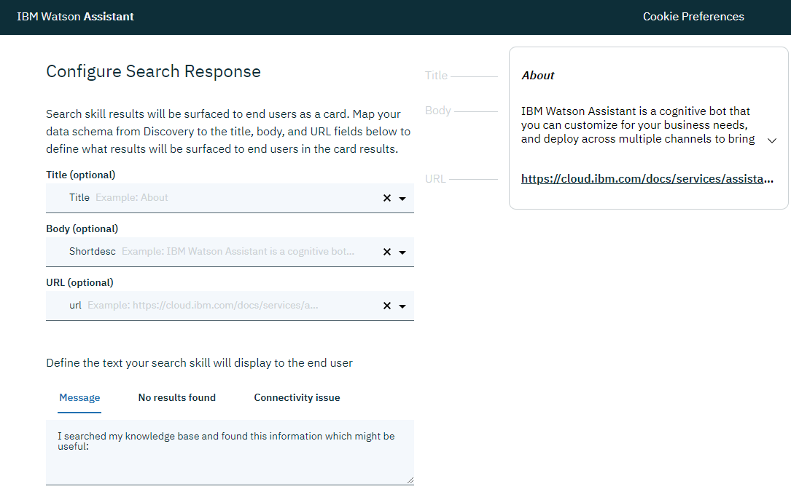

---

copyright:
  years: 2015, 2019
lastupdated: "2019-08-02"

subcollection: assistant

---

{:shortdesc: .shortdesc}
{:new_window: target="_blank"}
{:deprecated: .deprecated}
{:important: .important}
{:note: .note}
{:tip: .tip}
{:pre: .pre}
{:codeblock: .codeblock}
{:screen: .screen}
{:javascript: .ph data-hd-programlang='javascript'}
{:java: .ph data-hd-programlang='java'}
{:python: .ph data-hd-programlang='python'}
{:swift: .ph data-hd-programlang='swift'}

# Création d'une compétence de recherche   
{: #skill-search-add}

Un assistant utilise une *compétence de recherche* pour acheminer des demandes complexes de clients vers le service {{site.data.keyword.discoveryfull}}. {{site.data.keyword.discoveryshort}} traite l'entrée saisie comme une requête de recherche. Il trouve des informations pertinentes pour la requête à partir d'une source de données externe et les renvoie à l'assistant.
{: shortdesc}

Cette fonction est disponible uniquement pour les utilisateurs du forfait Plus ou Premium.
{: note}

Ajoutez une compétence de recherche à votre assistant pour empêcher l'assistant de dire des choses telles que `Je suis désolé. Je ne peux pas vous aider`. Au lieu de cela, l'assistant peut interroger des documents ou des données de société existants pour trouver éventuellement des informations utiles et les partager avec le client.


La vidéo de 4 minutes suivante donne un aperçu de la compétence de recherche.

<iframe class="embed-responsive-item" id="youtubeplayer" title="Aperçu de la compétence de recherche" type="text/html" width="640" height="390" src="https://www.youtube.com/embed/ZcgGf8J2Cfw?rel=0" frameborder="0" webkitallowfullscreen mozallowfullscreen allowfullscreen> </iframe>

Pour en savoir plus sur les avantages des techniques de recherche pour votre entreprise, [lisez cet article ](https://medium.com/ibm-watson/adding-search-to-watson-assistant-99e4e81839e5){: new_window}.

## Fonctionnement
{: #skill-search-add-how}

La compétence de recherche recherche des informations dans une collection de données que vous avez créée à l'aide du service {{site.data.keyword.discoveryshort}}.

{{site.data.keyword.discoveryshort}} est un service qui analyse, convertit et normalise vos données non structurées. Le service applique l'analyse de données et l'intuition cognitive pour enrichir vos données de sorte que vous puissiez plus facilement trouver et extraire des informations significatives à partir de celles-ci ultérieurement. Pour en savoir plus sur {{site.data.keyword.discoveryshort}}, reportez-vous à la [documentation produit](/docs/services/discovery?topic=discovery-about){: new_window}.

Généralement, le type de collecte de données que vous ajoutez à {{site.data.keyword.discoveryshort}} et auquel vous pouvez accéder à partir de votre assistant contient des informations appartenant à votre société. Ces informations exclusives peuvent inclure des FAQ, du matériel de vente, des manuels techniques ou des documents rédigés par des experts de domaine. Exploitez cette collection dense d'informations exclusives pour trouver rapidement des réponses aux questions des clients. 

Le diagramme suivant illustre le traitement des entrées utilisateur lorsqu'une compétence de dialogue et une compétence de recherche sont ajoutées à un assistant. 


## Avant de commencer
{: #skill-search-add-prereqs}

Si vous ne disposez pas d'une instance de service {{site.data.keyword.discoveryshort}}, une instance de forfait Lite gratuite est mise à votre disposition dans le cadre de ce processus. Si vous disposez d'une instance de service {{site.data.keyword.discoveryshort}} existante, connectez-vous à cette instance ; vous n'êtes pas invité à créer une instance dans le cadre de ce processus.

Si vous créez d'abord une instance Discovery, n'ajoutez pas la source de données pré-enrichie nommée *Watson Discovery News* à votre instance. Ce type de données ne peut pas être recherché à partir de {{site.data.keyword.conversationshort}}.
{: tip}

## Création de la compétence de recherche
{: #skill-search-add-task}

1.  Cliquez sur l'onglet **Skills**, puis cliquez sur **Create skill**.

1.  Cliquez sur la vignette *Search skill*, puis sur **Next**.

    Vous ne pouvez sélectionner la compétence de recherche que si vous êtes un utilisateur du forfait Plus ou Premium.
    {: note}

1.  Spécifiez les détails de la nouvelle compétence :
    - **Name** : nom qui ne doit pas excéder 100 caractères. Le nom est obligatoire.
    - **Description** : description facultative qui ne doit pas excéder 200 caractères.

1.  Cliquez sur **Continue**.    

Les étapes restantes diffèrent selon que vous avez ou non accès à une instance de service {{site.data.keyword.discoveryshort}} existante avec des collections créées ou non. Suivez la procédure appropriée à votre situation :

- [Connexion à une instance Watson Discovery existante ](#skill-search-add-connect-discovery)
- [Création d'une instance Watson Discovery ](#skill-search-add-create-discovery)

## Connexion à une instance de service Watson Discovery existante
{: #skill-search-add-connect-discovery}

1.  Choisissez l'instance de service {{site.data.keyword.discoveryshort}} à partir de laquelle vous souhaitez extraire des informations.
{: #choose-d-instance}

    Toutes les instances de service {{site.data.keyword.discoveryshort}} auxquelles vous avez accès apparaissent dans la liste.

    Si vous voyez un avertissement indiquant que certaines de vos instances de service {{site.data.keyword.discoveryshort}} ne disposent pas de données d'identification, cela signifie que vous avez accès à au moins une instance que vous n'avez jamais ouverte directement à partir du tableau de bord {{site.data.keyword.cloud_notm}}. Vous devez accéder à une instance de service pour que les données d'identification puissent être créées. Et les données d'identification doivent exister pour que {{site.data.keyword.conversationshort}} puisse établir une connexion à l'instance de service {{site.data.keyword.discoveryshort}} en votre nom. Si vous pensez qu'une instance de service {{site.data.keyword.discoveryshort}} ne figure pas dans la liste, ouvrez l'instance à partir du tableau de bord {{site.data.keyword.cloud}} directement pour générer les données d'identification.
    {: note}

1.  Indiquez la collection de données à utiliser en effectuant l’une des opérations suivantes :
{: #pick-data-collection}

    - Choisissez une collection de données existante.

      Vous pouvez cliquer sur le lien *Open in Discovery* pour examiner la configuration d'une collection de données avant de choisir celle à utiliser.

      Accédez à [Configure the search](#search-skill-add-configure).

    - Si vous ne possédez pas de collection ou si vous ne souhaitez pas utiliser l'une des collections de données répertoriées, cliquez sur **Create a new collection** pour en ajouter une. Suivez la procédure de la rubrique [Créer une collection de données](#search-skill-add-create-discovery-collection).

      Le bouton **Create a new collection** ne s'affiche pas si vous avez atteint le nombre maximal de collections que vous êtes autorisé à créer en fonction de votre forfait de service {{site.data.keyword.discoveryshort}}. Pour plus d'informations sur les limites des forfaits, reportez-vous à la rubrique [Forfaits de tarification {{site.data.keyword.discoveryshort}} ](/docs/services/discovery/discovery-about?topic=discovery-discovery-pricing-plans){: new_window}.
      {: note}

## Création d'une instance de service Watson Discovery
{: #skill-search-add-create-discovery}

1.  Pour créer une instance de service {{site.data.keyword.discoveryshort}}, cliquez sur **Create new collection**.

    Si vous ne disposez pas d'une instance de service {{site.data.keyword.discoveryshort}} existante, une instance gratuite du service {{site.data.keyword.discoveryshort}} est créée pour vous.

    Une instance de forfait Lite du service est mise à disposition dans {{site.data.keyword.Bluemix_notm}}, quel que soit le forfait de service {{site.data.keyword.conversationshort}} que vous utilisez.
    {: note}

1.  Vérifiez les conditions d'utilisation de l'instance, puis cliquez sur **Accept** pour continuer.

1.  [Créez une collection de données](#skill-search-add-create-discovery-collection).

## Création d'une collection de données
{: #skill-search-add-create-discovery-collection}

Si vous disposez d'un forfait Lite du service Discovery, vous avez la possibilité de mettre à niveau votre forfait. Si vous ne souhaitez pas procéder à la mise à niveau immédiatement, cliquez sur **Let's get started**.

1.  Pour créer une collection {{site.data.keyword.discoveryshort}}, effectuez l'une des opérations suivantes :

      - Pour créer une collection à partir de données stockées dans un type de source de données pour lequel {{site.data.keyword.discoveryshort}} fournit une prise en charge intégrée, sélectionnez un type de source de données. 

        1.  Fournissez les informations requises pour la source de données choisie, puis cliquez sur **Connect**.

            Pour plus d'informations, reportez-vous à la rubrique [Connexion aux sources de données ](/docs/services/discovery?topic=discovery-sources){: new_window}.
        1.  Indiquez la fréquence à laquelle vous souhaitez que les données de la source de données soient synchronisées avec la collection que vous créez dans {{site.data.keyword.discoveryshort}}.
        1.  Spécifiez les informations que vous souhaitez extraire de la source de données et inclure dans votre collection {{site.data.keyword.discoveryshort}}.

            Les options affichées diffèrent en fonction du type de source de données.

            - Pour une source de données Salesforce, sélectionnez les types d'objet que vous souhaitez extraire des documents source. Vous pouvez sélectionner un [Type d'objet de cas ](https://developer.salesforce.com/docs/atlas.en-us.object_reference.meta/object_reference/sforce_api_objects_case.htm#!) représentant un *cas*, qui est un problème client, par exemple.
            - Pour une source de données Sharepoint, vous spécifiez les chemins.
            - Pour les référentiels de fichiers, vous spécifiez des répertoires ou des fichiers.
            - Pour une source de données d'exploration Web, spécifiez l'URL de base d'un site Web que vous souhaitez explorer. La page Web que vous spécifiez et toutes les pages auxquelles elle est liée sont explorées et un document est créé par page Web.

            Accordez à Watson quelques minutes pour commencer à créer des documents. Dès que la source commence à être ingérée, le nombre de documents affichés sur la page des détails {{site.data.keyword.discoveryshort}} augmente. Vous devrez peut-être actualiser la page. 
            
            Pour obtenir de l'aide sur la création de sources de données, reportez-vous à la rubrique [Traitement des incidents](#skill-search-add-troubleshoot).

        1.  Cliquez sur **Save and sync objects**.

            La collection de données est créée. Une fois le processus terminé, une page de récapitulatif est affichée dans {{site.data.keyword.discoveryshort}}, qui est hébergé dans un onglet de navigateur Web distinct.

      - Pour créer une collection en téléchargeant des documents, cliquez sur **Upload documents**.

        1.  Définissez d'abord la collection, puis téléchargez les documents. Fournissez les informations suivantes :

            - Nom de la collection. Le nom doit être unique pour cette instance de service.
            - Langue. Sélectionnez la langue des fichiers que vous ajoutez à cette collection. Pour plus d'informations sur les langues prises en charge par {{site.data.keyword.discoveryshort}}, reportez-vous à la rubrique [Support de langue ](/docs/services/discovery?topic=discovery-language-support){: new_window}.

              Si vous téléchargez un document PDF et souhaitez en extraire les informations sur la partie, la nature et la catégorie, développez la section **Advanced**, puis cliquez sur **Use the Default Contract Configuration with this collection**. Pour plus d'informations, reportez-vous à la rubrique [Exigences relatives aux collections ](/docs/services/discovery?topic=discovery-element-classification#element-collection){: new_window}. 
        1.  Téléchargez des documents.

            Les types de fichiers pris en charge incluent les fichiers PDF, HTML, JSON et DOC. Pour plus d'informations, reportez-vous à la rubrique [Ajout de contenu ](/docs/services/discovery?topic=discovery-addcontent){: new_window}.
            {: note}

            Aucune synchronisation en cours des documents téléchargés n'est disponible. Si vous souhaitez prendre en compte les modifications apportées à un document, téléchargez une version ultérieure du document. 

Attendez que la collection soit entièrement ingérée avant de revenir à {{site.data.keyword.conversationshort}}.

### Exemple de création de collection de données
{: #skill-search-add-json-collection-example}

Par exemple, vous pouvez avoir un fichier JSON tel que celui-ci :

```bash
{
  "Title": "About",
  "Shortdesc": "IBM Watson Assistant est un bot cognitif que vous pouvez personnaliser en fonction des besoins de votre entreprise et que vous pouvez déployer sur plusieurs canaux pour apporter de l'aide à vos clients où et quand ils en ont besoin."
,
  "Topics": "overview",
  "url": "https://cloud.ibm.com/docs/services/assistant?topic=assistant-index"
}
```
{: codeblock}

Si vous téléchargez un fichier JSON contenant des valeurs de nom répétitives, seule la première occurrence de la paire nom-valeur est indexée et renvoyée par la recherche. Divisez le fichier en plusieurs fichiers JSON et téléchargez l'ensemble.
{: tip}

## Configuration de la recherche
{: #skill-search-add-configure}

1.  A partir de l'instance {{site.data.keyword.discoveryshort}}, cliquez sur **Finish setup in Watson Assistant**.

1.  Dans la page de la compétence de recherche {{site.data.keyword.conversationshort}}, cliquez sur **Configure**.

1.  Choisissez les zones de collection {{site.data.keyword.discoveryshort}} à partir desquelles vous souhaitez extraire le texte à inclure dans le résultat de la recherche qui est renvoyé à l'utilisateur.

    Les zones disponibles diffèrent en fonction des données que vous avez acquises. 

    Chaque résultat de recherche peut être constitué des sections suivantes :

    - **Title** : titre du résultat de la recherche. Utilisez le titre, le nom ou le type de zone similaire de la collection comme titre du résultat de la recherche.

      Vous devez sélectionner un élément pour le titre, faute de quoi, aucune réponse du résultat de la recherche ne s'affiche dans les intégrations Facebook et Slack. 
    - **Body** : description du résultat de la recherche. Utilisez un extrait, un récapitulatif ou une zone en surbrillance de la collection comme corps du résultat de la recherche.

       Vous devez sélectionner un élément pour le corps, faute de quoi, aucune réponse du résultat de la recherche ne s'affiche dans les intégrations Facebook et Slack. 
    - **URL** : cette zone peut être remplie avec tout contenu de pied de page que vous souhaitez inclure à la fin du résultat de la recherche.

       Par exemple, vous pouvez inclure un lien hypertexte vers l'objet de données d'origine dans sa source de données native. La plupart des sources de données en ligne fournissent des URL publiques à référence automatique pour les objets du magasin prenant en charge l'accès direct. Si vous ajoutez une URL, elle doit être valide et accessible. Si tel n'est pas le cas, l'intégration Slack n'inclut pas l'URL dans sa réponse et l'intégration Facebook ne renvoie aucune réponse.

       Les intégrations Facebook et Slack peuvent afficher la réponse du résultat de la recherche lorsque la zone URL est vide.
  
    Vous devez sélectionner une valeur pour au moins l'une des sections du résultat de la recherche.
    {: important}

    Pour obtenir de l'aide, reportez-vous à la rubrique [Conseils pour la sélection de la zone de collection](#skill-search-add-field-tips).

    Si aucune option n'est disponible dans les zones déroulantes, donnez à {{site.data.keyword.discoveryshort}} plus de temps pour terminer la création de la collection. Une fois que vous avez patienté, si la collection n'a pas été créée, il se peut qu'elle ne contienne aucun document ou qu'elle comporte des erreurs d'ingestion que vous devez résoudre en premier lieu.

    Pour poursuivre l'[exemple du fichier JSON téléchargé](#skill-search-add-json-collection-example), un bon mappage consiste à utiliser les zones *Title*, *Shortdesc* et *url*.

    

    Lorsque vous ajoutez des mappages de zone, un aperçu du résultat de la recherche s'affiche avec des informations provenant des zones correspondantes de votre collection de données. Cet aperçu vous montre ce qui est inclus dans la réponse du résultat de la recherche qui est renvoyée aux utilisateurs.

    Pour obtenir de l'aide sur la configuration de la recherche, reportez-vous à la rubrique [Traitement des incidents](#skill-search-add-troubleshoot).

1.  Rédigez différents messages à partager avec les utilisateurs en fonction du succès de la recherche. 

    <table>
    <caption>Messages de résultats de la recherche</caption>
    <tr>
      <th>Nom de zone</th>
      <th>Scénario</th>
      <th>Exemple de message</th>
    </tr>
    <tr>
      <td>Message</td>
      <td>Les résultats de la recherche sont renvoyés</td>
      <td>J'ai trouvé ces informations qui pourraient être utiles : </td>
    </tr>
    <tr>
      <td>No results found</td>
      <td>Aucun résultat de recherche n'a été trouvé</td>
      <td>J'ai cherché dans ma base de connaissances des informations susceptibles de répondre à votre requête, mais je n'ai rien trouvé d'intéressant à partager.</td>
    </tr>
    <tr>
      <td>Error message</td>
      <td>Je n'ai pas pu effectuer la recherche pour une raison quelconque</td>
      <td>J'aurais peut-être des informations susceptibles de répondre à votre requête, mais je ne peux pas effectuer de recherches dans ma base de connaissances pour le moment.</td>
    </tr>
    </table>

1.  Cliquez sur l'icône **Try it** pour ouvrir le panneau "Try it out" à des fins de test. Entrez un message de test pour afficher les résultats renvoyés lorsque vos choix de configuration sont appliqués à la recherche. Faites les ajustements nécessaires.

1.  Cliquez sur **Create**.

Si vous souhaitez modifier la configuration de la carte de résultat de la recherche ultérieurement, ouvrez à nouveau la compétence de recherche et apportez des modifications. Vous n'avez pas besoin de sauvegarder les modifications au fur et à mesure que vous les apportez ; ils sont automatiquement appliqués. Lorsque vous êtes satisfait des résultats de la recherche, cliquez sur **Save** pour terminer la configuration de la compétence de recherche.

Si vous décidez de vous connecter à une autre instance de service ou collecte de données {{site.data.keyword.discoveryshort}}, créez une nouvelle compétence de recherche et configurez-la pour vous connecter à l'autre instance. Vous **ne pouvez pas** modifier l'instance de service ou les détails de la collecte de données d'une compétence de recherche après avoir créé cette compétence.
{: important}

### Conseils pour la sélection des zones de collection
{: #skill-search-add-field-tips}

Les zones de collection appropriées pour extraire les données varient en fonction de la source de données de votre collection et de son enrichissement. Une fois que vous avez choisi un type de collecte de données, les valeurs de zone de collection sont préremplies avec les zones source qui sont considérées comme étant les plus susceptibles de contenir des informations utiles vu le type de source de données de la collection. Toutefois, vous connaissez vos données mieux que quiconque. Vous pouvez remplacer les zones source par celles qui contiennent les meilleures informations pour répondre à vos besoins.

Pour plus d'informations sur la structure des documents de votre collection, y compris les noms des zones contenant des informations que vous souhaitez extraire, ouvrez la collection dans {{site.data.keyword.discoveryshort}}, puis cliquez sur l'icône View data schema .

Les zones source sont créées lors de la création de la collection. Pour plus d'informations sur les zones générées telles que `enriched_text.concepts.text`, reportez-vous à la rubrique [Configuration de votre service > Ajout d'enrichissements ](/docs/services/discovery?topic=discovery-configservice#adding-enrichments){: new_window}.

## Traitement des incidents
{: #skill-search-add-troubleshoot}

Consultez ces informations pour obtenir de l'aide sur l'exécution des tâches courantes.

- **Création d'une collection de données d'exploration Web** : ce que vous devez savoir lorsque vous créez une source de données d'exploration Web :

    - Pour un forfait {{site.data.keyword.discoveryshort}} Lite, vous ne pouvez pas créer plus de 1000 documents. 
    - Pour augmenter le nombre de documents disponibles dans la collection de données, cliquez sur l'ajout d'un groupe d'URL dans lequel vous pouvez répertorier les URL des pages que vous souhaitez analyser, mais qui ne sont pas liées à l'URL d'origine.
    - Pour réduire le nombre de documents disponibles dans la collection de données, spécifiez un sous-domaine de l'URL de base. Ou, dans les paramètres d'exploration Web, limitez le nombre de sauts que Watson peut effectuer à partir de la page initiale. Vous pouvez également spécifier des sous-domaines à exclure explicitement de l'exploration.
    - Si aucun document n'est répertorié après quelques minutes et une actualisation de page, assurez-vous que le contenu que vous souhaitez ingérer est disponible à partir de la source de la page de l'URL. Certains contenus de page Web sont générés dynamiquement et ne peuvent donc pas être explorés.

- **Configuration des résultats de recherche pour les documents téléchargés** : si vous utilisez une collection de documents téléchargés et que vous ne pouvez pas obtenir les résultats de recherche appropriés ou que les résultats ne sont pas suffisamment concis, pensez à utiliser *Smart Document Understanding* lorsque vous créez la collection de données. 

  Cette fonction vous permet d'annoter les documents en fonction du formatage de texte. Par exemple, vous pouvez enseigner à {{site.data.keyword.discoveryshort}} que tout texte en gras de 28 points est un titre de document. Si vous appliquez ces informations à la collection lorsque vous l'intégrez, vous pouvez ultérieurement utiliser la zone *title* comme source de la section de titre de votre résultat de recherche. 
  
  Vous pouvez également utiliser Smart Document Understanding pour fractionner des documents volumineux en segments plus faciles à explorer. Pour plus d'informations, reportez-vous à la rubrique [Smart Document Understanding ](/docs/services/discovery?topic=discovery-sdu) dans la documentation {{site.data.keyword.discoveryshort}}.

- **Amélioration des résultats de la recherche** : si vous n'aimez pas les résultats que vous voyez, consultez ces informations pour obtenir de l'aide.

  - Appelez la compétence de recherche à partir d'un noeud de dialogue et spécifiez les détails du filtre. 

    A partir d'une réponse de compétence de recherche de noeud de dialogue, vous pouvez spécifier un filtre complet de syntaxe de requête {{site.data.keyword.discoveryshort}} pour réduire les résultats. 
    
    Par exemple, vous pouvez définir un filtre qui écarte tous les documents de la collection de données qui ne mentionnent pas d'intention dans le titre du document ou dans une autre zone de métadonnées. Ou le filtre peut éliminer des documents qui n'identifient pas une entité en tant qu'entité connue dans les métadonnées de la collecte de données ou qui ne mentionnent l'entité nulle part dans le texte intégral du document. Pour plus d'informations sur l'ajout d'un type de réponse de compétence de recherche, reportez-vous à la rubrique [Ajout de réponses enrichies](https://cloud.ibm.com/docs/services/assistant?topic=assistant-dialog-overview#dialog-overview-multimedia-add).

    Pour plus de conseils sur l'amélioration des résultats, lisez l'article [Improve your natural language query results from Watson Discovery ](https://developer.ibm.com/blogs/improving-your-natural-language-query-results-from-watson-discovery/).

## Etapes suivantes
{: #skill-search-add-next-steps}

Une fois la compétence créée, elle apparaît sous la forme d'une vignette sur la page Skills.

La compétence de recherche ne peut pas interagir avec les clients jusqu'à ce qu'elle soit ajoutée à un assistant et que celui-ci soit déployé. Reportez-vous à la rubrique [Création d’assistants](/docs/services/assistant?topic=assistant-assistant-add).

### Ajout de la compétence à un assistant
{: #skill-search-add-to-assistant}

Vous pouvez ajouter une compétence à un assistant. Ouvrez la vignette de l'assistant et ajoutez la compétence à l'assistant à partir de là. Vous ne pouvez pas choisir l'assistant qui utilisera la compétence à partir de la page de configuration des compétences.

Une compétence de recherche peut être utilisée par plusieurs assistants.

1.  Dans l'onglet Assistants, cliquez pour ouvrir la vignette de l'assistant auquel vous souhaitez ajouter la compétence.

1.  Cliquez sur **Add Search Skill**.

1.  Cliquez sur **Add existing skill**.

    Cliquez sur la compétence que vous souhaitez ajouter parmi les compétences disponibles affichées.

Après avoir ajouté une compétence de recherche à un assistant, elle est automatiquement activée pour l'assistant comme suit :

- Si l'assistant n'a qu'une seule compétence de recherche, toute entrée utilisateur soumise à l'un des canaux d'intégration de l'assistant déclenche la compétence de recherche.

- Si l'assistant possède à la fois une compétence de dialogue et une compétence de recherche, toute entrée utilisateur déclenche d'abord la compétence de dialogue. La boîte de dialogue traite toute entrée utilisateur dont le niveau de fiabilité est élevé. Toutes les requêtes qui déclenchent normalement le noeud `anything_else` dans l'arborescence de dialogue sont envoyées à la compétence de recherche à la place.

  Vous pouvez empêcher le déclenchement de la recherche à partir du noeud `anything_else` en suivant les étapes de la rubrique [Désactivation de la recherche](#search-skill-add-disable).
  {: note}

- Si vous souhaitez qu'une requête de recherche spécifique soit déclenchée pour des questions spécifiques, ajoutez un type de réponse de compétence de recherche au noeud de dialogue approprié. Pour plus d'informations, reportez-vous à la rubrique [Réponses](/docs/services/assistant?topic=assistant-dialog-overview#dialog-overview-multimedia).

## Déclencheurs de recherche
{: #skill-search-add-trigger}

La compétence de recherche est déclenchée des manières suivantes : 

- **Noeud Anything else** : recherche une réponse pertinente dans une source de données externe lorsqu'aucun des noeuds de dialogue ne peut répondre à la requête de l'utilisateur.

  Au lieu d'afficher un message standard, tel que `Je ne sais pas comment vous aider.` l'assistant peut dire `Ces informations peuvent peut-être vous aider :` suivi de la transmission renvoyée par la recherche. Si une compétence de recherche est liée à votre assistant, chaque fois que le noeud `anything_else` est déclenché, plutôt que d'afficher la réponse du noeud, une recherche est effectuée. L'assistant transmet l'entrée utilisateur en tant que requête à votre compétence de recherche et renvoie les résultats de la recherche en tant que réponse.

  Vous pouvez empêcher le déclenchement de la recherche à partir du noeud `anything_else` en suivant les étapes de la rubrique [Désactivation de la recherche](#search-skill-add-disable).
  {: note}

- **Type de réponse de recherche ** : si vous ajoutez un type de réponse de recherche à un noeud de dialogue, l'assistant extrait une transmission d'une source de données externe et la renvoie en tant que réponse à une question particulière. Ce type de recherche se produit uniquement lorsque le noeud de dialogue individuel est traité.

  Cette approche est utile si vous souhaitez restreindre une requête utilisateur avant d'effectuer une recherche. Par exemple, la branche de dialogue peut collecter des informations sur le type d'appareil que le client souhaite acheter. Lorsque vous connaissez la marque et le modèle, vous pouvez ensuite envoyer un mot clé de modèle dans la requête soumise à la compétence de recherche et obtenir de meilleurs résultats.
- **Compétence de recherche uniquement** : si seule une compétence de recherche est liée à un assistant et qu'aucune compétence de dialogue n'est liée à l'assistant, une requête de recherche est alors soumise au service {{site.data.keyword.discoveryshort}} lorsqu'une entrée utilisateur est reçue de l'un des canaux d'intégration de l'assistant.

## Test de la compétence de recherche
{: #search-skill-add-test}

Après avoir configuré la recherche, vous pouvez envoyer des requêtes de test pour afficher les résultats renvoyés par {{site.data.keyword.discoveryshort}} à l'aide du panneau "Try it out" de la compétence de recherche.

Pour tester l'expérience complète qu'ont les clients lorsqu'ils posent des questions auxquelles le dialogue répond ou qui déclenchent une recherche, utilisez une intégration de canal, telle que le lien d'aperçu. 

Vous ne pouvez pas tester l'expérience utilisateur de bout en bout complète à partir du panneau "Try it out" du dialogue. La compétence de recherche est configurée séparément et associée à un assistant. La compétence de dialogue n'a aucun moyen de connaître les détails de la recherche et, par conséquent, ne peut pas afficher les résultats de la recherche dans le panneau "Try it out".
{: important}

Configurez au moins un canal d'intégration pour tester la compétence de recherche. Dans le canal, entrez des requêtes qui déclenchent la recherche. Si vous lancez un type de recherche à partir de votre dialogue, testez le dialogue pour vous assurer que la recherche est déclenchée comme prévu. Si vous n'utilisez pas les types de réponse à la recherche, vérifiez qu'une recherche est déclenchée uniquement lorsqu'aucun noeud de dialogue existant ne peut traiter l'entrée utilisateur. Et chaque fois qu'une recherche est déclenchée, assurez-vous qu'elle renvoie des résultats significatifs.

## Envoi de demandes supplémentaires à la compétence de recherche
{: #search-skill-add-increase-flow}

Si vous souhaitez que la compétence de dialogue réponde moins souvent et qu'elle envoie davantage de requêtes à la compétence de recherche à la place, vous pouvez configurer le dialogue pour le faire.

Vous devez ajouter une compétence de dialogue et une compétence de recherche à votre assistant pour que cette approche fonctionne.

Suivez cette procédure pour réduire le risque de réponse de la boîte de dialogue en réinitialisant le seuil de niveau de confiance du paramètre par défaut de 0,2 à 0,5. Si vous définissez le seuil de niveau de confiance sur 0,5, votre assistant ne répond pas par une réponse du dialogue, à moins qu'il ne soit convaincu à plus de 50 % que le dialogue puisse comprendre l'intention de l'utilisateur et y répondre. 

1.  Dans la page *Dialog* de votre compétence de dialogue, vérifiez que le dernier noeud de l'arborescence de dialogue comporte une condition `anything_else`.

    Chaque fois que ce noeud est traité. La compétence de recherche est déclenchée.

1.  Ajoutez un dossier au dialogue. Placez le dossier au-dessus du premier noeud de dialogue que vous souhaitez mettre en évidence. Ajoutez la condition suivante au dossier :

    `intents[0].confidence > 0.5`

    Cette condition est appliquée à tous les noeuds du dossier. La condition indique à votre assistant de traiter les noeuds dans le dossier uniquement si votre assistant est confiant à au moins 50 % qu'il connaît l'intention de l'utilisateur.

1.  Déplacez les noeuds de dialogue que vous ne souhaitez pas que votre assistant traite souvent dans le dossier.

Après avoir modifié le dialogue, testez l'assistant pour vous assurer que la compétence de recherche est déclenchée aussi souvent que vous le souhaitez.

Une autre approche consiste à enseigner au dialogue les sujets à ignorer. Pour ce faire, vous pouvez ajouter les énoncés que vous souhaitez que l'assistant envoie immédiatement à la compétence de recherche en tant qu'expressions de test dans le panneau "Try it out" de la compétence de dialogue. Vous pouvez ensuite sélectionner l’option **Mark as irrevelant** dans le panneau "Try it out" pour enseigner au dialogue à ne pas répondre à cet énoncé ou à d’autres similaires. Pour plus d'informations, reportez-vous à la rubrique [Enseigner à votre assistant les sujets à ignorer](/docs/services/assistant?topic=assistant-logs#logs-mark-irrelevant).

## Désactivation de la recherche
{: #search-skill-add-disable}

Vous pouvez désactiver le déclenchement de la compétence de recherche.

Vous pouvez le faire temporairement pendant que vous configurez l'intégration. Ou vous pouvez uniquement déclencher une recherche pour des requêtes utilisateur spécifiques que vous pouvez identifier dans le dialogue et utiliser un type de réponse de compétence de recherche pour répondre.

Pour empêcher le déclenchement de la compétence de recherche, procédez comme suit : 

1.  Dans la page **Assistants**, cliquez sur le menu correspondant à votre assistant, puis choisissez **Settings**.
1.  Ouvrez la page *Search Skill*, puis cliquez pour passer à l'option **Disabled**.
