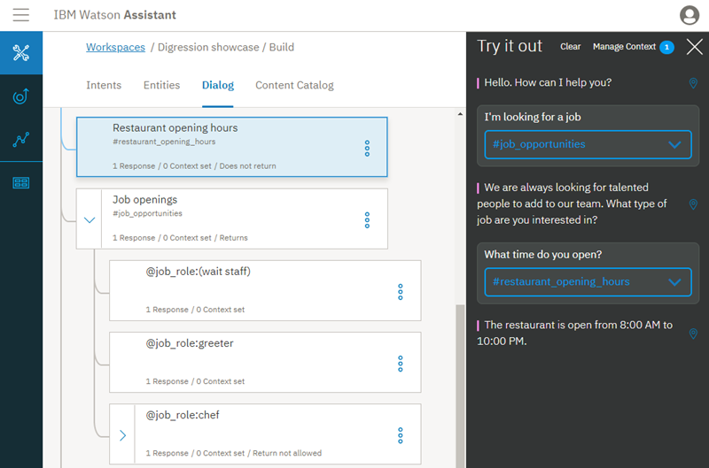

---

copyright:
  years: 2015, 2019
lastupdated: "2019-02-12"

subcollection: assistant

---

{:shortdesc: .shortdesc}
{:new_window: target="_blank"}
{:deprecated: .deprecated}
{:important: .important}
{:note: .note}
{:tip: .tip}
{:pre: .pre}
{:codeblock: .codeblock}
{:screen: .screen}
{:javascript: .ph data-hd-programlang='javascript'}
{:java: .ph data-hd-programlang='java'}
{:python: .ph data-hd-programlang='python'}
{:swift: .ph data-hd-programlang='swift'}

# Tutoriel : Compréhension des digressions 
{: #tutorial-digressions}

Dans ce tutoriel, vous verrez directement comment fonctionnent les digressions.
{: shortdesc}

## Objectifs du tutoriel
{: #tutorial-digressions-objectives}

A la fin du tutoriel, vous comprendrez comment : 

- fonctionnent les digressions
- les paramètres de digression affectent le déroulement du dialogue 
- tester les paramètres de digression pour un dialogue 

### Durée
{: #tutorial-digressions-duration}

Ce tutoriel dure environ 20 minutes.

### Prérequis
{: #tutorial-digressions-prereqs}

Si vous ne possédez pas d'instance {{site.data.keyword.conversationshort}}, effectuez l'étape **Avant de commencer** du [Tutoriel d'initiation](/docs/services/assistant?topic=assistant-getting-started#getting-started-prerequisites) pour en créer une. 

## Etape 1 : Importation de la compétence de dialogue Digression showcase 
{: #tutorial-digressions-import-json}

Vous devez d'abord importer la compétence de dialogue *Digression showcase* dans votre instance {{site.data.keyword.conversationshort}}.

1.  Téléchargez le fichier [digression-showcase.json](https://github.com/watson-developer-cloud/community/raw/master/watson-assistant/digression-showcase.json).
1.  Dans votre instance {{site.data.keyword.conversationshort}}, cliquez sur l'icône .
1.  Cliquez sur **Choose a file**, puis sélectionnez le fichier **digression-showcase.json** que vous avez téléchargé précédemment.
1.  Cliquez sur **Import** pour terminer l'importation de la compétence de dialogue.

## Etape 2 : Digression temporaire du dialogue 
{: #tutorial-digressions-temporarily-digress-away}

Les digressions permettent à l'utilisateur de s'éloigner d'une branche de dialogue afin de modifier temporairement le sujet avant de revenir au flux de dialogue initial. Dans cette étape, vous allez commencer à faire une réservation au restaurant, puis vous ferez une digression pour demander les horaires d'ouverture du restaurant. Après avoir fourni les informations sur les heures d’ouverture, le service reviendra au flux de dialogue de réservation de restaurant. 

1.  Cliquez sur **Dialog** pour passer de la page contenant les intentions à une vue de l'arborescence de dialogue.

1.  Cliquez sur l'icône  pour ouvrir le panneau "Try it out". 
1.  Entrez `Faire une réservation de restaurant` dans la zone de texte.

    Le service vous demande alors pour quel jour vous souhaitez réserver, `Pour quel jour souhaitez-vous réserver ?`

1.  Cliquez sur l'icône **Location**  en regard de la réponse pour mettre en surbrillance le noeud qui a déclenché la réponse, à savoir le noeud **Réservation de restaurant** dans l'arborescence de dialogue.

    
1.  Entrez `Demain`.

    Le service vous demande alors pour quelle heure vous souhaitez réserver, `Pour quelle heure souhaitez-vous réserver ?`

1.  Vous ne savez pas quand le restaurant ferme, donc vous demandez `A quelle heure ferme le restaurant ?`

    Le bot s'éloigne du noeud de réservation de restaurant pour traiter le noeud **Heures d'ouverture du restaurant**. Il répond par `Le restaurant est ouvert de 8h00 à 22h00.` Le service revient ensuite au noeud de réservation de restaurant et vous demande à nouveau l'heure de la réservation. 

    
1.  **Facultatif** : pour terminer le flux de dialogue, entrez `20h00` pour l'heure de réservation et `2` pour le nombre de convives.

Félicitations ! Vous avez effectué une digression d'un flux de dialogue et à revenir au flux. 

## Etape 3 : Désactivation des digressions d'attribut 
{: #tutorial-digressions-disable-slot}

Au cours de cette étape, vous allez modifier le paramétrage de la digression du noeud de réservation de restaurant afin d'empêcher les utilisateurs de s'éloigner du noeud et observer l'incidence du changement de paramètre sur le flux de dialogue. 

1.  Observons les paramètres de digression actuels du noeud de **Réservation de restaurant**. Cliquez sur le noeud pour l'ouvrir dans la vue édition.

1.  Cliquez sur **Customize**, puis sur l'onglet **Digressions**.

    

1.  Désactivez (**off**) l'option à bascule **Allow digressions away**, puis cliquez sur **Apply**.

1.  Cliquez sur l'icône de  pour fermer la vue d'édition de noeud.

1.  Cliquez sur **Clear** dans le panneau "Try it out" pour réinitialiser le dialogue. 

1.  Entrez `Faire une réservation de restaurant`.

    Le service vous demande alors pour quel jour vous souhaitez réserver, `Pour quel jour souhaitez-vous réserver ?`

1.  Entrez `Demain`.

    Le service vous demande alors pour quelle heure vous souhaitez réserver, `Pour quelle heure souhaitez-vous réserver ?`

1.  Demandez `A quelle heure ferme le restaurant ?`

    Le service reconnaît que la question déclenche l'intention #restaurant_opening_hours, mais n'en tient pas compte et affiche à nouveau l'invite associée à l'attribut @sys-time. 

Vous avez empêché l'utilisateur de s'éloigner du processus de réservation de restaurant. 

## Etape 4 : Digression vers un noeud de non retour  
{: #tutorial-digressions-digress-without-return}

Vous pouvez configurer un noeud de dialogue pour qu'il ne revienne pas au noeud dont le service s'est éloigné afin que le noeud en cours soit traité. Pour illustrer cela, vous allez modifier le paramètre de digression du noeud des heures d'ouverture du restaurant. A l'étape 2, vous avez constaté qu'après s'être éloigné du noeud de réservation de restaurant pour accéder au noeud des heures d'ouverture du restaurant, le service est revenu au noeud de réservation pour poursuivre le processus de réservation.  Dans cet exercice, après avoir modifié le paramètre, vous vous écarterez du dialogue **Opportunités d'emploi** pour demander les heures d'ouverture du restaurant et vérifier que le service ne revient pas à l'endroit où il s'est interrompu. 

1.  Cliquez pour ouvrir le noeud **Heures d'ouverture du restaurant**.

1.  Cliquez sur **Customize**, puis sur l'onglet **Digressions**.

1.  Développez la section **Digressions can come into this node** et désélectionnez la case **Return after digression**. Cliquez sur **Apply**, puis sur  pour fermer la vue d'édition du noeud. 

1.  Cliquez sur **Clear** dans le panneau "Try it out" pour réinitialiser le dialogue. 

1.  Pour activer le noeud de dialogue **Opportunités d'emploi**, entrez `Je recherche un emploi`.

    Le service répond `Nous sommes toujours à la recherche de talents pour renforcer notre équipe. Quel type d'emploi vous intéresse ?`

1.  Au lieu de répondre à cette question, posez une autre question au bot. Entrez `A quelle heure ouvrez-vous ?`

    Le service s'éloigne du noeud Opportunités d'emploi vers le noeud Heures d'ouverture du restaurant pour répondre à votre question. Le service répond `Le restaurant est ouvert de 8h00 à 22h00.`

    Contrairement au test précédent, cette fois, le dialogue ne reprend pas où il s'est arrêté dans le noeud **Opportunités d'emploi**. Le service ne revient pas au dialogue en cours, car vous avez modifié le paramètre du noeud **Heures d'ouverture du restaurant** afin qu'il ne fasse pas de retour.

    

Félicitations ! Vous avez effectué une digression d'un dialogue sans retour. 

## Récapitulatif
{: #tutorial-digressions-summary}

Dans ce tutoriel, vous avez découvert le fonctionnement des digressions et constaté l'impact de chaque paramètre de noeud de dialogue sur le comportement des digressions. 

## Etapes suivantes
{: #tutorial-digressions-next-steps}

Pour vous aider à configurer les digressions de votre propre dialogue, reportez-vous à la rubrique [Digressions](/docs/services/assistant?topic=assistant-dialog-runtime#dialog-runtime-digressions).
