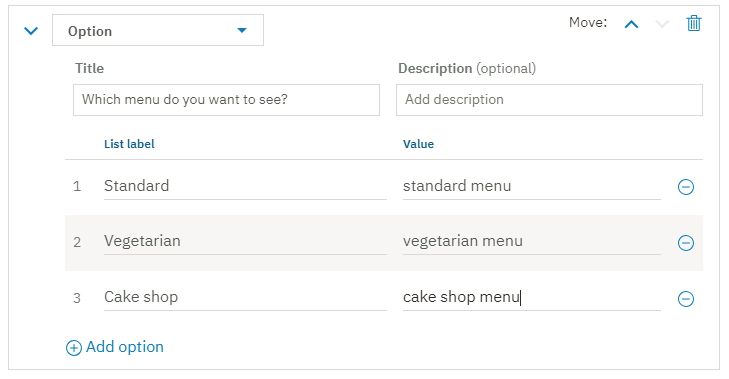
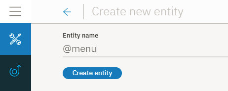
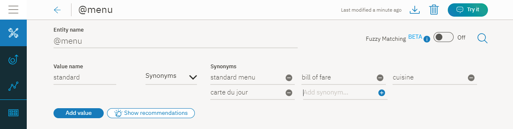
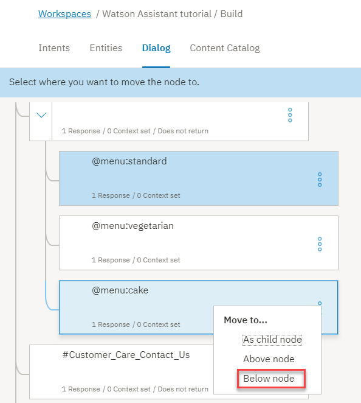
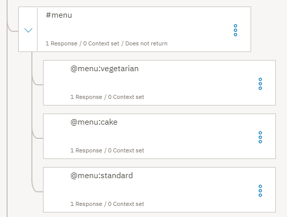
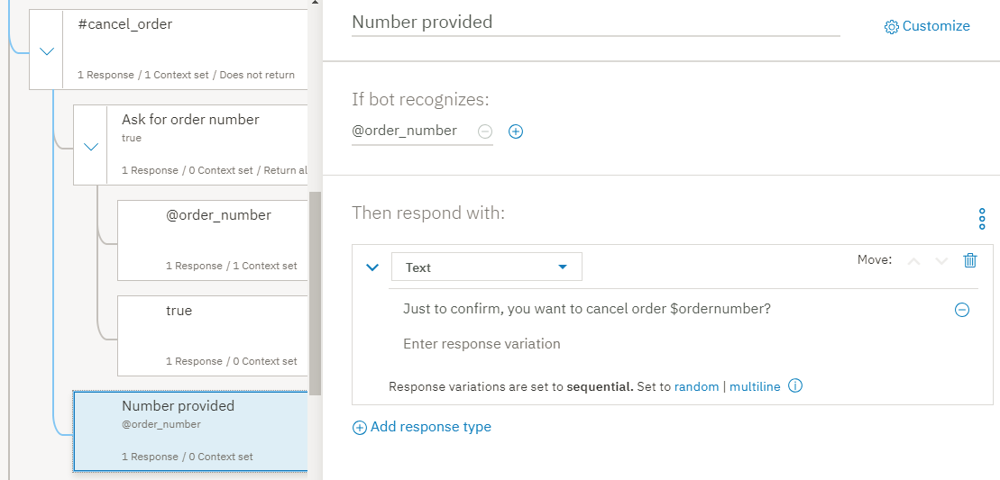

---

copyright:
  years: 2015, 2019
lastupdated: "2019-02-28"

subcollection: assistant

---

{:shortdesc: .shortdesc}
{:new_window: target="_blank"}
{:deprecated: .deprecated}
{:important: .important}
{:note: .note}
{:tip: .tip}
{:pre: .pre}
{:codeblock: .codeblock}
{:screen: .screen}
{:javascript: .ph data-hd-programlang='javascript'}
{:java: .ph data-hd-programlang='java'}
{:python: .ph data-hd-programlang='python'}
{:swift: .ph data-hd-programlang='swift'}
{:gif: data-image-type='gif'}

# Tutoriel : Création d'un dialogue complexe
{: #tutorial}

Dans ce tutoriel, vous allez utiliser le service {{site.data.keyword.conversationshort}} pour créer le dialogue d'un assistant qui aide les utilisateurs à poser des questions sur un restaurant fictif appelé *Truck Stop Gourmand*.
{: shortdesc}

## Objectifs du tutoriel
{: #tutorial-objectives}

A la fin du tutoriel, vous saurez comment effectuer les opérations suivantes :

- Planifier un dialogue
- Définir les intentions personnalisées 
- Ajouter des noeuds de dialogue qui peuvent gérer vos intentions 
- Ajouter des entités pour rendre vos réponses plus spécifiques 
- Ajouter une entité de canevas et l'utiliser dans le dialogue pour rechercher des canevas dans l'entrée utilisateur 
- Définir et référencer des variables contextuelles 

### Durée
{: #tutorial-duration}

Ce tutoriel dure environ 2 à 3 heures.

### Prérequis
{: #tutorial-prereqs}

Avant de commencer, exécutez le [tutoriel d'initiation](/docs/services/assistant?topic=assistant-getting-started).

Vous utiliserez la compétence de dialogue que vous avez créée et ajouterez des noeuds au dialogue simple que vous avez créé dans le cadre de l'exercice d'initiation. 

## Etape 1 : Planification du dialogue 
{: #tutorial-plan}

Vous développez un assistant pour un restaurant appelé *Truck Stop Gourmand*, qui n’a qu’un seul site et est une entreprise florissante de pâtisserie. Vous souhaitez que l'assistant simple réponde aux questions des utilisateurs sur le
restaurant, son menu et qu'il puisse annuler des commandes client. Par conséquent, vous devez créer des intentions qui gèrent les requêtes liées aux sujets suivants : 

- Informations sur le restaurant 
- Détails du menu 
- Annulations de commande 

Vous allez commencer par créer des intentions qui représentent ces sujets, puis créer un dialogue répondant aux questions des utilisateurs sur ces sujets. 

## Etape 2 : Réponse aux questions sur le restaurant 
{: #tutorial-add-about-intent}

Ajoutez une intention qui reconnaît lorsque les clients demandent des détails sur le restaurant lui-même. Une intention est l'objectif ou la finalité exprimé dans l'entrée utilisateur. L'intention `#General_About_You` fournie avec le catalogue de contenu *General* remplit une fonction similaire, mais ses exemples utilisateur sont conçus pour se concentrer sur les requêtes relatives à l'assistant, par opposition à l'entreprise qui utilise l'assistant pour aider ses clients. Donc, vous allez ajouter votre propre intention. 

### Ajoutez l'intention #info_restaurant
{: #tutorial-add-about-restaurant}

1.  Dans l'onglet **Intents**, cliquez sur **Add intent**.

    
1.  Entrez `info_restaurant` dans la zone *Intent name*, puis cliquez sur **Create intent**.

    
1.  Ajoutez les exemples utilisateur suivants :

    ```
    Parlez-moi du restaurant
    je voudrais mieux vous connaître
    qui sont les restaurateurs et quelle est leur philosophie ?
    Quelle est votre histoire ?
    Où vous procurez-vous vos produits ?
    Qui est votre chef cuisinier et quel est son parcours ?
    Combien de sites avez-vous ?
    Proposez-vous un service de traiteur ou des réceptions sur place ?
    Est-ce que vous livrez ?
    Etes-vous ouvert pour le petit-déjeuner ?
    ```
    {: screen}

1.  Cliquez sur l'icône de **fermeture** () pour terminer l'ajout de l'intention `#info_restaurant`.

Vous avez ajouté une intention et fourni des exemples d'énoncés que des utilisateurs réels pourraient saisir pour déclencher cette intention. 

### Ajoutez un noeud de dialogue déclenché par l'intention #info_restaurant 
{: #tutorial-trigger-about-intent}

Ajoutez un noeud de dialogue qui reconnaît le moment où l'entrée utilisateur est mappée sur l'intention créée à l'étape précédente, ce qui signifie que sa condition vérifie si le service a reconnu l'intention `#info_restaurant` de l'entrée utilisateur.

1.  Cliquez sur l'onglet **Dialogs**.
1.  Recherchez le noeud `#General_Greetings` dans l'arborescence du dialogue.

    Vous allez ajouter un noeud qui vérifie la présence de questions sur le restaurant sous ce noeud de message d'accueil initial afin de refléter le flux que vous pourriez rencontrer lors d'une conversation normale. Par exemple, `Bonjour.` puis, `Parlez-moi de vous.`

1.  Cliquez sur l'icône **Autres options**  sur le noeud `#General_Greetings`, puis sélectionnez **Add node below**.

    
1.  Commencez à entrer `#info_restaurant` dans la zone **Enter a condition** de ce noeud. Ensuite, sélectionnez l'option `#info_restaurant`.
1.  Ajoutez le texte suivant comme réponse : 

    ```
    Truck Stop Gourmand est une idée originale de Gloria et Fred Smith. L'aventure a commencé avec un food truck en 2004, qui est depuis devenu un restaurant en plein essor. Nous avons maintenant un restaurant avec pignon sur rue au centre-ville de Portland. Une cuisine plus grande a incité de nouveaux chefs à nous rejoindre, mais chacun reste fidèle à la philosophie qui a fait la popularité initiale du food truck Smith : offrir des produits frais et locaux travaillés avec créativité et gourmandise. Rejoignez-nous pour le déjeuner ou le dîner sept jours sur sept. Ou craquez pour l'une de nos déliceuses pâtisseries sur commande.
    ```
    {: codeblock}

1.  Ajoutons également une image à la réponse 

    Cliquez sur **Add response type**. Sélectionnez **Image** dans la liste déroulante. Dans la zone **Image source**, ajoutez `https://www.ibmlearningcenter.com/wp-content/uploads/2018/02/IBM-Learning-Center-Food4.jpg`.
1.  Déplacez le type de réponse de l'image vers le haut afin qu'il soit affiché dans la réponse avant que le texte ne soit affiché. Cliquez sur la flèche de **déplacement vers le haut** pour réorganiser les deux types de réponse.

    

1.  Cliquez sur l'icône de  pour fermer la vue d'édition.

### Testez le noeud de dialogue #info_restaurant 
{: #tutorial-test-about-intent}

Testez l'intention en vérifiant si les énoncés utilisateur similaires aux exemples que vous avez ajoutés aux données d'apprentissage, mais pas exactement, ont formé le service à reconnaître l'entrée avec l'intention `#info_restaurant`.

1.  Cliquez sur l'icône  pour ouvrir le panneau "Try it out". 

1.  Entrez `Je veux en savoir plus sur votre restaurant.`

    Le service indique que l'intention `#info_restaurant` est reconnue et renvoie une réponse avec l'image et le texte que vous avez spécifiés pour le noeud de dialogue. 

    

Félicitations ! Vous avez ajouté une intention personnalisée et un noeud de dialogue qui sait comment la gérer. 

L'intention `#info_restaurant` est conçue pour reconnaître une variété de questions générales sur le restaurant. Vous avez ajouté un seul noeud pour capturer ce type de questions. La réponse est longue, mais il s’agit d’une seule déclaration qui peut potentiellement répondre à des questions sur tous les sujets suivants : 

- Les restaurateurs
- L'histoire du restaurant
- La philosophie 
- Le nombre de sites 
- Les jours d'ouverture
- Les plats servis 
- Le fait que le restaurant prépare des gâteaux à la commande 

Pour les questions faciles d'ordre général, une seule réponse générale convient. 

## Etape 3 : Réponse aux questions sur le menu 
{: #tutorial-menu}

Une question clé posée par les clients potentiels du restaurant concerne le menu. Le restaurant Truck Stop Gourmand change son menu tous les jours. En plus de son menu standard, il propose des menus végétariens et des pâtisseries. Lorsqu'un utilisateur pose une question sur le menu, le dialogue doit rechercher le menu à partager, puis fournir un lien hypertexte vers le menu mis à jour quotidiennement sur le site Web du restaurant. Vous ne coderez pas des informations dans un noeud de dialogue si ces informations changent régulièrement. 

### Ajoutez l'intention #menu
{: #tutorial-add-menu-intent}

1.  Cliquez sur l'onglet **Intents**.
1.  Cliquez sur **Add intent**.

    


1.  Entrez `menu` dans la zone *Intent name*, puis cliquez sur **Create intent**.

    

1.  Ajoutez les exemples utilisateur suivants :

    ```
    Je souhaite consulter un menu
    Quels plats proposez-vous ?
    Y a-t-il un plat du jour aujourd'hui ?
    où puis-je me renseigner sur vos spécialités ?
    Quels plats proposez-vous ?
    Quels sont les choix d'apéritifs ?
    servez-vous des desserts ?
    Quelle est la gamme de prix de vos plats ?
    Combien coûte un plat standard ?
    que proposez-vous en entrée ?
    Avez-vous un menu à prix fixe ?
    ```
    {: screen}

1.  Cliquez sur l'icône de **fermeture** () pour terminer l'ajout de l'intention `#menu`.

### Ajoutez un noeud de dialogue déclenché par l'intention #menu 
{: #tutorial-trigger-menu-intent}

Ajoutez un noeud de dialogue qui reconnaît le moment où l'entrée utilisateur est mappée sur l'intention créée à l'étape précédente, ce qui signifie que sa condition vérifie si le service a reconnu l'intention `#menu` de l'entrée utilisateur.

1.  Cliquez sur l'onglet **Dialogs**.
1.  Recherchez le noeud `#info_restaurant` dans l'arborescence du dialogue.

    Vous allez ajouter un noeud qui vérifie la présence de questions sur le menu situé sous ce noeud. 

1.  Cliquez sur l'icône **Autres options**  sur le noeud `#info_restaurant`, puis sélectionnez **Add node below**.

    

1.  Commencez à entrer `#menu` dans la zone **Enter a condition** de ce noeud. Ensuite, sélectionnez l'option `#menu`.

    

1.  Ajoutez le texte suivant comme réponse : 

    `Fidèle à notre engagement de ne vous proposer que des produits locaux frais, notre menu change tous les jours pour intégrer les produits que nous achetons le matin même. Vous pouvez consulter le menu du jour sur notre site web.`

1.  Ajoutez un type de réponse *option* qui fournit une liste d'options parmi lesquelles l'utilisateur peut choisir. Dans ce cas, la liste des options inclut les différentes versions de menu disponibles. 

    Cliquez sur **Add response type**. Sélectionnez **Option** dans la liste déroulante. 

    

1.  Dans la zone **Title**, ajoutez *Quel menu souhaitez-vous consulter ?*

    

1.  Cliquez sur **Add option**.

1.  Dans la zone **Label**, ajoutez `Standard`. Le texte que vous ajoutez en tant qu'intitulé est affiché dans la réponse à l'utilisateur comme une option pouvant être sélectionnée. 

1.  Dans la zone **Value**, ajoutez `menu standard`. Le texte que vous spécifiez comme valeur correspond à ce qui est envoyé au service en tant que nouvelle entrée utilisateur lorsqu'un utilisateur choisit cette option dans la liste et clique dessus. 

1.  Répétez les deux étapes précédentes pour ajouter des informations d'intitulé et de valeur pour les types de menu restants : 

    <table>
    <caption>Détails du type de réponse d'option</caption>
    <tr>
      <th>Libellé</th>
      <th>Valeur</th>
    </tr>
    <tr>
      <td>Végétarien</td>
      <td>menu végétarien</td>
    </tr>
    <tr>
      <td>Pâtisserie </td>
      <td>menu pâtisserie</td>
    </tr>
    </table>

    

1.  Cliquez sur l'icône de  pour fermer la vue d'édition.

### Ajoutez une entité @menu
{: #tutorial-add-menu-entity}

Pour reconnaître les différents types de menus que les clients indiquent qu'ils veulent voir, vous allez ajouter une entité `@menu`. Les entités représentent une classe d'objet ou un type de données pertinent pour l'objectif d'un utilisateur. En vérifiant la présence d'entités spécifiques dans l'entrée utilisateur, vous pouvez ajouter d'autres réponses, chacune adaptée pour répondre à une demande d'utilisateur distincte. Dans ce cas, vous allez ajouter une entité `@menu` qui permet de distinguer différents types de menu. 

1.  Cliquez sur l'onglet **Entities**.

    

1.  Cliquez sur **Add entity**.

1.  Entrez `menu` dans la zone de nom d'entité.

    

1.  Cliquez sur **Create entity**.

1.  Ajoutez `standard` à la zone *Value name*, puis ajoutez `menu standard` à la zone **Synonyms** et appuyez sur Entrée.

1.  Ajoutez les synonymes supplémentaires suivants :

    - liste des prix 
    - cuisine
    - menu du jour

    

1.  Cliquez sur **Add value** pour ajouter la valeur `@menu:standard`.

1.  Ajoutez `végétarien` à la zone *Value name*, puis ajoutez `menu végétarien` à la zone **Synonyms** et appuyez sur Entrée.

1.  Cliquez sur **Show recommendations**, puis cochez les cases *régime sans viande*, *sans viande* et *régime végétalien*.

1.  Cliquez sur **Add selected**.

1.  Cliquez sur la zone vide *Add synonym*, puis ajoutez ces synonymes supplémentaires :

    - végétalien 
    - végétal uniquement 

    

1.  Cliquez sur **Add value** pour ajouter la valeur `@menu:végétarien`.

1.  Ajoutez `gâteau` à la zone *Value name*, puis ajoutez `menu pâtisserie` à la zone **Synonyms** et appuyez sur Entrée.

1.  Ajoutez les synonymes supplémentaires suivants :

    - menu pâtisserie
    - menu dessert
    - offres gâteaux

    

1.  Cliquez sur **Add value** pour ajouter la valeur `@menu:pâtisserie`.

1.  Cliquez sur l'icône de **Fermeture** () pour terminer l'ajout de l'entité `@menu`.

### Ajoutez des noeuds enfants déclenchés par les types d'entité @menu 
{: #tutorial-trigger-menu-entity}

Dans cette étape, vous allez ajouter des noeuds enfants au noeud du dialogue qui vérifie l'intention `#menu`. Chaque noeud enfant affichera une réponse différente selon le type d'entité `@menu` choisi par l'utilisateur dans la liste d'options. 

1.  Cliquez sur l'onglet **Dialogs**.
1.  Recherchez le noeud `#menu` dans l'arborescence du dialogue.

    Vous allez ajouter un noeud enfant pour gérer chaque option de type de menu que vous avez ajoutée au noeud `#menu`.

1.  Cliquez sur l'icône **Autres options**  sur le noeud `#menu`, puis sélectionnez **Add child node**.

    

1.  Commencez à entrer `@menu:standard` dans la zone **Enter a condition** de ce noeud. Ensuite, sélectionnez l'option `@menu:standard`.

1.  Ajoutez le message suivant dans la zone de réponse textuelle : `Pour consulter notre menu, rendez-vous à la page <a href="https://www.example.com/menu.html" target="blank">menu</a> sur notre site Web.`

    

1.  Cliquez sur l'icône de  pour fermer la vue d'édition.

1.  Cliquez sur l'icône **Autres options**  sur le noeud `@menu:standard`, puis sélectionnez **Add node below**.

1.  Commencez à entrer `@menu:végétarien` dans la zone **Enter a condition** de ce noeud. Ensuite, sélectionnez l'option `@menu:végétarien`.

1.  Ajoutez le message suivant dans la zone de réponse textuelle : `Pour consulter notre menu végétarien, rendez-vous à la page <a href="https://www.example.com/vegetarian-menu.html" target="blank">menu végétarien</a> sur notre site Web.`

    

1.  Cliquez sur l'icône de  pour fermer la vue d'édition.

1.  Cliquez sur l'icône **Autres options**  sur le noeud `@menu:végétarien`, puis sélectionnez **Add node below**.

1.  Commencez à entrer `@menu:pâtisserie` dans la zone **Enter a condition** de ce noeud. Ensuite, sélectionnez l'option `@menu:pâtisserie`.

1.  Ajoutez le message suivant dans la zone de réponse textuelle : `Pour consulter notre menu pâtisserie, rendez-vous à la page <a href="https://www.example.com/menu.html" target="blank">menu pâtisserie</a> sur notre site Web.`

    

1.  Cliquez sur l'icône de  pour fermer la vue d'édition.

1.  Le menu standard étant susceptible d'être demandé le plus souvent, déplacez-le au bas de la liste des noeuds enfants. En le plaçant à la fin, vous éviterez son déclenchement accidentel lorsque quelqu'un demandera un menu particulier au lieu du menu standard.

1.  Cliquez sur l'icône **Autres options**  sur le noeud `@menu:standard`, puis sélectionnez **Move**.

    

1.  Sélectionnez le noeud `@menu:pâtisserie`, puis choisissez **Below node**.

    

Vous avez ajouté des noeuds qui reconnaissent les demandes des utilisateurs sur les détails du menu. Votre réponse informe l'utilisateur que trois types de menus sont disponibles et lui demande d'en choisir un. Lorsque l'utilisateur choisit un type de menu, une réponse s'affiche qui fournit un lien hypertexte vers une page Web contenant les détails du menu demandé. 

### Testez les noeuds du dialogue des options de menu 
{: #tutorial-test-menu-options-intent}

Testez les noeuds de dialogue que vous avez ajoutés pour reconnaître les questions de menu. 

1.  Cliquez sur l'icône  pour ouvrir le panneau "Try it out". 

1.  Entrez `Quel type de plats servez-vous ?`

    Le service indique que l'intention `#menu` est reconnue et affiche la liste des options de menu parmi lesquelles l'utilisateur peut choisir. 

    
1.  Cliquez sur l'option `Pâtisserie`.

    Le service reconnaît l’intention `#menu` et la référence de l’entité `@menu:pâtisserie` et affiche la réponse `Pour consulter la carte de nos pâtisseries, rendez-vous à la page pâtisserie de notre site Web.`

    
1.  Cliquez sur le lien hypertexte *pâtisserie* dans la réponse.

    Une nouvelle page de navigateur Web s'ouvre et affiche le site Web example.com. 

1.  Fermez la page du navigateur Web. 

Bien joué. Vous avez ajouté une intention et une entité capable de reconnaître les demandes des utilisateurs sur les détails du menu et de diriger les utilisateurs vers le menu approprié. 

L'intention `#menu` représente un besoin clé commun aux clients potentiels du restaurant. En raison de son importance et de sa popularité, vous avez ajouté au dialogue une section plus complexe pour la traiter correctement. 

## Etape 4 : Gestion des commandes de gâteaux 
{: #tutorial-manage-orders}

Les clients passent leurs commandes en personne, par téléphone ou en utilisant le formulaire de commande disponible sur le site Web. Une fois la commande passée, les utilisateurs peuvent annuler la commande via l'assistant virtuel. Tout d’abord, définissez une entité capable de reconnaître les numéros de commande. Ajoutez ensuite une intention qui reconnaît quand les utilisateurs veulent annuler une commande de gâteau. 

### Ajoutez une entité de canevas de numéro de commande
{: tutorial-add-pattern-entity}

Vous souhaitez que l'assistant reconnaisse les numéros de commande. Vous allez donc créer une entité de canevas pour reconnaître le format unique utilisé par le restaurant pour identifier ses commandes. La syntaxe des numéros de commande utilisés par la pâtisserie du restaurant est 2 lettres majuscules suivies de 5 chiffres. Par exemple, `YR34663`. Ajoutez une entité capable de reconnaître ce canevas de caractères. 

1.  Cliquez sur l'onglet **Entities**.
1.  Cliquez sur **Add entity**.
1.  Entrez `numéro_commande` dans la zone de nom d'entité.
1.  Cliquez sur **Create entity**.

    
1.  Ajoutez `syntaxe_commande` à la zone *Value name*, puis cliquez sur la flèche vers le bas en regard de la zone **Synonyms** pour définir le type sur **Patterns**.

    
1.  Ajoutez l'expression régulière suivante à la zone Pattern : `[A-Z]{2}\d{5}`

    

1.  Cliquez sur **Add value**.

    

1.  Cliquez sur l'icône de **Fermeture** () pour terminer l'ajout de l'entité `@numéro_commande`.

    

### Ajoutez une intention d'annulation de commande 
{: #tutorial-cancel-order-intent}

1.  Cliquez sur l'onglet **Intents**.
1.  Cliquez sur **Add intent**.
1.  Entrez `annuler_commande` dans la zone *Intent name*, puis cliquez sur **Create intent**.
1.  Ajoutez les exemples utilisateur suivants :

    ```
    Je veux annuler ma commande de gâteau
    Je dois annuler une commande que je viens de passer
    Puis-je annuler ma commande de gâteau ?
    Je voudrais annuler ma commande
    Il y a eu un changement. Je dois annuler ma commande de boulangerie.
    veuillez annuler la commande de gâteau d'anniversaire que j'ai passée la semaine dernière
    Le thème de la fête a changé ; on n'a plus besoin d'un gâteau
    cette commande que j'ai passée, je dois l'annuler.
    ```
    {: screen}

    
1.  Cliquez sur l'icône de **fermeture** () pour terminer l'ajout de l'intention `#annuler_commande`.

### Ajoutez une intention oui
{: #tutorial-yes-intent}

Avant de pouvoir effectuer une action au nom de l'utilisateur, vous devez obtenir la confirmation que vous prenez les mesures appropriées. Ajoutez une intention #oui au dialogue permettant de reconnaître le moment où un utilisateur accepte ce que le service propose. 

1.  Cliquez sur l'onglet **Intents**.
1.  Cliquez sur **Add intent**.
1.  Entrez `oui` dans la zone *Intent name*, puis cliquez sur **Create intent**.
1.  Ajoutez les exemples utilisateur suivants :

    ```
    Oui
    Correct
    Oui, s'il vous plaît.
    C'est bien ça.
    Oui, allez-y.
    c'est correct.
    Ok
    oui
    D'accord
    Oui, c'est bien ce que je demande.
    ```
    {: screen}

    
1.  Cliquez sur l'icône de **fermeture** () pour terminer l'ajout de l'intention `#oui`.

### Ajoutez des noeuds de dialogue pouvant gérer les demandes d'annulation d'une commande 
{: #tutorial-cancel-order-dialog}

Ajoutez maintenant un noeud de dialogue qui peut gérer les demandes d'annulation d'une commande de gâteau. 

1.  Cliquez sur l'onglet **Dialog**.
1.  Recherchez le noeud `#menu`. Cliquez sur l'icône **Autres options**  sur le noeud `#menu`, puis sélectionnez **Add node below**.
1.  Commencez à entrer `#annuler_commande` dans la zone **Enter a condition** de ce noeud. Ensuite, sélectionnez l'option `#annuler_commande`.
1.  Ajoutez le message suivant à la zone de réponse textuelle : 

    ```
    Si l'heure de préparation est supérieure à 48 heures à compter de maintenant, vous pouvez annuler votre commande.
    ```
    {: codeblock}

    

    Pour pouvoir réellement annuler la commande, vous devez connaître le numéro de commande. L'utilisateur peut spécifier le numéro de commande dans la demande initiale. Par conséquent, pour éviter de demander à nouveau le numéro de commande, recherchez-le à l'aide du canevas de numéro de commande dans l'entrée initiale. Pour ce faire, définissez une variable contextuelle qui enregistre le numéro de commande s'il est spécifié. 

1.  Ouvrez l'éditeur de contexte. Cliquez sur l'icône **Autres options** , puis sélectionnez **Open context editor**.

    
1.  Entrez la paire nom-valeur suivante de la variable contextuelle : 

    <table>
    <caption>Détails de la variable contextuelle du numéro de commande </caption>

    <tr>
      <th>Variable</th>
      <th>Valeur</th>
    </tr>
    <tr>
      <td>$ordernumber</td>
      <td><? @order_number.literal ?></td>
    </tr>
    </table>

    La valeur de la variable contextuelle (`<? @order_number.literal ?>`) est une expression SpEL qui capture le nombre spécifié par l'utilisateur qui correspond au canevas défini par l'entité de canevas @numéro_commande. Elle le sauvegarde ensuite dans la variable `$ordernumber`.

    
1.  Cliquez sur l'icône de  pour fermer la vue d'édition.

Ajoutez maintenant des noeuds enfants qui demandent le numéro de commande ou obtiennent la confirmation auprès de l’utilisateur selon laquelle il souhaite annuler une commande en indiquant le numéro de commande détecté.
1.  Cliquez sur l'icône **Autres options**  sur le noeud `#annuler_commande`, puis sélectionnez **Add child node**.

    
1.  Ajoutez un intitulé au noeud pour le distinguer des autres noeuds enfants que vous allez ajouter. Dans la zone de nom, ajoutez `Demander le numéro de commande`. Tapez `true` dans la zone **Enter a condition** de ce noeud. 

1.  Ajoutez le message suivant à la zone de réponse textuelle : 

    ```
    Quel est le numéro de commande ?
    ```
    {: codeblock}

    
1.  Cliquez sur l'icône de  pour fermer la vue d'édition.

   Ajoutez maintenant un autre noeud enfant qui informe l'utilisateur que vous annulez la commande.
1.  Cliquez sur l'icône **Autres options**  sur le noeud `Demander le numéro de commande`, puis sélectionnez **Add child node**.
1.  Entrez `@numéro_commande` dans la zone **Enter a condition** de ce noeud. 
1.  Ouvrez l'éditeur de contexte. Cliquez sur l'icône **Autres options** , puis sélectionnez **Open context editor**.
1.  Entrez la paire nom-valeur suivante de la variable contextuelle : 

    <table>
    <caption>Détails de la variable contextuelle du numéro de commande </caption>

    <tr>
      <th>Variable</th>
      <th>Valeur</th>
    </tr>
    <tr>
      <td>$ordernumber</td>
      <td><? @order_number.literal ?></td>
    </tr>
    </table>

La valeur de la variable contextuelle (`<? @order_number.literal ?>`) est une expression SpEL consigne le nombre que l'utilisateur spécifie que correspond au modèle défini par le modèle entité @numéro_commande. Elle le sauvegarde ensuite dans la variable `$ordernumber`.
1.  Ajoutez le message suivant à la zone de réponse textuelle : 

    ```
    Entendu. La commande $ordernumber est annulée. Nous espérons avoir bientôt l'occasion de préparer un délicieux gâteau pour vous.
    ```
    {: codeblock}

    
1.  Cliquez sur l'icône de  pour fermer la vue d'édition.
1.  Ajoutez un autre noeud pour capturer le cas où un utilisateur fournit un numéro de commande non valide. Cliquez sur l'icône **Autres options**  sur le noeud `@numéro_commande`, puis sélectionnez **Add node below**.
1.  Tapez `true` dans la zone **Enter a condition** de ce noeud. 
1.  Ajoutez le message suivant à la zone de réponse textuelle : 

    ```
... Vous devez indiquer le numéro de commande pour nous permettre d'annuler votre commande. Si vous ne connaissez pas le numéro de votre commande, veuillez nous appeler au 02 83 90 93 70 pour annuler par téléphone.
    ```
    {: codeblock}

    
1.  Cliquez sur l'icône de  pour fermer la vue d'édition.

1.  Ajoutez un noeud sous le noeud de demande initiale d'annulation de commande qui répond dans le cas où l'utilisateur fournit le numéro de commande dans la demande initiale, afin que vous n'ayez pas à le demander à nouveau. Cliquez sur l'icône **Autres options**  sur le noeud `#annuler_commande`, puis sélectionnez **Add child node**.
1.  Ajoutez un intitulé au noeud pour le distinguer des autres noeuds enfants. Dans la zone de nom, ajoutez `Nombre fourni`. Entrez `@numéro_commande` dans la zone **Enter a condition** de ce noeud. 
1.  Ajoutez le message suivant à la zone de réponse textuelle : 

    ```
    A titre de confirmation, vous souhaitez annuler la commande $ordernumber ?
    ```
    {: codeblock}

    
1.  Cliquez sur l'icône de  pour fermer la vue d'édition.

    Vous devez ajouter des noeuds enfants qui vérifient la réponse de l'utilisateur à votre demande de confirmation.
1.  Cliquez sur l'icône **Autres options**  sur le noeud `Numéro fourni`, puis sélectionnez **Add child node**.
1.  Entrez `#oui` dans la zone **Enter a condition** de ce noeud. 

1.  Ajoutez le message suivant à la zone de réponse textuelle : 

    ```
    Entendu. La commande $ordernumber est annulée. Nous espérons avoir bientôt l'occasion de préparer un délicieux gâteau pour vous.
    ```
    {: codeblock}

    
1.  Cliquez sur l'icône de  pour fermer la vue d'édition.

1.  Cliquez sur l'icône **Autres options**  sur le noeud `#oui`, puis sélectionnez **Add node below**.

1.  Tapez `true` dans la zone **Enter a condition** de ce noeud. 

    N'ajoutez pas de réponse. Au lieu de cela, vous redirigez les utilisateurs vers la branche qui demande les détails du numéro de commande que vous avez créés précédemment. 

1.  Dans la zone *And finally*, choisissez **Jump-to**.

    
1.  Sélectionnez la condition du noeud *Demander le numéro de commande*.

    
1.  Cliquez sur l'icône de  pour fermer la vue d'édition.
1.  Déplacez le noeud *Numéro fourni* au-dessus du noeud *Demander le numéro de commande*. Cliquez sur l'icône **Autres options**  sur le noeud `Numéro fourni`, puis sélectionnez **Move**. Sélectionnez le noeud *Demander le numéro de commande*, puis cliquez sur **Above node**.

    
1.  Forcez la conversation à évaluer les noeuds enfants sous le noeud `#annuler_commande` au moment de l'exécution. Cliquez pour ouvrir le noeud `#annuler_commande` dans la vue édition, puis, dans la section `And finally`, sélectionnez `Skip user input`.

    

### Testez les annulations de commande 
{: #tutorial-test-cancel-order}

Vérifiez si le service peut reconnaître des canevas de caractères qui correspondent au canevas utilisé pour les numéros de commande de produit dans les entrées utilisateur. 

1.  Cliquez sur l'icône  pour ouvrir le panneau "Try it out". 

1.  Entrez `Je souhaite annuler ma commande numéro TW12345.`

    Le service reconnaît à la fois l'intention `#annuler_commande` et l'entité `@numéro_commande`. Il répond par `Si l'heure de préparation est supérieure à 48 heures à compter de maintenant, vous pouvez annuler votre commande. A titre de confirmation, vous souhaitez annuler la commande TW12345?` 

1.  Entrez `Oui`.

    Le service reconnaît l’intention `#oui` et répond par `Entendu. La commande TW12345 est annulée. Nous espérons avoir bientôt l'occasion de préparer un délicieux gâteau pour vous.` 

    

Maintenant, essayez le cas où vous ne connaissez pas le numéro de commande.
1.  Cliquez sur **Clear** dans le panneau "Try it out" pour recommencer. Entrez `Je souhaite annuler ma commande.`

    Le service reconnaît l’intention `#annuler_commande` et y répond par `Si l'heure de préparation est supérieure à 48 heures à compter de maintenant, vous pouvez annuler votre commande. Quel est le numéro de commande ?`

1.  Entrez `Je ne sais pas.`

    Le service répond `Vous devez indiquer le numéro de commande pour nous permettre d'annuler votre commande. Si vous ne connaissez pas le numéro de votre commande, veuillez nous appeler au 02 83 90 93 70 pour annuler par téléphone`. 

    

Si vous effectuez davantage de tests, vous constaterez peut-être que le dialogue n'est pas très utile dans les cas où l'utilisateur ne se souvient pas du format du numéro de commande. L'utilisateur peut également inclure uniquement les chiffres ou les lettres, mais oublier qu'ils sont censés être en majuscules. Donc, ce serait une bonne idée de lui donner un indice dans ce cas, n'est-ce pas ? Si vous voulez être sympa, ajoutez un autre noeud à l’arborescence du dialogue qui recherche les numéros dans l’entrée utilisateur. 

1.  Recherchez le noeud `@numéro_commande` qui est un enfant du noeud *Demander le numéro de commande*.

1.  Cliquez sur l'icône **Autres options**  sur le noeud `@numéro_commande`, puis sélectionnez **Add node below**.

1.  Dans la zone de condition, ajoutez `input.text.find('\d')`, expression SpEL qui indique que si vous trouvez un ou plusieurs nombres dans l'entrée utilisateur, cette réponse doit être déclenchée.

1.  Dans la zone de réponse textuelle, ajoutez la réponse suivante : 

    ```
    Le format correct de vos numéros de commande est AAnnnnn. Les A représentent 2 lettres majuscules et les n représentent 5 chiffres. Avez-vous un numéro de commande dans ce format ?
    ```
    {: codeblock}

1.  Cliquez sur l'icône de  pour fermer la vue d'édition.

1.  Cliquez sur l'icône **Autres options**  sur le noeud `input.text.find('\d')`, puis sélectionnez **Add child node**.

1.  Tapez `true` dans la zone **Enter a condition** de ce noeud. 

1.  Activez les réponses conditionnelles en cliquant sur **Customize**, puis en activant l'option à bascule *Multiple responses* (**on**).

1.  Cliquez sur **Apply**.

1.  Dans la nouvelle zone *If bot recognizes*, entrez `@numéro_commande`, et dans la zone *Respond with*, entrez :

    ```
    Entendu. La commande $ordernumber est annulée. Nous espérons avoir bientôt l'occasion de préparer un délicieux gâteau pour vous.
    ```
    {: codeblock}

1.  Cliquez sur **Add response**. 

1.  Dans la zone *If bot recognizes*, entrez `true`, et dans la zone *Respond with*, entrez :

    ```
... Vous devez indiquer le numéro de commande pour nous permettre d'annuler votre commande. Si vous ne connaissez pas le numéro de votre commande, veuillez nous appeler au 02 83 90 93 70 pour annuler par téléphone.
    ```
    {: codeblock}

    
1.  Cliquez sur l'icône de  pour fermer la vue d'édition.

Désormais, lorsque vous testez, vous pouvez fournir un nombre ou une combinaison de chiffres et de texte en entrée. Le dialogue vous rappelle le format de numéro de commande correct. Vous avez testé votre dialogues, vous avez trouvé une faiblesse et vous l'avez corrigée. 

Une autre façon de traiter ce type de scénario consiste à ajouter un noeud avec des attributs. Consultez le tutoriel [Ajout d'un noeud avec attributs à un dialogue](/docs/services/assistant?topic=assistant-tutorial-slots) pour en savoir plus sur l'utilisation des attributs. {:tip}

## Etape 5 : Ajout de votre touche personnelle
{: #tutorial-get-username}

Si l'utilisateur s'intéresse au bot même, l'assistant virtuel peut reconnaître sa curiosité et interagir avec lui de manière plus personnelle. Vous vous souvenez peut-être de l’intention `#General_About_You`, fournie avec le catalogue de contenu *General*, que nous avons envisagée d’utiliser auparavant, avant d’ajouter votre propre intention `#info_restaurant` personnalisée. Elle est conçue pour reconnaître ce type de questions de la part de l'utilisateur. Ajoutez un noeud qui conditionne cette intention. Dans votre réponse, vous pouvez demander le nom de l'utilisateur et l'enregistrer dans une variable $username que vous pouvez utiliser ailleurs dans le dialogue, le cas échéant. 

Tout d'abord, vous devez vous assurer que le service reconnaîtra un nom si l'utilisateur en fournit un. Vous pouvez donc activer l'entité `@sys-person`, conçue pour reconnaître les noms et prénoms courants (en anglais). 

### Ajoutez une entité système de personne 
{: #tutorial-add-person-entity}

Le service fournit un certain nombre d'*entités de système* ; il s'agit d'entités communes que vous pouvez utiliser pour n'importe quelle application. 

1.  Cliquez sur l'onglet **Entities**, puis cliquez sur **System entities**.

1.  Recherchez la bascule d'entité *`@sys-person`*, puis placez-la sur **On**.

    

### Ajoutez un noeud qui gère les questions sur le bot 
{: #tutorial-add-about-you-node}

Ajoutez maintenant un noeud de dialogue capable de reconnaître l’intérêt de l’utilisateur pour le bot et de répondre. 

1.  Cliquez sur l'onglet **Dialogs**.
1.  Recherchez le noeud `Welcome` dans l'arborescence du dialogue.
1.  Cliquez sur l'icône **Autres options**  sur le noeud `Welcome`, puis sélectionnez **Add node below**.
1.  Commencez à entrer `#General_About_You` dans la zone **Enter a condition** de ce noeud. Ensuite, sélectionnez l'option `#General_About_You`.
1.  Ajoutez le message suivant à la zone de réponse textuelle : 

    ```
Je suis un assistant virtuel conçu pour répondre à vos questions sur le restaurant Truck Stop Gourmand. Comment vous appelez-vous ?
    ```
    {: codeblock}

    
1.  Cliquez sur l'icône de  pour fermer la vue d'édition.
1.  Cliquez sur l'icône **Autres options**  sur le noeud `#General_About_You`, puis sélectionnez **Add child node**.
1.  Commencez à entrer `@sys-person` dans la zone **Enter a condition** de ce noeud. Ensuite, sélectionnez l'option `@sys-person`.
1.  Ajoutez le message suivant à la zone de réponse textuelle : 

    ```
    Bonjour, <? @sys-person.literal ?> ! C'est un plaisir de vous rencontrer. En quoi puis-je vous aider ?
    ```
    {: codeblock}

1.  Pour capturer le nom fourni par l'utilisateur, ajoutez une variable contextuelle au noeud. Cliquez sur l'icône **Autres options** , puis sélectionnez **Open context editor**.
1.  Entrez la paire nom-valeur suivante de la variable contextuelle : 

    <table>
    <caption>Détails de la variable contextuelle du nom d'utilisateur</caption>

    <tr>
      <th>Variable</th>
      <th>Valeur</th>
    </tr>
    <tr>
      <td>$username</td>
      <td><? @sys-person.literal ?></td>
    </tr>
    </table>

    La valeur de la variable contextuelle (`<? @sys-person.literal ?>`) est une expression SpEL qui capture le nom d'utilisateur tel qu'il est spécifié par l'utilisateur, puis l'enregistre dans la variable contextuelle `$username`.

    
1.  Cliquez sur l'icône de  pour fermer la vue d'édition.
1.  Cliquez sur l'icône **Autres options**  sur le noeud `@sys-person`, puis sélectionnez **Add node below**.

Vous allez ajouter un noeud pour capturer les réponses des utilisateurs sans nom. Si l'utilisateur choisit de ne pas le communiquer, vous souhaitez que le bot poursuive la conversation de toute façon.
1.  Tapez `true` dans la zone **Enter a condition** de ce noeud. 
1.  Ajoutez le message suivant à la zone de réponse textuelle : 

    ```
    En quoi puis-je vous aider ?
    ```
    {: codeblock}

    
1.  Cliquez sur l'icône de  pour fermer la vue d'édition.

Si, au moment de l'exécution, l'utilisateur déclenche ce noeud et fournit un nom, vous connaîtrez le nom de l'utilisateur. Si vous le connaissez, vous devriez l'utiliser ! Ajoutez des réponses conditionnelles au noeud de dialogue d'accueil que vous avez précédemment ajouté pour inclure une réponse conditionnelle utilisant le nom d'utilisateur, s'il est connu. 

### Ajoutez le nom d'utilisateur au message d'accueil 
{: #tutorial-add-username-to-greeting}

Si vous connaissez le nom de l'utilisateur, vous devez l'inclure dans votre message d'accueil. Pour ce faire, ajoutez des réponses conditionnelles et incluez une variante du message d'accueil incluant le nom de l'utilisateur. 

1.  Recherchez le noeud `#General_Greetings` dans l'arborescence du dialogue et cliquez pour l'ouvrir dans la vue édition.
1.  Cliquez sur **Customize**, puis placez la bascule *Multiple responses* sur **on**.

    
1.  Cliquez sur **Apply**.

    
1.  Cliquez sur **Add response**. 
1.  Dans la zone *If bot recognizes*, entrez `$username`, et dans la zone *Respond with*, entrez :

    ```
    Bonjour $username !
    ```
    {: codeblock}

1.  Cliquez sur la flèche vers le haut pour la réponse numéro 2 pour la déplacer afin qu'elle soit répertoriée avant la réponse numéro 1 (`Bonjour !`).

    
1.  Cliquez sur l'icône de  pour fermer la vue d'édition.

### Testez la personnalisation
{: #tutorial-test-personalize}

Vérifiez si le service peut reconnaître et enregistrer le nom d'un utilisateur, puis faites référence à l'utilisateur ultérieurement. 

1.  Cliquez sur l'icône  pour ouvrir le panneau "Try it out". 

1.  Cliquez sur **Clear** pour relancer la conversation.

1.  Entrez `Qui êtes-vous ?`

    Le service reconnaît l’intention `#General_About_You`. Sa réponse se termine par la question `Comment vous appelez-vous ?`
1.  Entrez `Je m'appelle Anne Onyme.`

    Le service reconnaît `Anne Onyme` en tant que mention d'entité `@sys-person`. Il commente votre nom et vous demande ensuite comment il peut vous aider.
1.  Entrez `Bonjour.`

    Le service reconnaît l’intention `#General_Greetings` et dit `Bonjour Anne Onyme !` Il utilise la réponse conditionnelle incluant le nom de l'utilisateur car la variable contextuelle `$username` contient une valeur au moment où le noeud de message d'accueil est déclenché. 

    

Vous pouvez ajouter une réponse conditionnelle qui conditionne et inclut le nom de l'utilisateur pour toute autre réponse pour laquelle la personnalisation ajouterait de la valeur à la conversation. 

## Etape 6 : Test de l’assistant depuis votre intégration de page Web 
{: #tutorial-integrate-assistant}

Maintenant que vous avez créé une version plus sophistiquée de l'assistant, revenez à la page Web publique que vous avez déployée dans le cadre du tutoriel précédent, puis testez les nouvelles fonctionnalités que vous avez ajoutées. 

1.  Ouvrez l'assistant. 
1.  Dans la zone *Integrations*, cliquez sur **Preview Link**.
1.  Cliquez sur l'URL affichée sur la page. 

    La page s'ouvre dans un nouvel onglet.
1.  Répétez quelques-uns des énoncés de test que vous avez soumis dans le panneau "Try it out pane" pour voir comment l’assistant se comporte dans une véritable intégration. 

    Contrairement à l'envoi d'énoncés de test au service à partir du panneau "Try it out", les frais d'utilisation standard s'appliquent aux appels d'API résultant d'énoncés soumis au widget de discussion. {: note}

## Etapes suivantes
{: #tutorial-deploy}

Maintenant que vous avez développé et testé votre compétence de dialogue, vous pouvez la partager avec vos clients. Déployez votre compétence en la connectant d’abord à un assistant, puis en déployant l’assistant. Cette opération peut s'effectuer de plusieurs manières. Pour plus d'informations, reportez-vous à la rubrique [Ajout d'intégrations](/docs/services/assistant?topic=assistant-deploy-integration-add). 
