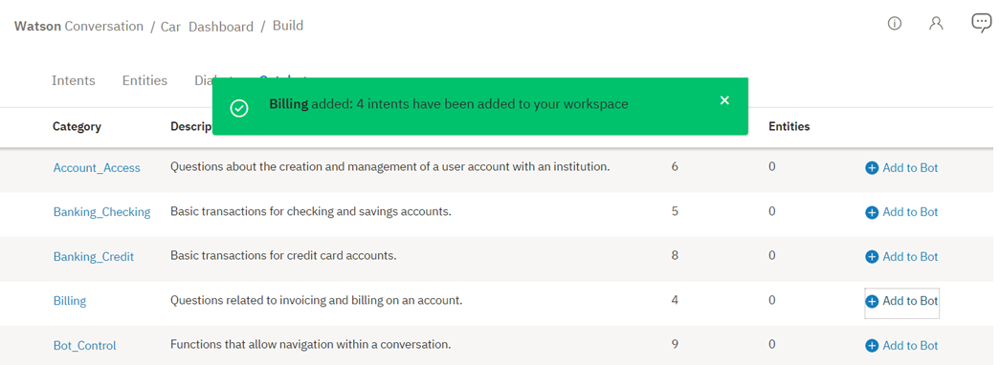

---

copyright:
  years: 2015, 2018
lastupdated: "2018-02-13"

---

{:shortdesc: .shortdesc}
{:new_window: target="_blank"}
{:tip: .tip}
{:pre: .pre}
{:codeblock: .codeblock}
{:screen: .screen}
{:javascript: .ph data-hd-programlang='javascript'}
{:java: .ph data-hd-programlang='java'}
{:python: .ph data-hd-programlang='python'}
{:swift: .ph data-hd-programlang='swift'}

# Utilizzo dei cataloghi
{: #catalog}

I ***cataloghi*** forniscono un modo veloce per aggiungere gli intenti comuni al tuo spazio di lavoro di servizio {{site.data.keyword.conversationshort}}.
{: shortdesc}

## Aggiunta di un catalogo al tuo spazio di lavoro
{: #add-catalog}

Utilizza lo strumento {{site.data.keyword.conversationshort}} per aggiungere i cataloghi.

1.  Nello strumento {{site.data.keyword.conversationshort}}, apri il tuo spazio di lavoro e seleziona la scheda **Catalogo** nella barra di navigazione. Se **Catalogo** non è visibile, utilizza il menu  per aprire la pagina.

1.  Seleziona un catalogo, ad esempio *Fatturazione*, per vedere gli intenti forniti con esso. 

    

    Visualizzerai le informazioni relative agli intenti definiti nella categoria *Fatturazione*.

    

    Gli intenti aggiunti da un catalogo sono distinguibili dagli altri intenti grazie alla loro convenzione di denominazione; in questo caso, `#Billing_ . . .`

1.  Seleziona  per tornare alla scheda **Catalogo**.

1.  Successivamente, aggiungi il catalogo *Fatturazione* al tuo spazio di lavoro facendo clic sul pulsante `Aggiungi a Bot`. Visualizzerai un messaggio indicante che gli intenti di *Fatturazione* sono stati aggiunti al tuo spazio di lavoro. 

    

1.  Ora, seleziona la scheda **Intenti** e verifica che gli intenti di *Fatturazione* siano stati aggiunti al tuo spazio di lavoro.

    

### Risultati

Gli intenti del catalogo *Fatturazione* sono stati aggiunti alla scheda **Intenti** del tuo spazio di lavoro e il sistema comincia ad addestrarsi sui nuovi dati.

## Modifica degli esempi di catalogo

Come qualsiasi altro intento, una volta che gli intenti del catalogo *Fatturazione* sono stati aggiunti al tuo spazio di lavoro, puoi apportare le seguenti modifiche:

- Rinominare l'intento.
- Eliminare l'intento.
- Aggiungere, modificare o eliminare gli esempi.
- Spostare un esempio in un intento diverso.

Puoi passare da un nome intento a ogni esempio e, se lo desideri, modificare gli esempi.

Per spostare o eliminare un esempio, seleziona l'esempio selezionando la casella di spunta e quindi seleziona **Sposta** o **Elimina**.

  
