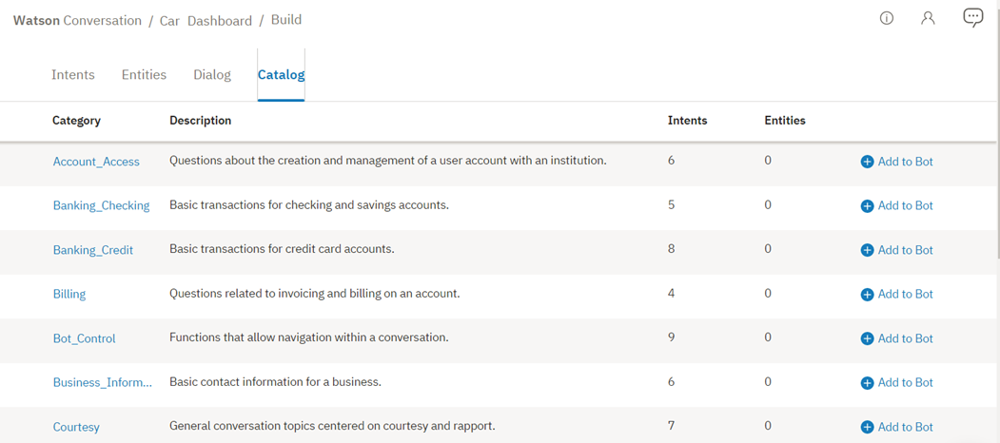
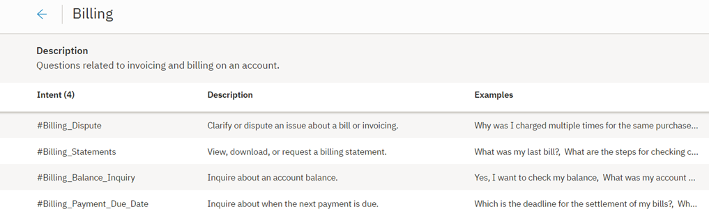
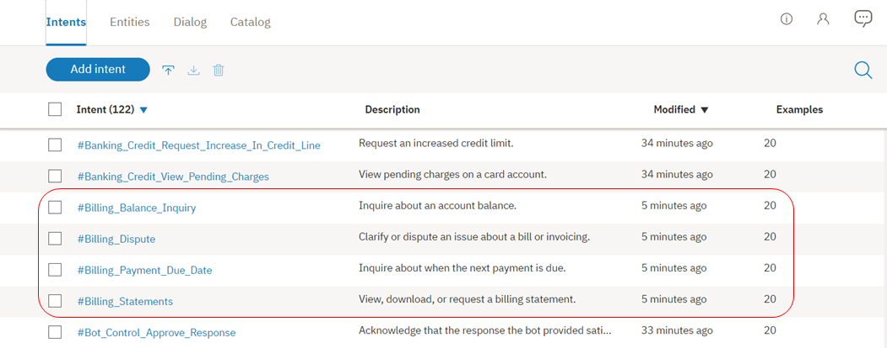

---

copyright:
  years: 2015, 2019
lastupdated: "2019-05-28"

subcollection: assistant

---

{:shortdesc: .shortdesc}
{:new_window: target="_blank"}
{:deprecated: .deprecated}
{:important: .important}
{:note: .note}
{:tip: .tip}
{:pre: .pre}
{:codeblock: .codeblock}
{:screen: .screen}
{:javascript: .ph data-hd-programlang='javascript'}
{:java: .ph data-hd-programlang='java'}
{:python: .ph data-hd-programlang='python'}
{:swift: .ph data-hd-programlang='swift'}

# Utilizzo dei cataloghi di contenuto
{: #catalog}

I ***cataloghi di contenuto*** costituiscono un modo semplice per aggiungere gli intenti comuni alla tua capacità di dialogo {{site.data.keyword.conversationshort}}.
{: shortdesc}

Gli intenti che aggiungi dal catalogo sono pensati per costituire un punto di partenza. Aggiungi o modifica gli intenti di catalogo per adattarli al tuo caso di utilizzo.

## Aggiunta di un catalogo di contenuto alla tua capacità di dialogo
{: #catalog-add}

1.  Apri la tua capacità di dialogo e poi fai clic sulla scheda **Content Catalog**.

1.  Seleziona un catalogo di contenuto, ad esempio *Banking*, per vedere gli intenti che sono stati forniti con esso.

    

    Vedrai le informazioni relative agli intenti inclusi nel catalogo.

    

    Gli intenti aggiunti da un catalogo di contenuto sono distinguibili dagli altri intenti grazie ai loro nomi. A ogni nome intento viene anteposto un nome del catalogo di contenuto.

1.  Seleziona  per ritornare alla scheda **Content Catalog**.

1.  Successivamente, aggiungi un catalogo di contenuto alla tua capacità di dialogo facendo clic sul pulsante `Add to skill`.

1.  Ora, seleziona la scheda **Intents** e verifica che gli intenti provenienti dal catalogo siano stati aggiunti e siano disponibili.

    

Il sistema inizia ad addestrarsi sui nuovi dati.

Dopo aver aggiunto un catalogo alla tua capacità, gli intenti diventano parte dei tuoi dati di addestramento. Se IBM esegue aggiornamenti successivi al contenuto di un catalogo, le modifiche non verranno applicate automaticamente agli intenti che hai aggiunto da un catalogo.
{: note}

## Modifica degli esempi del catalogo di contenuto
{: #catalog-edit-content}

Come qualsiasi altro intento, una volta che hai aggiunto gli intenti del catalogo di contenuto alla tua capacità, puoi apportare le seguenti modifiche:

- Rinominare l'intento.
- Eliminare l'intento.
- Aggiungere, modificare o eliminare gli esempi.
- Spostare un esempio in un intento diverso.
