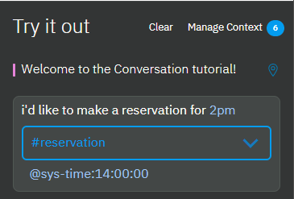

---

copyright:
  years: 2015, 2018
lastupdated: "2018-02-16"

---

{:shortdesc: .shortdesc}
{:new_window: target="_blank"}
{:tip: .tip}
{:pre: .pre}
{:codeblock: .codeblock}
{:screen: .screen}
{:javascript: .ph data-hd-programlang='javascript'}
{:java: .ph data-hd-programlang='java'}
{:python: .ph data-hd-programlang='python'}
{:swift: .ph data-hd-programlang='swift'}
{:table: .aria-labeledby="caption"}

# Creazione di un dialogo
{: #dialog-build}

Utilizza lo strumento {{site.data.keyword.conversationshort}} per creare il tuo dialogo.
{: shortdesc}

## Limiti di nodi del dialogo
{: #dialog-node-limits}

Il numero di nodi di dialogo che puoi creare dipende dal tuo piano di servizio.

| Piano di servizio     | Nodi di dialogo per spazio di lavoro |
|------------------|---------------------------:|
| Standard/Premium |                    100.000 |
| Lite             |                     25.000 |
{: caption="Dettagli piano di servizio" caption-side="top"}

Limite di profondità della struttura ad albero: il servizio supporta 2.000 discendenti del nodo di dialogo, gli strumenti rendono al meglio con 20 o meno.

## Procedura
{: #dialog-procedure}

Per creare un dialogo, completa la seguente procedura:

1.  Apri la pagina **Build** dalla barra di navigazione, fai clic sulla scheda **Dialogo** e quindi su **Crea**.

    Quando apri il builder di dialoghi per la prima volta, vengono creati automaticamente i seguenti nodi:
    - **Benvenuto**: il primo nodo. Contiene un messaggio iniziale che viene visualizzato agli utenti la prima volta che si collegano al servizio. Puoi modificare il messaggio iniziale.
    - **Altro**: il nodo finale. Contiene frasi che vengono utilizzate per rispondere agli utenti quando il loro input non viene riconosciuto. Puoi sostituire le risposte fornite o aggiungere altre risposte con un significato simile per aggiungere varietà alla conversazione. Inoltre, puoi scegliere che il servizio restituisca ogni risposta definita a turno o in ordine casuale.
1.  Per aggiungere altri nodi alla struttura ad albero di dialogo, fai clic sull'icona **Altro**  sul nodo **Benvenuto** e seleziona quindi **Aggiungi nodo in basso**.
1.  Immetti una condizione che, quando soddisfatta, attivi il servizio per elaborare il nodo.

    Quando inizi a definire una condizione, viene visualizzata una casella che mostra le tue opzione. Puoi immettere uno dei seguenti caratteri e quindi scegliere un valore dall'elenco di opzioni che viene visualizzato.

    <table>
    <caption>Sintassi builder di condizioni</caption>
    <tr>
      <th>Carattere</th>
      <th>Elenca i valori definiti per questi tipo di risorsa</th>
    </tr>
    <tr>
      <td>`#`</td>
      <td>intenti</td>
    </tr>
    <tr>
      <td>`@`</td>
      <td>entità</td>
    </tr>
    <tr>
      <td>`@{entity-name}:`</td>
      <td>valori {entity-name}</td>
    </tr>
    <tr>
      <td>`$`</td>
      <td>variabili di contesto che hai definito o indicato altrove nel dialogo</td>
    </tr>
    </table>

    Puoi creare un nuovo intento, entità, valore di entità o variabile di contesto definendo una nuova condizione che lo utilizzi. Se crei una risorsa in questo modo, assicurati di tornare indietro e di completare tutti gli altri passi necessari affinché la risorsa venga creata in modo completo, ad esempio la definizione delle espressioni di esempio per un intento.

    Per definire un nodo che viene attivato in base a più di una condizione, immetti una condizione e fai quindi clic sull'icona di segno più (+) accanto ad essa. Se vuoi applicare un operatore `OR` alle condizioni multiple anziché `AND`, fai clic su `and` visualizzato tra i campi per cambiare il tipo di operatore. Le operazioni AND vengono eseguite prima delle operazioni OR, ma puoi modificare l'ordine utilizzando le parentesi. Ad esempio:
    `$isMember:true AND ($memberlevel:silver OR $memberlevel:gold)`

    La condizione che definisci deve avere una lunghezza massima di 500 caratteri.

    Per ulteriori informazioni su come testare i valori nelle condizioni, vedi [Condizioni](dialog-overview.html#conditions).
1.  **Facoltativo**: se vuoi raccogliere più informazioni dall'utente in questo nodo, fai clic su **Personalizza** e abilita **Slot**. Per ulteriori dettagli, vedi [Raccolta di informazioni con gli slot](dialog-slots.html).
1.  Immetti una risposta.
    - Aggiungi il testo che vuoi che il servizio visualizzi all'utente come risposta.
    - Se desideri definire risposte diverse in base a determinate condizioni, fai clic su **Personalizza** e abilita **Risposte multiple**.
    - Per informazioni sulle risposte condizionali oppure su come aggiungere varietà alle risposte, vedi [Risposte](dialog-overview.html##responses).

1.  Specifica quali operazioni eseguire una volta elaborato il nodo corrente. Puoi scegliere tra le seguenti opzioni:

    - **Attendi input utente**: il servizio si interrompe fino a quando l'utente non fornisce nuovo input. 
    - **Ignora input utente**: il servizio passa direttamente al primo nodo figlio. Questa opzione è disponibile solo se il nodo corrente presenta almeno un nodo figlio. 
    - **Passa a**: il servizio continua il dialogo elaborando il nodo che hai specificato. Puoi scegliere se il servizio deve valutare la condizione del nodo di destinazione oppure deve passare direttamente alla risposta del nodo di destinazione. Per ulteriori dettagli, vedi [Configurazione dell'azione Passa a](dialog-overview.html#jump-to-config).

1.  **Facoltativo**: fornisci un nome per il nodo.

    Il nome del nodo di dialogo può contenere lettere (in Unicode), numeri, spazi, caratteri di sottolineatura, trattini e punti.

    La denominazione del nodo rende più facile ricordare il suo scopo e individuare il nodo quando è ridotto al minimo. Se non fornisci un nome, la condizione del nodo viene utilizzata come nome.

1.  Per aggiungere altri nodi, seleziona un nodo nella struttura ad albero e fai clic sull'icona **Altro** .
    - Per creare un nodo peer che venga controllato successivamente se la condizione per il nodo esistente non viene soddisfatta, seleziona **Aggiungi nodo in basso**.
    - Per creare un nodo peer che venga controllato prima di verificare la condizione per il nodo esistente, seleziona **Aggiungi nodo in alto**.
    - Per creare un nodo figlio per il nodo selezionato, seleziona **Aggiungi nodo figlio**. Un nodo figlio viene elaborato dopo il suo nodo padre.
    - Per copiare il nodo corrente, seleziona **Duplica**.

    Per ulteriori informazioni sull'ordine in cui vengono elaborati i nodi di dialogo, vedi [Panoramica del dialogo](dialog-overview.html#dialog-flow).
1.  Verifica il dialogo mentre lo crei.
   Per ulteriori informazioni, vedi [Test del dialogo](#test).

## Test del dialogo
{: #test}

Quando apporti modifiche al tuo dialogo, puoi testarlo in qualsiasi momento per vedere come risponde all'input.

1.  Dalla scheda Dialogo, fai clic sull'icona .
1.  Nel riquadro di chat, immetti un testo e premi Invio.

    Assicurati che il sistema abbia terminato l'addestramento sulle tue modifiche più recenti prima di iniziare a testare il dialogo. Se il sistema è ancora in fase di addestramento, nel riquadro *Provalo* viene visualizzato un messaggio:
    {: tip}

    
1.  Controlla la risposta per vedere se il dialogo ha interpretato correttamente il tuo input e scelto la risposta appropriata.

    La finestra di chat indica quali intenti ed entità sono stati riconosciuti nell'input:

    
1.  Se desideri conoscere quale nodo nella struttura ad albero di dialogo ha attivato una risposta, fai clic sull'icona **Ubicazione**  accanto ad esso. Se ancora non ti trovi nella scheda Dialogo, aprila.

    Il nodo di origine viene attivato e viene evidenziata la rotta utilizzata dal servizio nella struttura ad albero per raggiungerlo. Rimane evidenziata fino a quando non esegui un'altra azione, ad esempio se inserisci un nuovo input di test.
1.  Per controllare o impostare il valore di una variabile di contesto, fai clic sul link **Gestisci contesto**.

    Vengono visualizzate tutte le variabili di contesto definite nel dialogo.

    Inoltre, è elencata una variabile di contesto `$timezone`. L'interfaccia utente del riquadro *Provalo* ottiene le informazioni sulla locale dell'utente dal browser web e le utilizza per impostare la variabile di contesto `$timezone`. Questa variabile di contesto consente di gestire meglio i riferimenti di tempo negli scambi di dialogo di test. Potresti fare qualcosa di simile nella tua applicazione utente. Se non si specifica un valore, viene utilizzato Greenwich Mean Time (GMT).

    Puoi aggiungere una variabile e impostarne il valore per vedere come il dialogo risponde nel turno di dialogo di test successivo. Questa funzionalità è utile se, ad esempio, il dialogo è configurato per mostrare risposte diverse in base a un valore di variabile di contesto fornito dall'utente.

    1.  Per aggiungere una variabile di contesto, specifica il nome della variabile e premi **Invio**.
    1.  Per definire un valore predefinito per la variabile di contesto, individua la variabile di contesto che hai aggiunto nell'elenco e specifica un valore.

    Per ulteriori informazioni, vedi [Variabili di contesto](dialog-runtime.html#context).

1.  Continua a interagire con il dialogo per vedere come fluisce la conversazione.
    - Per trovare e inviare nuovamente un'espressione di test, puoi premere il tasto Su per scorrere i tuoi input recenti.
    - Per rimuovere le espressioni di test precedenti dal riquadro di chat e ricominciare, fai clic sul link **Cancella**. Questa azione non solo rimuove le espressioni e le risposte di test, ma cancella anche i valori di qualsiasi variabile di contesto impostata in seguito alle tue interazioni con il dialogo. I valori delle variabili di contesto che hai impostato o modificato in modo esplicito non vengono cancellati.

### Operazioni successive

Se stabilisci che vengono riconosciuti intenti o entità errati, potresti dover modificare le tue definizioni di intento o entità.

Se vengono riconosciuti gli intenti e le entità corretti, ma nel dialogo vengono attivati i nodi errati, assicurati che le tue condizioni siano scritte correttamente.

## Ricerca nel dialogo
{: #search}

Utilizza la funzione Ricerca per trovare le condizioni e i titoli nel tuo dialogo. 

1.  Seleziona l'icona Ricerca: 

1.  Immetti una frase o un termine di ricerca. 

    **Nota**: la prima volta che esegui una ricerca, viene creato un indice; potresti visualizzare un messaggio di attesa durante l'indicizzazione del contenuto. 

### Risultati

Vengono visualizzati i nodi che contengono il tuo termine di ricerca e gli esempi corrispondenti. Seleziona un risultato per aprirlo per la modifica. 

  

## Copia di un nodo di dialogo
{: #copy-node}

Puoi duplicare un nodo per crearne una copia esatta come un nodo peer direttamente sotto di esso nella struttura ad albero di dialogo. Al nodo copiato stesso viene fornito lo stesso nome del nodo originale a cui viene accodato `- copy`*`n`*, il valore *`n`* indica un numero a partire da 1. Se duplichi lo stesso nodo più volte, il valore *`n`* nel nome viene incrementato di uno per ogni copia in modo che ti sia più facile distinguere le copie l'una dall'altra. Se il nodo non ha nome, viene assegnato il nome `copy`*`n`*.

Quando duplichi un nodo che ha nodi figlio, vengono duplicati anche i nodi figlio. I nodi figlio copiati hanno lo stesso esatto nome dei nodi figlio originali. L'unico modo per distinguere un nodo figlio copiato da uno originale è il riferimento `copy` nel nome nodo padre. 

1.  Sul nodo che vuoi copiare, fai clic sull'icona **Altro**  e seleziona **Duplica**.
1.  Prendi in considerazione di ridenominare i nodi copiati o di modificare le loro condizioni in modo da fare una distinzione. 

## Spostamento di un nodo di dialogo
{: #move-node}

Ogni nodo che hai creato può essere spostato altrove nella struttura ad albero di dialogo.

Potresti voler spostare un nodo creato in precedenza in un'altra area del flusso per modificare la conversazione. Puoi spostare i nodi in modo che diventino nodi di pari livello o peer in un altro ramo.

1.  Sul nodo che vuoi spostare, fai clic sull'icona **Altro**  e seleziona **Sposta**.
1.  Seleziona un nodo di destinazione presente nella struttura ad albero vicino a dove vuoi spostare questo nodo. Scegli se posizionare questo nodo prima o dopo il nodo di destinazione o se renderlo un nodo figlio del nodo di destinazione.

## Organizzazione del dialogo utilizzando le cartelle
{: #folders}

Puoi raggruppare insieme i nodi di dialogo aggiungendoli ad una cartella. Sono molti i motivi per raggruppare i nodi: 

- Per conservare insieme i nodi che si riferiscono ad un oggetto simile per facilitarne la ricerca. Ad esempio, puoi raggruppare i nodi che fanno fronte a domande relative agli account utente in una cartella *Account utente* e i nodi che gestiscono le query relative ai pagamenti in una cartella *Pagamenti*.
- Per raggruppare insieme una serie di nodi che desideri vengano elaborati dal dialogo solo se viene soddisfatta una determinata condizione. Utilizza una condizione, ad esempio `$isPlatinumMember`, per raggruppare i nodi che offrono servizi supplementari che devono essere elaborati solo se l'utente corrente è autorizzato a ricevere i servizi supplementari. 
- Per nascondere i nodi dal runtime mentre ci lavori. Puoi aggiungere i nodi ad una cartella con una condizione `false` per impedirne l'elaborazione. 
- Per applicare le stesse impostazioni di configurazione per la digressione in un nodo a più nodi root contemporaneamente. Per ulteriori informazioni, vedi [Digressioni](dialog-runtime.html#digressions).

Queste caratteristiche della cartella influiscono sulla modalità di elaborazione dei nodi in una cartella: 

- Condizione: se specificata, il servizio valuta innanzitutto la condizione della cartella per stabilire se elaborare i nodi contenuti in essa. 
- Personalizzazioni: le impostazioni di configurazione che applichi alla cartella vengono ereditate dai nodi presenti nella cartella. Se, ad esempio, modifichi le impostazioni di digressione della cartella, le modifiche verranno ereditate da tutti i nodi presenti nella cartella. 
- Gerarchia struttura ad albero: i nodi in una cartella vengono gestiti come nodi root o figlio a seconda del fatto che la cartella sia stata aggiunta alla struttura ad albero di dialogo a livello root o figlio. I nodi a livello root che hai aggiunto ad una cartella a livello root continueranno a funzionare come nodi root; ad esempio, non diventeranno nodi figlio della cartella. Tuttavia, se sposti i nodi a livello root in una cartella che contiene un figlio di un altro nodo, i nodi root diventeranno i figli di questo altro nodo. 

Le cartelle non influiscono sull'ordine con cui vengono valutati i nodi. I nodi continuano ad essere elaborati dal primo all'ultimo. Mentre il servizio scende lungo la struttura ad albero, quando trova una cartella, se la condizione della cartella è true, elaborerà immediatamente il primo nodo della cartella e continuerà a scendere lungo la struttura ad albero da quel punto. Se una cartella non presenta una condizione della cartella, verrà ignorata dal servizio. 

### Aggiunta di una cartella
{: #folders-add}

Per aggiungere una cartella ad una struttura ad albero di dialogo, completa la seguente procedura: 

1.  Dalla vista della struttura ad albero della scheda **Dialogo**, fai clic su **Aggiungi cartella**.

    La cartella viene aggiunta alla fine della struttura ad albero di dialogo, appena prima del nodo **Altro**. A meno che non venga selezionato un nodo esistente nella struttura ad albero, in questo caso viene aggiunta dopo il nodo selezionato. 

    Se desideri aggiungere la cartella in un qualsiasi altro punto della struttura ad albero, dal nodo sopra il punto in cui desideri aggiungerla, fai clic sull'icona **Altro**  e quindi seleziona **Aggiungi cartella**.

    Puoi aggiungere una cartella sotto un nodo figlio all'interno di un ramo di dialogo esistente. Per eseguire tale operazione, fai clic sull'icona **Altro**  nel nodo figlio e quindi seleziona **Aggiungi cartella**.

    La cartella viene aperta nella vista di modifica. 

1.  **Facoltativo**: nome della cartella. 

1.  **Facoltativo**: definisci una condizione per la cartella.

    Se non specifichi una condizione, verrà utilizzato `true`, in questo modo i nodi nella cartella verranno sempre elaborati. 

1.  Aggiungi i nodi di dialogo alla cartella.

    - Per aggiungere i nodi di dialogo esistenti alla cartella, devi spostarli nella cartella uno alla volta. 

      Sul nodo che desideri spostare, fai clic sull'icona **Altro** , seleziona **Sposta** e quindi fai clic sulla cartella. Seleziona **Nella cartella** come destinazione dello spostamento. 

      Mentre sposti i nodi, vengono aggiunti all'inizio della struttura ad albero all'interno della cartella. Pertanto, se ad esempio desideri conservare l'ordine di una serie di nodi di dialogo root consecutivi, spostali partendo dall'ultimo nodo.
      {: tip}

    - Per aggiungere un nuovo nodo di dialogo alla cartella, fai clic sull'icona **Altro**  nella cartella e quindi seleziona **Aggiungi nodo alla cartella**.

      Il nodo di dialogo viene aggiunto alla fine della struttura ad albero di dialogo all'interno della cartella. 

### Eliminazione di una cartella
{: #folders-delete}

Puoi eliminare la sola cartella oppure la cartella e tutti i nodi di dialogo contenuti in essa. 

Per eliminare una cartella, completa la seguente procedura: 

1.  Dalla vista della struttura ad albero della scheda **Dialogo**, trova la cartella che desideri eliminare. 

1.  Fai clic sull'icona **Altro**  nella cartella e quindi seleziona **Elimina**.

1.  Effettua una delle operazioni riportate di seguito:

    - Per eliminare solo la cartella e conservare i nodi di dialogo presenti in essa, deseleziona la casella di spunta **Elimina i nodi nella cartella** e quindi fai clic su **Sì, eliminala**.
    - Per eliminare la cartella e tutti i nodi di dialogo presenti in essa, fai clic su **Sì, eliminala**.

Se hai eliminato solo la cartella, i nodi contenuti in essa vengono visualizzati nella struttura ad albero di dialogo nel punto in cui si trovava la cartella. 

## Ricerca di un nodo di dialogo per ID nodo
{: #get-node-id}

Potresti voler cercare un nodo di dialogo associato a un ID nodo noto per uno dei seguenti motivi:

- Stai riesaminando i log e il log fa riferimento a una sezione del dialogo mediante il suo ID nodo.
- Vuoi associare gli ID nodo elencati nella proprietà `nodes_visited` dell'output del messaggio API ai nodi che puoi vedere nella tua struttura ad albero di dialogo.
- Un messaggio di errore di runtime del dialogo ti informa di un errore di sintassi e utilizza un ID nodo per identificare il nodo da correggere.

Per rilevare un nodo in base al suo ID, completa la seguente procedura:

1.  Dalla scheda Dialogo degli strumenti, seleziona un qualsiasi nodo nella tua struttura ad albero di dialogo.
1.  Se è aperta, chiudi la vista di modifica per il nodo corrente.
1.  Nel campo di ubicazione del tuo browser web, dovrebbe essere visualizzato un URL con la seguente sintassi:

    `    https://watson-conversation.ng.bluemix.net/space/instance-id/workspaces/workspace-id/build/dialog#node=node-id
    `

1.  Modifica l'URL sostituendo il valore `node-id` corrente con l'ID del nodo che vuoi trovare e invia quindi il nuovo URL. 
1.  Se necessario, evidenzia l'URL modificato e invialo di nuovo.

Lo strumento si aggiorna e sposta lo stato attivo sul nodo di dialogo con l'ID nodo che hai specificato. Se l'ID nodo è per uno slot, un gestore slot o una risposta condizionale, il nodo in cui è definito lo slot o la risposta condizionale verrà attivato e verrà visualizzato il modale corrispondente. 

**Nota**: se ancora non riesci a trovare il nodo, puoi esportare lo spazio di lavoro e utilizzare l'editor JSON per eseguire la ricerca nel file JSON dello spazio di lavoro.
