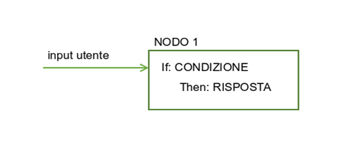
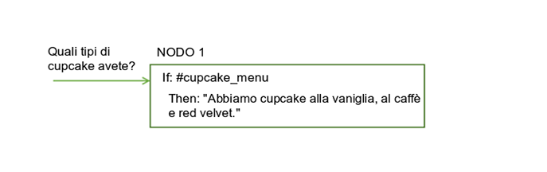
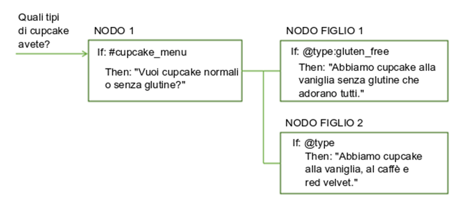
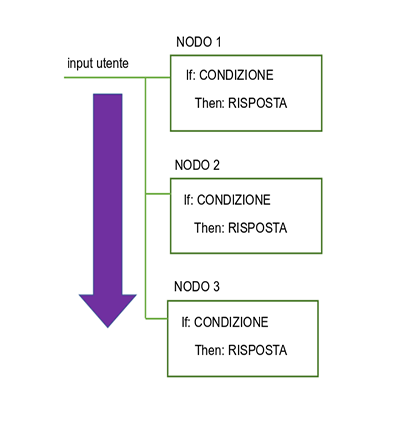
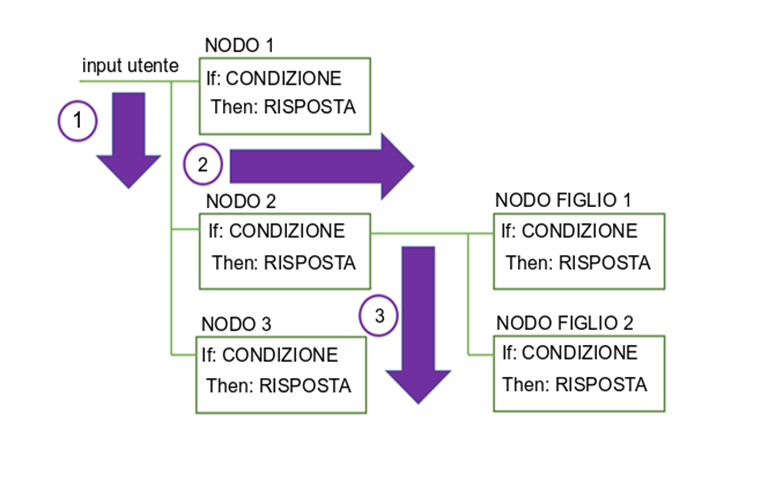
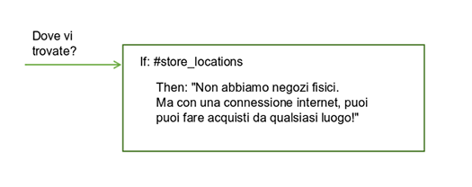
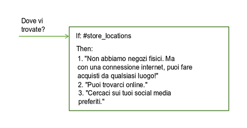
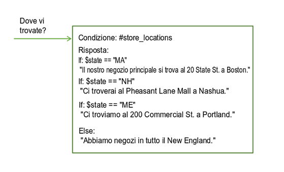

---

copyright:
  years: 2015, 2019
lastupdated: "2019-02-28"

subcollection: assistant

---

{:shortdesc: .shortdesc}
{:new_window: target="_blank"}
{:deprecated: .deprecated}
{:important: .important}
{:note: .note}
{:tip: .tip}
{:pre: .pre}
{:codeblock: .codeblock}
{:screen: .screen}
{:javascript: .ph data-hd-programlang='javascript'}
{:java: .ph data-hd-programlang='java'}
{:python: .ph data-hd-programlang='python'}
{:swift: .ph data-hd-programlang='swift'}
{:table: .aria-labeledby="caption"}

# Panoramica del dialogo
{: #dialog-overview}

Il dialogo utilizza gli intenti che vengono identificati nell'input dell'utente, oltre al contesto ottenuto dall'applicazione, per interagire con l'utente e infine fornire una risposta utile.
{: shortdesc}

Il dialogo mette in corrispondenza gli intenti (cosa dicono gli utenti) con le risposte (cosa risponde il bot). La risposta potrebbe essere quella fornita per una domanda del tipo `Dove posso fare benzina?` o l'esecuzione di un comando, come ad esempio l'accensione della radio. L'intento e l'entità potrebbero essere informazioni sufficienti per identificare la risposta corretta o il dialogo potrebbe chiedere all'utente un ulteriore input necessario per rispondere correttamente. Ad esempio, se un utente chiede `Dove posso prendere qualcosa da mangiare?` potresti voler chiarire se vuole un ristorante o un supermercato, in loco o da asporto e così via. Puoi chiedere ulteriori dettagli in una risposta di testo e creare uno o più nodi figlio per elaborare il nuovo input.

<iframe class="embed-responsive-item" id="youtubeplayer" title="Panoramica del dialogo" type="text/html" width="640" height="390" src="https://www.youtube.com/embed/XkhAMe9gSFU?rel=0" frameborder="0" webkitallowfullscreen mozallowfullscreen allowfullscreen> </iframe>

Nota: il video dura 15 minuti; i primi 5 minuti spiegano come aggiungere un nodo.

Questo dialogo viene rappresentato graficamente nello strumento {{site.data.keyword.conversationshort}} come una struttura ad albero. Crea un ramo per elaborare ogni intento che desideri venga gestito dalla conversazione. Un ramo è composto da più nodi.

## Nodi del dialogo
{: #dialog-overview-nodes}

Ogni nodo di dialogo contiene, come minimo, una condizione e una risposta.



- Condizione: specifica le informazioni che devono essere presenti nell'input utente affinché questo nodo nel dialogo venga attivato. Di norma, le informazioni costituiscono uno specifico intento. Potrebbero anche essere un tipo di entità, un valore di entità o un valore di variabile di contesto. Per ulteriori informazioni, vedi [Condizioni](#dialog-overview-conditions).
- Risposta: l'espressione utilizzata dal servizio per rispondere all'utente. La risposta può anche essere configurata per mostrare un'immagine o un elenco delle opzioni oppure per attivare azioni programmatiche. Per ulteriori informazioni, vedi [Risposte](#dialog-overview-responses).

Il nodo può essere considerato come avente una costruzione if/then: se la condizione è true, allora restituirà questa risposta.

Ad esempio, il seguente nodo viene attivato se la funzione di elaborazione del linguaggio naturale del servizio determina che l'input utente contiene l'intento `#cupcake-menu`. Come risultato del nodo che viene attivato, il servizio risponde con una risposta appropriata.



Un singolo nodo con una sola condizione e risposta può gestire semplici richieste dell'utente. Ma, il più delle volte, gli utenti hanno domande più sofisticate o desiderano aiuto con attività più complesse. Puoi aggiungere dei nodi figlio che richiedano all'utente di fornire qualsiasi ulteriore informazione richiesta dal servizio.



## Flusso del dialogo
{: #dialog-overview-flow}

Il dialogo che crei viene elaborato dal servizio dal primo nodo nella struttura ad albero all'ultimo.



Mentre scende lungo la struttura ad albero, se il servizio trova una condizione che viene soddisfatta, attiverà tale nodo. Si sposta quindi insieme al nodo attivato per controllare l'input utente e verificare la presenza di eventuali condizioni del nodo figlio. Mentre controlla i nodi figlio, si sposta di nuovo dal primo nodo figlio all'ultimo.

Il servizio continua il suo percorso attraverso la struttura ad albero di dialogo dal primo all'ultimo nodo, insieme a ciascun nodo attivato, quindi dal primo all'ultimo nodo figlio, insieme a ciascun nodo figlio attivato finché non raggiunge l'ultimo nodo nel ramo che sta seguendo.



Quando inizi a creare il dialogo, devi stabilire i rami da includere e dove posizionarli. L'ordine dei rami è importante in quanto i nodi vengono valutati dal primo all'ultimo. Viene utilizzato il primo nodo root la cui condizione corrisponde all'input; tutti i nodi che seguono nella struttura ad albero non vengono attivati.

Quando il servizio raggiunge la fine di un ramo oppure non può trovare una condizione valutata come true nella serie corrente di nodi figlio che sta valutando, ritorna alla base della struttura ad albero. E ancora una volta, il servizio elabora i nodi root dal primo all'ultimo. Se nessuna condizione viene valutata come true, viene restituita la risposta proveniente dall'ultimo nodo nella struttura ad albero che di solito contiene una condizione speciale `anything_else` che viene sempre valutata come true.

Puoi interrompere il flusso standard dal-primo-all'ultimo nei seguenti modi:

- Personalizzando le operazioni da eseguire una volta elaborato un nodo. Ad esempio, puoi configurare un nodo in modo che passi direttamente ad un altro nodo una volta elaborato anche se l'altro nodo è posizionato prima nella struttura ad albero. Per ulteriori informazioni, vedi [Definizione delle operazioni successive](#dialog-overview-jump-to).
- Configurando le risposte condizionali per passare ad altri nodi. Per ulteriori informazioni, vedi [Risposte condizionali](#dialog-overview-multiple).
- Configurando le impostazioni di digressione per i nodi di dialogo. Le digressioni possono anche influire su come gli utenti si spostano tra i nodi nel runtime. Se abiliti la generazione delle digressioni dalla maggior parte dei nodi e configuri le restituzioni, gli utenti potranno passare da un nodo all'altro più facilmente. Per ulteriori informazioni, vedi [Digressioni](/docs/services/assistant?topic=assistant-dialog-runtime#dialog-runtime-digressions).

## Condizioni
{: #dialog-overview-conditions}

Una condizione del nodo determina se il nodo viene utilizzato nella conversazione. Le condizioni di risposta determinano quale risposta restituire a un utente.

- [Risorse della condizione](#dialog-overview-condition-artifacts)
- [Condizioni speciali](#dialog-overview-special-conditions)
- [Dettagli della sintassi della condizione](#dialog-overview-condition-syntax)

Per suggerimenti sull'esecuzione delle azioni più avanzate nelle condizioni, vedi [Suggerimenti sull'utilizzo delle condizioni](/docs/services/assistant?topic=assistant-dialog-tips#dialog-tips-condition-usage-tips).

### Risorse della condizione
{: #dialog-overview-condition-artifacts}

Per definire una condizione, puoi utilizzare una o più delle seguenti risorse in qualsiasi combinazione:

- **Variabile di contesto**: il nodo viene utilizzato se l'espressione di variabili di contesto da te specificata è true. Utilizza la sintassi `$variable_name:value` o `$variable_name == 'value'`.

  Per le condizioni del nodo, questo tipo di risorsa viene utilizzato di solito con un operatore AND o OR e un altro valore di condizione. Ciò è dovuto al fatto che un elemento nell'input utente deve attivare il nodo; il valore della variabile di contesto che si sta mettendo in corrispondenza non è sufficiente per attivarlo. Se ad esempio, l'oggetto dell'input utente imposta in qualche modo il valore della variabile di contesto, il nodo viene attivato.

  Non definire una condizione di nodo in base al valore di una variabile di contesto nello stesso nodo di dialogo in cui imposti il valore della variabile di contesto.
  {: tip}

  Per le condizioni di risposta, questo tipo di risorsa può essere utilizzato da solo. Puoi modificare la risposta in base a un valore di variabile di contesto specifico. Ad esempio, `$city:Boston` controlla se la variabile di contesto `$city` contiene il valore `Boston`. Se è così, la risposta viene restituita.
  
  Per ulteriori informazioni sulle variabili di contesto, vedi [Variabili di contesto](/docs/services/assistant?topic=assistant-dialog-runtime#dialog-runtime-context).

- **Entità**: il nodo viene utilizzato quando qualsiasi valore o sinonimo dell'entità viene riconosciuto nell'input utente. Utilizza la sintassi `@entity_name`. Ad esempio, `@city` controlla se i nomi di città definiti per l'entità @city sono stati rilevati nell'input utente. Se è così, la risposta o il nodo viene elaborato.

  Prendi in considerazione di creare un nodo peer per gestire il caso in cui nessuno dei valori o sinonimi dell'entità venga riconosciuto.
  {: tip}

  Per ulteriori informazioni sulle entità, vedi [Definizione di entità](/docs/services/assistant?topic=assistant-entities).

- **Valore entità**: il nodo viene utilizzato se il valore dell'entità viene rilevato nell'input utente. Utilizza la sintassi `@entity_name:value` e specifica un valore definito per l'entità, non un sinonimo. Ad esempio: `@city:Boston` controlla se il nome di città indicato, `Boston`, è stato rilevato nell'input utente.

  Se controlli la presenza dell'entità, senza specificarne un particolare valore, in un nodo peer, assicurati di posizionare questo nodo (che controlla la presenza di un particolare valore dell'entità) prima del nodo peer che controlla solo la presenza dell'entità. In caso contrario, questo nodo non verrà mai valutato.
  {: tip}

  Se l'entità è un'entità modello con gruppi di acquisizione, puoi controllare la presenza di una determinata corrispondenza del valore del gruppo. Ad esempio puoi utilizzare la sintassi: `@us_phone.groups[1] == '617'`
  Per ulteriori informazioni, vedi [Memorizzazione e riconoscimento dei gruppi di entità modello nell'input](/docs/services/assistant?topic=assistant-dialog-tips#dialog-tips-get-pattern-groups).

- **Intento**: la condizione più semplice è un singolo intento. Il nodo viene utilizzato se, una volta che l'elaborazione del linguaggio naturale del servizio valuta l'input dell'utente, determina che lo scopo dell'input dell'utente viene associato a un intento predefinito. Utilizza la sintassi `#intent_name`. Ad esempio, `#weather` controlla se l'input utente sta chiedendo una previsione meteorologica. Se sì, il nodo con la condizione di intento `#weather` viene elaborata.

  Per ulteriori informazioni sugli intenti, vedi [Definizione di intenti](/docs/services/assistant?topic=assistant-intents).

- **Condizione speciale**: condizioni fornite con il servizio che puoi utilizzare per eseguire funzioni di dialogo comuni. Vedi la tabella **Condizioni speciali** nella prossima sezione per i dettagli.

### Condizioni speciali
{: #dialog-overview-special-conditions}

| Sintassi delle condizioni     | Descrizione |
|----------------------|-------------|
| `anything_else`      | Puoi utilizzare questa condizione alla fine di un dialogo, affinché venga elaborata quando l'input utente non corrisponde a nessun altro nodo di dialogo. Il nodo **Altro** viene attivato da questa condizione. |
| `conversation_start` | Come **welcome**, questa condizione viene valutata come true durante il primo turno di dialogo. A differenza di **welcome**, è true a prescindere che la richiesta iniziale dall'applicazione contenga o meno l'input utente. Un nodo con la condizione **conversation_start** può essere utilizzato per inizializzare le variabili di contesto o per eseguire altre attività all'inizio del dialogo. |
| `false`              | Questa condizione viene sempre valutata come false. Potresti utilizzarla all'inizio di un ramo in fase di sviluppo, per impedire che venga utilizzato, o come condizione per un nodo che fornisce una funzione comune ed è utilizzato solo come destinazione di un'azione **Passa a**. |
| `irrelevant`         | Questa condizione viene valutata come true se l'input dell'utente viene considerato irrilevante dal servizio {{site.data.keyword.conversationshort}}. |
| `true`               | Questa condizione viene sempre valutata come true. Puoi utilizzarla alla fine di un elenco di nodi o risposte per recuperare eventuali risposte che non corrispondono a nessuna delle condizioni precedenti. |
| `welcome`            | Questa condizione viene valutata come true durante il primo turno di dialogo (all'inizio della conversazione), solo se la richiesta iniziale dall'applicazione non contiene alcun input utente. Viene valutata come false in tutti i turni di dialogo successivi. Il nodo **Benvenuto** viene attivato da questa condizione. In genere, un nodo con questa condizione viene utilizzato per salutare l'utente, ad esempio, per visualizzare un messaggio come `Welcome to our Pizza ordering app.` Questo nodo non viene mai elaborato durante le interazioni che si verificano tramite i canali come Facebook o Slack.|
{: caption="Condizioni speciali" caption-side="top"}

### Dettagli della sintassi della condizione
{: #dialog-overview-condition-syntax}

Utilizza una di queste opzioni di sintassi per creare espressioni valide nelle condizioni:

- Notazioni abbreviate che si riferiscono a intenti, entità e variabili di contesto. Vedi [Accesso e valutazione degli oggetti](/docs/services/assistant?topic=assistant-expression-language).

- Spring Expression Language (SpEL), che è un linguaggio delle espressioni che supporta l'esecuzione di query e la manipolazione di un grafico di oggetti nel runtime. Per ulteriori informazioni, vedi [Linguaggio Spring Expression Language (SpEL)](http://docs.spring.io/spring/docs/current/spring-framework-reference/html/expressions.html){: new_window}.

Puoi utilizzare le espressioni regolari per controllare i valori nella condizione.  Per trovare una stringa corrispondente, puoi utilizzare ad esempio il metodo `String.find`. Per ulteriori dettagli, vedi [Metodi](/docs/services/assistant?topic=assistant-dialog-methods).

## Risposte
{: #dialog-overview-responses}

La risposta del dialogo definisce come rispondere all'utente.

Puoi rispondere in uno dei seguenti modi:

- [Risposta di testo semplice](#dialog-overview-simple-text)
- [Risposte esaurienti](#dialog-overview-multimedia)
- [Risposte condizionali](#dialog-overview-multiple)

### Risposta di testo semplice
{: #dialog-overview-simple-text}

Se vuoi fornire una risposta di testo, immetti semplicemente il testo che vuoi che il servizio visualizzi all'utente.



Per includere un valore di variabile di contesto nella risposta, utilizza la sintassi `$variable_name` per specificarlo. Per ulteriori informazioni, vedi [Variabili di contesto](/docs/services/assistant?topic=assistant-dialog-runtime#dialog-runtime-context). Ad esempio, se sai che la variabile di contesto $user è impostata sul nome dell'utente corrente prima che un nodo venga elaborato, puoi farvi riferimento nella risposta di testo del nodo in questo modo:

```
Hello $user
```
{: screen}

Se il nome dell'utente corrente è `Norman`, la risposta che viene visualizza a Norman è `Hello Norman`.

Se includi uno di questi caratteri speciali in una risposta di testo, eseguine l'escape aggiungendo una barra rovesciata (``\`) davanti ad esso. Se stai utilizzando l'editor JSON, devi utilizzare due barre rovesciate per eseguire l'escape (``\\`). L'escape del carattere impedisce al servizio di interpretarlo in modo errato come uno dei seguenti tipi di risorsa:

| Carattere speciale | Risorsa | Esempio |
|-------------------|----------|---------|
| `$` | Variabile di contesto | `The transaction fee is \$2.` |
| `@` | Entità | `Send us your feedback at feedback\@example.com.` |
{: caption="Caratteri speciali di cui eseguire l'escape nelle risposte" caption-side="top"}

Le integrazioni integrate supportano i seguenti elementi di sintassi Markdown:

| Formato | Sintassi | Esempio |
|------------|--------|---------|
| Corsivo | `We're talking about *practice*.` | We're talking about *practice*. |
| Grassetto | `There's **no** crying in baseball.` | There's **no** crying in baseball. |
| Collegamento ipertestuale | `Contact us at [ibm.com](https://www.ibm.com).` | Contact us at [ibm.com ](https://www.ibm.com). |
{: caption="Sintassi Markdown supportata" caption-side="top"}

Al momento, il riquadro "Provalo" non supporta la sintassi Markdown. Per includere un link di cui viene eseguito il rendering solo nel riquadro "Provalo" e nell'integrazione Preview link, puoi utilizzare la sintassi HTML. Ad esempio: `Contact us at <a href="https://www.ibm.com">ibm.com</a>.` (*Non* provare ad eseguire l'escape delle virgolette con una barra rovesciata `\"`, ad esempio.) Tuttavia, la sintassi HTML non è supportata dalle altre integrazioni integrate.
{: note}

#### Ulteriori informazioni sulle risposte semplici
{: #dialog-overview-variety}

- [Aggiunta di più righe](#dialog-overview-multiline)
- [Aggiunta di varietà](#dialog-overview-add-variety)

#### Aggiunta di più righe
{: #dialog-overview-multiline}

Se desideri che una singola risposta di testo includa più righe separate da ritorno a capo, segui questi passi:

1.  Aggiungi ogni riga che desideri mostrare all'utente come frase separata nel campo delle varianti di risposta. Ad esempio:

  <table>
  <caption>Risposta su più righe</caption>
  <tr>
    <th>Varianti di risposta</th>
  </tr>
  <tr>
    <td>Hi.</td>
  </tr>
  <tr>
    <td>How are you today?</td>
  </tr>
  </table>

1.  Per l'impostazione della variante di risposta, scegli **multiline**.

    Se stai utilizzando una capacità di dialogo creata prima che il supporto per i tipi di risposte esaurienti venisse aggiunto al servizio, potresti non vedere l'opzione *multiline*. Aggiungi un secondo tipo di risposta di testo alla risposta del nodo corrente. Questa azione cambia il modo in cui la risposta viene rappresentata nel JSON sottostante. Di conseguenza, l'opzione multiline diventa disponibile. Scegli il tipo di variazione multiline. Ora, puoi eliminare il secondo tipo di risposta di testo che hai aggiunto alla risposta.
    {: note}

Quando la risposta viene mostrata all'utente, vengono visualizzate entrambe le varianti di risposta, una per riga, come mostrato di seguito:

```
Hi.
How are you today?
```
{: screen}

#### Aggiunta di varietà
{: #dialog-overview-add-variety}

Se i tuoi utenti utilizzano spesso il tuo servizio di conversazione, potrebbero essere stanchi di ascoltare ogni volta gli stessi messaggi iniziali e le stesse risposte.  Puoi aggiungere delle *variazioni* alle tue risposte in modo che la conversazione possa rispondere alla stessa condizione in modi diversi.

In questo esempio, la risposta che il servizio fornisce alle domande relative alle posizioni del negozio differisce da un'interazione all'altra.



Puoi scegliere di ruotare le variazioni di risposta in sequenza o in ordine casuale. Per impostazione predefinita, le risposte vengono ruotate in sequenza, come se fossero scelte da un elenco ordinato.

Per modificare la sequenza in cui vengono restituite le risposte di testo, completa i seguenti passi:

1.  Aggiungi ciascuna variante della risposta nel rispettivo campo della variante di risposta. Ad esempio:

  <table>
  <caption>Risposte che cambiano</caption>
  <tr>
    <th>Varianti di risposta</th>
  </tr>
  <tr>
    <td>Hello.</td>
  </tr>
  <tr>
    <td>Hi.</td>
  </tr>
  <tr>
    <td>Howdy!</td>
  </tr>
  </table>

1.  Per l'impostazione della variante di risposta, scegli una delle seguenti impostazioni:

    - **sequential**: il sistema restituisce la prima variante di risposta la prima volta che il nodo di dialogo viene attivato, la seconda variante di risposta la seconda che viene attivato e così via, nello stesso ordine in cui hai definito le varianti nel nodo.

      I risultati nelle risposte che vengono restituite nel seguente ordine quando viene elaborato il nodo:

      - Prima volta:

        ```
        Hello.
        ```
        {: screen}

      - Seconda volta:

        ```
        Hi.
        ```
        {: screen}

      - Terza volta:
        ```
        Howdy!
        ```
        {: screen}

    - **random**: il sistema seleziona in modo casuale una stringa di testo dall'elenco di varianti la prima volta che il nodo di dialogo viene attivato e seleziona in modo casuale una variante la volta successiva, ma senza ripetere consecutivamente la stessa stringa di testo.

      Esempio dell'ordine in cui potrebbero essere restituite le risposte quando viene elaborato il nodo:

      - Prima volta:

        ```
        Howdy!
        ```
        {: screen}

      - Seconda volta:

        ```
        Hi.
        ```
        {: screen}

      - Terza volta:

        ```
        Hello.
        ```
        {: screen}

### Risposte esaurienti
{: #dialog-overview-multimedia}

Puoi restituire risposte con elementi multimediali o interattivi come ad esempio immagini o pulsanti su cui puoi fare clic per semplificare il modello di interazione della tua applicazione e migliorare l'esperienza utente.

Oltre al tipo di risposta predefinito **Text**, per il quale specifichi il testo da restituire all'utente come una risposta, sono supportati i seguenti tipi di risposta:

- **Connect to human agent**:  il dialogo richiama un servizio da te designato, di norma un servizio che gestisce le code di ticket di supporto dell'operatore, per passare la conversazione a una persona. Puoi, facoltativamente, includere un messaggio che riepiloghi il problema dell'utente da fornire all'operatore. È responsabilità del servizio esterno visualizzare un messaggio che viene mostrato all'utente indicante che si sta trasferendo la conversazione. Il dialogo non gestisce tale comunicazione da solo. Il trasferimento del dialogo non avviene quando stai verificando i nodi con questo tipo di risposta nel riquadro "Provalo". Devi accedere a un nodo che utilizza questo tipo di risposta da una distribuzione di test per vedere come sarà al riguardo l'esperienza dei tuoi utenti.

  Questo tipo di risposta è visibile solo nelle istanze del servizio per un piano Plus o Premium ed è supportato solo con Intercom o con le integrazioni dell'applicazione personalizzate.
  {: note}

- **Image**: incorpora un'immagine nella risposta. Il file immagine di origine deve essere ospitato in un'ubicazione e deve avere un URL che tu possa utilizzare per farvi riferimento. Non può essere un file che viene memorizzato in una directory che non è accessibile pubblicamente.
- **Option**: aggiunge un elenco di una o più opzioni. Quando un utente fa clic su una delle opzioni, un valore di input utente associato viene inviato al servizio. Il rendering delle opzioni può differire a seconda di dove distribuisci il dialogo. Ad esempio, in un canale di integrazione, le opzioni potrebbero essere visualizzate come pulsanti su cui fare clic, mentre in un altro potrebbero essere visualizzate come un elenco a discesa.
- **Pause**: forza l'applicazione ad attendere un determinato numero di millisecondi prima di continuare l'elaborazione. Puoi scegliere di mostrare un indicatore di digitazione per indicare che il dialogo sta lavorando. Utilizza questo tipo di risposta se devi eseguire un'azione che potrebbe richiedere tempo. Ad esempio, un nodo padre esegue una chiamata Cloud Function e visualizza il risultato in un nodo figlio. Potresti utilizzare questo tipo di risposta mentre viene completata la risposta che il nodo padre dà alla chiamata programmatica e poi passare al nodo figlio per mostrare il risultato. Il rendering di questo tipo di risposta non viene eseguito nel riquadro "Provalo". Devi accedere a un nodo che utilizza questo tipo di risposta da una distribuzione di test per vedere come sarà al riguardo l'esperienza dei tuoi utenti.

#### Aggiunta di risposte esaurienti
{: #dialog-overview-multimedia-add}

Per aggiungere una risposta esauriente, completa questi passi:

1.  Fai clic sul menu a discesa nel campo della risposta per scegliere un tipo di risposta e poi fornire le informazioni necessarie: 

    - **Connect to human agent**.  Facoltativamente, puoi aggiungere un messaggio da condividere con l'operatore a cui viene trasferita la conversazione. 

        Questo tipo di risposta è supportato solo con Intercom e le applicazioni di integrazione personalizzate. Per le applicazioni personalizzate, devi programmare l'applicazione client in modo che riconosca quando viene attivato questo tipo di risposta.
        {: note}

    - **Image**. Aggiungi l'URL completo al file di immagine ospitato nel campo **Image source**. L'immagine deve avere un formato .jpg, .gif o .png. Il file di immagine deve essere memorizzato in un'ubicazione che sia pubblicamente indirizzabile dall'URL. 

        Ad esempio: `https://www.example.com/assets/common/logo.png`.

        Se desideri visualizzare un titolo e una descrizione dell'immagine sopra l'immagine incorporata nella risposta, aggiungili nei campi forniti. 

        Le integrazioni Slack richiedono un titolo. Gli altri canali di integrazione ignorano i titoli o le descrizioni.
        {: note}

    - **Option**. Completa i seguenti passi:

      1.  Fai clic su **Add option**.
      1.  Nel campo **List label**, immetti l'opzione da visualizzare nell'elenco. L'etichetta deve avere una lunghezza inferiore a 64 caratteri. 
      1.  Nel campo **Value** corrispondente, immetti l'input utente da passare al servizio quando viene selezionata questa opzione. Il valore deve avere una lunghezza inferiore a 2.048 caratteri. (Una limitazione corrente applica un limite a 64 caratteri, ma ce ne stiamo occupando.) 

          Specifica un valore che sai che attiverà l'intento corretto quando viene inoltrato. Ad esempio, potrebbe essere un esempio utente dei dati di addestramento per l'intento. 
      1.  Ripeti i passi precedenti per aggiungere altre opzioni all'elenco. 
      1.  Aggiungi un'introduzione all'elenco nel campo **Title**. Il titolo può richiedere all'utente di selezionare dall'elenco di opzioni. 

          Alcuni canali di integrazione non visualizzano il titolo.
          {: note}

      1.  Facoltativamente, aggiungi informazioni aggiuntive nel campo **Description**. Se specificata, la descrizione viene visualizzata dopo il titolo e prima dell'elenco di opzioni. 

      Alcuni canali di integrazione non visualizzano la descrizione.
      {: note}

      Ad esempio, puoi creare una risposta come questa: 

        <table>
        <caption>Opzioni di risposta</caption>
        <tr>
          <th>Titolo elenco</th>
          <th>Descrizione elenco</th>
          <th>Etichetta opzione</th>
          <th>Input utente inoltrato quando fai clic</th>
        </tr>
        <tr>
          <td>Insurance types</td>
          <td>Which of these items do you want to insure?</td>
          <td></td>
          <td></td>
        </tr>
        <tr>
          <td></td>
          <td></td>
          <td>Boat</td>
          <td>I want to buy boat insurance</td>
        </tr>
        <tr>
          <td></td>
          <td></td>
          <td>Car</td>
          <td>I want to buy car insurance</td>
        </tr>
         <tr>
          <td></td>
          <td></td>
          <td>Home</td>
          <td>I want to buy home insurance</td>
        </tr>
        </table>

    - **Pause**. Aggiungi la durata della pausa come un numero in millisecondi (ms) nel campo **Duration**.

        Il valore non può superare 10.000 ms. Di norma, gli utenti sono disposti ad aspettare circa 8 secondi (8.000 ms) che qualcuno inserisca una risposta. Per impedire la visualizzazione dell'indicatore di digitazione durante la pausa, scegli **Off**.

        Aggiungi un altro tipo di risposta, ad esempio un tipo di risposta di testo, dopo la pausa per indicare chiaramente che la pausa è terminata.
        {: tip}

    - **Text**. Aggiungi il testo da restituire all'utente nel campo di testo. Facoltativamente, scegli un'impostazione di variante per la risposta di testo. Per ulteriori dettagli, vedi [Risposta di testo semplice](#dialog-overview-simple-text). 

1.  Fai clic su **Add response** per aggiungere un altro tipo di risposta alla risposta corrente. 

    Potresti voler aggiungere più tipi di risposta a una singola risposta per fornire una risposta più esauriente ad una query utente. Ad esempio, se un utente chiede le posizioni di un negozio, potresti mostrare una mappa e visualizzare un pulsante per ogni posizione su cui l'utente può fare clic per ottenere i dettagli dell'indirizzo. Per creare tale tipo di risposta, puoi utilizzare una combinazione di immagine, opzioni e tipi di risposta di testo. Un altro esempio è costituito dall'utilizzo di un tipo di risposta di testo prima di un tipo di risposta pausa in modo che tu possa avvertire gli utenti prima della sospensione del dialogo. 

    Non puoi aggiungere più di 5 tipi di risposta a una singola risposta. Ciò significa che se definisci tre risposte condizionali per un nodo di dialogo, ciascuna risposta condizionale può avere non più di 5 tipi di risposte aggiunti ad essa.
    {: note}

    Un singolo nodo di dialogo non può avere più di una risposta **Connect to human agent**.
    {: note}

1.  Se hai aggiunto più di un tipo di risposta, puoi fare clic sulle frecce per lo **spostamento** verso l'alto o verso il basso per organizzare i tipi di risposta nell'ordine in cui desideri che il servizio li elabori. 

### Risposte condizionali
{: #dialog-overview-multiple}

Un singolo nodo di dialogo può fornire risposte diverse, ognuna attivata da una diversa condizione.  Utilizza questo approccio per risolvere più scenari in un singolo nodo.

<iframe class="embed-responsive-item" id="youtubeplayer1" title="Aggiunta di risposte condizionali" type="text/html" width="640" height="390" src="https://www.youtube.com/embed/Q5_-f7_Iyvg?rel=0" frameborder="0" webkitallowfullscreen mozallowfullscreen allowfullscreen> </iframe>

Il nodo ha ancora una condizione principale, che è la condizione per l'utilizzo del nodo e l'elaborazione delle condizioni e delle risposte che contiene.

In questo esempio, il servizio utilizza le informazioni sulla posizione dell'utente raccolte in precedenza per personalizzare la risposta e fornire informazioni sul negozio più vicino all'utente. Vedi [Variabili di contesto](/docs/services/assistant?topic=assistant-dialog-runtime#dialog-runtime-context) per ulteriori informazioni su come memorizzare le informazioni raccolte dall'utente.



Questo singolo nodo fornisce ora la funzione equivalente di quattro nodi separati.

Per aggiungere risposte condizionali a un nodo, completa i seguenti passi: 

1.  Fai clic su **Customize** e poi fai clic sull'interruttore **Multiple responses** per **attivarlo**.

    La sezione della risposta del nodo cambia per mostrare una coppia di campi condizione e risposta. Puoi aggiungere ad essi una condizione e una risposta.
1.  Per personalizzare ulteriormente una risposta, fai clic sull'icona **Edit response**  accanto alla risposta.

    Devi aprire la risposta per la modifica per completare le seguenti attività: 

    - **Aggiornare il contesto**. Per modificare il valore di una variabile di contesto quando viene attivata una risposta, specifica il valore di contesto nell'editor di contesto. Devi aggiornare il contesto per ogni singola risposta condizionale; non esiste un editor di contesto o un editor JSON comune per tutte le risposte condizionali. 
    - **Aggiungere risposte esaurienti**. Per aggiungere più di una risposta di testo o per aggiungere tipi di risposta diversi dalle risposte di testo a una singola risposta condizionale, devi aprire la vista di modifica della risposta. 
    - **Configurare un passaggio**. Per indicare al servizio di passare a un nodo differente dopo aver elaborato questa risposta condizionale, seleziona **Jump to** dalla sezione *And finally* della vista di modifica della risposta. Identifica il nodo successivo che desideri venga elaborato dal servizio. Per ulteriori informazioni, vedi [Configurazione dell'azione Passa a](#dialog-overview-jump-to-config). 

      Un'azione **Passa a** configurata per il nodo non viene elaborata fino a quando non vengono elaborate tutte le risposte condizionali. Quindi, se una risposta condizionale viene configurata per passare a un altro nodo e la risposta condizionale viene attivata, il passaggio configurato per il nodo non viene mai elaborato e quindi non si verifica. 

1.  Fai clic su **Add response** per aggiungere un'altra risposta condizionale. 

Le condizioni all'interno di un nodo vengono valutate in ordine, proprio come i nodi.  Assicurati che le risposte condizionali siano elencate nell'ordine corretto. Se devi modificare l'ordine, seleziona una coppia condizione e risposta e spostala in alto o in basso nell'elenco utilizzando le frecce visualizzate. 

## Definizione delle operazioni successive
{: #dialog-overview-jump-to}

Dopo aver eseguito la risposta specificata, puoi istruire il servizio affinché effettui una delle seguenti operazioni:

- **Attendi input utente**: il servizio attende che l'utente fornisca un nuovo input indotto dalla risposta. Ad esempio, la risposta potrebbe chiedere all'utente una domanda "sì o no". Il dialogo non avanzerà finché l'utente non fornisce altro input.
- **Ignora input utente**: utilizza questa opzione quando desideri ignorare l'attesa dell'input utente e vuoi che la conversazione vada invece direttamente al primo nodo figlio del nodo corrente.

  Il nodo corrente deve avere almeno un nodo figlio affinché questa opzione sia disponibile.
  {: note}

- **Passa a un altro nodo di dialogo**: utilizza questa opzione quando desideri che la conversazione vada direttamente a un nodo di dialogo completamente diverso. Puoi utilizzare un'azione *Passa a*, ad esempio, per instradare il flusso in un nodo di dialogo comune da più posizioni nella struttura ad albero.

  Il nodo di destinazione a cui vuoi passare deve esistere prima di poter configurare e quindi utilizzare l'azione Passa a.
  {: note}

### Configurazione dell'azione Passa a
{: #dialog-overview-jump-to-config}

Se scegli di passare a un altro nodo, specifica quando il nodo di destinazione viene elaborato scegliendo una delle seguenti opzioni: 

- **Condizione**: se l'istruzione è destinata alla sezione della condizione del nodo di dialogo selezionato, il servizio verifica prima se la condizione del nodo di destinazione viene valutata come true.
    - Se la condizione viene valutata come true, il sistema elabora immediatamente il nodo di destinazione.
    - Se la condizione non viene valutata come true, il sistema si sposta sul nodo di pari livello successivo del nodo di destinazione per valutarne la condizione e ripete questo processo fino a quando non trova un nodo di dialogo con una condizione che viene valutata come true.

    - Se il sistema elabora tutti i nodi di pari livello e nessuna delle condizioni viene valutata come true, verrà utilizzata la strategia di fallback di base e il dialogo valuterà i nodi a livello di base della struttura ad albero di dialogo.

    La specifica della condizione è utile per concatenare le condizioni dei nodi di dialogo. Ad esempio, potresti voler prima verificare se l'input contiene un intento, come `#turn_on`, e se lo contiene, potresti voler controllare se l'input contiene entità, come `@lights`, `@radio` o `@wipers`. Il concatenamento di condizioni aiuta a strutturare alberi di dialogo più grandi.

    Evita di scegliere questa opzione quando configuri un'opzione Passa a da una risposta condizionale che va a un nodo situato sopra il nodo corrente nella struttura ad albero di dialogo. In caso contrario, puoi creare un loop infinito. Se il servizio passa a un nodo precedente e ne controlla la condizione, è probabile che restituisca false perché è stato valutato lo stesso input utente che l'ultima volta ha attivato il nodo corrente tramite il dialogo. Il servizio si sposterà sul nodo di pari livello successivo o tornerà al nodo root per controllare le condizioni su tali nodi e probabilmente concluderà attivando nuovamente questo nodo, ciò significa che il processo si ripeterà.
    {: note}

- **Risposta**: se l'istruzione è destinata alla sezione della risposta del nodo di dialogo selezionato, viene eseguita immediatamente. Ovvero, il sistema non valuta la condizione del nodo di dialogo selezionato, esegue immediatamente la risposta del nodo di dialogo selezionato.

  La specifica della risposta è utile per concatenare insieme più nodi di dialogo. La risposta viene elaborata come se la condizione di questo nodo di dialogo fosse true. Se il nodo di dialogo selezionato ha un'altra azione **Passa a**, anche tale azione viene eseguita immediatamente.

- **Attendi input utente**: attende il nuovo input dall'utente e inizia ad elaborarlo dal nodo a cui è passato. Questa opzione è utile, ad esempio, se il nodo di origine pone una domanda e tu desideri passare a un nodo separato per elaborare la risposta dell'utente alla domanda. 

## Ulteriori informazioni

Per informazioni sul linguaggio delle espressioni utilizzato dal dialogo, oltre ai metodi, alle entità di sistema e altri dettagli utili, vedi la sezione **Riferimento** nel riquadro di navigazione.

Puoi anche utilizzare l'API per aggiungere i nodi o altrimenti modificare un dialogo. Per ulteriori informazioni, vedi [Modifica di un dialogo attraverso l'API](/docs/services/assistant?topic=assistant-api-dialog-modify). 
