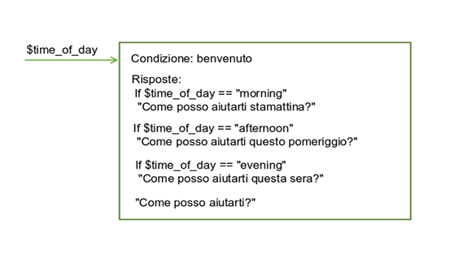
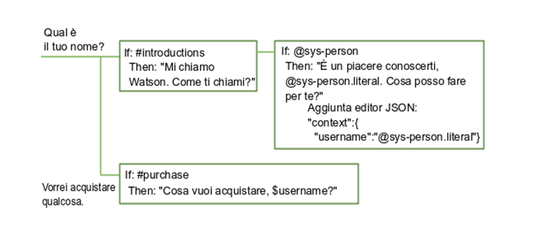
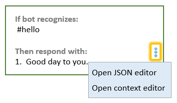
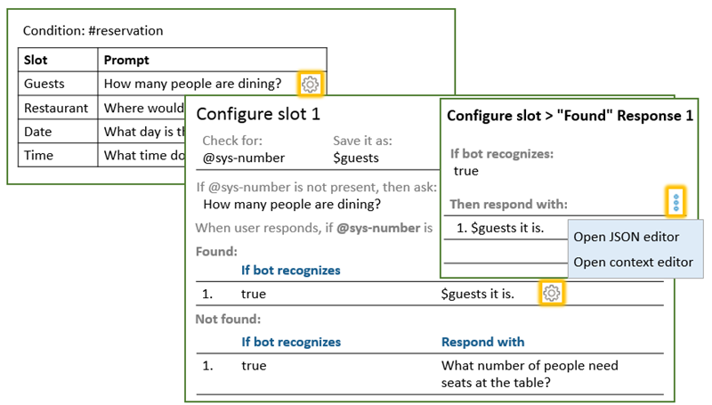

---

copyright:
  years: 2015, 2019
lastupdated: "2018-02-21"

subcollection: assistant

---

{:shortdesc: .shortdesc}
{:new_window: target="_blank"}
{:deprecated: .deprecated}
{:important: .important}
{:note: .note}
{:tip: .tip}
{:pre: .pre}
{:codeblock: .codeblock}
{:screen: .screen}
{:javascript: .ph data-hd-programlang='javascript'}
{:java: .ph data-hd-programlang='java'}
{:python: .ph data-hd-programlang='python'}
{:swift: .ph data-hd-programlang='swift'}
{:gif: data-image-type='gif'}

# Come viene elaborato il dialogo
{: #dialog-runtime}

Apprendi come il tuo dialogo viene elaborato quando una persona interagisce con l'istanza del servizio {{site.data.keyword.conversationshort}} distribuito nel runtime.
{: shortdesc}

## Anatomia di una chiamata di dialogo
{: #dialog-runtime-message-anatomy}

Ogni espressione utente viene passata al dialogo come una chiamata API /message. Ciò include le espressioni che gli utenti generano in risposta a richieste provenienti dal dialogo che richiedono loro ulteriori informazioni. Alcuni piani di sottoscrizione includono un numero di serie di chiamate API, in questo modo puoi comprendere cosa compone una chiamata. Una singola chiamata API /message equivale ad un singolo turno di dialogo che è composto da un input dell'utente e da una risposta corrispondente del dialogo.

Il corpo della richiesta della chiamata API /message e della risposta include i seguenti oggetti:

- `context`: contiene le variabili che devono essere conservate. Per passare le informazioni da una chiamata alla successiva, lo sviluppatore di applicazioni deve passare il contesto di risposta della chiamata API precedente con ogni chiamata API successiva. Ad esempio, il dialogo può raccogliere il nome dell'utente e quindi fare riferimento all'utente utilizzando il nome nei nodi successivi.

  ```json
  {
    "context" : {
      "user_name" : "<? @sys-person.literal ?>"
    }
  ```
  {: codeblock}

  Per ulteriori informazioni, vedi [Conservazione delle informazioni tra turni di dialogo](#dialog-runtime-context).

- `input`: la stringa di testo che è stata inoltrata dall'utente. La stringa di testo può contenere fino a 2.048 caratteri.

  ```json
  {
    "input": {
      "text" : "Where's your nearest store?"
    }
  ```
  {: codeblock}

- `output`: la risposta del dialogo da restituire all'utente.

  ```json
  {
  "output":{
    "generic":[
      {
        "values": [
          {
            "text": "This is my response text."
          }
        ],
        "response_type": "text",
        "selection_policy": "sequential"
      }
    ]
  }
  }
  ```
  {: codeblock}

Nella risposta /message API risultante, la risposta di testo viene formattata come segue:

```json
{
   "text": "This is my response text.",
   "response_type": "text"
}
```

Il seguente formato oggetto `output` è supportato per la compatibilità con le versioni precedenti. Gli spazi di lavoro che specificano una risposta di testo utilizzando questo formato, continueranno a funzionare correttamente. Con l'introduzione dei tipi di risposta esauriente, la struttura `output.text` è stata ampliata con la struttura `output.generic` per facilitare il supporto di altri tipi di risposte oltre a quella di testo. Utilizza il nuovo formato quando crei nuovi nodi per concederti una maggiore flessibilità, poiché, se necessario, puoi cambiare il tipo di risposta in un secondo momento.
{: note}

  ```json
  {
  "output":{
    "text": {
      "values": [
        "This is my response text."
      ]
    }
  }
  ```
  {: codeblock}

Ci sono tipi di risposta diversi da una risposta di testo che puoi definire. Per ulteriori dettagli, vedi [Risposte](/docs/services/assistant?topic=assistant-dialog-overview#dialog-overview-responses).

Puoi reperire ulteriori informazioni sulla chiamata API /message in [Riferimento API ](https://{DomainName}/apidocs/assistant-v2){: new_window}.

### Conservazione delle informazioni tra turni di dialogo
{: #dialog-runtime-context}

Il dialogo in una capacità di dialogo è privo di stato, il che significa che non conserva le informazioni da un'interazione con l'utente all'altra. Quando aggiungi una capacità di dialogo a un assistente e la distribuisci, l'assistente salva il contesto da una chiamata message e lo reinoltra alla richiesta successiva in tutta la sessione corrente. La sessione corrente dura fino a quando un utente interagisce con l'assistente e poi per un massimo di 60 minuti di inattività per i piani Plus o Premium (5 minuti per i piani Lite o Standard). Se non aggiungi una capacità di dialogo a un assistente, è tua responsabilità in quanto sviluppatore dell'applicazione personalizzata mantenere le informazioni aggiornate necessarie per l'applicazione. L'applicazione deve ricercare e memorizzare l'oggetto di contesto nella risposta API /message e passarlo nell'oggetto di contesto con la richiesta API /message successiva eseguita come parte del flusso della conversazione.

Un modo per conservare da solo le informazioni consiste nel memorizzare l'intero oggetto di contesto in memoria nell'applicazione cliente, in un browser web, ad esempio. Nel momento in cui un'applicazione diventa più complessa oppure se deve passare e memorizzare informazioni identificabili personalmente, puoi memorizzare e richiamare le informazioni da un database. Ovviamente, l'approccio più semplice è quello che ti impedisce proprio di dover memorizzare il contesto. Per implementare questo approccio, aggiungi la capacità di dialogo a un assistente e consentigli di tenerne traccia per conto tuo.

L'applicazione può passare le informazioni al dialogo e il dialogo può aggiornare queste informazioni e ritrasmetterle all'applicazione o a un nodo successivo. Il dialogo esegue tali operazioni utilizzando le *variabili di contesto*.

## Variabili di contesto
{: #dialog-runtime-context-variables}

Una variabile di contesto è una variabile che definisci in un nodo. Puoi specificare un valore predefinito per essa. Altri nodi, la logica di applicazione o l'input utente possono successivamente impostare o modificare il valore della variabile di contesto.

Puoi condizionare i valori delle variabili di contesto facendo riferimento a una variabile di contesto da una condizione del nodo di dialogo per determinare se eseguire un nodo. Puoi anche fare riferimento a una variabile di contesto dalle condizioni di risposta del nodo di dialogo per mostrare risposte diverse a seconda del valore fornito da un servizio esterno o dall'utente.

Ulteriori informazioni:

- [Passaggio del contesto dall'applicazione](#dialog-runtime-context-from-app)
- [Passaggio del contesto da un nodo all'altro](#dialog-runtime-context-node-to-node)
- [Definizione di una variabile di contesto](#dialog-runtime-context-var-define)
- [Attività comuni della variabile di contesto](#dialog-runtime-context-common-tasks)
- [Eliminazione di una variabile di contesto](#dialog-runtime-context-delete)
- [Aggiornamento di una variabile di contesto](#dialog-runtime-context-update)
- [Come vengono elaborate le variabili di contesto](#dialog-runtime-context-processing)
- [Ordine delle operazioni](#dialog-runtime-context-order-of-ops)
- [Aggiunta di variabili di contesto a un nodo con slot](#dialog-runtime-context-var-slots)

### Passaggio del contesto dall'applicazione
{: #dialog-runtime-context-from-app}

Passa le informazioni dall'applicazione al dialogo impostando una variabile di contesto e passando tale variabile al dialogo.

Ad esempio, la tua applicazione può impostare una variabile di contesto $time_of_day e passarla al dialogo che può utilizzare le informazioni per adattare il messaggio iniziale visualizzato all'utente.



In questo esempio, il dialogo sa che l'applicazione imposta la variabile su uno di questi valori: *morning*, *afternoon* o *evening*. Può controllare ogni valore e, a seconda del valore che è presente, restituisce il messaggio iniziale appropriato. Se la variabile non viene passata o se ha un valore che non corrisponde a uno dei valori previsti, all'utente viene visualizzato un messaggio iniziale più generico.

### Passaggio del contesto da un nodo all'altro
{: #dialog-runtime-context-node-to-node}

Il dialogo può anche aggiungere variabili di contesto per passare informazioni da un nodo all'altro o per aggiornare i valori delle variabili di contesto. Mentre il dialogo richiede e riceve informazioni dall'utente, può tenere traccia delle informazioni e farvi riferimento nel corso della conversazione.

Ad esempio, in un nodo potresti chiedere agli utenti il loro nome e in un nodo successivo rivolgerti a loro per nome.



In questo esempio, l'entità di sistema @sys-person viene utilizzata per estrarre il nome dell'utente dall'input,se l'utente ne fornisce uno. Nell'editor JSON, viene definita la variabile di contesto username e viene impostata sul valore @sys-person. In un nodo successivo, la variabile di contesto $username viene inclusa nella risposta per rivolgersi all'utente per nome.

### Definizione di una variabile di contesto
{: #dialog-runtime-context-var-define}

Definisci una variabile di contesto aggiungendo il nome della variabile al campo **Variabile** e aggiungendo un valore predefinito per essa nel campo **Valore** nella vista di modifica del nodo.

1.  Fai clic per aprire il nodo di dialogo a cui desideri aggiungere una variabile di contesto.

1.  Fai clic sull'icona **Opzioni**   associata alla risposta del nodo e poi fai clic su **Apri editor di contesto**.

      

      Se l'impostazione **Risposte multiple** è **Attivo** per il nodo, devi innanzitutto fare clic sull'icona **Modifica risposta**  per la risposta a cui desideri associare la variabile di contesto.

      

1.  Aggiungi la coppia nome e valore della variabile ai campi **Variabile** e **Valore**.

    - Il `name` può contenere caratteri alfabetici maiuscoli e minuscoli, caratteri numerici (0-9) e caratteri di sottolineatura.

      Nel nome puoi includere altri caratteri, come punti e trattini. Tuttavia, se li includi, devi specificare la sintassi abbreviata `$(variable-name)` ogni volta che successivamente fai riferimento alla variabile. Per ulteriori dettagli, vedi [Espressioni per l'accesso agli oggetti](/docs/services/assistant?topic=assistant-expression-language#expression-language-shorthand-context).
      {:tip}

    - Il `value` può essere qualsiasi tipo JSON supportato, come una variabile stringa semplice, un numero, un array JSON o un oggetto JSON.

La seguente tabella mostra alcuni esempi su come definire le coppie nome e valore per diversi tipi di valori:

| Variabile       | Valore                         | Tipo di valore |
|:---------------|-------------------------------|------------|
| dessert        | "cake"                        | Stringa     |
| age            | 18                            | Numero     |
| toppings_array | ["onions","olives"]            | Array JSON |
| full_name      | {"first":"John","last":"Doe"} | Oggetto JSON |

Per fare successivamente riferimento a queste variabili di contesto, utilizza la sintassi `$name` dove *name* è il nome della variabile di contesto che hai definito.

Ad esempio, potresti specificare la seguente espressione come risposta di dialogo:

`The customer, $age-year-old <? $full_name.first ?>, wants a pizza with <? $toppings_array.join(' and ') ?>, and then $dessert.`

L'output risultante viene visualizzato come segue:

`The customer, 18-year-old John, wants a pizza with onions and olives, and then cake.`

Puoi utilizzare l'editor JSON per definire anche le variabili di contesto. È possibile che tu preferisca utilizzare l'editor JSON se desideri aggiungere un'espressione complessa come valore della variabile. Per ulteriori dettagli, vedi [Variabili di contesto nell'editor JSON](#dialog-runtime-context-var-json).

### Attività comuni della variabile di contesto
{: #dialog-runtime-context-common-tasks}

Per memorizzare l'intera stringa fornita dall'utente come input, utilizza `input.text`:

| Variabile | Valore            |
|----------|------------------|
| repeat   | `<?input.text?>` |

Ad esempio, l'input utente è `I want to order a device.` Se la risposta del nodo è `You said: $repeat`, la risposta verrà visualizzata come `You said: I want to order a device.`

Per memorizzare il valore di un'entità in una variabile di contesto, utilizza questa sintassi:

| Variabile | Valore            |
|----------|------------------|
| place    | `@place`         |

Ad esempio, l'input utente è `I want to go to Paris.` Se la tua entità @place riconosce `Paris`, il servizio salva `Paris` nella variabile di contesto `$place`.

Per memorizzare il valore di una stringa che hai estratto dall'input dell'utente, puoi includere un'espressione SpEL che utilizza il metodo `extract` per applicare un'espressione regolare all'input utente. La seguente espressione estrae un numero dall'input utente e lo salva nella variabile di contesto `$number`.

| Variabile | Valore                               |
|----------|-------------------------------------|
| number   | `<?input.text.extract('[\d]+',0)?>` |

Per memorizzare il valore di un'entità modello, aggiungi .literal al nome entità. L'utilizzo di questa sintassi assicura che nella variabile venga memorizzata l'esatta parte di testo dell'input utente corrispondente al modello specificato.

| Variabile | Valore                  |
|----------|------------------------|
| email    | `<? @email.literal ?>` |

Ad esempio, l'input utente è `Contact me at joe@example.com.` La tua entità denominata `@email` riconosce il formato email `name@domain.com`. Configurando la variabile di contesto per memorizzare `@email.literal`, indichi che desideri memorizzare la parte dell'input che corrisponde al modello. Se ometti la proprietà `.literal` dall'espressione del valore, viene restituito il nome del valore di entità che hai specificato per il modello invece del segmento dell'input utente che corrisponde al modello.

Molti di questi esempi di valori utilizzano metodi per acquisire diverse parti dell'input utente. Per ulteriori informazioni sui metodi disponibili che puoi utilizzare, vedi [Metodi del linguaggio delle espressioni](/docs/services/assistant?topic=assistant-dialog-methods).

### Eliminazione di una variabile di contesto
{: #dialog-runtime-context-delete}

Per eliminare una variabile di contesto, imposta la variabile su null.

| Variabile   | Valore            |
|------------|------------------|
| order_form | `null`           |

In alternativa, puoi eliminare la variabile di contesto nella logica della tua applicazione. Per informazioni su come rimuovere interamente la variabile, vedi [Eliminazione di una variabile di contesto in JSON](#dialog-runtime-context-delete-json).

### Aggiornamento di un valore di variabile di contesto
{: #dialog-runtime-context-update}

Per aggiornare il valore di una variabile di contesto, definisci una variabile di contesto con lo stesso nome della variabile di contesto precedente ma, questa volta, specifica un valore diverso.

Quando più di un nodo imposta il valore della stessa variabile di contesto, il valore può cambiare nel corso di una conversazione con un utente. Quale valore viene applicato in un determinato momento dipende dal nodo che viene attivato dall'utente nel corso della conversazione. Il valore specificato per la variabile di contesto nell'ultimo nodo elaborato sovrascrive i valori impostati per la variabile dai nodi che sono stati elaborati in precedenza.

Per informazioni su come aggiornare il valore di una variabile di contesto quando il valore è un tipo di dati oggetto JSON o array JSON, vedi [Aggiornamento di un valore di variabile di contesto in JSON](#dialog-runtime-context-update-json)

### Come vengono elaborate le variabili di contesto
{: #dialog-runtime-context-processing}

È importante dove definisci la variabile di contesto. La variabile di contesto non viene creata e impostata sul valore che hai specificato per essa fino a quando il servizio non elabora la parte del nodo di dialogo in cui hai definito la variabile di contesto. Nella maggior parte dei casi, definisci la variabile di contesto come parte della risposta del nodo. Quando lo fai, la variabile di contesto viene creata e le viene assegnato il valore specificato quando il servizio restituisce la risposta del nodo.

Per un nodo con risposte condizionali, la variabile di contesto viene creata e impostata quando viene soddisfatta la condizione per una specifica risposta e tale risposta viene elaborata. Ad esempio, se definisci una variabile di contesto per la risposta condizionale #1 e il servizio elabora solo la risposta condizionale #2, la variabile di contesto che hai definito per la risposta condizionale #1 non viene creata e impostata.

Per informazioni su dove aggiungere le variabili di contesto che desideri che il servizio crei e imposti mentre un utente interagisce con un nodo con slot, vedi [Aggiunta di variabili di contesto a un nodo con slot](#dialog-runtime-context-var-slots).

### Ordine delle operazioni
{: #dialog-runtime-context-order-of-ops}

Quando definisce più variabili da elaborare insieme, l'ordine in cui le definisci non determina l'ordine in cui vengono dal servizio. Il servizio valuta le variabili in ordine casuale. Non impostare un valore nella prima variabile di contesto nell'elenco e sperare di riuscire a utilizzarlo nella seconda variabile nell'elenco, perché non vi è alcuna garanzia che la prima variabile di contesto verrà eseguita prima della seconda. Ad esempio, non utilizzare due variabili di contesto per implementare la logica che controlla che l'input utente contenga la parola `Yes`.

| Variabile        | Valore            |
|-----------------|------------------|
| user_input      | <? input.text ?> |
| contains_yes    | <? $user_input.contains('Yes') ?> |

Utilizza invece un'espressione leggermente più complessa per evitare di dover fare affidamento sul valore della prima variabile nel tuo elenco (user_input) che viene valutata prima della seconda variabile (contains_yes).

| Variabile      | Valore            |
|---------------|------------------|
| contains_yes  | <? input.text.contains('Yes') ?> |

### Aggiunta di variabili di contesto a un nodo con slot
{: #dialog-runtime-context-var-slots}

Per ulteriori informazioni, vedi [Raccolta di informazioni con gli slot](/docs/services/assistant?topic=assistant-dialog-slots).

1.  Apri il nodo con gli slot nella vista di modifica.

    - Per aggiungere una variabile di contesto che viene elaborata dopo aver soddisfatto una condizione di risposta per uno slot, esegui questi passi:

      1.  Fai clic sull'icona **Modifica slot** .
      1.  Fai clic sull'icona **Opzioni**  e quindi seleziona **Abilita risposte condizionali**.
      1.  Fai clic sull'icona **Modifica risposta**  accanto alla risposta a cui si desidera associare la variabile di contesto.
      1.  Fai clic sull'icona **Opzioni**  nella sezione e poi fai clic su **Apri editor di contesto**.
      1.  Aggiungi la coppia nome e valore della variabile ai campi **Variabile** e **Valore**.

      

    - Per aggiungere una variabile di contesto impostata o aggiornata una volta soddisfatta una condizione slot, completa questi passi:

      1.  Fai clic sull'icona **Modifica slot** .
      1.  Dal menu **Opzioni**  nell'intestazione della vista *Configura slot*, fai clic su **Apri editor JSON**.
      1.  Aggiungi la coppia nome e valore nel formato JSON.

          ```json
          {
            "time_of_day": "morning"
          }
          ```
          {: codeblock}

      Al momento non puoi utilizzare l'editor di contesto per definire le variabili di contesto impostate durante questa fase della valutazione del nodo di dialogo. Devi utilizzare invece l'editor JSON. Per ulteriori informazioni sull'utilizzo dell'editor JSON, vedi [Variabili di contesto nell'editor JSON](#dialog-runtime-context-var-json).
      {: note}

      

## Variabili di contesto nell'editor JSON
{: #dialog-runtime-context-var-json}

Puoi definire una variabile di contesto anche nell'editor JSON. Potresti voler utilizzare l'editor JSON se stai definendo una variabile di contesto complessa e desideri poter vedere l'espressione SpEL completa mentre la aggiungi o la modifichi.

La coppia nome e valore deve soddisfare questi requisiti:

- Il `name` può contenere caratteri alfabetici maiuscoli e minuscoli, caratteri numerici (0-9) e caratteri di sottolineatura.

  Puoi includere altri caratteri nel nome, ad esempio punti e trattini. Tuttavia, se li includi, devi specificare la sintassi abbreviata `$(variable-name)` ogni volta che successivamente fai riferimento alla variabile. Per ulteriori dettagli, vedi [Espressioni per l'accesso agli oggetti](/docs/services/assistant?topic=assistant-expression-language#expression-lanaguage-shorthand-context).
  {:tip}

- Il `value` può essere qualsiasi tipo JSON supportato, come una variabile stringa semplice, un numero, un array JSON o un oggetto JSON.

Il seguente esempio JSON definisce i valori per le variabili di contesto stringa $dessert, array $toppings_array, numero $age e oggetto $full_name:

```json
{
  "context": {
    "dessert": "cake",
    "toppings_array": [
      "onions",
      "olives"
    ],
    "age": 18,
    "full_name": {
      "first": "Jane",
      "last": "Doe"
    }
  },
        "output": {}
      }
```
{: codeblock}

Per definire una variabile di contesto in formato JSON, completa i seguenti passi: 

1.  Fai clic per aprire il nodo di dialogo a cui desideri aggiungere la variabile di contesto. 

    I valori della variabile di contesto esistenti definiti per questo nodo vengono visualizzati in una serie di campi **Variabile** e **Valore** corrispondenti. Se non desideri che vengano visualizzati nella vista di modifica del nodo, devi chiudere l'editor di contesto. Puoi chiudere l'editor dallo stesso menu che hai utilizzato per aprire l'editor JSON; la procedura riportata di seguito descrive come accedere al menu.
    {: note}

1.  Fai clic sull'icona **Opzioni**   associata alla risposta e poi fai clic su **Apri editor JSON**.

    

    Se l'impostazione **Risposte multiple** è **Attivo** per il nodo, devi innanzitutto fare clic sull'icona **Modifica risposta**  per la risposta a cui desideri associare la variabile di contesto.

    

1.  Aggiungi un blocco `"context":{}` se non è presente.

    ```json
    {
      "context":{},
      "output":{}
    }
    ```
    {: codeblock}

1.  Nel blocco di contesto, aggiungi una coppia `"name"` e `"value"` per ogni variabile di contesto che desideri definire. 

    ```json
    {
      "context":{
        "name": "value"
    },
        "output": {}
      }
    ```
    {: codeblock}

    In questo esempio, una variabile denominata `new_variable` viene aggiunta ad un blocco di contesto che contiene già una variabile.

    ```json
    {
      "context":{
        "existing_variable": "value",
        "new_variable":"value"
      }
    }
    ```
    {: codeblock}

    Per fare successivamente riferimento alla variabile di contesto, utilizza la sintassi `$name` dove *name* è il nome della variabile di contesto che hai definito. Ad esempio, `$new_variable`.

Ulteriori informazioni:

- [Eliminazione di una variabile di contesto in JSON](#dialog-runtime-context-delete-json)
- [Aggiornamento del valore di una variabile di contesto in JSON](#dialog-runtime-context-update-json)
- [Impostazione di una variabile di contesto uguale a un'altra](#dialog-runtime-var-equals-var)

### Eliminazione di una variabile di contesto in JSON
{: #dialog-runtime-context-delete-json}

Per eliminare una variabile di contesto, imposta la variabile su null.

```json
{
  "context": {
    "order_form": null
  }
}
```
{: codeblock}

Se desideri rimuovere tutta la traccia della variabile di contesto, puoi utilizzare il metodo JSONObject.remove(string) per eliminarla dall'oggetto di contesto. Tuttavia, devi utilizzare una variabile per eseguire la rimozione. Definisci la nuova variabile nell'output del messaggio in modo tale che non venga salvata oltre la chiamata corrente.

```json
{
  "output":{
    "text" : {},
    "deleted_variable" : "<? context.remove('order_form') ?>"
  }
}
```
{: codeblock}

In alternativa, puoi eliminare la variabile di contesto nella logica della tua applicazione.

### Aggiornamento del valore di una variabile di contesto in JSON
{: #dialog-runtime-context-update-json}

In generale, se un nodo imposta il valore di una variabile di contesto già impostata, il valore precedente viene sovrascritto dal nuovo valore. 

#### Aggiornamento di un oggetto JSON complesso

I valori precedenti vengono sovrascritti per tutti i tipi JSON tranne che per un oggetto JSON. Se la variabile di contesto è un tipo complesso come un oggetto JSON, viene utilizzata una procedura di unione JSON per aggiornare la variabile. L'operazione di unione aggiunge qualsiasi proprietà appena definita e sovrascrive tutte le proprietà esistenti dell'oggetto

In questo esempio, una variabile di contesto di nome è definita come un oggetto complesso.

```json
{
  "context": {
    "complex_object": {
      "user_firstname" : "Paul",
      "user_lastname" : "Pan",
      "has_card" : false
    }
  }
}
```
{: codeblock}

Un nodo di dialogo aggiorna l'oggetto JSON della variabile di contesto con i seguenti valori:

```json
{
  "complex_object": {
    "user_firstname": "Peter",
    "has_card": true
  }
}
```
{: codeblock}

Il risultato è il seguente contesto:

```json
{
  "complex_object": {
    "user_firstname": "Peter",
    "user_lastname": "Pan",
    "has_card": true
  }
}
```
{: codeblock}

Vedi [Metodi del linguaggio delle espressioni](/docs/services/assistant?topic=assistant-dialog-methods#dialog-methods-objects) per ulteriori informazioni sui metodi che puoi eseguire sugli oggetti.

#### Aggiornamento di array

Se i tuoi dati di contesto del dialogo contengono un array di valori, puoi aggiornare l'array aggiungendo valori, rimuovendo un valore o sostituendo tutti i valori.

Per aggiornare l'array, scegli una delle seguenti azioni. In ogni caso, vedremo l'array prima dell'azione, l'azione e l'array dopo che l'azione è stata applicata.

- **Aggiungi**: per aggiungere valori alla fine di un array, utilizza il metodo `append`.

    Per questo contesto di runtime di dialogo:

    ```json
    {
      "context": {
        "toppings_array": ["onion", "olives"]
      }
    }
    ```
    {: codeblock}

    Effettua questo aggiornamento:

    ```json
    {
      "context": {
        "toppings_array": "<? $toppings_array.append('ketchup', 'tomatoes') ?>"
      }
    }
    ```
    {: codeblock}

    Risultato:

    ```json
    {
      "context": {
        "toppings_array": ["onion", "olives", "ketchup", "tomatoes"]
      }
    }
    ```
    {: codeblock}

- **Rimuovi**: per rimuovere un elemento, utilizza il metodo `remove` e specifica il suo valore o la sua posizione nell'array.

    - **Rimuovi per valore**: rimuove un elemento da un array in base al suo valore.

        Per questo contesto di runtime di dialogo:

        ```json
        {
          "context": {
            "toppings_array": ["onion", "olives"]
          }
        }
        ```
        {: codeblock}

        Effettua questo aggiornamento:

        ```json
        {
          "context": {
            "toppings_array": "<? $toppings_array.removeValue('onion') ?>"
          }
        }
        ```
        {: codeblock}

        Risultato:

        ```json
        {
          "context": {
            "toppings_array": ["olives"]
          }
        }
        ```
        {: codeblock}

    - **Rimuovi per posizione**: rimozione di un elemento da un array in base alla sua posizione nell'indice.

        Per questo contesto di runtime di dialogo:

        ```json
        {
          "context": {
            "toppings_array": ["onion", "olives"]
          }
        }
        ```
        {: codeblock}

        Effettua questo aggiornamento:

        ```json
        {
          "context": {
            "toppings_array": "<? $toppings_array.remove(0) ?>"
          }
        }
        ```
        {: codeblock}

        Risultato:

        ```json
        {
          "context": {
            "toppings_array": ["olives"]
          }
        }
        ```
        {: codeblock}

- **Sovrascrivi**: per sovrascrivere i valori in un array, imposta semplicemente l'array sui nuovi valori:

    Per questo contesto di runtime di dialogo:

        ```json
        {
          "context": {
            "toppings_array": ["onion", "olives"]
          }
        }
        ```
        {: codeblock}

    Effettua questo aggiornamento:

        ```json
        {
          "context": {
            "toppings_array": ["ketchup", "tomatoes"]
          }
        }
        ```
        {: codeblock}

    Risultato:

        ```json
        {
          "context": {
            "toppings_array": ["ketchup", "tomatoes"]
          }
        }
        ```
        {: codeblock}

Vedi [Metodi del linguaggio delle espressioni](/docs/services/assistant?topic=assistant-dialog-methods#dialog-methods-arrays) per ulteriori informazioni sui metodi che puoi eseguire sugli array.

### Impostazione di una variabile di contesto uguale a un'altra
{: #dialog-runtime-var-equals-var}

Quando imposti una variabile di contesto uguale a un'altra, devi definire un puntatore dall'una all'altra. Se successivamente il valore di una delle variabili cambia, anche il valore dell'altra variabile cambierà. 

Ad esempio, se specifichi una variabile di contesto come segue, quando, successivamente, il valore di `$var1` o `$var2` cambia, cambierà anche il valore dell'altra. 

| Variabile  | Valore  |
|-----------|--------|
| var2      | var1   |

Non impostare una variabile uguale a un'altra per acquisire un punto nel valore di riferimento temporale. Quando si tratta di array, ad esempio, se desideri acquisire un valore di array memorizzato in una variabile di contesto in un determinato momento nel dialogo per salvarlo per un uso successivo, puoi creare invece una nuova variabile basata sul valore corrente della variabile.

Ad esempio, per creare una copia dei valori di un array in un determinato momento del flusso di dialogo, aggiungi un nuovo array che viene popolato con i valori dell'array esistente. Per eseguire tale operazione, puoi utilizzare la seguente sintassi: 

```json
{
"context": {
   "var2": "<? output.var2?:new JsonArray().append($var1) ?>"
 }
 }
 ```
{: codeblock}

## Digressioni
{: #dialog-runtime-digressions}

Una digressione si verifica quando un utente si trova in un flusso del dialogo progettato per realizzare un obiettivo e inaspettatamente passa ad argomenti che iniziano un flusso di dialogo che è progettato per realizzare un obiettivo diverso. Il dialogo ha sempre supportato la capacità dell'utente di cambiare argomento. Se nessuno dei nodi nel ramo di dialogo elaborato corrisponde all'obiettivo dell'ultimo input dell'utente, la conversazione torna alla struttura ad albero per controllare le condizioni del nodo root alla ricerca di una corrispondenza appropriata. Le impostazioni di digressione disponibili per il nodo ti forniscono la capacità di personalizzare ancora di più questo comportamento.

Con le impostazioni di digressione, puoi consentire il ritorno della conversazione al flusso di dialogo che è stato interrotto quando si è verificata la digressione. Ad esempio, è possibile che l'utente stia ordinando un nuovo telefono ma passi agli argomenti per richiedere i tablet. Il tuo dialogo può rispondere alla domanda sui tablet e quindi riportare l'utente al punto in cui si trovava nel processo di ordinazione di un telefono. Consentire le digressioni e poi poter tornare indietro fornisce ai tuoi utenti un maggiore controllo sul flusso della conversazione nel runtime. Possono cambiare gli argomenti, seguire un flusso di dialogo su un argomento non correlato al loro obiettivo e poi ritornare al punto in cui si trovavano prima. Il risultato è un flusso di dialogo che simula più strettamente una conversazione tra persone.

{: gif}

L'immagine animata utilizza un mockup dell'interfaccia utente della struttura ad albero di dialogo per illustrare il concetto di digressione. Mostra come un utente interagisce con i nodi di dialogo configurati per consentire le digressioni che ritornano al flusso di dialogo che era in corso. L'utente inizia a fornire le informazioni necessarie per prenotare una cena. Mentre sta riempiendo gli slot nel nodo #reservation, l'utente pone una domanda sulle opzioni per il menu vegetariano. Il dialogo risponde alla nuova domanda dell'utente trovando un nodo che lo indirizza tra i nodi root (un nodo che condiziona l'intento #cuisine). Ritorna quindi alla conversazione che era in corso mostrando la richiesta del successivo slot vuoto proveniente dal nodo di dialogo originale.

Guarda questo video per ulteriori informazioni. 

<iframe class="embed-responsive-item" id="youtubeplayer" title="Panoramica delle digressioni" type="text/html" width="640" height="390" src="https://www.youtube.com/embed/I3K7mQ46K3o?rel=0" frameborder="0" webkitallowfullscreen mozallowfullscreen allowfullscreen> </iframe>

- [Prima di iniziare](#dialog-runtime-digression-prereqs)
- [Personalizzazione delle digressioni](#dialog-runtime-enable-digressions)
- [Suggerimenti sull'utilizzo delle digressioni](#dialog-runtime-digress-tips)
- [Disabilitazione delle digressioni in un nodo root](#dialog-runtime-disable-digressions)
- [Esercitazione sulle digressioni](#dialog-runtime-digression-tutorial)
- [Considerazioni sulla progettazione](#dialog-runtime-digression-design-considerations)

### Prima di iniziare
{: #dialog-runtime-digression-prereqs}

Mentre verifichi l'intero dialogo, decidi quando e dove consentire le digressioni ed il ritorno dalle digressioni. I controlli di digressione riportati di seguito vengono applicati automaticamente ai nodi. Intervieni solo se desideri modificare questo comportamento predefinito.

- Ogni nodo root nel dialogo è configurato per consentire alle digressioni di farne la loro destinazione per impostazione predefinita. I nodi figlio non possono essere la destinazione di una digressione.
- I nodi con slot sono configurati per impedire la generazione di digressioni. Tutti gli altri nodi sono configurati per consentire le digressioni. Tuttavia, la conversazione non consente la generazione di una digressione da un nodo nelle seguenti circostanze:

  - Se uno qualsiasi dei nodi figlio del nodo corrente contiene la condizione `anything_else` o `true`

    Queste condizioni sono speciali in quanto vengono sempre valutate come true. A causa del loro comportamento noto, spesso vengono utilizzate nei dialoghi per forzare un nodo padre a valutare uno specifico nodo figlio in successione. Per impedire l'interruzione della logica del flusso di dialogo esistente, le digressioni non sono consentite in questo caso. Prima di poter consentire la generazione di digressioni su un nodo di questo tipo, devi modificare la condizione del nodo figlio con un altro valore.

  - Se il nodo è configurato per passare ad un altro nodo o per ignorare l'input utente dopo averlo elaborato

    La sezione del passo finale di un nodo specifica le operazioni che devono essere eseguite una volta elaborato il nodo. Quando il dialogo è configurato per passare direttamente ad un altro nodo, spesso è per garantire che venga seguita una sequenza specifica. E quando il nodo è configurato per ignorare l'input utente, equivale a forzare il dialogo ad elaborare il primo nodo figlio dopo il nodo corrente in successione. Per impedire l'interruzione della logica del flusso di dialogo esistente, le digressioni non sono consentite in nessun caso. Prima di poter consentire la generazione delle digressioni da questo nodo, devi modificare il valore specificato nella sezione del passo finale.

### Personalizzazione delle digressioni
{: #dialog-runtime-enable-digressions}

Non devi definire l'inizio e la fine di una digressione. L'utente ha il pieno controllo del flusso di digressione nel runtime. Devi solo specificare in che modo ciascun nodo deve partecipare o meno in una digressione guidata dall'utente. Per ciascun nodo, configura se:

- una digressione può iniziare dal nodo e lasciarlo
- una digressione che inizia altrove può essere indirizzata ed entrare nel nodo
- una digressione che inizia altrove ed entra nel nodo deve ritornare al flusso di dialogo interrotto una volta completato il flusso di dialogo corrente

Per modificare il comportamento di un singolo nodo, completa la seguente procedura:

1.  Fai clic sul nodo per aprirne la vista di modifica.

1.  Fai clic su **Personalizza** e quindi fai clic sulla scheda **Digressioni**.

    Le opzioni di configurazione sono diverse a seconda del fatto che il nodo che stai modificando sia un nodo root, un nodo figlio, un nodo con figli o un nodo con slot.

    **Generazione di digressioni da questo nodo**

    Se le circostanze elencate in precedenza non si applicano, puoi effettuare le seguenti scelte:

    - **Tutti i tipi di nodo**: scegli se permettere agli utenti di consentire la generazione di una digressione dal nodo corrente prima che raggiungano la fine del ramo di dialogo corrente.

    - **Tutti i nodi che hanno figli**: scegli se desideri che la conversazione torni al nodo corrente dopo una digressione se la risposta del nodo corrente è stata già visualizzata e i suoi nodi figlio sono connessi all'obiettivo di un nodo. Imposta l'interruttore *Consenti il ritorno dalle digressioni attivate dopo questa risposta del nodo* su **No** per impedire al dialogo di tornare al nodo corrente e continuare a elaborare il suo ramo.

      Ad esempio, se l'utente chiede `Vendi cupcake?` e viene visualizzata la risposta `Abbiamo cupcake di tutti i tipi e dimensioni` prima che l'utente cambi argomento, potresti volere che il dialogo non torni al punto in cui aveva lasciato. In special modo, se i nodi figlio fanno fronte solo a possibili domande di follow-up provenienti dall'utente e possono essere tranquillamente ignorati.

      Tuttavia, se il nodo si basa sui nodi figlio per far fronte alla domanda, potresti voler forzare la conversazione a ritornare e a proseguire l'elaborazione dei nodi nel ramo corrente. Ad esempio, la risposta iniziale potrebbe essere `Abbiamo cupcake di tutte le forme e dimensioni. Quale menu vuoi vedere: senza glutine, senza lattosio o normale?` Se l'utente cambia argomento a questo punto, potresti volere che il dialogo ritorni in modo che l'utente possa scegliere un tipo di menu e acquisire le informazioni desiderate.

    - **Nodi con slot**: scegli se desideri consentire agli utenti di generare digressioni dal nodo prima che vengano riempiti tutti gli slot. Imposta l'interruttore *Consenti la generazione di digressioni durante il riempimento dello slot* su **Sì** per consentire la generazione di digressioni.

      Se abilitato, quando la conversazione ritorna dalla digressione, viene visualizzata la richiesta per lo slot non riempito successivo per incoraggiare l'utente a continuare a fornire le informazioni. Se disabilitato, qualsiasi input inoltrato dall'utente che non contiene un valore che può riempire lo slot verrà ignorato. Tuttavia, puoi far fronte a domande non richieste, che sai che i tuoi utenti potrebbero porre mentre interagiscono con il nodo, definendo i gestori slot. Per ulteriori informazioni, vedi [Aggiunta di slot](/docs/services/assistant?topic=assistant-dialog-slots#dialog-slots-add).

      La seguente immagine mostra come viene configurata la generazione delle digressioni dal nodo #reservation con gli slot (mostrato nella precedente immagine).

      

    - **Nodi con slot**: scegli se l'utente può generare le digressioni solo nel caso in cui ritorni al nodo corrente selezionando la casella di spunta **Consenti digressione dagli slot ai nodi che consentono il ritorno**.

      Quando selezionato, mentre il dialogo ricerca un nodo per rispondere ad una domanda non correlata dell'utente, ignora i nodi root che non sono configurati per il ritorno dopo la digressione. Seleziona questa casella di spunta se desideri impedire agli utenti di poter lasciare in modo permanente il nodo prima che abbiano terminato il completamento degli slot richiesti.

    **Digressioni in questo nodo**

    Puoi effettuare le seguenti scelte sul comportamento delle digressioni in un nodo:

    - Impedisci agli utenti di generare digressioni nel nodo. Per ulteriori dettagli, vedi [Disabilitazione delle digressioni in un nodo root](#dialog-runtime-disable-digressions).

    - Quando le digressioni nel nodo sono abilitate, scegli se il dialogo deve tornare al flusso di dialogo da cui è stata generata la digressione. Quando selezionato, una volta elaborato il ramo del nodo corrente, il flusso di dialogo torna al nodo interrotto. Per fare in modo che il dialogo ritorni successivamente, seleziona **Ritorna dopo la digressione**.

    La seguente immagine mostra in che modo vengono configurate le digressioni nel nodo #cuisine (mostrato nella precedente immagine).

    

1.  Fai clic su **Applica**.

1.  Utilizza il riquadro "Provalo" per verificare il comportamento della digressione.

    Di nuovo, non puoi definire l'inizio e la fine di una digressione. L'utente controlla dove e quando si verificano le digressioni. Puoi solo applicare le impostazioni che determinano come un singolo nodo partecipa ad una di esse. Poiché le digressioni sono così imprevedibili, è difficile sapere in che modo le tue decisioni di configurazione influiranno sulla conversazione generale. Per vedere effettivamente l'impatto delle scelte effettuate, devi verificare il dialogo.

I nodi #reservation e #cuisine rappresentano due rami del dialogo che possono partecipare a una singola digressione diretta dall'utente. Le impostazioni di digressione configurate per ciascun singolo nodo costituiscono ciò che rende possibile questo tipo di digressione nel runtime.


### Suggerimenti sull'utilizzo delle digressioni
{: #dialog-runtime-digress-tips}

Questa sezione descrive soluzioni a situazioni che potresti riscontrare quando utilizzi le digressioni.

- **Messaggio di ritorno personalizzato**: per i nodi a cui puoi ritornare dalla generazione di digressioni, prendi in considerazione di aggiungere del testo che consenta agli utenti di sapere che stanno tornando nel punto in cui si erano fermati in un flusso di dialogo precedente. Nel tuo testo di risposta, utilizza una sintassi speciale che ti consenta di aggiungere due versioni della risposta. 

  Se non esegui azioni, lo stesso testo di risposta verrà visualizzato una seconda volta per far sapere agli utenti che stanno ritornando al nodo da cui hanno generato la digressione. Puoi rendere più chiaro agli utenti che sono ritornati al thread di conversazione originale specificando un messaggio univoco che verrà visualizzato al momento del loro ritorno. 

  Ad esempio, se la risposta di testo originale per il nodo è `What's the order number?`, potresti voler visualizzare un messaggio come `Now let's get back to where we left off. What is the order number?` quando gli utenti ritornano al nodo. 

  Per eseguire tale operazione, utilizza la seguente sintassi per specificare la risposta di testo del nodo: 

  `<? (returning_from_digression)? "post-digression message" : "first-time message" ?>`

  Ad esempio:

  ```bash
  <? (returning_from_digression)? "Now, let's get back to where we left off.
  What is the order number?" : "What's the order number?" ?>
  ```
  {: codeblock}

  Non puoi includere espressioni SpEL o la sintassi abbreviata nelle risposte di testo che aggiungi. In effetti, non puoi proprio utilizzare la sintassi abbreviata. Al contrario, devi creare il messaggio concatenando le stringhe di testo e la sintassi dell'espressione SpEL completa per formare la risposta completa.
  {: note}
  
  Ad esempio, utilizza la seguente sintassi per includere una variabile di contesto in una risposta di testo che normalmente specificheresti come `What can I do for you, $username?`:

  ```bash
  <? (returning_from_digression)? "Where were we, " +
  context["username"] + "? Oh right, I was asking what can I do
  for you today." : "What can I do for you today, " +
  context["username"] + "?" ?>
  ```

  Per dettagli sulla sintassi dell'espressione SpEL completa, vedi [Espressione per l'accesso agli oggetti](/docs/services/assistant?topic=assistant-expression-language#expression-language-shorthand-syntax).

- **Blocco dei ritorni**: in alcuni casi, potresti voler impedire un ritorno a un flusso di conversazione interrotto in base a una scelta fatta dall'utente nel flusso di dialogo corrente. Puoi utilizzare la sintassi speciale per impedire un ritorno da un nodo specifico. 

  Ad esempio, potresti avere un nodo che condiziona `#General_Connect_To_Agent` o un intento simile. Quando viene attivato, se desideri la conferma degli utenti prima di trasferirli a un servizio esterno, potresti aggiungere una risposta come `Do you want me to transfer you to an agent now?` Puoi aggiungere poi due nodi figlio che condizionino rispettivamente `#yes` e `#no`.
  
  Il modo migliore per gestire le digressioni per questo tipo di ramo consiste nell'impostare il nodo root per consentire il ritorno dalla digressione. Tuttavia, nel nodo `#yes`, includi l'espressione SpEL `<? clearDialogStack() ?>` nella risposta. Ad esempio:
  
    ```bash
  OK. I will transfer you now. <? clearDialogStack() ?>
  ```
  {: codeblock}

  Questa espressione SpEL impedisce il ritorno dalla digressione da questo nodo. Quando viene richiesta una conferma, se l'utente risponde affermativamente, viene visualizzata la risposta appropriata e il flusso di dialogo che è stato interrotto non viene ripreso. Se l'utente risponde negativamente, viene riportato al flusso che è stato interrotto.

### Disabilitazione delle digressioni in un nodo root
{: #dialog-runtime-disable-digressions}

Quando viene generata la digressione di un flusso in un nodo root, segue il corso del dialogo configurato per tale nodo. Pertanto, potrebbe elaborare una serie di nodi figlio prima di raggiungere la fine del ramo del nodo e quindi, se configurato per effettuare ciò, torna al flusso di dialogo che è stato interrotto. Attraverso il test del dialogo, puoi scoprire che un nodo root viene attivato troppo spesso o in momenti inaspettati oppure che il suo dialogo è troppo complesso e porta l'utente troppo lontano dall'essere un buon candidato per una digressione temporanea. Se stabilisci che preferisci non consentire agli utenti di eseguire digressioni in esso, puoi configurare il nodo root in modo da non consentire digressioni.

Per disabilitare completamente le digressioni in un nodo root, completa la seguente procedura:

1.  Fai clic per aprire il nodo root che desideri modificare.
1.  Fai clic su **Personalizza** e poi fai clic sulla scheda **Digressioni**.
1.  Imposta l'interruttore *Consenti digressioni in questo nodo* su **Disattivo**.
1.  Fai clic su **Applica**.

Se decidi che vuoi impedire le digressioni in diversi nodi root, ma non vuoi modificare ciascun nodo singolarmente, puoi aggiungere i nodi a una cartella. Dalla pagina *Personalizza* della cartella, puoi impostare l'interruttore *Consenti digressioni in questo nodo* su **Disattivo** per applicare la configurazione a tutti i nodi contemporaneamente. Per ulteriori informazioni, vedi [Organizzazione del dialogo utilizzando le cartelle](/docs/services/assistant?topic=assistant-dialog-build#dialog-build-folders).

### Esercitazione sulle digressioni
{: #dialog-runtime-digression-tutorial}

Segui la sezione di [esercitazione](/docs/services/assistant?topic=assistant-tutorial-digressions) per importare uno spazio di lavoro che ha già una serie di nodi definita. Puoi affrontare alcuni esercizi che illustrano il funzionamento delle digressioni.

### Considerazioni di progettazione
{: #dialog-runtime-digression-design-considerations}

- **Evita l'aumento del nodo di fallback**: molti designer del dialogo includono un nodo con una condizione `true` o `anything_else` alla fine di ogni ramo del dialogo come un modo per impedire agli utenti di rimanere bloccati nel ramo. Questa progettazione restituisce un messaggio generico se l'input utente non corrisponde a nessun elemento che hai anticipato e incluso come indirizzato a un nodo di dialogo specifico. Tuttavia, gli utenti non possono generare le digressioni dai flussi di dialogo che utilizzano questo approccio.

  Valuta i rami che utilizzano questo approccio per stabilire se sarebbe meglio consentire la generazione di digressioni dal ramo. Se l'input dell'utente non corrisponde a nessun elemento che hai anticipato, potrebbe trovare una corrispondenza in un flusso di dialogo completamente diverso nella tua struttura ad albero. Invece di rispondere con un messaggio generico, puoi utilizzare efficacemente il resto del dialogo per cercare di indirizzare l'input utente. E il nodo a livello root `Altro` può rispondere sempre all'input che nessuno degli altri nodi root può affrontare.

- **Riconsidera i passaggi a un nodo di chiusura**: molti dialoghi sono progettati per porre una domanda di chiusura standard, ad esempio `Ho risposto alle tue domande oggi?`. Gli utenti non possono generare digressioni dai nodi che sono configurati per passare a un altro nodo. Pertanto, se configuri tutti i tuoi nodi finali del ramo in modo che passino a un nodo di chiusura comune, le digressioni non potranno verificarsi. Prendi in considerazione di tracciare la soddisfazione dell'utente attraverso metriche o in altri modi.

- **Verifica le possibili catene di digressioni**: se un utente genera le digressioni dal nodo corrente a un altro nodo che consente la generazione di digressioni, l'utente potrebbe potenzialmente generare digressioni da questo altro nodo e ripetere di nuovo questo modello una o più volte. Se il nodo di partenza nella catena di digressioni è configurato per ritornare dopo la digressione, l'utente, alla fine, verrà riportato al nodo di dialogo corrente. In effetti, i nodi successivi nella catena che sono configurati per non farvi ritorno, vengono esclusi dall'essere considerati come destinazioni della digressione. Verifica gli scenari che generano più volte le digressioni per stabilire se i singoli nodi funzionano come previsto.

- **Ricorda che il nodo corrente ha la priorità**: ricorda che i nodi al di fuori del flusso corrente vengono considerati come destinazioni della digressione solo se il flusso corrente non può far fronte all'input utente. In particolare, è ancora più importante, in un nodo con slot che consentono la generazione di digressioni, chiarire agli utenti quali sono le informazioni che devono fornire e aggiungere le istruzioni di conferma che verranno visualizzate una volta che l'utente fornisce un valore.

  Durante il processo di riempimento dello slot può essere riempito qualsiasi slot. Pertanto, uno slot potrebbe acquisire input utente non previsto. Ad esempio, potresti avere un nodo con slot che raccoglie le informazioni necessarie per prenotare una cena. Uno degli slot raccoglie le informazioni sulla data. Mentre vengono forniti i dettagli della prenotazione, l'utente potrebbe chiedere `Come sarà il tempo domani?` Potresti avere un nodo root che genera condizioni su #forecast che potrebbe rispondere all'utente. Tuttavia, poiché l'input dell'utente include la parola `domani` e il nodo di prenotazione con slot è in fase di elaborazione, il servizio presuppone che l'utente stia invece fornendo o aggiornando la data di prenotazione. *Il nodo corrente ha sempre la priorità.* Se definisci un'istruzione di conferma chiara, ad esempio `Ok, la data di prenotazione è domani,` è più probabile che l'utente si renda conto che si è verificato un fraintendimento e che lo risolva.

  In caso contrario, mentre vengono riempiti gli slot, se l'utente fornisce un valore non previsto da nessuno degli slot, è possibile che corrisponda ad un nodo root completamente non correlato per cui l'utente non ha mai avuto intenzione di generare una digressione.

  Assicurati di eseguire molti test mentre configuri il comportamento della digressione.

- **Quando utilizzare le digressioni al posto dei gestori slot**: per domande generali che gli utenti potrebbero porre in qualsiasi momento, utilizza un nodo root che consenta digressioni, elabori l'input e poi torni al flusso che era in corso. Per i nodi con slot, prova ad anticipare i tipi di domande correlate che gli utenti potrebbero voler porre mentre vengono riempiti gli slot e indirizzali aggiungendo i gestori al nodo.

  Ad esempio, se il nodo con slot raccoglie le informazioni necessarie per compilare una richiesta di indennizzo assicurativo, potresti voler aggiungere i gestori che fanno fronte alle domande relative all'assicurazione. Tuttavia, per domande su come ottenere supporto oppure le posizioni dei negozi oppure la storia della tua azienda, utilizza un nodo a livello di root.

## Disambiguazione 
{: #dialog-runtime-disambiguation}

Questa funzione è disponibile solo per gli utenti Plus o Premium.
{: tip}

Quando abiliti la disambiguazione, indichi all'utente di chiedere aiuto agli utenti quando trova più di un nodo di dialogo che può rispondere al loro input. Invece di indovinare quale nodo elaborare, il tuo assistente condivide un elenco delle opzioni nodo principali con l'utente e gli chiede di scegliere quella corretta.


Se abilitata, la disambiguazione non viene attivata a meno che non vengano soddisfatte le seguenti condizioni:

- Il punteggio di affidabilità di uno o più intenti secondari rilevati nell'input utente è superiore al 55% del punteggio di affidabilità dell'intento principale.
- Il punteggio di affidabilità dell'intento principale supera il valore 0,2.

Anche quando queste condizioni vengono soddisfatte, la disambiguazione non si verifica a meno che due o più nodi indipendenti nel tuo dialogo non soddisfino i seguenti criteri:

- La condizione del nodo include uno degli intenti che hanno attivato la disambiguazione. Oppure se la condizione del nodo viene valutata come true. Ad esempio, se il nodo controlla il tipo di entità e l'entità viene citata nell'input utente, è idoneo.
- È presente del testo nel campo *nome nodo esterno* del nodo.

Ulteriori informazioni

- [Esempio di disambiguazione](#dialog-runtime-disambig-example)
- [Abilitazione della disambiguazione](#dialog-runtime-disambig-enable)
- [Scelta dei nodi](#dialog-runtime-choose-nodes)
- [Gestione di Nessuno dei precedenti](#dialog-runtime-handle-none)
- [Verifica della disambiguazione](#dialog-runtime-disambig-test)

### Esempio di disambiguazione
{: #dialog-runtime-disambig-example}

Ad esempio, hai un dialogo tra due nodi con condizioni di intento che si occupano delle richieste di annullamento. Le condizioni sono:

- eCommerce_Cancel_Product_Order
- Customer_Care_Cancel_Account

Se l'input utente è `i must cancel it today`, nell'input potrebbero essere rilevati i seguenti intenti:

`[`
`{"intent":"Customer_Care_Cancel_Account","confidence":0.6618281841278076},`
`{"intent":"eCommerce_Cancel_Product_Order","confidence":0.4330700159072876},`
`{"intent":"Customer_Care_Appointments","confidence":0.2902342438697815},`
`{"intent":"Customer_Care_Store_Hours","confidence":0.2550420880317688},`
`...]`

Il servizio è sicuro per lo `0.6618281841278076` (66%) che l'obiettivo utente corrisponde all'intento `#Customer_Care_Cancel_Account`. Se qualsiasi altro intento ha un punteggio di affidabilità superiore al 55% del 66%, soddisfa i criteri per essere un candidato della disambiguazione.

`0.66 x 0.55 = 0.36`

Gli intenti con un punteggio maggiore di 0,36 sono idonei.

Nel nostro esempio, l'intento `#eCommerce_Cancel_Product_Order` supera la soglia, con un punteggio di affidabilità pari a `0.4330700159072876`.

Quando l'input utente è `i must cancel it today`, entrambi i nodi di dialogo verranno considerati candidati validi per rispondere. Per stabilire quale nodo di dialogo elaborare, l'assistente chiede all'utente di selezionarne uno. E per aiutare l'utente a scegliere, l'assistente fornisce un breve riepilogo delle operazioni svolte da ciascun nodo. Il testo di riepilogo visualizzato viene estratto direttamente dalle informazioni sul *nome nodo esterno* specificate per ciascun nodo.


Tieni presente che il servizio riconosce il termine `today` nell'input utente come una data, una citazione dell'entità `@sys-date`. Se la tua struttura ad albero del dialogo contiene un nodo che condiziona l'entità `@sys-date`, anch'esso viene incluso nell'elenco di disambiguazione. Questa immagine mostra che viene incluso nell'elenco come opzione *Acquisisci informazioni sulla data*.


Il seguente video fornisce una panoramica della disambiguazione.

<iframe class="embed-responsive-item" id="youtubeplayer0" title="Panoramica della disambiguazione" type="text/html" width="640" height="390" src="https://www.youtube.com/embed/VVyklAXlmbA?rel=0" frameborder="0" webkitallowfullscreen mozallowfullscreen allowfullscreen> </iframe>

### Abilitazione della disambiguazione
{: #dialog-runtime-disambig-enable}

Per abilitare la disambiguazione, completa questi passi:

1.  Dalla pagina Dialoghi, fai clic su **Impostazioni**.
1.  Fai clic su **Disambiguazione**.
1.  Nella sezione *Abilita disambiguazione*, imposta l'interruttore su **Attivo**.
1.  Nel campo del messaggio della richiesta, aggiungi il testo prima dell'elenco delle opzioni del nodo di dialogo. Ad esempio, *What do you want to do?*
1.  **Facoltativo**: nel campo Nessuno dei precedenti, aggiungi il testo da visualizzare come opzione aggiuntiva che gli utenti possono selezionare se nessuno degli altri nodi di dialogo riflette quale operazione vuole eseguire l'utente. Ad esempio, *Nessuno dei precedenti*.

    Usa un messaggio breve cosicché venga visualizzato su una riga con le altre opzioni. Il messaggio deve essere inferiore a 512 caratteri. Per informazioni sulle operazioni eseguite dal servizio se un utente sceglie questa opzione, vedi [Gestione di Nessuno dei precedenti](#dialog-runtime-handle-none).

1.  Fai clic su **Chiudi**
1.  Decidi per quali nodi di dialogo desideri che l'assistente richieda supporto.

    - Puoi scegliere i nodi a qualsiasi livello della gerarchia della struttura ad albero.
    - Puoi scegliere i nodi che condizionano gli intenti, le entità, le condizioni speciali, le variabili di contesto o qualsiasi combinazione di questi valori.

    Per suggerimenti, vedi [Scelta dei nodi](#dialog-runtime-choose-nodes).

    Per ciascun nodo che desideri rifiutare per la disambiguazione, completa questi passi:

    1.  Fai clic per aprire il nodo nella vista di modifica.
    1.  Nel campo del *nome nodo esterno*, descrivi l'attività utente che questo nodo di dialogo è progettato ad eseguire. Ad esempio, *Annulla un account*.

        

### Scelta dei nodi
{: #dialog-runtime-choose-nodes}

Scegli i nodi che fungano da root di un ramo distinto del dialogo in modo che siano scelte di disambiguazione. Questi possono includere i nodi che sono figli di altri nodi. La chiave è quella per cui il nodo condizioni alcuni valori distinti che lo distinguono da tutto il resto.

Lo strumento può riconoscere i conflitti di intenti che si verificano quando due o più intenti hanno esempi utente che si sovrappongono. [Risolvi i conflitti di questo tipo](/docs/services/assistant?topic=assistant-intents#intents-resolve-conflicts) come prima cosa per assicurarti che gli intenti stessi siano il più univoci possibile, ciò consentirà al servizio di ottenere punteggi di affidabilità degli intenti migliori.
{: note}

Tieni presente che:

- Per i nodi che condizionano gli intenti, se il servizio è sicuro che la condizione di intento del nodo soddisfa l'intento dell'utente, il nodo viene incluso come un'opzione di disambiguazione.
- Per i nodi con condizioni booleane (condizioni che vengono valutate come true o false), il nodo viene incluso come un'opzione di disambiguazione se la condizione viene valutata come true. Ad esempio, quando il nodo condiziona un tipo di entità, se l'entità viene citata nell'input che ha attivato la disambiguazione, il nodo verrà incluso.
- L'ordine dei nodi nella gerarchia della struttura ad albero influisce sulla disambiguazione.

  - Influisce sul fatto che la disambiguazione non venga proprio attivata

    Esamina lo [scenario](#dialog-runtime-disambig-example) utilizzato in precedenza per introdurre la disambiguazione, ad esempio. Se il nodo che condiziona `@sys-date` è stato collocato più in alto nella struttura ad albero di dialogo rispetto ai nodi che condizionano gli intenti `#Customer_Care_Cancel_Account` e `#eCommerce_Cancel_Product_Order`, la disambiguazione non viene mai attivata quando un utente immette `i must cancel it today`. Ciò si verifica perché il servizio considera la data indicata (`today`) più importante dei riferimenti dell'intento a causa della collocazione dei nodi corrispondenti nella struttura ad albero.

  - Influisce su quali nodi vengono inclusi nell'elenco delle opzioni di disambiguazione

    A volte un nodo non viene elencato come opzione di disambiguazione come previsto. Ciò può verificarsi se al valore di una condizione fa riferimento un nodo che non è idoneo per essere incluso nell'elenco di disambiguazione per determinati motivi. Ad esempio, una citazione di entità potrebbe attivare un nodo che si trova più in alto nella struttura ad albero di dialogo ma che non è abilitato per la disambiguazione. Se la stessa entità è l'unica condizione per un nodo che *è* abilitato per la disambiguazione, ma si trova più in basso nella struttura ad albero, non viene aggiunto come opzione di disambiguazione perché il servizio non lo raggiunge mai. È stato messo in corrispondenza con il nodo precedente ed è stato omesso, quindi il servizio non elabora il nodo successivo.

Per ciascun nodo che tu rifiuti per la disambiguazione, verifica gli scenari in cui prevedi che il nodo venga incluso nell'elenco delle opzioni di disambiguazione. La verifica ti dà l'opportunità di apportare modifiche all'ordine dei nodi e ad altri fattori che potrebbero influire sul corretto funzionamento della disambiguazione nel runtime.

### Gestione di Nessuno dei precedenti
{: #dialog-runtime-handle-none}

Quando un utente fa clic sull'opzione *Nessuno dei precedenti*, il servizio rimuove gli intenti che sono stati riconosciuti nell'input utente dal messaggio e lo inoltra di nuovo. Di norma, questa azione attiva il nodo anything else nella tua struttura ad albero di dialogo.

Per personalizzare una risposta che viene restituita in questa situazione, puoi aggiungere un nodo root con una condizione che controlla un input utente senza intenti riconosciuti (ricordati che gli intenti vengono rimossi) e che contiene una proprietà `suggestion_id`. Una proprietà `suggestion_id` viene aggiunta dal servizio quando viene attivata la disambiguazione.
{: tip}

Aggiungi un nodo root con la seguente condizione:

```json
intents.size()==0 && input.suggestion_id
```
{: codeblock}

Questa condizione viene soddisfatta solo dall'input che ha attivato una serie di opzioni di disambiguazione che l'utente ha indicato come non corrispondenti al suo obiettivo.

Aggiungi una risposta che consenta agli utenti di sapere che hai compreso che nessuna delle opzioni suggerite soddisfa le loro esigenze e che eseguirai l'azione appropriata.

E ancora una volta, è importante il posizionamento dei nodi nella struttura ad albero. Se un nodo che condiziona un tipo di entità citato nell'input utente si trova più in alto di questo nodo nella struttura ad albero, viene visualizzata invece la sua risposta.

### Verifica della disambiguazione
{: #dialog-runtime-disambig-test}

Per verificare la disambiguazione, completa i seguenti passi:

1.  Dal riquadro "Provalo", immetti un'espressione di test che ritieni sia una buona candidata per la disambiguazione, il che significa che due o più dei tuoi nodi di dialogo sono configurati per occuparsi di espressioni come questa.

1.  Se la risposta non contiene un elenco delle opzioni del nodo di dialogo da cui puoi scegliere come previsto, controlla innanzitutto di aver aggiunto le informazioni di riepilogo al campo del nome nodo esterno di ciascuno dei nodi.

1.  Se la disambiguazione non viene ancora attivata, potrebbe essere dovuto al fatto che i punteggi di affidabilità per i nodi non sono così vicini al valore come pensi.

    Puoi ottenere le informazioni relative agli intenti, alle entità e ad altre proprietà restituite per determinati input utente.

    - Per vedere i punteggi di affidabilità degli intenti rilevati nell'input utente, aggiungi temporaneamente `<? intents ?>` alla fine della risposta del nodo per un nodo che sai che verrà attivato.

      Questa espressione SpEL mostra gli intenti rilevati nell'input utente come un array. L'array include il nome dell'intento e il livello di affidabilità del servizio che l'intento riflette nell'obiettivo dell'utente.

    - Per vedere quali entità, se presenti, sono state rilevate nell'input utente, puoi sostituire temporaneamente la risposta corrente con una singola risposta di testo che contiene l'espressione SpEL `<? entities ?>`.

      Questa espressione SpEL mostra le entità rilevate nell'input utente come un array. L'array include il nome entità, l'ubicazione della citazione di entità all'interno della stringa di input dell'utente, della stringa della citazione di entità e del livello di affidabilità che il servizio ha che il termine sia una citazione del tipo di entità specificato.

    - Per vedere contemporaneamente i dettagli per tutte le risorse, incluse le altre proprietà, ad esempio il valore di una determinata variabile di contesto al momento della chiamata, puoi controllare l'intera risposta API. Vedi [Visualizzazione dei dettagli della chiamata API](/docs/services/assistant?topic=assistant-dialog-tips#dialog-tips-inspect-api).

1.  Rimuovi temporaneamente la descrizione che hai aggiunto al campo del *nome nodo esterno* per almeno uno dei nodi che hai anticipato che verranno elencati come un'opzione di disambiguazione.

1.  Immetti di nuovo l'espressione di test nel riquadro "Provalo".

    Se hai aggiunto l'espressione `<? intents ?>` alla risposta, il testo restituito include un elenco degli intenti che il servizio ha riconosciuto nell'espressione di test e include il punteggio di affidabilità per ciascuno di essi.

    

Una volta completata la verifica, rimuovi le espressioni SpEL che hai aggiunto alle risposte del nodo o aggiungi di nuovo le risposte originali che hai sostituito con le espressioni e ripopola i campi del *nome nodo esterno* da cui hai rimosso il testo.
