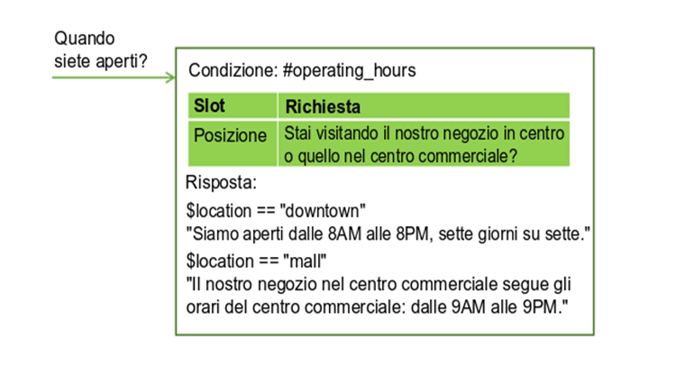
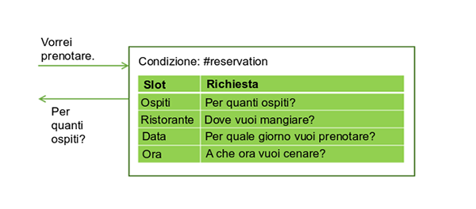
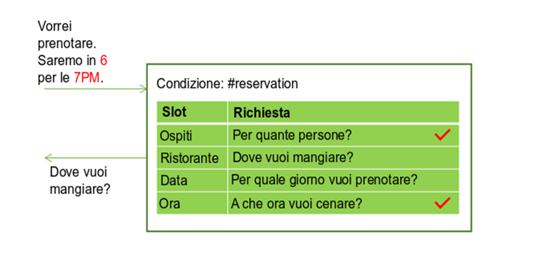
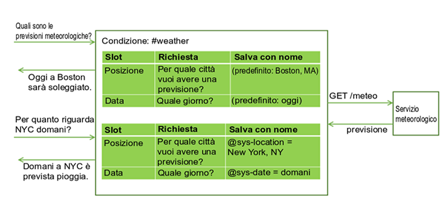
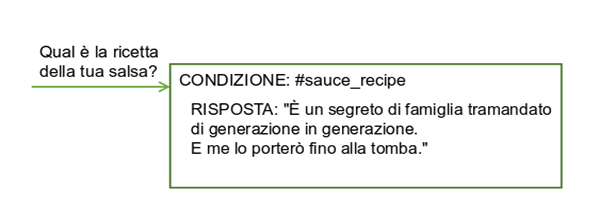

---

copyright:
  years: 2015, 2018
lastupdated: "2018-02-16"

---

{:shortdesc: .shortdesc}
{:new_window: target="_blank"}
{:tip: .tip}
{:pre: .pre}
{:codeblock: .codeblock}
{:screen: .screen}
{:javascript: .ph data-hd-programlang='javascript'}
{:java: .ph data-hd-programlang='java'}
{:python: .ph data-hd-programlang='python'}
{:swift: .ph data-hd-programlang='swift'}
{:table: .aria-labeledby="caption"}

# Raccolta di informazioni con gli slot
{: #dialog-slots}

Aggiungi gli slot a un nodo di dialogo per raccogliere più informazioni da un utente all'interno di tale nodo. Gli slot raccolgono informazioni al ritmo dell'utente. I dettagli che l'utente fornisce all'inizio vengono salvati e il servizio chiede solo i dettagli che non lo sono.

<iframe class="embed-responsive-item" id="youtubeplayer" type="text/html" width="640" height="390" src="https://www.youtube.com/embed/ES4GHcDsSCI?rel=0" frameborder="0" webkitallowfullscreen mozallowfullscreen allowfullscreen> </iframe>

## Perché aggiungere slot?
{: #why-add-slots}

Utilizza gli slot per ottenere le informazioni necessarie prima di poter rispondere con precisione all'utente. Ad esempio, se gli utenti chiedono informazioni sulle ore lavorative, ma le ore differiscono in base alle posizioni del negozio, potresti porre una domanda di follow-up sulla posizione del negozio che intendono visitare prima di rispondere. Puoi quindi aggiungere condizioni di risposta che tengano conto delle informazioni sulla posizione fornite.



Gli slot possono aiutarti a raccogliere ulteriori informazioni necessarie per completare un'attività complessa per un utente, ad esempio prenotare una cena.



L'utente potrebbe fornire valori per più slot contemporaneamente. Ad esempio, l'input potrebbe includere le informazioni `Saremo in 6 a cenare alle 7 PM.` Questo solo input contiene due dei valori richiesti mancanti: il numero di ospiti e l'ora della prenotazione. Il servizio li riconosce e li memorizza entrambi, ciascuno nel suo slot corrispondente. Quindi, visualizza la richiesta associata al successivo slot vuoto.



Gli slot consentono al servizio di rispondere alle domande di follow-up senza dover ricostruire l'obiettivo dell'utente. Ad esempio, un utente potrebbe chiedere una previsione meteorologica, quindi fare una domanda di follow-up sul tempo in un'altra posizione o per un altro giorno. Se salvi negli slot le variabili di previsione richieste, come la posizione e il giorno, qualora un utente faccia una domanda di follow-up con nuovi valori di variabile, puoi sovrascrivere i valori di slot con i nuovi valori forniti e dare una risposta che rifletta le nuove informazioni. (Per ulteriori informazioni su come richiamare un servizio esterno da un dialogo, vedi [Esecuzione di chiamate programmatiche da un nodo di dialogo](dialog-actions.html)).



L'utilizzo di slot produce un flusso di dialogo più naturale tra l'utente e il servizio ed è più facile da gestire che cercare di raccogliere le informazioni utilizzando molti nodi separati.

## Aggiunta di slot
{: #add-slots}

1.  Identifica le unità di informazioni che vuoi raccogliere. Ad esempio, per ordinare una pizza per qualcuno, puoi raccogliere le seguenti informazioni:

    - Tempo di consegna
    - Dimensione

1.  Se non hai ancora iniziato a creare un dialogo, segui le istruzioni presenti in [Creazione di un dialogo](dialog-build.html) per crearne uno. 

1.  Dalla vista di modifica del nodo di dialogo, fai clic su **Personalizza** e quindi fai clic sull'interruttore accanto a **Slot** per **attivarlo**.

    **Nota**: per ulteriori informazioni sulla casella di spunta **Richiedi tutto**, vedi [Chiedere tutto in una volta](dialog-slots.html#slots-prompt-for-everything).

1.  **Aggiungi uno slot per ogni unità di informazioni richieste**. Per ogni slot, specifica i seguenti dettagli:

    - **Controlla**: identifica il tipo di informazioni che vuoi estrarre dalla risposta dell'utente alla richiesta dello slot. Nella maggior parte dei casi, controlli i valori di entità. Infatti, il builder di condizioni visualizzato suggerisce le entità che puoi controllare. Tuttavia, puoi anche controllare un intento; inserisci semplicemente il nome dell'intento nel campo. Puoi utilizzare qui gli operatori AND e OR per definire condizioni più complesse.

      **Importante**: il valore *Controlla* viene prima utilizzato come condizione, ma poi diventa il valore della variabile di contesto che specifichi nel campo *Salva con nome*. Se desideri modificare la modalità di salvataggio del valore, riformattalo, ad esempio, quindi aggiungi l'espressione che riformatta il valore direttamente nel campo **Controlla**.

      Ad esempio, se per l'entità sono definiti modelli di espressione regolare, dopo aver aggiunto il nome entità, aggiungi `.literal` al nome. Dopo aver scelto ad esempio `@email` dall'elenco di entità definite, modifica il campo **Controlla** in modo da contenere `@email.literal`. Aggiungendo la proprietà `.literal`, indichi che vuoi acquisire il testo esatto immesso dall'utente e che è stato identificato come un indirizzo email basato sul suo modello. Esegui questa modifica della sintassi direttamente nel campo **Controlla**.

      **Avvertenza** se desideri applicare un'espressione complessa al valore prima di salvarlo, puoi aprire l'editor JSON per definire l'espressione SpEL complessa. Tuttavia, l'espressione complessa che definisci nell'editor JSON non si rifletterà nel campo **Controlla** quando uscirai dall'editor JSON. E se fai clic sul campo **Controlla** per attivarlo in qualsiasi momento dopo aver definito l'espressione complessa relativa ad esso, noterai che l'espressione è stata rimossa. 

      Evita di controllare i valori delle variabili di contesto. Poiché il valore che controlli è anche il valore che viene salvato, quando utilizzi una variabile di contesto nella condizione, può produrre un comportamento imprevisto quando viene utilizzata nel contesto. Non provare a utilizzare uno slot facoltativo per una risposta solo se è impostata una determinata variabile di contesto. Se la variabile è impostata, la risposta Trovato dello slot che hai definito per lo slot facoltativo verrà visualizzata insieme alla risposta restituita da ogni altro slot all'infinito.
      {: tip}

    - **Salva con nome**: fornisci un nome per la variabile di contesto in cui memorizzare il valore di interesse dalla risposta dell'utente alla richiesta dello slot. Non specificare una variabile di contesto utilizzata in precedenza nel dialogo e che quindi potrebbe avere un valore. La richiesta per lo slot viene visualizzata solo quando la variabile di contesto per lo slot è null.

    - **Richiesta**: scrivi un'istruzione che induca l'utente a fornire le informazioni che ti servono. Dopo aver visualizzato questa richiesta, la conversazione si interrompe e il servizio attende che l'utente risponda.

    - Se desideri che vengano visualizzate informazioni di follow-up diverse a seconda del fatto che l'utente ti fornisca le istruzioni necessarie in risposta alla richiesta slot iniziale, puoi modificare lo slot (facendo clic sull'icona **Modifica slot** ) e definirle:

      - **Trovato**: viene visualizzato dopo che l'utente fornisce le informazioni previste. 

      - **Non trovato**: viene visualizzato se le informazioni fornite dall'utente non vengono comprese o non sono fornite nel formato previsto. Se lo slot è riempito correttamente o l'input utente viene compreso e gestito da un gestore slot, questa istruzione non viene mai visualizzata.

      Per informazioni su come definire le condizioni e le azioni associate per le risposte Trovato e Non trovato, vedi [Aggiunta di condizioni alle risposte Trovato e Non trovato](dialog-slots.html#slot-handler-next-steps).

    Questa tabella mostra valori di slot di esempio per un nodo che aiuta gli utenti a ordinare una pizza raccogliendo due parti delle informazioni, il formato della pizza e i tempi di consegna. 

    <table>
    <caption>Slot di esempio per l'ordine di una pizza</caption>
    <tr>
      <th>Controlla</th>
      <th>Salva con nome</th>
      <th>Richiesta</th>
      <th>Follow-up se trovato</th>
      <th>Follow-up se non trovato</th>
    </tr>
    <tr>
      <td>@size</td>
      <td>$size</td>
      <td>Quale formato di pizza preferisci?</td>
      <td>È $size.</td>
      <td>Quale formato volevi? Abbiamo piccolo, medio e grande.</td>
    </tr>
    <tr>
      <td>@sys-time</td>
      <td>$time</td>
      <td>Quando hai bisogno della pizza?</td>
      <td>Per la consegna entro $time.</td>
      <td>A che ora desideri la consegna? Abbiamo bisogno di almeno mezz'ora per prepararla.</td>
    </tr>
    </table>

1.  **Rendi uno slot facoltativo o disabilitalo in determinate condizioni**. Puoi facoltativamente configurare uno slot nei seguenti modi: 

    - **Facoltativo**: per rendere uno slot facoltativo, aggiungi uno slot senza una richiesta. Il servizio non richiede all'utente le informazioni, ma le ricerca nell'input utente e salva il valore se l'utente l'ha fornito. Ad esempio, potresti aggiungere uno slot che acquisisce informazioni di restrizione dietetica nel caso in cui l'utente le specifichi. Tuttavia, non vuoi chiedere a tutti gli utenti informazioni dietetiche in quanto è irrilevante nella maggior parte dei casi.

       <table>
       <caption>Slot facoltativo</caption>
       <tr>
          <th>Informazioni</th>
          <th>Controlla</th>
          <th>Salva con nome</th>
       </tr>
       <tr>
          <td>Restrizione grano</td>
          <td>@dietary</td>
          <td>$dietary</td>
      </tr>
      </table>

      Se rendi uno slot facoltativo, fai riferimento alla sua variabile di contesto nel testo di risposta a livello di nodo solo se puoi formularlo in modo che abbia senso, anche se non viene fornito alcun valore per lo slot. Ad esempio, puoi formulare un'istruzione di riepilogo come questa, `Voglio ordinare una pizza $size $dietary da consegnare alle $time.` Il testo risultante ha senso anche se le informazioni di restrizione dietetica, come `gluten-free` o `dairy-free`, non vengono fornite. Il risultato è, `Voglio ordinare una pizza grande senza glutine da consegnare alle 3:00PM.` oppure `Voglio ordinare una pizza grande da consegnare alle 3:00PM.`
      {: tip}

    - **Condizionale**: se desideri che uno slot venga abilitato solo in determinate condizioni, aggiungi una condizione ad esso. Ad esempio, se lo slot 1 richiede l'ora di inizio di una riunione, lo slot 2 acquisisce la durata della riunione e lo slot 3 acquisisce l'ora di fine, potresti abilitare lo slot 3 (e richiedere l'ora di fine della riunione) solo se non viene fornito un valore per lo slot 2. Per rendere condizionale uno slot, modificalo e poi, dal menu **Altro** , seleziona **Abilita condizione**. Definisci la condizione che deve essere soddisfatta affinché lo slot venga abilitato. 

      Puoi creare una condizione sul valore di una variabile di contesto proveniente da uno slot precedente perché l'ordine in cui vengono elencati gli slot è l'ordine in cui vengono valutati. Tuttavia, quando questo slot verrà valutato, sul valore di una variabile di contesto esisterà solo la condizione di cui potrai ritenerti sicuro. Assicurarsi, ad esempio, che lo slot precedente sia obbligatorio.
    {: tip}
1.  **Mantieni la conversazione degli utenti**. Puoi definire facoltativamente dei gestori slot che forniscano risposte alle domande che gli utenti potrebbero porre durante l'interazione e che sono tangenti allo scopo del nodo. 

    Ad esempio, l'utente potrebbe chiedere la ricetta della salsa di pomodoro o dove ottieni i tuoi ingredienti. Per gestire tali domande fuori argomento, fai clic sul link **Gestisci gestori** e aggiungi una condizione e una risposta per ogni domanda anticipata.

    

    Dopo aver risposto alla domanda fuori fuori argomento, viene visualizzata la richiesta associata allo slot vuoto corrente.

    Questa condizione viene attivata se l'utente fornisce un input che corrisponde alle condizioni del gestore slot in qualsiasi momento durante il flusso del nodo di dialogo finché non viene visualizzata la risposta a livello di nodo. Vedi [Gestione delle richieste per uscire dal processo](dialog-slots.html#slots-node-level-handler) per ulteriori modi in cui utilizzare il gestore slot.
1.  **Aggiungi una risposta a livello di nodo**. La risposta a livello di nodo non viene eseguita fino a quando non vengono riempiti tutti gli slot richiesti. Puoi aggiungere una risposta che riepiloghi le informazioni che hai raccolto. Ad esempio, `La consegna di una pizza $size è prevista alle $time. Buon appetito!`

    Se desideri definire risposte diverse in base a determinate condizioni, fai clic su **Personalizza** e quindi fai clic sull'interruttore **Risposte multiple** per **attivarlo**. Per informazioni sulle risposte condizionali, vedi [Risposte condizionali](dialog-overview.html#multiple).
1.  **Aggiungi la logica che reimposta le variabili di contesto degli slot**. Quando raccogli le risposte dell'utente per ogni slot, queste vengono salvate in variabili di contesto. Puoi utilizzare le variabili di contesto per passare le informazioni a un altro nodo o affinché vengano utilizzate da un'applicazione o un servizio esterno. Tuttavia, dopo aver passato le informazioni, devi impostare le variabili di contesto su null per reimpostare il nodo in modo che possa iniziare a raccogliere di nuovo le informazioni. Non puoi impostare su null le variabili di contesto all'interno del nodo corrente perché il servizio non esce dal nodo finché non vengono riempiti tutti gli slot richiesti. Invece, prendi in considerazione uno dei seguenti metodi:

    - Aggiungi l'elaborazione all'applicazione esterna che imposta su null le variabili.
    - Aggiungi un nodo figlio che imposta su null le variabili.
    - Inserisci un nodo padre che imposta su null le variabili e poi passa al nodo con gli slot.

Provalo gratis. Segui l'[esercitazione](tutorial-slots.html) dettagliata.

## Suggerimenti sull'utilizzo degli slot
{: #slots-tips}

Le proprietà slot riportate di seguito possono esserti di aiuto per controllare e impostare i valori nelle variabili di contesto dello slot. 

| Nome proprietà         | Descrizione |
|------------------------|-------------|
| `all_slots_filled`     | Viene valutata come true solo se sono state impostate tutte le variabili di contesto per tutti gli slot nel nodo. Vedi [Omissione di una risposta Trovato quando non è necessaria](dialog-slots.html#slots-stifle-found-responses) per un esempio di utilizzo. |
| `event.current_value`  | Il valore corrente della variabile di contesto per questo slot. Vedi [Sostituzione di un valore di variabile di contesto dello slot](dialog-slots.html#slots-found-handler-event-properties) per un esempio di utilizzo per questa proprietà e per la proprietà event.previous_value. |
| `event.previous_value` | Il valore precedente della variabile di contesto per questo slot. |
| `has_skipped_slots`    | Ha valore true se è stato elaborato uno qualsiasi degli slot o dei gestori slot configurati con un'opzione di passo successivo che ignora gli slot. Vedi [Aggiunta di condizioni alle risposte Trovato e Non trovato](dialog-slots.html#slot-handler-next-steps) per ulteriori informazioni sulle opzioni di passi successivi per gli slot e [Gestione delle richieste per uscire dal processo](dialog-slots.html#slots-node-level-handler) per informazioni sulle opzioni di passi successivi per i gestori slot. |
| `slot_in_focus`        | Forza l'applicazione della condizione slot unicamente allo slot corrente. Per ulteriori dettagli, vedi [Richiamo della conferma](dialog-slots.html#slots-get-confirmation). |
{: caption="Proprietà dello slot" caption-side="top"}

Prendi in considerazione l'utilizzo di questi approcci per gestire le attività comuni. 

- [Chiedere tutto in una volta](dialog-slots.html#slots-prompt-for-everything)
- [Acquisizione di più valori](dialog-slots.html#slots-multiple-entity-values)
- [Riformattazione dei valori](dialog-slots.html#slots-reformat-values)
- [Richiamo della conferma](dialog-slots.html#slots-get-confirmation)
- [Sostituzione di un valore di variabile di contesto dello slot](dialog-slots.html#slots-found-handler-event-properties)
- [Evitare confusione tra i numeri](dialog-slots.html#slots-avoid-number-confusion)
- [Aggiunta di condizioni alle risposte Trovato e Non trovato](dialog-slots.html#slot-handler-next-steps)
- [Prosecuzione dopo più tentativi non riusciti](dialog-slots.html#slots-stop-trying-after-3)
- [Omissione di una risposta Trovato quando non è necessaria](dialog-slots.html#slots-stifle-found-responses)
- [Gestione delle richieste per uscire dal processo](dialog-slots.html#slots-node-level-handler)

### Chiedere tutto in una volta
{: #slots-prompt-for-everything}

Includi una richiesta iniziale per l'intero nodo che indichi chiaramente agli utenti quali unità di informazioni devono fornire. La visualizzazione di questa richiesta iniziale dà agli utenti l'opportunità di fornire tutti i dettagli in una sola volta e non dover aspettare la richiesta di informazioni volta per volta.

Ad esempio, quando il nodo viene attivato perché un cliente vuole ordinare una pizza, puoi rispondere con la richiesta preliminare, `Posso ordinarti una pizza. Dimmi quale formato desideri e l'ora in cui vuoi che venga consegnata.`

Se l'utente fornisce anche solo una parte di queste informazioni nella sua richiesta iniziale, la richiesta non viene visualizzata. Ad esempio, l'input iniziale potrebbe essere, `Voglio ordinare una pizza grande.` Quando il servizio analizza l'input, riconosce `grande` come dimensione della pizza e riempie lo slot **Dimensione** con il valore fornito. Poiché uno degli slot è stato riempito, ignora la visualizzazione della richiesta iniziale per evitare di chiedere nuovamente le informazioni sulla dimensione della pizza. Invece, visualizza le richieste per eventuali slot rimanenti con informazioni mancanti.

Dal riquadro Personalizza in cui hai abilitato la funzione Slot, seleziona la casella di spunta **Richiedi tutto** per abilitare la richiesta iniziale. Questa impostazione aggiunge il campo **Se non ci sono slot precompilati, chiedi prima questo** al nodo, dove puoi specificare il testo che richiede all'utente tutte le informazioni.

### Acquisizione di più valori
{: #slots-multiple-entity-values}

Puoi chiedere un elenco di elementi e salvarli in uno slot.

Ad esempio, potresti voler chiedere agli utenti se vogliono condimenti sulla pizza. Per farlo, definisci un'entità (@toppings) e i valori accettati per essa (salame, formaggio, funghi e così via). Aggiungi uno slot che chieda agli utenti informazioni sui condimenti. Utilizza la proprietà dei valori del tipo di entità per acquisire più valori, se forniti.

<table>
<caption>Slot a più valori</caption>
<tr>
  <th>Controlla</th>
  <th>Salva con nome</th>
  <th>Richiesta</th>
  <th>Follow-up se trovato</th>
  <th>Follow-up se non trovato</th>
</tr>
<tr>
  <td>@toppings.values</td>
  <td>$toppings</td>
  <td>Vuoi condimenti sulla pizza?</td>
  <td>Ottima aggiunta.</td>
  <td>Quale condimento preferisci? Offriamo ...</td>
</tr>
</table>

Per fare riferimento al condimento specificato dall'utente in un secondo momento, utilizza la sintassi `<? $entity-name.join(',') ?>` per elencare ogni elemento nell'array di condimenti e separare i valori con una virgola. Ad esempio, `Sto ordinando una pizza $size con <? $toppings.join(',') ?> con consegna alle $time.`

### Riformattazione dei valori
{: #slots-reformat-values}

Poiché chiedi informazioni agli utenti e devi fare riferimento al loro input nelle risposte, considera la possibilità di riformattare i valori in modo da poterli visualizzare in un formato più semplice.

Ad esempio, i valori di ora vengono salvati in formato `hh:mm:ss`. Puoi utilizzare l'editor JSON per lo slot per riformattare il valore di ora mentre lo salvi in modo che utilizzi invece il formato `hour:minutes AM/PM`:

```json
{
  "context":{
    "time": "<? @sys-time.reformatDateTime('h:mm a') ?>"
  }
}
```
{: codeblock}

Per altre idee di riformattazione, vedi [Metodi per elaborare i valori](dialog-methods.html).

### Richiamo della conferma
{: #slots-get-confirmation}

Aggiungi uno slot dopo gli altri che chiede all'utente di confermare che le informazioni che hai raccolto siano accurate e complete. Lo slot può cercare risposte che corrispondono all'intento #yes o #no.

<table>
<caption>Slot di conferma</caption>
<tr>
  <th>Controlla</th>
  <th>Salva con nome</th>
  <th>Richiesta</th>
  <th>Follow-up se trovato</th>
  <th>Follow-up se non trovato</th>
</tr>
<tr>
  <td>#yes || #no</td>
  <td>$confirmation</td>
  <td>Sto per ordinarti una pizza `$size` da consegnare alle `$time`. Posso procedere?</td>
  <td>La pizza sta arrivando!</td>
  <td>Vedi *Risposta complessa*</td>
</tr>
</table>

**Risposta complessa** Poiché gli utenti potrebbero includere istruzioni affermative o negative altre volte durante il dialogo (*Oh sì, vogliamo la pizza alle 5pm*) o (*non ho ospiti stasera, prendo una pizza piccola*), utilizza la proprietà `slot_in_focus` per chiarire nella condizione dello slot che stai cercando una risposta Sì o No alla richiesta relativa solo a questo slot. 

```json
(#yes || #no) && slot_in_focus
```
{: codeblock}

La proprietà `slot_in_focus` restituisce sempre un valore booleano (true o false). Includila solo in una condizione per la quale vuoi un risultato booleano. Non utilizzarla, ad esempio, nelle condizioni dello slot che controllano un tipo di entità e quindi salvano il valore dell'entità.
{: tip}

Nella richiesta **Non trovato**, chiarisci che prevedi che l'utente fornisca una risposta Sì o No.

```json
{
  "output":{
    "text": {
      "values": [
        "Respond with Yes to indicate that you want the order to
         be placed as-is, or No to indicate that you do not."
      ]
    }
  }
}
```
{: codeblock}

Nella richiesta **Found**, aggiungi una condizione che controlli la presenza di una risposta No (#no). Quando viene trovata, chiedi di nuovo tutte le informazioni e ripristina le variabili di contesto che hai salvato in precedenza. 

```json
{
  "conditions": "#no",
  "output":{
    "text": {
      "values": [
        "Let's try this again. Tell me what size pizza you want and the time..."
      ]
    }
  },
  "context":{
    "size": null,
    "time": null,
    "confirmation": null
  }
}
```
{: codeblock}

### Sostituzione di un valore di variabile di contesto dello slot
{: #slots-found-handler-event-properties}

Se, in qualsiasi momento prima di eseguire l'uscita da un nodo con slot, l'utente fornisce un nuovo valore, il nuovo valore viene salvato nella variabile di contesto dello slot, sostituendo il valore specificato in precedenza. Il dialogo può riconoscere esplicitamente che questa sostituzione si è verificata utilizzando speciali proprietà definite per la condizione Trovato:

- `event.previous_value`: valore precedente della variabile di contesto per questo slot.
- `event.current_value`: valore corrente della variabile di contesto per questo slot.

Ad esempio, il dialogo chiede quale sia la città di destinazione per la prenotazione di un volo. L'utente fornisce `Parigi.` Tu imposti la variabile di contesto dello slot $destination su *Parigi*. Quindi, l'utente dirà `Aspetta. Voglio andare invece a Madrid.` Se configuri la condizione Trovato come segue, il tuo dialogo può gestire questo tipo di modifica correttamente.

Quando l'utente risponde, se viene trovato @destination:

```json
Condition: (event.previous_value != null) &&
           (event.previous_value != event.current_value)
    Response: Ok, updating destination from
    <? event.previous_value ?> to <? event.current_value ?>.
Response: Ok, destination is $destination.
```
{: codeblock}

Questa configurazione dello slot consente al tuo dialogo di reagire alla modifica di destinazione dell'utente dicendo, `Ok, la destinazione verrà aggiornata da Parigi a Madrid.`

### Evitare confusione tra i numeri
{: #slots-avoid-number-confusion}

Alcuni valori forniti dagli utenti possono essere identificati come più di un tipo di entità.

Potresti avere due slot che memorizzano lo stesso tipo di valore, come ad esempio una data di arrivo e una data di partenza. Crea una logica nelle tue condizioni di slot per distinguere tra loro questi valori simili.

Inoltre, il servizio può riconoscere più tipi di entità in un singolo input utente. Ad esempio, quando un utente fornisce una valuta, viene riconosciuta come tipi di entità @sys-currency e @sys-number. Esegui qualche test nel riquadro *Provalo* per comprendere come il sistema interpreterà i diversi input utente e creerà la logica nelle tue condizioni per evitare possibili errori di interpretazione.

Nella logica che è univoca per la funzione degli slot, quando due entità vengono riconosciute in un singolo input utente, viene utilizzata quella con l'estensione più lunga. Ad esempio, se l'utente immette *May 2*, anche se il servizio {{site.data.keyword.conversationshort}} riconosce entrambe le entità @sys-date (05022017) e @sys-number (2) nel testo, solo l'entità con l'estensione più lunga (@sys-date) viene registrata e applicata a uno slot.
{: tip}

### Aggiunta di condizioni alle risposte Trovato e Non trovato
{: #slot-handler-next-steps}

Per ogni slot, puoi utilizzare le risposte condizionali con le azioni associate che ti saranno di aiuto per estrarre le informazioni necessarie dall'utente. A tale scopo, segui questa procedura: 

1.  Fai clic sull'icona **Modifica slot**  per lo slot a cui desideri aggiungere le risposte condizionali Trovato e Non trovato. 
1.  Dal menu **Altro** , seleziona **Abilita risposte condizionali**.
1.  Immetti la condizione e la risposta da visualizzare se la condizione viene soddisfatta. 

    **Esempio per Trovato**: lo slot si aspetta l'ora per la prenotazione di una cena. Puoi utilizzare @sys-time nel campo *Controlla* per acquisirla. Per impedire il salvataggio di un'ora non valida, puoi aggiungere una risposta condizionale che controlla se l'ora fornita è precedente all'ora dell'ultimo turno del ristorante, ad esempio. `@sys-time.after('21:00:00')` La risposta corrispondente potrebbe essere simile a *L'ultimo turno è alle 9PM.*

    **Esempio di Non trovato**: lo slot si aspetta un'entità @location che accetta una serie specifica di città in cui la catena di ristoranti ha dei ristoranti. La condizione Non trovato potrebbe controllare la presenza di @sys-location nel caso in cui l'utente specifichi una città valida, ma una città in cui la catena non ha ristoranti. La risposta corrispondente potrebbe essere *Non ci sono ristoranti in tale città.*

1.  Se desideri personalizzare le successive operazioni da eseguire nel caso in cui la condizione venga soddisfatta, fai clic sull'icona **Modifica risposta** .

    Per le risposte Trovato (che vengono visualizzate quando l'utente fornisce un valore che corrisponde al tipo di valore specificato nel campo Controlla), puoi scegliere una di queste azioni da eseguire:

      - **Vai a (predefinito)**: indica al servizio di andare allo slot vuoto successivo dopo la visualizzazione della risposta. Nella risposta associata, assicura all'utente che l'input è stato compreso. Ad esempio, *Ok. Vuoi pianificarlo per il giorno $date.*
      - **Cancella slot e chiedi di nuovo**: se stai utilizzando un'entità nel campo *Controlla* che potrebbe selezionare il valore errato, aggiungi le condizioni per acquisire tutti i probabili errori di interpretazione e utilizza questa azione per cancellare il valore slot corrente e richiedere quello corretto. 
      - **Passa alla risposta**: se, quando viene soddisfatta la condizione che hai definito, non hai più bisogno di riempire gli slot rimanenti in questo nodo, scegli questa azione per ignorare gli slot rimanenti e andare direttamente alla risposta a livello di nodo successiva. Ad esempio, potresti aggiungere una condizione che controlla se l'età dell'utente è inferiore a 16. Se è così, potresti ignorare gli slot rimanenti che pongono domande relative ai dati di guida dell'utente. 

    Per le risposte Non trovato (che vengono visualizzate quando l'utente non fornisce un valore valido), puoi scegliere una di queste azioni da eseguire: 

      - **Attendi input utente (predefinito)**: interrompe la conversazione e il servizio attende che l'utente risponda. Nel caso più semplice, il testo che specifichi qui può indicare più esplicitamente il tipo di informazioni che l'utente deve fornire. Se utilizzi questa azione con una risposta condizionale, assicurati di formulare la risposta condizionale in modo da indicare chiaramente l'errore nella risposta dell'utente e cosa invece prevedi venga specificato. 
      - **Chiedi di nuovo**: dopo aver visualizzato la risposta Non trovato, il servizio ripete di nuovo la richiesta slot e attende la risposta dell'utente. Se utilizzi questa azione con una risposta condizionale, la risposta può semplicemente spiegare l'errore nella risposta fornita dall'utente. Non deve reiterare il tipo di informazioni che desideri ti vengano fornite dall'utente in quanto, di norma, la spiegazione viene fornita dalla richiesta slot. 

        Se scegli questa opzione, considera di aggiungere almeno una variante della risposta Non trovato in modo che l'utente non veda lo stesso identico testo più di una volta. Cogli l'opportunità di formulare diversamente il testo per spiegare all'utente quali sono le informazioni che devono essere fornite e in quale formato.
        {: tip}

      - **Salta questo slot**: indica al servizio di smettere di tentare di riempire lo slot corrente e, invece, di spostarsi alla richiesta dello slot vuoto successivo. Questa opzione è utile in uno slot che vuoi rendere facoltativo e per cui vuoi visualizzare una richiesta che chiede informazioni all'utente. Ad esempio, potresti avere un'entità @seating che acquisisce le preferenze per i posti a sedere al ristorante, ad esempio *fuori*, *accanto al caminetto*, *privato* e così via. Puoi aggiungere uno slot che richieda all'utente *Hai preferenze per il posto a sedere?* e controlli `@seating.values`. Se viene fornita una risposta valida, le informazioni sulla preferenza vengono salvate in `$seating_preferences`. Tuttavia, scegliendo questa azione come passo successivo alla risposta Non trovato, indichi al servizio di smettere di tentare di riempire questo slot se l'utente non fornisce un valore valido. 
      - **Passa alla risposta**: se, quando viene soddisfatta la condizione che hai definito, non hai più bisogno di riempire gli slot rimanenti in questo nodo, scegli questa azione per ignorare gli slot rimanenti e andare direttamente alla risposta a livello di nodo successiva. Ad esempio, se dopo aver acquisito le informazioni per il volo di sola andata, la richiesta slot è *Stai acquistando biglietti di andata e ritorno?* la condizione Non trovato può controllare la presenza di #No. Se #No viene trovato, utilizza questa opzione per saltare gli slot rimanenti che acquisiscono le informazioni sul volo di ritorno e andare invece direttamente alla risposta a livello di nodo. 

    Fai clic su **Indietro** per tornare alla vista di modifica dello slot.
1.  Per aggiungere un'altra risposta condizionale, fai clic su **Aggiungi una risposta** e quindi immetti la condizione e la risposta da visualizzare se viene soddisfatta la condizione. 

    Assicurati di aggiungere almeno una risposta che verrà visualizzata in ogni caso. Puoi lasciare vuoto il campo per questa risposta generica. Il servizio popolerà automaticamente la condizione vuota con la condizione speciale `true`.

1.  Fai clic su **Salva** per salvare le modifiche, chiudere la vista di modifica dello slot e ritornare alla vista di modifica del nodo. 

### Prosecuzione dopo più tentativi non riusciti
{: #slots-stop-trying-after-3}

Puoi fornire agli utenti un modo per uscire da uno slot se non possono rispondere correttamente dopo diversi tentativi utilizzando le risposte condizionali Non trovato. Nella risposta generica, apri l'editor JSON per aggiungere una variabile di contesto contatore che terrà traccia del numero di volte in cui viene restituita la risposta Non trovato. In un nodo precedente, assicurati di impostare il valore iniziale della variabile di contesto contatore su 0.

In questo esempio, il servizio richiede il formato della pizza. Consente all'utente di rispondere in modo errato per 3 volta prima di applicare automaticamente un formato (medio) alla variabile. (Puoi includere uno slot di conferma in cui gli utenti possono sempre correggere il formato quando viene loro richiesto di confermare le informazioni dell'ordine.)

```json
Check for: @size
Save as: $size
Catchall Not found condition:
{
  "output":{
    "text": {
      "values": [
        "Quale formato volevi? Abbiamo piccolo, medio e grande."
      ],
      "selection_policy": "sequential"
    }
  },
"context": {
    "counter": "<? context['counter'] + 1 ?>"
  }
}
```
{: codeblock}

Per rispondere in modo diverso dopo 3 tentativi, aggiungere un'altra condizione Non trovato come questa:
```json
{
  "conditions": "$counter > 1",
  "output": {
    "text": {
      "values": [
        "We will bring you a size medium pizza."
      ]
    }
  },
"context": {
    "size": "medium"
  }
  ```
  {: codeblock}

Questa condizione è più esatta della condizione true della risposta generica, quindi devi spostare questa risposta in modo tale che si verifichi prima della risposta condizionale originale o non verrà mai attivata. Seleziona la risposta condizionale e utilizza la freccia rivolta verso l'alto per spostarla verso l'alto. 

### Omissione di una risposta Trovato quando non è necessaria
{: #slots-stifle-found-responses}

Se specifichi le risposte Trovato per più slot, quando un utente fornisce valori per più slot contemporaneamente, verrà visualizzata la risposta Trovato per almeno uno degli slot. Probabilmente vuoi che la risposta Trovato sia restituita per tutti o per nessuno di essi.

Per impedire la visualizzazione delle risposte Trovato, puoi eseguire una delle seguenti operazioni per ogni risposta Trovato:

- Aggiungere una condizione alla risposta che ne impedisca la visualizzazione se vengono riempiti determinati slot. Ad esempio, puoi aggiungere una condizione come `!($size && $time)`, che impedisce la visualizzazione della risposta se vengono fornite entrambe le variabili di contesto $size e $time.
- Aggiungere la condizione `!all_slots_filled` alla risposta. Questa impostazione impedisce la visualizzazione della risposta se vengono riempiti tutti gli slot. Non utilizzare questo approccio se includi uno slot di conferma. Lo slot di conferma è anche uno slot e in genere vuoi evitare che le risposte Trovato siano visualizzate prima che il relativo slot di conferma venga riempito.

### Gestione delle richieste per uscire dal processo
{: #slots-node-level-handler}

Aggiungi almeno un gestore slot che possa riconoscere quando un utente vuole uscire dal nodo. 

Ad esempio, in un nodo che raccoglie le informazioni per pianificare un appuntamento di toelettatura di animali domestici, puoi aggiungere un gestore slot che condizioni l'intento #cancel, che riconosce espressioni come <q>Lascia stare. Ho cambiato idea.</q>

1.  Nell'editor JSON per il gestore, compila tutte le variabili di contesto dello slot con valori fittizi per impedire al nodo di continuare a chiedere informazioni mancanti. Quindi, nella risposta del gestore, aggiungi un messaggio come, `Ok, ci fermiamo qui. Non verrà pianificato alcun appuntamento.`
1.  Scegli quale azione vuoi che venga eseguita successivamente dal servizio dalle seguenti opzioni: 

    - **Chiedi di nuovo (predefinito)**: visualizza la richiesta per lo slot su cui l'utente stava lavorando appena prima di porre una domanda fuori argomento. 
    - **Salta slot corrente**: visualizza la richiesta associata allo slot che viene dopo lo slot su cui l'utente stava lavorando appena prima di porre una domanda fuori argomento. E il servizio non effettua ulteriori tentativi di riempire lo slot saltato. 
    - **Passa alla risposta**: salta le richieste per tutti gli slot vuoti rimanenti incluso lo slot su cui l'utente stava lavorando appena prima di porre una domanda fuori argomento. 

1.  Nella risposta a livello di nodo, aggiungi una condizione che controlli la presenza di un valore fittizio in una delle variabili di contesto dello slot. Se viene trovato, mostra un messaggio finale come: `Se decidi di prendere un appuntamento più tardi, sono qui per aiutarti.` Se non viene trovato, visualizza il messaggio di riepilogo standard per il nodo, ad esempio `Prenderò un appuntamento di toelettatura per il tuo $animal alle $time del $date.`

Ecco un esempio di JSON che definisce un gestore slot per l'esempio della pizza. Nota che, come descritto in precedenza, tutte le variabili di contesto vengono impostate su valori fittizi. Infatti, la variabile di contesto `$size` viene impostata su `dummy`. Questo valore $size attiva la risposta a livello di nodo per mostrare il messaggio appropriato e uscire dal nodo di slot. 

```json
{
"conditions": "#cancel",
 "output": {
   "text": {
     "values": [
       "Ok, we'll stop there. No pizza delivery will be scheduled."
     ],
    "selection_policy": "sequential"
    }
  },
"context": {
   "time": "12:00:00",
   "size": "dummy",
   "confirmation":"true"
}
}
```
{: codeblock}

**Importante**: prendi in considerazione la logica utilizzata nelle condizioni che vengono valutate prima di questa in modo da poter creare condizioni distinte. Quando viene ricevuto un input utente, le condizioni vengono valutate nel seguente ordine:

- Condizioni Trovato a livello dello slot corrente.
- Gestori slot nell'ordine in cui sono elencati.
- Condizioni Non trovato a livello dello slot corrente.

Fai attenzione quando aggiungi condizioni che vengono valutate sempre come true (come le condizioni speciali, `true` o `anything_else`) come gestori slot. Per ogni slot, se il gestore slot viene valutato come true, la condizione Non trovato viene completamente ignorata. Quindi, l'utilizzo di un gestore slot che viene valutato sempre come true impedisce effettivamente la valutazione della condizione Non trovato per ogni slot.
{: tip}

Ad esempio, ti occupi della pulizia di tutti gli animali tranne i gatti. Per lo slot Animale, potresti essere tentato di utilizzare la seguente condizione di slot per impedire di salvare `cat` nello slot Animale:

```json
Check for @animal && !@animal:cat, then save it as $animal.
```
{: codeblock}

E per far sapere agli utenti che non accetti i gatti, potresti specificare il seguente valore nella condizione Non trovato dello slot Animale:

```json
If @animal:cat then, "I'm sorry. We do not groom cats."
```
{: codeblock}

Sebbene sia logico, se definisci anche un gestore slot #exit, - dato l'ordine di valutazione delle condizioni - probabilmente questa condizione Non trovato non verrà mai attivata. Puoi utilizzare invece questa condizione dello slot:

```json
Check for @animal, then save it as $animal.
```
{: codeblock}

E per affrontare una possibile risposta `cat`, aggiungi questo valore alla condizione Trovato:

```json
If @animal:cat then, "I'm sorry. We do not groom cats."
```
{: codeblock}

Nell'editor JSON per la condizione Trovato, reimposta il valore della variabile di contesto $animal perché attualmente è impostata su cat e non dovrebbe esserlo.

```json
{
  "output":{
    "text": {
      "values": [
        "I'm sorry. We do not groom cats."
      ]
    }
  },
  "context":{
    "animal": null
  }
}
```
{: codeblock}

## Esempi di slot

Per accedere ai file JSON che implementano diversi scenari di utilizzo comune degli slot, vai al [repository di conversazioni](https://github.com/watson-developer-cloud/community/tree/master/conversation){: new_window} della community in GitHub.

Per esplorare un esempio, scarica uno dei file JSON di esempio e quindi importalo come nuovo spazio di lavoro. Dalla scheda Dialogo, puoi esaminare i nodi di dialogo per vedere come sono stati implementati gli slot per risolvere i diversi casi di utilizzo.
