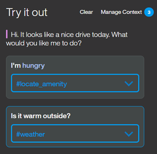
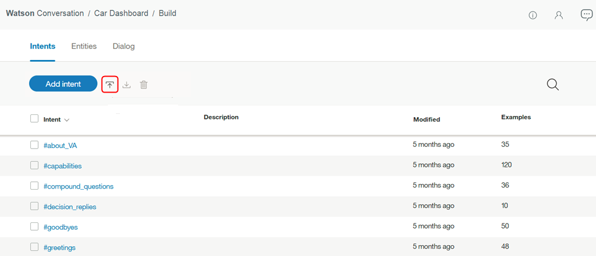

---

copyright:
  years: 2015, 2019
lastupdated: "2019-08-06"

keywords: intent, intent conflicts, annotate

subcollection: assistant

---

{:shortdesc: .shortdesc}
{:new_window: target="_blank"}
{:deprecated: .deprecated}
{:important: .important}
{:note: .note}
{:tip: .tip}
{:pre: .pre}
{:codeblock: .codeblock}
{:screen: .screen}
{:javascript: .ph data-hd-programlang='javascript'}
{:java: .ph data-hd-programlang='java'}
{:python: .ph data-hd-programlang='python'}
{:swift: .ph data-hd-programlang='swift'}

# Definizione di intenti
{: #intents}

Gli ***Intenti*** sono scopi o obiettivi espressi nell'input di un cliente, come rispondere a una domanda o elaborare un pagamento di una fattura. Riconoscendo l'intento espresso nell'input di un cliente, il servizio {{site.data.keyword.conversationshort}} può scegliere il flusso di dialogo corretto per rispondere.
{: shortdesc}

<iframe class="embed-responsive-item" id="youtubeplayer" title="Utilizzo degli intenti" type="text/html" width="640" height="390" src="https://www.youtube.com/embed/OPdOCUPGMIQ" frameborder="0" webkitallowfullscreen mozallowfullscreen allowfullscreen> </iframe>

## Panoramica sulla creazione degli intenti
{: #intents-described}

- Pianifica gli intenti per la tua applicazione.

  Cosa potrebbero voler fare i tuoi clienti e cosa vuoi che sia in grado di gestire la tua applicazione al loro posto. Ad esempio, potresti volere che la tua applicazione aiuti i tuoi clienti ad effettuare un acquisto. Se è così, puoi aggiungere un intento `#buy_something`. (Il `#` che viene aggiunto come prefisso al nome dell'intento consente di identificarlo chiaramente come un intento.)

- Informa Watson dei tuoi intenti.

  Dopo aver deciso quali richieste di business vuoi che la tua applicazione gestisca per i tuoi clienti, devi comunicarle a Watson. Per ogni obiettivo di business (ad esempio `#buy_something`), devi fornire almeno 5 esempi di espressioni che i tuoi clienti utilizzano normalmente per indicare il proprio obiettivo. Ad esempio, `I want to make a purchase.`
  
  Idealmente, trova degli esempi di espressioni utente reali che puoi estrarre da processi di business esistenti. Gli esempi utente dovrebbero venire personalizzati per il tuo business specifico. Ad esempio, se sei una compagnia di assicurazioni, un esempio utente potrebbe essere simile a questo, `I want to buy a new XYZ insurance plan.`
  
  Gli esempi che fornisci vengono utilizzati dal tuo assistente per creare un modello di machine learning che può riconoscere gli stessi tipi di espressioni o tipi simili e associarli all'intento appropriato.

Inizia con pochi intenti e verificali mentre espandi in modo iterativo l'ambito dell'applicazione.

 se già hai le trascrizioni delle chat da un call center o dalle richieste del cliente che hai raccolto da un'applicazione online, inserisci tali dati in modo che lavorino per tuo conto. Condividi le espressioni del cliente reali con Watson e lasciagli consigliare gli intenti e gli esempi utente dell'intento migliori per le tue esigenze. Per ulteriori dettagli, vedi [Ottieni supporto nella definizione degli intenti](/docs/services/assistant?topic=assistant-intent-recommendations).

## Creazione di intenti
{: #intents-create-task}

1.  Apri la tua capacità di dialogo. La capacità si apre nella pagina **Intenti**.

1.  Seleziona **Crea intento**.

1.  Nel campo **Nome intento**, immetti un nome per l'intento.
    - Il nome intento può contenere lettere (in Unicode), caratteri di sottolineatura, trattini e punti.
    - Il nome non può contenere `..` o qualsiasi altra stringa di soli punti.
    - I nomi intento non possono contenere spazi e non devono superare i 128 caratteri. Di seguito sono riportati degli esempi di nomi intento:
        - `#weather_conditions`
        - `#pay_bill`
        - `#escalate_to_agent`

    Un simbolo cancelletto `#` viene automaticamente anteposto al nome intento per aiutare a identificare il termine come un intento. Non è necessario aggiungerlo.
    {: tip}

    Facoltativamente aggiungi una descrizione dell'intento nel campo **Descrizione**.

1.  Seleziona **Crea intento** per salvare il tuo nome intento.

    

1.  Successivamente, nel campo **Aggiungi esempio utente**, immetti il testo di un esempio utente per l'intento. Un esempio può essere qualsiasi stringa composta da un massimo di 1024 caratteri. Le seguenti espressioni possono essere degli esempi per l'intento `#pay_bill`:
    - `I need to pay my bill.`
    - `Pay my account balance`
    - `make a payment`

    Per ulteriori informazioni sull'impatto di includere dei riferimenti alle entità nei tuoi esempi utente, vedi [Come vengono trattati i riferimenti entità](#intents-entity-references).
    {: tip}

    I nomi intento e il testo di esempio possono essere esposti negli URL quando un'applicazione interagisce con {{site.data.keyword.conversationshort}}. Non includere informazioni sensibili o personali in queste risorse.
    {: important}

1.  Fai clic su **Aggiungi esempio** per salvare l'esempio utente.

1.  Ripeti lo stesso processo per aggiungere altri esempi.

    Fornisci almeno cinque esempi per ogni intento.
    {: important}

     Per ottenere supporto sulla creazione dell'esempio utente, vedi [Ottieni i consigli sull'esempio utente dell'intento](/docs/services/assistant?topic=assistant-intent-recommendations#intent-recommendations-get-example-recommendations).

1.  Quando hai terminato di aggiungere gli esempi, fai clic sulla  per completare la creazione dell'intento.

Il sistema inizia ad addestrarsi sugli esempi utente e di intento che hai aggiunto.

## Come vengono trattate le entità
{: #intents-entity-references}

Quando includi una citazione dell'entità in un esempio utente, il modello di machine learning utilizza le informazioni in diversi modi in questi scenari:

- [Riferimento ai sinonimi e ai valori dell'entità negli esempi di intento](#intents-related-entities)
- [Citazioni annotate](#intents-annotated-mentions)
- [Riferimento diretto a un nome dell'entità in un esempio di intento](#intents-entity-as-example)

### Riferimento ai sinonimi e ai valori dell'entità negli esempi di intento
{: #intents-related-entities}

Se hai definito o prevedi di definire entità correlate a questo intento, fai riferimento ai sinonimi e ai valori dell'entità in alcuni esempi. In questo modo consenti di stabilire una relazione tra l'intento e le entità. Si tratta di una relazione debole ma fornisce informazioni al modello.


*Importante*:

  - I dati di esempio dell'intento devono essere dati rappresentativi e tipici che vengono forniti dai tuoi utenti. Gli esempi possono essere raccolti dai dati utente effettivi o da persone esperte nel campo specifico. La natura rappresentativa e accurata dei dati è importante.
  - Sia i dati di addestramento che quelli di test (per scopi valutativi) devono riflettere la distribuzione degli intenti nell'utilizzo reale. In genere, intenti più frequenti hanno relativamente più esempi e una miglior copertura della risposta.
  - Puoi includere la punteggiatura nel punteggiatura purché sembri naturale. Se credi che alcuni utenti esprimono i loro intenti con esempi che includono la punteggiatura mentre altri non lo faranno, includi entrambe le versioni. In genere, maggiore è la copertura per i diversi modelli, migliore è la risposta.

### Citazioni annotate
{: #intents-annotated-mentions}

Dopo aver definito le entità, puoi annotare le citazioni dell'entità direttamente dai tuoi esempi utente dell'intento esistenti. Una relazione che identifichi in questo modo tra l'intento e l'entità *non* viene utilizzata dal modello di classificazione dell'intento. Tuttavia, quando aggiungi la citazione all'entità, viene anche aggiunta a tale entità come un nuovo valore. E quando aggiungi la citazione a un valore dell'entità esistente, viene anche aggiunta a tale valore dell'entità come un nuovo sinonimo. La classificazione degli intenti utilizza questi tipi di riferimenti del dizionario negli esempi utente di intento per stabilire un riferimento debole tra un intento e un'entità.

Per ulteriori informazioni sulle entità contestuali, vedi [Aggiunta di entità contestuali](/docs/services/assistant?topic=assistant-entities#entities-create-annotation-based).

### Riferimento diretto a un nome dell'entità in un esempio di intento
{: #intents-entity-as-example}

Questo approccio è avanzato. Se utilizzato, lo deve essere in modo coerente.
{: note}

Puoi scegliere di fare direttamente riferimento alle entità nei tuoi esempi di intento. Ad esempio, diciamo che hai un'entità denominata `@PhoneModelName`, che contiene i valori *Galaxy S8*, *Moto Z2*, *LG G6* e *Google Pixel 2*. Quando crei un intento, ad esempio `#order_phone`, puoi quindi fornire i dati di addestramento come segue:

- Come posso procurarmi un `@PhoneModelName`?
- Aiutami a ordinare un `@PhoneModelName`.
- `@PhoneModelName` è disponibile?
- Aggiungi un `@PhoneModelName` al mio ordine.


Attualmente, puoi fare direttamente riferimento solo a entità sinonimo che hai definito (i valori modello vengono ignorati). Non puoi utilizzare le [entità di sistema](/docs/services/assistant?topic=assistant-system-entities).

Se scegli di fare riferimento ad un'entità come a un esempio di intento (ad esempio, `@PhoneModelName`) *ovunque* nei dati di addestramento, verrà annullato il valore dell'utilizzo di un riferimento diretto (ad esempio, *Galaxy S8*) in un esempio di intento dappertutto. Tutti gli intenti utilizzeranno poi l'approccio entità come esempio di intento. Non puoi applicare questo approccio solo a un intento specifico.
{: important}

In pratica significa che se hai precedentemente eseguito l'addestramento della maggior parte dei tuoi intenti in base ai riferimenti diretti (*Galaxy S8*) e ora utilizzi i riferimenti di entità (`@PhoneModelName`) solo per un intento, la modifica influisce sui tuoi precedenti addestramenti. Se scegli di utilizzare i riferimenti `@Entity`, devi sostituire tutti i precedenti riferimenti diretti con i riferimenti `@Entity`.

La definizione di un intento di esempio con un `@Entity` che ha 10 valori definiti per esso **non** equivale a specificare 10 volte tale esempio di intento. Il servizio {{site.data.keyword.conversationshort}} non dà molta importanza a tale sintassi dell'intento di esempio.

## Test degli intenti
{: #intents-test}

Dopo aver finito di creare i nuovi intenti, puoi testare il sistema per vedere se riconosce i tuoi intenti nel modo previsto.

1.  Fai clic sull'icona .

1.  Nel riquadro "Try it out" immetti una domanda o un'altra stringa di testo e premi Invio per vedere quale intento viene riconosciuto. Se viene riconosciuto l'intento errato, puoi migliorare il tuo modello aggiungendo questo testo come esempio all'intento corretto.

    Se di recente hai apportato delle modifiche nella tua capacità, potresti visualizzare un messaggio che indica che il sistema è ancora in fase di addestramento. Se visualizzi questo messaggio, attendi che l'addestramento venga completato prima di eseguire il test:
    {: tip}

    

    La risposta indica quale intento è stato riconosciuto dal tuo input.

    

1.  Se il sistema non riconosce l'intento corretto, puoi correggerlo. Per correggere l'intento riconosciuto, seleziona l'intento visualizzato e quindi seleziona l'intento corretto dall'elenco. Dopo aver inviato la tua correzione, il sistema si riaddestra automaticamente per incorporare i nuovi dati.

    

1.  {: #intents-mark-irrelevant}Se l'input non è correlato ad alcun intento nella tua applicazione, puoi istruire il tuo assistente selezionando l'intento visualizzato e poi facendo clic su **Contrassegna come irrilevante**.

    

    Per ulteriori informazioni su questa azione, vedi [Istruisci il tuo assistente sugli argomenti da ignorare](/docs/services/assistant?topic=assistant-logs#logs-mark-irrelevant).

Se i tuoi intenti non vengono riconosciuti correttamente, puoi apportare i seguenti tipi di modifiche:

- Aggiungere il testo non riconosciuto come esempio all'intento corretto.
- Spostare gli esempi esistenti da un intento a un altro.
- Valutare se i tuoi intenti sono troppo simili e ridefinirli come appropriato.

## Punteggio assoluto
{: #intents-absolute-scoring}

Il servizio {{site.data.keyword.conversationshort}} calcola i punteggi di attendibilità di ogni intento indipendentemente, non in relazione ad altri intenti. Questo approccio aggiunge flessibilità; possono essere rilevati più intenti in un solo input utente. Significa anche che il sistema potrebbe non restituire alcun intento. Se l'intento principale ha un basso punteggio di affidabilità (meno dello 0,2), l'intento principale viene incluso nell'array di intenti restituito dall'API, ma tutti i nodi con una condizione sull'intento non vengono attivati. Se desideri rilevare quando non vengono rilevati intenti con dei buoni punteggi di affidabilità, utilizza la condizione speciale `irrelevant` nel tuo nodo di dialogo. Per ulteriori informazioni, vedi [Condizioni speciali](/docs/services/assistant?topic=assistant-dialog-overview#dialog-overview-special-conditions).

Poiché i punteggi di affidabilità dell'intento cambiano, i tuoi dialoghi potrebbero richiedere una ristrutturazione. Ad esempio, se un nodo di dialogo utilizza un intento nella propria condizione e il punteggio di affidabilità dell'intento inizia ad essere costantemente al di sotto dello 0,2, il nodo di dialogo interrompe l'elaborazione. Se il punteggio di attendibilità cambia, anche il comportamento del dialogo può cambiare a sua volta.

## Limiti di intenti
{: #intents-limits}

Il numero di intenti ed esempi che puoi creare dipende dal tuo tipo di piano {{site.data.keyword.conversationshort}}:

|Piano| Intenti per capacità | Esempi per capacità |
|------------------|------------------:|-------------------:|
| Premium          |             2.000 |             25.000 |
| Plus             |             2.000 |             25.000 |
| Standard         |             2.000 |             25.000 |
| Lite, Plus Trial |               100 |             25.000 |
{: caption="Dettagli del piano" caption-side="top"}

## Modifica degli intenti
{: #intents-edit}

Puoi fare clic su qualsiasi intento nell'elenco per aprirlo per la modifica. Puoi apportare le seguenti modifiche:

- Rinominare l'intento.
- Eliminare l'intento.
- Aggiungere, modificare o eliminare gli esempi.
- Spostare un esempio in un intento diverso.

Puoi passare da un nome intento a ogni esempio e, se lo desideri, modificare gli esempi.

Per spostare o eliminare un esempio, fai clic sulla casella di spunta associata con esso e poi fai clic su **Sposta** o **Elimina**.

  

## Ricerca degli intenti
{: #intents-search}

Utilizza la funzione Ricerca per trovare gli esempi utente, i nomi intento e le descrizioni.

1.  Dalla pagina **Intenti**, fai clic sull'icona Ricerca.

    

1.  Immetti una frase o un termine di ricerca.

    

Vengono visualizzati gli intenti che contengono il tuo termine di ricerca e gli esempi corrispondenti.

  

## Esportazione di intenti
{: #intents-export}

Puoi esportare una serie di intenti in un file CSV in modo da poterli importare e riutilizzare in un'altra applicazione {{site.data.keyword.conversationshort}}.

1.  Dalla pagina **Intenti**, seleziona gli intenti desiderati dall'elenco e fai clic su **Esporta**.

    

## Importazione di intenti ed esempi
{: #intents-import}

Se hai un numero elevato di intenti ed esempi, è più facile importarli da un file CSV (comma-separated value) anziché definirli uno ad uno. Assicurati di rimuovere tutti i dati personali dagli esempi utente che includi nel file.

In alternativa, puoi caricare un file con delle espressioni utente non elaborate (ad esempio dai log del call center) e lascia che Watson trovi dei candidati per gli esempi utente dai dati. Per ulteriori informazioni, vedi [Aggiunta degli esempi dai file di log](/docs/services/assistant?topic=assistant-intent-recommendations#intent-recommendations-get-example-recommendations). Questa funzione è disponibile solo per gli utenti del piano Plus o Premium.

1.  Raccogli gli intenti ed esempi in un file CSV o esportali da un foglio di calcolo in un file CSV. Il formato richiesto per ogni riga nel file è il seguente:

    ```
    <example>,<intent>
    ```
    {: screen}

    dove `<example>` è il testo di un esempio utente e `<intent>` è il nome dell'intento che vuoi che corrisponda all'esempio. Ad esempio:

    ```
    Tell me the current weather conditions.,weather_conditions
    Is it raining?,weather_conditions
    What's the temperature?,weather_conditions
    Where is your nearest location?,find_location
    Do you have a store in Raleigh?,find_location
    ```
    {: screen}

    **Importante:** salva il file CSV con la codifica UTF-8 e nessun contrassegno di ordine di byte (BOM).

1.  Dalla pagina **Intenti**, fai clic sull'icona *Importa*  e trascina un file oppure seleziona un file dal tuo computer.

    

    **Importante:** la dimensione massima del file CSV è 10 MB. Se il tuo file CSV è più grande, potresti suddividerlo in più file e importarli separatamente.

    Il file viene convalidato e importato e il sistema comincia ad addestrarsi sui nuovi dati.

Puoi visualizzare gli intenti importati e gli esempi corrispondenti sulla scheda **Intenti**. Per vedere i nuovi intenti ed esempi potresti dover aggiornare la pagina.

## Risoluzione dei conflitti degli intenti 
{: #intents-resolve-conflicts}

Questa funzione è disponibile solo per gli utenti Plus o Premium.
{: note}

L'applicazione {{site.data.keyword.conversationshort}} rileva un conflitto quando due o più esempi di intento in intenti *separati* sono talmente simili che {{site.data.keyword.conversationshort}} fa confusione su quale intento utilizzare.

Per risolvere i conflitti:

1.  Dalla pagina **Intenti**, rivedi tutti gli intenti con conflitti.

    

    Attiva lo switch **Mostra solo i conflitti** per visualizzare un elenco di soltanto i tuoi intenti con conflitti.
    {: tip}

    

1.  Apri un conflitto di intenti. Per l'esempio di intento che sta provocando il conflitto, fai clic su **Risolvi conflitto**.

    

1.  Ora, hai l'opzione di spostare un esempio in conflitto su un altro intento oppure di eliminarlo completamente.

    In questo caso, gli esempi `Cancel my order` e `I want to cancel my order` vengono visualizzati sia nell'intento `#cancel` che `#eCommerce_Cancel_Product_Order`.

    

    Ulteriori esempi utente sono gli esempi di addestramento che non sono necessariamente in conflitto, ma sono simili agli esempi in conflitto. Vengono mostrati per fornire del contesto per aiutarti a risolvere il conflitto.

1.  Seleziona gli esempi `Cancel  my order` e `I want to cancel my order` e spostali dall'intento `#cancel` all'intento `#eCommerce_Cancel_Product_Order`:

    

1.  Quando decidi dove posizionare un esempio, ricerca l'intento che dispone di sinonimi o di esempi quasi sinonimi.

    Mantieni ogni intento distinto e focalizzato possibilmente su un solo obiettivo. Se hai due intenti con più esempi utente che si sovrappongono, forse non hai bisogno di due intenti separati. Puoi spostare o eliminare gli esempi utente che non si sovrappongono direttamente in un intento e poi eliminare l'altro intento.
    {: tip}

    Seleziona gli altri esempi nell'intento `#cancel` ed eliminali:

    

1.  Fai clic sul pulsante **Inoltra** per risolvere i conflitti:

    

    L'opzione *Reimposta* ti consente di ricominciare a spostare l'esempio in conflitto insieme agli intenti. *Annulla* ti riporta alla pagina dell'intento.

Hai risolto un conflitto e puoi continuare a controllare gli altri intenti con dei conflitti.

Guarda questo video per ulteriori informazioni.

<iframe class="embed-responsive-item" id="youtubeplayer0" title="Panoramica sulla risoluzione del conflitto degli intenti" type="text/html" width="640" height="390" src="https://www.youtube.com/embed/9gQtjCBxjdc?rel=0" frameborder="0" webkitallowfullscreen mozallowfullscreen allowfullscreen> </iframe>

## Eliminazione di intenti
{: #intents-delete}

Puoi selezionare una serie di intenti da eliminare.

**IMPORTANTE**: eliminando gli intenti elimini anche tutti gli esempi associati e questi elementi non potranno più essere recuperati. Tutti i nodi di dialogo che fanno riferimento a questi intenti devono essere aggiornati manualmente per non fare più riferimento al contenuto eliminato.

1.  Dalla pagina **Intenti**, seleziona gli intenti desiderati dall'elenco e fai clic su **Elimina**.

    
