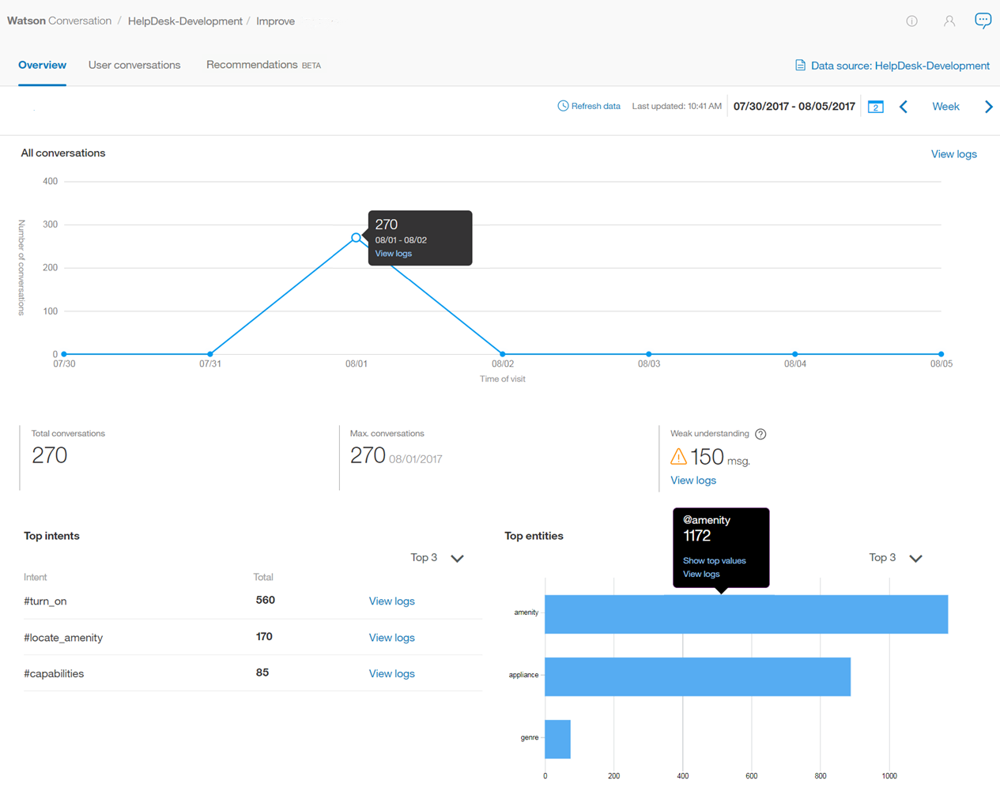

---

copyright:
  years: 2015, 2019
lastupdated: "2019-05-28"

subcollection: assistant

---

{:shortdesc: .shortdesc}
{:new_window: target="_blank"}
{:deprecated: .deprecated}
{:important: .important}
{:note: .note}
{:tip: .tip}
{:pre: .pre}
{:codeblock: .codeblock}
{:screen: .screen}
{:javascript: .ph data-hd-programlang='javascript'}
{:java: .ph data-hd-programlang='java'}
{:python: .ph data-hd-programlang='python'}
{:swift: .ph data-hd-programlang='swift'}

# Panoramica sulle metriche
{: #logs-overview}

La pagina Panoramica fornisce un riepilogo delle interazioni tra gli utenti e il tuo assistente. Puoi visualizzare la quantità di traffico per un determinato periodo di tempo, nonché gli intenti e le entità che sono stati riconosciuti più spesso nelle conversazioni degli utenti.
{: shortdesc}

Utilizza le metriche per rispondere a domande come:

* In quali giorni c'è stato il numero maggiore o inferiore di conversazioni nell'ultimo mese?
* Qual è stato il numero medio di conversazioni settimanali durante l'ultimo mese?
* Quali intenti sono apparsi più spesso la scorsa settimana?
* Quali valori di entità sono stati riconosciuti più volte durante il mese di febbraio?

Per visualizzare le informazioni sulle metriche, seleziona **Panoramica** nella barra di navigazione.

  

## Controlli
{: #logs-overview-controls}

Puoi utilizzare i seguenti controlli per filtrare le informazioni:

- Filtri *Intenti* e *Entità* - Utilizza entrambi questi filtri a discesa per mostrare i dati per un'entità o un intento specifico nella tua capacità.

  **Importante** - I filtri di intenti e entità vengono popolati dagli intenti e le entità nella ***capacità*** e non da quello che si trova nell'origine dati. Se hai [selezionato un'origine dati](/docs/services/assistant?topic=assistant-logs#logs-deploy-id) diversa dalla capacità, potresti non vedere un intento o una entità dai tuoi log dell'origine dati come un'opzione nei filtri, a meno che anche tali intenti ed entità non siano nella capacità.

- *Aggiorna dati* - Ti consente di aggiornare immediatamente le statistiche della pagina Panoramica. La pagina Panoramica mostra quando sono stati aggiornati l'ultima volta i dati visualizzati. Puoi selezionare **Aggiorna dati** se pensi che potrebbero essere disponibili dati più recenti.

  Le statistiche rappresentano il traffico esterno (da utenti o chiamate API) che ha interagito con il tuo assistente; non includono le interazioni dal riquadro *Try it out* nello strumento.

- *Controllo del periodo di tempo* - Utilizza questo controllo per scegliere il periodo per il quale vengono visualizzati i dati. Questo controllo riguarda tutti i dati visualizzati nella pagina: non solo il numero di conversazioni visualizzate nel grafico, ma anche le statistiche visualizzate insieme al grafico e gli elenchi di intenti ed entità principali.

  Le statistiche possono coprire un periodo di tempo più lungo rispetto a quello in cui vengono conservati i log delle conversazioni.
  {: note}

  

  Puoi scegliere se visualizzare i dati per un singolo giorno, una settimana, un mese o un trimestre. In ogni caso, i punti dati sul grafico si adattano ad un periodo di misurazione appropriato. Ad esempio, quando si visualizza un grafico per un giorno, i dati vengono presentati in valori orari, ma quando si visualizza un grafico per una settimana, i dati vengono visualizzati per giorno. Una settimana va sempre da domenica a sabato. Non puoi creare periodi di tempo personalizzati, ad esempio una settimana che va dal giovedì al mercoledì successivo o un mese che inizia in un giorno diverso dal primo.

  Se ad esempio scegli una vista di un singolo giorno, l'ora mostrata per ogni conversazione viene localizzata per rispecchiare il fuso orario del tuo browser. Questo può scostarsi dalla data/ora mostrata se controlli lo stesso log di conversazione tramite una chiamata API; le chiamate di log API vengono sempre mostrate in UTC.

    

## Grafici e statistiche
{: #logs-overview-graphs}

Diverse scorecard statistiche forniscono i dati di log per la tua applicazione:

* *Numero totale di conversazioni* - Il numero totale di conversazioni tra gli utenti attivi e la tua applicazione, durante il periodo di tempo selezionato, come mostrato nel grafico corrispondente.

  Una singola conversazione è una serie di messaggi composta dai messaggi che un utente attivo invia alla tua applicazione e i messaggi con cui risponde la tua applicazione.

  **Importante**: per 'conversazione' si intende una *qualsiasi* serie di messaggi inviati o ricevuti da un'applicazione/bot, per cui se il tuo assistente inizia dicendo "Hi, how can I help you?"e l'utente chiude il proprio browser senza rispondere, tale messaggio viene incluso nel numero totale di conversazioni.

* *Media di messaggi per conversazione* - Il totale dei messaggi ricevuti durante il periodo di tempo selezionato diviso il totale di conversazioni durante il periodo di tempo selezionato, come mostrato nel grafico corrispondente.
* *Numero massimo di conversazioni* - Il numero massimo di conversazioni per un singolo punto dati nel periodo di tempo selezionato.
* *Scarsa comprensione* - Il numero di singoli messaggi con scarsa comprensione. Questi messaggi non sono classificati da un intento e non contengono alcuna entità nota. Queste possono essere utili per identificare potenziali problemi di dialogo.

I grafici dettagliati forniscono delle ulteriori informazioni:

* *Numero totale di conversazioni* - Il numero totale di conversazioni tra gli utenti attivi e la tua applicazione, durante il periodo di tempo selezionato.

  Durante la visualizzazione del grafico ***Conversazioni***, puoi fare clic su un singolo punto dati per visualizzare il valore numerico, come mostrato qui:

  

* *Media di messaggi per conversazione* - Il totale dei messaggi ricevuti durante il periodo di tempo selezionato diviso il totale di conversazioni durante il periodo di tempo selezionato.
* *Messaggi totali* - Il numero totale di messaggi ricevuti dagli utenti attivi nel periodo di tempo selezionato.
* *Utenti attivi* - Il numero di utenti univoci che hanno interagito con la tua applicazione nel periodo di tempo selezionato.
* *Media di conversazioni per utente* - Il totale delle conversazioni durante il periodo di tempo totale diviso il totale di utenti univoci durante il periodo di tempo selezionato.

  Le statistiche per *Utenti attivi* e *Media di conversazioni per utente* richiedono un parametro `user_id` univoco. Per ulteriori informazioni, vedi [Abilitazione delle metriche utente](/docs/services/assistant?topic=assistant-logs-resources#logs-resources-user-id).
  {: important}

## Intenti principali ed entità principali
{: #logs-overview-tops}

Puoi anche visualizzare gli intenti e le entità che sono stati riconosciuti più spesso durante il periodo di tempo specificato.

* *Intenti principali* - Gli intenti sono mostrati in un elenco semplice. Oltre a vedere il numero di volte in cui è stato riconosciuto un intento, puoi selezionare un intento per aprire la pagina **Conversazioni utente** con l'intervallo di date filtrato per corrispondere ai dati che stai visualizzando e l'intento filtrato per corrispondere all'intento selezionato.

* Anche le *Entità principali* vengono mostrate in un elenco. Per ogni entità puoi effettuare una selezione dalla colonna **Valori** per visualizzare un elenco dei valori più comuni identificati per questa entità durante il periodo di tempo. Puoi anche selezionare un'entità per aprire la pagina **Conversazioni utente** con l'intervallo di date filtrato per corrispondere ai dati che stai visualizzando e l'entità filtrata per corrispondere all'entità selezionata.

Vedi [Migliora la tua capacità](/docs/services/assistant?topic=assistant-logs) per suggerimenti su come modificare gli intenti e le entità in base a cosa hai individuato controllando gli intenti e le entità riconosciuti dal tuo assistente.
