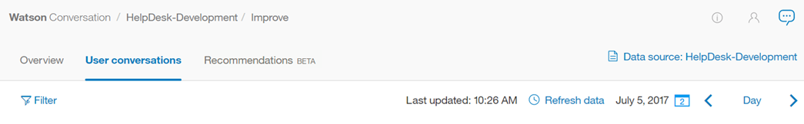

---

copyright:
  years: 2015, 2018
lastupdated: "2018-02-13"

---

{:shortdesc: .shortdesc}
{:new_window: target="_blank"}
{:tip: .tip}
{:pre: .pre}
{:codeblock: .codeblock}
{:screen: .screen}
{:javascript: .ph data-hd-programlang='javascript'}
{:java: .ph data-hd-programlang='java'}
{:python: .ph data-hd-programlang='python'}
{:swift: .ph data-hd-programlang='swift'}

# Informazioni sul componente Migliora

Il componente Migliora di {{site.data.keyword.conversationshort}} fornisce una cronologia delle interazioni con gli utenti del tuo spazio di lavoro. Puoi utilizzare questa cronologia per migliorare la comprensione dello spazio di lavoro degli input degli utenti.
{: shortdesc}

Sezioni del pannello **Migliora**:

* [Panoramica](logs_oview.html): un riepilogo delle interazioni degli utenti con uno spazio di lavoro.
* [Conversazioni utente](logs_convo.html): un elenco di espressioni utente. Puoi aggiornare intenti ed entità durante la visualizzazione di una singola espressione utente. **Nota**: una singola conversazione utente può essere composta da più espressioni. 
* [Suggerimenti](logs_recommend.html): modi per migliorare il tuo sistema. Disponibile solo per gli utenti Premium.

## Miglioramento tra spazi di lavoro
{: #deploy_id}

Per comprendere come utilizzare i dati di espressione per apportare miglioramenti tra gli spazi di lavoro, è utile riesaminare le seguenti definizioni associate al servizio {{site.data.keyword.conversationshort}}:

* ***Istanza***: la tua distribuzione di {{site.data.keyword.conversationshort}}, accessibile con credenziali univoche. Un'istanza {{site.data.keyword.conversationshort}} può essere composta da più spazi di lavoro. 
* ***Spazio di lavoro***: uno spazio di lavoro è un modello del tuo contenuto {{site.data.keyword.conversationshort}}; spesso, può equivalere ad un bot
* ***ID spazio di lavoro***: l'identificativo univoco di uno spazio di lavoro. 
* ***ID distribuzione***: gli ID distribuzione sono etichette univoche che vengono passate con le espressioni utente per un aiuto nell'identificazione dell'ambiente di distribuzione da cui provengono le espressioni. 
* ***Espressione***: un'espressione è un singolo messaggio inviato da un utente allo spazio di lavoro. 

La creazione di uno spazio di lavoro è un processo molto interattivo. Mentre sviluppi lo spazio di lavoro, utilizza il riquadro *Provalo* per verificare che il tuo spazio di lavoro riconosca intenti ed entità corretti negli input di test e per apportare le correzioni necessarie. 

Nel pannello **Migliora**, puoi visualizzare le informazioni sulle interazioni effettive con i tuoi utenti e apportare correzioni simili per migliorare l'accuratezza con cui gli intenti e le entità vengono riconosciuti dal tuo spazio di lavoro. È difficile sapere esattamente *come* i tuoi utenti porranno le domande o quali espressioni casuali potrebbero creare, quindi è importante visitare frequentemente il pannello **Migliora** per migliorare i tuoi spazi di lavoro. 

Per un'istanza {{site.data.keyword.conversationshort}} che include più spazi di lavoro, potrebbero verificarsi casi in cui è utile utilizzare i dati di espressione provenienti da uno spazio di lavoro per migliorarne un altro in quella stessa istanza. **Nota**: se sei un utente {{site.data.keyword.conversationshort}} Premium, le tue istanze premium possono essere facoltativamente configurate per consentire l'accesso ai dati di log dagli spazi di lavoro tra diverse istanze premium.

Ad esempio, diciamo che hai un'istanza {{site.data.keyword.conversationshort}} denominata *HelpDesk*. Nella tua istanza HelpDesk potresti avere sia uno spazio di lavoro Produzione che uno spazio di lavoro Sviluppo. Quando lavori nello spazio di lavoro Sviluppo, puoi filtrare le espressioni basate sull'`ID distribuzione` per lo spazio di lavoro Produzione, in questo modo stai utilizzando le espressioni dello spazio di lavoro Produzione per migliorare il tuo spazio di lavoro Sviluppo. 



Le modifiche che poi apporti all'interno dello spazio di lavoro Sviluppo influiranno solo su questo spazio di lavoro anche se stai utilizzando le espressioni dello spazio di lavoro Produzione. Per ulteriori informazioni, vedi [Selezione di un'origine dati](logs_convo.html#select-source).

Per specificare l'ID distribuzione per un'espressione inviata utilizzando l'API `/message`, includi la proprietà di distribuzione all'interno dell'oggetto metadati nel tuo [contesto ](https://www.ibm.com/watson/developercloud/conversation/api/v1/#send_message){: new_window}, come in questo esempio:

```
"context" : {
  "username" : "jane_doe@myemail.com",
  "member_type" : "gold",
  "metadata" : {
       "deployment": "HelpDesk-Production"
  }
}
```
{: #codeblock}
