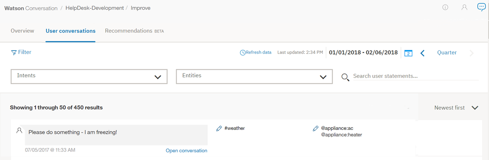
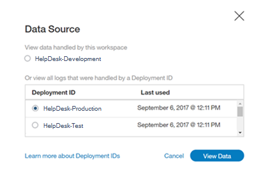
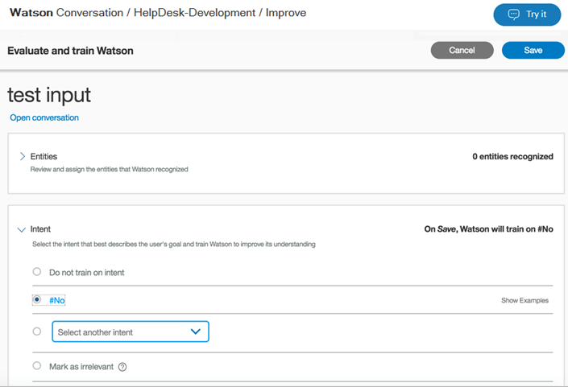

---

copyright:
  years: 2015, 2018
lastupdated: "2018-02-13"

---

{:shortdesc: .shortdesc}
{:new_window: target="_blank"}
{:tip: .tip}
{:pre: .pre}
{:codeblock: .codeblock}
{:screen: .screen}
{:javascript: .ph data-hd-programlang='javascript'}
{:java: .ph data-hd-programlang='java'}
{:python: .ph data-hd-programlang='python'}
{:swift: .ph data-hd-programlang='swift'}

# Utilizzo delle conversazioni
{: #logs_convo}

Per aprire un elenco di interazioni tra gli utenti e il tuo spazio di lavoro, seleziona **Conversazioni utente** nella barra di navigazione. Se **Conversazioni utente** non è visibile, utilizza il menu  per aprire la pagina.
{: shortdesc}

Quando apri la pagina **Conversazioni utente**, la vista predefinita elenca i risultati per l'ultimo giorno, con i risultati più recenti per primi. Sono disponibili i valori di intenti principali (#intent) e qualsiasi entità riconosciuta (@entity) utilizzati in un messaggio e il testo del messaggio. Per gli intenti che non sono riconosciuti, il valore mostrato è *Irrilevante*. Se un'entità non è riconosciuta o non è stata fornita, il valore mostrato è *Nessuna entità trovata*.

È importante notare che la pagina **Conversazioni utente** visualizza il numero totale di *espressioni* tra gli utenti e il tuo spazio di lavoro. Un'espressione è un singolo messaggio che l'utente invia allo spazio di lavoro. Ogni conversazione può essere composta da più espressioni. Pertanto, il numero di risultati nella pagina **Conversazioni utente** è diverso dal numero di conversazioni mostrato nella pagina [Panoramica](logs_oview.html).

## Limiti di log
{: #log-limits}

La durata prevista per la conservazione dei messaggi dipende dal tuo piano di servizio {{site.data.keyword.conversationshort}}:

  Piano di servizio                    | Conservazione messaggi di chat
  ------------------------------------ | ------------------------------------
  Premium                              | Ultimi 90 giorni
  Standard                             | Ultimi 30 giorni
  Lite                                 | Ultimi 7 giorni

## Selezione di un'origine dati
{: #select-source}

Per impostazione predefinita, la pagina **Conversazioni utente** mostra i dati di espressione per lo spazio di lavoro corrente. Tuttavia, è possibile che a volte sia utile migliorare uno spazio di lavoro con le espressioni inviate ad altri spazi di lavoro all'interno della tua istanza. Ad esempio, potresti avere più versioni degli spazi di lavoro di produzione e di quelli di sviluppo; puoi utilizzare gli stessi dati di espressione per migliorare uno qualsiasi di questi spazi di lavoro. 

Quando passi ad un'altra origine dati, il servizio {{site.data.keyword.conversationshort}} controlla le espressioni alla ricerca di un elemento denominato `ID distribuzione`. Gli ID distribuzione sono identificativi univoci nell'API di servizio {{site.data.keyword.conversationshort}} che hai aggiunto alle tue chiamate API message. Per informazioni sull'aggiunta degli ID distribuzione alle chiamate message, vedi [Miglioramento tra spazi di lavoro](logs.html#deploy_id).

Per popolare la sezione Migliora utilizzando le espressioni con un determinato ID distribuzione: 

1.  Seleziona **Origine dati:**
    
1.  Seleziona una distribuzione
    
1.  Fai clic su **Visualizza dati**

Ora viene visualizzata l'origine dati selezionata. 

**Nota:** mentre **Origine dati:** ora mostra l'origine delle espressioni che stai utilizzando per migliorare questo spazio di lavoro, la parte superiore della pagina mostra ancora lo spazio di lavoro a cui stai applicando le modifiche. 

In questo esempio, la pagina Migliora viene popolata con le espressioni che hanno l'ID distribuzione `HelpDesk-Production` incluso nelle loro chiamate API message, ma se l'espressione *test input* viene aggiunta all'intento **#No** facendo clic su **Salva**, *test input* verrà aggiunto come un esempio di `#No` nello spazio di lavoro `HelpDesk-Development`.

## Filtro di espressioni

Puoi filtrare le espressioni in base ai valori *Cerca istruzioni utente*, *Intenti*, *Entità* e *Ultimi* n *giorni*:

*Cerca istruzioni utente* - Immetti una parola nella barra di ricerca. Vengono cercati gli input degli utenti ma non le risposte dello spazio di lavoro.

*Intenti* - Seleziona il menu a discesa e immetti un intento nel campo di input o scegli una voce dall'elenco. Puoi selezionare più di un intento, che filtra i risultati utilizzando uno qualsiasi degli intenti selezionati, incluso *Irrilevante*.

*Entità* - Seleziona il menu a discesa e immetti un nome entità nel campo di input o scegli una voce dall'elenco. Puoi selezionare più di un'entità, che filtra i risultati in base a una qualsiasi entità selezionata. Se filtri per intento *ed* entità, i tuoi risultati includeranno i messaggi che hanno entrambi i valori. Puoi anche filtrare i risultati con *Nessuna entità trovata*.

L'aggiornamento delle espressioni può richiedere del tempo. Attendi almeno 30 minuti dopo l'interazione dell'utente con il tuo spazio di lavoro prima di tentare di filtrare quel contenuto.

## Visualizzazione di una singola espressione
Puoi espandere ciascuna voce di espressione per vedere cosa ha detto l'utente nell'intera conversazione e come ha risposto il tuo spazio di lavoro. Per farlo, seleziona **Apri conversazione**. Vieni portato automaticamente all'espressione che hai selezionato in quella conversazione.

Puoi quindi scegliere di mostrare le classificazioni per l'espressione che hai selezionato.

## Correzione di un intento

1.  Per correggere un intento, seleziona l'icona di modifica  accanto all'#intent scelto.
1.  Dall'elenco fornito, seleziona l'intento corretto per questo input.
    - Inizia a scrivere nel campo di immissione e l'elenco di intenti verrà filtrato.
    - Puoi anche scegliere **Contrassegna come irrilevante** da questo menu. (Per ulteriori informazioni, vedi [Contrassegna come irrilevante](intents.html#mark-irrelevant).) In alternativa, puoi scegliere **Non addestrare sull'intento**, che non salva questa espressione come esempio per l'addestramento.

    
1.  Seleziona **Salva**.

    

    **Nota**: il servizio {{site.data.keyword.conversationshort}} supporta l'aggiunta di input utente come un esempio ad un intento *così com'è*. Se stai utilizzando riferimenti @entity come esempi nei tuoi dati di addestramento dell'intento e un'espressione utente che desideri salvare contiene un valore di entità o un sinonimo proveniente dai tuoi dati di addestramento, devi modificare l'espressione in un secondo momento. Una volta salvata, modifica l'espressione dalla pagina Intenti per sostituire l'entità a cui fa riferimento. Per ulteriori informazioni, vedi [Riferimento diretto a @Entity come un esempio di intento](intents.html#entity-as-example).

## Aggiunta di un valore o un sinonimo di entità

1.  Per aggiungere un valore o un sinonimo di entità, seleziona l'icona di modifica  accanto all'@entity scelta.
1.  Seleziona **Aggiungi entità**.

    
1.  Ora, seleziona una parola o una frase nell'input utente sottolineato.

    
1.  Scegli un'entità a cui la frase evidenziata verrà aggiunta come valore.
    - Inizia a scrivere nel campo di immissione e l'elenco di entità e valori verrà filtrato.
    - Per aggiungere la frase evidenziata come sinonimo di un valore esistente, scegli `@entity:value` dall'elenco a discesa. 

    
1.  Seleziona **Salva**.

    
