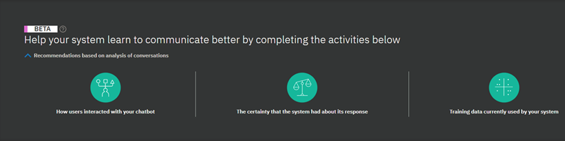
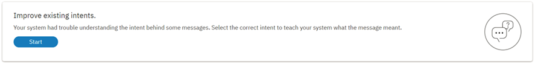

---

copyright:
  years: 2015, 2018
lastupdated: "2018-02-13"

---

{:shortdesc: .shortdesc}
{:new_window: target="_blank"}
{:tip: .tip}
{:pre: .pre}
{:codeblock: .codeblock}
{:screen: .screen}
{:javascript: .ph data-hd-programlang='javascript'}
{:java: .ph data-hd-programlang='java'}
{:python: .ph data-hd-programlang='python'}
{:swift: .ph data-hd-programlang='swift'}

# Suggerimenti
Questa pagina presenta i suggerimenti su come migliorare il tuo sistema.
{: shortdesc}

Questa funzione è solo Beta.
{: tip}

Questa funzione è disponibile solo per gli utenti Premium.
{: tip}

Analizzando le conversazioni che gli utenti hanno avuto con il tuo spazio di lavoro e tenendo conto dei dati di addestramento attuali del sistema e della certezza della risposta, ti verranno presentate le azioni che puoi intraprendere per migliorare il tuo spazio di lavoro in modo facile ed efficiente.

<iframe class="embed-responsive-item" id="youtubeplayer" type="text/html" width="640" height="390" src="https://www.youtube.com/embed/scMu66AvZtY" frameborder="0" webkitallowfullscreen mozallowfullscreen allowfullscreen> </iframe>

I suggerimenti vengono generati ogni notte e richiedono un numero elevato di messaggi utente, ad esempio oltre 50.
{: tip}

## Migliora gli intenti esistenti
Questo suggerimento implica l'estrazione di singole frasi immesse dagli utenti, che il sistema non riconosce, che poi ti vengono presentate per selezionare un intento per ogni frase. Ciò aiuterà il tuo spazio di lavoro a capire meglio cosa dicono i tuoi utenti.

Fai clic su **Avvia** per iniziare a identificare gli intenti.

Quando entri o esci dalla pagina **Migliora gli intenti esistenti**, la barra di avanzamento mostra su quante frasi sei intervenuto nella sessione corrente, rispetto alle frasi totali rimaste per la giornata. Nota che se esci e rientri, la barra di avanzamento inizierà di nuovo `vuota`, ma ciò non significa che il tuo lavoro precedente è stato perso: semplicemente non verrà conteggiato nell'avanzamento della sessione corrente. 

Seleziona l'intento migliore per una frase dall'elenco fornito o seleziona *Contrassegna come irrilevante*. Le frasi vengono aggiunte agli intenti come esempi (aggiunte come dati di addestramento) non appena fai clic su **Salva**.

Il pulsante *Passa alla successiva* ti consente di saltare la frase corrente e passare alla successiva. La frase saltata non verrà più visualizzata se esci e rientri nella pagina **Migliora intenti esistenti** durante lo stesso giorno, ma potrebbe apparire di nuovo nei giorni successivi.

