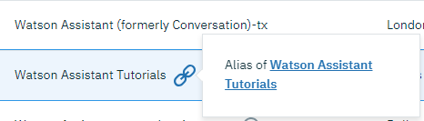

---

copyright:
  years: 2015, 2019
lastupdated: "2019-02-21"

subcollection: assistant

---

{:shortdesc: .shortdesc}
{:new_window: target="_blank"}
{:deprecated: .deprecated}
{:important: .important}
{:note: .note}
{:tip: .tip}
{:pre: .pre}
{:codeblock: .codeblock}
{:screen: .screen}
{:javascript: .ph data-hd-programlang='javascript'}
{:java: .ph data-hd-programlang='java'}
{:python: .ph data-hd-programlang='python'}
{:swift: .ph data-hd-programlang='swift'}

# Migrazione
{: #migrate}

Migra un'istanza del servizio {{site.data.keyword.conversationshort}} per spostarla dai suoi organizzazione e spazio Cloud Foundry correnti a un gruppo di risorse.
{: shortdesc}

{{site.data.keyword.cloud_notm}} spostata dall'utilizzo di Cloud Foundry a quello dei gruppi di risorse.

I gruppi di risorse offrono questi vantaggi rispetto a Cloud Foundry:

- Controllo dell'accesso più dettagliato utilizzando IBM Cloud Identity and Access Management (IAM)
- Capacità di connettere le istanze del servizio alle applicazioni e al servizio in diverse regioni
- Semplifica l'acquisizione dei dati di utilizzo per gruppo

Se hai creato le istanze del servizio prima di novembre 2018, a seconda dell'ubicazione in cui viene ospitata la tua istanza, potrebbe utilizzare Cloud Foundry invece dei gruppi di risorse. Vedi [Data center](/docs/services/assistant?topic=assistant-services-information#services-information-regions) per informazioni su quando ogni ubicazione ha iniziato ad utilizzare IAM con le nuove istanze.

## Migrazione di un'istanza del servizio
{: #migrate-task}

Se desideri ulteriori informazioni sul processo di migrazione prima di cominciare, vedi la [documentazione sulla migrazione di IBM Cloud ](/docs/resources?topic=resources-migrate).

Solo la persona o il gruppo che ha creato l'istanza o a cui è stato fornito il ruolo `Developer` per accedere all'istanza può migrarla.
{: note}

Per migrare la tua istanza del servizio, completa questa procedura:

1.  Determina prima a quale gruppo di risorse vuoi spostare l'istanza del servizio.

    Per dei suggerimenti, vedi [Procedure consigliate per l'organizzazione delle risorse in un gruppo di risorse ](/docs/resources?topic=resources-bp_resourcegroups)..

1.  Dall'elenco dei servizi del dashboard IBM Cloud Dashboard, fai clic sull'icona di migrazione  per l'istanza che vuoi migrare e poi fai clic su **Migra** dal popup.

    Tutte le istanze del servizio che sono state create nel data center Sidney prima del 7 marzo 2018 o nel data center Londra prima del 13 dicembre 2018, sono state diffuse nel data center di Dallas. Quando migri un'istanza del servizio Cloud Foundry basata su Londra o Sydney, viene convertita in una risorsa ospitata in Dallas.
    {: note}

1.  Fai clic su **Continua** e scegli un gruppo di risorse.

    Se non hai creato un gruppo di risorse, puoi crearne uno ora. È disponibile un gruppo di risorse **predefinito**. Prenditi il tempo necessario per comprendere come i gruppi vengono utilizzati e creane uno se necessario. Il gruppo di risorse che scegli qui *non può* essere modificato successivamente.

1.  Fai clic su **Migra**.

    Viene visualizzato un messaggio quando termina il processo. Se hai altre istanze del servizio da migrare, puoi continuare a migrarle oppure fare clic su **Fine**.

L'istanza del servizio (basata sull'organizzazione Cloud Foundry) precedente alla migrazione, continua ad essere elencata nella sezione dei servizi Cloud Foundry del dashboard e viene ora mostrata come un *alias* della nuova versione dell'istanza (basata sul gruppo di risorse).

Per ulteriori informazioni sugli alias, vedi la [documentazione delle connessioni IBM Cloud ](https://cloud.ibm.com/docs/resources/connecting_apps#what_is_alias).

Devi aprire la nuova versione basata sul gruppo di risorse dell'istanza del servizio per accedere al pulsante **Avvia strumento**. La nuova istanza viene elencata nella sezione Servizi del dashboard {{site.data.keyword.Bluemix_notm}}.

## Autenticazione
{: #migrate-auth-support}

Se hai delle applicazioni esistenti che utilizzano l'autenticazione di base per accedere al servizio, possono continuare a passare un nome utente e una password per l'autenticazione con l'istanza del servizio dopo che è stata migrata. Puoi visualizzare le informazioni sulle credenziali dalla pagina **Credenziali del servizio** dell'alias.

La tua nuova istanza gestisce l'autenticazione con IBM Cloud Identity and Access Management (IAM), che è un meccanismo avanzato che utilizza le chiavi API invece delle credenziali nome utente e password. Puoi visualizzare le informazioni sulla chiave API dalla pagina **Credenziali del servizio** della nuova istanza del servizio.

Considera di aggiornare le tue applicazioni personalizzate esistenti in modo che possano utilizzare il nuovo metodo di autenticazione per avvalersi della sicurezza migliorata che viene offerta. Tutte le modifiche che apporti alle capacità di dialogo nella nuova istanza vengono rispecchiate anche nelle applicazioni che utilizzano le credenziali di autenticazione. Dopo aver aggiornato tutte le tue applicazioni in modo che utilizzino il nuovo metodo della chiave API, non avrai più bisogno dell'alias e puoi eliminarlo.
