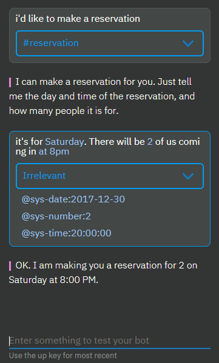
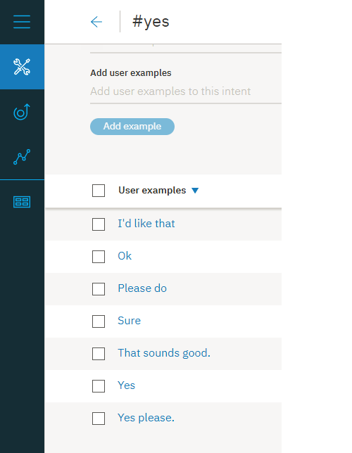

---

copyright:
  years: 2015, 2019
lastupdated: "2019-02-21"

subcollection: assistant

---

{:shortdesc: .shortdesc}
{:new_window: target="_blank"}
{:deprecated: .deprecated}
{:important: .important}
{:note: .note}
{:tip: .tip}
{:pre: .pre}
{:codeblock: .codeblock}
{:screen: .screen}
{:javascript: .ph data-hd-programlang='javascript'}
{:java: .ph data-hd-programlang='java'}
{:python: .ph data-hd-programlang='python'}
{:swift: .ph data-hd-programlang='swift'}

# Esercitazione: miglioramento di un nodo con slot
{: #tutorial-slots-complex}

In questa esercitazione migliorerai un nodo semplice con slot che raccoglie le informazioni necessarie per effettuare una prenotazione al ristorante.
{: shortdesc}

## Obiettivi di apprendimento
{: #tutorial-slots-complex-objectives}

Al termine dell'esercitazione, imparerai a:

- Verificare un nodo con slot
- Aggiungere condizioni di risposta che fanno fronte a condizioni utente comuni
- Anticipare e indirizzare input utente non correlato
- Gestire risposte utente non previste

### Durata
{: #tutorial-slots-complex-duration}

Il completamento di questa esercitazione richiede circa 2 o 3 ore.

### Prerequisito
{: #tutorial-slots-complex-prereqs}

Prima di iniziare, completa l'esercitazione [Aggiunta di un nodo con slot ad un dialogo](/docs/services/assistant?topic=assistant-tutorial-slots). Devi completare la prima esercitazione sugli slot prima di iniziare con questa perché il nodo con slot che creerai nella prima esercitazione sarà il punto di partenza su cui verranno eseguite le operazioni descritte.

## Passo 1: migliora il formato delle risposte
{: #tutorial-slots-complex-fix-format}

Quando vengono salvati i valori di entità di sistema per data e ora, vengono convertiti in un formato standard. Questo formato standard è utile per eseguire calcoli sui valori, ma potresti non voler mostrare questa riformattazione agli utenti. In questo passo, riformatterai i valori per data (`2017-12-29`) e ora (`17:00:00`) a cui fa riferimento il dialogo.

1.  Per riformattare il valore della variabile di contesto $date, fai clic sull'icona **Modifica risposta**  per lo slot @sys-date.

1.  Dal menu **Altro** , seleziona **Apri editor JSON** e quindi modifica il JSON che definisce la variabile di contesto. Aggiungi un metodo che riformatti la data in modo tale che riconverta il valore `2017-12-29` nel giorno completo della settimana, seguito dal mese e dal giorno completo. Modifica il JSON come segue:

    ```json
    {
      "context": {
        "date": "<? @sys-date.reformatDateTime('EEEE, MMMM d') ?>"
      }
    }
    ```
    {: codeblock}

    EEEE indica che desideri specificare il giorno della settimana. Ad esempio se utilizzi 3 E (EEE), il giorno della settimana viene abbreviato con Ven invece di utilizzare Venerdì. MMMM indica che desideri specificare il mese. Di nuovo, se utilizzi solo 3 M (MMM), il mese viene abbreviato con Dic invece di utilizzare Dicembre.

1.  Fai clic su **Salva**.

1.  Per modificare il formato con cui viene memorizzato il valore dell'ora nella variabile di contesto $time per utilizzare ore e minuti e indicare AM o PM, fai clic sull'icona **Modifica risposta**  per lo slot @sys-time.

1.  Dal menu **Altro** , seleziona **Apri editor JSON** e quindi modifica il JSON che definisce la variabile di contesto in modo da leggerla come segue:

    ```json
    {
      "context": {
        "time": "<? @sys-time.reformatDateTime('h:mm a') ?>"
      }
    }
    ```
    {: codeblock}

1.  Fai clic su **Salva**.

1.  Verifica di nuovo il nodo. Apri il riquadro "Provalo" e fai clic su **Cancella** per eliminare i valori della variabile di contesto dello slot che hai specificato nella precedente verifica del nodo con slot. Per vedere in che modo influiscono le modifiche che hai apportato, utilizza il seguente script:

    <table>
    <caption>Dettagli script</caption>
    <tr>
      <th>Colui che parla</th>
      <th>Espressione</th>
    </tr>
    <tr>
      <td>Tu</td>
      <td>i want to make a reservation</td>
    </tr>
    <tr>
      <td>Watson</td>
      <td>What day would you like to come in?</td>
    </tr>
    <tr>
      <td>Tu</td>
      <td>Friday</td>
    </tr>
    <tr>
      <td>Watson</td>
      <td>What time do you want the reservation to be made for?</td>
    </tr>
    <tr>
      <td>Tu</td>
      <td>5pm</td>
    </tr>
    <tr>
      <td>Watson</td>
      <td>How many people will be dining?</td>
    </tr>
    <tr>
      <td>Tu</td>
      <td>6</td>
    </tr>
    </table>

    Questa volta Watson risponde con `OK. I am making you a reservation for 6 on Friday, December 29 at 5:00 PM.`

Hai migliorato correttamente il formato utilizzato dal dialogo quando fa riferimento ai valori della variabile di contesto nelle sue risposte. Il dialogo ora utilizza `Venerdì 29 dicembre` invece del formato più tecnico `2017-12-29`. E utilizza `5:00 PM` invece di `17:00:00`. Per informazioni sugli altri metodi SpEL che puoi utilizzare con i valori di data e ora, vedi [Metodi per elaborare i valori](/docs/services/assistant?topic=assistant-dialog-methods#dialog-methods-date-time).

## Passo 2: chiedere tutto in una volta
{: #tutorial-slots-complex-ask-for-everything}

Ora che hai verificato il dialogo più volte, potresti aver notato che può essere seccante dover rispondere ad una richiesta slot alla volta. Per impedire agli utenti di fornire una parte di informazioni alla volta, puoi chiedere tutte le informazioni di cui necessiti in anticipo. In questo modo dai la possibilità all'utente di fornire tutte o parte delle informazioni in un singolo input.

Il nodo con slot è progettato per trovare e salvare tutti i valori slot forniti dall'utente mentre il nodo corrente è in fase di elaborazione. Puoi aiutare gli utenti a trarre vantaggio dalla progettazione facendo conoscere loro quali valori specificare.

In questo passo, apprenderai come richiedere tutte le informazioni in una volta.

1.  Dal nodo principale con slot, fai clic su **Personalizza**.

1.  Seleziona la casella di spunta **Richiedi tutto** per abilitare la richiesta iniziale e quindi fai clic su **Applica**.

   

1.  Torna nella vista di modifica del nodo, scorri fino al campo **Se non ci sono slot precompilati, chiedi prima questo** appena aggiunto. Aggiungi la seguente richiesta iniziale per il nodo `I can make a reservation for you. Just tell me the day and time of the reservation, and how many people it is for.`

1.  Fai clic su  per chiudere la vista di modifica del nodo.

1.  Verifica questa modifica nel riquadro "Provalo". Apri il riquadro e quindi fai clic su **Cancella** per eliminare i valori della variabile di contesto dello slot del test precedente.

1.  Immetti `i'd like to make a reservation.`

    Il dialogo risponde con `I can make a reservation for you. Just tell me the day and time of the reservation, and how many people it is for.`

1.  Immetti `it's for Saturday. There will be 2 of us coming in at 8pm`

    Il dialogo risponde con `OK. I am making you a reservation for 2 on Saturday at 8:00 PM.`

    

Se l'utente fornisce uno qualsiasi dei valori di slot nell'input iniziale, la richiesta che chiede tutte le informazioni non viene visualizzata. Ad esempio, l'input iniziale dall'utente potrebbe essere `I want to make a reservation for this Friday night.` In questo caso, la richiesta iniziale viene ignorata in quanto non devi chiedere le informazioni che l'utente ha già fornito - la data (`Venerdì`), in questo esempio. Il dialogo mostra invece la richiesta per il successivo slot vuoto.
{: note}

## Passo 3: gestisci correttamente gli zeri
{: #tutorial-slots-complex-recognize-zero}

Quando utilizzi l'entità di sistema `sys-number` in una condizione dello slot, non gestisce correttamente gli zeri. Invece di impostare la variabile di contesto che definisci per lo slot su 0, il servizio la imposta su false. Di conseguenza, lo slot non crede di essere pieno e richiede all'utente un numero più volte finché l'utente non specifica un numero diverso da zero.

1.  Verifica il nodo in modo da poter comprendere meglio il problema. Apri il riquadro "Provalo" e fai clic su **Cancella** per eliminare i valori della variabile di contesto dello slot che hai specificato nella precedente verifica del nodo con slot. Utilizza il seguente script:

    <table>
    <caption>Dettagli script</caption>
    <tr>
      <th>Colui che parla</th>
      <th>Espressione</th>
    </tr>
    <tr>
      <td>Tu</td>
      <td>i want to make a reservation</td>
    </tr>
    <tr>
      <td>Watson</td>
      <td>I can make a reservation for you. Just tell me the day and time of the reservation, and how many people it is for.</td>
    </tr>
    <tr>
      <td>Tu</td>
      <td>We want to dine May 23 at 8pm. There will be 0 guests.</td>
    </tr>
    <tr>
      <td>Watson</td>
      <td>How many people will be dining?</td>
    </tr>
    <tr>
      <td>Tu</td>
      <td>0</td>
    </tr>
    <tr>
      <td>Watson</td>
      <td>How many people will be dining?</td>
    </tr>
    </table>

    Rimarrai bloccato in questo loop finché non specifichi un numero diverso da 0.

1.  Per assicurarti che lo slot tratti correttamente gli zeri, modifica la condizione dello slot da `@sys-number` a `@sys-number || @sys-number:0`.

1.  Fai clic sull'icona **Modifica risposta**  per lo slot.

1.  Quando viene creata la variabile di contesto, utilizza automaticamente la stessa espressione specificata per la condizione dello slot. Tuttavia, la variabile di contesto deve salvare solo un numero. Modifica il valore che era stato salvato come variabile di contesto per rimuovere l'operatore `OR` da esso. Dal menu **Altro** , seleziona **Apri editor JSON** e quindi modifica il JSON che definisce la variabile di contesto. Modifica la variabile da `"guests":"@sys-number || @sys-number:0"` in modo che utilizzi la seguente sintassi:

    ```json
    {
      "context": {
        "guests": "@sys-number"
      }
    }
    ```
    {: codeblock}

1.  Fai clic su **Salva**.

1.  Verifica di nuovo il nodo. Apri il riquadro "Provalo" e fai clic su **Cancella** per eliminare i valori della variabile di contesto dello slot che hai specificato nella precedente verifica del nodo con slot. Per vedere in che modo influiscono le modifiche che hai apportato, utilizza il seguente script:

    <table>
    <caption>Dettagli script</caption>
    <tr>
      <th>Colui che parla</th>
      <th>Espressione</th>
    </tr>
    <tr>
      <td>Tu</td>
      <td>i want to make a reservation</td>
    </tr>
    <tr>
      <td>Watson</td>
      <td>I can make a reservation for you. Just tell me the day and time of the reservation, and how many people it is for.</td>
    </tr>
    <tr>
      <td>Tu</td>
      <td>We want to dine May 23 at 8pm. There will be 0 guests.</td>
    </tr>
    </table>

    Questa volta Watson risponde con `OK. I am making you a reservation for 0 on Wednesday, May 23 at 8:00 PM.`

Hai correttamente formattato lo slot del numero in modo che riconosca gli zeri correttamente. Naturalmente, potresti non volere che il nodo accetti uno zero come un numero valido di clienti. Imparerai come convalidare i valori specificati dagli utenti nel passo successivo.

## Passo 4: convalida l'input utente
{: #tutorial-slots-complex-slot-conditions}

Finora, abbiamo presupposto che l'utente fornirà i tipi di valori corretti per gli slot. In realtà non è sempre così. Puoi renderti conto delle volte in cui gli utenti potrebbero fornire un valore non valido aggiungendo risposte condizionali agli slot. In questo passo, utilizzerai le risposte slot condizionali per eseguire le attività riportate di seguito:

- Assicurati che la data richiesta non sia già trascorsa.
- Controlla se l'ora di prenotazione richiesta è compatibile con la finestra dei turni.
- Conferma l'input dell'utente.
- Assicurati che il numero di clienti fornito sia maggiore di zero.
- Indica se stati sostituendo un valore con un altro.

Per convalidare l'input utente, completa la procedura riportata di seguito:

1.  Dalla vista di modifica del nodo con slot, fai clic sull'icona **Modifica slot**  per lo slot `@sys-date`.

1.  Dal menu **Opzioni**  nell'intestazione *Configura slot 1*, seleziona **Abilita risposte condizionali**.

1.  Nella sezione **Trovato**, aggiungi una risposta condizionale facendo clic sull'icona **Modifica risposta** .

1.  Aggiungi la seguente condizione e risposta per controllare se la data che l'utente specifica cade prima di oggi:

    <table>
    <caption>Dettagli risposta condizionale 1 slot 1</caption>
    <tr>
      <th>Condizione</th>
      <th>Risposta</th>
      <th>Azione</th>
    </tr>
    <tr>
      <td>`@sys-date.before(now())`</td>
      <td>You cannot make a reservation for a day in the past.</td>
      <td>Cancella lo slot e riprova</td>
    </tr>
    </table>

1.  Aggiungi una seconda risposta condizionale che verrà visualizzata se l'utente fornisce una data valida. Questo tipo di semplice conferma consente all'utente di sapere che la sua risposta è stata compresa.

    <table>
    <caption>Dettagli risposta condizionale 2 slot 1</caption>
    <tr>
      <th>Condizione</th>
      <th>Risposta</th>
      <th>Azione</th>
    </tr>
    <tr>
      <td>`true`</td>
      <td>$date it is</td>
      <td>Vai avanti</td>
    </tr>
    </table>

1.  Dalla vista di modifica del nodo con slot, fai clic sull'icona **Modifica slot**  per lo slot `@sys-time`.

1.  Dal menu **Opzioni**  nell'intestazione *Configura slot 2*, seleziona **Abilita risposte condizionali**.

1.  Nella sezione **Trovato**, aggiungi una risposta condizionale facendo clic sull'icona **Modifica risposta** .

1.  Aggiungi le seguenti condizioni e risposte per controllare se l'ora specificata dall'utente rientra nella finestra temporale consentita:

    <table>
    <caption>Dettagli risposta condizionale slot 2</caption>
    <tr>
      <th>Condizione</th>
      <th>Risposta</th>
      <th>Azione</th>
    </tr>
    <tr>
      <td>`@sys-time.after('21:00:00')`</td>
      <td>Our last seating is at 9 PM.</td>
      <td>Cancella lo slot e riprova</td>
    </tr>
    <tr>
      <td>`@sys-time.before('09:00:00')`</td>
      <td>Our first seating is at 9 AM.</td>
      <td>Cancella lo slot e riprova</td>
    </tr>
    </table>

1.  Aggiungi una terza risposta condizionale che verrà visualizzata se l'utente fornisce un'ora valida che rientra nella finestra temporale. Questo tipo di semplice conferma consente all'utente di sapere che la sua risposta è stata compresa.

    <table>
    <caption>Dettagli risposta condizionale 3 slot 2</caption>
    <tr>
      <th>Condizione</th>
      <th>Risposta</th>
      <th>Azione</th>
    </tr>
    <tr>
      <td>`true`</td>
      <td>Ok, the reservation is for $time.</td>
      <td>Vai avanti</td>
    </tr>
    </table>

1.  Modifica lo slot @sys-number per convalidare il valore fornito dall'utente nei seguenti modi:

    - Controlla che il numero di clienti specificato sia maggiore di zero.
    - Anticipa e risolvi il caso in cui l'utente cambia il numero di ospiti. 

      Se, ad un certo punto, mentre il nodo viene elaborato, l'utente cambia un valore slot, viene aggiornato il valore della variabile di contesto slot corrispondente. Tuttavia, può essere utile far sapere all'utente che il valore viene sostituito, sia per fornire un feedback chiaro all'utente che per dargli la possibilità di correggerlo se la modifica non era quella desiderata. 

1.  Dalla vista di modifica del nodo con slot, fai clic sull'icona **Modifica slot**  per lo slot `@sys-number`.

1.  Dal menu **Opzioni**  nell'intestazione *Configura slot 3*, seleziona **Abilita risposte condizionali**.

1.  Nella sezione **Trovato**, aggiungi una risposta condizionale facendo clic sull'icona  e quindi aggiungi la seguente condizione e risposta:

    <table>
    <caption>Dettagli risposta condizionale slot 3</caption>
    <tr>
      <th>Condizione</th>
      <th>Risposta</th>
      <th>Azione</th>
    </tr>
    <tr>
      <td>`entities['sys-number']?.value == 0`</td>
      <td>Please specify a number that is larger than 0.</td>
      <td>Cancella lo slot e riprova</td>
    </tr>
    <tr>
      <td>`(event.previous_value != null) && (event.previous_value != event.current_value)`</td>
      <td>Ok, updating the number of guests from `<? event.previous_value ?>` a `<? event.current_value ?>`.</td>
      <td>Vai avanti</td>
    </tr>
    <tr>
      <td>`true`</td>
      <td>Ok. The reservation is for $guests guests.</td>
      <td>Vai avanti</td>
    </tr>
    </table>

## Passo 5: aggiungi uno slot di conferma
{: #tutorial-slots-complex-confirmation-slot}

Potresti voler progettare il tuo dialogo in modo che richiami un servizio di prenotazione esterno e prenoti effettivamente per l'utente nel sistema. Prima che la tua applicazione esegua questa operazione, probabilmente desideri confermare con l'utente che il dialogo ha compreso correttamente i dettagli della prenotazione. Puoi eseguire questa operazione aggiungendo uno slot di conferma al nodo.

1.  Lo slot di conferma prevede una risposta Sì o No dall'utente. Devi istruire il dialogo in modo che sia in grado di riconoscere innanzitutto un intento Sì o No nell'input utente.

1.  Fai clic sulla scheda **Intenti** per tornare alla pagina Intenti. Aggiungi i seguenti intenti e le seguenti espressioni di esempio.

- `#yes`

   ```json
   Yes
   Sure
   I'd like that
   Please do
   Yes please.
   Ok
   That sounds good.
   ```
   {: screen}

   

- `#no`

   ```json
   No
   No thanks.
   Please don't.
   Please do not!
   That's not what I want at all
   Absolutely not.
   No way
   ```
   {: screen}

   

1.  Ritorna alla scheda **Dialogo** e quindi fai clic per modificare il nodo con gli slot. Fai clic su **Aggiungi slot** per aggiungere un quarto slot e quindi specifica i seguenti valori per esso:

    <table>
    <caption>Dettagli slot di conferma</caption>
    <tr>
      <th>Controlla</th>
      <th>Salvalo con nome</th>
      <th>Se non presente, chiedi</th>
    </tr>
    <tr>
      <td>`(#yes || #no) && slot_in_focus`</td>
      <td>$confirmation</td>
      <td>Sto per prenotare un tavolo per $guests il giorno $date alle $time. Posso procedere?</td>
    </tr>
    </table>

    Questa condizione controlla la risposta. Specificherai quali saranno le operazioni successive a seconda del fatto che l'utente risponda Sì o No utilizzando le risposte slot condizionali. La proprietà `slot_in_focus` forza l'applicazione dell'ambito di questa condizione solo allo slot corrente. Questa impostazione impedisce l'attivazione da questo slot di istruzioni casuali che possono essere messe in corrispondenza con un intento `#yes` o `#no` che potrebbe essere creato dall'utente.

    Ad esempio, l'utente potrebbe rispondere il numero di slot ospiti e dire `Sì, saremo 5.` Non vuoi che il termine `Sì` incluso nella risposta riempia accidentalmente lo slot di conferma. Aggiungendo la proprietà `slot_in_focus` alla condizione, un valore sì o no indicato dall'utente viene applicato a questo slot solo quando l'utente sta rispondendo specificatamente alla richiesta per questo slot.

1.  Fai clic sull'icona **Modifica slot** . Dal menu **Opzioni**  nell'intestazione *Configura slot 4*, seleziona **Abilita risposte condizionali**.

1.  Nella richiesta **Trovato**, aggiungi una condizione che controlli la presenta di una risposta No (`#no`). Utilizza la risposta `D'accordo. Ricominciamo. Cercherò di stare al passo.` In caso contrario, puoi presupporre che l'utente abbia confermato i dettagli della prenotazione e procedere con la prenotazione.

    Quando viene trovato l'intento `#no`, devi anche reimpostare le variabili di contesto che hai salvato precedentemente su null, in questo modo puoi chiedere di nuovo le informazioni. Puoi reimpostare i valori delle variabili di contesto utilizzando l'editor JSON. Fai clic sull'icona **Modifica risposta**  per la risposta condizionale che hai appena aggiunto. Dal menu **Opzioni**  , fai clic su **Apri editor JSON**. Aggiungi un blocco `context` che imposta le variabili di contesto dello slot su `null`, come mostrato di seguito.

    ```json
    {
      "output":{
        "text": {
          "values": [
            "Alright. Let's start over. I'll try to keep up this time."
          ]
        }
      },
  "context":{
        "date": null,
        "time": null,
        "guests": null
      }
    }
    ```
    {: codeblock}

1.  Fai clic su **Indietro** e quindi su **Salva**.

1.  Fai clic sull'icona **Modifica slot**  per confermare di nuovo lo slot. Nella richiesta **Non trovato**, chiarisci che prevedi che l'utente fornisca una risposta Sì o No. Aggiungi una risposta con i seguenti valori.

    <table>
    <caption>Nessun dettagli risposta trovato</caption>
    <tr>
      <th>Condizione</th>
      <th>Risposta</th>
    </tr>
    <tr>
      <td>`true`</td>
      <td>Respond with Yes to indicate that you want the reservation to be made as-is, or No to indicate that you do not.</td>
    </tr>
    </table>

1.  Fai clic su **Salva**.

1.  Ora che hai le risposte di conferma per i valori slot e hai richiesto le informazioni tutte insieme, potresti notare che le singole risposte slot vengono visualizzate prima della visualizzazione della risposta slot di conferma, cosa che potrebbe apparire ripetitiva agli utenti. Modifica le risposte trovate per lo slot in modo da impedirne la visualizzazione in determinate condizioni.

1.  Sostituisci la condizione `true` specificata nel frammento JSON per l'ultima risposta condizionale nello slot @sys-date con `!($time && $guests)`. Ad esempio:

    <table>
    <caption>Dettagli risposta condizionale 2 slot 1</caption>
    <tr>
      <th>Condizione</th>
      <th>Risposta</th>
      <th>Azione</th>
    </tr>
    <tr>
      <td>`!($time && $guests)`</td>
      <td>$date it is</td>
      <td>Vai avanti</td>
    </tr>
    </table>

1.  Sostituisci la condizione `true` specificata nel frammento JSON per l'ultima risposta condizionale nello slot @sys-time con `!($date && $guests)`. Ad esempio:

    <table>
    <caption>Dettagli risposta condizionale 3 slot 2</caption>
    <tr>
      <th>Condizione</th>
      <th>Risposta</th>
      <th>Azione</th>
    </tr>
    <tr>
      <td>`!($date && $guests)`</td>
      <td>Ok, the reservation is for $time.</td>
      <td>Vai avanti</td>
    </tr>
    </table>

1.  Sostituisci la condizione `true` specificata nel frammento JSON per l'ultima risposta condizionale nello slot @sys-number con `!($date && $time)`. Ad esempio:

    <table>
    <caption>Dettagli risposta condizionale 2 slot 3</caption>
    <tr>
      <th>Condizione</th>
      <th>Risposta</th>
      <th>Azione</th>
    </tr>
    <tr>
      <td>`!($date && $time)`</td>
      <td>Ok. The reservation is for $guests guests.</td>
      <td>Vai avanti</td>
    </tr>
    </table>

Se successivamente aggiungi altri slot, devi modificare queste condizioni per tenere conto delle variabili di contesto associate per gli slot aggiuntivi. Se non includi uno slot di conferma, puoi specificare solo `!all_slots_filled` e rimarrà valido a prescindere da quanti slot aggiungerai successivamente.

## Passo 6: reimposta i valori delle variabili di contesto dello slot
{: #tutorial-slots-complex-reset-variables}

Potresti aver notato che prima di ciascun test, devi cancellare i valori delle variabili di contesto che sono stati creati durante il test precedente. Devi eseguire tale operazione perché il nodo con slot richiede agli utenti solo le informazioni che considera mancanti. Se le variabili di contesto dello slot sono tutte riempite con valori validi, non verrà visualizzata alcuna richiesta. Lo stesso vale per il dialogo nel runtime. Devi creare, all'interno del dialogo, un meccanismo tramite il quale reimpostare le variabili di contesto dello slot su null in modo che gli slot possano essere riempiti nuovamente dall'utente successivo. Per eseguire tale operazione, devi aggiungere un nodo padre al nodo con slot che imposta le variabili di contesto su null.

1.  Dalla vista della struttura ad albero di dialogo, fai clic sull'icona **Altro**  sul nodo con slot e quindi seleziona **Aggiungi nodo in alto**.

1.  Specifica `#reservation` come condizione per il nuovo nodo. (È la stessa condizione utilizzata dal nodo con slot, ma modificherai la condizione per il nodo con slot in questa procedura in un secondo momento.)

1.  Fai clic sull'icona **Opzioni**  accanto alla risposta del nodo e quindi fai clic su **Apri editor JSON**. Aggiungi una voce per ciascuna variabile di contesto dello slot definita nel nodo con slot e impostala su `null`.

    ```json
    {
      "context": {
        "date": null,
        "time": null,
        "guests": null,
        "confirmation": null
      },
      "output": {}
    }
    ```
    {: codeblock}

    

1.  Fai clic per modificare l'altro nodo #reservation, quello che hai creato in precedenza e a cui hai aggiunto gli slot.

1.  Modifica la condizione nodo da `#reservation` a `($date == null && $time == null)` e poi chiudi la vista di modifica facendo clic su .

1.  Fai clic sull'icona **Altro**  sul nodo con slot e poi seleziona **Sposta**.

    

1.  Seleziona il nodo `#reservation` come destinazione dello spostamento e quindi scegli **Come nodo figlio** dal menu.

1.  Fai clic per modificare il nodo `#reservation`. Nella sezione *E infine*, modifica l'azione da *Attendi input utente* a **Ignora input utente**.

    

    Quando l'input utente corrisponde all'intento `#reservation`, viene attivato questo nodo. Le variabili di contesto dello slot sono tutte impostate su null e quindi il dialogo passa direttamente al nodo con slot per elaborarlo.

## Passo 7: fornisci agli utenti un modo per uscire dal processo
{: #tutorial-slots-complex-handler}

L'aggiunta di un nodo con slot è efficace perché consente gli utenti di eseguire le corrette operazioni per fornire le informazioni di cui hai bisogno per dare loro una risposta significativa o per eseguire un'operazione al loro posto. Tuttavia, potrebbero verificarsi casi in cui un utente si trova nel bel mezzo della procedura per fornire i dettagli della prenotazione ma decide di non proseguire con l'esecuzione della prenotazione. Devi fornire all'utente un modo per uscire correttamente dal processo. Puoi eseguire questa operazione aggiungendo un gestore slot che può rilevare la volontà di un utente di uscire dal processo e di uscire dal nodo senza salvare i valori che sono stati raccolti.

1.  Devi istruire il dialogo in modo che sia in grado di riconoscere innanzitutto un intento #exit nell'input utente.

1.  Fai clic sulla scheda **Intenti** per tornare alla pagina Intenti. Aggiungi l'intento #exit con le seguenti espressioni di esempio.

    ```json
    I want to stop
    Exit!
    Cancel this process
    I changed my mind. I don't want to make a reservation.
    Stop the reservation
    Wait, cancel this.
    Nevermind.
    ```
    {: screen}

    

1.  Ritorna al dialogo facendo clic sulla scheda **Dialogo**. Fai clic per aprire il nodo con slot e quindi fai clic su **Gestisci gestori**.

    

1.  Aggiungi i seguenti valori ai campi.

    <table>
    <caption>Dettagli gestore a livello di nodo</caption>
    <tr>
      <th>Condizione</th>
      <th>Risposta</th>
      <th>Azione</th>
    </tr>
    <tr>
      <td>`#exit`</td>
      <td>Ok, we'll stop there. No reservation will be made.</td>
      <td>Passa alla risposta</td>
    </tr>
    </table>

    L'azione **Passa alla risposta** passa direttamente alla risposta a livello di nodo senza visualizzare le richieste associate ad uno qualsiasi degli slot non riempiti rimanenti.

1.  Fai clic su **Indietro** e quindi su **Salva**.

1.  Ora, devi modificare la risposta a livello di nodo in modo che riconosca quando un utente desidera uscire dal processo invece di fare una prenotazione. Aggiungi una risposta condizionale per il nodo.

    Dalla vista di modifica del nodo con slot, fai clic su **Personalizza**, fai clic sull'interruttore **Risposte multiple** per **attivarlo** e quindi fai clic su **Applica**.

    

1.  Scorri fino alla sezione di risposta per il nodo con slot e quindi fai clic su **Aggiungi risposta**.

1.  Aggiungi i seguenti valori ai campi.

    <table>
    <caption>Dettagli risposta condizionale a livello di nodo</caption>
    <tr>
      <th>Condizione</th>
      <th>Risposta</th>
    </tr>
    <tr>
      <td>`has_skipped_slots`</td>
      <td>I look forward to helping you with your next reservation. Have a good day.</td>
    </tr>
    </table>

    La condizione `has_skipped_slots` controlla le proprietà del nodo con slot per vedere se è stato ignorato uno qualsiasi degli slot. Il gestore `#exit` ignora tutti gli slot rimanenti per passare direttamente alla risposta del nodo. Pertanto, quando è presente la proprietà `has_skipped_slots`, sai che l'intento `#exit` è stato attivato e che il dialogo può visualizzare una risposta alternativa.

    Se configuri più di uno slot per ignorare gli altri slot oppure configuri un altro gestore eventi a livello del nodo per ignorare gli slot, devi utilizzare un approccio diverso per controllare se l'intento #exit è stato attivato. Vedi [Gestione delle richieste per uscire dal processo](/docs/services/assistant?topic=assistant-dialog-slots#dialog-slots-node-level-handler) per un modo alternativo con cui effettuare tale operazione.
    {: note}

1.  Vuoi che il servizio controlli la presenza della proprietà `has_skipped_slots` prima che visualizzi la risposta a livello di nodo standard. Sposta la risposta condizionale `has_skipped_slots` verso l'alto in modo che venga elaborata prima della risposta condizionale originale oppure non verrà mai attivata. Per eseguire tale operazione, fai clic sulla risposta appena aggiunta, utilizza la **freccia rivolta verso l'alto** per spostarla verso l'alto e poi fai clic su **Salva**.

1.  Verifica questa modifica utilizzando il seguente script nel riquadro "Provalo".

    <table>
    <caption>Dettagli script</caption>
    <tr>
      <th>Colui che parla</th>
      <th>Espressione</th>
    </tr>
    <tr>
      <td>Tu</td>
      <td>i want to make a reservation</td>
    </tr>
    <tr>
      <td>Watson</td>
      <td>I can make a reservation for you. Just tell me the day and time of the reservation, and how many people it is for.</td>
    </tr>
    <tr>
      <td>Tu</td>
      <td>it's for 5 people</td>
    </tr>
    <tr>
      <td>Watson</td>
      <td>Ok. The reservation is for 5 guests.  What day would you like to come in?</td>
    </tr>
    <tr>
      <td>Tu</td>
      <td>Nevermind</td>
    </tr>
    <tr>
      <td>Watson</td>
      <td>Ok, we'll stop there. No reservation will be made.  I look forward to helping you with your next reservation. Have a good day.</td>
    </tr>
    </table>

## Passo 8: applica un valore valido se l'utente non riesce a fornirne uno dopo diversi tentativi

In alcuni casi, un utente potrebbe non comprendere la tua domanda. Potrebbero rispondere più volte con i tipi di valori errati. Per pianificare questa possibilità, puoi aggiungere un contatore allo slot e dopo 3 tentativi non riusciti da parte dell'utente di specificare un valore valido, puoi applicare un valore allo slot per conto dell'utente e proseguire.

Per le informazioni $time, definirai un'istruzione di follow-up che verrà visualizzata quando l'utente non fornisce un'ora valida.

1.  Crea una variabile di contesto che possa tenere traccia del numero di volte in cui l'utente ha fornito un valore che non corrisponde al tipo previsto da tale slot. Vuoi che la variabile di contesto venga inizializzata e impostata su 0 prima che il nodo con slot venga elaborato, quindi la aggiungerai al nodo padre `#reservation`.

1.  Fai clic per modificare il nodo `#reservation`. Apri l'editor JSON associato alla risposta nodo facendo clic sull'icona **Opzioni**  nella sezione di risposta e scegliendo **Apri editor JSON**. Aggiungi una variabile di contesto denominata `counter` alla fine del blocco `"context"` esistente, sotto la variabile `confirmation`. Imposta la variabile `counter` su `0`.

       ```json
       {
         "context": {
           "date": null,
           "time": null,
           "guests": null,
           "confirmation": null,
           "counter": 0
         },
        "output": {}
      }
       ```
       {: codeblock}

1.  Dalla vista della struttura ad albero, espandi il nodo `#reservation` e poi fai clic per modificare il nodo con slot. 

1.  Fai clic sull'icona **Modifica slot**  per lo slot `@sys-time`.

1.  Dal menu **Opzioni**  nell'intestazione *Configura slot 2*, seleziona **Abilita risposte condizionali**.

1.  Nella sezione **Non trovato**, aggiungi una risposta condizionale.

    <table>
    <caption>Nessun dettagli risposta trovato</caption>
    <tr>
      <th>Condizione</th>
      <th>Risposta</th>
    </tr>
    <tr>
      <td>`true`</td>
      <td>Please specify the time that you want to eat. The restaurant seats people between 9AM and 9PM.</td>
    </tr>
    </table>

1.  Aggiungi 1 alla variabile `counter` ogni volta che viene attivata questa risposta. Ricorda che questa risposta viene attivata solo quando l'utente non fornisce un valore valido per l'ora. Fai clic sull'icona **Modifica risposta** .

1.  Fai clic sull'icona **Opzioni**  e seleziona **Apri editor JSON**. Aggiungi la seguente definizione di variabile di contesto.

    ```json
    {
      "output":{
        "text": {
          "values": [
            "Please specify the time that you want to eat.
              The restaurant seats people between 9AM and 9PM."
          ]
        }
      },
"context": {
        "counter": "<? context['counter'] + 1 ?>"
      }
    }
    ```
    {: codeblock}

    Questa espressione aggiunge 1 al valore del contatore corrente.

1.  Fai clic su **Indietro** e quindi su **Salva**.

1.  Riapri lo slot @sys-time facendo clic sull'icona **Modifica slot** .

    Aggiungerai una seconda risposta condizionale alla sezione **Non trovato** che controlli se il contatore è maggiore di 1, se ciò si verifica, vuol dire che l'utente, precedentemente, ha fornito una risposta non valida per 3 volte. In questo caso, il dialogo assegna al valore dell'ora al posto dell'utente l'ora di prenotazione più diffusa, 8 PM. Non preoccuparti, l'utente avrà la possibilità di modificare il valore dell'ora quando verrà attivato lo slot di conferma. Fai clic su **Aggiungi una risposta**.

1.  Aggiungi la seguente condizione e risposta.

    <table>
    <caption>Nessun dettagli risposta trovato</caption>
    <tr>
      <th>Condizione</th>
      <th>Risposta</th>
    </tr>
    <tr>
      <td>`$counter > 1`</td>
      <td>You seem to be having trouble choosing a time. Prenoterò per te alle 8PM.</td>
    </tr>
    </table>

    Devi impostare la variabile $time su 8PM, quindi fai clic sull'icona **Modifica risposta** . Seleziona **Apri editor JSON**, aggiungi la seguente definizione di variabile di contesto e quindi fai clic su **Indietro**.

    ```json
    {
      "output":{
        "text": {
          "values": [
            "You seem to be having trouble choosing a time.
              Prenoterò per te alle 8 PM."
          ]
        }
      },
"context": {
        "time": "<? '20:00:00'.reformatDateTime('h:mm a') ?>"
      }
    }
    ```
    {: codeblock}

1.  La risposta condizionale che hai appena aggiunto contiene una condizione più precisa della condizione true utilizzata dalla prima risposta condizionale. Devi spostare questa risposta in modo che preceda la risposta condizionale originale oppure non verrà mai attivata. Fai clic sulla risposta che hai appena aggiunto e utilizza la freccia rivolta verso l'alto per spostarla verso l'alto e poi fai clic su **Salva**.

1.  Verifica le modifiche utilizzando il seguente script.

| Colui che parla | Espressione |
|---------|-----------|
| Tu     | i want to make a reservation |
| Watson  | I can make a reservation for you. Just tell me the day and time of the reservation, and how many people it is for. |
| Tu     | domani |
| Watson  | È venerdì 29 dicembre.  What time do you want the reservation to be made for? |
| Tu     | arancione |
| Watson  | Please specify the time that you want to eat. The restaurant seats people between 9AM and 9PM. |
| Tu     | rosa |
| Watson  | Please specify the time that you want to eat. The restaurant seats people between 9AM and 9PM. |
| Tu     | viola |
| Watson  | You seem to be having trouble choosing a time. Prenoterò per te alle 8PM.  How many people will be dining? |

## Passo 9: connettiti ad un servizio esterno
{: #tutorial-slots-complex-action}

Ora che il tuo dialogo può raccogliere e confermare i dettagli di prenotazione di un utente, puoi richiamare un servizio esterno per prenotare effettivamente un tavolo nel sistema del ristorante oppure puoi farlo tramite un servizio di prenotazione online di più ristoranti. Per ulteriori dettagli, vedi [Esecuzione di chiamate programmatiche da un nodo di dialogo](/docs/services/assistant?topic=assistant-dialog-actions).

Nella logica che richiama il servizio di prenotazione, assicurati di controllare la presenza di `has_skipped_slots` e, se presente, di non proseguire con la prenotazione.

### Riepilogo
{: #tutorial-slots-complex-summary}

In questa esercitazione hai verificato un nodo con slot e apportato modifiche che ottimizzano la sua interazione con utenti reali. Per ulteriori informazioni su questo argomento, vedi [Raccolta di informazioni con gli slot](/docs/services/assistant?topic=assistant-dialog-slots).

## Passi successivi
{: #tutorial-slots-complex-deploy}

Distribuisci la tua capacità di dialogo connettendola come prima cosa a un assistente e poi distribuendo l'assistente. Ci sono diversi modi per farlo. Per ulteriori informazioni, vedi [Aggiunta delle integrazioni](/docs/services/assistant?topic=assistant-deploy-integration-add).
