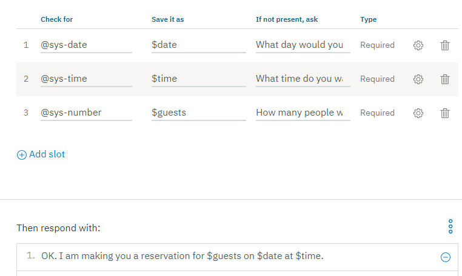

---

copyright:
  years: 2015, 2019
lastupdated: "2019-04-12"

subcollection: assistant

---

{:shortdesc: .shortdesc}
{:new_window: target="_blank"}
{:deprecated: .deprecated}
{:important: .important}
{:note: .note}
{:tip: .tip}
{:pre: .pre}
{:codeblock: .codeblock}
{:screen: .screen}
{:javascript: .ph data-hd-programlang='javascript'}
{:java: .ph data-hd-programlang='java'}
{:python: .ph data-hd-programlang='python'}
{:swift: .ph data-hd-programlang='swift'}

# Esercitazione: aggiunta di un nodo con slot ad un dialogo
{: #tutorial-slots}

In questa esercitazione, aggiungerai slot ad un nodo di dialogo per raccogliere più informazioni da un utente all'interno di un singolo nodo. Il nodo creato raccoglierà le informazioni necessarie per prenotare al ristorante.
{: shortdesc}

## Obiettivi di apprendimento
{: #tutorial-slots-objectives}

Al termine dell'esercitazione, imparerai a:

- Definire gli intenti e le entità di cui necessita il tuo dialogo
- Aggiungere gli slot ad un nodo di dialogo
- Verificare il nodo con gli slot

### Durata
{: #tutorial-slots-duration}

Il completamento di questa esercitazione richiede circa 30 minuti.

### Prerequisito
{: #tutorial-slots-prereqs}

Prima di iniziare, completa l'[Esercitazione introduttiva](/docs/services/assistant?topic=assistant-getting-started). Utilizzerai la capacità dell'esercitazione {{site.data.keyword.conversationshort}} che hai creato e aggiungerai dei nodi al semplice dialogo come parte dell'esercitazione iniziale.

Se lo desideri, puoi anche iniziare con una nuova capacità. Assicurati solamente di creare la capacità prima di iniziare questa esercitazione.
{: note}

## Passo 1: aggiungi intenti ed esempi
{: #tutorial-slots-add-intent}

Aggiungi un intento alla scheda Intenti. Un intento è lo scopo o l'obiettivo espresso nell'input utente. Aggiungerai un intento #reservation che riconosce l'input utente che indica che l'utente desidera effettuare una prenotazione al ristorante.

1.  Dalla pagina **Intenti** della capacità dell'esercitazione, fai clic su **Aggiungi intento**.
1.  Aggiungi il seguente nome intento e poi fai clic su **Crea intento**:

    ```json
    reservation
    ```
    {: screen}

    L'intento #reservation viene aggiunto. Un simbolo cancelletto (`#`) viene anteposto al nome intento per etichettarlo come un intento. Questa convenzione di denominazione consente a te e agli altri utenti di riconoscere l'intento come un intento. Ancora non ha espressioni utente di esempio associate ad esso.
1.  Nel campo **Aggiungi esempi utente**, immetti la seguente espressione e quindi fai clic su **Aggiungi esempio**:

    ```json
    i'd like to make a reservation
    ```
    {: screen}

1.  Aggiungi questi esempi aggiuntivi per aiutare Watson a riconoscere l'intento `#reservation`.

    ```json
    I want to reserve a table for dinner
    Can 3 of us get a table for lunch?
    do you have openings for next Wednesday at 7?
    È disponibile un tavolo per 4 martedì sera?
    Mi piacerebbe venire per il brunch domani
    posso prenotare un tavolo?
    ```
    {: screen}

1.  Fai clic sull'icona **Chiudi**  per completare l'aggiunta dell'intento `#reservation` e delle sue espressioni di esempio.

## Passo 2: aggiungi le entità
{: #tutorial-slots-add-entity}

Una definizione di entità include una serie di entità *values* che rappresentano la terminologia che spesso viene utilizzata nel contesto di un determinato intento. Definendo le entità, puoi aiutare il tuo assistente a identificare i riferimenti nell'input utente che sono correlati agli intenti a cui sei interessato. In questo passo, abiliterai le entità di sistema che possono riconoscere i riferimenti a ora, data e numeri.

1.  Fai clic su **Entità** per aprire la pagina Entità.
1.  Abilita le entità di sistema che possono riconoscere riferimenti a data, ora e numeri nell'input utente. Fai clic sulla scheda **Entità di sistema** e quindi attiva queste entità:

    - `@sys-time`
    - `@sys-date`
    - `@sys-number`

Hai abilitato correttamente le entità di sistema @sys-date, @sys-time e @sys-number. Ora puoi utilizzarle nel tuo dialogo.

## Passo 3: aggiungi un nodo di dialogo con gli slot
{: #tutorial-slots-add-dialog-with-slots}

Un nodo di dialogo rappresenta il punto di inizio di un thread del dialogo tra il tuo assistente e l'utente. Contiene una condizione che deve essere soddisfatta affinché il nodo venga elaborato dal tuo assistente. Come minimo, contiene anche una risposta. Ad esempio, una condizione nodo potrebbe ricercare l'intento `#hello` nell'input utente e rispondere con `Hi. How can I help you?` Questo esempio è la forma più semplice di un nodo di dialogo, uno che contiene una singola condizione e una singola risposta. Puoi definire dialoghi più complessi aggiungendo risposte condizionali a un singolo nodo, aggiungendo nodi figlio che prolungano lo scambio con l'utente e molto altro. (Se desideri reperire ulteriori informazioni sui dialoghi complessi, puoi completare l'esercitazione [Creazione di un dialogo complesso](/docs/services/assistant?topic=assistant-tutorial).)

Il nodo che aggiungerai in questo passo è quello che contiene gli slot. Gli slot forniscono un formato strutturato tramite il quale puoi richiedere e salvare più informazioni provenienti da un utente all'interno di un singolo nodo. Sono maggiormente utili quando hai in mente una specifica attività e hai bisogno di parti chiave di informazioni provenienti dall'utente prima di poterla eseguire. Per ulteriori informazioni, vedi [Raccolta di informazioni con gli slot](/docs/services/assistant?topic=assistant-dialog-slots).

Il nodo che aggiungi raccoglierà le informazioni necessarie per fare una prenotazione al ristorante.

1.  Fai clic sulla scheda **Dialoghi** per aprire la struttura ad albero di dialogo.
1.  Fai clic sull'icona Altro  sul nodo **#General_Greetings** e seleziona **Aggiungi nodo in basso**.
1.  Inizia a immettere `#reservation` nel campo condizione e quindi selezionalo dall'elenco.
    Questo nodo verrà valutato se l'input utente corrisponde all'intento `#reservation`.
1.  Fai clic su **Personalizza**, fai clic sull'interruttore **Slot** per **attivarlo** e quindi fai clic su **Applica**.

    
1.  Definisci i seguenti slot:

    <table>
    <caption>Dettagli slot</caption>
    <tr>
      <th>Controlla</th>
      <th>Salvalo con nome</th>
      <th>Se non presente, chiedi</th>
    </tr>
    <tr>
      <td>@sys-date</td>
      <td>$date</td>
      <td>What day would you like to come in?</td>
    </tr>
    <tr>
      <td>@sys-time</td>
      <td>$time</td>
      <td>What time do you want the reservation to be made for?</td>
    </tr>
    </tr>
    <tr>
      <td>@sys-number</td>
      <td>$guests</td>
      <td>How many people will be dining?</td>
    </tr>
    </table>

1.  Come risposta, specifica `OK. I am making you a reservation for $guests on $date at $time.`

    

1.  Fai clic su  per chiudere la vista di modifica del nodo.

## Passo 4: verifica il dialogo
{: #tutorial-slots-test}

1.  Seleziona l'icona  per aprire il riquadro di chat.
1.  Immetti `i want to make a reservation`.

    L'assistente riconosce l'intento #reservation e risponde con la richiesta per il primo slot, `What day would you like to come in?`.

1.  Immetti `Friday`.

    L'assistente riconosce il valore e lo utilizza per riempire la variabile di contesto $date per il primo slot. Mostra quindi la richiesta per lo slot successivo, `What time do you want the reservation to be made for?`

1.  Immetti `5pm`.

    L'assistente riconosce il valore e lo utilizza per riempire la variabile di contesto $time per il secondo slot. Mostra quindi la richiesta per lo slot successivo, `How many people will be dining?`

1.  Immetti `6`.

    L'assistente riconosce il valore e lo utilizza per riempire la variabile di contesto $guests per il terzo slot. Ora che tutti gli slot sono stati riempiti, mostra la risposta del nodo, `OK. Sto prenotato per 6 per il giorno 2017-12-29 alle 17:00:00.`


Ha funzionato! Congratulazioni. Hai creato correttamente un nodo con gli slot.

## Riepilogo
{: #tutorial-slots-summary}

In questa esercitazione hai creato un nodo con slot che possono acquisire le informazioni necessarie per prenotare un tavolo al ristorante.

## Passi successivi
{: #tutorial-slots-next-steps}

Migliora l'esperienza degli utenti che interagiscono con il nodo. Completa l'esercitazione successiva, [Miglioramento di un nodo con slot](/docs/services/assistant?topic=assistant-tutorial-slots-complex). Tratta semplici miglioramenti, ad esempio come riformattare i valori di data (2017-12-28) e ora (17:00:00) restituiti dal sistema. Tratta anche attività più complesse come ad esempio quali operazioni eseguire se l'utente non fornisce il tipo di valore previsto dal tuo dialogo per uno slot.
