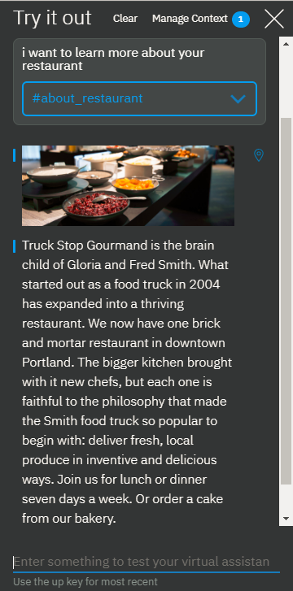
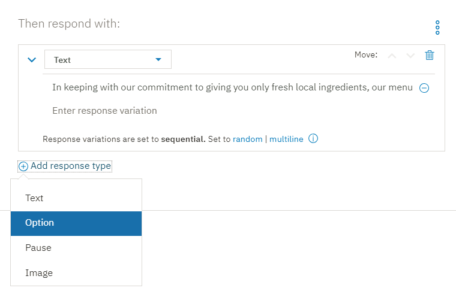
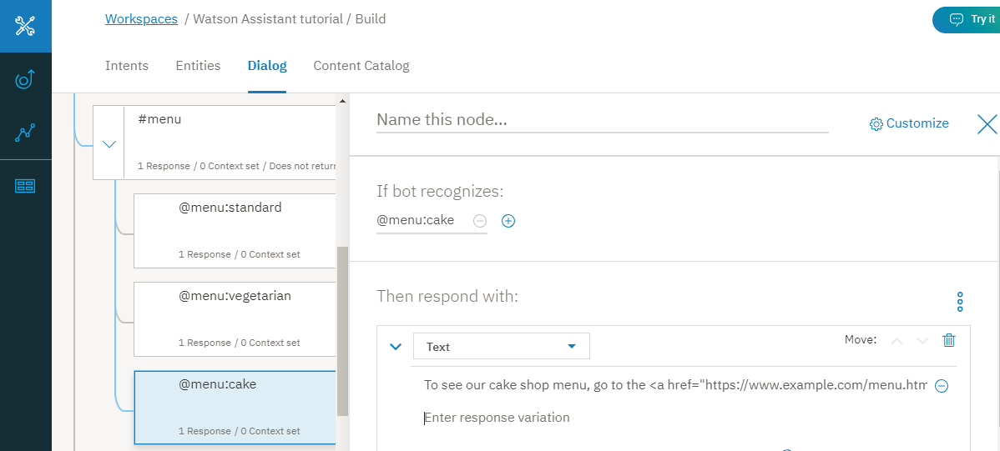
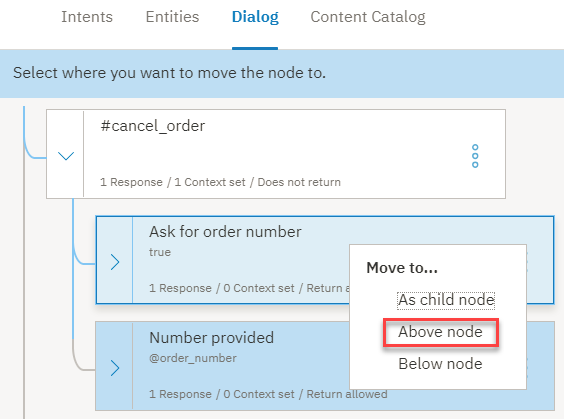
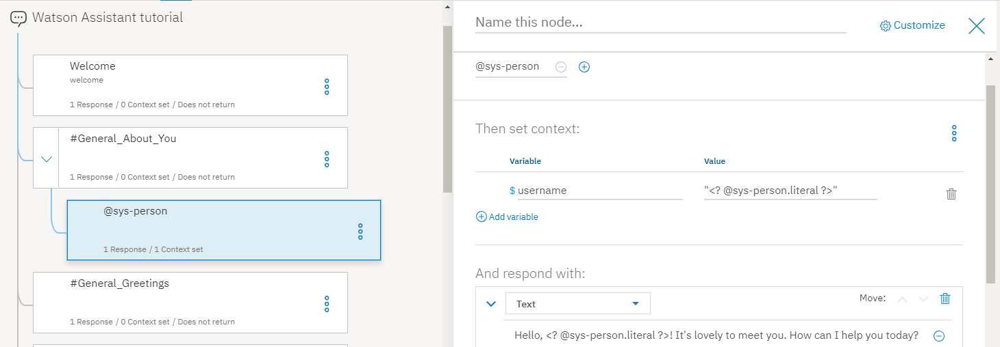
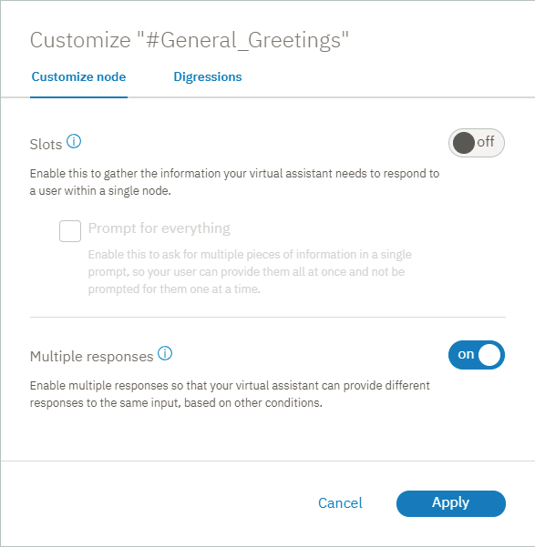
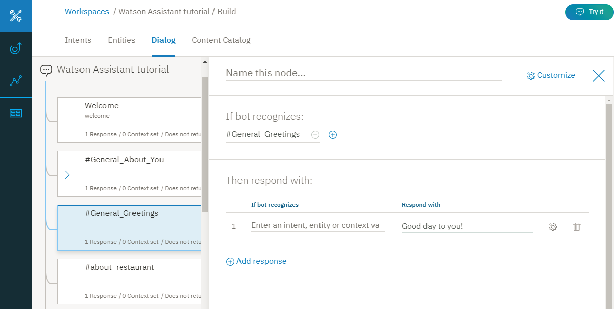

---

copyright:
  years: 2015, 2019
lastupdated: "2019-02-28"

subcollection: assistant

---

{:shortdesc: .shortdesc}
{:new_window: target="_blank"}
{:deprecated: .deprecated}
{:important: .important}
{:note: .note}
{:tip: .tip}
{:pre: .pre}
{:codeblock: .codeblock}
{:screen: .screen}
{:javascript: .ph data-hd-programlang='javascript'}
{:java: .ph data-hd-programlang='java'}
{:python: .ph data-hd-programlang='python'}
{:swift: .ph data-hd-programlang='swift'}
{:gif: data-image-type='gif'}

# Esercitazione: creazione di un dialogo complesso
{: #tutorial}

In questa esercitazione, utilizzerai il servizio {{site.data.keyword.conversationshort}} per creare un dialogo per un assistente che aiuta gli utenti su domande riguardo un ristorante fittizio denominato *Truck Stop Gourmand*.
{: shortdesc}

## Obiettivi di apprendimento
{: #tutorial-objectives}

Al termine dell'esercitazione, imparerai a:

- Pianificare un dialogo
- Definire gli intenti personalizzati
- Aggiungere nodi di dialogo che possono gestire i tuoi intenti
- Aggiungere entità per rendere le tue risposte più specifiche
- Aggiungere un'entità modello e utilizzarla nel dialogo per trovare modelli nell'input utente
- Configurare e far fare riferimento alle variabili di contesto

### Durata
{: #tutorial-duration}

Il completamento di questa esercitazione richiede circa 2 o 3 ore.

### Prerequisito
{: #tutorial-prereqs}

Prima di iniziare, completa l'[Esercitazione introduttiva](/docs/services/assistant?topic=assistant-getting-started).

Utilizzerai la capacità di dialogo che hai creato e aggiungerai dei nodi semplice al dialogo che crei come parte dell'esercitazione iniziale.

## Passo 1: pianifica il dialogo
{: #tutorial-plan}

Stai creando un assistente per un ristorante denominato *Truck Stop Gourmand* con una sede e un'attività di produzione di torte fiorente. Desideri che il semplice assistente risponda a domande degli utenti sul ristorante, sul suo menu e annulli gli ordini di torte dei clienti. Pertanto, devi creare degli intenti che gestiscono le domande relative ai seguenti argomenti:

- Informazioni sul ristorante
- Dettagli sul menu
- Annullamenti di ordini

Inizierai creando degli intenti che rappresentano questi argomenti e poi creerai un dialogo che risponde alle domande utente su di essi.

## Passo 2: rispondi alle domande sul ristorante
{: #tutorial-add-about-intent}

Aggiungi un intento che riconosce quando i clienti pongono domande per avere dettagli sul ristorante stesso. Un intento è lo scopo o l'obiettivo espresso nell'input utente. L'intento `#General_About_You` fornito con il catalogo di contenuto *General* fornisce una funzione simile, ma i suoi esempi utente sono progettati per focalizzarsi su domande riguardo l'assistente invece che sul business che sta utilizzando l'assistente per aiutare i propri clienti. Pertanto, aggiungerai un tuo intento.

### Aggiungi l'intento #about_restaurant
{: #tutorial-add-about-restaurant}

1.  Dalla scheda **Intents**, fai clic su **Add intent**.

    
1.  Immetti `about_restaurant` nel campo *Intent name* e fai quindi clic su **Create intent**.

    
1.  Aggiungi i seguenti esempi utente:

    ```
    Tell me about the restaurant
    i want to know about you
    who are the restaurant owners and what is their philosophy?
    What's your story?
    Where do you source your produce from?
    Who is your head chef and what is the chef's background?
    How many locations do you have?
    do you cater or host functions on site?
    Do you deliver?
    Are you open for breakfast?
    ```
    {: screen}

1.  Fai clic sull'icona **Close**  per completare l'aggiunta dell'intento `#about_restaurant`.

Hai aggiunto un intento e fornito degli esempi di espressioni che degli utenti reali potrebbero immettere per attivare questo intento.

### Aggiungi un nodo di dialogo che viene attivato dall'intento #about_restaurant
{: #tutorial-trigger-about-intent}

Aggiungi un nodo di dialogo che riconosce quando l'input utente associa l'intento che hai creato nel passo precedente, il che significa che la sua condizione controlla se il servizio ha riconosciuto l'intento `#about_restaurant` dall'input utente.

1.  Fai clic sulla scheda **Dialogs**.
1.  Trova il nodo `#General_Greetings` nella struttura ad albero di dialogo.

    Aggiungerai un nodo che controlla le domande relative al ristorante al di sotto di questo nodo greeting iniziale per rispecchiare il flusso che puoi aspettarti di incontrare in una conversazione normale. Ad esempio, `Hello.` e poi `Tell me about yourself.`

1.  Fai clic sull'icona **More**  sul nodo `#General_Greetings` e seleziona quindi **Add node below**.

    
1.  Inizia a digitare `#about_restaurant` nel campo **Enter a condition** di questo nodo. Seleziona quindi l'opzione `#about_restaurant`.
1.  Aggiungi il seguente testo come risposta:

    ```
    Truck Stop Gourmand is the brain child of Gloria and Fred Smith. What started out as a food truck in 2004 has expanded into a thriving restaurant. We now have one brick and mortar restaurant in downtown Portland. The bigger kitchen brought with it new chefs, but each one is faithful to the philosophy that made the Smith food truck so popular to begin with: deliver fresh, local produce in inventive and delicious ways. Join us for lunch or dinner seven days a week. Or order a cake from our bakery.
    ```
    {: codeblock}

1.  Adesso aggiungiamo un'immagine anche alla risposta.

    Fai clic su **Add response type**. Seleziona **Image** dall'elenco a discesa. Nel campo **Image source**, aggiungi `https://www.ibmlearningcenter.com/wp-content/uploads/2018/02/IBM-Learning-Center-Food4.jpg`.
1.  Sposta il tipo di risposta image in alto, in modo che venga visualizzato nella risposta prima di text. Fai clic sulla freccia rivolta verso l'alto **Move** per riordinare i due tipi di risposta.

    

1.  Fai clic su  per chiudere la vista di modifica.

### Verifica il nodo di dialogo #about_restaurant
{: #tutorial-test-about-intent}

Verifica l'intento controllando se le espressioni utente che sono simili, ma non esattamente uguali agli esempi che hai aggiunto ai dati di apprendimento abbiano correttamente formato il servizio in modo che riconosca l'input con un intento `#about_restaurant`.

1.  Fai clic sull'icona  per aprire il riquadro "Try it out".

1.  Immetti, `I want to learn more about your restaurant.`

    Il servizio indica che l'intento `#about_restaurant` è stato riconosciuto e restituisce una risposta con l'immagine e il testo che hai specificato per il nodo di dialogo.

    

Congratulazioni. Hai aggiunto un intento personalizzato e un nodo di dialogo che sa come gestirlo.

L'intento `#about_restaurant` è progettato per riconoscere diverse domande generali sul ristorante. Hai aggiunto un singolo nodo per acquisire tali domande. La risposta è lunga, ma è una singola affermazione che può potenzialmente rispondere alle domande su tutti i seguenti argomenti:

- I proprietari del ristorante
- La storia del ristorante
- La filosofia
- Il numero di sedi
- I giorni di esercizio
- I pasti serviti
- Il fatto che il ristorante prepara torte su ordinazione

In generale, per i tipi di domande più semplici, è adatta una sola risposta generale.

## Passo 3: rispondi alle domande sul menu
{: #tutorial-menu}

Una domanda chiave dai potenziali clienti del ristorante è riguardo il menu. Il ristorante Truck Stop Gourmand cambia il menu ogni giorno. Oltre al suo menu standard, ha un menu vegetariano e uno per la pasticceria. Quando un utente pone domande sul menu, il dialogo deve scoprire quale menu condividere e poi fornire un link ipertestuale al menu che viene aggiornato giornalmente sul sito web del ristorante. Non vuoi che siano mai presenti delle informazioni codificate in un nodo di dialogo se tali informazioni vengono modificate con regolarità.

### Aggiungi un intento #menu
{: #tutorial-add-menu-intent}

1.  Fai clic sulla scheda **Intents**.
1.  Fai clic su **Add intent**.

    

1.  Immetti `menu` nel campo *Intent name* e fai quindi clic su **Create intent**.

    

1.  Aggiungi i seguenti esempi utente:

    ```
    I want to see a menu
    What do you have for food?
    Are there any specials today?
    where can i find out about your cuisine?
    What dishes do you have?
    What are the choices for appetizers?
    do you serve desserts?
    What is the price range of your meals?
    How much does a typical dish cost?
    tell me the entree choices
    Do you offer a prix fixe option?
    ```
    {: screen}

1.  Fai clic sull'icona **Close**  per completare l'aggiunta dell'intento `#menu`.

### Aggiungi un nodo di dialogo che viene attivato dall'intento #menu
{: #tutorial-trigger-menu-intent}

Aggiungi un nodo di dialogo che riconosce quando l'input utente associa l'intento che hai creato nel passo precedente, il che significa che la sua condizione controlla se il servizio ha riconosciuto l'intento `#menu` dall'input utente.

1.  Fai clic sulla scheda **Dialogs**.
1.  Trova il nodo `#about_restaurant` nella struttura ad albero di dialogo.

    Aggiungerai un nodo che controlla le domande relative al menu al di sotto di questo nodo.

1.  Fai clic sull'icona **More**  sul nodo `#about_restaurant` e seleziona quindi **Add node below**.

    

1.  Inizia a digitare `#menu` nel campo **Enter a condition** di questo nodo. Seleziona quindi l'opzione `#menu`.

    

1.  Aggiungi il seguente testo come risposta:

    `In keeping with our commitment to giving you only fresh local ingredients, our menu changes daily to accommodate the produce we pick up in the morning. You can find today's menu on our website.`

1.  Aggiungi un tipo di risposta *option* che fornisce un elenco di opzioni tra cui l'utente può scegliere. In questo caso, l'elenco di opzioni include le diverse versioni del menu disponibili.

        Fai clic su **Add response type**. Seleziona **Option** dall'elenco a discesa. 

    

1.  Nel campo **Title**, aggiungi *Which menu do you want to see?*

    

1.  Fai clic su **Add option**.

1.  Nel campo **Label**, aggiungi `Standard`. Il testo che aggiungi come label viene visualizzato nella risposta all'utente come un'opzione selezionabile.

1.  Nel campo **Value**, aggiungi `standard menu`. Il testo che specifichi come value è quello che viene inviato al servizio come nuovo input utente quando un utente sceglie questa opzione dall'elenco e fa clic su di essa.

1.  Ripeti i precedenti due passi per aggiungere le informazioni su value e label per i rimanenti tipi di menu:

    <table>
    <caption>Dettagli sul tipo di risposta dell'opzione</caption>
    <tr>
      <th>Label</th>
      <th>Value</th>
    </tr>
    <tr>
      <td>Vegetarian</td>
      <td>vegetarian menu</td>
    </tr>
    <tr>
      <td>Cake shop</td>
      <td>cake shop menu</td>
    </tr>
    </table>

    

1.  Fai clic su  per chiudere la vista di modifica.

### Aggiungi un'entità @menu
{: #tutorial-add-menu-entity}

Per riconoscere i diversi tipi di menu che i clienti indicano che vogliono vedere, aggiungerai un'entità `@menu`. Le entità rappresentano una classe di oggetto o di un tipo di dati rilevante per uno scopo dell'utente. Controllando la presenza di entità specifiche nell'input utente, puoi aggiungere più risposte, ognuna delle quali personalizzata per rispondere a una richiesta utente distinta. In questo caso, aggiungerai un'entità `@menu` che può distinguere i diversi tipi di menu.

1.  Fai clic sulla scheda **Entities**.

    

1.  Fai clic su **Add entity**.

1.  Immetti `menu` nel campo del nome dell'entità.

    

1.  Fai clic su **Create entity**.

1.  Aggiungi `standard` al campo *Value name*, `standard menu` al campo **Synonyms** e premi Invio.

1.  Aggiungi i seguenti sinonimi aggiuntivi:

    - bill of fare
    - cuisine
    - carte du jour

    

1.  Fai clic su **Add value** per aggiungere il valore `@menu:standard`.

1.  Aggiungi `vegetarian` al campo *Value name*, `vegetarian menu` al campo **Synonyms** e premi Invio.

1.  Fai clic su **Show recommendations** e quindi sulle caselle di spunta per *meatless diet*, *meatless* e *vegan diet*.

1.  Fai clic su **Add selected**.

1.  Fai clic sul campo *Add synonym* vuoto e aggiungi quindi questi sinonimi aggiuntivi:

    - vegan
    - plants-only

    

1.  Fai clic su **Add value** per aggiungere il valore `@menu:vegetarian`.

1.  Aggiungi `cake` al campo *Value name*, `cake menu` al campo **Synonyms** e premi Invio.

1.  Aggiungi i seguenti sinonimi aggiuntivi:

    - cake shop menu
    - dessert menu
    - bakery offerings

    

1.  Fai clic su **Add value** per aggiungere il valore `@menu:cake`.

1.  Fai clic sull'icona **Chiudi**  per completare l'aggiunta dell'entità `@menu`.

### Aggiungi dei nodi figlio che vengono attivati dai tipi di entità @menu
{: #tutorial-trigger-menu-entity}

In questo passo, aggiungerai dei nodi figlio al nodo di dialogo che controlla l'intento `#menu`. Ogni nodo figlio mostrerà una risposta diversa a seconda del tipo di entità `@menu` scelto dall'utente dall'elenco delle opzioni.

1.  Fai clic sulla scheda **Dialogs**.
1.  Trova il nodo `#menu` nella struttura ad albero di dialogo.

    Aggiungerai un nodo figlio per gestire ogni opzione di tipo di menu aggiunta al nodo `#menu`.

1.  Fai clic sull'icona **More**  sul nodo `#menu` e seleziona quindi **Add child node**.

    

1.  Inizia a digitare `@menu:standard` nel campo **Enter a condition** di questo nodo. Seleziona quindi l'opzione `@menu:standard`.

1.  Aggiungi il seguente messaggio nel campo del testo di risposta, `To see our menu, go to the <a href="https://www.example.com/menu.html" target="blank">menu</a> page on our website.`

    

1.  Fai clic su  per chiudere la vista di modifica.

1.  Fai clic sull'icona **More**  sul nodo `@menu:standard` e seleziona quindi **Add node below**.

1.  Inizia a digitare `@menu:vegetarian` nel campo **Enter a condition** di questo nodo. Seleziona quindi l'opzione `@menu:vegetarian`.

1.  Aggiungi il seguente messaggio nel campo del testo di risposta, `To see our vegetarian menu, go to the <a href="https://www.example.com/vegetarian-menu.html" target="blank">vegetarian menu</a> page on our website.`

    

1.  Fai clic su  per chiudere la vista di modifica.

1.  Fai clic sull'icona **More**  sul nodo `@menu:vegetarian` e seleziona quindi **Add node below**.

1.  Inizia a digitare `@menu:cake` nel campo **Enter a condition** di questo nodo. Seleziona quindi l'opzione `@menu:cake`.

1.  Aggiungi il seguente messaggio nel campo del testo di risposta, `To see our cake shop menu, go to the <a href="https://www.example.com/menu.html" target="blank">cake shop menu</a> page on our website.`

    

1.  Fai clic su  per chiudere la vista di modifica.

1.  Il menu standard è quello che probabilmente sarà richiesto più spesso, per cui spostalo in fondo all'elenco del nodo figlio. Posizionandolo per ultimo puoi evitare che venga attivato accidentalmente quando qualcuno chiede il menu delle specialità invece del menu standard.

1.  Fai clic sull'icona **More**  sul nodo `@menu:standard` e seleziona quindi **Move**.

    

1.  Seleziona il nodo `@menu:cake` e scegli **Below node**.

    

Hai aggiunto dei nodi che riconoscono le richieste utente sui dettagli del menu. La tua risposta informa l'utente che ci sono tre tipi di menu disponibili e chiede loro di sceglierne uno. Quando l'utente sceglie un tipo di menu, viene visualizzata una risposta che fornisce un link ipertestuale a una pagina web con i dettagli del menu richiesto.

### Verifica i nodi di dialogo delle opzioni del menu
{: #tutorial-test-menu-options-intent}

Verifica i nodi di dialogo che hai aggiunto per riconoscere le domande sui menu.

1.  Fai clic sull'icona  per aprire il riquadro "Try it out".

1.  Immetti, `What type of food do you serve?`

    Il servizio indica che l'intento `#menu` è stato riconosciuto e visualizza l'elenco di opzioni del menu tra cui l'utente può scegliere.

    
1.  Fai clic sull'opzione `Cake shop`.

    Il servizio riconosce l'intento `#menu` e il riferimento di entità `@menu:cake` e visualizza la risposta `To see our cake shop menu, go to the cake shop page on our website.`

    
1.  Fai clic sul link ipertestuale *cake shop* nella risposta.

    Viene aperta una nuova pagina del browser web e viene visualizzato il sito web example.com.

1.  Chiudi la pagina del browser web.

Congratulazioni. Hai correttamente aggiunto un intento e un'entità che possono riconoscere le richieste utente sui dettagli del menu e possono indirizzare gli utenti al menu appropriato.

L'intento `#menu` rappresenta una necessità fondamentale e comune dei clienti del ristorante potenziali. A causa della sua importanza e popolarità, hai aggiunto una sezione più complessa al dialogo per affrontarla nel miglior modo possibile.

## Passo 4: gestisci gli ordini di torte
{: #tutorial-manage-orders}

I clienti effettuano gli ordini di torte di persona, per telefono o utilizzando il modulo di ordinazione sul sito web. Dopo aver effettuato l'ordine, l'utente lo può annullare tramite l'assistente virtuale. Per prima cosa, definisci un'entità che può riconoscere i numeri di ordine. Successivamente, aggiungi un intento che riconosce quando gli utenti vogliono annullare un ordine di torte.

### Aggiunta di un'entità modello del numero di ordine
{: tutorial-add-pattern-entity}

Desideri che l'assistente riconosca i numeri di ordine, per cui creerai un'entità modello per riconoscere il formato univoco che il ristorante utilizza per identificare i propri ordini. La sintassi dei numeri di ordine utilizzata dalla pasticceria del ristorante è 2 lettere maiuscole seguite da 5 numeri. Ad esempio, `YR34663`. Aggiungi un'entità che può riconoscere questo modello di caratteri.

1.  Fai clic sulla scheda **Entities**.
1.  Fai clic su **Add entity**.
1.  Immetti `order_number` nel campo del nome dell'entità.
1.  Fai clic su **Create entity**.

    
1.  Aggiungi `order_syntax` al campo *Value name* e fai quindi clic sulla freccia rivolta verso il basso accanto a **Synonyms** per modificare il tipo con **Patterns**.

    
1.  Aggiungi la seguente espressione regolare al campo Pattern: `[A-Z]{2}\d{5}`

    

1.  Fai clic su **Add value**.

    

1.  Fai clic sull'icona **Chiudi**  per completare l'aggiunta dell'entità `@order_number`.

    

### Aggiungi un intento di annullamento degli ordini
{: #tutorial-cancel-order-intent}

1.  Fai clic sulla scheda **Intents**.
1.  Fai clic su **Add intent**.
1.  Immetti `cancel_order` nel campo *Intent name* e fai quindi clic su **Create intent**.
1.  Aggiungi i seguenti esempi utente:

    ```
    I want to cancel my cake order
    I need to cancel an order I just placed
    Can I cancel my cake order?
    I'd like to cancel my order
    There's been a change. I need to cancel my bakery order.
    please cancel the birthday cake order I placed last week
    The party theme changed; we don't need a cake anymore
    that order i placed, i need to cancel it.
    ```
    {: screen}

    
1.  Fai clic sull'icona **Close**  per completare l'aggiunta dell'intento `#cancel_order`.

### Aggiungi un intento yes.
{: #tutorial-yes-intent}

Prima di eseguire un'azione al posto dell'utente, devi chiedere conferma di stare effettuando l'azione corretta. Aggiungi un intento #yes al dialogo che può riconoscere quando un utente è d'accordo con quello che sta proponendo il servizio.

1.  Fai clic sulla scheda **Intents**.
1.  Fai clic su **Add intent**.
1.  Immetti `yes` nel campo *Intent name* e fai quindi clic su **Create intent**.
1.  Aggiungi i seguenti esempi utente:

    ```
    Yes
    Correct
    Please do.
    You've got it right.
    Please do that.
    that is correct.
    That's right
    yeah
    Yup
    Yes, I'd like to go ahead with that.
    ```
    {: screen}

    
1.  Fai clic sull'icona **Close**  per completare l'aggiunta dell'intento `#yes`.

### Aggiungi dei nodi di dialogo che possono gestire le richieste di annullamento di un ordine.
{: #tutorial-cancel-order-dialog}

Ora, aggiungi un nodo di dialogo che può gestire le richieste per annullare un ordine di torte.

1.  Fai clic sulla scheda **Dialog**.
1.  Trova il nodo `#menu`. Fai clic sull'icona **More**  sul nodo `#menu` e seleziona quindi **Add node below**.
1.  Inizia a digitare `#cancel_order` nel campo **Enter a condition** di questo nodo. Seleziona quindi l'opzione `#cancel_order`.
1.  Aggiungi il seguente messaggio nel campo di testo della risposta:

    ```
    If the pickup time is more than 48 hours from now, you can cancel your order.
    ```
    {: codeblock}

    

    Prima di poter realmente annullare l'ordine, devi conoscere il numero di ordine. L'utente potrebbe specificare il numero di ordine nella richiesta originale. Pertanto, per evitare di chiedere nuovamente il numero di ordine, controlla se è presente un numero con il modello del numero di ordine nell'input originale. A tale scopo, definisci una variabile di contesto che salverebbe il numero di ordine se viene specificato.

1.  Apri l'editor di contesto. Fai clic sull'icona **More**  e seleziona **Open context editor**.

    
1.  Immetti la seguente coppia di valore e nome della variabile di contesto:

    <table>
    <caption>Order number context variable details</caption>

    <tr>
      <th>Variabile</th>
      <th>Valore</th>
    </tr>
    <tr>
      <td>$ordernumber</td>
      <td><? @order_number.literal ?></td>
    </tr>
    </table>

    Il valore della variabile di contesto (`<? @order_number.literal ?>`) è un'espressione SpEL che acquisisce il numero che l'utente specifica che corrisponde al modello definito dall'entità di modello @order_number. Lo salva nella variabile `$ordernumber`.

    
1.  Fai clic su  per chiudere la vista di modifica.

    Ora, aggiungi dei nodi figlio che richiedono il numero di ordine o la conferma dall'utente che vuole annullare un ordine con il numero di ordine individuato.
1.  Fai clic sull'icona **More**  sul nodo `#cancel_order` e seleziona quindi **Add child node**.

    
1.  Aggiungi un'etichetta al nodo per distinguerlo dagli altri nodi figlio che aggiungerai. Nel campo del nome, aggiungi `Ask for order number`. Immetti `true` nel campo **Enter a condition** di questo nodo.

1.  Aggiungi il seguente messaggio nel campo di testo della risposta:

    ```
    What is the order number?
    ```
    {: codeblock}

    
1.  Fai clic su  per chiudere la vista di modifica.

    Ora, aggiungi un altro nodo figlio che informa l'utente che stai annullando l'ordine.
1.  Fai clic sull'icona **More**  sul nodo `Ask for order number` e seleziona quindi **Add child node**.
1.  Immetti `@order_number` nel campo **Enter a condition** di questo nodo.
1.  Apri l'editor di contesto. Fai clic sull'icona **More**  e seleziona **Open context editor**.
1.  Immetti la seguente coppia di valore e nome della variabile di contesto:

    <table>
    <caption>Order number context variable details</caption>

    <tr>
      <th>Variabile</th>
      <th>Valore</th>
    </tr>
    <tr>
      <td>$ordernumber</td>
      <td><? @order_number.literal ?></td>
    </tr>
    </table>

    Il valore della variabile di contesto (`<? @order_number.literal ?>`) è un'espressione SpEL che acquisisce il numero che l'utente specifica che corrisponde al modello definito dall'entità di modello @order_number. Lo salva nella variabile `$ordernumber`.
1.  Aggiungi il seguente messaggio nel campo di testo della risposta:

    ```
    Ok. The order $ordernumber is canceled. We hope we get the opportunity to bake a cake for you sometime soon.
    ```
    {: codeblock}

    
1.  Fai clic su  per chiudere la vista di modifica.
1.  Aggiungi un altro nodo per acquisire il caso in cui un utente fornisce un numero, ma non è un numero di ordine valido. Fai clic sull'icona **More**  sul nodo `@order_number` e seleziona quindi **Add node below**.
1.  Immetti `true` nel campo **Enter a condition** di questo nodo.
1.  Aggiungi il seguente messaggio nel campo di testo della risposta:

    ```
    I need the order number to cancel the order for you. If you don't know the order number, please call us at 958-234-3456 to cancel over the phone.
    ```
    {: codeblock}

    
1.  Fai clic su  per chiudere la vista di modifica.

1.  Aggiungi un nodo al di sotto del nodo della richiesta di annullamento degli ordini che risponde nel caso in cui l'utente fornisce il numero di ordine nella richiesta iniziale, in modo da non doverlo richiedere nuovamente. Fai clic sull'icona **More**  sul nodo `#cancel_order` e seleziona quindi **Add child node**.
1.  Aggiungi un'etichetta al nodo per distinguerlo dagli altri nodi figlio. Nel campo del nome, aggiungi `Number provided`. Immetti `@order_number` nel campo **Enter a condition** di questo nodo.
1.  Aggiungi il seguente messaggio nel campo di testo della risposta:

    ```
    Just to confirm, you want to cancel order $ordernumber?
    ```
    {: codeblock}

    
1.  Fai clic su  per chiudere la vista di modifica.

    Devi aggiungere dei nodi figlio che controllano la risposta di un utente alla tua domanda di conferma.
1.  Fai clic sull'icona **More**  sul nodo `Number provided` e seleziona quindi **Add child node**.
1.  Immetti `#yes` nel campo **Enter a condition** di questo nodo.

1.  Aggiungi il seguente messaggio nel campo di testo della risposta:

    ```
    Ok. The order $ordernumber is canceled. We hope we get the opportunity to bake a cake for you sometime soon.
    ```
    {: codeblock}

    
1.  Fai clic su  per chiudere la vista di modifica.

1.  Fai clic sull'icona **More**  sul nodo `#yes` e seleziona quindi **Add node below**.

1.  Immetti `true` nel campo **Enter a condition** di questo nodo.

    Non aggiungere una risposta. Invece, reindirizzerai gli utenti al ramo che richiede i dettagli del numero di ordine che hai creato precedentemente.

1.  Nella sezione *And finally*, scegli **Jump-to**.

    
1.  Seleziona la condizione del nodo *Ask for order number*.

    
1.  Fai clic su  per chiudere la vista di modifica.
1.  Sposta il nodo *Number provided* al di sotto del nodo *Ask for order number*. Fai clic sull'icona **More**  sul nodo `Number provided` e seleziona quindi **Move**. Seleziona il nodo *Ask for order number* e quindi fai clic su **Above node**.

    
1.  Forza la conversazione in modo da valutare i nodi figli al di sotto del nodo `#cancel_order` nel runtime. Fai clic per aprire il nodo `#cancel_order` nella vista di modifica e successivamente, nella sezione `And finally`, seleziona `Skip user input`.

    

### Verifica gli annullamenti degli ordini
{: #tutorial-test-cancel-order}

Verifica se il servizio può riconoscere i modelli di caratteri che corrispondono al modello utilizzato per creare i numeri di ordine nell'input utente.

1.  Fai clic sull'icona  per aprire il riquadro "Try it out".

1.  Immetti, `i want to cancel my order number TW12345.`

    Il servizio riconosce sia l'intento `#cancel_order` che l'entità `@order_number`. Risponde con, `If the pickup time is more than 48 hours from now, you can cancel your order. Just to confirm, you want to cancel order TW12345?`

1.  Immetti, `Yes`.

    Il servizio riconosce l'intento `#yes` e risponde con, `Ok. The order TW12345 is canceled. We hope we get the opportunity to bake a cake for you sometime soon.`

    

    Ora, provaci quando non conosci il numero di ordine.
1.  Fai clic su **Clear** nel riquadro "Try it out" per ricominciare. Immetti, `I want to cancel my order.`

    Il servizio riconosce l'intento `#cancel_order` e risponde con, `If the pickup time is more than 48 hours from now, you can cancel your order. What is the order number?`

1.  Immetti, `I don't know.`

    Il servizio risponde con, `I need the order number to cancel the order for you. If you don't know the order number, please call us at 958-234-3456 to cancel over the phone.`

    

Se effettui ulteriori test, potresti trovare che il dialogo non è molto utile in scenari in cui l'utente non ricorda il formato del numero di ordine. L'utente potrebbe includere solo i numeri o le lettere, ma dimenticare che devono essere maiuscole. Pertanto, sarebbe il caso di fornirgli degli indizi in questi casi, corretto? Se vuoi essere gentile, aggiungi un altro nodo alla struttura ad albero di dialogo che controlla i numeri nell'input utente.

1.  Trova il nodo `@order-number` che è un figlio del nodo *Ask order number*.

1.  Fai clic sull'icona **More**  sul nodo `@order-number` e seleziona quindi **Add node below**.

1.  Nel campo della condizione, aggiungi `input.text.find('\d')`, che rappresenta un'espressione SpEL che indica che se trovi uno o più numeri nell'input utente, viene attivata questa risposta.

1.  Nel campo della risposta di testo, aggiungi la seguente risposta:

    ```
    The correct format for our order numbers is AAnnnnn. The A's represents 2 upper-case letters, and the n's represents 5 numbers. Do you have an order number in that format?
    ```
    {: codeblock}

1.  Fai clic su  per chiudere la vista di modifica.

1.  Fai clic sull'icona **More**  sul nodo `input.text.find('\d')` e seleziona quindi **Add child node**.

1.  Immetti `true` nel campo **Enter a condition** di questo nodo.

1.  Abilita le risposte condizionali facendo clic su **Customize** e quindi spostando l'interruttore *Multiple responses* su **on**.

1.  Fai clic su **Apply**.

1.  Nel campo appena aggiunto *If bot recognizes*, immetti `@order_number` e nel campo *Respond with*, immetti:

    ```
    Ok. The order $ordernumber is canceled. We hope we get the opportunity to bake a cake for you sometime soon.
    ```
    {: codeblock}

1.  Fai clic su **Add response**.

1.  Nel campo *If bot recognizes*, immetti `true` e nel campo *Respond with*, immetti:

    ```
    I need the order number to cancel the order for you. If you don't know the order number, please call us at 958-234-3456 to cancel over the phone.
    ```
    {: codeblock}

    
1.  Fai clic su  per chiudere la vista di modifica.

Ora, quando esegui il test, puoi fornire una serie di numeri o un mix di numeri e testo come input e il dialogo ti ricorda il formato del numero di ordine corretto. Hai correttamente verificato il tuo dialogo, trovato una debolezza in esso e l'hai corretta.

Un altro modo con cui puoi affrontare questo tipo di scenario è di aggiungere un nodo con slot. Vedi l'esercitazione [Aggiunta di un nodo con slot ad un dialogo](/docs/services/assistant?topic=assistant-tutorial-slots) per ulteriori informazioni sull'utilizzo degli slot.
{:tip}

## Passo 5: aggiungi un tocco personale
{: #tutorial-get-username}

Se l'utente mostra interesse nel bot stesso, desideri che l'assistente virtuale riconosca tale curiosità e interagisca con l'utente in un modo più personale. Puoi ricordarti dell'intento `#General_About_You`, fornito con il catalogo di contenuto *General*, di cui abbiamo considerato l'utilizzo precedentemente, prima di aver aggiunto il tuo intento `#about_restaurant` personalizzato. È stato creato per riconoscere questi tipi di domande dall'utente. Aggiungi un nodo che genera condizioni su questo intento. Nella tua risposta, puoi chiedere il nome dell'utente e salvarlo in una variabile $username che puoi utilizzare altrove nel dialogo, se disponibile.

Per prima cosa, devi assicurarti che il servizio riconoscerà un nome se l'utente ne fornisce uno. Pertanto, puoi abilitare l'entità `@sys-person`, che è progettata per riconoscere nomi e cognomi comuni (in inglese).

### Aggiungi un'entità di sistema persona
{: #tutorial-add-person-entity}

Il servizio fornisce una serie di *entità di sistema*, che sono delle entità comuni che puoi utilizzare per qualsiasi applicazione. 

1.  Fai clic sulla scheda **Entities** e poi su **System entities**.

1.  Trova l'interruttore dell'entità *`@sys-person`* e spostalo su **On**.

    

### Aggiungi un nodo che gestisce le domande sul bot
{: #tutorial-add-about-you-node}

Ora, aggiungi un nodo di dialogo che può riconoscere l'interesse dell'utente sul bot e che risponde.

1.  Fai clic sulla scheda **Dialogs**.
1.  Trova il nodo `Welcome` nella struttura ad albero di dialogo.
1.  Fai clic sull'icona **More**  sul nodo `Welcome` e seleziona quindi **Add node below**.
1.  Inizia a digitare `#General_About_You` nel campo **Enter a condition** di questo nodo. Seleziona quindi l'opzione `#General_About_You`.
1.  Aggiungi il seguente messaggio nel campo di testo della risposta:

    ```
    I am a virtual assistant that is designed to answer your questions about the Truck Stop Gourmand restaurant. What's your name?
    ```
    {: codeblock}

    
1.  Fai clic su  per chiudere la vista di modifica.
1.  Fai clic sull'icona **More**  sul nodo `#General_About_You` e seleziona quindi **Add child node**.
1.  Inizia a digitare `@sys-person` nel campo **Enter a condition** di questo nodo. Seleziona quindi l'opzione `@sys-person`.
1.  Aggiungi il seguente messaggio nel campo di testo della risposta:

    ```
    Hello, <? @sys-person.literal ?>! It's lovely to meet you. How can I help you today.
    ```
    {: codeblock}

1.  Per acquisire il nome fornito dall'utente, aggiungi una variabile di contesto al nodo. Fai clic sull'icona **More**  e seleziona **Open context editor**.
1.  Immetti la seguente coppia di valore e nome della variabile di contesto:

    <table>
    <caption>Dettagli della variabile di contesto del nome utente</caption>

    <tr>
      <th>Variabile</th>
      <th>Valore</th>
    </tr>
    <tr>
      <td>$username</td>
      <td><? @sys-person.literal ?></td>
    </tr>
    </table>

    Il valore della variabile di contesto (`<? @sys-person.literal ?>`) è un'espressione SpEL che acquisisce il nome utente specificato dall'utente e che poi salva nella variabile di contesto `$username`.

    
1.  Fai clic su  per chiudere la vista di modifica.
1.  Fai clic sull'icona **More**  sul nodo `@sys-person` e seleziona quindi **Add node below**.

    Aggiungerai un nodo per acquisire le risposte dell'utente che non includono un nome. Se l'utente sceglie di non condividerlo, desideri che il bot continui comunque la conversazione.
1.  Immetti `true` nel campo **Enter a condition** di questo nodo.
1.  Aggiungi il seguente messaggio nel campo di testo della risposta:

    ```
    How can I help you today?
    ```
    {: codeblock}

    
1.  Fai clic su  per chiudere la vista di modifica.

Se, nel runtime, l'utente attiva questo nodo e fornisce un nome, conoscerai il nome dell'utente. Se lo conosci, dovresti utilizzarlo. Aggiungi delle risposte condizionali al nodo di dialogo greeting che hai aggiunto precedentemente per includere una risposta condizionale che utilizza il nome utente, se lo conosci.

### Aggiungi il nome utente al messaggio di benvenuto
{: #tutorial-add-username-to-greeting}

Se conosci il nome dell'utente, dovresti includerlo nel tuo messaggio di benvenuto. A tal scopo, aggiungi delle risposte condizionali e includi una variante del messaggio di benvenuto che include il nome dell'utente.

1.  Trova il nodo `#General_Greetings` nella struttura ad albero di dialogo e fai clic per aprirlo nella vista di modifica. 
1.  Fai clic su **Customize** e sposta l'interruttore *Multiple responses* su **on**.

    
1.  Fai clic su **Apply**.

    
1.  Fai clic su **Add response**.
1.  Nel campo *If bot recognizes*, immetti `$username` e nel campo *Respond with*, immetti:

    ```
    Good day to you, $username!
    ```
    {: codeblock}

1.  Fai clic sulla freccia rivolta verso l'alto per la risposta numero 2 per spostarla in modo che venga elencata prima della risposta numero 1 (`Good day to you!`).

    
1.  Fai clic su  per chiudere la vista di modifica.

### Verifica la personalizzazione
{: #tutorial-test-personalize}

Verifica se il servizio può riconoscere e salvare il nome dell'utente e poi fare riferimento all'utente in un secondo momento.

1.  Fai clic sull'icona  per aprire il riquadro "Try it out".

1.  Fai clic su **Clear** per riavviare la sessione di conversazione.

1.  Immetti, `Who are you?`

    Il servizio riconosce l'intento `#General_About_You`. La sua risposta termina con la domanda, `What's your name?`
1.  Immetti, `I am Jane Doe.`

    Il servizio riconosce `Jane Doe` come una citazione di entità `@sys-person`. Fa commenti sul tuo nome e poi chiede come può aiutarti.
1.  Immetti, `Hello.`

    Il servizio riconosce l'intento `#General_Greetings` e risponde, `Good day to you, Jane Doe!` Utilizza la risposta condizionale che include il nome dell'utente perché la variabile di contesto `$username` contiene un valore nel momento in cui viene attivato il nodo del messaggio di benvenuto.

    

Puoi aggiungere una risposta condizionale che generi condizioni su e includa il nome dell'utente per tutte le altre risposte in cui la personalizzazione potrebbe aggiungere del valore alla conversazione.

## Passo 6: verifica l'assistente dalla tua integrazione della pagina web
{: #tutorial-integrate-assistant}

Ora che hai creato una versione più sofisticata dell'assistente, ritorna alla pagina web pubblica che hai distribuito come parte della precedente esercitazione e verifica le nuove funzionalità che hai aggiunto.

1.  Apri l'assistente.
1.  Dall'area *Integrations*, fai clic su **Preview Link**.
1.  Fai clic sull'URL che viene visualizzato sulla pagina.

    La pagina si apre in una nuova scheda.
1.  Ripeti alcune delle espressioni di verifica che hai inviato al riquadro "Try it out" per vedere come l'assistente si comporta in un'integrazione reale.

    A differenza di quando invii le espressioni di verifica al servizio dal riquadro "Try it out", le tariffe di utilizzo standard vengono applicate alle chiamate API risultanti dalle espressioni che sono state inviate al widget della chat.
    {: note}

## Passi successivi
{: #tutorial-deploy}

Ora che hai creato e verificato la tua capacità di dialogo, puoi condividerla con i clienti. Distribuisci la tua capacità connettendola come prima cosa a un assistente e poi distribuendo l'assistente. Ci sono diversi modi per farlo. Per ulteriori informazioni, vedi [Aggiunta delle integrazioni](/docs/services/assistant?topic=assistant-deploy-integration-add).
