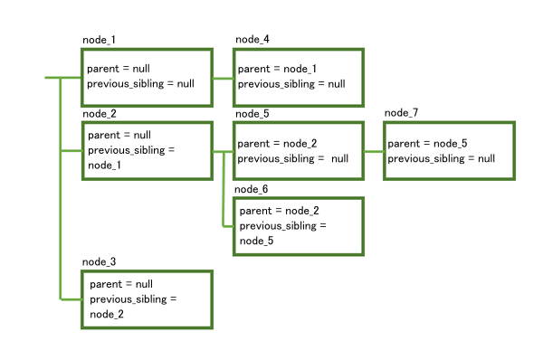
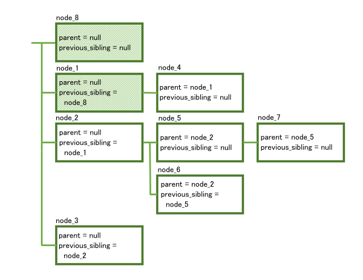
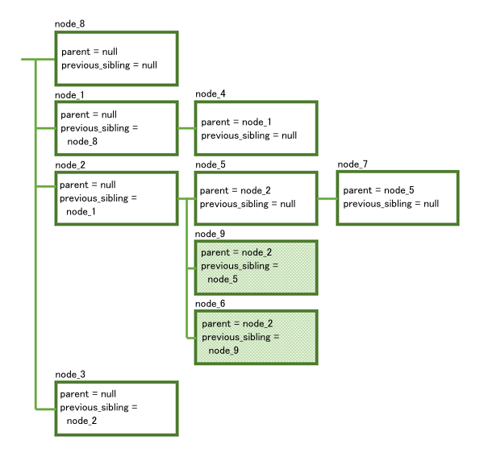
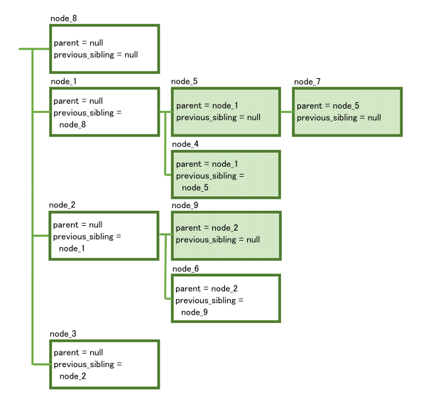
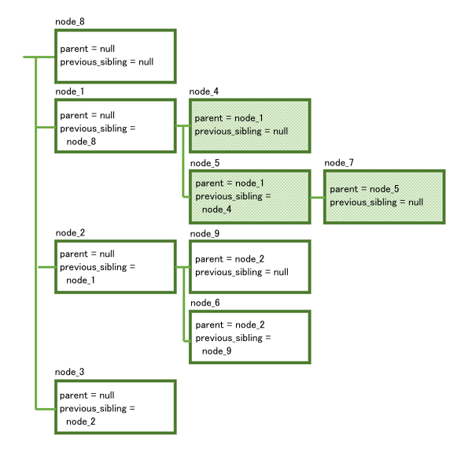
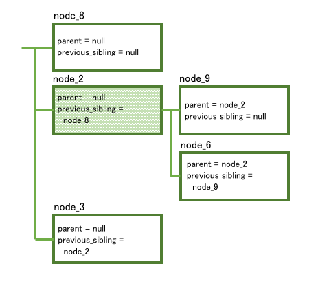
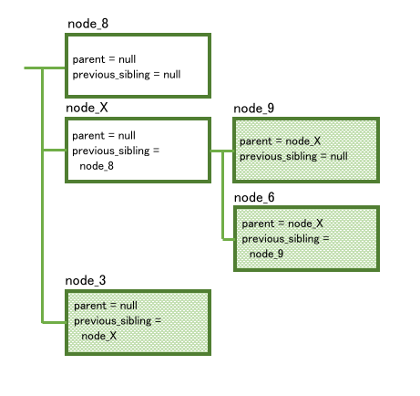

---

copyright:
  years: 2015, 2019
lastupdated: "2019-02-11"

subcollection: assistant

---

{:shortdesc: .shortdesc}
{:new_window: target="_blank"}
{:deprecated: .deprecated}
{:important: .important}
{:note: .note}
{:tip: .tip}
{:pre: .pre}
{:codeblock: .codeblock}
{:screen: .screen}
{:javascript: .ph data-hd-programlang='javascript'}
{:java: .ph data-hd-programlang='java'}
{:python: .ph data-hd-programlang='python'}
{:swift: .ph data-hd-programlang='swift'}

# API を使用したダイアログの変更
{: #api-dialog-modify}

{{site.data.keyword.conversationshort}} REST API は、{{site.data.keyword.conversationshort}} ツールを使用せずにダイアログをプログラムで変更することをサポートします。 /dialog_nodes API を使用して、ダイアログ・ノードを作成、削除、変更することができます。

ダイアログは相互接続ノードのツリーであるということ、有効であるためには特定のルールに従う必要があるということに注意してください。 つまり、あるダイアログ・ノードに何らかの変更を加えると、他のノードやダイアログの構造に連鎖的に影響する可能性があります。 /dialog_nodes API を使用してダイアログを変更する前に、変更がダイアログの残りの部分にどのように影響するかを理解しておく必要があります。 現在のダイアログのバックアップ・コピーを作成するには、そのダイアログがある会話スキルをエクスポートします。詳細については、[スキルのダウンロード](/docs/services/assistant?topic=assistant-skill-add#download-skill)を参照してください。

有効なダイアログは必ず以下の基準を満たしています。

- ダイアログ・ノードごとに固有 ID があります (`dialog_node` プロパティー)。
- 下位ノードはその親ノードを認識しています (`parent` プロパティー)。 一方、親ノードはその子を認識していません。
- ノードは、その直前の兄弟が存在すればそれを認識しています (`previous_sibling` プロパティー)。 これは、同じ親を共有するすべての兄弟が、各ノードが直前のノードを指す 1 つのリンク・リストを形成することを意味します。
- ある特定の親の 1 つの子だけが最初の兄弟になることができます (つまり、その `previous_sibling` はヌル)。
- ノードは、異なる親の子である直前の兄弟を指すことはできません。
- 直前の同じ兄弟を 2 つのノードが指すことはできません。
- ノードは、次に実行される別のノードを指定できます (`next_step` プロパティー)。
- ノードは、自身の親にも自身の兄弟にもなれません。
- ノードには、以下のいずれかの値を含むタイプ・プロパティーが必要です。 タイプ・プロパティーが指定されていない場合、タイプは `standard` になります。

  - `event_handler`: フレーム・ノードまたは個々のスロット・ノードに対して定義されたハンドラー。

    ツールから、スロット付きノードの**「ハンドラーの管理 (Manage handlers)」**リンクをクリックして、フレーム・ノードのハンドラーを定義できます。 (スロット・レベルのイベント・ハンドラーはツールのユーザー・インターフェースに表示されませんが、API を使用して定義できます。)

  - `frame`: `slot` タイプの子ノードを 1 つ以上持つノード。 必要なすべての子スロット・ノードに情報が取り込まれるまで、サービスはフレーム・ノードを終了できません。

    フレーム・ノード・タイプは、ツールではスロット付きのノードとして表されます。 スロットが含まれているノードは、`frame` タイプのノードとして表されます。 これは、`slot` タイプの子ノードとして表される各スロットの親ノードです。

  - `response_condition`: 条件付き応答。

    ツールでは、1 つのノードに 1 つ以上の条件付き応答を追加できます。 定義した各条件付き応答は、基礎 JSON では、`response_condition` タイプの個々のノードとして表されます。

  - `slot`: `frame` タイプのノードの子ノード。

    このノード・タイプは、ツール内では単一ノードに追加された複数のスロットの 1 つとして表されます。 その単一ノードは、JSON では `frame` タイプの親ノードとして表されます。

  - `standard`: 標準的なダイアログ・ノード。 これがデフォルトのタイプです。

- 同じ親ノードを持つ `slot` タイプのノードの兄弟の順序 (`previous_sibling` プロパティーで指定) は、各スロットが処理される順序を表します。
- `slot` タイプのノードには、`frame` タイプの親ノードが必要です。
- `frame` タイプのノードには、`slot` タイプの子ノードが 1 つ以上必要です。
- `response_condition` タイプのノードには、`standard` または `frame` タイプの親ノードが必要です。
- `response_condition` および `event_handler` タイプのノードは、子ノードを持つことができません。
- `event_handler` タイプのノードには、ノード・イベントのタイプを示す以下のいずれかの値を含む `event_name` プロパティーも必要です。

  - `filled`: スロットの*「チェック対象 (Check for)」*フィールドに指定した条件を満たす値がユーザーから提供され、スロットに情報が取り込まれた場合に行う処理を定義します。 この名前のハンドラーは、Found 条件をスロットに定義した場合にのみ存在します。
  - `focus`: スロットに必要な情報の提供をユーザーに促すために表示する質問を定義します。 この名前のハンドラーは、スロットが必要な場合にのみ存在します。
  - `generic`: スロットまたはスロット付きノードの入力中に、ユーザーが尋ねる可能性がある無関係の質問に対処する条件を定義します。
  - `input`: スロットに情報を取り込むためにユーザーから収集した値を持つコンテキスト変数を含むように、メッセージ・コンテキストを更新します。 この名前のハンドラーは、フレーム・ノードのスロットごとに存在する必要があります。
  - `nomatch`: スロット・プロンプトに対するユーザーの応答に有効な値が含まれていない場合の処理を定義します。 この名前のハンドラーは、Not Found 条件をスロットに定義した場合にのみ存在します。

  以下の図は、ツールのユーザー・インターフェース内で、それぞれの名前付きイベントでトリガーされるコードを定義する場所を示しています。

  

- イベント名が `generic` の `event_handler` タイプのノードは、`slot` または `frame` タイプの親を持つことができます。
- イベント名が `focus`、`input`、`filled`、または `nomatch` の `event_handler` タイプのノードには、`slot` タイプの親が必要です。
- 同じ event_name の複数の event_handler を同じ親ノードに関連付けた場合、兄弟の順序が、イベント・ハンドラーの実行順序を表します。
- 同じ親スロット・ノードを持つ `event_handler` ノードの実行順序は、ノード定義の配置に関係なく、同じです。 event_name による次の順序で、イベントはトリガーされます。

  1. focus
  1. input
  1. filled
  1. generic*
  1. nomatch

  *event_name が `generic` の `event_handler` がこのスロットまたは親フレームに対して定義されている場合は、filled と nomatch の event_handler ノードの間で実行されます。

以下の例は、さまざまな変更が加えられることによって連鎖的に変化が起こる場合に、それがどのように生じるかを示しています。

## ノードの作成
{: #api-dialog-modify-create-node}

次のシンプルなダイアログ・ツリーを考えてみます。



次の本体を含む POST 要求を /dialog_nodes に行うことによって、新しいノードを作成できます。

```json
{
  "dialog_node": "node_8"
}
```

ダイアログは次のようになります。



**node_8** は、`parent` の値も `previous_sibling` の値も指定せずに作成されたので、ダイアログ内の最初のノードになりました。 **node_8** を作成することに加えて、サービスは **node_1** も変更して、その `previous_sibling` プロパティーがこの新しいノードを指すようにします。

次のように親と直前の兄弟を指定することにより、ダイアログ内の他の場所にノードを作成できます。

```json
{
  "dialog_node": "node_9",
  "parent": "node_2",
  "previous_sibling": "node_5"
}
```

`parent` と `previous_node` に指定する各値は、次のとおり有効でなければなりません。

- 両方の値とも既存のノードを参照していなければなりません。
- 指定した親は、直前の兄弟の親と同じでなければなりません (直前の兄弟に親がない場合は `null`)。
- 親を `response_condition` または `event_handler` タイプのノードにすることはできません。

結果のダイアログは次のようになります。



**node_9** を作成することに加えて、サービスは *node_6* の `previous_sibling` プロパティーを自動的に更新して、新しいノードを指すようにします。

## 異なる親へのノードの移動
{: #api-dialog-modify-change-parent}

次の本体を含む POST /dialog_nodes/node_5 メソッドを使用して、**node_5** を異なる親に移動しましょう。

```json
{
  "parent": "node_1"
}
```

`parent` に指定する値は、次のとおり有効でなければなりません。
- 既存のノードを参照していなければなりません。
- 変更されるノードを参照していてはなりません (ノードを自身の親にすることはできません)。
- 変更されるノードの子孫を参照していてはなりません。
- `response_condition` または `event_handler` タイプのノードを参照していてはなりません。

この結果、次のような構造に変わります。



ここで、次のようないくつかのことが起こりました。
- **node_5** がその親に移動したとき、**node_7** もそれと一緒に移動しました (**node_7** の `parent` 値が変わらなかったため)。 ノードを移動すると、そのノードのすべての子孫はそのノードに付き添います。
- **node_5** の `previous_sibling` 値を指定しなかったので、このノードが **node_1** の下の最初の兄弟になりました。
- **node_4** の `previous_sibling` プロパティーが `node_5` に更新されました。
- **node_9** の `previous_sibling` プロパティーが `null` に更新されました (このノードが **node_2** の下の最初の兄弟になったため)。

## 兄弟の並べ直し
{: #api-dialog-modify-change-sibling}

ここで、**node_5** を最初の兄弟ではなく 2 番目の兄弟にしましょう。 この操作は、次の本体を含む POST /dialog_nodes/node_5 メソッドを使用して行えます。

```json
{
  "previous_sibling": "node_4"
}
```

`previous_sibling` を変更する場合、新しい値は次のとおり有効でなければなりません。
- 既存のノードを参照していなければなりません。
- 変更されるノードを参照していてはなりません (ノードを自身の兄弟にすることはできません)。
- 同じ親の子を参照していなければなりません (すべての兄弟に同じ親がなければなりません)。

次のように構造が変わります。



繰り返しますが、**node_7** はその親に付き添います。 また、**node_4** が変更されてその `previous_sibling` が `null` になります (このノードが最初の兄弟になったため)。

## ノードの削除
{: #api-dialog-modify-delete-node}

今度は、DELETE /dialog_nodes/node_1 メソッドを使用して、**node_1** を削除しましょう。

結果は次のようになります。



**node_1**、**node_4**、**node_5**、**node_7** がすべて削除されたことに注意してください。 ノードを削除すると、そのノードのすべての子孫も削除されます。 したがって、ルート・ノードを削除すると、実際はダイアログ・ツリーのブランチ全体が削除されることになります。 削除されたノードへの他の参照 (`next_step` 参照など) はすべて、`null` に変更されます。

さらに、**node_2** が更新されて、その新しい直前の兄弟として **node_8** を指すようになります。

## ノードの名前変更
{: #api-dialog-modify-rename-node}

最後に、次の本体を含む POST /dialog_nodes/node_2 メソッドを使用して、**node_2** の名前を変更しましょう。

```json
{
  "dialog_node": "node_X"
}
```



ダイアログの構造は変わっていませんが、また次の複数のノードが変更されて、変更された名前が反映されています。

- **node_9** と **node_6** の `parent` プロパティー
- **node_3** の `previous_sibling` プロパティー

削除されたノードへの他の参照 (`next_step` 参照など) もすべて変更されます。
