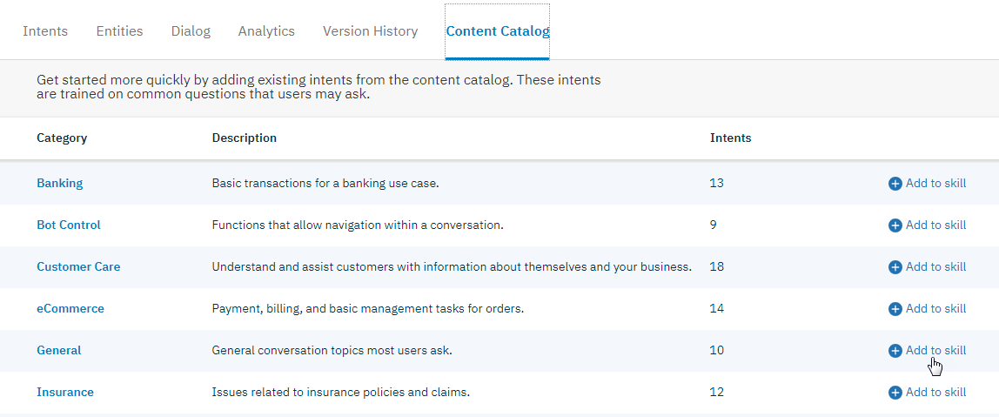

---

copyright:
  years: 2015, 2019
lastupdated: "2019-02-28"

subcollection: assistant

---

{:shortdesc: .shortdesc}
{:new_window: target="_blank"}
{:deprecated: .deprecated}
{:important: .important}
{:note: .note}
{:tip: .tip}
{:pre: .pre}
{:codeblock: .codeblock}
{:screen: .screen}
{:javascript: .ph data-hd-programlang='javascript'}
{:java: .ph data-hd-programlang='java'}
{:python: .ph data-hd-programlang='python'}
{:swift: .ph data-hd-programlang='swift'}

# コンテンツ・カタログの使用
{: #catalog}

***コンテンツ・カタログ*** を使用すると、一般的なインテントを {{site.data.keyword.conversationshort}} ダイアログ・スキルに簡単に追加できます。
{: shortdesc}

カタログから追加するインテントは、開始点を提供するためのものです。カタログ・インテントに追加または編集を行って、ご使用のユース・ケースに合わせて調整します。

## ダイアログ・スキルへのコンテンツ・カタログの追加
{: #catalog-add}

{{site.data.keyword.conversationshort}} ツールを使用してコンテンツ・カタログを追加します。

1.  {{site.data.keyword.conversationshort}} ツールでダイアログ・スキルを開き、**「Content Catalog」**タブをクリックします。

1.  *「Banking」*などのコンテンツ・カタログを選択して、そのカタログに提供されているインテントを表示します。

    

    カタログに含まれているインテントに関する情報が表示されます。

    

    コンテンツ・カタログから追加されるインテントは、他のインテントと名前で区別できます。各インテント名の先頭には、コンテンツ・カタログ名が付加されます。

1.   を選択して、**「Content Catalog」**タブに戻ります。

1.  次に、`「Add to skill」`ボタンをクリックして、ダイアログ・スキルにコンテンツ・カタログを追加します。

1.  ここで**「Intents」**タブを選択し、カタログからインテントが追加されて使用可能になっていることを確認します。

    

新規データを使用してシステム自体のトレーニングが開始されます。

カタログをスキルに追加すると、インテントはトレーニング・データの一部になります。その後 IBM がコンテンツ・カタログを更新した場合、その変更はカタログから追加したインテントに自動的には適用されません。
{: note}

## コンテンツ・カタログの例の編集
{: #catalog-edit-content}

他のインテントと同様に、コンテンツ・カタログのインテントをスキルに追加した後、以下の変更を加えることができます。

- インテントの名前を変更する。
- インテントを削除する。
- 例を追加、編集、または削除する。
- 例を別のインテントに移動する。
